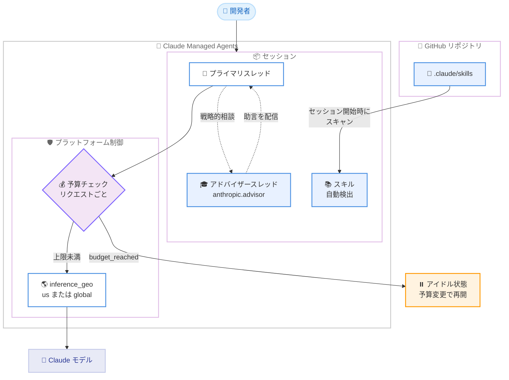

# Claude Managed Agents 大型アップデート: セッション予算、アドバイザー、推論ジオ制御、GitHub スキル読み込み

## メタデータ

| 項目 | 内容 |
|------|------|
| 発表日 | 2026-08-07 |
| ソース | Claude Platform Release Notes |
| カテゴリ | API 更新 |
| 公式リンク | https://platform.claude.com/docs/en/release-notes/overview |

## 概要

Anthropic は 2026 年 8 月 7 日、Claude Managed Agents に 4 つの新機能を追加しました。(1) セッションやデプロイメントに支出上限を設定する**セッション予算 (Session budgets)**、(2) セッションのプライマリスレッドがターン中に上位モデルへ戦略的な相談を行える**アドバイザー (Advisor)**、(3) モデル推論の実行場所をエージェント単位・セッション単位で制御する **`inference_geo`**、(4) マウントした GitHub リポジトリの `.claude/skills` ディレクトリから**スキルを自動読み込み**する機能です。

コスト管理、出力品質、データレジデンシー、スキル配布という運用上の主要課題に同時に対応するアップデートであり、Managed Agents を本番環境で運用する開発者にとって重要な変更です。

## 詳細

### 背景

Claude Managed Agents は、Anthropic がインフラを管理するエージェント実行基盤で、`managed-agents-2026-04-01` ベータヘッダーで利用できます (SDK は自動付与)。エージェントが長時間・自律的に動作するため、支出の予測可能性、判断品質の担保、データ処理場所の統制、スキルの管理といった運用面の要件が高まっていました。今回の 4 機能はいずれもこれらの本番運用要件に応えるものです。

### 主な変更点

#### 1. セッション予算 (Session budgets)

セッション作成時にオプションの `budget` フィールドを渡すことで、公開料金 (list rates) ベースの支出上限を設定できます。

- **計測対象**: モデルトークン (各モデルの公開価格)、Web 検索 ($10/1,000 回)、セッション稼働時間 ($0.08/時間) の合計が「リストコスト」として継続的に計測される
- **上限到達時の挙動**: セッションは終了せず、`stop_reason: budget_reached` でアイドル状態に一時停止する。履歴とサンドボックスは保持される
- **チェックのタイミング**: 上限はモデルリクエスト間で強制される。上限を超えた時点で実行中のリクエストは完走するため、最終的なリストコストは上限をわずかに超え得る (スレッドあたり 1 リクエスト分が上限)
- **再開方法**: 予算の変更 (消費済みリストコストより大きい値) または削除 (`budget: null`) で、一時停止した作業が自動的に再開する。ただし**予算の削除は一方通行**で、削除後に再設定はできない
- **金額の指定**: `amount` は米セント単位の整数を文字列で指定 (`"2500"` = $25.00)。通貨は `USD` のみ
- **上限到達中に受け付けるイベント**: `user.tool_confirmation`、`user.tool_result`、`user.custom_tool_result`、`user.interrupt` のみ。`user.message` などの新規作業は 400 エラーで拒否される
- **マルチエージェントセッション**: 予算は全スレッドで共有され、スレッドごとの上限はない。アドバイザーの相談も同じ予算にカウントされる
- **デプロイメント**: 同じ `budget` オブジェクトを設定でき、開始する各セッションに個別に適用される (累積支出の上限ではない)。デプロイメントの予算はセッションと異なり、`null` でクリアして後から再設定できる
- **注意点**: 公開価格のないモデルを使うエージェント・アドバイザーを含む予算付きセッションの作成は 400 エラーで拒否される。また、Messages API の task budgets (トークン単位の助言的予算) とは別物である

#### 2. アドバイザー (Advisor)

マルチエージェントロスター (`multiagent.agents`) に `{"type": "advisor", "model": "<model id>"}` エントリを追加すると、セッションのプライマリスレッドが、アプローチの計画、行き詰まりの解消、完了前のレビューなどの戦略的ガイダンスをターン中に相談できます。

- **モデル要件**: アドバイザーモデルは最低限の能力基準を満たす必要があり、エージェント自身のモデルがアドバイザーより高性能であってはならない (同等の組み合わせは可)。無効な組み合わせはエージェント保存時に 400 エラー
- **ロスター上の扱い**: ロスターにアドバイザーエントリは最大 1 つ。予約名 `anthropic.advisor` を占有する
- **動作の仕組み**: 各相談はプラットフォームが生成する `anthropic.advisor` という名前のスレッドとして実行され、完了すると自動終了する。助言は `agent.thread_message_received` イベントとしてプライマリスレッドに配信される
- **可視性**: 助言をクライアントが読めるかはアドバイザーモデルのポリシーに依存する。プレーンテキストを返すモデルは読める形で、そうでないモデルは `[{"type": "redacted"}]` プレースホルダーで配信される (エージェント自身はサーバー側で全文を読む)
- **堅牢性**: 相談の失敗や中断がエージェントのターンを失敗させることはない
- **その他**: アドバイザースレッドは同時スレッド上限 (25) の対象外。プロンプトキャッシュは自動。相談はアドバイザーモデルの料金で課金される。Messages API のアドバイザーツールと異なり、`max_uses`、`max_tokens`、`caching` フィールドはない

#### 3. 推論ジオ制御 (inference_geo)

エージェント作成時に `model` オブジェクト内で `inference_geo` を設定すると、そのエージェントを実行するセッションのモデルリクエストを処理する地理的リージョンを固定できます。セッション作成時に単一セッション単位でオーバーライドすることも可能です。

- **値**: `"global"` (デフォルト、最適なパフォーマンスと可用性のため任意のリージョンで実行) と `"us"` (米国内インフラのみ)
- **デフォルト動作**: ピン留めのないエージェントは、リクエストごとにワークスペースのデフォルト推論ジオに従う
- **料金**: Claude 4.6 以降のモデルで `inference_geo: "us"` を指定すると、全トークン価格カテゴリ (入力、出力、キャッシュ書き込み・読み取り) で標準料金の 1.1 倍が適用される。Managed Agents でエージェントのモデル設定を `"us"` にピン留めした場合も同様
- **対応モデル**: Claude 4.6 以降。それ以前のモデルでは 400 エラー
- **対応プラットフォーム**: Claude API (ファーストパーティ) と Claude Platform on AWS。Bedrock や Google Cloud ではエンドポイント URL や推論プロファイルでリージョンが決まるため対象外

#### 4. GitHub リポジトリからのスキル読み込み

セッションが `github_repository` リソースでリポジトリをマウントすると、リポジトリルートの `.claude/skills` ディレクトリがセッション開始時にスキャンされ、見つかったスキルがそのセッションで自動的に利用可能になります。

- **アップロード不要**: Skills API へのアップロードも、エージェントの `skills` 配列へのエントリも不要
- **検出パス**: `.claude/skills/<skill-name>/SKILL.md` の形式 (ルート直下・1 階層) のみ。ネストが深い場所やルート外の `skills` ディレクトリは検出されない
- **チェックアウト状態に追従**: リソースの `checkout` で指定したブランチ・コミット、未指定ならデフォルトブランチの内容が読み込まれる。スキャンはセッション開始時の 1 回のみで、セッション中のコミットは反映されない
- **既存スキルとの共存**: `skills` 配列で添付したスキルと併用でき、名前が重複しても両方が別々のパスで利用できる
- **前提条件**: 検出はエージェントの `read` ツール (デフォルト有効) に依存する。クラウドサンドボックスで動作し、セルフホストサンドボックスは GitHub リポジトリリソース自体をサポートしない
- **セキュリティ上の注意**: リポジトリのスキルはエージェントへの指示そのものであり、マウントしたリポジトリはエージェントの信頼境界の一部になる。コミット権限を持つ誰もがスキルを追加・変更でき、レビューなしにセッション開始時に読み込まれるため、信頼できるリポジトリのみをマウントし、外部コントリビューションを受けるリポジトリは事前に `.claude/skills` を確認することが推奨される

### 技術的な詳細

セッション予算のライフサイクルは次のとおりです。

1. セッション作成時に `budget.max_list_cost` を設定する (後付けは不可)
2. プラットフォームが各モデルリクエストの前に消費済みリストコストを確認する
3. 上限到達で各スレッドが一時停止し、イベントストリームに `session.thread_status_idle` (`budget_reached`) → `session.usage` → `session.status_idle` (`budget_reached`) の順で通知される
4. 予算の変更・削除で作業が自動再開する

予算変更時の新しい値は、旧上限ではなくセッションの `usage.list_cost` を基準に、それより 1 セント以上大きい値を設定することが推奨されます (報告値は丸められており、実際の消費コストよりわずかに小さい場合があるため)。

## 開発者への影響

### 対象

- Claude Managed Agents でエージェントを本番運用している開発者
- 自律エージェントのコスト管理・ガバナンスを担当するチーム
- データレジデンシー要件 (米国内処理など) を持つ組織
- スキルをコードリポジトリで管理・配布したい開発チーム

### 必要なアクション

- **コスト管理**: 長時間実行セッションやスケジュールデプロイメントに `budget` を設定し、`session.usage` イベントと `budget_reached` 停止理由のハンドリングをクライアントに実装する。上限は 1 リクエスト分の超過マージンを見込んで設定する
- **品質向上**: 複雑な判断を伴うエージェントには、ロスターに `{"type": "advisor"}` エントリを追加し、システムプロンプトで相談すべきタイミングを指示する。助言をイベントストリームで読みたい場合は、プレーンテキストを返すアドバイザーモデルを選ぶ
- **データレジデンシー**: 米国内処理が必要なワークロードでは、エージェントの `model` 設定に `inference_geo: "us"` を追加する。1.1 倍の料金が適用される点をコスト見積もりに反映する
- **スキル管理**: リポジトリルートの `.claude/skills/<skill-name>/SKILL.md` 形式でスキルを配置すれば、セッションへの自動読み込みが可能になる。外部コントリビューションを受けるリポジトリではマウント前にスキルの内容をレビューする

### 移行ガイド (該当する場合)

破壊的変更はありません。4 機能ともオプトインであり、既存のエージェント・セッションはそのまま動作します。なお、予算はセッション作成時にのみ付与でき、削除後の再設定はできないため、運用フローの設計時に注意が必要です。

## コード例

セッション予算とアドバイザーを組み合わせた例です。

```bash
# アドバイザー付きエージェントを作成
curl -fsS https://api.anthropic.com/v1/agents \
  -H "x-api-key: $ANTHROPIC_API_KEY" \
  -H "anthropic-version: 2023-06-01" \
  -H "anthropic-beta: managed-agents-2026-04-01" \
  -H "content-type: application/json" \
  -d '{
    "name": "Backend engineer",
    "model": "claude-sonnet-5",
    "system": "You implement backend features end to end. Consult the advisor before major backend design decisions.",
    "multiagent": {
      "type": "coordinator",
      "agents": [
        {"type": "advisor", "model": "claude-opus-5"}
      ]
    }
  }'

# 予算 $25.00 と GitHub リポジトリ付きでセッションを作成
curl -fsSL https://api.anthropic.com/v1/sessions \
  -H "x-api-key: $ANTHROPIC_API_KEY" \
  -H "anthropic-version: 2023-06-01" \
  -H "anthropic-beta: managed-agents-2026-04-01" \
  -H "content-type: application/json" \
  -d '{
    "agent": "'$AGENT_ID'",
    "environment_id": "'$ENVIRONMENT_ID'",
    "budget": {
      "type": "limit",
      "max_list_cost": {"amount": "2500", "currency": "USD"}
    },
    "resources": [
      {
        "type": "github_repository",
        "url": "https://github.com/org/repo",
        "authorization_token": "ghp_your_github_token"
      }
    ]
  }'

# 予算に達したセッションを新しい上限で再開
curl -sS --fail-with-body "https://api.anthropic.com/v1/sessions/$SESSION_ID" \
  -H "x-api-key: $ANTHROPIC_API_KEY" \
  -H "anthropic-version: 2023-06-01" \
  -H "anthropic-beta: managed-agents-2026-04-01" \
  -H "content-type: application/json" \
  -d '{
    "budget": {
      "type": "limit",
      "max_list_cost": {"amount": "4000", "currency": "USD"}
    }
  }'
```

推論ジオ制御は、エージェント作成時の `model` オブジェクトで設定します。

```json
{
  "name": "US-only agent",
  "model": {
    "id": "claude-sonnet-5",
    "inference_geo": "us"
  },
  "system": "You are a compliance-sensitive agent."
}
```

## アーキテクチャ図 (該当する場合)



## 関連リンク

- [Claude Platform Release Notes](https://platform.claude.com/docs/en/release-notes/overview)
- [Session budgets](https://platform.claude.com/docs/en/managed-agents/budgets)
- [Multiagent orchestration - Give the session an advisor](https://platform.claude.com/docs/en/managed-agents/multiagent-orchestration#give-the-session-an-advisor)
- [Data residency](https://platform.claude.com/docs/en/manage-claude/data-residency)
- [Skills - Load skills from a GitHub repository](https://platform.claude.com/docs/en/managed-agents/skills#load-skills-from-a-github-repository)
- [Scheduled deployments](https://platform.claude.com/docs/en/managed-agents/scheduled-deployments)

## まとめ

今回のアップデートは、Claude Managed Agents の本番運用に必要な統制機能を大きく前進させるものです。セッション予算はプラットフォーム側で強制されるハードキャップとして自律エージェントの支出リスクを抑え、アドバイザーは上位モデルへの相談という新しいパターンで出力品質を高めます。`inference_geo` はコンプライアンス要件の厳しい組織での採用障壁を下げ、GitHub リポジトリからのスキル自動読み込みはスキルの配布と版管理をコードと同じワークフローに統合します。Managed Agents を運用中のチームは、まずコスト管理の観点からセッション予算の導入を検討することを推奨します。
