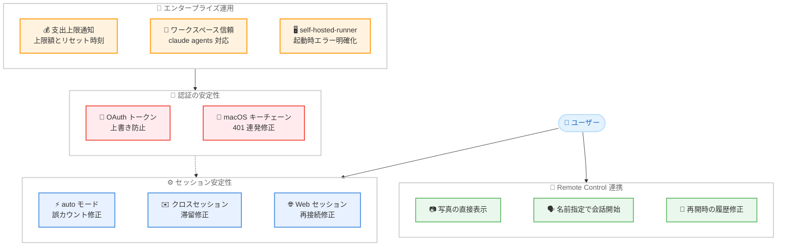

# Claude Code v2.1.225 & v2.1.226 リリース — ゲートウェイ支出上限の通知対応、認証安定性の修正、Remote Control 連携強化

## メタデータ

| 項目 | 内容 |
|------|------|
| 発表日 | 2026-08-08 |
| ソース | Claude Code Changelog |
| カテゴリ | Claude Code アップデート |
| 公式リンク | https://github.com/anthropics/claude-code/blob/main/CHANGELOG.md |

## 概要

Claude Code v2.1.225 および v2.1.226 (2026 年 8 月 8 日、JST 基準) がリリースされた。v2.1.225 は新機能 2 件、修正 8 件、改善 1 件、SendMessage 関連の機能強化 2 件と VSCode 拡張の修正 1 件の計 14 項目を含むリリースである。v2.1.226 はバグ修正と信頼性向上のみの小規模パッチとなる。

本リリースの主要テーマは 3 つある。第一に、**エンタープライズ運用機能の強化**。ゲートウェイの支出上限 (spend-limit) が使用量警告に統合され、上限到達時に上限額、リセット時刻、運用者からのメッセージが表示されるようになった。第二に、**認証とヘッドレスセッションの安定性向上**。長期有効な `CLAUDE_CODE_OAUTH_TOKEN` が一時的な 401 エラーによって短期トークンに置き換えられ、ヘッドレスセッションが再起動まで機能しなくなる問題や、macOS のキーチェーン読み取りタイムアウトに起因する MCP OAuth の 401 エラー連発が修正された。第三に、**Remote Control と SendMessage の連携強化**。Claude アプリから添付した写真の直接表示、他マシンの Remote Control セッションへの名前指定での会話開始などが実現している。

## 詳細

### 背景

v2.1.224 では `claude self-hosted-runner` によるセルフホスト環境のサポートが Team および Enterprise プランに追加された。本リリース v2.1.225 はその直後のフォローアップとして、self-hosted-runner の起動時エラー処理や、Claude Code on the web セッションの再接続問題など、リモート実行系機能の信頼性を高める修正を多く含んでいる。

また、企業内で LLM ゲートウェイを経由して Claude Code を利用する形態が広がる中、運用者が設定した支出上限をユーザーに正しく伝える仕組みが求められていた。本リリースのゲートウェイ支出上限サポートは、ゲートウェイ側も 2.1.225 に対応していることを前提に、この運用上の課題に応えるものである。

### 主な変更点

#### 新機能 (v2.1.225)

1. **ゲートウェイ支出上限の通知対応**: Claude Code の使用量警告がゲートウェイの支出上限 (spend-limit) に対応した。上限到達時のメッセージに、上限額、リセット時刻、運用者からのメッセージが表示される (ゲートウェイ側も 2.1.225 が必要)

2. **`claude agents` へのワークスペース信頼プロンプト追加**: 信頼されていないディレクトリで `claude agents` を起動した際に、`claude` と同様のワークスペース信頼プロンプトが表示されるようになった

#### 認証関連の修正 (v2.1.225)

3. **`CLAUDE_CODE_OAUTH_TOKEN` の上書き問題修正**: 一時的な 401 エラーが発生した際に、長期有効な `CLAUDE_CODE_OAUTH_TOKEN` が保存済みログインの短期トークンに置き換えられ、ヘッドレスセッションが再起動まで機能しなくなる問題を修正

4. **macOS での MCP OAuth の 401 エラー連発修正**: macOS でキーチェーン読み取りがタイムアウトした後、MCP OAuth サーバーが未認証であるかのように 401 エラーを連発して断続的に失敗する問題を修正

#### 安定性修正 (v2.1.225)

5. **auto モードの連続ブロック上限の誤カウント修正**: auto モードが、自身の権限チェックに対するセーフティフィルターの拒否を連続ブロック上限にカウントしてしまう問題を修正。アクションは引き続き拒否されるが、モデルにはリトライではなく次の作業に進むよう伝えられるようになった

6. **クロスセッションメッセージの滞留修正**: ヘッドレスセッションおよび起動中に、クロスセッションメッセージが通知も有効期限もないまま滞留する問題を修正

7. **Remote Control セッション再開時の履歴破損修正**: 非常に大きな会話がコンパクト化された後、Remote Control セッションの再開時に会話履歴が壊れる問題を修正

8. **エージェントリストのホバーによる起動ディレクトリ変更修正**: エージェントリストで別プロジェクトのセッションにマウスホバーすると、次に起動するエージェントの作業ディレクトリが変わってしまう問題を修正

9. **`claude self-hosted-runner` の起動時エラー処理修正**: `--base-dir` が作成または書き込みできない場合に、登録後にすべてのセッションが失敗する問題を修正。起動時に明確なエラーを出して終了するようになった

10. **Claude Code on the web の再接続問題修正**: Web セッションがスタック状態と誤報告され、再接続のたびに増大するイベントバックログを再送信する問題を修正

#### Remote Control と SendMessage の強化 (v2.1.225)

11. **写真の直接表示**: Claude アプリから添付した写真が、別途ツール呼び出しでディスクから読み込まれるのではなく、Claude に直接表示されるようになった

12. **名前指定での会話開始**: SendMessage が、他マシンの Remote Control セッションに対して名前指定で会話を開始できるようになった (`ListAgents` では `name [ref]` 形式で表示)。従来は相手からメッセージを受けた後の返信のみ可能だった

13. **確認済み受信者の固定**: 一度確認した Remote Control の受信者が、相手側のリストを確認できない場合でも、このマシン上の同名セッションと入れ替わらないようになった

#### VSCode 拡張の修正 (v2.1.225)

14. **Focus ビューの折りたたみ問題修正**: Focus ビューが最新の To-Do リスト、保留中の質問のコンテキスト、確定済みの回答を折りたたんで隠してしまう問題を修正。思考のみの折りたたみには「Thought for Ns」と表示され、ターン完了時に再度折りたたまれる

#### v2.1.226

15. **バグ修正と信頼性向上**: 詳細は公開されていないが、バグ修正と信頼性の改善が含まれる

### 技術的な詳細

#### ゲートウェイ支出上限の通知

企業環境では、LLM ゲートウェイを経由して Claude API へのアクセスを集中管理し、部門やユーザーごとに支出上限を設定する運用が一般的である。従来、ゲートウェイ側で上限に達した場合、ユーザーには一般的なエラーしか表示されず、原因の特定が困難だった。本リリースでは、ゲートウェイが返す支出上限情報を Claude Code の使用量警告が解釈し、上限額、リセット時刻、運用者が設定したメッセージ (問い合わせ先など) をユーザーに直接提示する。この機能はクライアントとゲートウェイの双方が 2.1.225 に対応している必要がある。

#### `CLAUDE_CODE_OAUTH_TOKEN` の保護

`CLAUDE_CODE_OAUTH_TOKEN` は CI/CD やヘッドレス環境向けの長期有効なトークンである。修正前は、ネットワークの一時的な問題などで 401 エラーが発生すると、認証リカバリー処理が環境変数のトークンではなく保存済みログインの短期トークンにフォールバックし、その短期トークンの失効後はセッション再起動までリクエストが失敗し続けていた。修正により、環境変数で指定された長期トークンが一時的なエラーで置き換えられることがなくなり、無人運用の信頼性が向上した。

#### auto モードの連続ブロック上限

auto モードには、ツール呼び出しが連続してブロックされた場合にセッションを停止する安全機構 (連続ブロック上限) がある。修正前は、権限チェック自体がセーフティフィルターに拒否された場合もこの上限にカウントされ、モデルが同じアクションをリトライすることで上限に達しやすくなっていた。修正後は、アクションの拒否は維持しつつ、モデルに「リトライせず次に進む」よう明示的に伝えることで、無用なセッション停止を防いでいる。

#### Remote Control の写真添付処理

従来、Claude アプリから Remote Control セッションに写真を添付すると、写真は一旦ディスクに保存され、Claude が Read ツールで読み込む必要があった。本改善により、添付された写真はツール呼び出しを介さず Claude に直接コンテンツとして提示されるため、ターン数の削減と応答の高速化が期待できる。

## アーキテクチャ図



## 開発者への影響

### 対象

- **ゲートウェイ経由の企業ユーザー**: 支出上限到達時に、上限額、リセット時刻、運用者のメッセージが表示されるようになり、原因特定と問い合わせが容易になった。利用にはゲートウェイ側の 2.1.225 対応が必要
- **CI/CD およびヘッドレス環境の利用者**: `CLAUDE_CODE_OAUTH_TOKEN` が一時的な 401 エラーで無効化される問題が解消され、無人運用の信頼性が向上
- **macOS ユーザー**: キーチェーン読み取りタイムアウト後の MCP OAuth の 401 エラー連発が修正され、MCP サーバー接続が安定
- **Remote Control 利用者**: 写真の直接表示、名前指定での会話開始、大規模会話コンパクト化後の履歴破損修正により、モバイル連携の体験が向上
- **セルフホスト環境の管理者**: `--base-dir` の問題が起動時に明確なエラーとして検出されるようになり、登録後の全セッション失敗を回避できる
- **VSCode 拡張ユーザー**: Focus ビューで To-Do リストや保留中の質問が折りたたまれて見えなくなる問題が解消

### 必要なアクション

以下のコマンドで最新バージョンに更新できる。

```bash
# npm でのアップデート
npm update -g @anthropic-ai/claude-code

# Homebrew でのアップデート
brew upgrade claude-code

# 現在のバージョン確認
claude --version
```

**推奨される確認事項:**

- **ゲートウェイ運用者**: 支出上限通知を利用する場合、ゲートウェイ側も 2.1.225 に更新されていることを確認
- **ヘッドレス環境の利用者**: `CLAUDE_CODE_OAUTH_TOKEN` を使用しているセッションで、401 エラー後も長期トークンが維持されることを確認
- **`claude agents` 利用者**: 信頼されていないディレクトリで起動した場合、新たにワークスペース信頼プロンプトが表示される点に留意

### 移行ガイド (該当する場合)

本リリースに破壊的変更はないが、以下の動作変更に留意が必要である。

**`claude agents` のワークスペース信頼プロンプト:**

信頼されていないディレクトリで `claude agents` を起動すると、`claude` と同様の信頼確認プロンプトが表示されるようになった。自動化スクリプトで未信頼ディレクトリを対象に `claude agents` を起動している場合、事前にディレクトリを信頼済みにしておく必要がある。

**`claude self-hosted-runner` の起動時検証:**

`--base-dir` に指定したディレクトリが作成または書き込みできない場合、従来は登録後にセッションが失敗していたが、今後は起動時にエラーで終了する。起動スクリプトでの終了コード処理を確認しておくとよい。

## コード例

### ヘッドレス環境での長期トークン利用

```bash
# 長期有効なトークンを発行 (修正により一時的な 401 で無効化されなくなった)
claude setup-token

# ヘッドレスセッションで利用
export CLAUDE_CODE_OAUTH_TOKEN="<発行されたトークン>"
claude -p "テストを実行して結果を報告してください"
```

### セルフホストランナーの起動

```bash
# v2.1.225 で修正: --base-dir が書き込み不可の場合、起動時に明確なエラーで終了
claude self-hosted-runner --base-dir /var/lib/claude-runner
```

## 関連リンク

- [Claude Code Changelog](https://github.com/anthropics/claude-code/blob/main/CHANGELOG.md)
- [Claude Code GitHub リポジトリ](https://github.com/anthropics/claude-code)
- [Claude Code ドキュメント](https://docs.anthropic.com/en/docs/claude-code)
- [Claude Code v2.1.223](./2026-08-05-claude-code-v2-1-223.md)

## まとめ

Claude Code v2.1.225 & v2.1.226 は、エンタープライズ運用、認証の安定性、Remote Control 連携の 3 軸に焦点を当てたリリースである。特に以下の 3 点が注目に値する。

第一に、**エンタープライズ運用機能の充実**。ゲートウェイ支出上限の通知対応により、企業環境でのコスト管理とユーザーへの情報提供が改善された。前バージョン v2.1.224 で導入されたセルフホスト環境についても、起動時エラー処理の明確化が図られている。

第二に、**無人運用の信頼性向上**。`CLAUDE_CODE_OAUTH_TOKEN` の上書き問題、クロスセッションメッセージの滞留、auto モードの連続ブロック上限の誤カウントなど、ヘッドレスセッションや自動化環境で発生していた問題が集中的に修正された。

第三に、**Remote Control と SendMessage の連携強化**。写真の直接表示による応答の効率化に加え、他マシンのセッションへ名前指定で会話を開始できるようになり、マシンをまたいだエージェント間コミュニケーションの起点が広がった。

CI/CD やヘッドレス環境で Claude Code を運用しているユーザー、および macOS で MCP OAuth サーバーを利用しているユーザーには、速やかなアップデートを推奨する。
