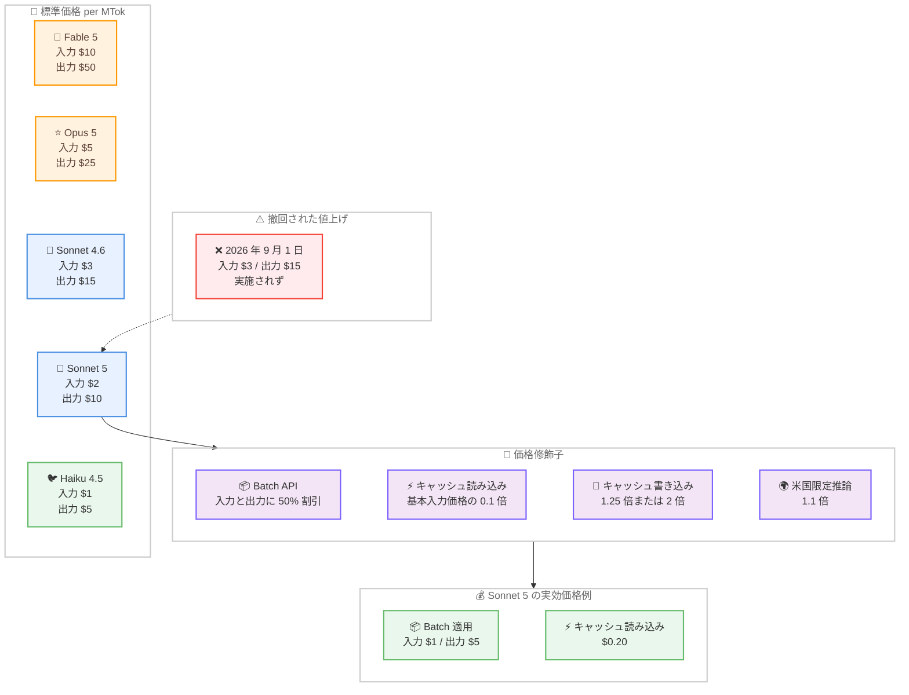
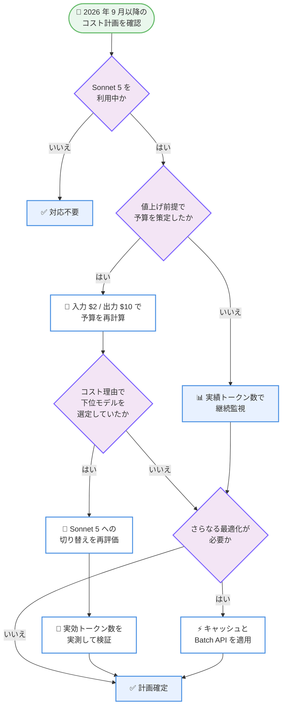

# Claude Sonnet 5 の導入価格が標準価格化 --- 2026 年 9 月 1 日の値上げは実施されず

## メタデータ

| 項目 | 内容 |
|------|------|
| 発表日 | 2026-08-10 |
| ソース | Claude Developer Platform Release Notes |
| カテゴリ | 料金改定 |
| 公式リンク | https://platform.claude.com/docs/en/about-claude/pricing |

## 概要

Anthropic は 2026 年 8 月 10 日、Claude Sonnet 5 の導入価格である入力 $2/MTok、出力 $10/MTok を、そのまま標準価格とすることを発表した。2026 年 6 月 30 日のリリース時に予告されていた 2026 年 9 月 1 日からの入力 $3/MTok、出力 $15/MTok への値上げは実施されない。

これは新機能の追加ではなく料金体系の確定であるが、Sonnet 5 を本番環境で利用する開発者にとっては実質的な恒久的コスト削減を意味する。値上げを前提にコスト計画を立てていた場合、9 月以降の想定支出を約 33% 引き下げて再計算できる。

## 詳細

### 背景

Claude Sonnet 5 は 2026 年 6 月 30 日にリリースされた Sonnet ファミリーの最新モデルであり、既存レポート [2026-06-30-claude-sonnet-5.md](./2026-06-30-claude-sonnet-5.md) で詳細を扱っている。同レポートに記録されている当初の料金体系は以下の通りである。

| 期間 | 入力 | 出力 |
|------|------|------|
| 導入価格 (2026/8/31 まで) | $2/MTok | $10/MTok |
| 標準価格 (2026/9/1 以降) | $3/MTok | $15/MTok |

当初の設計意図として、この導入価格は Sonnet 5 で採用された新トークナイザーによるコスト増加を相殺するためのものであった。同レポートでは「新しいトークナイザーにより、同じ入力テキストに対してトークン数が約 1.0-1.35 倍に増加する」「導入価格はこのトークナイザー変更によるコスト増加を相殺するように設計されており、移行期間中はおおむねコストニュートラルとなる」と記載されている。

つまり当初の想定では、2026 年 9 月 1 日以降は「単価が Sonnet 4.6 と同じ $3/$15 に戻り、かつトークン数が約 30% 増える」ため、Sonnet 4.6 からの移行ユーザーは実効コストの上昇に直面する見込みであった。今回の発表はこの前提を覆すものであり、トークナイザー変更による増加分を単価の引き下げで恒久的に吸収する形となった。

なお Sonnet 5 の主要スペックは既存レポートの通り変更されていない。モデル ID は `claude-sonnet-5`、コンテキストウィンドウは 1,000,000 トークン、最大出力は 128,000 トークン、アダプティブシンキングはデフォルト有効である。

### 主な変更点

- **導入価格の恒久化**: 入力 $2/MTok、出力 $10/MTok が標準価格として確定
- **予定されていた値上げの撤回**: 2026 年 9 月 1 日に予定されていた入力 $3/MTok、出力 $15/MTok への引き上げは実施されない
- **期限の撤廃**: 「2026 年 8 月 31 日まで」という有効期限がなくなり、価格に関する時限的な条件が解消された
- **派生価格への波及**: キャッシュ書き込み、キャッシュ読み込み、Batch API の各価格も $2/$10 を基準として確定

公式の料金ページには、この変更が注記として明記されている。

> The $2/$10 per million input/output token pricing for Claude Sonnet 5, announced at launch as introductory pricing through August 31, 2026, is now the standard price. The previously scheduled increase to $3/$15 per million input/output tokens on September 1, 2026 will not occur.

### 技術的な詳細

**Sonnet 5 の確定価格。**

公式料金ページで確認した Sonnet 5 の全価格カテゴリは以下の通りである。

| カテゴリ | 価格 |
|----------|------|
| 基本入力トークン | $2 / MTok |
| 5 分キャッシュ書き込み | $2.50 / MTok |
| 1 時間キャッシュ書き込み | $4 / MTok |
| キャッシュヒットおよびリフレッシュ | $0.20 / MTok |
| 出力トークン | $10 / MTok |
| Batch API 入力 | $1 / MTok |
| Batch API 出力 | $5 / MTok |

**価格修飾子。**

キャッシュおよび Batch API の価格は、基本入力価格に対する乗数として定義されている。

| 操作 | 乗数 | 有効期間 |
|------|------|----------|
| 5 分キャッシュ書き込み | 基本入力価格の 1.25 倍 | 5 分間 |
| 1 時間キャッシュ書き込み | 基本入力価格の 2 倍 | 1 時間 |
| キャッシュ読み込み | 基本入力価格の 0.1 倍 | 直前の書き込みと同じ期間 |

Batch API は入力と出力の両方に 50% の割引が適用される。また `inference_geo` を `"us"` に指定した場合は、入力、出力、キャッシュ書き込み、キャッシュ読み込みのすべてに 1.1 倍の乗数が適用される。これらの修飾子は互いに重ねて適用される。

**ロングコンテキストの扱い。**

Claude 4.6 以降のモデルは、1M トークンのコンテキストウィンドウ全体が標準価格で提供される。公式料金ページには「900k トークンのリクエストは 9k トークンのリクエストと同じ単価で課金される」と明記されており、200K トークンを超えるリクエストへの追加料金は存在しない。キャッシュと Batch API の割引もコンテキストウィンドウ全体にわたって標準の割引率で適用される。

**他モデルとの比較。**

公式料金ページで確認した主要モデルの価格は以下の通りである。

| モデル | 基本入力 | 5 分キャッシュ書き込み | 1 時間キャッシュ書き込み | キャッシュ読み込み | 出力 |
|--------|---------|-------------------|-------------------|---------------|------|
| Claude Fable 5 | $10 / MTok | $12.50 / MTok | $20 / MTok | $1 / MTok | $50 / MTok |
| Claude Opus 5 | $5 / MTok | $6.25 / MTok | $10 / MTok | $0.50 / MTok | $25 / MTok |
| Claude Opus 4.8 | $5 / MTok | $6.25 / MTok | $10 / MTok | $0.50 / MTok | $25 / MTok |
| Claude Sonnet 5 | $2 / MTok | $2.50 / MTok | $4 / MTok | $0.20 / MTok | $10 / MTok |
| Claude Sonnet 4.6 | $3 / MTok | $3.75 / MTok | $6 / MTok | $0.30 / MTok | $15 / MTok |
| Claude Haiku 4.5 | $1 / MTok | $1.25 / MTok | $2 / MTok | $0.10 / MTok | $5 / MTok |

Batch API 適用時の価格は以下の通りである。

| モデル | Batch 入力 | Batch 出力 |
|--------|-----------|-----------|
| Claude Fable 5 | $5 / MTok | $25 / MTok |
| Claude Opus 5 | $2.50 / MTok | $12.50 / MTok |
| Claude Sonnet 5 | $1 / MTok | $5 / MTok |
| Claude Sonnet 4.6 | $1.50 / MTok | $7.50 / MTok |
| Claude Haiku 4.5 | $0.50 / MTok | $2.50 / MTok |

この価格表から、Sonnet 5 は Opus 5 の 40% の単価、Haiku 4.5 の 2 倍の単価という位置づけになる。旧世代の Sonnet 4.6 に対しては単価ベースで 33% 安い。

**トークナイザーに関する注意。**

公式料金ページには「Claude 4.7 以降のモデルと Claude Mythos Preview は新しいトークナイザーを使用し、同じテキストに対して約 30% 多くのトークンを生成する。Claude Sonnet 4.6 以前のモデルは以前のトークナイザーを使用する」と記載されている。したがって Sonnet 4.6 との比較においては、単価差の 33% がそのまま実効コスト差になるわけではない点に注意が必要である。

## 開発者への影響

### 対象

- Sonnet 5 を本番環境で利用しているすべての開発者
- 2026 年 9 月以降の API 予算を値上げ前提で策定した組織
- Sonnet 5 と Opus 5 のどちらを使うか検討中のプロジェクト
- Sonnet 4.6 から Sonnet 5 への移行を保留していたアプリケーション

### 必要なアクション

コード変更やモデル ID の変更は不要である。必要なのは以下のコスト計画の見直しである。

1. **予算の再計算**: 2026 年 9 月以降の想定支出を $3/$15 から $2/$10 に置き換えて再計算する
2. **モデル選定の再評価**: Sonnet 5 の恒久的な価格優位が確定したため、コスト理由で Haiku 4.5 や Sonnet 4.6 を選んでいたワークロードを再評価する
3. **移行判断の再開**: 値上げ予定を理由に Sonnet 4.6 からの移行を保留していた場合、判断を再開する
4. **実効コストの実測**: トークナイザー差があるため、単価だけでなく実際のトークン消費量を計測して比較する

### コスト影響の試算

月間 100M 入力トークン、20M 出力トークンを消費するワークロードを想定して、撤回された値上げの影響額を計算する。

**撤回前の想定価格 ($3/$15) での試算。**

| 項目 | 計算 | 金額 |
|------|------|------|
| 入力 | 100 MTok × $3 | $300.00 |
| 出力 | 20 MTok × $15 | $300.00 |
| **合計** | | **$600.00** |

**確定した標準価格 ($2/$10) での試算。**

| 項目 | 計算 | 金額 |
|------|------|------|
| 入力 | 100 MTok × $2 | $200.00 |
| 出力 | 20 MTok × $10 | $200.00 |
| **合計** | | **$400.00** |

差額は月間 $200.00 であり、削減率は 33.3% である。年間換算では $2,400.00 の支出回避となる。

**キャッシュ利用時の試算。**

同じワークロードで入力 100M トークンのうち 90M トークンがキャッシュ読み込み、10M トークンが通常入力である場合を計算する。

| 項目 | $3/$15 での計算 | 金額 | $2/$10 での計算 | 金額 |
|------|----------------|------|----------------|------|
| 通常入力 | 10 MTok × $3 | $30.00 | 10 MTok × $2 | $20.00 |
| キャッシュ読み込み | 90 MTok × $0.30 | $27.00 | 90 MTok × $0.20 | $18.00 |
| 出力 | 20 MTok × $15 | $300.00 | 20 MTok × $10 | $200.00 |
| **合計** | | **$357.00** | | **$238.00** |

キャッシュを併用する構成では差額は月間 $119.00 となる。出力トークンの比重が大きいため、削減効果は主に出力側から生じる。

**Batch API 利用時の試算。**

| 項目 | 計算 | 金額 |
|------|------|------|
| 入力 | 100 MTok × $1 | $100.00 |
| 出力 | 20 MTok × $5 | $100.00 |
| **合計** | | **$200.00** |

Batch API を併用すると、同じワークロードを月間 $200.00 で処理できる。これは撤回された $3/$15 の通常価格 $600.00 に対して 3 分の 1 の水準である。

**他モデルとの同一ワークロード比較。**

| モデル | 入力 100 MTok | 出力 20 MTok | 合計 |
|--------|-------------|------------|------|
| Claude Fable 5 | $1,000.00 | $1,000.00 | $2,000.00 |
| Claude Opus 5 | $500.00 | $500.00 | $1,000.00 |
| Claude Sonnet 4.6 | $300.00 | $300.00 | $600.00 |
| Claude Sonnet 5 | $200.00 | $200.00 | $400.00 |
| Claude Haiku 4.5 | $100.00 | $100.00 | $200.00 |

**Sonnet 4.6 との実効コスト比較。**

Sonnet 4.6 は旧トークナイザーを使用するため、単価差 33% をそのまま実効コスト差とみなすことはできない。Sonnet 4.6 で入力 100M トークン、出力 20M トークンとなるテキストが、Sonnet 5 の新トークナイザーで 1.3 倍のトークン数になると仮定した場合の比較は以下の通りである。

| モデルと価格 | 入力 | 出力 | 合計 |
|-------------|------|------|------|
| Sonnet 4.6 $3/$15 | 100 MTok × $3 = $300.00 | 20 MTok × $15 = $300.00 | $600.00 |
| Sonnet 5 確定価格 $2/$10 | 130 MTok × $2 = $260.00 | 26 MTok × $10 = $260.00 | $520.00 |
| Sonnet 5 撤回された $3/$15 | 130 MTok × $3 = $390.00 | 26 MTok × $15 = $390.00 | $780.00 |

この試算では、値上げが実施されていた場合 Sonnet 5 は Sonnet 4.6 より約 30% 高くなる計算であった。今回の確定により、トークン数が 1.3 倍に増える前提でも Sonnet 4.6 より約 13% 安く収まる。トークン増加率の上限である 1.35 倍を適用した場合でも合計は $540.00 となり、Sonnet 4.6 の $600.00 を下回る。

なお 1.3 倍および 1.35 倍というトークン増加率は既存レポートおよび公式料金ページに記載された概算値であり、実際の増加率はコンテンツやワークロードの形状によって変動する。正確な影響を把握するには実測が必要である。

### 移行ガイド

本変更は料金体系のみの変更であり、API の互換性に影響しない。既存のコードを変更する必要はなく、モデル ID `claude-sonnet-5` もそのまま使用できる。

対応が必要なのは以下の場合である。

- 社内のコスト見積もりドキュメントに $3/$15 を記載している場合は $2/$10 に更新する
- 予算アラートのしきい値を値上げ前提で設定している場合は再調整する
- コスト計算ロジックに単価をハードコードしている場合は値を更新する

## コード例

**トークン使用量からコストを算出する例。**

```python
import anthropic

client = anthropic.Anthropic()

# Claude Sonnet 5 の確定した標準価格 per MTok
SONNET_5_INPUT_PRICE = 2.00
SONNET_5_OUTPUT_PRICE = 10.00
SONNET_5_CACHE_READ_PRICE = 0.20
SONNET_5_CACHE_WRITE_5M_PRICE = 2.50

message = client.messages.create(
    model="claude-sonnet-5",
    max_tokens=8192,
    messages=[
        {"role": "user", "content": "Summarize the pricing update."}
    ]
)

usage = message.usage
cost = (
    usage.input_tokens * SONNET_5_INPUT_PRICE
    + usage.output_tokens * SONNET_5_OUTPUT_PRICE
    + (usage.cache_read_input_tokens or 0) * SONNET_5_CACHE_READ_PRICE
    + (usage.cache_creation_input_tokens or 0) * SONNET_5_CACHE_WRITE_5M_PRICE
) / 1_000_000

print(f"input tokens: {usage.input_tokens}")
print(f"output tokens: {usage.output_tokens}")
print(f"estimated cost: ${cost:.6f}")
```

**Batch API で 50% 割引を適用する例。**

```python
import anthropic
from anthropic.types.messages.batch_create_params import Request

client = anthropic.Anthropic()

# Batch API 適用時は入力 $1/MTok、出力 $5/MTok
batch = client.messages.batches.create(
    requests=[
        Request(
            custom_id=f"task-{i}",
            params={
                "model": "claude-sonnet-5",
                "max_tokens": 4096,
                "messages": [
                    {"role": "user", "content": f"Classify document {i}."}
                ],
            },
        )
        for i in range(100)
    ]
)

print(batch.id)
print(batch.processing_status)
```

## アーキテクチャ図

**価格体系の比較。**



**コスト計画見直しの判断フロー。**



## 関連リンク

- [Claude 料金ページ](https://platform.claude.com/docs/en/about-claude/pricing)
- [Claude Developer Platform Release Notes](https://platform.claude.com/docs/en/release-notes/overview)
- [プロンプトキャッシュ](https://platform.claude.com/docs/en/build-with-claude/prompt-caching)
- [Batch 処理](https://platform.claude.com/docs/en/build-with-claude/batch-processing)
- [コンテキストウィンドウ](https://platform.claude.com/docs/en/build-with-claude/context-windows)
- [Claude モデル一覧](https://platform.claude.com/docs/en/models/all-models)
- 関連レポート: [Claude Sonnet 5 --- 次世代 Sonnet モデルのリリース](./2026-06-30-claude-sonnet-5.md)

## まとめ

Claude Sonnet 5 の入力 $2/MTok、出力 $10/MTok が標準価格として確定した。2026 年 6 月 30 日のリリース時に予告されていた 2026 年 9 月 1 日からの $3/$15 への値上げは実施されない。

開発者にとって重要な点は以下の通りである。

- コード変更は不要であり、モデル ID `claude-sonnet-5` はそのまま利用できる
- 月間 100M 入力トークン、20M 出力トークンのワークロードでは、値上げが実施された場合との差額は月間 $200.00、削減率は 33.3% となる
- Sonnet 5 は Opus 5 の 40% の単価であり、Sonnet 4.6 に対しては単価ベースで 33% 安い
- Batch API を併用すると入力 $1/MTok、出力 $5/MTok となり、キャッシュ読み込みは $0.20/MTok まで下がる
- Sonnet 4.6 との比較では新トークナイザーによるトークン数増加を考慮する必要があり、単価差がそのまま実効コスト差にはならない

値上げ前提でコスト計画を立てていた組織は、9 月以降の想定支出を下方修正できる。またコスト面の懸念で Sonnet 5 への移行を保留していた場合は、判断を再開する好機となる。実際の削減効果はトークン消費量に依存するため、公式料金ページの最新の価格表を確認し、自社ワークロードの実測値に基づいて試算することが推奨される。
