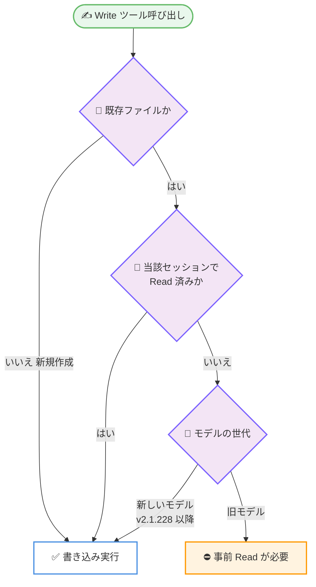
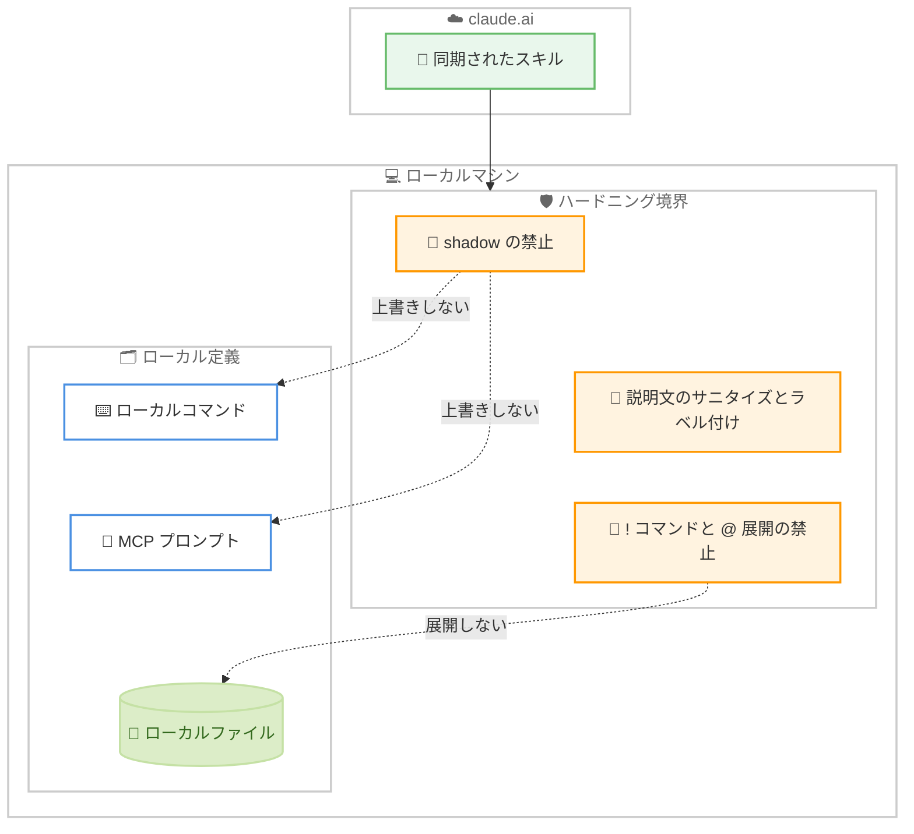

# Claude Code v2.1.228 リリース — 再描画停止の修正、claude.ai 同期スキルのハードニング、Write ツールの上書きルール変更

## メタデータ

| 項目 | 内容 |
|------|------|
| 発表日 | 2026-08-11 |
| ソース | Claude Code Changelog |
| カテゴリ | Claude Code アップデート |
| 公式リンク | https://github.com/anthropics/claude-code/blob/main/CHANGELOG.md |

## 概要

Claude Code v2.1.228 (2026 年 8 月 11 日、npm 公開日時: 2026-08-11T17:45:45Z) がリリースされた。本バージョンは全 18 項目で構成される。カテゴリ別の件数は、修正 12 件 (うち 1 件はセキュリティ強化)、改善 3 件、変更 2 件、削除 1 件である。新機能の追加はない。

内容の重心は 3 点にある。第一に、まれな内部レイアウトエラーの後に対話セッションの再描画が完全に停止し、プロセス自体は動作を継続するという体験上のインパクトが大きい不具合が修正された。第二に、claude.ai から同期されたスキルがハードニングされ、ローカルコマンドや MCP プロンプトを shadow しなくなり、説明文はサニタイズとラベル付けの対象となり、ローカルマシン上でスキル本文が `!` コマンドを実行したり `@` によるファイル展開を行ったりしなくなった。第三に、Write ツールの挙動が変更され、新しいモデルは当該セッションで未読の既存ファイルであっても上書きできるようになった (Edit ツールのルールと整合)。旧モデルは従来どおり事前の Read が必要である。

そのほか、クロスセッションメッセージの表示がインライン化され、セッションクリーンアップがプロジェクトのメモリフォルダ内を削除する問題、Remote Control `/resume` による履歴・タイトルの漏洩、Windows での git / Git Bash 検出、設定マージにおける marketplace エントリの扱いなど、影響範囲が明確な修正が含まれる。Vertex AI では、期限切れまたは欠落した Google Cloud 認証情報が数分間リトライされる代わりに数秒で失敗するようになった。

## 詳細

### 背景

直前のリリース v2.1.227 (2026 年 8 月 10 日) は、期限切れのログイントークンで起動した際に Max プランのユーザーが誤判定される問題、GitHub ホストランナー上での `claude-code-action` の Bash 実行不能、`/tui` による巻き戻し済み会話の復活といった、修正 3 件と改善 2 件の小規模なメンテナンスリリースであった。v2.1.228 はその流れを引き継ぎつつ、修正項目が 12 件に増え、対象領域も TUI のレンダリング、セルフホストランナー、Remote Control、プラグインキャッシュ、設定マージへと広がっている。

v2.1.227 が `/tui` に関して巻き戻し済み会話の復活を修正したのに対し、本リリースでは `/tui` がモデル選択を巻き戻す問題が修正されている点も連続性がある。また v2.1.224 (2026 年 8 月 7 日) で追加されたクロスセッションメッセージングとセルフホスト実行環境については、本リリースで表示改善と複数の実運用上の修正が加えられ、導入直後の機能が継続的に磨かれている状況が読み取れる。

セキュリティ面では、claude.ai から同期されたスキルという「リモート由来の指示」がローカル実行環境に持ち込まれる経路に対して、境界を明確化するハードニングが行われた。

### 主な変更点

#### 修正 (Fixed)

1. **対話セッションの再描画完全停止の修正**: まれな内部レイアウトエラーの後、プロセスは動作を継続しているにもかかわらず、対話セッションの再描画が完全に停止することがある問題を修正

2. **Windows での git / Git Bash 検出の修正**: git のインストール先の親フォルダから Claude Code を起動した場合に、Windows 上で `git` / Git Bash が見つからない問題を修正

3. **`/tui` によるモデル巻き戻しの修正**: 最後の応答以降に `/model` でモデルを変更していた場合に、`/tui` がセッションを以前のモデルへ戻してしまう問題を修正

4. **クロスセッションメッセージングのインボックス欠落の修正**: インストールまたはアップグレード後の最初のセッションで、クロスセッションメッセージングがインボックスなしで開始されることがある問題を修正

5. **Remote Control `/resume` の履歴・タイトル漏洩の修正**: 接続中に Remote Control で `/resume` を実行すると、再開した会話のタイトルや履歴が接続中のセッションへ漏洩する問題を修正

6. **`claude self-hosted-runner` の `checkout` フック失敗の修正**: セッションが push しないリポジトリで `checkout` フックが失敗すると、すべての新規ランナーでセッションが失敗する問題を修正。該当のリポジトリは警告を出してスキップされるようになった

7. **セルフホストランナーのセッション早期終了の修正**: バックグラウンドタスクの完了から後続ターンの開始までの空白時間に、セルフホストランナーがセッションを終了してしまう問題を修正

8. **セッションクリーンアップによるメモリフォルダ削除の修正**: セッションクリーンアップが、プロジェクトのメモリフォルダ内の内容を削除してしまう問題を修正

9. **プラグインキャッシュクリーンアップの誤削除の修正**: バックグラウンドのプラグインキャッシュクリーンアップが、プラグインの唯一のバージョンがシンボリックリンクされた開発用チェックアウトである場合に、そのキャッシュを削除してしまう問題を修正

10. **設定マージ問題の修正**: より優先度の高い設定階層で再定義された marketplace エントリが、別の階層のカスタムヘッダーを継承してしまう問題を修正。marketplace エントリはエントリ全体としてマージされるようになった

11. **deferred-tools リマインダーの二重送信の修正**: スキル呼び出しの後に、deferred-tools リマインダーがモデルへ 2 回送信されることがある問題を修正

12. **claude.ai から同期されたスキルのハードニング (セキュリティ強化)**: claude.ai から同期されたスキルは、ローカルコマンドや MCP プロンプトを shadow しなくなった。説明文はサニタイズされてラベル付けされ、ユーザーのマシン上でスキル本文が `!` コマンドを実行したり `@` によるファイル展開を行ったりしなくなった

#### 改善 (Improved)

13. **クロスセッションメッセージの表示改善**: 送信者と本文が折りたたまれた 1 行ではなくインラインで表示されるようになった。また、他のマシン上の Remote Control セッションへのメッセージでは、送信者としてユーザーの Remote Control セッション名が表示される

14. **Vertex AI の認証情報ハンドリング改善**: 期限切れまたは欠落した Google Cloud 認証情報が、数分間リトライされる代わりに数秒で失敗するようになった

15. **コンパクション進捗表示の改善**: コンパクション中に、進捗バーだけでなくリトライのカウントダウンと停滞ヒント (stall hint) が表示されるようになった

#### 変更 (Changed)

16. **Write ツールの上書きルールの変更**: 新しいモデルは、当該セッションで読んでいない既存ファイルを上書きできるようになり、Edit ツールのルールと整合した。旧モデルは従来どおり事前の Read が必要である

17. **ターミナルタイトルのビジースピナーグリフの更新**: 一部のターミナルで発生するタブバーのちらつき (jitter) を軽減するため、ターミナルタイトルに使われるビジースピナーのグリフが更新された

#### 削除 (Removed)

18. **auto モードのコストに関する古い注記の削除**: Pro、Max、Team プランの初回利用通知から、auto モードのセッションがわずかに割高になるという古い注記が削除された

### 技術的な詳細

#### 内部レイアウトエラーによる再描画停止

Claude Code の対話セッションは、ターミナル上に描画される TUI アプリケーションとして動作する。修正前は、まれな内部レイアウトエラーが発生すると再描画のループが完全に停止し、画面が更新されなくなる状態に陥ることがあった。このときプロセス自体は動作を継続しているため、ユーザーの視点では「フリーズしたように見えるが、裏では処理が進んでいる」という判別しにくい状況になる。セッションを強制終了すると進行中の作業が失われるおそれがあり、体験上のインパクトは大きい。本修正により、内部レイアウトエラーが再描画の停止につながらなくなった。

#### claude.ai から同期されたスキルのハードニング

本リリースで最もセキュリティ上の意味が大きい変更である。claude.ai から同期されたスキルは、ユーザーのローカル環境の外側で定義された内容がローカルの実行環境に持ち込まれる経路にあたる。今回のハードニングは、その境界に対して 3 つの防御を加えている。

**1. ローカルコマンドや MCP プロンプトを shadow しない**: 修正前は、同期されたスキルがローカルで定義されたコマンドや MCP プロンプトと同じ名前を占めた場合、ローカル側の定義を覆い隠す (shadow する) 可能性があった。これは、ユーザーが意図したローカルの定義の代わりにリモート由来の定義が実行されうるという名前の衝突の問題である。本リリース以降、同期されたスキルはローカルコマンドや MCP プロンプトを shadow しない。

**2. 説明文のサニタイズとラベル付け**: スキルの説明文 (description) はモデルがスキルを選択する際の判断材料としてコンテキストに入るため、そこに指示めいた文章が含まれると、モデルの挙動に影響を与える余地がある。本リリースでは説明文がサニタイズされ、さらにラベル付けされることで、リモート由来の内容であることが区別できるようになった。

**3. `!` コマンド実行と `@` ファイル展開の禁止**: Claude Code のコマンド本文では、`!` によるシェルコマンドの実行と `@` によるファイル参照の展開が利用できる。同期されたスキルの本文でこれらが有効なままだと、リモート側で定義された内容がユーザーのマシン上でコマンドを実行したり、ローカルファイルの中身を読み込んでコンテキストに展開したりできることになる。本リリース以降、ユーザーのマシン上では同期されたスキルの本文がこれらを実行・展開しない。

これらは、リモート由来のスキルが持ちうる権限をローカル定義のコマンドより明確に狭める措置であり、claude.ai とスキルを同期している環境では本バージョンへの更新価値が高い。

#### Write ツールの上書きルールと Edit ツールとの整合

Claude Code のファイル編集系ツールには、対象ファイルを事前に Read していることを要求するルールがある。これは、モデルが既存の内容を把握しないまま上書きして変更を失わせる事故を防ぐためのガードである。

本リリースでは、Write ツールについて新しいモデルに限り、当該セッションで読んでいない既存ファイルの上書きが許可された。changelog は、この変更が Edit ツールのルールと整合するものであると明記している。旧モデルでは従来どおり事前の Read が必要であり、挙動は変わらない。

つまり、同じ Write ツールでも使用するモデルによって前提条件が異なる状態になる。既存ファイルの上書きに対して「事前に Read が行われること」を暗黙の前提としてワークフローやフックを組んでいる場合は、新しいモデルではその前提が成り立たなくなるため、破壊的変更となる可能性がある。

#### Vertex AI の認証情報ハンドリング

Vertex AI 経由で Claude を利用する構成では、Google Cloud の認証情報が期限切れであったり存在しなかったりする場合がある。修正前は、この状況でリトライが数分間続き、ユーザーは原因が分からないまま長く待たされていた。改善後は数秒で失敗するため、認証情報の問題であることを早期に把握し、再認証などの対処に移れる。

#### 設定マージにおける marketplace エントリの扱い

Claude Code の設定は複数の階層 (settings tier) から読み込まれ、優先度に従ってマージされる。修正前は、より優先度の高い階層で marketplace エントリを再定義した場合に、そのエントリが別の階層で定義されたカスタムヘッダーを継承してしまうことがあった。意図しない認証ヘッダーなどが引き継がれる可能性があるため、設定の予測可能性を損なう問題である。本リリースでは、marketplace エントリがエントリ全体 (whole entries) としてマージされるようになり、上位階層での再定義が下位階層のフィールドを引き継がなくなった。

#### セッションクリーンアップとプロジェクトのメモリフォルダ

Claude Code はセッションデータの蓄積を抑えるためにクリーンアップ処理を行う。修正前は、この処理がプロジェクトのメモリフォルダ内の内容まで削除してしまうことがあった。メモリはプロジェクト固有の文脈を蓄積する仕組みであり、失われると再蓄積が必要になる。本修正により、クリーンアップの対象からメモリフォルダの内容が除外された。

#### Remote Control `/resume` による情報漏洩

修正前は、Remote Control に接続した状態で `/resume` を実行すると、再開した会話のタイトルや履歴が、接続中の別セッションへ漏洩することがあった。異なる会話の内容が意図しない相手に見える可能性がある問題であり、本リリースで修正されている。

#### Windows での git / Git Bash 検出

修正前は、git のインストール先の親フォルダから Claude Code を起動した場合に、Windows 上で `git` および Git Bash が見つからないことがあった。git が利用できないと差分表示やコミット関連の操作が機能しないため、Windows ユーザーにとって影響の大きい問題である。

## 開発者への影響

### 対象

- **claude.ai とスキルを同期しているユーザー**: 同期されたスキルの権限が明確に制限された。セキュリティ上の改善であるため、該当するすべてのユーザーに本バージョンへの更新を推奨
- **新しいモデルを利用しているユーザー**: Write ツールが未読の既存ファイルを上書きできるようになった。事前 Read を前提としたワークフローがある場合は見直しが必要
- **Windows ユーザー**: git のインストール先の親フォルダから起動した場合の git / Git Bash 検出が修正された
- **Vertex AI 利用者**: 認証情報が期限切れまたは欠落している場合の待ち時間が数分から数秒に短縮された
- **セルフホストランナー利用者**: `checkout` フック失敗時の全ランナー障害と、バックグラウンドタスク完了直後のセッション早期終了が修正された
- **Remote Control 利用者**: 接続中の `/resume` による履歴・タイトルの漏洩が修正され、クロスセッションメッセージの表示がインライン化された
- **プロジェクトメモリを活用しているユーザー**: セッションクリーンアップによるメモリフォルダ内の削除が修正された
- **marketplace を設定で管理しているチーム**: 設定階層をまたいだカスタムヘッダーの意図しない継承が解消された

### 必要なアクション

**1. Write ツールの挙動変更への対応 (影響を受ける可能性がある)**

新しいモデルでは、Write ツールが当該セッションで読んでいない既存ファイルを上書きできるようになった。以下に該当する場合は確認が必要である。

- 既存ファイルの上書き前に Read が行われることを前提として、`PreToolUse` フックや権限ルールを構成している場合は、その前提が新しいモデルでは成立しないため、フックや権限ルールの条件を見直す
- `CLAUDE.md` などのプロジェクト指示で「Write の前に必ず Read する」旨を運用ルールとして明記している場合は、指示が引き続き有効であることを確認する
- 上書きされると影響が大きいファイルについては、権限設定で Write の対象から除外するなど、ツール側のガードに依存しない保護を検討する
- 旧モデルを利用している場合は従来どおり事前の Read が必要であり、対応は不要である

**2. claude.ai 同期スキルのハードニングへの対応**

claude.ai から同期されたスキルを利用している場合、本バージョン以降は挙動が変わるため、以下を確認する。

- 同期されたスキルの本文が `!` によるコマンド実行や `@` によるファイル展開に依存していた場合、それらはユーザーのマシン上で実行・展開されなくなるため、当該スキルが期待どおり動作するかを確認する
- 同期されたスキルとローカルコマンドまたは MCP プロンプトで名前が重複している場合、これまで同期されたスキル側が優先されていた可能性がある。本バージョン以降はローカル側が shadow されないため、呼び出し結果が変わることを想定して確認する
- コマンド実行やファイル参照が必要な処理は、ローカルのカスタムコマンドやプラグインとして定義し直すことを検討する

**3. バージョンの更新**

本記事の「コード例」に記載したコマンドで最新バージョンに更新できる。更新後は `claude --version` でバージョンを確認する。

### 移行ガイド (該当する場合)

本リリースには機能削除を伴う破壊的変更はないが、Write ツールの挙動変更は既存の前提を崩す可能性がある。移行時の確認手順は次のとおり。

1. 本バージョンへ更新し、`claude --version` で `2.1.228` になっていることを確認する
2. 新しいモデルを使用しているセッションで、既存ファイルへの Write が意図しないタイミングで許可されないか、権限設定とフックの構成を確認する
3. claude.ai から同期しているスキルを一覧し、`!` コマンドや `@` ファイル展開に依存していないか、ローカルコマンドや MCP プロンプトと名前が重複していないかを確認する
4. marketplace エントリを複数の設定階層で定義している場合は、更新後に想定どおりのヘッダーが使われているかを確認する

## コード例

### アップグレード方法

```bash
# npm で最新バージョンをインストール
npm install -g @anthropic-ai/claude-code@latest

# Claude Code の自己更新コマンドを利用する場合
claude update

# 更新後のバージョンを確認し、2.1.228 になっていることを確かめる
claude --version
```

### 利用中のモデルを確認する

Write ツールの上書きルールはモデルの世代によって異なるため、セッション内で `/model` を実行して現在のモデルを確認する。

```text
> /model
```

## アーキテクチャ図 (該当する場合)

### Write ツールの上書き判定の変更



### claude.ai 同期スキルのハードニング



## 関連リンク

- [Claude Code Changelog](https://github.com/anthropics/claude-code/blob/main/CHANGELOG.md)
- [Claude Code GitHub リポジトリ](https://github.com/anthropics/claude-code)
- [Claude Code ドキュメント](https://docs.anthropic.com/en/docs/claude-code)
- [Claude Code v2.1.227](./2026-08-10-claude-code-v2-1-227.md)
- [Claude Code v2.1.224](./2026-08-07-claude-code-v2-1-224.md)

## まとめ

Claude Code v2.1.228 は、修正 12 件、改善 3 件、変更 2 件、削除 1 件の全 18 項目で構成される、修正中心のリリースである。新機能の追加はないが、実運用に直結する重要な変更が 3 点含まれる。

第一に、内部レイアウトエラーによって対話セッションの再描画が完全に停止する問題の修正である。プロセスは動作を継続するため判別が難しく、強制終了によって作業を失うリスクがあった不具合であり、日常的に TUI を利用するすべてのユーザーにとって価値が大きい。

第二に、claude.ai から同期されたスキルのハードニングである。ローカルコマンドや MCP プロンプトを shadow しなくなり、説明文はサニタイズとラベル付けの対象となり、ローカルマシン上で `!` コマンドの実行と `@` ファイル展開が行われなくなった。リモート由来の指示がローカル環境で持てる権限を明確に狭める措置であり、claude.ai とスキルを同期している環境では速やかな更新を推奨する。

第三に、Write ツールの上書きルールの変更である。新しいモデルでは未読の既存ファイルを上書きできるようになり、Edit ツールのルールと整合した。旧モデルの挙動は変わらないが、事前 Read を暗黙の前提としてフックや権限ルールを構成しているチームは、前提が成り立たなくなる点を確認する必要がある。

そのほか、セッションクリーンアップによるプロジェクトメモリの削除、Remote Control `/resume` の履歴・タイトル漏洩、Windows での git / Git Bash 検出、設定階層をまたいだ marketplace エントリのヘッダー継承といった、影響範囲の明確な修正が揃っている。Vertex AI 利用者にとっては、認証情報の問題が数分ではなく数秒で判明するようになった点も実務上の改善である。
