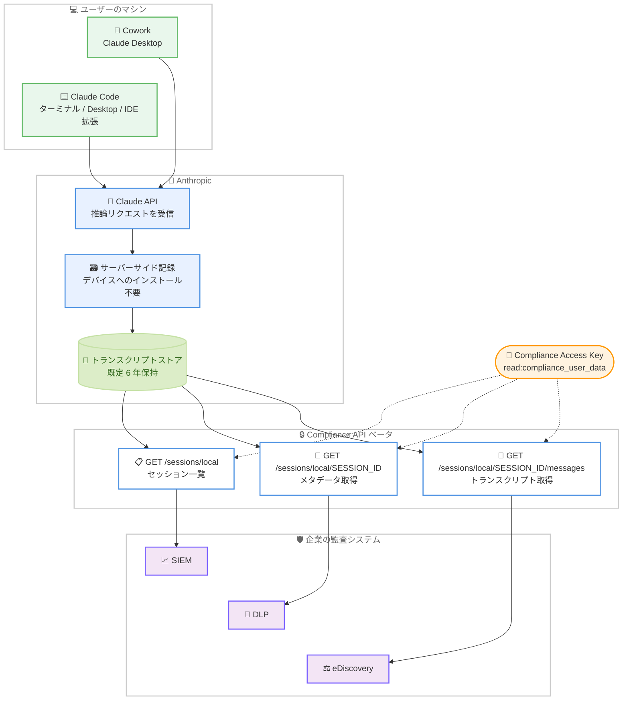

# Compliance API がローカルセッションのトランスクリプト取得に対応、`anthropic-workspace-id` レスポンスヘッダーを追加

## メタデータ

| 項目 | 内容 |
|------|------|
| 発表日 | 2026-08-11 |
| ソース | Claude Developer Platform Release Notes |
| カテゴリ | エンタープライズ / コンプライアンス / API |
| 公式リンク | https://platform.claude.com/docs/en/release-notes/overview |

## 概要

Anthropic は 2026 年 8 月 11 日、Claude Developer Platform のリリースノートで 2 件の変更を公開した。1 件目は Compliance API の拡張であり、ユーザー自身のマシン上で実行される Cowork および Claude Code セッションのトランスクリプトを取得できるようになった。Claude Enterprise 組織向けのベータ機能として提供され、`GET /v1/compliance/apps/sessions/local` でセッション一覧、`GET /v1/compliance/apps/sessions/local/{session_id}` で単一セッションのメタデータ、`GET /v1/compliance/apps/sessions/local/{session_id}/messages` でトランスクリプトを取得する。いずれも既存の Compliance Access Key と `read:compliance_user_data` スコープでそのまま利用できる。

2 件目は Claude API のレスポンスヘッダー `anthropic-workspace-id` の追加である。リクエストの API キーまたはアクセストークンが解決したワークスペースの `wrkspc_` 接頭辞付き ID を返し、組織の Default Workspace の場合も ID が返る。これにより、あるリクエストがどのワークスペースの使用量、コスト、レート制限に計上されたかをレスポンス側から確認できる。

2 件はいずれもエンタープライズにおける可視性と帰属の明確化に関わる変更であり、監査とコスト配賦の運用を API だけで完結させる方向の拡張として位置づけられる。

## 詳細

### 背景

Compliance API は 2026 年 5 月 21 日の一般提供開始以降、Claude Enterprise 組織のチャット、ファイル、プロジェクト、アクティビティフィードを SIEM、DLP、eDiscovery などの既存セキュリティスタックに取り込む窓口として機能してきた。詳細は [Claude Compliance API インテグレーション](2026-05-21-claude-compliance-api-integrations.md) のレポートを参照。

セッションについては、まず Anthropic 管理のクラウド環境で動作する**リモートセッション**が対象となった。公式ドキュメントによると、claude.ai の Web およびモバイルで開始された Cowork セッションは Anthropic 管理のクラウド環境で実行され、`GET /v1/compliance/apps/sessions/remote` と `GET /v1/compliance/apps/sessions/remote/{session_id}/messages` の 2 エンドポイントで公開されている。これらもベータであり、同じ Compliance Access Key と `read:compliance_user_data` スコープで動作する。

一方で、Claude Desktop の Cowork や、ターミナル / Claude Desktop / IDE 拡張で動作する Claude Code は、ユーザー自身のマシン上で実行されるため、リモートセッションのエンドポイントでは取得できなかった。公式ドキュメントは「リモートセッションのエンドポイントは Cowork セッションのみを返す」と明記している。今回の追加は、この空白を埋めるものであり、リモートセッション対応の続きとして**ローカルセッション**という新しいリソース種別を導入した形になる。

なお、当リポジトリには 2026 年 8 月 3 日付のリモートセッション対応レポートは存在しなかった (`reports/2026/` 配下の 08-03 は Claude Code v2.1.221 のみ)。そのため本節のリモートセッションに関する記述は、レポートではなく公式ドキュメントの記載に基づいている。

アクセス制御の前提として、2026 年 4 月 9 日の [Enterprise プラン向けロールベースアクセス制御 (RBAC)](2026-04-09-enterprise-rbac.md) により、グループ単位で Cowork などの機能利用を制御できるようになっている。RBAC が「誰が使えるか」を制御する層であるのに対し、今回のローカルセッション対応は「実際に何が行われたか」を事後に取得する層を担う。

### 主な変更点

#### 1. ローカルセッションの 3 エンドポイント

公式ドキュメントで確認できる仕様は以下の通り。

| エンドポイント | 役割 |
|---------------|------|
| `GET /v1/compliance/apps/sessions/local` | 組織横断のセッションメタデータ一覧を返す。トランスクリプト本文は含まない |
| `GET /v1/compliance/apps/sessions/local/{session_id}` | 単一セッションのメタデータを返す。一覧と同じセッションオブジェクトをエンベロープなしで返す |
| `GET /v1/compliance/apps/sessions/local/{session_id}/messages` | 単一セッションのトランスクリプトを返す |

3 つのエンドポイントはすべて `read:compliance_user_data` スコープを要求する。ドキュメントには「新しいキー、スコープ、設定、クライアントの更新はいずれも不要」と明記されている。

#### 2. ローカルセッションとリモートセッションの差異

公式ドキュメントの比較表に基づく差異は以下の通り。

| 項目 | ローカルセッション | リモートセッション |
|------|------------------|------------------|
| エンドポイント | `/v1/compliance/apps/sessions/local` 配下の一覧、取得、メッセージ | `/v1/compliance/apps/sessions/remote` 配下の一覧、メッセージ |
| 実行場所 | ユーザー自身のマシン | Anthropic 管理のクラウド環境 |
| `product_surface` の値 | `cowork`、`claude_code` | `cowork_remote` |
| ID 接頭辞 | `clls_` | `cse_` |
| 一覧のフィルター | `created_at` の範囲のみ | 組織、ユーザー、`created_at` の範囲 |
| ライフサイクルフィールド | なし。`status` と `updated_at` を持たない | `status`、`updated_at` |
| 保持期間 | 既定 6 年。組織が有限のカスタム会話保持期間を設定している場合はその期間 | 6 年 |
| エンドポイント固有のレート制限 | なし | あり |
| API 経由の削除 | 不可 | 不可 |

ローカルセッションは共有の Compliance API レート制限のみに計上され、リモートセッションのエンドポイントに適用される追加のレート制限の対象にはならない。

#### 3. `anthropic-workspace-id` レスポンスヘッダー

Claude API のレスポンスに `anthropic-workspace-id` ヘッダーが追加された。`request-id` および `anthropic-organization-id` と並んで返される。ドキュメントの例では以下のように出力される。

```http
HTTP/1.1 200 OK
request-id: req_018EeWyXxfu5pfWkrYcMdjWG
anthropic-organization-id: 0d0e7a3b-52f1-4c7e-9a51-3f6f2f7c1b9e
anthropic-workspace-id: wrkspc_01JwQvzr7rXLA5AGx3HKfFUJ
```

値はリクエストの API キーまたはアクセストークンが解決したワークスペースの `wrkspc_` 接頭辞付き ID であり、それが Default Workspace である場合も同様に ID が返る。

### 技術的な詳細

#### キャプチャの仕組みと対象範囲

ドキュメントによると、ローカルセッションは Claude Enterprise アカウントでサインインした状態でユーザー自身のマシン上で実行される Cowork および Claude Code のセッションを指す。対象は Claude Desktop の Cowork と、ターミナル、Claude Desktop、IDE 拡張の Claude Code である。

Anthropic は各会話を、そのリクエストが Claude API に到達した時点でサーバーサイドに記録する。デバイス側には何もインストールされず、クライアントが既に Claude API へ送信しているリクエストを超える情報は収集されない。

トランスクリプトは「Claude が何を依頼され、何を返したか」を示すものであり、デバイス上で何が起きたかを示すものではない。ファイルやネットワークの活動はトランスクリプト内のツール呼び出しとツール結果を通じてのみ可視化されるため、API に到達しない活動 (セッションが送信しなかったローカルファイルなど) は記録されない。

#### キャプチャされないケース

以下の場合はローカルセッションが記録されない。

- Claude Code が Claude Console の API キーで認証している場合
- Claude Code が Amazon Bedrock、Google Cloud、Microsoft Foundry などのサードパーティクラウドプラットフォーム経由で動作している場合
- Claude Code on the web のセッション。Anthropic 管理のクラウド環境で動作するが、リモートセッションにも該当しない
- [HIPAA readiness](https://platform.claude.com/docs/en/manage-claude/api-and-data-retention#hipaa-readiness) を有効化している組織。ローカルセッションデータは一切収集されず、エンドポイントはセッションを返さない
- ゼロデータ保持 (ZDR) が適用されるセッション。一覧から除外される

顧客管理暗号鍵 (CMEK) を利用している組織では、セッションの一覧取得と個別取得は通常どおり可能だが、トランスクリプト本文は現時点では返らない。メッセージエンドポイントの全メッセージが `provenance.type` に `content_unavailable`、`reason` に `not_captured` を持ち、`content` は空配列となる。CMEK の背景については [Access Transparency: CMEK コンテンツ保全ドキュメントの拡充](2026-07-10-access-transparency-cmek-preserve.md) を参照。

#### 一覧エンドポイントの仕様

- **フィルター**: `created_at.gte` と `created_at.lt` のみ。組織フィルターもユーザーフィルターも存在しない。両者は RFC 3339 形式で UTC オフセットが必須であり、両方を指定する場合は `created_at.lt` が `created_at.gte` より厳密に後でなければ 400 Bad Request となる
- **ソート**: `created_at` の降順 (新しい順)。同値の場合は `id` で解決
- **ページング**: `limit` は既定 100、最大 500。前方向のみのページングで、レスポンスの `next_page` を次のリクエストの `page` クエリパラメータに渡し、`next_page` が `null` になったら停止する。`has_more` フィールドは存在しない
- **カーソルの有効期間**: 一覧の走査は開始から 24 時間以内に完了する。それより古いカーソルも受理されるが、現在の保持境界に対して再評価されるため、保持期間から外れかけているセッションがスキップされる可能性がある
- **反映遅延**: 新しいセッションとメッセージは短い処理遅延の後に結果へ現れる。通常は数分以内であり、開始直後に見つからないセッションが記録されていないとは限らない

セッションオブジェクトのフィールドは以下の通り。

- `user.id`: 常に設定され、アカウント削除後も残る
- `user.email_address`: ユーザーのアカウントが削除された場合、またはキーが読み取れる組織のメンバーでなくなった場合は `null`
- `workspace_id`: セッションがワークスペースに紐づいていない場合は `null`
- `product_surface`: 文字列または `null`。`cowork` は Claude Desktop の Cowork、`claude_code` は Claude Code を示す。カバレッジ拡大に伴い新しい値が追加される
- `id`: 不透明な文字列として扱う。フォーマットは予告なく変更される可能性がある

ドキュメントは前方互換なハンドラーの実装を推奨しており、未知の `product_surface` 値はそのまま通し、想定しないフィールドは無視するよう求めている。

#### 保持期間と `created_at` の変動

ローカルセッションはサーバーサイドのライフサイクルを持たないため、`status` と `updated_at` が存在せず、可視性は保持期間によって決まる。セッションはクライアントが実行した一連の Claude API 呼び出し (推論呼び出し) として記録され、保持期間は各呼び出しに個別に適用される。

`created_at` はセッションで保持されている最も古い呼び出しのタイムスタンプ (UTC) である。古い呼び出しが保持期間を過ぎるにつれて `created_at` は前進し、すべての呼び出しが期限切れになるとセッション自体が返らなくなる。`created_at` が実行ごとに変動しうるため、一覧を継続的に再走査する場合は `id` で重複排除する必要がある。

また、`created_at` が後方へ動くことはなく `updated_at` も存在しないため、初回エクスポート後にメッセージが追加されたセッションは、後続の `created_at` ウィンドウに再出現しない。トランスクリプトを最新に保つには、最長のセッション実行時間以上の末尾ウィンドウを毎回再取得し、返ったセッションのトランスクリプトを再取得して `id` でメッセージを重複排除する運用が必要になる。

記録されたローカルセッションの内容は既定でキャプチャから 6 年間保存される。セッションを実行した組織が claude.ai の組織設定で有限のカスタム会話保持期間を設定している場合は、既定より短くても長くてもその期間が適用され、複数のカスタム保持期間が設定されている場合は最短のものが適用される。設定変更の反映は 2 通りに分かれる。設定を変更した時点でエンドポイントは組織の現在の期間より古い活動を返さなくなるが、記録済みの各メッセージはキャプチャ時点で有効だった期間だけ保存されるため、後から期間を延長しても既に期限切れとなった内容は復元されない。

#### トランスクリプトの内容と除外項目

メッセージエンドポイントは、記録された Claude API 呼び出しから再構成したトランスクリプトを返す。ユーザープロンプト、アシスタントのテキスト、ツール呼び出し、ツール結果のテキスト部分が、サイズによる切り詰めを除いて送信時のまま返る。URL、認証情報、個人データのマスキングは行われないため、トランスクリプトは機微情報として扱う必要がある。

以下は省略または置換される。

- 思考ブロックは常に含まれない
- リクエストのシステムプロンプトは返らない。代わりに `[system prompt content not shown]` というマーカーメッセージが入る (通常はセッションごとに 1 回。記録内容のないセッションにはマーカーが入らない)
- ツール定義と MCP サーバー設定はトランスクリプトに含まれない
- 画像、PDF、その他のバイナリまたは構造化ブロックは返らない。`[image content not shown]` のような `text` ブロックとして現れ、`truncated` が `true` になる。ツール結果内の非テキスト項目は `[N non-text item(s) not shown]` の 1 エントリに置換され、ツール結果ブロックの `truncated` が `true` になる
- `text` ブロックの引用メタデータは省略され、該当ブロックの `truncated` が `true` になる

一方で、`CLAUDE.md` などのプロジェクト指示ファイルは通常のユーザーロールのコンテンツとして現れる。スキルの内容は、クライアントがメッセージコンテンツとして送信した場合に現れ、他のユーザーテキストと区別されない。

#### メッセージエンドポイントの仕様

- **エンベロープ**: レスポンスはページングされる `data` 配列に加えて `session` エンベロープを含む
- **`user.email_address`**: このエンドポイントでは常に `null`。メールアドレスを解決しないため、`null` はアカウント削除を意味しない。メールアドレスに紐づけるには `user.id` を一覧エンドポイントまたは取得エンドポイントの結果と結合する
- **並び順とページング**: 既定は古い順。`order=desc` で逆順になる。`limit` は既定 100、最大 1,000。レスポンスのサイズ上限に達するとページが早く終わることがあるため、`limit` より少ないメッセージ数のページが終端を意味するわけではなく、`next_page` が `null` になるまでページングを続ける
- **カーソルの制約**: ページカーソルは発行時のセッションと並び順に紐づく。走査のカーソルは最初のページから 24 時間で失効し、失効後は `page` パラメータなしでの再開を促す 400 Bad Request が返る。別のセッションや別の `order` 向けに発行されたカーソルも 400 になる
- **ブロック構造**: 各メッセージは `role` (`user` または `assistant`) と、`text`、`tool_use`、`tool_result` ブロックからなる `content` 配列を持つ。`tool_use` の `input` はオブジェクトではなく JSON エンコードされた文字列である。`tool_result` は `tool_use_id`、`name`、`is_error`、`text` エントリの `content` 配列、`truncated` を持つ。MCP のツール呼び出しと結果、および多くのサーバーツールの呼び出しと結果は同じ `tool_use` / `tool_result` 形状に正規化され、それ以外のブロック種別は `[<block type> content not shown]` のプレースホルダーになる
- **タイムスタンプ**: 同一の推論呼び出しから再構成されたメッセージはその呼び出しのタイムスタンプを持つため、連続するメッセージが同じ `created_at` を共有することが多い。タイムスタンプで再ソートせず、返された順序を保持する

#### `provenance` フィールド

各メッセージは、内容がどのように記録されたかを示す `provenance` を持つ。Claude API によって検証済みの内容の場合は `null` であり、これが通常のケースである。それ以外は `type` で例外を示すオブジェクトになる。

| `type` | 意味 |
|--------|------|
| `content_unavailable` | 内容を返せない。`content` は空配列で、`provenance.reason` が理由を示す |
| `client_asserted` | クライアントが会話履歴として提供し、記録済みレスポンスと突合できなかったアシスタントメッセージ。作成者が検証されていない |
| `synthetic_marker` | システムプロンプトの代替マーカーなど、エンドポイント自身が生成したレコード |

`content_unavailable` の `reason` は以下の値を取る。

- `not_captured`: そのターンの内容が利用できない。記録が保存されていないことの証明にはならない。ストレージ側のアクセスポリシーで内容が保持されない場合 (CMEK を利用する組織など) も同じ理由で報告され、記録済みセッション内の個別のターンが他のデータ取り扱い上の理由で利用できない場合も同じ理由になる
- `cmek_key_revoked`: 顧客管理鍵で暗号化された内容が、鍵の失効などで利用できない場合に予約されている値。現時点では返らないが、前方互換のために処理を用意する
- `retention_elapsed`: 内容が保持期間を過ぎた
- `oversize`: 単一メッセージがメッセージあたりのサイズ上限を超えた。メッセージ自体は空の `content` 配列で返る

マーカーおよび `client_asserted` のメッセージは、`truncated: true` が付いた角括弧付きの説明テキストブロックで始まる。これらは「欠落」ではなく「存在するが利用できない、または未検証」として扱い、未知の `provenance` の型と理由を許容する実装が推奨されている。

クライアントがセッション中に会話履歴を書き換えたり圧縮したりした場合 (コンテキスト圧縮後など) は、その時点にマーカーメッセージが挿入され、クライアントが送信した新しい内容から継続する。組織に有限の保持期間が設定されている場合、書き換えられた履歴自体は返らず (2 つ目のマーカーがその旨を示す)、最新のユーザーターンとそれ以降のみが表示される。

#### サイズ上限のパラメータ

ツールブロックのバイト数は 2 つのパラメータで制御する。

| パラメータ | 既定値 | 挙動 |
|-----------|-------|------|
| `tool_use_input_max_bytes` | 10,000 バイト | `-1` でサーバー最大値 (文字列あたり約 1 MiB)。`0` は 400 Bad Request。最大値を超える値は最大値に切り下げられる |
| `tool_result_max_bytes` | 10,000 バイト | 同上 |

上限で切り詰められた文字列は文字境界で切られ、`…[truncated; pass tool_result_max_bytes=-1 for the server max]` のようなインバンドの接尾辞が付与され、そのブロックの `truncated` が `true` になる。切り詰められた `tool_use` の `input` は有効な JSON ではなくなるため、ツール入力のパースは切り詰められていないブロックに限定するか、上限を上げて再取得する必要がある。`text` ブロックは常に同じサーバー最大値の約 1 MiB で上限が掛かり、これを引き上げるパラメータは存在しない。

#### エラー応答

| 状況 | 応答 |
|------|------|
| 親組織でローカルセッションが利用できない | 404 Not Found、メッセージ `Local sessions are not available.` |
| セッション一覧または記録内容が一時的に利用できない | 503 |
| セッション ID の形式が不正 | 400 Bad Request |
| キーが読み取れない組織のセッション、存在しないセッション、ZDR 適用、すべての呼び出しが保持期間を経過 | 404 Not Found (4 つのケースを区別しない) |
| Admin API キー (`sk-ant-admin01-...`) で認証 | 403 Forbidden |

#### `anthropic-workspace-id` の詳細

- **ヘッダーが返らないケース**: 認証情報がワークスペースに解決しない場合 (Admin API へのリクエストなど)、または 401 のように認証完了前にリクエストが失敗した場合はヘッダーが存在しない
- **対象範囲**: 同じアクセス方法で他の Claude API エンドポイントからもヘッダーを読み取れる。Claude Managed Agents の API も対象であり、セッション作成のレスポンスから読み取ってセッションが属するワークスペースを記録できる
- **Default Workspace の扱い**: Default Workspace も他のワークスペースと同様に `wrkspc_` ID を持ち、このヘッダーで返る。ただし List Workspaces の結果には現れず、API キー、使用量レポート、コストレポートでは `workspace_id` が `null` になる。Get Workspace に渡すと `"name": "Default"` として返る

取得したワークスペース ID は以下の用途に使える。

- リクエストがどのワークスペースの使用量、コスト、レート制限に計上されたかを確認する
- Usage and Cost API のレポートや Admin API のオブジェクト (API キーなど) の `workspace_id` フィールドと突合する。いずれも Default Workspace は `null` を返す
- Admin API キーで Get Workspace を呼び出し、Default Workspace の ID かどうかを判定する
- Console で該当ワークスペースを開き、セッション、ファイル、メッセージバッチ、スキルなどリクエストのリソースを確認する

#### 公式ドキュメントで確認が必要な点

- ローカルセッションのエンドポイントはベータと明記されているが、公式ドキュメントの `curl` 例に含まれるヘッダーは `x-api-key` のみであり、`anthropic-beta` ヘッダーや `anthropic-version` ヘッダーの指定は示されていない。ベータヘッダーやバージョンヘッダーの要否は、Compliance API のリファレンスで確認が必要である
- 一覧エンドポイントで `created_at.gt` および `created_at.lte` が利用できるかは、ローカルセッションの節では言及されていない (リモートセッションの節では `gte`、`gt`、`lt`、`lte` が明記されている)。ローカルセッションで利用可能な演算子は API リファレンスで確認が必要である
- メッセージエンドポイントの `order` パラメータについて、ドキュメントは既定が古い順で `order=desc` で逆順になると記載しているが、`order=asc` を明示的に指定できるかは記載がないため確認が必要である

## 開発者への影響

### 対象

- **コンプライアンス / eDiscovery 担当者**: Claude Desktop の Cowork や Claude Code での作業内容を、証跡として API から取得する必要がある担当者
- **セキュリティチーム**: SIEM や DLP にローカルセッションのトランスクリプトを取り込み、機微情報の取り扱いを監視する担当者
- **Compliance API のインテグレーション実装者**: 既存のチャット / ファイル / プロジェクトのエクスポート処理にローカルセッションを追加する開発者
- **プラットフォーム運用者および FinOps 担当者**: `anthropic-workspace-id` を活用してリクエスト単位のワークスペース帰属を記録し、コスト配賦やレート制限の調査に用いる担当者

### 必要なアクション

1. **利用可否の確認**: Claude Enterprise 組織であり、Compliance API が有効化されていることを確認する。404 で `Local sessions are not available.` が返る場合は親組織でローカルセッションが利用できない状態である
2. **既存キーでの疎通確認**: 新しいキーやスコープは不要であるため、既存の Compliance Access Key と `read:compliance_user_data` スコープで一覧エンドポイントを呼び出して疎通を確認する
3. **エクスポート設計の見直し**: `created_at` が前進しうること、`updated_at` が存在しないことを踏まえ、末尾ウィンドウの再取得と `id` による重複排除を前提としたジョブ設計に変更する
4. **前方互換な実装**: 未知の `product_surface` 値と未知の `provenance` の型 / 理由を通過させ、想定外のフィールドを無視する実装にする
5. **機微情報の取り扱い**: トランスクリプトにマスキングが行われないことを前提に、保存先の暗号化とアクセス制御を設計する
6. **カバレッジのギャップの明示**: Console API キー認証の Claude Code、サードパーティクラウド経由の Claude Code、Claude Code on the web、HIPAA readiness 組織、CMEK 組織のトランスクリプト本文が対象外であることを、監査要件の関係者に共有する
7. **ワークスペース ID のロギング**: Claude API を呼び出すクライアントで `anthropic-workspace-id` を `request-id` とともにログに記録し、後続のコスト調査やレート制限調査に使えるようにする

### 移行ガイド (該当する場合)

既にリモートセッションのエンドポイントを利用している組織は、ローカルセッション向けに以下の差分を実装する必要がある。

- **フィルターの縮小**: 組織フィルターとユーザーフィルターが存在しないため、`created_at.gte` / `created_at.lt` による時間窓のみで走査し、必要なフィルタリングは取得後にクライアント側で行う
- **ライフサイクルフィールドの不在**: `status` と `updated_at` に依存した差分検出は使えないため、末尾ウィンドウの再取得と `id` による重複排除に置き換える
- **メタデータ取得エンドポイントの追加**: ローカルセッションには単一セッションのメタデータ取得エンドポイントが存在するため、メールアドレスの解決に利用できる
- **`product_surface` の分岐**: `cowork_remote` に加えて `cowork` と `claude_code` を扱う
- **ID 接頭辞の分岐**: `cse_` に加えて `clls_` を扱う
- **レート制限**: ローカルセッションは共有の Compliance API レート制限のみに計上されるため、リモートセッション向けに実装したエンドポイント固有のスロットリングをそのまま適用する必要はない

## コード例

### ローカルセッションの一覧取得

```bash
# 一覧エンドポイント。created_at の範囲のみでフィルターする
# created_at.lt は created_at.gte より厳密に後である必要がある
curl --fail-with-body -sS -G \
  "https://api.anthropic.com/v1/compliance/apps/sessions/local" \
  --header "x-api-key: $ANTHROPIC_COMPLIANCE_ACCESS_KEY" \
  --data-urlencode "created_at.gte=2026-08-01T00:00:00Z" \
  --data-urlencode "created_at.lt=2026-08-11T00:00:00Z" \
  --data-urlencode "limit=100"
```

### 単一セッションのメタデータ取得

```bash
# 取得エンドポイント。一覧と同じセッションオブジェクトをエンベロープなしで返す
session_id="clls_01HxKpLmNoPqRsTuVwXyZaBc"

curl --fail-with-body -sS \
  "https://api.anthropic.com/v1/compliance/apps/sessions/local/$session_id" \
  --header "x-api-key: $ANTHROPIC_COMPLIANCE_ACCESS_KEY"
```

### トランスクリプトの取得

```bash
# メッセージエンドポイント。limit は既定 100、最大 1,000
# tool_result_max_bytes に -1 を渡すとサーバー最大値の約 1 MiB になる
session_id="clls_01HxKpLmNoPqRsTuVwXyZaBc"

curl --fail-with-body -sS -G \
  "https://api.anthropic.com/v1/compliance/apps/sessions/local/$session_id/messages" \
  --header "x-api-key: $ANTHROPIC_COMPLIANCE_ACCESS_KEY" \
  --data-urlencode "limit=1000" \
  --data-urlencode "tool_use_input_max_bytes=-1" \
  --data-urlencode "tool_result_max_bytes=-1"
```

### 一覧の前方向ページング

```python
# next_page を page パラメータに渡して前方向にページングする
# has_more は存在しないため、next_page が null になったら停止する
# created_at は前進しうるため、id で重複排除する
import os

import httpx

BASE_URL = "https://api.anthropic.com/v1/compliance/apps/sessions/local"
HEADERS = {"x-api-key": os.environ["ANTHROPIC_COMPLIANCE_ACCESS_KEY"]}

seen_ids: set[str] = set()
params: dict[str, str] = {
    "created_at.gte": "2026-08-01T00:00:00Z",
    "created_at.lt": "2026-08-11T00:00:00Z",
    "limit": "500",  # 最大値
}

with httpx.Client(headers=HEADERS, timeout=60.0) as client:
    while True:
        response = client.get(BASE_URL, params=params)
        response.raise_for_status()
        payload = response.json()

        for session in payload["data"]:
            if session["id"] in seen_ids:
                continue
            seen_ids.add(session["id"])
            print(
                session["id"],
                session["product_surface"],
                session["created_at"],
                session["user"]["id"],
                session["workspace_id"],
            )

        next_page = payload.get("next_page")
        if not next_page:
            break
        params["page"] = next_page

print(f"取得したセッション数: {len(seen_ids)}")
```

### `anthropic-workspace-id` レスポンスヘッダーの読み取り

```python
# anthropic SDK の with_raw_response でレスポンスヘッダーを読み取る
# 認証情報がワークスペースに解決しない場合、ヘッダーは存在しない
import anthropic

client = anthropic.Anthropic()

response = client.messages.with_raw_response.create(
    model="claude-opus-5",
    max_tokens=1024,
    messages=[{"role": "user", "content": "Hello, Claude"}],
)

workspace_id = response.headers.get("anthropic-workspace-id")
request_id = response.headers.get("request-id")
organization_id = response.headers.get("anthropic-organization-id")

print(f"Workspace ID: {workspace_id}")
print(f"Request ID: {request_id}")
print(f"Organization ID: {organization_id}")

# パースしたレスポンス本文は parse で取得する
message = response.parse()
print(message.content[0].text)
```

## アーキテクチャ図



## 関連リンク

- [Claude Developer Platform Release Notes](https://platform.claude.com/docs/en/release-notes/overview)
- [Retrieve and delete chats, files, projects, and sessions](https://platform.claude.com/docs/en/manage-claude/compliance-content-data)
- [Retrieve local sessions](https://platform.claude.com/docs/en/manage-claude/compliance-content-data#retrieve-local-sessions)
- [Retrieve a local session transcript](https://platform.claude.com/docs/en/manage-claude/compliance-content-data#retrieve-a-local-session-transcript)
- [Retrieve remote sessions](https://platform.claude.com/docs/en/manage-claude/compliance-content-data#retrieve-remote-sessions)
- [Set up the Compliance API](https://platform.claude.com/docs/en/manage-claude/compliance-api-access)
- [Compliance API errors](https://platform.claude.com/docs/en/manage-claude/compliance-errors)
- [Compliance API FAQ](https://platform.claude.com/docs/en/manage-claude/compliance-faq#data-coverage-and-retention)
- [Workspaces](https://platform.claude.com/docs/en/manage-claude/workspaces)
- [Identify the workspace behind an API response](https://platform.claude.com/docs/en/manage-claude/workspaces#identify-the-workspace-behind-an-api-response)
- [API response headers](https://platform.claude.com/docs/en/api/overview#response-headers)
- [Usage and Cost API](https://platform.claude.com/docs/en/manage-claude/usage-cost-api)
- [Customer-managed encryption keys](https://platform.claude.com/docs/en/manage-claude/cmek)
- [API and data retention](https://platform.claude.com/docs/en/manage-claude/api-and-data-retention)

## まとめ

2026 年 8 月 11 日の 2 件の変更は、いずれも「そのリクエストは誰の、どのワークスペースの、どのセッションのものか」を API から確定できるようにするものである。

- **ローカルセッション対応はセッション監査の最後の空白を埋める**: リモートセッションのエンドポイントは Anthropic 管理のクラウド環境で動作する Cowork セッションのみを対象としていた。今回のローカルセッション対応により、Claude Desktop の Cowork とターミナル / IDE の Claude Code が加わり、Claude Enterprise 組織のエージェント利用をエンドポイントの種類で分けつつ一通り取得できる構成になった
- **導入コストが低い**: 新しいキー、スコープ、設定、クライアントの更新はいずれも不要であり、既存の Compliance Access Key でそのまま呼び出せる。デバイス側のエージェント導入も不要で、記録はリクエストが Claude API に到達した時点でサーバーサイドで行われる
- **一方でカバレッジの前提を正確に把握する必要がある**: Console API キー認証の Claude Code、サードパーティクラウド経由の Claude Code、Claude Code on the web は記録されない。HIPAA readiness 組織ではローカルセッションデータが収集されず、CMEK 組織ではセッションは列挙できるがトランスクリプト本文が返らない。トランスクリプトは API に到達した内容のみを示すため、デバイス上の活動そのものの証跡ではない
- **エクスポートの設計が従来と異なる**: `updated_at` が存在せず `created_at` が保持期間に応じて前進するため、差分検出ではなく末尾ウィンドウの再取得と `id` による重複排除が必要になる。カーソルの 24 時間の有効期間も含めて、ジョブの設計段階で織り込む必要がある
- **`anthropic-workspace-id` は運用の摩擦を減らす**: これまで Default Workspace の使用量やコストは `workspace_id` が `null` として現れるため識別しにくかったが、レスポンスヘッダーでは Default Workspace も `wrkspc_` ID として返る。`request-id` と併せて記録しておけば、コスト配賦とレート制限の調査を後から追跡できる

ベータ段階であるため、`product_surface` の値やフィールドは今後拡張される見込みである。ドキュメントが繰り返し求めているように、未知の値を通過させる前方互換な実装を最初から用意しておくことが、この機能を長期運用する上での要点となる。
