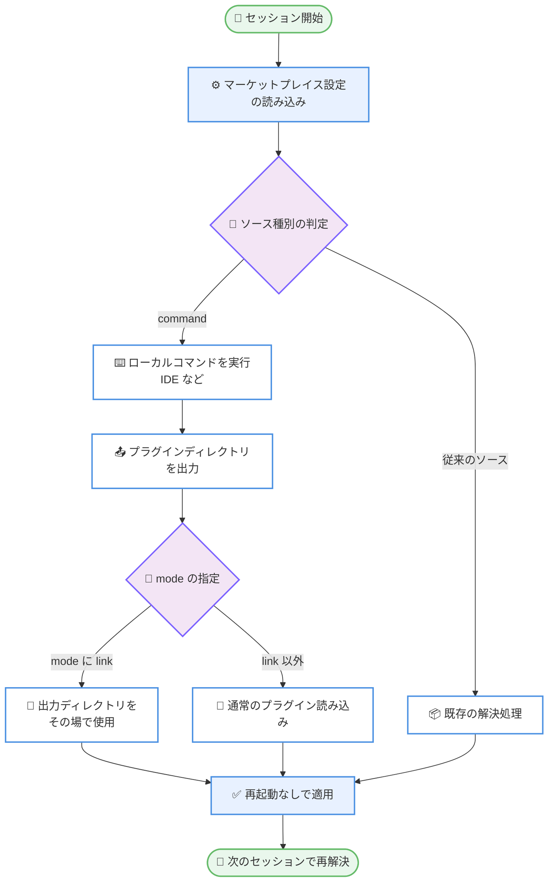

# Claude Code v2.1.229 リリース — プラグインマーケットプレイスの command ソース、SSE キープアライブ ping、/commit-push-pr の危険フラグ自動承認撤廃

## メタデータ

| 項目 | 内容 |
|------|------|
| 発表日 | 2026-08-12 |
| ソース | Claude Code Changelog |
| カテゴリ | Claude Code アップデート |
| 公式リンク | https://github.com/anthropics/claude-code/blob/main/CHANGELOG.md |

## 概要

Claude Code v2.1.229 (2026 年 8 月 12 日、npm 公開日時: 2026-08-12T19:28:48.616Z) がリリースされた。本バージョンは全 32 項目で構成される。カテゴリ別の件数は、追加 3 件、修正 18 件、改善 3 件、更新 2 件、変更 3 件、VSCode 拡張 3 件である。直前の v2.1.228 が 18 項目だったのに対し、項目数はほぼ 2 倍に増えており、対象領域も CLI 本体、ゲートウェイ経由の接続、セルフホストランナー、サンドボックス、VSCode 拡張へと広がっている。

内容の重心は 4 点にある。第一に、プラグインマーケットプレイスに `command` ソースが追加された。ローカルのコマンド (例えば IDE) がプラグインディレクトリを出力し、その結果はセッションごとに再解決され、再起動なしで適用される。`mode: "link"` を指定すると、出力されたディレクトリをその場で使用する。第二に、Vertex および Bedrock を上流とする構成で、長い思考の合間にゲートウェイのストリーミング応答が SSE キープアライブ ping を送るようになり、アイドルタイムアウトによる切断を防ぐ。第三に、ストリーミング中に長い応答が部分的に消え、ターミナルへ二重に出力される問題が修正された。第四に、`/commit-push-pr` において `--force`、`--amend`、`--no-verify` などの危険なフラグを含む git / gh コマンドが自動承認されなくなった。

破壊的変更は 2 件ある。1 件は上記の `/commit-push-pr` の自動承認撤廃であり、もう 1 件はセルフホストランナーの Windows 起動が明示的な `--base-dir` を要求するようになった変更である。Windows にはデフォルトのチェックアウトディレクトリが存在しない。

そのほか、セルフホストランナーセッションでのサーバー提供フック対応、`claude remote-control --continue` のドキュメント化、`ListAgents` における `offline` / `cloud` ラベル、ワークフローのファンアウトにおけるプロンプトプレフィックスキャッシュの再利用、32 MB リクエスト上限を超える会話のコンパクション挙動、サンドボックスの IPv6 リテラル対応とフェイルクローズ強制など、実運用に直結する項目が揃っている。

## 詳細

### 背景

直前のリリース v2.1.228 (2026 年 8 月 11 日) は、修正 12 件、改善 3 件、変更 2 件、削除 1 件の全 18 項目で構成され、内部レイアウトエラーによる対話セッションの再描画停止、claude.ai から同期されたスキルのハードニング、Write ツールの上書きルール変更が中心であった。新機能の追加はなく、安定性とセキュリティ境界の整理に寄った内容である。

v2.1.229 はその流れを受けつつ、性格が変わっている。追加が 3 件戻ってきており、なかでもプラグインマーケットプレイスの `command` ソースは、プラグインの配布・解決の方式に新しい選択肢を加える変更である。v2.1.228 が設定階層をまたいだ marketplace エントリのマージを修正していたのに対し、本リリースはマーケットプレイスのソース種別そのものを拡張しており、プラグイン周辺の整備が継続していることが読み取れる。

セルフホストランナーについても連続性がある。v2.1.228 では `checkout` フック失敗時に全ランナーのセッションが失敗する問題と、バックグラウンドタスク完了直後のセッション早期終了が修正された。本リリースではサーバー提供フックへの対応が追加され、`managed-mcp.json` が配備された環境での起動時終了、Git Credential Manager のプロンプトによるハングが修正され、さらに Windows 起動時の `--base-dir` 必須化という破壊的変更が入っている。導入から日の浅いセルフホスト実行環境が、実運用で見つかった問題を順次取り込んでいる段階にある。

Remote Control についても、v2.1.228 で `/resume` による履歴・タイトルの漏洩が修正されたのに続き、本リリースでは `--continue` のドキュメント化、`ListAgents` のラベル追加、ラップトップ側ターミナルでスラッシュコマンドを入力した後にスピナーが固まる問題の修正が加わっている。

### 主な変更点

#### 追加 (Added)

1. **セルフホストランナーセッションでのサーバー提供フック対応**: セルフホストランナーのセッションで、サーバーから提供される Claude Code フックがサポートされるようになった。マネージド環境の挙動と一致する

2. **SSE キープアライブ ping の追加**: 長い思考の一時停止中に、ゲートウェイのストリーミング応答へ SSE キープアライブ ping を送るようになった。これにより Vertex および Bedrock を上流とする構成でのアイドルタイムアウト切断を防ぐ

3. **プラグインマーケットプレイスの `command` ソースの追加**: ローカルのコマンド (例えば IDE) がプラグインディレクトリを出力する方式が追加された。出力はセッションごとに再解決され、再起動なしで適用される。`mode: "link"` を指定すると、そのディレクトリをその場で使用する

#### 修正 (Fixed)

4. **ストリーミング中の応答の消失と二重出力の修正**: 長い応答がストリーミング中に部分的に消え、ターミナルに 2 回出力される問題を修正

5. **非文字列の引数値によるクラッシュの修正**: ツール呼び出しの `glob`、`file_path`、`command` の値が文字列でない場合に、エラー画面へのクラッシュが発生する問題を修正。該当セッションの `--resume` 時に発生するケースも含む

6. **狭いターミナルでの RangeError クラッシュの修正**: 非常に幅の狭いターミナルウィンドウで進捗バーや Markdown テーブルが描画された際の RangeError クラッシュを修正。起動時に `claude --continue` / `--resume` をクラッシュさせる可能性もあった

7. **Windows の拡張長パス・UNC パスによるクラッシュの修正**: ツール呼び出しやメッセージが拡張長パス (`\\?\`) または UNC パスでファイルを参照した場合に、Windows でクラッシュする問題を修正

8. **`CLAUDE_CODE_ATTRIBUTION_HEADER` による auto モード失敗の修正**: `CLAUDE_CODE_ATTRIBUTION_HEADER` で attribution ヘッダーを無効化しているユーザーについて、auto モードがすべてのツール呼び出しで失敗する問題を修正。Anthropic API への直接接続が対象

9. **カスタムゲートウェイでの `/model` 拒否の修正**: カスタムの `ANTHROPIC_BASE_URL` ゲートウェイを使用する claude.ai サブスクライバーに対して、`/model` が Sonnet / Opus 1M を拒否する問題を修正

10. **厳格な認可サーバーでの MCP OAuth の修正**: リダイレクト URI に `localhost` ではなく `127.0.0.1` を使用することで、厳格な認可サーバーでの MCP OAuth を修正

11. **Remote Control のスピナー固着の修正**: ラップトップのターミナルでスラッシュコマンドを入力した後に、Remote Control クライアントで作業中スピナーが固まったままになる問題を修正

12. **Claude Code Review ワークフローのレビュー未投稿の修正**: `/install-github-app` が生成する Claude Code Review ワークフローが、プルリクエストにレビューを投稿せずに完了してしまう問題を修正

13. **IDE 診断多数時の UI 停止の修正**: IDE 拡張が接続されている状態で、数千件の IDE 診断を伴うファイルを編集した後に発生する数秒間の UI 停止を修正

14. **`claude plugin` の残存 liveness ファイルの修正**: ワンショットの `claude plugin` コマンドが liveness ファイルを残し、古いバージョンのプラグインのクリーンアップを妨げる可能性があった問題を修正

15. **CPU 制限コンテナでのコア数誤認の修正**: CPU 制限のあるコンテナ内の動的ワークフローが、コンテナの CPU 制限ではなくホストマシンのコア数を使用してしまう問題を修正

16. **ファイルウォッチャーのハンドルリークとスケジュールタスク監視エラーの修正**: アトミックなファイル置換の後に発生するファイルウォッチャーのハンドルリークと、ネットワークファイルシステムや仮想ファイルシステムでスケジュールタスクのウォッチャーが失敗した際に Windows で発生する未捕捉エラーを修正

17. **空白のみのメッセージによる 400 エラーの修正**: SDK および `--input-format stream-json` のセッションで、空白のみのメッセージを送信すると 400 API エラーになる問題を修正

18. **32 MB リクエスト上限超過時のコンパクションリトライの修正**: メッセージだけで API の 32 MB リクエスト上限を超える会話について、除去できる画像やドキュメントが存在しないにもかかわらずコンパクションをリトライし続ける問題を修正。以降は明確なメッセージを伴って一度だけ失敗する

19. **Claude Desktop セッションからの OpenTelemetry エクスポートの修正**: Desktop が管理するゲートウェイが同時にテレメトリのエンドポイントでもある場合に、Claude Desktop セッションからの OpenTelemetry エクスポートが拒否される問題を修正

20. **`managed-mcp.json` 配備時のリモートセッション起動失敗の修正**: `managed-mcp.json` が配備されており、かつサーバーが MCP サーバーを配信する場合に、セルフホストランナーやその他のリモートセッションが起動時に終了してしまう問題を修正。該当するサーバーは警告を出してスキップされるようになった

21. **セルフホストランナーの Git Credential Manager ハングの修正**: セルフホストランナーのリポジトリ準備処理が Git Credential Manager のプロンプトでハングする問題を修正。認証情報が欠落している場合、git はすぐに失敗するようになった

#### 改善 (Improved)

22. **ワークフローのファンアウトにおけるプレフィックスキャッシュ再利用の改善**: ワークフローのファンアウトで、同一プレフィックスを持つ兄弟エージェントの起動時刻をずらすようになった。これにより後続のエージェントはキャッシュされたプロンプトプレフィックスを読み込み、同じ分のコストを再度支払わずに済む。`CLAUDE_CODE_WORKFLOW_PREFIX_STAGGER_MS=0` で無効化できる

23. **"prompt is too long" エラーの改善**: `/compact` を提案するだけでなく、自動コンパクションでなぜ回復できなかったのかを説明するようになった

24. **サンドボックスの改善**: ネットワークドメインリスト中の IPv6 リテラルが角括弧で囲われるようになり (`[::1]:443`)、曖昧な表記はフェイルクローズで強制され、`/doctor` で警告される

#### 更新 (Updated / Documented)

25. **`claude remote-control --continue` のドキュメント化**: 直近の Remote Control セッションを再開するための `claude remote-control --continue` がドキュメントに記載された

26. **`/login` の警告表示の更新**: ログイン成功後に `CLAUDE_CODE_OAUTH_TOKEN` の上書きに関する警告を再度表示するようになった

#### 変更 (Changed)

27. **`ListAgents` のラベル変更**: `ListAgents` は切断された Remote Control セッションを `offline` としてマークし、ユーザーのクラウドセッションを `cloud` としてラベル付けするようになった

28. **`/commit-push-pr` の危険フラグ自動承認の撤廃 (破壊的変更)**: `/commit-push-pr` において、危険なフラグ (`--force`、`--amend`、`--no-verify` など) を伴う git / gh コマンドが自動承認されなくなった

29. **セルフホストランナーの Windows 起動における `--base-dir` 必須化 (破壊的変更)**: セルフホストランナーの Windows 起動で、明示的な `--base-dir` の指定が必須になった。Windows にはデフォルトのチェックアウトディレクトリが存在しない

#### VSCode

30. **[VSCode] フィードバックダイアログへの切り替え**: 「Report a problem」および `/bug` が、廃止されたアンケートのリンクではなく組み込みのフィードバックダイアログを開くようになった

31. **[VSCode] `/btw` パネルのリサイズ対応**: `/btw` のサイドクエスチョンパネルが、境界のドラッグでリサイズ可能になった。サイドドッキング配置とスタック配置の両方に対応する

32. **[VSCode] サイドバーのセッショングループの追加**: サイドバーにセッショングループが追加された。右クリックで作成、名前の変更、削除ができ、Cmd / Ctrl クリックまたは Shift クリックで複数のセッションを一度に移動できる

### 技術的な詳細

#### プラグインマーケットプレイスの `command` ソース

本リリースで最も新規性の高い追加である。従来のプラグインマーケットプレイスは、あらかじめ確定した場所からプラグインを解決する方式であった。`command` ソースは、その解決をローカルのコマンド実行に委ねる。

changelog の記述に沿って整理すると、動作は次のとおりである。まず、ローカルのコマンド (例えば IDE) がプラグインディレクトリを標準出力に出力する。次に、その出力はセッションごとに再解決される。そして解決結果は再起動なしで適用される。`mode: "link"` を指定した場合は、出力されたディレクトリをその場で使用する。

この 3 つの性質は、実際の開発フローに対して具体的な意味を持つ。

**セッションごとの再解決**: プラグインの提供元がローカルの状態に応じて変化する場合、その変化がセッション開始のたびに反映される。IDE がワークスペースの状態に応じて異なるプラグインディレクトリを出力する構成であれば、ユーザー側で設定を書き換える必要がない。

**再起動なしの適用**: 解決結果の適用に Claude Code の再起動を必要としない。プラグイン開発中の反復サイクルにおいて、待ち時間の削減につながる。

**`mode: "link"` によるその場での使用**: 出力されたディレクトリを複製せずにその場で使う指定である。開発中のプラグインディレクトリを直接参照する用途に向く。なお v2.1.228 では、プラグインの唯一のバージョンがシンボリックリンクされた開発用チェックアウトである場合に、バックグラウンドのプラグインキャッシュクリーンアップがそのキャッシュを削除してしまう問題が修正されている。リンク方式での開発利用に関する整備が続いていることが読み取れる。

なお、`command` ソースはローカルコマンドの実行を伴うため、設定するコマンドは信頼できるものに限る必要がある。changelog は具体的な設定スキーマの全体像を示していないため、実際のキー構成は公式ドキュメントで確認することを推奨する。

#### SSE キープアライブ ping とアイドルタイムアウト

Claude Code のストリーミング応答は Server-Sent Events (SSE) で配信される。モデルが長時間の思考を行う局面では、SSE のストリーム上にデータが流れない時間が生じる。この無通信区間が長引くと、経路上のロードバランサやプロキシがアイドルタイムアウトと判断して接続を切断することがある。

changelog は、この問題が Vertex および Bedrock を上流とする構成で顕在化することを明記している。本リリースでは、長い思考の一時停止中にゲートウェイのストリーミング応答へキープアライブ ping を挿入することで、無通信区間そのものを発生させない方式が採られた。Vertex AI または Amazon Bedrock 経由で Claude Code を利用しており、長時間の思考中に接続が切れる症状に遭遇していた環境では、本バージョンへの更新価値が高い。

#### ワークフローのファンアウトとプロンプトプレフィックスキャッシュ

Claude Code のワークフローは、複数のサブエージェントを並列に起動するファンアウトを行うことがある。このとき、同じプレフィックスを持つ兄弟エージェント (same-prefix sibling agents) は、プロンプトの先頭部分が共通になる。

プロンプトキャッシュは、共通のプレフィックスがすでにキャッシュに書き込まれていれば、後続のリクエストがそれを読み込む形で機能する。ところが完全に同時に起動すると、いずれのリクエストもキャッシュ書き込みの完了を待たずに走るため、各エージェントが同じプレフィックス分のコストを個別に支払うことになる。

本改善は、同一プレフィックスの兄弟エージェントの起動時刻をずらすことで、先行するエージェントがプレフィックスをキャッシュに載せ、後続のエージェントがそれを読み込むようにした。changelog は、後続エージェントが「同じ分を再度支払う代わりにキャッシュされたプロンプトプレフィックスを読む」と記述している。この時間差の挿入は `CLAUDE_CODE_WORKFLOW_PREFIX_STAGGER_MS=0` で無効化できる。並列起動の即時性を最優先したい場合は、この環境変数で従来の挙動に戻せる。

#### 32 MB リクエスト上限とコンパクションの終了条件

Claude API にはリクエストサイズの上限として 32 MB がある。会話が長大になった場合、Claude Code は自動コンパクションによって会話を縮約し、リクエストを上限内に収めようとする。この縮約の手段には、画像やドキュメントの除去も含まれる。

修正前は、メッセージだけで 32 MB を超える会話について、除去できる画像やドキュメントが存在しない状況でもコンパクションのリトライが繰り返されていた。縮約する対象がないため成功する見込みはなく、ユーザーは進捗のない再試行を待たされることになる。本修正により、この状況では明確なメッセージを伴って一度だけ失敗するようになった。

関連する改善として、"prompt is too long" エラーが `/compact` の提案だけでなく、自動コンパクションでなぜ回復できなかったのかを説明するようになった。両者を合わせると、コンテキスト上限に到達した際に、ユーザーが状況を把握して次の行動を選べるようになる方向の変更である。

#### `/commit-push-pr` の危険フラグ自動承認の撤廃

本リリースでセキュリティ上の意味が最も大きい変更である。`/commit-push-pr` はコミットからプッシュ、プルリクエスト作成までを一連で行うコマンドであり、その過程で git / gh コマンドを実行する。修正前は、このコマンドが実行する git / gh コマンドが自動承認の対象であった。

問題は、自動承認の範囲に危険なフラグを伴うコマンドまで含まれていた点にある。changelog は具体例として `--force`、`--amend`、`--no-verify` を挙げている。これらは次のような不可逆または検証回避の作用を持つ。

**`--force`**: `git push --force` はリモートの履歴を上書きする。他者のコミットが失われる可能性があり、共有ブランチに対して実行された場合の影響は大きい。

**`--amend`**: `git commit --amend` は直前のコミットを書き換える。すでにプッシュ済みのコミットに対して行い、続けて強制プッシュすると履歴の不整合を招く。

**`--no-verify`**: コミットフックやプッシュフックの実行を省略する。lint、テスト、シークレット検出などをフックで担保している運用では、その検証をすべて回避することになる。

これらが自動承認されていた状態は、ユーザーの確認を経ずに不可逆な操作や検証回避が行われうる経路であった。本リリース以降は自動承認されなくなり、実行の可否がユーザーの判断に戻る。安全側への変更であるが、`/commit-push-pr` を無人で実行していた自動化がある場合には、承認待ちで停止する可能性がある破壊的変更でもある。

#### セルフホストランナーの Windows における `--base-dir` 必須化

もう 1 件の破壊的変更である。セルフホストランナーはリポジトリをチェックアウトして作業を行うため、そのベースとなるディレクトリが必要になる。changelog は、Windows にはデフォルトのチェックアウトディレクトリが存在しないと明記している。

修正前は、`--base-dir` を指定しない起動が受け付けられていた。本リリース以降は、Windows 上でセルフホストランナーを起動する際に `--base-dir` の明示的な指定が必須となる。指定のない既存の起動スクリプトやサービス定義は、そのままでは起動に失敗する。

#### サンドボックスの IPv6 リテラルとフェイルクローズ

サンドボックスは、ネットワークドメインリストに基づいて通信先を制御する。IPv6 アドレスをリテラルで記述する場合、ポート番号との区切りが曖昧になるという構文上の問題がある。IPv6 アドレス自体がコロンを含むためである。

本リリースでは、ネットワークドメインリスト中の IPv6 リテラルが角括弧で囲われるようになった。changelog は例として `[::1]:443` を挙げている。これは IPv6 アドレスを角括弧で囲み、その後にポートを続ける一般的な記法である。

さらに重要なのは、曖昧な表記の扱いである。changelog は、曖昧な表記がフェイルクローズ (fail-closed) で強制され、`/doctor` によって警告されると記述している。フェイルクローズとは、判断がつかない場合に許可ではなく拒否を選ぶ設計である。ネットワーク制御においては、解釈が曖昧な記述を「通す」方向に解決してしまうと、意図しない通信が許可される。フェイルクローズを採ることで、設定の曖昧さが権限の緩みに直結しない構造になる。加えて `/doctor` が該当箇所を警告するため、設定を書き直すべき箇所をユーザーが把握できる。

#### Remote Control の運用改善

Remote Control 関連では 3 つの項目がある。第一に、`claude remote-control --continue` がドキュメント化された。これは直近の Remote Control セッションを再開するためのフラグである。第二に、`ListAgents` が切断された Remote Control セッションを `offline` としてマークし、クラウドセッションを `cloud` としてラベル付けするようになった。複数のセッションが一覧に並ぶ状況で、どのセッションが到達可能でどれがクラウド上のものかを判別できる。第三に、ラップトップのターミナルでスラッシュコマンドを入力した後に、Remote Control クライアント側で作業中スピナーが固まったままになる問題が修正された。

#### `CLAUDE_CODE_ATTRIBUTION_HEADER` と auto モード

attribution ヘッダーは、リクエストの発信元に関する情報を付与するヘッダーである。`CLAUDE_CODE_ATTRIBUTION_HEADER` はこれを無効化するための環境変数として存在する。修正前は、この環境変数でヘッダーを無効化しているユーザーについて、auto モードがすべてのツール呼び出しで失敗していた。changelog は対象を Anthropic API への直接接続と明記している。ヘッダーの無効化はプライバシーや社内ポリシーの都合で設定されることがあり、その設定が auto モードを完全に使用不能にしていた点で影響の大きい不具合であった。

## 開発者への影響

### 対象

- **Vertex AI / Amazon Bedrock 利用者**: 長い思考の一時停止中に SSE キープアライブ ping が送られるようになり、アイドルタイムアウトによる切断が防がれる。長時間の思考で接続が切れていた環境では更新価値が高い
- **セルフホストランナー利用者**: サーバー提供フックへの対応が追加された一方、Windows 起動では `--base-dir` の明示指定が必須になった (破壊的変更)。加えて `managed-mcp.json` 配備時の起動失敗と Git Credential Manager によるハングが修正された
- **`/commit-push-pr` を利用しているユーザーおよびチーム**: 危険なフラグを伴う git / gh コマンドが自動承認されなくなった (破壊的変更)。安全側への変更だが、自動化の挙動が変わる可能性がある
- **プラグイン開発者およびプラグインを配布するチーム**: マーケットプレイスに `command` ソースが追加され、セッションごとの再解決と再起動なしの適用、`mode: "link"` による直接参照が可能になった
- **ワークフローのファンアウトを利用しているユーザー**: 同一プレフィックスの兄弟エージェントの起動がずらされ、プロンプトプレフィックスのキャッシュが再利用されるようになった
- **TUI を日常的に利用するすべてのユーザー**: ストリーミング中の応答消失と二重出力、狭いターミナルでの RangeError クラッシュ、非文字列引数によるクラッシュが修正された
- **Windows ユーザー**: 拡張長パス (`\\?\`) および UNC パス参照時のクラッシュと、ネットワーク・仮想ファイルシステムでのスケジュールタスク監視の未捕捉エラーが修正された
- **`CLAUDE_CODE_ATTRIBUTION_HEADER` を設定しているユーザー**: Anthropic API への直接接続で auto モードが全ツール呼び出しに失敗する問題が解消された
- **カスタムゲートウェイを使う claude.ai サブスクライバー**: `ANTHROPIC_BASE_URL` にカスタムゲートウェイを設定している場合の `/model` による Sonnet / Opus 1M の拒否が解消された
- **MCP の OAuth を利用しているユーザー**: リダイレクト URI が `127.0.0.1` になり、厳格な認可サーバーでも OAuth が機能する
- **コンテナで Claude Code を動かしているユーザー**: CPU 制限のあるコンテナ内で、ホストのコア数ではなくコンテナの CPU 制限が使われるようになった
- **`/install-github-app` を利用しているリポジトリ**: Claude Code Review ワークフローがレビューを投稿せずに完了する問題が修正された
- **IDE 拡張および VSCode 拡張の利用者**: 数千件の診断を伴う編集後の UI 停止が修正され、`/btw` パネルのリサイズとサイドバーのセッショングループが利用できる
- **SDK / `--input-format stream-json` 利用者**: 空白のみのメッセージ送信による 400 エラーが解消された
- **サンドボックスを利用しているユーザー**: IPv6 リテラルの角括弧記法に対応し、曖昧な表記はフェイルクローズで拒否され `/doctor` で警告される

### 必要なアクション

**1. セルフホストランナーの Windows 起動への対応 (破壊的変更・対応必須)**

Windows 上でセルフホストランナーを起動している場合、`--base-dir` の明示的な指定が必須になった。Windows にはデフォルトのチェックアウトディレクトリが存在しないため、指定がないと起動できない。以下を実施する。

- 起動スクリプト、サービス定義、タスクスケジューラの設定など、セルフホストランナーを起動しているすべての箇所を洗い出す
- `--base-dir` を指定していない箇所に、チェックアウト先のディレクトリを明示的に追加する
- 指定するディレクトリがランナーの実行アカウントで書き込み可能であることを確認する
- 更新後に、実際にセッションが起動しリポジトリの準備が完了することを確認する
- Windows 以外のプラットフォームで運用している場合、この変更の対象外である

**2. `/commit-push-pr` の自動承認撤廃への対応 (破壊的変更・確認必須)**

`/commit-push-pr` において、`--force`、`--amend`、`--no-verify` などの危険なフラグを伴う git / gh コマンドが自動承認されなくなった。以下を確認する。

- `/commit-push-pr` を無人環境や CI で実行している場合、承認待ちで停止する可能性がある。実行フローを確認し、承認が必要な操作が含まれていないかを点検する
- 危険なフラグの使用が業務上どうしても必要な場合は、なぜ必要なのかを見直す。多くの場合、`--force` の代わりに `--force-with-lease` を使う、`--amend` の代わりに新しいコミットを積む、`--no-verify` をやめてフックの失敗自体を解消する、といった代替がある
- フックによる検証 (lint、テスト、シークレット検出など) を運用の前提としている場合、`--no-verify` が自動承認されなくなったことは検証の実効性を高める変更である。これまで意図せず検証が回避されていなかったかを、直近のコミット履歴で確認する
- 本変更はユーザーの確認を挟む方向への変更であり、無効化して従来の挙動に戻す設定は changelog に記載されていない

**3. ワークフローのファンアウトの起動タイミング変更への対応 (任意)**

同一プレフィックスの兄弟エージェントの起動がずらされるようになった。プロンプトプレフィックスのキャッシュ再利用によるコスト面の利点がある一方、並列起動の開始が完全に同時ではなくなる。即時性を優先する場合は次の環境変数で無効化できる。

```bash
export CLAUDE_CODE_WORKFLOW_PREFIX_STAGGER_MS=0
```

**4. サンドボックス設定の確認 (任意)**

ネットワークドメインリストに IPv6 リテラルを記述している場合、角括弧を用いた記法 (`[::1]:443` の形式) に整えることを推奨する。曖昧な表記はフェイルクローズで拒否されるため、意図した通信が遮断される可能性がある。`/doctor` を実行すると、警告対象の記述を確認できる。

**5. バージョンの更新**

本記事の「コード例」に記載したコマンドで最新バージョンに更新できる。更新後は `claude --version` でバージョンを確認する。

### 移行ガイド (該当する場合)

本リリースには破壊的変更が 2 件含まれる。移行時の確認手順は次のとおり。

1. 本バージョンへ更新し、`claude --version` で `2.1.229` になっていることを確認する
2. Windows でセルフホストランナーを運用している場合、起動コマンドに `--base-dir` を追加し、セッションが起動することを確認する (対応必須)
3. `/commit-push-pr` を利用している場合、危険なフラグを伴う git / gh コマンドが承認待ちになることを前提に、無人実行のフローを見直す (確認必須)
4. ワークフローのファンアウトを多用している場合、起動タイミングのずれが許容できるかを確認し、必要に応じて `CLAUDE_CODE_WORKFLOW_PREFIX_STAGGER_MS=0` を設定する
5. サンドボックスのネットワークドメインリストに IPv6 リテラルがある場合、`/doctor` で警告が出ていないかを確認し、角括弧記法に整える
6. プラグインマーケットプレイスの `command` ソースを導入する場合、出力するコマンドが信頼できるものであることを確認し、`mode: "link"` の指定が必要かを判断する

## コード例

### アップグレード方法

```bash
# npm で最新バージョンをインストール
npm install -g @anthropic-ai/claude-code@latest

# Claude Code の自己更新コマンドを利用する場合
claude update

# 更新後のバージョンを確認し、2.1.229 になっていることを確かめる
claude --version
```

### プラグインマーケットプレイスの `command` ソースの設定例

ローカルのコマンドがプラグインディレクトリを出力する構成の例である。出力はセッションごとに再解決され、再起動なしで適用される。`mode: "link"` を指定すると、そのディレクトリをその場で使用する。設定キーの詳細は公式ドキュメントで確認すること。

```json
{
  "marketplaces": {
    "my-ide-plugins": {
      "source": "command",
      "command": "my-ide --print-plugin-dir",
      "mode": "link"
    }
  }
}
```

### セルフホストランナーの Windows 起動 (`--base-dir` 必須)

```bash
# v2.1.229 以降、Windows では --base-dir の明示指定が必須
claude self-hosted-runner --base-dir C:\claude-runner\checkouts
```

### ワークフローのプレフィックススタガーを無効化する

```bash
# 同一プレフィックスの兄弟エージェントの起動時刻のずらしを無効化
export CLAUDE_CODE_WORKFLOW_PREFIX_STAGGER_MS=0
```

### Remote Control セッションの再開

```bash
# 直近の Remote Control セッションを再開する
claude remote-control --continue
```

## アーキテクチャ図 (該当する場合)

### プラグインマーケットプレイスの `command` ソース解決フロー



## 関連リンク

- [Claude Code Changelog](https://github.com/anthropics/claude-code/blob/main/CHANGELOG.md)
- [Claude Code GitHub リポジトリ](https://github.com/anthropics/claude-code)
- [Claude Code ドキュメント](https://docs.anthropic.com/en/docs/claude-code)
- [Claude Code v2.1.228](./2026-08-11-claude-code-v2-1-228.md)
- [Claude Code v2.1.227](./2026-08-10-claude-code-v2-1-227.md)

## まとめ

Claude Code v2.1.229 は、追加 3 件、修正 18 件、改善 3 件、更新 2 件、変更 3 件、VSCode 拡張 3 件の全 32 項目で構成される、規模の大きいリリースである。修正中心であった v2.1.228 に対し、新機能の追加と破壊的変更の両方を含む。

機能面で最も注目すべきはプラグインマーケットプレイスの `command` ソースである。ローカルのコマンドがプラグインディレクトリを出力し、その結果はセッションごとに再解決され、再起動なしで適用される。`mode: "link"` を指定すると出力されたディレクトリをその場で使用する。プラグイン開発の反復サイクルと、ローカル環境の状態に応じた動的なプラグイン提供の両方に効く追加である。

接続の安定性では、Vertex および Bedrock を上流とする構成に対する SSE キープアライブ ping の追加が大きい。長い思考の一時停止中に無通信区間が生じないため、アイドルタイムアウトによる切断が防がれる。加えて、ストリーミング中に長い応答が部分的に消えて二重に出力される問題の修正は、日常的に TUI を利用するすべてのユーザーに関わる。

破壊的変更は 2 件を明確に区別して扱う必要がある。セルフホストランナーの Windows 起動における `--base-dir` の必須化は対応必須であり、指定のない起動スクリプトはそのままでは動作しない。`/commit-push-pr` における危険なフラグの自動承認撤廃は安全側への変更であるが、無人実行のフローがある場合は承認待ちで停止する可能性がある。`--force`、`--amend`、`--no-verify` はいずれも不可逆な操作や検証回避を伴うため、ユーザーの確認を挟む設計に戻ったことは運用上の安全性を高める。

コスト面では、ワークフローのファンアウトで同一プレフィックスの兄弟エージェントの起動をずらし、プロンプトプレフィックスのキャッシュを再利用する改善が入った。即時性を優先する場合は `CLAUDE_CODE_WORKFLOW_PREFIX_STAGGER_MS=0` で無効化できる。セキュリティ面では、サンドボックスの IPv6 リテラル対応と、曖昧な表記に対するフェイルクローズの強制および `/doctor` による警告が、設定の曖昧さが権限の緩みにつながらない構造を用意している。

そのほか、32 MB リクエスト上限を超える会話がコンパクションを無為にリトライし続ける問題の修正、"prompt is too long" エラーの説明の充実、`CLAUDE_CODE_ATTRIBUTION_HEADER` 設定時の auto モード失敗、MCP OAuth のリダイレクト URI、CPU 制限コンテナでのコア数誤認など、影響範囲の明確な修正が幅広く揃っている。
