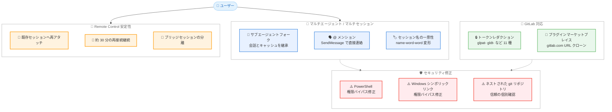

# Claude Code v2.1.231 & v2.1.232 リリース — サブエージェントフォークのデフォルト有効化、@ メンションによるセッション間メッセージング、GitLab 対応、セキュリティ修正多数

## メタデータ

| 項目 | 内容 |
|------|------|
| 発表日 | 2026-08-13 |
| ソース | Claude Code Changelog |
| カテゴリ | Claude Code アップデート |
| 公式リンク | https://github.com/anthropics/claude-code/blob/main/CHANGELOG.md |

## 概要

Claude Code v2.1.231 および v2.1.232 (2026 年 8 月 13 日、npm レジストリ基準) がリリースされた。v2.1.231 は MCP OAuth の修正 1 件のみの小規模パッチ、v2.1.232 は新機能、セキュリティ修正、Remote Control の安定性改善など約 50 項目を含む大規模リリースである。

v2.1.232 の主要テーマは 4 つある。第一に、**サブエージェントフォークのデフォルト有効化**。`subagent_type: "fork"` を指定したサブエージェントが会話全体とプロンプトキャッシュを継承するようになり、インタラクティブセッションではチームメイト以外のエージェント起動がデフォルトでバックグラウンド実行となった。第二に、**セッション間コラボレーションの強化**。プロンプトで `@` を入力すると他の Claude セッションを名前で指定でき、Claude が `SendMessage` を使って直接連絡する。第三に、**GitLab 対応**。GitLab トークンファミリーのシークレットレダクションと、プラグインマーケットプレイスでの `gitlab.com` リポジトリ URL のサポートが追加された。第四に、**セキュリティ修正の集中投入**。PowerShell の権限バイパス、Windows のシンボリックリンク経由の権限バイパス、ネストされた git リポジトリの信頼継承など、複数の脆弱性が修正されている。

## 詳細

### 背景

Claude Code は近年、複数セッション・複数エージェントの協調動作を段階的に強化してきた。v2.1.225 では SendMessage による他マシンの Remote Control セッションへの名前指定での会話開始が実現し、今回の v2.1.232 では `@` メンションによる UI レベルでの統合と、同一マシン上でのセッション名の一意性保証が加わった。サブエージェントのフォーク機能も実験的な位置付けからデフォルト有効へと昇格し、マルチエージェントワークフローが標準機能として整備されつつある。

また、これまでプラグインマーケットプレイスやシークレットレダクションは GitHub 中心の対応だったが、本リリースで GitLab がほぼ同等の扱いとなり、GitLab を利用する企業環境への適合性が向上した。

v2.1.231 は、Slack など事前登録済み OAuth クライアントを使う MCP サーバーへのサインインがリダイレクト URI の不一致で失敗する問題を単独で修正した緊急パッチである。

### 主な変更点

#### v2.1.231: MCP OAuth の修正

1. **MCP OAuth サインイン失敗の修正**: 事前登録済み OAuth クライアントを使用する MCP サーバー (Slack など) へのサインインが、リダイレクト URI の不一致で失敗する問題を修正

#### サブエージェントフォークのデフォルト有効化 (v2.1.232)

2. **`subagent_type: "fork"` のデフォルト有効化**: フォーク型サブエージェントが会話全体とプロンプトキャッシュを継承するようになった。また、インタラクティブセッションでは、チームメイト以外のエージェント起動がデフォルトでバックグラウンド実行される

3. **エージェントパネルの更新**: 完了したサブエージェントは即座に非表示となり、`/tasks` のフッターヒントが表示される。「↓ N more」のオーバーフローインジケーターは視認性向上のため左に移動した

4. **スタートアップティップの削除**: カスタムサブエージェント作成を勧める起動時のヒントと、`/powerup` ツアー内の対応する案内が削除された

#### @ メンションによるセッション間メッセージング (v2.1.232)

5. **`@` メンションのサポート**: プロンプトで `@` を入力すると他の Claude セッションを名前で指定でき、Claude が `SendMessage` を使ってそのセッションに直接連絡する

6. **`SendMessage` の名前解決改善**: 名前のみの指定でも、ライブセッション 1 件と完全一致すれば ref による確認なしで配信されるようになった

7. **セッション名の一意性保証**: 同一マシン上のインタラクティブセッションは一意な名前を維持する。既存のライブセッションと同名で開始または改名すると、`name-word-word` 形式のバリアントが割り当てられ、その旨が通知される

8. **`/config` の新設定項目**: 「Dialog expiry」と「Messages from your other sessions」(セッション間の受信メッセージを許可 / 保留 / 拒否) の 2 行が追加された

#### GitLab 対応 (v2.1.232)

9. **GitLab トークンのシークレットレダクション**: GitLab のトークンファミリー (`glrt-`、`gloas-`、`glptt-`、`glagent-`、`glimt-`、`glsoat-`、`glcbt-`、`glft-`、`glffct-`) のレダクションと、ルーティング可能な `glpat-`/`gldt-` トークンの完全レダクションが追加された。`glab` CLI の設定ストアも `gh` と同様のサンドボックスおよび認証情報パスの保護を受ける

10. **プラグインマーケットプレイスの GitLab 対応**: `gitlab.com` のリポジトリ URL (ネストされたサブグループを含む) が `github.com` の URL と同様にクローンできるようになった。クローンの認証失敗時のヒントには、実際に使用している git ホスト名が表示される

#### マーケットプレイスとエンタープライズ設定 (v2.1.232)

11. **設定エイリアスの追加**: `additionalMarketplaces` と `allowedMarketplaces` が、`extraKnownMarketplaces` と `strictKnownMarketplaces` のより分かりやすいエイリアスとして利用可能になった

12. **`blockedMarketplaces` の適用強化**: エンタープライズポリシーで url タイプの `blockedMarketplaces` にベアリポジトリ URL を指定した場合、CLI がその URL を git クローンとして分類してもブロックが維持される

13. **ゲートウェイの `desktop:` オーバーレイ拡張**: 従来手動で列挙された 11 個のキーのみだったが、リリース済みのすべての Desktop 設定を受け付けるようになった。Desktop 自身のスキーマに対して起動時に検証され、不明または無効なキーは起動失敗となる

14. **ゲートウェイの起動時検証強化**: `managed.policies[].match.groups` や `admin.admin_groups` の空エントリ、不正な `email_domain` 値 (空、`@`・空白・カンマを含む) は、誰にもマッチしない、または管理者権限を付与してしまう事態を防ぐため、起動時にエラーとなる

#### Fable 5 アドバイザーの再提供 (v2.1.232)

15. **`/advisor` での Fable 5 再提供**: Fable アクセスを持つ組織向けに、Fable 5 が `/advisor` のアドバイザーとして再び提供される。使用量クレジットの同意は `/model fable` を通じて設定する

16. **同意メッセージの修正**: インタラクティブな `--advisor fable` 起動時の同意メッセージが、既に終了したインタラクティブセッションで `/model fable` を実行するよう案内していた問題を修正

#### セキュリティ修正 (v2.1.232)

17. **PowerShell 権限バイパスの修正**: 変数書き込みパラメータが `$PSDefaultParameterValues` をサイレントに上書きし、後続コマンドのファイルアクセスをリダイレクトできる権限バイパスを修正

18. **Windows シンボリックリンク権限バイパスの修正**: Git Bash が Cygwin 形式のシンボリックリンクを辿る一方、パス検証はそれらを通常ファイルとして扱っていた権限バイパスを修正。シンボリックリンク経由の書き込みには権限承認が必要になった

19. **ネストされた git リポジトリの信頼継承の修正**: ネストされた git リポジトリが親ディレクトリから信頼を継承していた問題を修正。各リポジトリは個別の信頼確認を必要とする

20. **Bash 入力リダイレクトの権限チェック**: `< file` 形式の入力リダイレクトが、引数として指定した場合と同様に全プラットフォームで権限チェックされるようになった

21. **クロスセッションメッセージングソケットの保護**: 共有 `/tmp` 上の自動生成ソケットディレクトリを強化。事前に仕込まれたシンボリックリンクや他ユーザーのディレクトリは使用せず拒否される

22. **Linux サンドボックスの強化**: Linux ファイルシステムサンドボックスの保護パスバイパスを修正

23. **`sandbox.ripgrep` の制限**: `sandbox.ripgrep` はユーザー設定、管理設定、`--settings` からのみ有効となり、プロジェクト設定からサンドボックスの ripgrep バイナリを上書きできなくなった

24. **Cowork セッションの @-import 制限**: Cowork セッションが、ユーザースコープのメモリファイルから外部 @-import をインライン展開しなくなった

#### Remote Control の安定性改善 (v2.1.232)

25. **ブリッジセッションの分離**: クラウドセッション内のブリッジがホストする Remote Control セッションが、そのセッションのトランスクリプトや認証情報を継承していた問題を修正

26. **セッションの再アタッチ**: Claude Desktop や IDE から開始した Remote Control セッションが、ローカルセッションの再開のたびに新しい claude.ai セッションとして表示される問題を修正。既存セッションに再アタッチされる

27. **アイドル時の到達不能表示の修正**: アイドル中の Remote Control セッションが、新たに接続したクライアントに到達不能と表示される問題を修正

28. **会話履歴の復元**: セッションワーカーの再起動時に、ブリッジセッションが会話履歴を復元しない問題を修正

29. **削除済みセッションの再開**: claude.ai やアプリからセッションが削除された会話を再開すると、ログインに関するメッセージで失敗する代わりに、代替セッションを開始するようになった (v2.1.227 でのリグレッション)

30. **再接続の継続**: ネットワーク断の後、約 30 分間再接続を試行し続ける。1 時間の間に散発する数回の断続で切断されることもなくなった

31. **Remote Control の移動制御**: 会話の再開が、同一マシン上で Remote Control を保持している別の Claude Code からサイレントに奪わなくなった。移動するには保持側で `/remote-control` を実行する

32. **状態表示の明確化**: セッションが別デバイスに引き継がれたのか、別アプリから終了されたのか、削除されたのかをターミナルに表示し、その操作を取り消してしまう再接続の提案を停止した

#### その他の修正 (v2.1.232)

33. **MCP 接続のハング修正**: サーバーがプロトコルバージョンのプローブに応答しない、または不正な応答を返した場合に、接続タイムアウトの 30 秒間フルにハングする問題を修正

34. **Cloud gateway `/login` の修正**: 管理設定の読み込みに失敗した際、「Press Enter to continue」の後にサイレントに終了したり、ターミナルが応答しなくなる問題を修正。理由が表示されるようになった

35. **音声モードの修正**: ネイティブビルドで、音声サービスが接続を拒否した際に「listening...」のまま固まる問題を修正。拒否が即座に表示される

36. **mTLS 証明書の自動リロード**: クライアント証明書のローテーションに再起動が必要だった問題を修正。接続エラー時にローテーション済みの証明書と鍵を自動的に再読み込みする

37. **リージョン値のフォールバック**: 不正な形式の AWS または Vertex のリージョン値がリクエスト URL の構築に使用される問題を修正。デフォルトリージョンにフォールバックする

38. **ストリームアイドルタイムアウトの回復**: Bedrock、Vertex、ゲートウェイ環境で、ストリームのアイドルタイムアウトエラーがリクエストを失敗させる代わりに回復するようになった

39. **表示の修正**: 切り詰められたテキストを含むオーバーレイが 1 列広く描画される問題、先頭切り詰めテキストが省略記号に潰れる問題、絵文字の途中で切れたプレビューによる文字化けを修正

40. **マーケットプレイス登録の競合修正**: `known_marketplaces.json` への同時書き込みにより、プラグインマーケットプレイスがサイレントに登録解除される起動時の競合を修正

41. **`/update` と `/tui` の再起動許可**: 再起動後も存続する作業の実行中に、`/update` と `/tui` が再起動を拒否する問題を修正

#### 改善 (v2.1.232)

42. **フルスクリーンストリーミングの高速化**: 更新のたびに会話全体を再正規化しなくなり、長時間セッションでも応答性が維持される

43. **管理設定の承認ダイアログの改善**: エンドポイント URL の表示、テレメトリのみの変更に対する明確な文言、定型的な OpenTelemetry オプションのスキップに加え、サーバー管理のサンドボックスバイナリ上書き (`sandbox.bwrapPath`、`sandbox.socatPath`、`sandbox.ripgrep`) には承認を必須とした

44. **`/feedback` と `/bug` の即時表示**: Claude の応答中に呼び出しても、ターンの完了を待たずに即座に開くようになった

45. **`/plugin install` のマーケットプレイス自動更新**: `plugin@marketplace` 形式でのインストール時にマーケットプレイスを先に更新するため、新規公開プラグインが手動更新なしでインストールできる

46. **`/code-review` のバックグラウンド実行**: high、xhigh、max のエフォートレベルでも、他のレベルと同様にバックグラウンドエージェントで実行される

47. **画像読み込みの非ブロック化**: 貼り付けおよびクリップボードの画像がイベントループをブロックせずに読み込まれる

### 技術的な詳細

#### サブエージェントフォークの動作

従来のサブエージェントは独立したコンテキストで起動し、必要な情報はプロンプトを通じて明示的に引き渡す必要があった。フォーク型サブエージェント (`subagent_type: "fork"`) は親セッションの会話全体を継承するため、これまでの調査結果や方針決定を再説明することなく作業を分岐できる。さらにプロンプトキャッシュも継承されるため、長大な会話コンテキストを引き継いでもキャッシュヒットにより追加コストとレイテンシが抑えられる。インタラクティブセッションでは、チームメイト以外のエージェント起動がデフォルトでバックグラウンド実行となり、メインの会話を止めずに並行作業を進められる。

#### @ メンションと SendMessage の統合

これまで他セッションへのメッセージ送信は、Claude が `SendMessage` ツールを使う際に ref による確認を挟む場合があった。v2.1.232 では 2 つの改善が入っている。第一に、プロンプト入力中に `@` を入力するとライブセッションを名前で補完でき、ユーザーが宛先を明示すると Claude が `SendMessage` で直接そのセッションに連絡する。第二に、名前のみの指定でもライブセッション 1 件と完全一致すれば確認なしで配信される。この前提として、同一マシン上のセッション名が一意であることが必要なため、重複する名前には `name-word-word` 形式のバリアントが自動的に割り当てられる仕組みが同時に導入された。受信側の制御は `/config` の「Messages from your other sessions」で許可 / 保留 / 拒否を選択できる。

#### GitLab トークンのレダクション

シークレットレダクションは、トランスクリプトやログに含まれる認証情報を自動的にマスクする機能である。従来は GitHub トークン (`ghp_` など) が中心だったが、v2.1.232 で GitLab の 9 種類のトークンファミリーに対応した。特に `glpat-` (パーソナルアクセストークン) と `gldt-` (デプロイトークン) のルーティング可能な形式は完全レダクションの対象となる。また、`glab` CLI の設定ストアが `gh` CLI と同等の保護を受けるため、サンドボックス内のコマンドから GitLab の認証情報パスへのアクセスが制限される。

#### PowerShell と Windows の権限バイパス

v2.1.232 には Windows 環境に関わる 2 件の権限バイパス修正が含まれる。1 件目は PowerShell の `$PSDefaultParameterValues` に関するもので、変数書き込みパラメータを通じてこの自動変数をサイレントに上書きすると、後続コマンドのファイルアクセス先をリダイレクトできてしまう問題だった。2 件目は Git Bash の Cygwin 形式シンボリックリンクに関するもので、パス検証はこれらを通常ファイルとして扱う一方、Git Bash 自体はリンクを辿るため、検証をすり抜けた書き込みが可能だった。修正後は、シンボリックリンク経由の書き込みに権限承認が必要となる。

#### ネストされた git リポジトリの信頼分離

従来、信頼済みディレクトリの配下にある git リポジトリは親の信頼を継承していた。この動作は、たとえばクローンしてきた未検証のリポジトリを信頼済みワークスペース内に配置した場合に、確認なしでそのリポジトリのフック類が有効になるリスクがあった。v2.1.232 以降、各リポジトリは個別に信頼確認を必要とする。信頼済みディレクトリ内にサブリポジトリを持つモノレポ的な構成では、初回アクセス時に追加の確認プロンプトが表示される点に留意が必要である。

## アーキテクチャ図



## 開発者への影響

### 対象

- **すべてのユーザー**: PowerShell 権限バイパス、Windows シンボリックリンクバイパス、ネストされた git リポジトリの信頼継承、Bash 入力リダイレクトの権限チェックなど、複数のセキュリティ修正が含まれるため、速やかなアップデートを推奨
- **マルチエージェントワークフローの利用者**: フォーク型サブエージェントがデフォルトで有効になり、会話とプロンプトキャッシュを継承した分岐作業が標準機能として利用可能に
- **複数セッションを併用するユーザー**: `@` メンションによるセッション指定と `SendMessage` の名前解決改善により、セッション間の連携が UI から直接行えるようになった
- **GitLab を利用する組織**: トークンのレダクション、`glab` CLI の保護、プラグインマーケットプレイスの `gitlab.com` 対応により、GitLab 中心の環境でも GitHub と同等の保護と利便性を得られる
- **Slack など MCP OAuth 利用者**: v2.1.231 でリダイレクト URI 不一致によるサインイン失敗が修正済み
- **Remote Control 利用者**: 再接続の継続、既存セッションへの再アタッチ、状態表示の明確化など、多数の安定性改善が含まれる
- **Bedrock / Vertex / ゲートウェイ利用者**: ストリームアイドルタイムアウトからの回復、不正リージョン値のフォールバック、mTLS 証明書の自動リロードにより、エンタープライズ環境での信頼性が向上
- **Fable アクセスを持つ組織**: `/advisor` で Fable 5 が再び選択可能になった

### 必要なアクション

以下のコマンドで最新バージョンに更新できる。

```bash
# npm でのアップデート
npm update -g @anthropic-ai/claude-code

# Homebrew でのアップデート
brew upgrade claude-code

# 現在のバージョン確認
claude --version
```

**推奨される確認事項:**

- **ネストされた git リポジトリを含むワークスペースの利用者**: 各サブリポジトリで個別の信頼確認が求められるようになるため、初回アクセス時のプロンプトに留意
- **プロジェクト設定で `sandbox.ripgrep` を指定している場合**: プロジェクト設定からの上書きが無効になったため、必要であればユーザー設定、管理設定、または `--settings` に移行する
- **マーケットプレイス設定の管理者**: `additionalMarketplaces` / `allowedMarketplaces` エイリアスの利用を検討。既存の `extraKnownMarketplaces` / `strictKnownMarketplaces` も引き続き有効
- **ゲートウェイ管理者**: `desktop:` オーバーレイの不明・無効キー、空の `match.groups` / `admin_groups`、不正な `email_domain` 値が起動失敗となるため、更新前に設定を検証しておく

### 移行ガイド (該当する場合)

本リリースには、動作変更を伴う項目がいくつか含まれる。

**サブエージェントのバックグラウンド実行:**

インタラクティブセッションでは、チームメイト以外のエージェント起動がデフォルトでバックグラウンド実行となった。従来のフォアグラウンド実行を前提としたワークフローでは、`/tasks` で進行中のバックグラウンドエージェントを確認する運用に切り替える。

**ネストされた git リポジトリの信頼:**

親ディレクトリの信頼を継承しなくなったため、自動化スクリプトなどでサブリポジトリを扱う場合は、事前に各リポジトリを信頼済みにしておく必要がある。

**ゲートウェイの起動時検証の厳格化:**

`desktop:` オーバーレイや `managed.policies` の不正な設定値は、従来サイレントに無視または誤動作していたが、今後は起動失敗となる。アップデート前に設定ファイルの妥当性を確認しておくこと。

## コード例

### フォーク型サブエージェントの利用

```json
// エージェント定義でフォーク型を指定すると、
// 親セッションの会話全体とプロンプトキャッシュを継承する
{
  "subagent_type": "fork"
}
```

### セッション間メッセージングの利用

```text
# プロンプトで @ を入力するとライブセッションを名前で指定できる
@backend-session API のエンドポイント一覧を共有してください

# 受信側の制御は /config の「Messages from your other sessions」で
# 許可 / 保留 / 拒否を選択
```

### GitLab マーケットプレイスの追加

```bash
# gitlab.com のリポジトリ URL がそのままマーケットプレイスとして利用可能
# ネストされたサブグループにも対応
claude plugin marketplace add https://gitlab.com/my-group/my-subgroup/claude-plugins
```

## 関連リンク

- [Claude Code Changelog](https://github.com/anthropics/claude-code/blob/main/CHANGELOG.md)
- [Claude Code GitHub リポジトリ](https://github.com/anthropics/claude-code)
- [Claude Code ドキュメント](https://docs.anthropic.com/en/docs/claude-code)
- [Claude Code v2.1.229](./2026-08-12-claude-code-v2-1-229.md)

## まとめ

Claude Code v2.1.231 & v2.1.232 は、マルチエージェント機能の標準化とセキュリティ強化を柱とするリリースである。特に以下の 4 点が注目に値する。

第一に、**サブエージェントフォークのデフォルト有効化**。会話とプロンプトキャッシュを継承する `subagent_type: "fork"` が標準機能となり、コンテキストの再説明なしに作業を分岐できるようになった。バックグラウンド実行のデフォルト化と合わせ、並行作業のワークフローが大きく整備された。

第二に、**@ メンションによるセッション間メッセージング**。プロンプトから他セッションを名前で直接指定でき、セッション名の一意性保証や受信制御の設定と合わせて、複数セッションの協調動作が実用段階に入った。

第三に、**GitLab 対応の拡充**。トークンレダクション、`glab` CLI の保護、プラグインマーケットプレイスの対応により、GitLab を採用する企業でも GitHub と同水準の体験が得られる。

第四に、**セキュリティ修正の集中投入**。PowerShell と Windows シンボリックリンクの権限バイパス、ネストされた git リポジトリの信頼継承、共有 `/tmp` 上のソケットディレクトリ保護など、権限モデルの抜け穴が広範に塞がれた。

セキュリティ修正が多数含まれるため、すべてのユーザーに速やかなアップデートを推奨する。特に Windows ユーザー、および信頼済みワークスペース内で外部リポジトリを扱うユーザーは早期の適用が望ましい。
