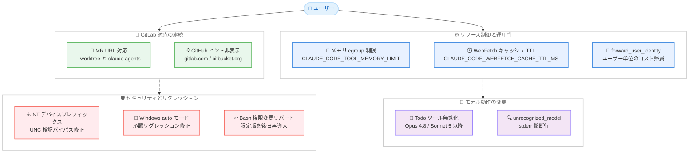

# Claude Code v2.1.233 リリース — GitLab MR の worktree 対応、Bash メモリ制限、Todo ツールの新モデル無効化、Windows リグレッション修正

## メタデータ

| 項目 | 内容 |
|------|------|
| 発表日 | 2026-08-14 |
| ソース | Claude Code Changelog |
| カテゴリ | Claude Code アップデート |
| 公式リンク | https://github.com/anthropics/claude-code/blob/main/CHANGELOG.md |

## 概要

Claude Code v2.1.233 (2026 年 8 月 14 日、npm レジストリ基準) がリリースされた。GitLab マージリクエスト URL の `--worktree` フラグ対応、Linux での Bash ツール向けメモリ cgroup サポート、WebFetch キャッシュ TTL の設定など約 20 項目を含むリリースである。

主要テーマは 4 つある。第一に、**GitLab 対応の継続拡充**。v2.1.232 のトークンレダクションとプラグインマーケットプレイス対応に続き、マージリクエスト URL が `--worktree` フラグと `claude agents` ビューで扱えるようになった。第二に、**リソース制御と運用性の強化**。`CLAUDE_CODE_TOOL_MEMORY_LIMIT` による Bash コマンドのメモリ制限、`CLAUDE_CODE_WEBFETCH_CACHE_TTL_MS` による WebFetch キャッシュ TTL の調整、ユーザー単位のコスト帰属を可能にする `forward_user_identity` ゲートウェイ設定が追加された。第三に、**新世代モデルでの Todo / タスク管理ツールの無効化**。Opus 4.8、Sonnet 5、Fable 5、Mythos 5 以降では TaskCreate や TodoWrite などが提供されなくなった。第四に、**v2.1.232 リグレッションへの対応**。Windows の auto モードで通常のコマンドが手動承認を繰り返し求める問題の修正と、Cygwin 形式シンボリックリンクおよび入力リダイレクトに関する Bash 権限変更のリバートが含まれる。

このほか、Windows の NT `\??\` デバイスプレフィックスパスによる UNC パス検証バイパス (NTLM 資格情報漏洩ベクトル) の修正など、セキュリティ面の重要な修正も含まれる。

## 詳細

### 背景

v2.1.232 は約 50 項目を含む大規模リリースだったが、Windows 環境で 2 件のリグレッションを引き起こしていた。auto モードが `cd <dir> && <command> > file` のような通常のコマンドで手動承認を繰り返し求める問題と、Cygwin 形式シンボリックリンクや入力リダイレクトに対する権限チェックの副作用である。v2.1.233 は前者を修正し、後者の権限変更をいったんリバートした (より限定的なバージョンが後のリリースで再導入される予定)。

また、GitLab 対応は v2.1.232 で始まった流れの継続であり、今回のマージリクエスト URL 対応により、GitLab を利用する開発者もワークツリーやエージェントビューで GitHub と同様のワークフローを利用できるようになった。

モデル面では、新世代モデル (Opus 4.8、Sonnet 5、Fable 5、Mythos 5 以降) が自律的なタスク管理能力を備えていることを背景に、Todo / タスク管理ツールがこれらのモデルではデフォルトで提供されなくなった。

### 主な変更点

#### 新機能

1. **GitLab マージリクエスト URL の対応**: `--worktree` フラグと `claude agents` ビューで GitLab のマージリクエスト URL がサポートされた。MR は `!N` 形式で表示される

2. **`forward_user_identity` ゲートウェイ設定**: Anthropic アップストリームでのオプトイン設定として追加。サインイン中のユーザーの識別情報をヘッダーとして送信するため、ゲートウェイの背後にあるプロキシがユーザー単位で支出を帰属できる

3. **Bash ツールのメモリ cgroup サポート (Linux)**: `CLAUDE_CODE_TOOL_MEMORY_LIMIT` によるオプトインのメモリ制限が追加され、暴走したビルドがセッション全体を停止させることを防げる

4. **WebFetch キャッシュ TTL の設定**: `CLAUDE_CODE_WEBFETCH_CACHE_TTL_MS` 環境変数で、WebFetch のセッション URL キャッシュ TTL を設定できるようになった (デフォルトは従来どおり 15 分)

#### 修正

5. **クラウドセッションの lost 判定の修正**: Claude が権限プロンプトの応答を待機している間に環境がシャットダウンすると、セッションが lost と誤判定されることがある問題を修正

6. **MCP v2 接続の再オープンループの修正**: 長時間保持されるストリームを固定タイムアウトで切断するサーバー (サーバーレスホストなど) に対して、subscriptions/listen ストリームを際限なく再オープンする問題を修正

7. **Notification フックの発火修正**: Claude Desktop や VS Code 配下で実行中に、権限プロンプトに対して Notification フックが発火しない問題を修正

8. **Linux アイドル時の CPU 占有の修正**: サンドボックス有効時に、アイドル状態のセッションが CPU 1 コアを 100% 占有し続けることがある問題を修正

9. **バンドルスキルエイリアスの修正**: ユーザーまたはプロジェクトのスキルがバンドルスキルをシャドウしている場合に、`/checkup` や `/review` などのエイリアスが `-p` モードやプラグイン / MCP 読み込み時に「Unknown command」となる問題を修正

10. **引数置換の再展開防止**: スキル / コマンドの引数置換で、引数の値がテンプレートマーカーとして再展開されることを防止

11. **NT デバイスプレフィックスパスの検証バイパス修正 (Windows)**: NT の `\??\` デバイスプレフィックスで表記されたパスが UNC パス検証をバイパスする問題を修正し、NTLM 資格情報漏洩のベクトルを閉鎖した

12. **Windows auto モードの承認リグレッション修正**: 通常の `cd <dir> && <command> > file` 形式の Bash コマンドに対して、auto モードが手動承認を繰り返し求める問題を修正 (v2.1.232 のリグレッション)

13. **v2.1.232 の Bash 権限変更のリバート**: Windows の Cygwin 形式シンボリックリンクと入力リダイレクト (`< file`) に対する権限変更をリバート。より限定的なバージョンが後のリリースで再導入される予定

#### 改善

14. **`claude self-hosted-runner` の起動高速化**: セッションブランチが作業ツリーを書き換えずに作成されるようになり、2 回のサーバーラウンドトリップがエージェントの起動をブロックしなくなった

15. **apps gateway のエラー転送改善**: Vertex、Foundry、Claude Platform on AWS の各アップストリームからの 400 / 413 エラーが、アップストリーム自身のメッセージを保持して転送されるようになった。apps gateway での自動コンパクトに関するバグも修正

16. **`claude plugin validate` の検証範囲拡大**: プレーンな `.claude/skills` ディレクトリを検証し、フロントマターの解析に失敗する SKILL.md ファイルを報告するようになった

17. **スクリーンリーダーモードの改善**: `/effort` セレクタが番号付きリストと数字入力のプロンプトとして描画され、ヒントおよびダイアログのテキストが切り詰められなくなった

18. **print モード診断の改善**: Claude Code が認識しないモデル ID でリクエストが送信される際、`[claude-code:unrecognized_model]` 行が stderr に出力される。`modelOverrides` でマッピングすると抑制できる

#### 変更

19. **GitHub アプリセットアップのヒント表示条件の変更**: origin リモートが gitlab.com または bitbucket.org のリポジトリでは、GitHub アプリセットアップのヒントが表示されなくなった。GitHub 以外の社内 git ホストはエンタープライズマーケットプレイスのヒントの対象となる

20. **新世代モデルでの Todo / タスク管理ツールの無効化**: TaskCreate / TaskGet / TaskUpdate / TaskList および TodoWrite が、Opus 4.8、Sonnet 5、Fable 5、Mythos 5 以降のモデルでは提供されなくなった。`CLAUDE_CODE_ENABLE_TODO_TOOLS=1` を設定すると復活する

### 技術的な詳細

#### Bash ツールのメモリ cgroup 制限

Linux の cgroup (control group) は、プロセスグループのリソース使用量をカーネルレベルで制限する仕組みである。`CLAUDE_CODE_TOOL_MEMORY_LIMIT` を設定すると、Bash ツールで実行されるコマンドがメモリ cgroup の管理下に置かれ、メモリを大量消費するビルドやテストが発生してもセッション本体が巻き込まれて停止することを防げる。オプトイン方式のため、設定しない限り従来の動作は変わらない。

#### forward_user_identity によるコスト帰属

apps gateway を経由して Anthropic アップストリームに接続する構成では、これまでゲートウェイの背後のプロキシからは個々のユーザーを区別できなかった。`forward_user_identity` を有効にすると、サインイン中のユーザーの識別情報が HTTP ヘッダーとして送信されるため、プロキシ側でユーザー単位の支出集計 (チャージバックやショーバック) を実装できる。オプトイン設定であり、デフォルトでは識別情報は送信されない。

#### NT デバイスプレフィックスパスの検証バイパス

Windows では、`\??\` で始まる NT デバイスプレフィックス形式のパス表記が存在する。従来の UNC パス検証はこの形式を考慮しておらず、`\??\UNC\...` のような表記でリモート共有への参照を検証をすり抜けて発行できた。UNC パスへのアクセスは NTLM 認証のハンドシェイクを誘発するため、攻撃者が用意したホストへ資格情報ハッシュが送信される漏洩ベクトルとなり得る。v2.1.233 でこの表記も検証対象となり、当該ベクトルは閉鎖された。

#### Todo / タスク管理ツールの無効化

Opus 4.8、Sonnet 5、Fable 5、Mythos 5 以降のモデルでは、TaskCreate / TaskGet / TaskUpdate / TaskList および TodoWrite の各ツールがツールセットから除外される。これらの新世代モデルは明示的なタスク管理ツールに依存せずに複数ステップの作業を進行できるためである。既存のワークフローやフック、自動化がこれらのツールの呼び出しを前提としている場合は、`CLAUDE_CODE_ENABLE_TODO_TOOLS=1` を設定することで従来どおり利用できる。

#### v2.1.232 リグレッションへの対応

v2.1.232 では Bash の権限モデルに複数の変更が入ったが、Windows 環境で副作用が確認された。auto モードが `cd <dir> && <command> > file` という一般的なコマンドパターンに対して手動承認を繰り返し要求する問題は v2.1.233 で修正された。一方、Cygwin 形式シンボリックリンクの権限チェックと入力リダイレクト (`< file`) の権限チェックは、影響範囲を絞った再設計のためいったんリバートされた。これらのチェックが提供していた保護は一時的に v2.1.231 以前の水準に戻るため、より限定的なバージョンの再導入を待つ形となる。

## アーキテクチャ図



## 開発者への影響

### 対象

- **Windows ユーザー**: NT `\??\` デバイスプレフィックスによる UNC パス検証バイパス (NTLM 資格情報漏洩ベクトル) の修正と、auto モードの承認リグレッション修正が含まれるため、速やかなアップデートを推奨
- **v2.1.232 で auto モードに支障が出ていたユーザー**: `cd <dir> && <command> > file` 形式のコマンドで承認を繰り返し求められる問題が解消される
- **GitLab を利用する開発者**: マージリクエスト URL を `--worktree` フラグや `claude agents` ビューで直接扱えるようになり、GitHub の PR と同等のワークフローが可能に
- **新世代モデル (Opus 4.8、Sonnet 5、Fable 5、Mythos 5 以降) の利用者**: Todo / タスク管理ツールがデフォルトで無効化される。これらのツールに依存するフックや自動化がある場合は対応が必要
- **Linux でサンドボックスを有効にしているユーザー**: アイドル時の CPU 100% 占有の修正と、Bash コマンドのメモリ制限機能が利用可能に
- **ゲートウェイ管理者**: `forward_user_identity` によるユーザー単位のコスト帰属と、Vertex / Foundry / Claude Platform on AWS のエラーメッセージ転送改善が利用可能に
- **Claude Desktop / VS Code 利用者**: 権限プロンプトに対する Notification フックが正しく発火するようになった
- **MCP v2 サーバーの利用者**: サーバーレスホストなどタイムアウトでストリームを切断するサーバーに対する再オープンループが解消される
- **プラグイン / スキル開発者**: `claude plugin validate` が `.claude/skills` ディレクトリの SKILL.md フロントマターを検証するようになり、引数置換の再展開も防止される

### 必要なアクション

以下のコマンドで最新バージョンに更新できる。

```bash
# npm でのアップデート
npm update -g @anthropic-ai/claude-code

# Homebrew でのアップデート
brew upgrade claude-code

# 現在のバージョン確認
claude --version
```

**推奨される確認事項:**

- **Todo / タスク管理ツールに依存するワークフローの利用者**: 新世代モデルではデフォルトで無効化されるため、必要な場合は `CLAUDE_CODE_ENABLE_TODO_TOOLS=1` を設定する
- **Linux でビルドの暴走に悩まされている場合**: `CLAUDE_CODE_TOOL_MEMORY_LIMIT` の設定を検討する
- **認識されないモデル ID を使用している場合**: print モードで stderr に `[claude-code:unrecognized_model]` が出力されるようになるため、`modelOverrides` でのマッピングを検討する
- **ユーザー単位のコスト集計が必要なゲートウェイ管理者**: Anthropic アップストリームで `forward_user_identity` の有効化を検討する

### 移行ガイド (該当する場合)

**Todo / タスク管理ツールの無効化:**

Opus 4.8、Sonnet 5、Fable 5、Mythos 5 以降のモデルでは、TaskCreate / TaskGet / TaskUpdate / TaskList / TodoWrite がツールセットから除外される。これらのツールの呼び出しをフックで監視している場合や、タスクリストの出力を前提とした自動化がある場合は、`CLAUDE_CODE_ENABLE_TODO_TOOLS=1` を設定して従来の動作を維持するか、ツールに依存しない形へワークフローを見直す。

**Bash 権限変更のリバート:**

v2.1.232 で導入された Cygwin 形式シンボリックリンクと入力リダイレクト (`< file`) の権限チェックはリバートされた。これらのチェックを前提としたセキュリティ運用をしている場合は、より限定的なバージョンが後のリリースで再導入されるまで、当該保護が v2.1.231 以前の水準に戻る点に留意する。

## コード例

### Bash ツールのメモリ制限 (Linux)

```bash
# Bash ツールで実行されるコマンドにメモリ上限を設定 (オプトイン)
export CLAUDE_CODE_TOOL_MEMORY_LIMIT=4G
claude
```

### WebFetch キャッシュ TTL の設定

```bash
# WebFetch のセッション URL キャッシュ TTL を 5 分に短縮
# (デフォルトは 15 分)
export CLAUDE_CODE_WEBFETCH_CACHE_TTL_MS=300000
claude
```

### GitLab マージリクエストのワークツリー展開

```bash
# GitLab の MR URL を --worktree フラグで直接指定
claude --worktree https://gitlab.com/my-group/my-project/-/merge_requests/42

# claude agents ビューでは MR が !42 形式で表示される
claude agents
```

### Todo ツールの再有効化

```bash
# 新世代モデルで Todo / タスク管理ツールを復活させる
export CLAUDE_CODE_ENABLE_TODO_TOOLS=1
claude
```

## 関連リンク

- [Claude Code Changelog](https://github.com/anthropics/claude-code/blob/main/CHANGELOG.md)
- [Claude Code GitHub リポジトリ](https://github.com/anthropics/claude-code)
- [Claude Code ドキュメント](https://docs.anthropic.com/en/docs/claude-code)
- [Claude Code v2.1.231 & v2.1.232](./2026-08-13-claude-code-v2-1-231-v2-1-232.md)

## まとめ

Claude Code v2.1.233 は、GitLab 対応の継続拡充、リソース制御機能の追加、新世代モデルでの Todo ツール無効化、そして v2.1.232 リグレッションへの対応を柱とするリリースである。特に以下の 4 点が注目に値する。

第一に、**GitLab マージリクエストのワークフロー統合**。`--worktree` フラグと `claude agents` ビューで MR URL を扱えるようになり、前バージョンから続く GitLab 対応がワークフロー面でも GitHub と同等に近づいた。

第二に、**リソース制御と運用性の強化**。Bash コマンドのメモリ cgroup 制限、WebFetch キャッシュ TTL の調整、`forward_user_identity` によるユーザー単位のコスト帰属など、エンタープライズ運用に有用な機能が揃った。

第三に、**新世代モデルでの Todo / タスク管理ツールの無効化**。Opus 4.8、Sonnet 5、Fable 5、Mythos 5 以降ではデフォルトで提供されなくなるため、これらのツールに依存する運用は `CLAUDE_CODE_ENABLE_TODO_TOOLS=1` での対応またはワークフローの見直しが必要となる。

第四に、**Windows 環境の安定化とセキュリティ修正**。NT `\??\` デバイスプレフィックスによる NTLM 資格情報漏洩ベクトルの閉鎖に加え、v2.1.232 の auto モード承認リグレッションが修正された。

NTLM 資格情報漏洩ベクトルの修正が含まれるため、特に Windows ユーザーには速やかなアップデートを推奨する。v2.1.232 の auto モードリグレッションの影響を受けていたユーザーも、本バージョンで通常の運用に復帰できる。
