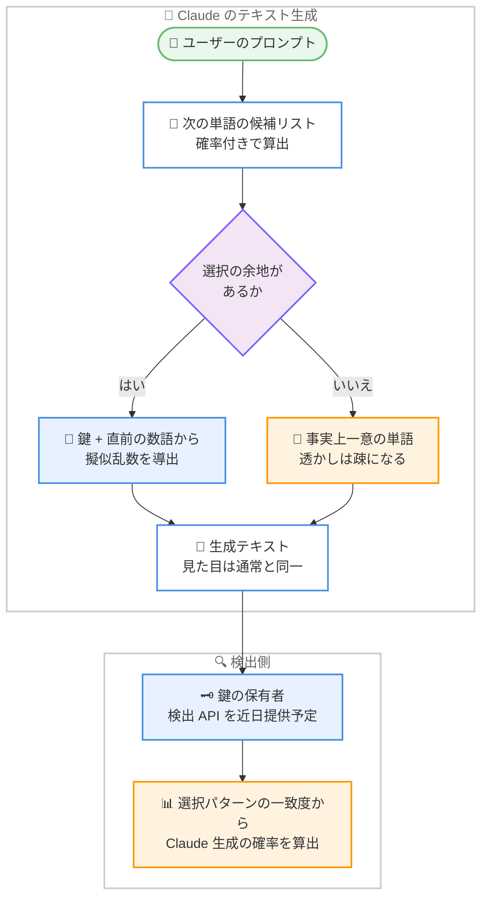

# Claude のテキスト透かしの仕組み: 鍵付き擬似乱数サンプリングによる生成テキストの識別

## メタデータ

| 項目 | 内容 |
|------|------|
| 発表日 | 2026-08-14 |
| ソース | Anthropic News |
| カテゴリ | 透明性 / 責任ある AI / 規制対応 |
| 公式リンク | https://www.anthropic.com/news/claude-text-watermark |

## 概要

Anthropic は 2026 年 8 月 14 日、今後の Claude モデルが生成するテキストに透かし (watermark) を含める仕組みを解説する記事を公開した。EU AI 法への準拠を目的とした対応であり、Anthropic は 2026 年 7 月に「EU Code of Practice on Transparency of AI-Generated Content」に約 190 の署名者とともに署名している。他の主要 AI 開発企業も同様に、それぞれ独自の透かしを実装する予定である。

透かしの手法は、Google DeepMind が 2024 年に Nature 誌で発表した **SynthID-Text** の一種であり、単語選択に使う乱数の「源」を、任意の乱数生成器から鍵と直前の数語に基づく擬似乱数に置き換えるものである。テキストに文字やトークンを追加するものではないため、読者には透かしの有無を区別できず、内部テストでは品質、創造性、可読性への影響がないことが確認されている。鍵を持つ者だけが、単語の並びが Claude の選択パターンと一致するかを統計的に検証し、Claude が生成した確率を算出できる。透かし検出 API は近日提供予定とされている。

## 詳細

### 背景

EU AI 法は、AI が生成したコンテンツの透明性を求めており、Anthropic は 2026 年 7 月に「EU Code of Practice on Transparency of AI-Generated Content」に署名した。今回の透かしはこの準拠のための実装である。地域を限定した実装方法が未確立のため、当面は特定地域だけでなく**グローバルに適用**される。

採用された手法は、2022 年の Scott Aaronson の提案に遡る手法群に属し、直接的には DeepMind の SynthID-Text (Nature、2024 年) の一種である。DeepMind の論文では Gemini の一部トラフィックで検証が行われ、評価において「統計的有意差なし」と報告されている。

### 主な変更点

- **将来の Claude モデルが生成するテキストに透かしが入る**: テキスト自体には何も追加されず、隠し文字も存在しない。追加トークンも不要で、速度とコストへの影響はごく僅かである
- **旧モデルには移行期間がある**: 2026 年 8 月 2 日以前のモデルには移行期間が設けられ、今後数か月で順次対応する
- **画像などのファイルは別の仕組みを使用**: .png、.jpg、.svg などのファイルには透かしではなく、オープン標準 **C2PA** による暗号署名付きメタデータ (コンテンツクレデンシャル) を付与する
- **透かし検出 API を近日提供予定**: 詳細は検討中とされている

### 技術的な詳細

#### 動作原理

LLM は 1 語ずつテキストを生成し、次の単語を確率付きの候補リストから選択する。「overcast」と「grey」のように意味がほぼ変わらない低リスクな選択では、通常は乱数によって単語が決定される。

透かしは、この乱数の「源」を変える手法である。任意の乱数生成器の代わりに、**鍵と直前の数語**から導出した擬似乱数で単語を決定する。単語選択は依然としてランダムに見えるが、鍵を持つ者は単語の並びが Claude の選択パターンと一致するかを確認でき、そのテキストを Claude が生成した確率を算出できる。モデルが本来選ばない単語 (例: 「nubilous」のような難解語) を選ばせることはないため、出力の自然さは保たれる。

記事はこの仕組みを、モノポリーでサイコロの代わりに円周率の桁を使ってコマを進める比喩で説明している。プレイヤーにとってはランダムであることに変わりないが、後から手順を確認すれば円周率が使われたかを判定できる。

#### 出力への影響

- **品質への影響なし**: 内部テストで品質、創造性、可読性への影響がないことを確認済み。読者には透かしの有無を区別できない
- **テキストへの追加なし**: 隠し文字や特殊なトークンは一切挿入されない
- **速度とコスト**: 追加トークンが不要なため、影響はごく僅かである

#### プライバシー

透かしから個人、組織、チャットを特定することはできない。鍵にもユーザー情報を復元できる要素は含まれていない。

#### 制限事項

- **判定できるのは「Claude が関与した可能性」のみ**: 人間が書いたことや、他の AI が書いたことは確認できない。他社は別の鍵と手法を使用する
- **短いテキストでは検出精度が低い**: 長文ほど信頼度が上がる
- **事実記述では透かしが疎になる**: 例えば「Principia」の次は「Mathematica」しかないような箇所では単語の選択肢がなく、透かしを埋め込む余地がない
- **校正や軽微な編集にはほとんど付かない**: 大半が人間の言葉のままであるため、透かしが入る余地がほとんどない
- **コードには少ない**: 正確性が要求されるため透かしは少ないが、コメントなど任意選択がある部分には適用できる
- **編集への耐性**: 軽い編集では透かしは完全には消えないが、全面的な書き直しでは消える
- **「書いた」と「大幅に編集した」の区別は不可**: どちらも Claude の関与として検出される

#### 適用範囲

| 対象 | 扱い |
|------|------|
| 通常のテキスト生成 | 透かしを適用 |
| 翻訳 | 全単語を Claude が選ぶため透かしが付く |
| コード | 正確性の制約により疎。コメント等には適用可能 |
| 画像等のファイル (.png、.jpg、.svg) | 透かしではなく C2PA のコンテンツクレデンシャルを付与 |
| 2026 年 8 月 2 日以前のモデル | 移行期間あり。今後数か月で順次対応 |
| 適用地域 | 当面はグローバルに適用 |

#### 既存の AI 検出ツールとの違い

Pangram などの既存の AI 検出ソフトウェアは鍵を持たず、AI 特有の言い回し (「quietly」の多用など) を統計的に分析する。これに対して Claude の透かしは、鍵に基づく擬似乱数パターンの照合であり、原理が根本的に異なる。

## 開発者への影響

### 対象

- **Claude API を利用する開発者**: 将来のモデルが生成するテキストに透かしが含まれるようになるが、出力形式や品質に変化はない
- **コンテンツプラットフォームの運営者**: 近日提供予定の透かし検出 API により、Claude 生成テキストの識別が可能になる見込み
- **EU AI 法への対応を進める企業**: AI 生成コンテンツの透明性要件への準拠状況を把握する担当者
- **教育機関や出版などで AI 検出を行う組織**: 既存の統計的 AI 検出ツールとは異なる、鍵に基づく検証手段が加わる

### 必要なアクション

1. **アプリケーションへの影響確認**: 透かしはテキストに文字を追加せず、品質にも影響しないため、既存のアプリケーションで対応が必要な変更はない
2. **検出 API の続報の確認**: 透かし検出 API は近日提供予定であり、詳細は検討中とされているため、公式発表を待つ必要がある
3. **検出結果の解釈の整理**: 検出できるのは「Claude が関与した可能性」であり、人間が書いたことの証明や他の AI の識別はできない。短文や事実記述、コードでは信頼度が下がる点を運用ポリシーに織り込む
4. **法的位置づけの理解**: 透かしは所有権、著作権、法的責任に影響しない

### 移行ガイド (該当する場合)

2026 年 8 月 2 日以前のモデルには移行期間が設けられ、今後数か月で順次透かしが適用される。開発者側での移行作業は不要である。

## 関連リンク

- [How Claude's text watermark works](https://www.anthropic.com/news/claude-text-watermark)
- [SynthID-Text 論文 (Nature)](https://www.nature.com/articles/s41586-024-08025-4)
- [C2PA (Coalition for Content Provenance and Authenticity)](https://c2pa.org/)
- [EU Code of Practice on Transparency of AI-Generated Content (European Commission)](https://digital-strategy.ec.europa.eu/)

## まとめ

今回の発表は、EU AI 法への準拠を背景に、Claude の生成テキストへ透かしを導入する技術的な仕組みを説明したものである。

- **仕組みは「乱数の源の置き換え」**: 単語選択の乱数を、鍵と直前の数語に基づく擬似乱数に置き換える。DeepMind の SynthID-Text の一種であり、テキストには何も追加されない
- **出力への実質的な影響はない**: 品質、創造性、可読性への影響は内部テストで確認されておらず、追加トークンも不要なため速度とコストへの影響もごく僅かである
- **検出には鍵が必要で、判定は確率的**: 鍵の保有者だけが Claude 生成の確率を算出できる。短文、事実記述、コード、軽微な編集では検出力が下がり、全面的な書き直しでは消える。判定できるのは「Claude の関与」のみである
- **プライバシーへの配慮**: 透かしから個人、組織、チャットを特定することはできない
- **テキスト以外は C2PA で対応**: 画像などのファイルには暗号署名付きメタデータのコンテンツクレデンシャルを付与し、透かしと役割を分担する

開発者にとって当面の対応は不要だが、近日提供予定の透かし検出 API は、コンテンツの出所確認という新しいユースケースを開く可能性がある。検出結果の解釈には制限事項の理解が不可欠であり、続報を注視したい。
