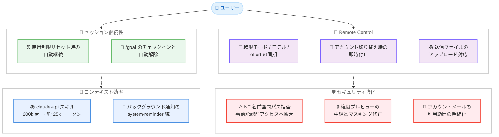

# Claude Code v2.1.234 リリース — 使用制限リセット時の自動継続、NT パス検証の強化、claude-api スキルのコンテキスト大幅削減、Remote Control 同期改善

## メタデータ

| 項目 | 内容 |
|------|------|
| 発表日 | 2026-08-17 |
| ソース | Claude Code Changelog |
| カテゴリ | Claude Code アップデート |
| 公式リンク | https://github.com/anthropics/claude-code/blob/main/CHANGELOG.md |

## 概要

Claude Code v2.1.234 (2026 年 8 月 17 日、npm レジストリ基準) がリリースされた。claude.ai 使用制限リセット時のセッション自動継続、Windows NT 名前空間パスの拒否によるセキュリティ強化、組み込み `claude-api` スキルのコンテキストコスト削減 (約 200k トークン超から約 25k トークンへ)、Remote Control の状態同期改善など、60 項目を超える変更を含む大規模リリースである。

主要テーマは 4 つある。第一に、**使用制限リセット時の自動継続**。claude.ai の使用制限に達して中断したセッションが、制限のリセット時に自動的に再開されるようになった (`/config` で無効化可能)。第二に、**セキュリティの継続強化**。v2.1.233 で修正された NT `\??\` パスによる NTLM 資格情報漏洩ベクトルへの対策が、リモートファイル読み取り、セッション復元、CLAUDE.md インクルード、ワークフロースクリプト、ファイルアップロードといった事前承認前のファイルアクセス経路にも拡大された。第三に、**コンテキスト効率の大幅改善**。組み込み `claude-api` スキルの読み込みコストが、リファレンスドキュメントのオンデマンド読み込みへの変更により約 8 分の 1 に削減された。第四に、**Remote Control の状態同期と信頼性の改善**。権限モード、モデル、effort レベルがホストセッションと携帯電話 / claude.ai/code の間で双方向に同期されるようになり、別アカウントへのサインイン時の挙動も明確になった。

このほか、`/permissions` や `/add-dir` などのダイアログを Claude の作業中に開けるようになる操作性の改善、権限プレビューの資格情報マスキングに関する複数の修正、フルスクリーン TUI 関連の多数の修正も含まれる。

## 詳細

### 背景

v2.1.233 では、Windows の NT `\??\` デバイスプレフィックスパスが UNC パス検証をバイパスする問題 (NTLM 資格情報漏洩ベクトル) が修正された。v2.1.234 はこの対策を、権限承認を経ずに実行され得る残りのファイルアクセス経路 (リモートファイル読み取り、セッション復元、CLAUDE.md インクルード、ワークフロースクリプト、ファイルアップロード) へと拡大し、同ベクトルへの防御を完成に近づけた。

また、近年のリリースで継続的に拡充されてきた Remote Control (携帯電話や claude.ai/code からターミナルセッションを操作する機能) は、本バージョンで権限モード、モデル、effort レベルの同期が双方向化され、複数クライアント間での状態の一貫性が大きく向上した。

コンテキスト効率の面では、組み込み `claude-api` スキルがリファレンスドキュメントを一括で読み込む設計だったため、読み込み時に 200k トークンを超えるコストが発生していた。本バージョンでオンデマンド読み込みに変更され、約 25k トークンまで削減された。

### 主な変更点

#### 新機能 (Added)

1. **`CLAUDE_CODE_PROJECT_DIR_NAME` 環境変数**: セッションごとに独自の設定ディレクトリを与えるホスト環境向けに、プロジェクト単位のトランスクリプトディレクトリの短縮名を指定できるオプション環境変数が追加された

2. **`selection:clear` キーバインドアクション**: アプリ内のテキスト選択を解除するキーを割り当てられるようになった。エージェントビューでも動作する

3. **GitLab マージリクエストバッジ**: GitLab リモートを持ち、認証済みの glab CLI があるリポジトリでは、フッターとステータスラインに `MR !N` バッジが表示される。ドラフト / ペンディング / グリーンの状態も反映される

4. **作業中のダイアログ操作**: `/add-dir <path>` が Claude の作業中に使用可能になった。また、`/add-dir`、`/autocompact`、`/theme`、`/help`、`/config`、`/advisor` の各ダイアログがフルスクリーン TUI でターン中に開けるようになった

#### 変更 (Changed)

5. **使用制限リセット時の自動継続**: claude.ai の使用制限に達して中断した場合、制限のリセット時にセッションが自動的に継続されるようになった。`/config` の「Continue automatically at usage limit」で無効化できる

6. **アカウントメールの利用範囲の明確化**: Claude はアカウントのメールアドレスをユーザーの識別のみに使用し、ユーザーが依頼しない限り無関係なサービスへ送信しないよう指示されるようになった

7. **NT 名前空間パス拒否の拡大 (セキュリティ)**: リモートファイル読み取り、セッション復元、CLAUDE.md インクルード、ワークフロースクリプト、ファイルアップロードが Windows NT 名前空間 (`\??\`) パスを拒否するようになり、事前承認前のファイルアクセスにおける NTLM 資格情報漏洩ベクトルへの防御が強化された

8. **Remote Control: アカウント切り替え時の即時停止**: このコンピュータを別の claude.ai アカウントまたは組織にサインインさせた場合、実行中のセッションが数秒以内に理由を表示して停止するようになった。従来は数時間後に誤解を招く HTTP 404 が返っていた

9. **Remote Control: 権限モードとモデルの同期**: Claude Code Desktop や VS Code から開始した Remote Control セッションで、権限モードの変更が携帯電話と claude.ai/code に (モデルの変更は claude.ai/code に) 反映されるようになった

10. **Remote Control: effort レベルの双方向同期**: 携帯電話や claude.ai/code で選択した effort が、ターミナルおよび Desktop / VS Code ホストのセッションに適用されるようになった。セッション側も自身の effort レベルを接続中のクライアントに公開する

11. **`SendMessage` / `ListAgents` の完全性表示**: アカウントのセッションリストが長すぎて完全に確認できなかった場合、未確認のセッションを不在として扱う代わりに、その旨を伝えるようになった

12. **期限切れ資格情報の案内改善**: Anthropic プロファイル資格情報が期限切れで、claude.ai ログインが優先される状況では、`/login` を案内するようになった

13. **トランスクリプトの Markdown レンダリング**: ユーザー自身のプロンプトも、返信と同様に Markdown (ハイライト付きコードブロック、インラインコード、リスト) でレンダリングされるようになった

14. **API エラーメッセージの詳細化**: 「API returned an empty or malformed response」エラーが、返ってきた内容 (コンテンツタイプ、ボディの種類、サイズ、リクエスト ID) と、元のストリーミングリクエストが失敗した理由を表示するようになった

15. **`claude-api` スキルのコンテキスト削減**: 組み込み `claude-api` スキルの読み込みコストが、リファレンスドキュメントのオンデマンド読み込みにより約 200k トークン超から約 25k トークンに削減された

16. **作業中の `/permissions` 操作**: Claude の作業中に `/permissions` を開けるようになった。ルールの変更は現在のターンの残りにも適用される

17. **`/goal` の改善**: ターンが回復不能なエラーで終了した場合、`/goal` が通知を出して自動的に解除されるようになった。また、バックグラウンドタスクがゴールを 30 分以上待機させている場合、Claude が状況を確認しに行くようになった (`CLAUDE_CODE_GOAL_CHECKIN_MINUTES=0` でオプトアウト可能)

18. **`claude setup-token` の引数検証**: 予期しない余分な引数を黙って無視する代わりに、拒否するようになった

19. **フルスクリーンモードの Esc 挙動変更**: Esc キーがマウスによるテキスト選択を解除しなくなった

20. **UI の微調整**: 実行中ツールのヘッダーにある経過時間カウンターが淡色表示になった

21. **バックグラウンドタスク通知の形式統一**: ターン間に配信されるバックグラウンドタスク通知が、ターン中の配信と同様に `<system-reminder>` タグ内でモデルへ送信されるようになった

22. **Windows 起動の安定化**: `~/.claude.json` が読み取り専用の場合に、リネームの再試行の繰り返しで起動が停滞しなくなった

#### 修正 (Fixed)

23. **auto モードのネットワークアクセス再チェック修正**: 非常に長いセッションで会話がコンパクトされた後、auto モードがサンドボックス化されたコマンドのネットワークアクセスを繰り返し再チェックして拒否する問題を修正

24. **バックグラウンドサブエージェントの権限応答の保持**: バックグラウンドサブエージェントのツール権限プロンプトに応答した際、セッションスコープの権限応答 (拒否を含む) が失われる問題を修正

25. **非ストリーミングフォールバックのクラッシュ修正**: thinking フィールドを欠いた thinking ブロック、または text フィールドを欠いた text ブロックを含む API レスポンスでクラッシュする問題を修正

26. **Markdown レンダリングの速度低下修正**: 特殊な Unicode シーケンスを含む一部のメッセージで、レンダリングが極端に遅くなる問題を修正

27. **`SendMessage` の受信者名の修正**: セッション名が 200 文字の上限に達している、または絵文字が多い場合に、`ListAgents` からコピーした受信者が拒否される問題を修正

28. **リポジトリ検出の修正**: 特殊な userinfo を持つ git リモートのホストを誤読する問題を修正

29. **MCP 診断のシークレット漏洩防止**: スコープ競合の警告が、解決済みのシークレットではなく設定された `${VAR}` 形式を表示するようになった

30. **`strictKnownMarketplaces` の検証強化**: git が実際に接続するホストと異なるホストを持つ SCP 形式の git マーケットプレイスソースを、許可リストが受け入れてしまう問題を修正

31. **フルスクリーンのコピー修正**: `/login` の OAuth URL などのモーダルテキストをフルスクリーンでコピーした際に文字が欠落する問題を修正

32. **Markdown 水平線の描画修正**: レンダリングされた `---` 水平線が次の行に食い込む問題を修正

33. **シェルコマンド行の分割修正**: todo / タスク更新が間に挟まった場合に、連続するシェルコマンドが複数の「Ran 1 shell command」行に分割される問題を修正

34. **`!` シェルコマンド関連の修正**: `!` シェルコマンド実行中に開いた `/permissions` などのダイアログが、コマンド終了時に閉じられる問題を修正。また、キュー済みの `!` シェルコマンドが、上矢印キーで編集した後にプレーンテキストとしてモデルへ送信される問題も修正

35. **キュー済みメッセージの履歴表示修正**: キュー中のメッセージがプロンプト履歴に再表示される問題を修正

36. **フルスクリーンレンダラー移行時の設定保持**: 「Try the new fullscreen renderer?」プロンプトを承諾した際に、権限モード、ツールの許可 / 拒否ルール、モデル、effort フラグを引き継がずにセッションが再起動する問題を修正。`/tui` が再起動時に起動時の `--allowed-tools` / `--disallowed-tools` ルールを失う問題も修正

37. **信頼プロンプトの警告表示修正**: リポジトリが存在する前にディレクトリが最初に認識されていた場合に、信頼プロンプトがリポジトリ全体スコープの警告を省略する問題を修正

38. **IDE diff タブと権限プロンプトの干渉修正**: 権限の再プロンプト中に IDE の diff タブが閉じられると、新しいプロンプトが前回の入力で応答されてしまうケースを修正

39. **Remote Control のファイルアップロード修正**: Claude Code Desktop や VS Code がホストする Remote Control セッションでユーザーに送信されたファイルがアップロードされるようになり、携帯電話や Web で開けるようになった

40. **古いトークンの注意書きの漏洩防止**: `CLAUDE_CODE_OAUTH_TOKEN` 設定中に `/login` した後、古いトークンに関する注意書きが自動再開されたターンに漏れ込む問題を修正

41. **権限プレビューの中継とマスキングの修正 (セキュリティ)**: 権限プレビューが、インバウンド信頼ゲートで許可されたチャネルサーバーにのみ中継されるようになった。中継された権限プレビューの資格情報マスキングが、コマンド、パス、宛先を承認者から隠せなくなった。また、シェル区切り文字が直後に続く場合でもプロバイダー API トークンがマスクされるようになった

42. **セッション間メッセージの修正**: クロスセッションメッセージングが無効と読み取られた場合に、Claude Desktop のセッション間メッセージが受信側で黙って破棄される問題を修正

43. **セッションタイトルの改善**: 自動生成されるセッションタイトルが、短く具体的な名前になるよう改善された

#### 削除 (Removed)

44. **auto モードの冗長表示の削除**: auto モードがすべての Agent ツール呼び出しの下に表示していた冗長な「Allowed by auto mode classifier」行が削除された

45. **「Default teammate model」設定の削除**: `/config` から「Default teammate model」設定が削除された。エージェントチームのチームメイトは、スポーン時に指定がない限りリーダーのモデルを使用する

### 技術的な詳細

#### 使用制限リセット時の自動継続

claude.ai プランで Claude Code を利用している場合、使用制限に達するとセッションが中断され、従来はリセット後に手動で再開する必要があった。v2.1.234 では、制限がリセットされた時点でセッションが自動的に継続される。長時間のタスクを夜間や休日に走らせる場合、制限による中断がワークフローを止めなくなる。一方、意図しないトークン消費を避けたい場合は、`/config` の「Continue automatically at usage limit」設定で無効化できる。

#### NT 名前空間パス拒否の拡大

Windows の NT 名前空間パス (`\??\` プレフィックス) は、`\??\UNC\...` の形でリモート共有への参照を表現でき、UNC パスへのアクセスは NTLM 認証ハンドシェイクを誘発するため、資格情報ハッシュの漏洩ベクトルとなり得る。v2.1.233 で UNC パス検証のバイパスが修正されたのに続き、v2.1.234 では権限承認を経ずに実行され得るファイルアクセス経路 (リモートファイル読み取り、セッション復元、CLAUDE.md インクルード、ワークフロースクリプト、ファイルアップロード) がこの形式のパスを拒否するようになった。悪意あるリポジトリの CLAUDE.md やワークフロースクリプトを経由した攻撃面が閉鎖される。

#### claude-api スキルのオンデマンド読み込み

組み込みの `claude-api` スキル (Claude API / Anthropic SDK のリファレンス) は、従来リファレンスドキュメント全体を読み込むため 200k トークンを超えるコンテキストコストが発生していた。v2.1.234 では、必要なリファレンスドキュメントをオンデマンドで読み込む方式に変更され、コストが約 25k トークンまで削減された。コンテキストウィンドウの圧迫が大幅に緩和されるため、API 関連の作業でスキルを使用してもセッションの他の作業への影響が小さくなり、自動コンパクトの発生頻度の低減も期待できる。

#### Remote Control の状態同期

Remote Control では、ターミナルや Desktop / VS Code でホストされるセッションを携帯電話や claude.ai/code から操作できる。v2.1.234 では以下の同期が強化された。

- **権限モード**: Desktop / VS Code ホストのセッションで変更された権限モードが、携帯電話と claude.ai/code に反映される
- **モデル**: モデルの変更が claude.ai/code に反映される
- **effort レベル**: 携帯電話や claude.ai/code での effort 選択がホストセッションに適用され、セッション側も自身の effort を接続クライアントへ公開する (双方向)

また、コンピュータを別の claude.ai アカウントや組織にサインインさせた場合、実行中のセッションは数秒以内に理由付きで停止する。従来は数時間後に HTTP 404 という誤解を招くエラーで発覚していたため、トラブルシューティングの負担が大きく軽減される。

#### 権限プレビューの中継とマスキングの強化

リモートの承認者に表示される権限プレビューについて、3 つの問題が修正された。第一に、プレビューはインバウンド信頼ゲートで許可されたチャネルサーバーにのみ中継されるようになった。第二に、資格情報マスキングが過剰に適用され、承認者が判断に必要なコマンド、パス、宛先まで隠してしまう問題が修正された。第三に、シェル区切り文字が直後に続くプロバイダー API トークンがマスクされない問題が修正された。承認者は必要な情報を確認しつつ、シークレットは確実に秘匿されるバランスが改善されている。

## アーキテクチャ図



## 開発者への影響

### 対象

- **claude.ai プランの利用者**: 使用制限リセット時にセッションが自動継続されるようになる。意図しない自動継続を避けたい場合は `/config` での無効化を検討する
- **Windows ユーザー**: NT 名前空間 (`\??\`) パスの拒否が事前承認前のファイルアクセス経路に拡大され、NTLM 資格情報漏洩ベクトルへの防御が強化された。速やかなアップデートを推奨
- **`claude-api` スキルの利用者**: 読み込み時のコンテキストコストが約 8 分の 1 (約 25k トークン) になり、API 関連の作業でのコンテキスト圧迫が大幅に緩和される
- **Remote Control の利用者**: 権限モード、モデル、effort レベルがクライアント間で同期され、Desktop / VS Code ホストのセッションからのファイル送信も携帯電話や Web で開けるようになった
- **リモート承認を運用するチーム**: 権限プレビューの中継先が信頼ゲートで制御され、マスキングの過不足も修正されたため、承認判断の信頼性が向上する
- **長時間セッションの利用者**: コンパクト後に auto モードがサンドボックスコマンドのネットワークアクセスを繰り返し拒否する問題が修正された
- **マルチエージェント / セッション間メッセージングの利用者**: `SendMessage` / `ListAgents` のセッションリスト完全性表示、200 文字上限や絵文字を含むセッション名の扱い、Claude Desktop でのメッセージ破棄の修正が含まれる
- **フルスクリーン TUI の利用者**: モーダルテキストのコピー欠落、レンダラー移行時の設定消失、Esc によるテキスト選択解除など多数の修正が入った
- **GitLab を利用する開発者**: 認証済みの glab CLI があれば、フッターとステータスラインに MR バッジが表示されるようになった
- **エージェントチームの利用者**: 「Default teammate model」設定が削除され、チームメイトはスポーン時の指定がない限りリーダーのモデルを使用する

### 必要なアクション

以下のコマンドで最新バージョンに更新できる。

```bash
# npm でのアップデート
npm update -g @anthropic-ai/claude-code

# Homebrew でのアップデート
brew upgrade claude-code

# 現在のバージョン確認
claude --version
```

**推奨される確認事項:**

- **使用制限での自動継続を望まない場合**: `/config` の「Continue automatically at usage limit」を無効化する
- **`/goal` で長時間のバックグラウンドタスクを扱う場合**: 30 分以上の待機で Claude がチェックインする動作が不要であれば、`CLAUDE_CODE_GOAL_CHECKIN_MINUTES=0` を設定する
- **セッションごとに設定ディレクトリを分離するホスト環境の管理者**: `CLAUDE_CODE_PROJECT_DIR_NAME` によるトランスクリプトディレクトリ名の指定を検討する
- **「Default teammate model」設定に依存していた場合**: チームメイトのモデルはスポーン時に明示的に指定する運用へ移行する

### 移行ガイド (該当する場合)

**使用制限リセット時の自動継続:**

本機能はデフォルトで有効となる。CI や共有環境などで、制限リセット後の自動的なトークン消費を避けたい場合は、`/config` の「Continue automatically at usage limit」を無効化する。

**「Default teammate model」設定の削除:**

`/config` の「Default teammate model」設定は削除された。エージェントチームのチームメイトは、スポーン時にモデルが指定されない限りリーダーのモデルを使用する。従来この設定でチームメイトのモデルを固定していた場合は、スポーン時の指定へ移行する。

## コード例

### 使用制限リセット時の自動継続の設定

```bash
# /config を開き「Continue automatically at usage limit」で切り替える
claude
# セッション内で
/config
```

### /goal のチェックイン間隔の調整

```bash
# バックグラウンドタスク待機時のチェックインをオプトアウト
export CLAUDE_CODE_GOAL_CHECKIN_MINUTES=0
claude
```

### プロジェクト単位のトランスクリプトディレクトリ名の指定

```bash
# セッションごとに設定ディレクトリを分離するホスト環境向け
export CLAUDE_CODE_PROJECT_DIR_NAME=my-project
claude
```

### 作業中のディレクトリ追加と権限変更

```bash
# Claude の作業中でも実行可能になった
/add-dir /path/to/another/project
/permissions
```

## 関連リンク

- [Claude Code Changelog](https://github.com/anthropics/claude-code/blob/main/CHANGELOG.md)
- [Claude Code GitHub リポジトリ](https://github.com/anthropics/claude-code)
- [Claude Code ドキュメント](https://docs.anthropic.com/en/docs/claude-code)
- [Claude Code v2.1.233](./2026-08-14-claude-code-v2-1-233.md)

## まとめ

Claude Code v2.1.234 は、使用制限リセット時の自動継続、NT 名前空間パス拒否の拡大によるセキュリティ強化、`claude-api` スキルのコンテキストコスト削減、Remote Control の状態同期改善を柱とする大規模リリースである。特に以下の 4 点が注目に値する。

第一に、**使用制限リセット時の自動継続**。claude.ai の使用制限による中断がワークフローを止めなくなり、長時間タスクの運用性が向上した。不要な場合は `/config` で無効化できる。

第二に、**セキュリティの継続強化**。v2.1.233 の NT `\??\` パス対策が事前承認前のファイルアクセス経路全体へ拡大され、NTLM 資格情報漏洩ベクトルへの防御が強化された。権限プレビューの中継制御とマスキング修正も含まれる。

第三に、**`claude-api` スキルのコンテキスト削減**。リファレンスドキュメントのオンデマンド読み込みにより、読み込みコストが約 200k トークン超から約 25k トークンへと約 8 分の 1 になり、コンテキストウィンドウの圧迫が大幅に緩和された。

第四に、**Remote Control の信頼性向上**。権限モード、モデル、effort レベルのクライアント間同期、アカウント切り替え時の即時停止、ファイルアップロード対応により、携帯電話や claude.ai/code からの操作体験が大きく改善された。

NTLM 資格情報漏洩ベクトルへの防御拡大が含まれるため、特に Windows ユーザーには速やかなアップデートを推奨する。長時間セッションでの auto モードの不具合修正やフルスクリーン TUI の多数の修正も含まれており、全ユーザーにとって安定性の向上が期待できるリリースである。
