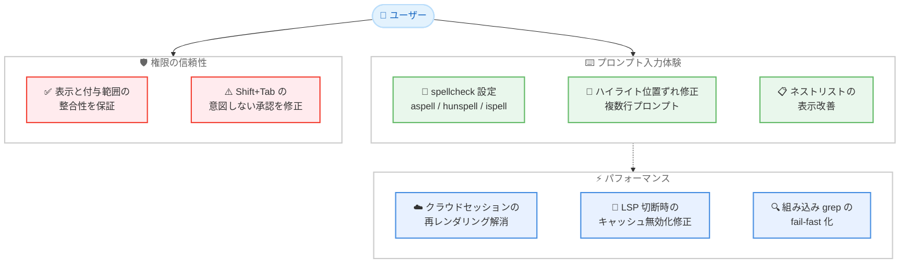

# Claude Code v2.1.235 リリース — プロンプト入力のスペルチェック追加、権限ダイアログの表示整合性改善、クラウドセッションのパフォーマンス改善

## メタデータ

| 項目 | 内容 |
|------|------|
| 発表日 | 2026-08-18 |
| ソース | Claude Code Changelog |
| カテゴリ | Claude Code アップデート |
| 公式リンク | https://github.com/anthropics/claude-code/blob/main/CHANGELOG.md |

## 概要

Claude Code v2.1.235 (2026 年 8 月 18 日、npm レジストリ基準) がリリースされた。プロンプト入力のスペルチェック機能の追加、権限ダイアログの表示と付与範囲の整合性改善、`/ultrareview` などのクラウドセッション実行中のメモリ / CPU 使用量の改善など、全 19 項目の変更を含むリリースである。

主要テーマは 3 つある。第一に、**プロンプト入力体験の向上**。オプションの `spellcheck` 設定が追加され、インストール済みの `aspell`、`hunspell`、`ispell` を使用して入力中のスペルミスに下線が表示されるようになった。あわせて、複数行プロンプトでのハイライト位置ずれや、ネストされた Markdown リストの表示崩れも修正された。第二に、**権限まわりの信頼性改善**。権限ダイアログの表示テキストと「don't ask again」オプションが、実際の付与範囲と常に一致するようになり、内容を完全に表示できない場合は「don't ask again」が提示されなくなった。また、権限プロンプトのコメント欄で Shift+Tab を押すと、欄を閉じる代わりに編集を承認しセッション全体の編集権限を付与してしまう問題も修正された。第三に、**パフォーマンスの改善**。`/ultrareview` や `/autofix-pr` などのクラウドセッションがバックグラウンドで実行される際、イベントストリームが更新のたびに再スキャン / 再レンダリングされなくなり、メモリと CPU の使用量が改善された。ネイティブ macOS / Linux ビルドの組み込み `grep` も、病的なパターンでメモリを使い果たす代わりに素早く失敗するよう改善されている。

このほか、言語サーバーの切断 / 再接続によるプロンプトキャッシュ全体の無効化の修正、Vim モードでの NORMAL モードとカーソル位置の保持、コンテキスト上限エラーの案内改善など、日常的な操作性と安定性に関わる修正が多数含まれる。

## 詳細

### 背景

Claude Code のプロンプト入力欄は、スラッシュコマンドやメンションのハイライトなど段階的に強化されてきたが、スペルチェックは提供されていなかった。v2.1.235 では、OS にインストール済みのスペルチェッカー (`aspell` / `hunspell` / `ispell`) を利用するオプトイン方式でスペルチェックが導入された。

権限まわりでは、ダイアログの表示テキストと実際に付与される権限の範囲が一致しないケースや、キー操作 (Shift+Tab) が意図しない承認につながるケースが存在していた。権限は Claude Code の安全性の中核であるため、本バージョンでは表示と付与範囲の整合性、およびキー操作の安全性が改善された。

また、`/ultrareview` や `/autofix-pr` といったクラウドセッションをバックグラウンドで実行する利用形態が広がる中、イベントストリームの再処理によるリソース消費が課題となっており、本バージョンで効率化された。

### 主な変更点

#### 新機能・改善 (Added)

1. **`spellcheck` 設定の追加**: オプションの `spellcheck` 設定が追加された。有効にすると、インストール済みの `aspell`、`hunspell`、`ispell` を使用して、プロンプト入力中のスペルミスの単語に下線が表示される

2. **ネストされた Markdown リストの表示改善**: 深さ 3 以上のネストされたリスト項目の位置ずれが修正され、ターミナル UI で折り返されたリスト項目にぶら下げインデントが追加された

3. **展開済みタスクリストの状態保持**: 未完了のタスクが残るセッションを再開 / 再起動した際に、展開済みタスクリスト (`ctrl+t`) が常に折りたたまれた状態で始まる問題が修正された

#### 修正 (Fixed)

4. **プロンプトキャッシュ無効化の修正**: セッション中に言語サーバーが切断または再接続した際に、プロンプトキャッシュ全体が無効化される問題を修正

5. **プロンプト入力ハイライトの位置ずれ修正**: 一部の複数行プロンプトで、スラッシュコマンド、キーワード、メンションのハイライトが 1 文字以上ずれて表示される問題を修正

6. **権限プロンプトの Shift+Tab 修正**: 権限プロンプトのコメント欄内で Shift+Tab を押すと、欄を閉じる代わりに編集を承認し、セッション全体の編集権限を付与してしまう問題を修正

7. **Agent ツールのデフォルト表示修正**: general-purpose エージェントが利用できないセッションで、Agent ツールがそれをデフォルトとして提示していた問題を修正。`subagent_type` が省略された場合、利用可能なエージェントを列挙する明確なエラーが返るようになった

8. **ノートブックセル承認ダイアログの改善**: ノートブックまたはセルを読み取れなかった場合に、セルの削除 / 置換の承認ダイアログが既存のセル内容を黙って省略していた問題を修正。ダイアログに理由が表示されるようになった

9. **スラッシュコマンドの文字化け修正**: Claude の応答中に実行したスラッシュコマンドが、実際の文字の代わりに HTML エンティティを表示する問題を修正

10. **自動更新後の再起動通知の修正**: バックグラウンドでの自動更新後に、プロンプトフッターに「Update installed」の再起動通知が表示されない問題を修正

11. **クラウドセッション実行中のリソース使用量改善**: `/ultrareview` や `/autofix-pr` などのクラウドセッションがバックグラウンドで実行される間のメモリと CPU 使用量を改善。イベントストリームが更新のたびに再スキャン / 再レンダリングされなくなった

12. **組み込み `grep` の改善**: ネイティブ macOS / Linux ビルドの組み込み `grep` で、病的なパターンがメモリを使い果たす代わりに素早く失敗するようになった。また、`-m N` と `-A` / `-C` の併用時に正しいコンテキストが出力されるようになった

13. **[VSCode] フォーカス移動の修正**: 複数の Claude パネルを持つウィンドウの復元またはリロード時に、開いている Claude タブ間でフォーカスが勝手に移動する問題を修正

#### 変更 (Changed)

14. **権限ダイアログの整合性改善**: 表示テキストと「don't ask again」オプションが、承認によって実際に付与される範囲と常に一致するようになった。内容を完全に表示できない場合は「don't ask again」が提示されない

15. **コンテキスト上限エラーの案内改善**: 自動コンパクトが無効になっている場合はその旨を伝え、再有効化のために `/config` を案内するようになった

16. **Vim モードの状態保持**: 詳細トランスクリプトの切り替え (ctrl+o) やパネルを閉じる操作の際に、NORMAL モードとカーソル位置が保持されるようになった

17. **ダイアログのキー操作改善**: 矢印キーと Enter を素早く連続して押した場合に、直前にハイライトされていた選択肢ではなく、実際に移動した先の選択肢が選択されるようになった

18. **Remote Control の起動チェック統一**: `claude rc` が、対話型起動と同じエンタープライズゲートウェイの可用性チェックを適用するようになった

#### 削除・変更 (Removed / Changed)

19. **`SendMessage` のサイズ検証**: セッション間配信には大きすぎるメッセージを黙って破棄する代わりに、送信前に拒否するようになった

### 技術的な詳細

#### プロンプト入力のスペルチェック

オプションの `spellcheck` 設定を有効にすると、プロンプト入力欄でスペルミスの単語に入力中リアルタイムで下線が表示される。スペルチェックのエンジンには、OS にインストール済みの `aspell`、`hunspell`、`ispell` のいずれかが使用される。Claude Code 自体にスペルチェッカーは同梱されないため、利用にはいずれかのツールのインストールが必要となる。英語プロンプトを多用するユーザーにとって、タイプミスによる意図しない指示のブレを事前に防ぎやすくなる。

#### 権限ダイアログの整合性と Shift+Tab の修正

権限まわりで 2 つの重要な改善が入った。

第一に、権限ダイアログの表示テキストと「don't ask again」オプションが、承認によって実際に付与される範囲と常に一致するようになった。さらに、ダイアログ内で内容を完全に表示できない場合には「don't ask again」オプション自体が提示されなくなり、ユーザーが確認できていない内容に対して恒久的な許可を与えてしまうリスクが排除された。

第二に、権限プロンプトのコメント欄内での Shift+Tab の挙動が修正された。従来はコメント欄を閉じる操作のつもりで Shift+Tab を押すと、編集が承認され、さらにセッション全体の編集権限まで付与されてしまうケースがあった。意図しない権限付与につながる問題であるため、該当する操作を行うユーザーはアップデートを推奨する。

#### クラウドセッションのイベントストリーム処理の効率化

`/ultrareview` や `/autofix-pr` などのクラウドセッションをバックグラウンドで実行している間、従来はイベントストリーム全体が更新のたびに再スキャン / 再レンダリングされており、長時間のセッションではメモリと CPU の消費が増大していた。v2.1.235 ではこの再処理が解消され、クラウドセッションを並行して走らせながらローカルで作業を続ける場合のリソース負荷が軽減された。

#### 言語サーバー切断時のプロンプトキャッシュ保護

セッション中に言語サーバー (LSP) が切断または再接続すると、プロンプトキャッシュ全体が無効化される問題があった。プロンプトキャッシュの無効化はレイテンシとコストの両面に影響するため、この修正により、LSP の接続が不安定な環境でもキャッシュ効率が維持されるようになった。

#### 組み込み grep の堅牢化

ネイティブ macOS / Linux ビルドに組み込まれた `grep` について、2 つの改善が入った。病的な (pathological) 正規表現パターンがメモリを使い果たすまで実行され続ける代わりに、素早く失敗するようになった。また、`-m N` (マッチ数の上限) と `-A` / `-C` (コンテキスト行の表示) を併用した際に、正しいコンテキストが出力されるようになった。

## アーキテクチャ図



## 開発者への影響

### 対象

- **英語プロンプトを多用するユーザー**: `spellcheck` 設定を有効にし、`aspell` / `hunspell` / `ispell` のいずれかをインストールすると、入力中のスペルミスに下線が表示される
- **権限プロンプトでコメント欄を利用するユーザー**: Shift+Tab が意図せず編集を承認しセッション全体の編集権限を付与する問題が修正された。速やかなアップデートを推奨
- **権限ダイアログで「don't ask again」を利用するユーザー**: 表示テキストと付与範囲が常に一致するようになり、内容を確認できない場合は恒久許可のオプションが提示されなくなった
- **クラウドセッション (`/ultrareview` / `/autofix-pr` など) の利用者**: バックグラウンド実行中のメモリと CPU 使用量が改善され、並行作業時の負荷が軽減される
- **言語サーバー (LSP) を利用するユーザー**: LSP の切断 / 再接続によるプロンプトキャッシュ全体の無効化が解消され、レイテンシとコストの悪化を防げる
- **Vim モードの利用者**: ctrl+o によるトランスクリプト切り替えやパネルを閉じる操作で、NORMAL モードとカーソル位置が保持されるようになった
- **サブエージェントを利用するユーザー**: general-purpose エージェントが利用できないセッションで `subagent_type` を省略した場合、利用可能なエージェントを列挙する明確なエラーが返る
- **Jupyter ノートブックの利用者**: セルの削除 / 置換の承認ダイアログが、セル内容を表示できない場合にその理由を明示するようになった
- **マルチエージェント / セッション間メッセージングの利用者**: `SendMessage` が配信不能な大きさのメッセージを黙って破棄せず、送信前に拒否するようになった
- **VS Code 拡張機能の利用者**: 複数の Claude パネルを持つウィンドウの復元 / リロード時のフォーカス移動が修正された
- **エンタープライズゲートウェイ環境の利用者**: `claude rc` が対話型起動と同じ可用性チェックを適用するようになった

### 必要なアクション

以下のコマンドで最新バージョンに更新できる。

```bash
# npm でのアップデート
npm update -g @anthropic-ai/claude-code

# Homebrew でのアップデート
brew upgrade claude-code

# 現在のバージョン確認
claude --version
```

**推奨される確認事項:**

- **スペルチェックを利用したい場合**: `aspell`、`hunspell`、`ispell` のいずれかをインストールし、`spellcheck` 設定を有効にする
- **`SendMessage` で大きなメッセージを送信していた場合**: 従来は黙って破棄されていたが、今後は送信前に拒否されるため、エラーが返った場合はメッセージの分割を検討する
- **自動コンパクトを無効にしている場合**: コンテキスト上限エラー時に `/config` での再有効化が案内されるようになったため、運用方針を確認する

### 移行ガイド (該当する場合)

**`SendMessage` のサイズ検証:**

セッション間配信には大きすぎるメッセージは、従来は黙って破棄されていたが、v2.1.235 以降は送信前に拒否される。破棄を前提とした挙動に依存していた場合は、拒否エラーへの対応 (メッセージの分割や要約) が必要となる。

## コード例

### スペルチェックの利用

```bash
# スペルチェッカーのインストール (例: macOS)
brew install aspell

# スペルチェッカーのインストール (例: Ubuntu / Debian)
sudo apt-get install hunspell

# Claude Code を起動し、設定で spellcheck を有効化
claude
# セッション内で
/config
```

### 展開済みタスクリストの確認

```bash
# セッション再開時も展開状態が保持されるようになった
claude --resume
# セッション内でタスクリストを展開
# ctrl+t
```

## 関連リンク

- [Claude Code Changelog](https://github.com/anthropics/claude-code/blob/main/CHANGELOG.md)
- [Claude Code GitHub リポジトリ](https://github.com/anthropics/claude-code)
- [Claude Code ドキュメント](https://docs.anthropic.com/en/docs/claude-code)
- [Claude Code v2.1.234](./2026-08-17-claude-code-v2-1-234.md)

## まとめ

Claude Code v2.1.235 は、プロンプト入力のスペルチェック追加、権限ダイアログの整合性改善、クラウドセッションのパフォーマンス改善を柱とするリリースである。特に以下の 3 点が注目に値する。

第一に、**プロンプト入力体験の向上**。オプトインの `spellcheck` 設定により、インストール済みのスペルチェッカーを使ってスペルミスに下線が表示されるようになった。複数行プロンプトのハイライト位置ずれやネストリストの表示崩れの修正とあわせて、入力欄の完成度が高まった。

第二に、**権限まわりの信頼性改善**。ダイアログの表示テキストと「don't ask again」の付与範囲が常に一致するようになり、内容を確認できない場合には恒久許可が提示されなくなった。コメント欄での Shift+Tab による意図しない編集承認とセッション全体の権限付与の修正も含まれ、権限操作の安全性が向上した。

第三に、**パフォーマンスの改善**。クラウドセッションのイベントストリーム再処理の解消、LSP 切断時のプロンプトキャッシュ無効化の修正、組み込み `grep` の fail-fast 化により、長時間セッションや並行作業でのリソース効率が改善された。

意図しない権限付与につながる Shift+Tab の問題が修正されているため、権限プロンプトのコメント欄を利用するユーザーには速やかなアップデートを推奨する。Vim モードやダイアログのキー操作、VS Code のフォーカス移動など日常的な操作性の修正も多く、全ユーザーにとって安定性の向上が期待できるリリースである。
