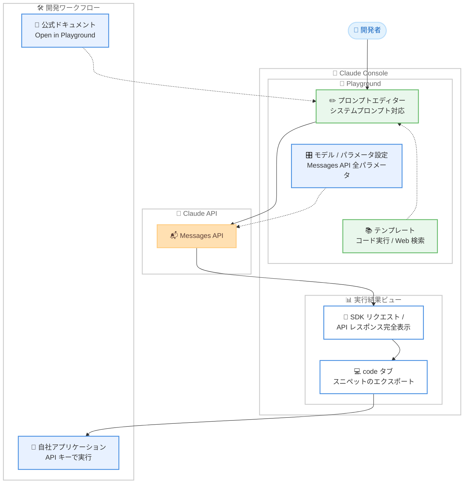

# Claude Console の Workbench が Playground に刷新、Messages API 全パラメータ対応と SDK リクエスト / レスポンスの完全表示を実現

## メタデータ

| 項目 | 内容 |
|------|------|
| 発表日 | 2026-08-18 |
| ソース | Claude Developer Platform Release Notes |
| カテゴリ | Claude API / Console / 開発者ツール |
| 公式リンク | https://platform.claude.com/docs/en/release-notes/overview |

## 概要

Anthropic は 2026 年 8 月 18 日、Claude Console の Workbench を **Playground** として刷新したことをリリースノートで発表した。Playground は Messages API のすべてのパラメータをサポートし、コード実行や Web 検索などの API 機能の使い方を示すテンプレートを収録する。また、実行のたびに完全な SDK リクエストと API レスポンスを表示することで、API の構造の理解とアプリケーション開発を支援する。Playground は https://platform.claude.com/playground から利用できる。

公式ヘルプセンターによると、Playground は公開されている Messages API の上に直接構築されており、Playground で組み立てたリクエストはコードから送信するものと同一である。旧 Workbench と異なり、プロンプトや会話は Anthropic のサーバーに保存されないステートレスな設計となっており、下書きはブラウザ内に留まる。一方で、旧 Workbench が提供していたプロンプト履歴の保存やプロンプト評価 (evals) はサポートされない。

旧 Workbench (legacy) に保存されていたデータは **2026 年 9 月 1 日まで** Console の設定からエクスポート可能であり、それ以降は復元できなくなる。旧 Workbench の利用者は期限までにデータのエクスポートを完了する必要がある。

## 詳細

### 背景

Workbench は Claude Console 内でプロンプトを作成、テスト、保存できるツールとして提供されてきた。プロンプトの保存、バージョン管理、評価 (evals)、共有といった機能を持つ一方、Console 上の表示と実際の API リクエストの対応関係が必ずしも明確ではなかった。

今回の刷新は、ツールの位置づけを「プロンプト管理ツール」から「API の学習と実験のための実行環境」へと転換するものである。ヘルプセンターは Playground の用途を以下のように整理している。

- コードを書く前にモデルや新しい API 機能を試す
- プロンプトを反復改善し、完全なレスポンスを確認する
- API リクエスト / レスポンスの構造を学ぶ
- 作業内容を自分のアプリケーションで実行できるコードスニペットとしてエクスポートする

### 主な変更点

#### 1. Messages API の全パラメータをサポート

リリースノートによると、Playground は Messages API のすべてのパラメータをサポートする。モデルセレクターで Claude モデルを切り替えられるほか、temperature や最大出力トークン数などのパラメータをモデル設定から調整できる。同一のプロンプトを異なるモデルや設定で実行し、レスポンスの変化を比較する用途に適している。

#### 2. API 機能を示すテンプレートを収録

コード実行や Web 検索などの API 機能の使い方を示すテンプレートが用意されており、読み込んで編集した上で実行できる。ツール定義を追加してツール使用 (tool use) をテストしたり、構造化出力 (structured outputs) で定義した形式のデータを返させたりすることも可能である。レスポンス内のツール呼び出しとツール結果も表示されるため、API 上での表現方法を正確に確認できる。

#### 3. 完全な SDK リクエストと API レスポンスの表示

実行ごとに、完全なメッセージ構造、stop reason、usage を含む生の API リクエストとレスポンスを表示する。これはアプリケーションが実際に送受信するものと同じ形式であり、画面上の表示とコードの挙動が一致することが保証される。トークン数と使用量も実行ごとに確認できる。

#### 4. コード生成と「Open in Playground」

「code」トグルをクリックすると、現在のリクエストをコードスニペットとしてエクスポートできる。スニペットは Playground でテストした内容を正確に反映しており、自分の API キーでそのまま実行できる。また、公式ドキュメント内のコード例には「Open in Playground」オプションが追加されており、ドキュメントの例を Playground に読み込んで実行、編集できる。

#### 5. ステートレスな設計への転換

Playground はプロンプトや会話を Anthropic のサーバーに保存しない。下書きはブラウザ内に留まり、リクエストのコピーは「code」タブから保持できる。旧 Workbench が提供していた以下の機能は Playground には含まれない。

- 保存プロンプト
- プロンプトのバージョン管理
- プロンプト評価 (evals)
- プロンプト共有

### 技術的な詳細

#### Playground の利用手順

ヘルプセンターに記載されている利用手順は以下の通り。

1. Claude Console (https://platform.claude.com/) にログインする
2. ナビゲーションから [Playground] を選択する
3. 組織がワークスペースを使用している場合は、作業するワークスペースを選択する
4. プロンプト欄にユーザーメッセージを入力する。システムプロンプトの追加も可能
5. [Run] をクリックしてリクエストを送信する
6. Claude のレスポンスと、そのリクエストのトークン数、使用量を確認する
7. プロンプトを編集して再実行し、反復改善する

#### 旧 Workbench との比較

| 項目 | Playground | Workbench (legacy) |
|------|-----------|-------------------|
| データ保存 | サーバーに保存しない。下書きはブラウザ内のみ | プロンプト、履歴をサーバーに保存 |
| Messages API パラメータ | すべてサポート | 一部 |
| リクエスト / レスポンス表示 | 完全な SDK リクエストと API レスポンスを表示 | 限定的 |
| テンプレート | コード実行、Web 検索などの API 機能を示すテンプレートを収録 | なし |
| プロンプト履歴 / バージョン管理 | 非対応 | 対応 |
| プロンプト評価 (evals) | 非対応 | 対応 |
| プロンプト共有 | 非対応 | 対応 |
| コードエクスポート | 「code」トグルでスニペットをエクスポート | 対応 |

#### 旧 Workbench データのエクスポート

旧 Workbench に保存されていたデータは、Console の設定 (https://platform.claude.com/settings/privacy) から JSON 形式でエクスポートできる。手順は以下の通り。

1. Console のプライバシー設定にアクセスする
2. [Export Workbench data] ダイアログで、プロンプトに加えて含める内容を選択する
   - **Model completions**: 過去の実行で保存されたレスポンス
   - **Uploaded files**: プロンプトに添付した画像や PDF
   - いずれを含めてもエクスポートサイズが大幅に増加する可能性がある
3. [Export] を選択する。データは JSON 形式でパッケージ化され、準備完了後にダウンロードリンクがメールで届く

Primary Owner または Admin は、組織全体のデータをエクスポートするオプションも利用できる。

注意点として、エクスポートした Workbench データを Playground にインポートすることはできない。Playground はプロンプトや会話を保存しないため、インポート先が存在しない。エクスポートはデータのコピーを保持したり、自社のツールへ移行したりするためのものである。

**エクスポート期限は 2026 年 9 月 1 日であり、それ以降はアクセスできなくなる。**

## 開発者への影響

### 対象

- **Claude API を学習中の開発者**: 実行ごとに完全な SDK リクエストと API レスポンスが表示されるため、コードを書く前に API の構造を正確に把握できる
- **新機能を検証したい開発者**: コード実行や Web 検索などのテンプレートから、新しい API 機能を実装前に試せる
- **プロンプトを反復改善する開発者**: モデルやパラメータを切り替えながら同一プロンプトの挙動を比較できる
- **旧 Workbench の利用者**: 保存プロンプト、履歴、evals が利用できなくなるため、データのエクスポートとワークフローの見直しが必要になる

### 必要なアクション

1. **旧 Workbench データのエクスポート**: 2026 年 9 月 1 日の期限までに、Console のプライバシー設定から保存プロンプト、Model completions、Uploaded files をエクスポートする。期限を過ぎるとデータは復元できない
2. **組織全体のエクスポートの検討**: Primary Owner または Admin は、個々のメンバーに任せず組織全体のデータを一括エクスポートすることを検討する
3. **evals ワークフローの代替手段の検討**: Playground はプロンプト評価をサポートしないため、旧 Workbench の evals に依存していた場合は代替の評価基盤を用意する
4. **プロンプト管理の移行**: サーバー側にプロンプトが保存されなくなるため、プロンプトのバージョン管理はリポジトリなど自社の管理基盤へ移行する。「code」タブからエクスポートしたスニペットをコードとして管理する運用が推奨される
5. **Playground の試用**: https://platform.claude.com/playground にアクセスし、テンプレートや SDK リクエスト表示を確認する

### 移行ガイド (該当する場合)

旧 Workbench から Playground への移行では、以下の差分を前提に運用を組み立てる必要がある。

- **保存の概念がない**: プロンプトの永続化はブラウザ内の下書きとコードエクスポートのみ。継続的に使うプロンプトは、エクスポートしたコードスニペットとしてバージョン管理システムで管理する
- **evals の移行**: 評価が必要な場合は、エクスポートしたプロンプトを自社の評価パイプラインやサードパーティの評価ツールに移す
- **共有の移行**: プロンプト共有機能がないため、チーム内の共有はコードリポジトリやドキュメントで行う
- **ドキュメントとの連携**: 公式ドキュメントの「Open in Playground」から例を読み込めるため、学習フローはドキュメント起点に切り替えると効率的である

## コード例

Playground の「code」トグルからエクスポートされるコードスニペットは、画面上で実行したリクエストと同一の内容になる。以下は Web 検索ツールを有効にしたリクエストの例である。

```python
# Playground でテストしたリクエストは、code トグルから
# そのまま実行可能なスニペットとしてエクスポートできる
import anthropic

client = anthropic.Anthropic()

response = client.messages.create(
    model="claude-sonnet-4-5",
    max_tokens=1024,
    temperature=1.0,
    system="お客様の質問に日本語で簡潔に回答してください。",
    messages=[
        {
            "role": "user",
            "content": "Anthropic の最新の発表を教えてください。",
        }
    ],
    tools=[
        {
            "type": "web_search_20250305",
            "name": "web_search",
            "max_uses": 3,
        }
    ],
)

# Playground と同様に stop_reason と usage を確認できる
print(f"Stop reason: {response.stop_reason}")
print(f"Usage: {response.usage}")
for block in response.content:
    if block.type == "text":
        print(block.text)
```

## アーキテクチャ図



## 関連リンク

- [Claude Developer Platform Release Notes](https://platform.claude.com/docs/en/release-notes/overview)
- [Playground](https://platform.claude.com/playground)
- [How do I use the playground? (Claude Help Center)](https://support.claude.com/en/articles/8606378-how-do-i-use-playground)
- [Working with Messages](https://platform.claude.com/docs/en/build-with-claude/working-with-messages)
- [Console のプライバシー設定 (Workbench データのエクスポート)](https://platform.claude.com/settings/privacy)
- [How can I access the Claude API?](https://support.claude.com/en/articles/8114521)
- [Claude Console roles and permissions](https://support.claude.com/en/articles/10186004)

## まとめ

2026 年 8 月 18 日の発表により、Claude Console の実験環境は Workbench から Playground へと世代交代した。

- **API との一致性が中心的な価値**: Playground は公開 Messages API の上に直接構築されており、画面で組み立てたリクエストとコードから送信するリクエストが同一になる。実行ごとに完全な SDK リクエストと API レスポンスが表示されるため、「Console では動くがコードでは動かない」という乖離が起きにくい
- **学習から実装への導線が整備された**: コード実行や Web 検索などのテンプレート、ドキュメントからの「Open in Playground」、code タブからのスニペットエクスポートにより、API 機能の学習、検証、実装コードへの反映が一続きのフローになった
- **ステートレス化はトレードオフを伴う**: プロンプトや会話がサーバーに保存されないためプライバシー面の懸念は減る一方、保存プロンプト、バージョン管理、evals、共有は失われた。これらに依存していたチームは、コードリポジトリや外部の評価基盤への移行が必要になる
- **最重要の期限は 2026 年 9 月 1 日**: 旧 Workbench のデータはこの日までしかエクスポートできず、以降は復元不可となる。旧 Workbench を利用していた組織は、期限前に Model completions と Uploaded files を含めたエクスポートの要否を判断し、実行しておくべきである
