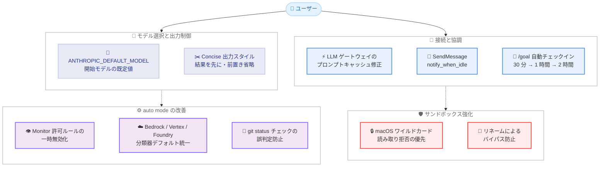

# Claude Code v2.1.236 / v2.1.237 リリース — ANTHROPIC_DEFAULT_MODEL 環境変数、組み込み Concise 出力スタイル、macOS サンドボックスの読み取り拒否強化、auto mode の大幅改善

## メタデータ

| 項目 | 内容 |
|------|------|
| 発表日 | 2026-08-19 |
| ソース | Claude Code Changelog |
| カテゴリ | Claude Code アップデート |
| 公式リンク | https://github.com/anthropics/claude-code/blob/main/CHANGELOG.md |

## 概要

Claude Code v2.1.236 および v2.1.237 (いずれも 2026 年 8 月 19 日、npm レジストリ基準) がリリースされた。v2.1.236 は 30 項目を超える変更を含む大規模リリースで、v2.1.237 は LLM ゲートウェイ利用時のプロンプトキャッシュ修正と新しい出力スタイルを追加する小規模リリースである。

主要テーマは 4 つある。第一に、**モデル選択と出力の制御強化**。新しいセッションの開始モデルを指定する `ANTHROPIC_DEFAULT_MODEL` 環境変数 (v2.1.236) と、結果を先に述べて前置きやナレーションを省く組み込み「Concise」出力スタイル (v2.1.237) が追加された。第二に、**auto mode の大幅改善**。auto mode 有効時に `Monitor` 許可ルールを一時的に無効化して Bash コマンドと同様にレビューする変更、Bedrock / Vertex AI / Foundry やテレメトリ無効環境でも Claude API と同じ分類器デフォルト (重大度スコア付き分類を含む) を使用する改善、git の `status.showUntrackedFiles=no` 設定による誤判定の防止が含まれる。第三に、**macOS サンドボックスの読み取り拒否ルールの強化**。`**/.env` のようなワイルドカード読み取り拒否ルールが、許可された読み取り領域の内側でも優先されるようになり、ディレクトリの内容もカバーし、ファイル名の変更によるバイパスもできなくなった。第四に、**プロンプトキャッシュの修正**。LLM ゲートウェイやカスタムベース URL を使用するセッションでプロンプトキャッシュが機能しない問題が v2.1.237 で修正され、該当環境でのコストとレイテンシの改善が期待できる。

このほか、クロスセッション `SendMessage` の `notify_when_idle` オプション、`/goal` の自動チェックイン、`/usage` の Team / Enterprise 向け表示、VS Code 拡張のスクリーンリーダー対応、フルスクリーン TUI や Remote Control に関する多数のバグ修正が含まれる。

## 詳細

### 背景

Claude Code では従来、`ANTHROPIC_MODEL` 環境変数でモデルを指定できたが、この指定はセッション内の `/model` による選択と競合しやすかった。v2.1.236 で追加された `ANTHROPIC_DEFAULT_MODEL` は「新しいセッションの開始モデル」のみを定め、ユーザーが `/model` で選んだモデルはそれを上書きして再起動後も維持されるという、より柔軟な優先順位を提供する。

auto mode (コマンドを分類器で自動判定して許可する権限モード) は、これまで Claude API 以外のプロバイダー (Bedrock、Vertex AI、Foundry) やテレメトリ無効環境では分類器の挙動が異なっていた。v2.1.236 でこれらの環境でも Claude API と同じデフォルトに統一され、挙動の一貫性が向上した。

また、LLM ゲートウェイやカスタムベース URL を経由して Claude Code を利用する企業環境では、プロンプトキャッシュが正しく機能しない問題があった。v2.1.237 でこれが修正され、ゲートウェイ経由でもキャッシュによるコスト削減と応答高速化の恩恵を受けられるようになった。

### 主な変更点

#### v2.1.237

1. **LLM ゲートウェイ / カスタムベース URL のプロンプトキャッシュ修正**: LLM ゲートウェイまたはカスタムベース URL を使用するセッションで、プロンプトキャッシュが機能しない問題を修正

2. **組み込み「Concise」出力スタイルの追加**: Claude が結果を先に述べ、前置きやナレーションを省略する出力スタイルが追加された。作業の丁寧さはそのままに、出力だけが簡潔になる。`/config` の Output style から選択できる

#### v2.1.236: 新機能 (Added)

3. **`ANTHROPIC_DEFAULT_MODEL` 環境変数**: 新しいセッションの開始モデルを設定する。`/model` での選択はこれを上書きし、再起動後も維持される (`ANTHROPIC_MODEL` とは異なる挙動)

4. **クロスセッション `SendMessage` の `notify_when_idle`**: 同じマシン上の別の Claude Code セッションに対し、次にアイドルになったときに 1 回だけ通知を送るよう依頼できる。オプトイン、ワンショットで、ポーリング不要 (macOS および Linux)

5. **VS Code のスクリーンリーダー対応**: トランスクリプトに対するスクリーンリーダーサポートが追加された。返信、権限リクエスト、エラー、状態変化のライブアナウンスと、ターンごとの見出しナビゲーションが利用できる

#### v2.1.236: 改善 / 変更 (Improved / Changed)

6. **macOS サンドボックスのワイルドカード読み取り拒否ルール強化**: `**/.env` のようなワイルドカード読み取り拒否ルールが、許可された読み取り領域の内側でも優先されるようになった。マッチしたディレクトリの内容もカバーし、拒否対象ファイルのリネームによるバイパスもできなくなった

7. **auto mode: `Monitor` 許可ルールの一時無効化**: auto mode の有効中は `Monitor` 許可ルールが脇に置かれ、Monitor コマンドも Bash コマンドと同じ方法でレビューされるようになった

8. **auto mode: Bedrock / Vertex AI / Foundry とテレメトリ無効環境の改善**: これらの環境でも、分類器が Claude API 上と同じデフォルト (重大度スコア付き分類を含む) を使用するようになった

9. **auto mode: git status チェックの堅牢化**: リポジトリの `status.showUntrackedFiles=no` 設定によって、git status チェックがクリーンなツリーと誤報告させられる問題が解消された

10. **`/goal` の自動チェックイン**: 長時間のバックグラウンド作業の背後でゴールが待機しているアイドルセッションが、ユーザーの復帰を待たずに 30 分後 (その後 1 時間後、2 時間後) に自動的にチェックインするようになった

11. **`/usage` の Team / Enterprise 表示**: Team および Enterprise メンバーに使用クレジットの支出行が表示されるようになった。支出前は上限付きの行が 0% で表示される

12. **`/model` ピッカーのハイライト変更**: 最新モデルの名前のみをハイライトし、リストの恣意的な一部ではなく新リリースを示すようになった

13. **スラッシュコマンドのタイポ処理の変更**: タイポしたコマンドやこのセッションで利用できないコマンドで Enter を押した場合、最も近い候補をあいまい一致で実行する代わりに、その旨を報告するようになった。プレフィックスとエイリアスは引き続き実行される

14. **print / SDK モードの SIGTERM 処理**: 終了前に中断されたターンや合成されたツール拒否を記録しなくなった。実行中のコマンドの終了と、終了コード 143 での終了は従来どおり

15. **Remote Control のオフライン検出の高速化**: CLI の終了やターミナルのクローズ時に、数秒以内にセッションがオフラインと表示されるようになった

16. **`SendMessage` のバースト保護**: 短時間の連続送信が相手セッションの受信箱の許容量を超える場合、送信済みと報告しながら破棄する代わりに、事前に以降のメッセージを拒否するようになった

17. **起動パフォーマンスの改善**: セッションカウンターがバックグラウンドで書き込まれるようになった

18. **UI 配置の調整**: プロンプト境界のセッションタイトルチップがフッターの右端に揃えられ、右揃えのフッター項目 (ゴールインジケーター、セッション状態、バックグラウンドエージェント状態) と省略表示の通知が、プロンプト領域の他の部分と一貫した右マージンを共有するようになった

#### v2.1.236: 修正 (Fixed)

19. **削除されたディレクトリ関連の修正**: セッションが移動した先のディレクトリが削除された後に、クリップボードコピー、バックグラウンドハウスキーピング、バックグラウンドセッション、ローカル MCP ログが壊れる問題を修正 (v2.1.229 以降)

20. **フルスクリーンレンダラーの恒久的な失敗の修正**: 一度起動に失敗すると以降のすべての起動で終了してしまう問題を修正。クラシックレンダラーへフォールバックするようになった

21. **`/model` ピッカーの高さ修正**: ターミナルより高くレンダリングされる問題を修正。ウィンドウに収まる数のモデルのみを表示し、残りはスクロールで到達できる

22. **`SendMessage` の不正な閉じタグの修正**: 不正な閉じタグによりメッセージテキストが summary フィールド内に残った場合に、呼び出しが拒否される問題を修正

23. **サブプロセス起動失敗時の未処理 Promise 拒否の修正**: たとえば Windows 相互運用が無効な WSL 上の `powershell.exe` など、サブプロセスの起動に失敗した際の未処理 Promise 拒否を修正 (v2.1.234 のリグレッション)

24. **フルスクリーンモードの表示修正**: ターミナルのリサイズ後、新しく送信したメッセージが次の更新まで表示されないことがある問題を修正。また、複数行プロンプトのクリア後にプロンプトの上に空白の帯が残る問題と、ターミナルをリサイズして戻した後にペインが再描画されない問題も修正

25. **管理設定の承認プロンプトの修正**: 起動時に承認プロンプトが表示されないまま、最初のキー入力を承認として取り込んでしまうことがある問題を修正

26. **tmux でのタブタイトルのちらつき修正**: iTerm の tmux 統合でターミナルタブのタイトルが跳ねる問題を修正。960 ミリ秒ごとのアニメーションではなく、テキストが変化したときのみ書き込まれるようになった

27. **クラウド環境リストのエラー改善**: クラウド環境のリストが空または不正な形式で返された場合の不明瞭なエラーを修正

28. **Remote Control でのモデル自動選択の修正**: Fable 5 の初回使用クレジットプロンプトが、Remote Control 使用時に 60 秒間無応答でフォールバックモデルを自動選択してしまう問題を修正

29. **スピナーティップスの修正**: `~/.claude.json` 内のキャッシュされたゲストパス特典が不正な形式の場合に、バックグラウンドエラーが繰り返されスピナーティップスが表示されない問題を修正

30. **スキルのホットリロードの修正**: SDK / VS Code セッションで、セッションの作業ディレクトリが削除された後、スキルの変更のたびにエラーが発生する問題を修正 (v2.1.229 以降)

31. **セルフホストランナーの修正**: アイドル、リタイア、起動タイムアウトで解放されたセッションが、ポストセッションフックの完了前に別のランナーで再開されることがある問題を修正

32. **セッション要約の暴走防止**: 自動および `/recap` の要約テキストが 400 文字で単語境界に沿って打ち切られるようになった

33. **Clawd マスコットの描画修正**: iTerm2 の一部フォントサイズで目と足が不揃いにレンダリングされる問題を修正

### 技術的な詳細

#### ANTHROPIC_DEFAULT_MODEL と ANTHROPIC_MODEL の違い

`ANTHROPIC_MODEL` はセッションで使用するモデルを直接指定する環境変数であるのに対し、`ANTHROPIC_DEFAULT_MODEL` は「新しいセッションの開始モデル」のみを定める。ユーザーが `/model` でモデルを選択した場合、その選択は `ANTHROPIC_DEFAULT_MODEL` を上書きし、再起動後も維持される。組織やチームで既定モデルを配布しつつ、個々のユーザーの選択を尊重したい場合に適した仕組みである。

#### 組み込み Concise 出力スタイル

v2.1.237 で追加された「Concise」出力スタイルは、Claude が結果を先に述べ、前置きやナレーションを省略する。重要なのは、**作業自体の丁寧さは変わらない**点である。変わるのは出力の分量だけであり、冗長な説明を減らしてトークン消費と読む負担を抑えたいユーザーに適する。`/config` の Output style から選択できる。

#### macOS サンドボックスのワイルドカード読み取り拒否

サンドボックス機能では、許可された読み取り領域の中でも特定のファイルへのアクセスを拒否するルールを設定できる。v2.1.236 では、macOS 上で `**/.env` のようなワイルドカード読み取り拒否ルールについて次の 3 点が強化された。

- 許可された読み取り領域の**内側でも拒否ルールが優先される**
- マッチした**ディレクトリの内容**もカバーされる
- 拒否対象ファイルの**リネームによるバイパスができない**

シークレットファイル (`.env` など) をサンドボックス化されたコマンドから確実に隔離できるようになり、防御の実効性が高まった。

#### auto mode の分類器の統一とレビュー強化

auto mode はコマンドを分類器で判定し、安全なものを自動的に許可する権限モードである。v2.1.236 では 3 つの改善が入った。

第一に、auto mode の有効中は `Monitor` 許可ルールが一時的に無効化され、Monitor コマンドも Bash コマンドと同じ方法でレビューされる。許可ルールを踏み台にした分類のすり抜けを防ぐ変更である。第二に、Bedrock、Vertex AI、Foundry の各プロバイダー、およびテレメトリ無効環境でも、分類器が Claude API 上と同じデフォルト (重大度スコア付き分類を含む) を使用するようになった。エンタープライズ環境でも auto mode の判定品質が Claude API と同等になる。第三に、リポジトリの `status.showUntrackedFiles=no` 設定によって git status チェックが「クリーンなツリー」と誤認させられる問題が解消され、リポジトリ側の設定による判定操作ができなくなった。

#### notify_when_idle によるセッション間協調

クロスセッション `SendMessage` に追加された `notify_when_idle` は、同じマシン上の別の Claude Code セッションが次にアイドルになったタイミングで 1 回だけ通知を受け取る仕組みである。オプトインかつワンショットであり、ポーリングが不要なため、複数セッションを並行運用するワークフロー (あるセッションの完了を待って次の作業を始めるなど) を効率的に構成できる。macOS と Linux で利用可能。

#### LLM ゲートウェイ経由のプロンプトキャッシュ修正

v2.1.237 では、LLM ゲートウェイまたはカスタムベース URL (`ANTHROPIC_BASE_URL` など) を使用するセッションでプロンプトキャッシュが機能しない問題が修正された。プロンプトキャッシュはシステムプロンプトや会話履歴の再送コストを大幅に削減する仕組みであり、ゲートウェイを経由する企業環境ではこの修正によりコストとレイテンシの両面で顕著な改善が期待できる。

## アーキテクチャ図



## 開発者への影響

### 対象

- **LLM ゲートウェイ / カスタムベース URL の利用者**: v2.1.237 でプロンプトキャッシュが機能するようになり、コストとレイテンシの改善が期待できる。該当環境では優先的なアップデートを推奨
- **チーム / 組織の管理者**: `ANTHROPIC_DEFAULT_MODEL` により、ユーザーの `/model` 選択を尊重しつつ既定モデルを配布できる。また `/usage` に Team / Enterprise メンバー向けの使用クレジット支出行が表示されるようになった
- **簡潔な出力を好むユーザー**: 組み込み「Concise」出力スタイルを `/config` から選択することで、作業の丁寧さを保ったまま前置きやナレーションを省略できる
- **auto mode の利用者**: `Monitor` 許可ルールが auto mode 中は無効化されるため、Monitor コマンドのレビューが増える可能性がある。Bedrock / Vertex AI / Foundry やテレメトリ無効環境では分類器の品質が Claude API と同等になった
- **macOS でサンドボックスを利用するユーザー**: `**/.env` のようなワイルドカード読み取り拒否ルールの実効性が高まり、リネームによるバイパスも防止された
- **マルチセッション運用の利用者**: `notify_when_idle` により、別セッションのアイドルをポーリングなしで検知できる。`SendMessage` のバースト時の黙示的な破棄も解消された
- **`/goal` で長時間タスクを扱うユーザー**: バックグラウンド作業待ちのゴールが 30 分後 (以降 1 時間、2 時間) に自動チェックインするようになった
- **VS Code 拡張の利用者**: スクリーンリーダー対応が追加され、アクセシビリティが向上した
- **WSL ユーザー**: Windows 相互運用無効時の `powershell.exe` 起動失敗によるクラッシュ (v2.1.234 のリグレッション) が修正された
- **フルスクリーン TUI の利用者**: 起動失敗後の恒久的な失敗、リサイズ後の表示不具合、空白帯の残留など多数の修正が入った

### 必要なアクション

以下のコマンドで最新バージョンに更新できる。

```bash
# npm でのアップデート
npm update -g @anthropic-ai/claude-code

# Homebrew でのアップデート
brew upgrade claude-code

# 現在のバージョン確認
claude --version
```

**推奨される確認事項:**

- **既定モデルを配布したい管理者**: `ANTHROPIC_MODEL` ではなく `ANTHROPIC_DEFAULT_MODEL` の利用を検討する。ユーザーの `/model` 選択が尊重される
- **簡潔な出力を試したい場合**: `/config` の Output style で「Concise」を選択する
- **auto mode で `Monitor` 許可ルールを設定している場合**: auto mode 中はルールが無効化され、Monitor コマンドも Bash と同様にレビューされることを把握しておく
- **macOS サンドボックスで機密ファイルを保護している場合**: ワイルドカード読み取り拒否ルール (`**/.env` など) が意図どおり機能するか確認する

### 移行ガイド (該当する場合)

**スラッシュコマンドのあいまい一致の廃止:**

タイポしたスラッシュコマンドや利用できないコマンドで Enter を押しても、最も近い候補が実行されなくなった。あいまい一致に依存した操作をしていた場合は、正確なコマンド名、プレフィックス、またはエイリアスを使用する。

**auto mode と Monitor 許可ルール:**

auto mode の有効中は `Monitor` 許可ルールが適用されない。auto mode で Monitor コマンドを自動許可させる運用をしていた場合、これらのコマンドは Bash コマンドと同様のレビュー対象になる。

## コード例

### 既定モデルの配布と /model による上書き

```bash
# 新しいセッションの開始モデルを指定 (/model の選択が優先され、再起動後も維持される)
export ANTHROPIC_DEFAULT_MODEL=claude-sonnet-4-6
claude
```

### Concise 出力スタイルの選択

```bash
claude
# セッション内で /config を開き、Output style から「Concise」を選択
/config
```

### 別セッションのアイドル通知

```text
# クロスセッション SendMessage で notify_when_idle を指定すると、
# 対象セッションが次にアイドルになったときに 1 回だけ通知が届く
# (macOS / Linux、オプトイン、ワンショット、ポーリング不要)
```

### macOS サンドボックスのワイルドカード読み取り拒否

```json
{
  "sandbox": {
    "deny": ["**/.env"]
  }
}
```

## 関連リンク

- [Claude Code Changelog](https://github.com/anthropics/claude-code/blob/main/CHANGELOG.md)
- [Claude Code GitHub リポジトリ](https://github.com/anthropics/claude-code)
- [Claude Code ドキュメント](https://docs.anthropic.com/en/docs/claude-code)
- [Claude Code v2.1.235](./2026-08-18-claude-code-v2-1-235.md)
- [Claude Code v2.1.234](./2026-08-17-claude-code-v2-1-234.md)

## まとめ

Claude Code v2.1.236 / v2.1.237 は、モデル選択と出力の制御強化、auto mode の品質向上、macOS サンドボックスの読み取り拒否強化、LLM ゲートウェイ環境のプロンプトキャッシュ修正を柱とするリリースである。特に以下の 4 点が注目に値する。

第一に、**`ANTHROPIC_DEFAULT_MODEL` と Concise 出力スタイル**。既定モデルの配布とユーザー選択の尊重を両立する環境変数と、作業の丁寧さを保ったまま出力を簡潔にするスタイルにより、組織と個人の双方でカスタマイズ性が高まった。

第二に、**auto mode の大幅改善**。`Monitor` 許可ルールの一時無効化、Bedrock / Vertex AI / Foundry やテレメトリ無効環境での分類器デフォルトの統一、git 設定による誤判定の防止により、auto mode の安全性と一貫性が向上した。

第三に、**macOS サンドボックスの強化**。ワイルドカード読み取り拒否ルールが許可領域の内側でも優先され、リネームによるバイパスも防止されるようになり、`.env` などの機密ファイルの隔離が確実になった。

第四に、**LLM ゲートウェイ環境のプロンプトキャッシュ修正**。ゲートウェイやカスタムベース URL を経由する企業環境で、キャッシュによるコスト削減と応答高速化の恩恵を受けられるようになった。

このほか、`notify_when_idle` によるセッション間協調、`/goal` の自動チェックイン、VS Code のスクリーンリーダー対応、フルスクリーン TUI の多数の修正が含まれる。特にゲートウェイ経由で利用する企業ユーザーと、auto mode やサンドボックスを活用するユーザーには、速やかなアップデートを推奨する。
