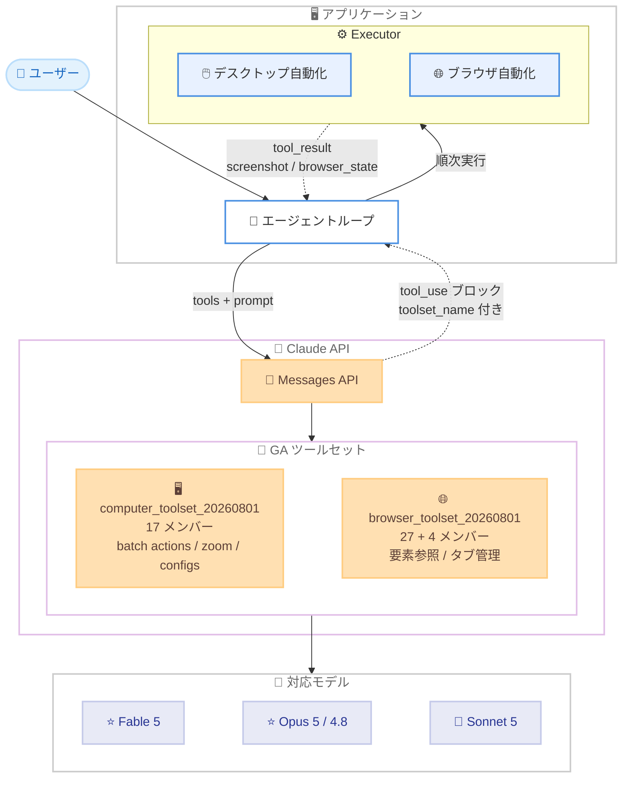

# Computer Use ツールが GA、ブラウザ操作専用の Browser Use ツールが新登場

## メタデータ

| 項目 | 内容 |
|------|------|
| 発表日 | 2026-08-19 |
| ソース | Claude API Release Notes |
| カテゴリ | API 更新 / 新機能 (Tool Use) |
| 公式リンク | https://platform.claude.com/docs/en/release-notes/overview |

## 概要

Anthropic は 2026 年 8 月 19 日、Claude API 上でコンピュータ操作ツールを `computer_toolset_20260801` ツールセットとして一般提供 (GA) 開始した。ベータヘッダーが不要になり、1 ターンで複数アクションを実行するバッチアクション、デフォルトで有効な `zoom`、`configs` によるメンバーごとの設定が利用できる。従来のベータ版も引き続き利用可能だが、既存統合をアップグレードする場合はリクエスト形式とツールハンドリングの変更が必要になる。

あわせて、アプリケーションがホストするブラウザを操作するためのクライアントツールセット `browser_toolset_20260801` (Browser Use ツール) が新たに登場した。デスクトップ全体ではなくブラウザビューポート内で動作し、スクリーンショットとクリックによる操作に加えて、アクセシビリティツリーの読み取り、要素参照、フォーム入力、タブ管理、ダウンロード報告、オプトインのファイルアップロードをサポートする。両ツールセットは Claude Fable 5、Claude Mythos 5、Claude Opus 5、Claude Sonnet 5、Claude Opus 4.8 で利用できる。

## 詳細

### 背景

コンピュータ操作ツールはこれまで `computer_20251124` などのベータ版として提供されており、ベータヘッダーの指定、`display_width_px` などの画面パラメータの設定、単一ツール `computer` の `action` フィールドによるアクション指定が必要だった。今回の GA により、ツールセットという新しい形式に移行し、各アクションが独立したメンバーツールとして扱われるようになった。

また、Web 操作に特化したユースケースでは、デスクトップ全体を対象とするコンピュータ操作よりも、ページ構造を直接読み取れるブラウザ専用ツールの方が効率的である。Browser Use ツールはこのニーズに応えるもので、スクリーンショットベースの操作とアクセシビリティツリーベースの操作を組み合わせられる。

### 主な変更点

**1. Computer Use ツールの GA (`computer_toolset_20260801`)**

- **ベータヘッダー不要**: Claude API 上で正式提供となり、ベータヘッダーなしで利用できる
- **バッチアクション**: Claude が 1 レスポンスで複数の `tool_use` ブロック (例: クリック → 入力 → スクリーンショット) を返す。クライアントは登場順に順次実行し、最初の失敗で停止する
- **`zoom` がデフォルトで有効**: 指定領域をフル解像度でキャプチャし、小さいテキストや密な UI の読み取りに使用できる
- **`configs` によるメンバーごとの設定**: メンバー名をキーに `enabled` (デフォルト `true`) や `defer_loading` を設定できる
- **17 個のメンバーツール**: `screenshot`、`zoom`、`left_click`、`type`、`key`、`scroll`、`wait` などが単一エントリの追加で有効になる
- 従来のベータ版 (`computer_20251124` など) は引き続き利用可能

**2. Browser Use ツールの新登場 (`browser_toolset_20260801`)**

- アプリケーションがホストするブラウザを操作するための**クライアントツールセット**。すべてのアクションはクライアント側の executor が実行し、Anthropic 側では何も実行されない
- デフォルトで 27 個のメンバーツールが有効になり、オプトインの 4 個 (`javascript_exec`、`file_upload`、`read_console`、`read_network`) を有効化すると計 31 個になる
- **アクセシビリティツリーの読み取り**: `read_page` がページのアクセシビリティツリーをテキストで返し、各要素に `ref_1` のような参照タグを付与する
- **要素参照によるターゲット指定**: クリックなどの操作対象を座標 (`{"type": "coordinate", "x": ..., "y": ...}`) と参照 (`{"type": "ref", "ref": "ref_2"}`) の 2 形式で指定できる
- **フォーム入力**: `form_input` でフォーム要素の値を直接設定できる (string / number / boolean)
- **タブ管理**: `new_tab`、`list_tabs`、`switch_tab`、`close_tab` を提供し、タブ状態は専用の `browser_state` ブロックで報告する
- **ダウンロード報告**: `download_started` / `download_completed` / `download_failed` イベントを `state_changes` で報告できる
- **オプトインのファイルアップロード**: `configs` で `file_upload` を有効化すると、`<input type="file">` にファイルを直接設定できる

**3. 対応モデル**

両ツールセットは Claude API 上の以下のモデルで利用できる。

- Claude Fable 5
- Claude Mythos 5
- Claude Opus 5
- Claude Sonnet 5
- Claude Opus 4.8

Claude Opus 4.7 / 4.6 / 4.5 や Claude Sonnet 4.6 は旧ベータ版 `computer_20251124` (ベータヘッダー必須) のみ対応する。AWS Bedrock、Google Cloud、Microsoft Foundry などの他プラットフォームでは新ツールセットは利用できない。

### 技術的な詳細

**ツールセットの呼び出し形式**

ツールセットでは、Claude の呼び出しは `tool_use` ブロックの `name` にメンバー名が入り、`toolset_name` フィールドが付与される。旧版のような `input.action` フィールドは存在しない。

```json
{
  "type": "tool_use",
  "id": "toolu_01WkoTUvSHDzTBu2xnGk8Ep8",
  "name": "left_click",
  "toolset_name": "computer",
  "input": { "coordinate": [512, 742] }
}
```

ディスパッチは `name` 単独ではなく、`toolset_name` と `name` のペアで行う必要がある (同名のカスタムツールと区別するため)。`tool_result` にも `toolset_name` を必ずエコーする。省略や不一致はリクエストが拒否される。

**バッチアクションの処理ルール**

1. 複数の `tool_use` ブロックは並列ではなく**順番に実行**し、最初の失敗で停止する (後続アクションは先行アクションの成功を前提に計画されているため)
2. すべての `tool_use` に対して `tool_result` を返す (未回答があると `invalid_request_error`)
3. 失敗したアクションには `is_error: true` とエラー説明を返す
4. スキップしたアクションには `is_error: true` と規定のテキスト (computer の場合は `Not executed: an earlier computer action in this turn failed.`) を返す
5. 画像が必要なのは `screenshot` と `zoom` のみで、他のアクションは `OK` などの短いテキストで十分

1 ターン 1 アクションに制限したい場合は、`tool_choice` で `disable_parallel_tool_use: true` を設定する。

**Browser Use の要素参照と browser_state**

`read_page` の出力例。

```text
link "Documentation" [ref_1]
link "Getting started" [ref_2]
textbox "Search docs" [ref_3]
button "Search" [ref_4]
```

参照はタブごとにスコープされ、ナビゲーションや大きな DOM 変更まで有効。無効になった参照には「再読み取りを促すエラー結果」を返す。アクセシビリティツリーで表現できない canvas やクロスオリジン iframe は座標指定にフォールバックする。

タブ状態は `browser_state` ブロックで報告する。`tabs` は差分ではなく全タブの完全なインベントリであり、`active: true` はちょうど 1 つ存在する必要がある。

```json
{
  "type": "browser_state",
  "tabs": [
    { "tab_id": "tab-1", "title": "Documentation", "url": "https://example.com/docs", "active": true },
    { "tab_id": "tab-2", "title": "Pricing", "url": "https://example.com/pricing" }
  ],
  "state_changes": [{ "type": "tab_opened", "tab_id": "tab-2" }]
}
```

**セキュリティ上の考慮事項**

- ページのタイトルや URL はプロンプトインジェクションの攻撃面になるため、URL のサニタイズが必要
- `file_upload` を無制限に許可すると、悪意あるページが executor の読める任意ファイルをアップロードさせられる。パスを解決し、専用のアローリスト化されたアップロードディレクトリ外は拒否すること
- ブラウザは専用コンテナ / VM 上で最小権限・クレデンシャルなしのプロファイルで実行し、ネットワーク層でドメインをアローリスト化することが推奨される
- `navigate` は http / https 以外のスキームを拒否する

## 開発者への影響

### 対象

- コンピュータ操作エージェント (デスクトップ自動化) を構築している開発者
- Web ブラウザの自動操作 (フォーム入力、情報収集、E2E 的なタスク実行) を Claude で実現したい開発者
- 既存の `computer_20251124` ベータ統合を運用しているチーム

### 必要なアクション

- **新規統合**: `tools` 配列に `{"type": "computer_toolset_20260801"}` または `{"type": "browser_toolset_20260801"}` を追加する。ベータヘッダーは不要
- **エージェントループの対応**: バッチアクションに対応するため、レスポンス内のすべての `tool_use` ブロックを順次処理する実装にする。最初のブロックだけを読むループは次の呼び出しで失敗する
- **`toolset_name` の処理**: `tool_use` の識別と `tool_result` のエコーの両方で `toolset_name` を扱う
- **Browser Use の executor 実装**: Playwright などのブラウザ自動化を用いて、各メンバーツールに対応するアクションと `browser_state` の報告を実装する

### 移行ガイド (該当する場合)

`computer_20251124` から `computer_toolset_20260801` への移行では、以下の変更が必要になる。詳細は公式の移行ガイド (Migrate from computer_20251124) を参照。

**リクエスト形式の変更**

- `{"type": "computer_20251124", "name": "computer", ...}` を `{"type": "computer_toolset_20260801"}` に置換する
- ベータヘッダーを削除する
- `name`、`display_width_px`、`display_height_px`、`display_number`、`enable_zoom` パラメータを削除する (指定すると `invalid_request_error`)
- zoom の制御は `enable_zoom` から `configs.zoom.enabled` に変更する

**ツールハンドリングの変更**

- 旧版は単一ツール `computer` の `input.action` でアクションを指定していたが、新版では各アクションが独立したメンバーツールになり、`tool_use` の `name` がアクション名になる
- 座標は常に返したスクリーンショットのピクセル空間で解釈される (画面パラメータの申告は不要)
- `computer_20251124` エントリや `computer` という名前の別ツールを同一リクエストで宣言することはできない

既存の `computer_20251124` 統合は引き続き動作するため、即時の移行は必須ではない。

## コード例

Computer Use ツールセットの利用例 (configs で zoom を無効化する場合)。

```json
{
  "model": "claude-opus-5",
  "max_tokens": 1024,
  "tools": [
    {
      "type": "computer_toolset_20260801",
      "configs": {
        "zoom": { "enabled": false }
      }
    }
  ],
  "messages": [
    { "role": "user", "content": "Save a picture of a cat to my desktop." }
  ]
}
```

Browser Use ツールセットの利用例 (Python、file_upload をオプトインで有効化)。

```python
import anthropic

client = anthropic.Anthropic()

response = client.messages.create(
    model="claude-opus-5",
    max_tokens=2048,
    tools=[
        {
            "type": "browser_toolset_20260801",
            "configs": {
                "file_upload": {"enabled": True},
            },
        }
    ],
    messages=[
        {
            "role": "user",
            "content": "Open example.com/docs and tell me how to get started.",
        }
    ],
)
```

バッチアクションを処理する executor ループの例 (Browser Use)。

```python
def process_tool_calls(response):
    tool_results = []
    failed = False
    for block in response.content:
        if block.type != "tool_use" or block.toolset_name != "browser":
            continue
        result = {
            "type": "tool_result",
            "tool_use_id": block.id,
            "toolset_name": "browser",
        }
        if failed:
            result["content"] = "Not executed: an earlier action in this turn failed."
            result["is_error"] = True
        else:
            try:
                result["content"] = handle_browser_action(block.name, block.input)
            except Exception as err:
                result["content"] = f"Error: {err}"
                result["is_error"] = True
                failed = True
        tool_results.append(result)
    return tool_results
```

## アーキテクチャ図 (該当する場合)



## 関連リンク

- [Claude API Release Notes](https://platform.claude.com/docs/en/release-notes/overview)
- [Computer Use ツール ドキュメント](https://platform.claude.com/docs/en/agents-and-tools/tool-use/computer-use-tool)
- [Migrate from computer_20251124](https://platform.claude.com/docs/en/agents-and-tools/tool-use/computer-use-tool#migrate-from-computer-20251124)
- [Browser Use ツール ドキュメント](https://platform.claude.com/docs/en/agents-and-tools/tool-use/browser-use-tool)

## まとめ

Computer Use ツールの GA により、ベータヘッダーなしで安定したコンピュータ操作エージェントを構築できるようになった。バッチアクションはラウンドトリップを削減し、デフォルト有効の `zoom` は小さい UI 要素の読み取り精度を高める。新しい Browser Use ツールは、スクリーンショットとクリックに加えてアクセシビリティツリーと要素参照を活用することで、Web 操作に特化した、より堅牢で効率的な自動化を可能にする。既存のベータ統合は引き続き動作するが、ツールセット形式への移行ではリクエスト形式とエージェントループの両方に変更が必要なため、移行ガイドの確認を推奨する。
