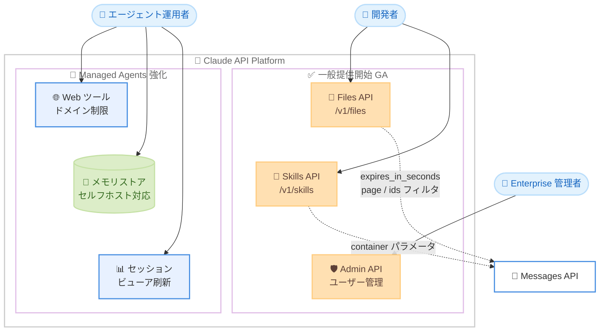
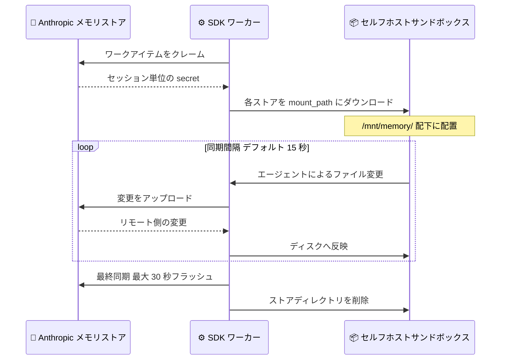

# Files API・Agent Skills・Admin API ユーザー管理が一般提供開始、Managed Agents も機能強化

## メタデータ

| 項目 | 内容 |
|------|------|
| 発表日 | 2026-08-19 |
| ソース | Claude Developer Platform Release Notes |
| カテゴリ | API アップデート / 一般提供 (GA) / Managed Agents |
| 公式リンク | https://platform.claude.com/docs/en/release-notes/overview |

## 概要

2026 年 8 月 19 日、Anthropic は Claude API の 3 つの主要機能を一般提供 (GA) に移行した。**Files API**、**Agent Skills と Skills API**、そして **Claude Enterprise 組織向け Admin API ユーザー管理エンドポイント**である。いずれもベータヘッダーが不要になり、本番環境での利用が正式にサポートされる。Files API の GA では、ファイル有効期限 (`expires_in_seconds` / `expires_at`)、カーソルベースのページネーション (`page` / `next_page`)、一覧取得時の `ids[]` フィルタが新たに追加された。

同日、Claude Managed Agents にも複数の機能強化が発表された。`web_search` / `web_fetch` ツールのドメイン制限 (`allowed_domains` / `blocked_domains`)、セルフホスト型サンドボックスでのメモリストア対応、Claude Console のセッションビューアの再設計である。

## 詳細

### 背景

Files API は 2025 年 4 月に `files-api-2025-04-14` ベータヘッダー付きで、Agent Skills は 2025 年 10 月に `skills-2025-10-02` ベータヘッダー付きで公開された。Claude Enterprise 向けのユーザー管理エンドポイントも `ce-user-management-2026-07-13` ベータヘッダーを必要としていた。今回の GA により、これらの機能はベータヘッダーなしで利用できる安定した API となり、エンタープライズでの本番採用に向けた基盤が整った。

### 主な変更点

#### 1. Files API の一般提供開始

`/v1/files` エンドポイントおよびアップロード済みファイルを参照する Messages API リクエストで、`files-api-2025-04-14` ベータヘッダーが不要になった。GA レスポンス形式では以下が追加されている。

- **ファイル有効期限**: アップロード時に `expires_in_seconds` を指定すると、ファイルが自動的に失効する。値は 3,600 秒 (1 時間) から 7,776,000 秒 (90 日) の整数。ファイルオブジェクトには RFC 3339 形式の `expires_at` タイムスタンプが含まれる (無期限の場合は `null`)。有効期限はアップロード時に一度だけ設定でき、後から変更できない
- **ページネーション**: 一覧取得はページ単位 (デフォルト 20 件、最大 1,000 件) で、レスポンスの `next_page` カーソルを次リクエストの `page` パラメータに渡してページ送りする。ファイルは新しい順に返される
- **`ids[]` フィルタ**: 最大 100 件のファイル ID をクエリパラメータとして渡し、既知のファイル群を 1 リクエストで確認できる。`ids[]` は常に単一ページを返し (`next_page` は `null`)、解決できない ID は `data` から黙って除外される。`page` や `limit` とは併用できない

なお、従来のベータヘッダーを送り続けるリクエストは、以前のレスポンス形式のまま動作し続ける。

失効したファイルは、コンテンツのダウンロードが 404 エラーになり、参照する Messages リクエストは推論前に失敗する。メタデータは失効後も最大 30 日間読み取り可能で、一覧にも表示されるため、`expires_at` と現在時刻を比較してフィルタリングする必要がある。

#### 2. Agent Skills と Skills API の一般提供開始

Agent Skills と Skills API (`/v1/skills`) が GA となり、`skills-2025-10-02` ベータヘッダーが不要になった。Messages API の `container` パラメータで Skills を読み込むリクエストも同様である。

Skills は、指示・メタデータ・オプションのリソース (スクリプト、テンプレート) をパッケージ化したモジュール型の機能拡張である。API では、事前構築済み Skills (`pptx`、`xlsx`、`docx`、`pdf`) の `skill_id` を指定するか、Skills API 経由で独自の Skills をアップロードして利用する。カスタム Skills はワークスペース全体で共有される。API 上の Skills は、ネットワークアクセスなし・実行時パッケージインストール不可のサンドボックス化されたコンテナで実行され、コード実行ツールが前提条件となる。

#### 3. Admin API ユーザー管理エンドポイントの一般提供開始

Claude Enterprise (claude.ai) 組織向けの Admin API ユーザー管理エンドポイント (メンバー、招待、グループ、カスタムロール) が GA となり、`anthropic-beta: ce-user-management-2026-07-13` ヘッダーが不要になった。このヘッダーを送り続けるリクエストも受け付けられ、同一の動作をする。

利用できるリソースは以下のとおり。

| リソース | 主なエンドポイント | 用途 |
|---------|------------------|------|
| メンバー | `GET/POST/DELETE /v1/organizations/users` | メンバー一覧、メールでの検索、ロール変更、削除 |
| 招待 | `GET/POST/DELETE /v1/organizations/invites` | 招待の送信、状態確認、取り下げ |
| グループ | `GET/POST/DELETE /v1/organizations/rbac_groups` | グループの作成、名前変更、削除 |
| グループメンバー | `GET/POST/DELETE /v1/organizations/rbac_groups/{group_id}/members` | グループメンバーの参照、追加、削除 |
| カスタムロール | `GET /v1/organizations/rbac_roles` | ロールと権限の参照 (読み取り専用) |

これらのエンドポイントには、`read:members` / `write:members` / `read:rbac_groups` / `write:rbac_groups` のスコープを持つ Admin API キーが必要である。API が割り当てられるロールは `user` と `managed` のみで、管理系ロール (`owner`、`membership_admin`、`primary_owner`) は claude.ai の組織設定で管理する。

#### 4. Managed Agents: Web ツールのドメイン制限

`agent_toolset_20260401` の `configs` 配列で、エージェントの `web_search` / `web_fetch` ツールが到達できるサイトを制限できるようになった。

- **`allowed_domains`**: ツールが到達できるホストをこのリストに限定する。同一エントリで `blocked_domains` と併用不可
- **`blocked_domains`**: ツールが到達できないホストを指定する
- **`max_content_tokens`** (`web_fetch` のみ): コンテキストに含める取得コンテンツ量の上限。正の整数
- **`user_location`** (`web_search` のみ): 検索結果のローカライズ。Messages API の `user_location` と同じフィールドを持つオブジェクト

各リストは 1 から 64 ドメインを保持でき、指定したドメインはそのホストとすべてのサブドメインをカバーする。実行時に許可されない URL への `web_fetch` 呼び出しは `url_not_allowed` エラーを返し、`web_search` は許可されない結果を除外する。環境の `networking` 設定はサンドボックス自身のアウトバウンド通信を制御するもので、Anthropic のサーバー上で動作する `web_search` / `web_fetch` には影響しない点に注意が必要である。

#### 5. Managed Agents: セルフホスト型サンドボックスのメモリストア対応

セルフホスト型サンドボックスで実行される Managed Agents セッションにメモリストアをアタッチできるようになった。SDK ワーカー (Python / TypeScript / Go) が各ストアを `mount_path` (`/mnt/memory/` 配下) にダウンロードし、変更をストアに同期する。

- ワーカーはツール呼び出し後、同期間隔 (デフォルト 15 秒、最小 5 秒) ごとにローカルとリモートを照合し、双方向に同期する
- 終了時には最終同期を実行し、保留中のアップロードを最大 30 秒フラッシュする
- Anthropic 側のストアが常に信頼できる情報源 (source of truth) であり、競合時はストア版がローカルを上書きする
- 1 セッションあたり最大 8 個のストアをアタッチ可能。`ant` CLI ワーカーは非対応で、SDK ワーカーが必須

#### 6. Claude Console: セッションビューアの再設計

Claude Console のセッションビューアが再設計された。以下の要素が追加されている。

- **タイムラインミニマップ**: セッション全体の流れを俯瞰できる
- **モデルリクエスト単位のトランスクリプト**: 会話履歴がモデルリクエストごとにグループ化される
- **Inspector パネル**: セッション詳細、コスト、生イベント、ツールごとの統計、マウントされたリソース、スレッドごとのアクティビティを確認できる

### 技術的な詳細

Files API のファイルは、アップロードした API キーのワークスペースにスコープされる。同一ワークスペース内のどの API キーからもアクセスできるため、エンドユーザーなど信頼できないソースから `file_id` を受け取ってはならない。マルチテナントアプリケーションでは、テナントごとに別のワークスペースを作成することが分離境界として推奨されている。

ストレージ制限は 1 ファイルあたり最大 500 MB、組織あたり合計 1 TB。Files API の操作 (アップロード、ダウンロード、一覧、メタデータ取得、削除) 自体は無料で、Messages リクエストで使用されるファイルコンテンツが入力トークンとして課金される。ファイル関連の API 呼び出しは毎分約 500 リクエストに制限される。

Admin API のページネーションは 2 方式が併存する。メンバーと招待の一覧は ID ベース (`before_id` / `after_id` と `first_id` / `last_id`) で、グループとカスタムロールの一覧は Files API の GA と同じ不透明カーソル方式 (`next_page` を `page` に渡す) を採用している。

## 開発者への影響

### 対象

- Files API をベータヘッダー付きで利用しているすべての開発者
- Agent Skills / Skills API を利用する開発者 (ドキュメント生成、カスタム Skills)
- Claude Enterprise 組織のメンバー管理を自動化する管理者・IT チーム
- Managed Agents でリサーチエージェントや自律エージェントを構築する開発者
- セルフホスト型サンドボックスで永続的なコンテキストが必要なエージェント運用者

### 必要なアクション

- **Files API 利用者**: `files-api-2025-04-14` ベータヘッダーを削除し、GA レスポンス形式 (特に `expires_at` フィールドと `next_page` ページネーション) に対応する。一時ファイルには `expires_in_seconds` を設定してストレージクォータを自動管理する
- **Skills 利用者**: `skills-2025-10-02` ベータヘッダーを削除する。`container` パラメータ経由の読み込みも同様
- **Enterprise 管理者**: `ce-user-management-2026-07-13` ヘッダーを削除する。オンボーディング / オフボーディングの自動化を本番導入できる
- **Managed Agents 利用者**: エージェントの Web ツールにドメイン制限を設定し、到達可能なサイトを業務上必要な範囲に限定することを検討する

### 移行ガイド (該当する場合)

3 つの GA はいずれも後方互換性が維持されている。従来のベータヘッダーを送り続けるリクエストは引き続き動作し、Files API の場合は以前のレスポンス形式が返される。移行はヘッダーの削除と、Files API の新しいレスポンスフィールド (`expires_at`、`next_page`) のハンドリング追加のみで完了する。

Managed Agents のドメイン制限では、`allowed_domains` と `blocked_domains` を同一エントリに設定できない点、ドメインはスキームやポートなしのプレーンなホスト名で記述する点 (`example.com` であり `https://example.com` ではない)、IP アドレスやワイルドカードは受け付けない点に注意する。形式違反はエージェントやセッションの作成・更新時に 400 エラーで拒否される。

## コード例

有効期限付きでファイルをアップロードし、Messages API で参照する例。ベータヘッダーは不要になった。

```bash
# 24 時間で失効するファイルをアップロード
FILE_ID=$(curl -X POST https://api.anthropic.com/v1/files \
  -H "x-api-key: $ANTHROPIC_API_KEY" \
  -H "anthropic-version: 2023-06-01" \
  -F "file=@/path/to/document.pdf" \
  -F "expires_in_seconds=86400" | jq -r '.id')

# アップロードしたファイルを Messages API で参照
curl -X POST https://api.anthropic.com/v1/messages \
  -H "x-api-key: $ANTHROPIC_API_KEY" \
  -H "anthropic-version: 2023-06-01" \
  -H "content-type: application/json" \
  -d '{
    "model": "claude-opus-5",
    "max_tokens": 1024,
    "messages": [
      {
        "role": "user",
        "content": [
          {"type": "text", "text": "このドキュメントを要約してください。"},
          {"type": "document", "source": {"type": "file", "file_id": "'"$FILE_ID"'"}}
        ]
      }
    ]
  }'
```

Managed Agents で Web ツールのドメイン制限を設定するツールセットの例。

```json
{
  "type": "agent_toolset_20260401",
  "configs": [
    {
      "type": "web_search",
      "name": "web_search",
      "allowed_domains": ["docs.example.com", "arxiv.org"],
      "user_location": {
        "type": "approximate",
        "country": "US",
        "timezone": "America/Los_Angeles"
      }
    },
    {
      "type": "web_fetch",
      "name": "web_fetch",
      "blocked_domains": ["ads.example.com"],
      "max_content_tokens": 50000
    }
  ]
}
```

## アーキテクチャ図 (該当する場合)

今回 GA となった 3 つの API と Managed Agents 強化点の全体像。



セルフホスト型サンドボックスでのメモリストア同期フロー。



## 関連リンク

- [Claude Developer Platform Release Notes](https://platform.claude.com/docs/en/release-notes/overview)
- [Files API ドキュメント](https://platform.claude.com/docs/en/build-with-claude/files)
- [Agent Skills 概要](https://platform.claude.com/docs/en/agents-and-tools/agent-skills/overview)
- [User Management (Admin API)](https://platform.claude.com/docs/en/manage-claude/user-management)
- [Managed Agents: Tools (ドメイン制限)](https://platform.claude.com/docs/en/managed-agents/tools#restrict-web-search-and-web-fetch-domains)
- [Managed Agents: Self-hosted Sandboxes (メモリストア)](https://platform.claude.com/docs/en/managed-agents/self-hosted-sandboxes#use-memory-stores)

## まとめ

今回のリリースは、2025 年から段階的にベータ提供されてきた Files API、Agent Skills、Enterprise ユーザー管理という 3 つの主要機能が同時に GA へ到達した節目である。ベータヘッダーの削除という最小限の移行コストで本番利用への正式な保証が得られ、Files API の有効期限や `ids[]` フィルタなど運用に直結する改善も加わった。Managed Agents のドメイン制限とセルフホスト環境でのメモリストア対応は、エンタープライズがセキュリティ境界を維持しながら自律エージェントを運用するための実用的な制御手段を提供する。エージェント基盤の本番採用を検討するチームにとって、導入判断を後押しするアップデートといえる。
