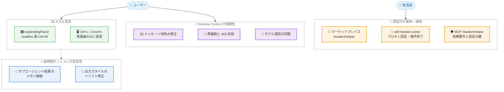

# Claude Code v2.1.238 リリース — keybindingFlavor 設定の追加、プラグインマーケットプレイスの headersHelper 対応、長時間セッションのメモリ増加修正と Remote Control の大規模な安定化

## メタデータ

| 項目 | 内容 |
|------|------|
| 発表日 | 2026-08-20 |
| ソース | Claude Code Changelog |
| カテゴリ | Claude Code アップデート |
| 公式リンク | https://github.com/anthropics/claude-code/blob/main/CHANGELOG.md |

## 概要

Claude Code v2.1.238 (2026 年 8 月 20 日、npm レジストリ基準) がリリースされた。`keybindingFlavor` 設定の追加、プラグインマーケットプレイスの `headersHelper` 対応、self-hosted runner の運用オプション拡充に加え、長時間セッションでのメモリ増加や出力スタイルのドリフトといった重要な修正、Remote Control 関連の大規模な安定化など、全 40 項目におよぶ変更を含むリリースである。

主要テーマは 4 つある。第一に、**入力と設定の柔軟性向上**。新しい `keybindingFlavor` 設定を `"readline"` にすると、プロンプト内の Ctrl+W が Bash と同様に直前の空白まで削除する挙動になる。第二に、**認証が必要な配布 / 通信経路への対応**。プラグインマーケットプレイスの `headersHelper` により、短命トークンなどの HTTP ヘッダーを発行するコマンドを指定してカタログやアーカイブの取得に利用できるようになった。また、`claude self-hosted-runner` には SIGTERM 後の猶予付きシャットダウン (`--defer-shutdown-max-min`) と、接続ごとに `Proxy-Authorization` ヘッダーを発行する egress プロキシ対応 (`--proxy-authorization-command` / `--proxy-authorization-file`) が追加された。第三に、**長時間セッションの安定性**。サブエージェントのツール結果が表示ウィンドウを離れた時点で解放されるようになり、長時間の対話セッションで発生していた際限のないメモリ増加が修正された。カスタム / プロジェクト / プラグインの出力スタイルがセッション途中でデフォルトの口調に戻ってしまう問題も解消されている。第四に、**Remote Control とクロスセッションメッセージングの信頼性向上**。途中送信メッセージの消失、モデル選択の非反映、ネットワーク断による「login expired」切断など、10 件を超える修正が含まれる。

このほか、macOS での起動高速化、自動更新チェックの遅延実行による起動時の応答性改善、MCP の `headersHelper` に対する信頼ダイアログ要件と認証情報環境変数の分離といったセキュリティ強化も含まれる。

## 詳細

### 背景

Claude Code のプロンプト入力欄では、Ctrl+W の単語削除の挙動が Bash の readline と異なることがシェルユーザーから指摘されていた。v2.1.238 では `keybindingFlavor` 設定によりこの挙動を選択できるようになった。

配布と通信の面では、社内マーケットプレイスやエンタープライズ環境で、認証付きのカタログ取得や egress プロキシ経由の通信を必要とするケースが増えており、プラグインマーケットプレイスの `headersHelper` と self-hosted runner のプロキシ認証オプションはこうしたニーズに応えるものである。同時に、外部コマンドを実行する `headersHelper` の仕組みには信頼確認や認証情報の分離といったガードレールが導入された。

また、Remote Control (Web / Desktop / モバイルからのセッション操作) の利用が広がる中で、接続断やメッセージ消失などの信頼性の問題が多数報告されており、本バージョンで集中的に修正された。

### 主な変更点

#### 新機能 (Added)

1. **`keybindingFlavor` 設定の追加**: `"readline"` に設定すると、プロンプト内の Ctrl+W が Bash と同様に直前の空白まで削除するようになる。デフォルト (`"classic"`) の挙動は変更なし

2. **プラグインマーケットプレイスの `headersHelper`**: URL マーケットプレイスまたはカタログエントリに `headersHelper` を指定すると、カタログおよび同一オリジンのアーカイブ取得時に HTTP ヘッダー (短命トークンなど) を発行するコマンドが実行される

3. **カタログエントリの `headersHelper` の実行確認**: カタログエントリの `headersHelper` は、該当プラグインのインストールまたは更新時にのみ、コマンド内容の表示後に実行される。`claude plugin install/update` は `[y/N]` の確認を求める (`-y` で省略可能)

4. **`claude self-hosted-runner --defer-shutdown-max-min <minutes>`**: SIGTERM 受信後もアタッチ中のセッションへの応答を継続し、指定した分数の経過後に残りをパーク (退避) して終了する

5. **`claude self-hosted-runner --proxy-authorization-command` / `--proxy-authorization-file`**: 接続のたびに新しく発行された `Proxy-Authorization` ヘッダーを要求する egress プロキシに対応

#### 修正 (Fixed) — セッションと安定性

6. **長時間セッションのメモリ増加修正**: 長時間の対話セッションでの際限のないメモリ増加を修正。サブエージェントのツール結果が、直近の表示ウィンドウを離れた時点で解放されるようになった

7. **出力スタイルのドリフト修正**: カスタム、プロジェクト、プラグインの出力スタイルが、セッション途中でデフォルトの口調に戻ってしまう問題を修正

8. **プロンプト提案の維持**: `CLAUDE_CODE_ENABLE_PROMPT_SUGGESTION=true` を設定していても、アカウントが使用量上限に近い (超過していない) 場合にプロンプト提案が無効になる問題を修正

9. **worktree 分離時の Bash 拒否メッセージ修正**: リダイレクトを含まないコマンドに対して、リダイレクトの削除を求める誤ったメッセージが表示される問題を修正

10. **self-hosted runner の誤削除修正**: 1 回のポーリング要求の遅延や喪失だけでサーバーから runner が削除され、正常なセッションが別の runner に引き渡されてしまう問題を修正

11. **一時ファイルの残留修正**: Bash コマンドが強制終了、タイムアウト、中断された際に `/tmp/claude-*-cwd` ファイルが残る問題を修正

12. **Backspace 長押しの取りこぼし修正**: Backspace として Ctrl+H を送信するターミナルで、キー入力が大きなバーストで届く場合 (低速な SSH / mosh 接続) に長押しが無視される問題を修正

13. **サスペンド中のセッション終了時の端末状態修正**: サスペンド中 (Ctrl+Z) のセッションを強制終了した際に、ターミナルが bracketed-paste モードのまま、カーソルが非表示のまま残ることがある問題を修正

#### 修正 (Fixed) — UI と権限

14. **MCP elicitation ダイアログの修正**: 4,096 文字を超える URL で何も表示されない問題を修正。また、プロジェクトパスがターミナル幅に収まらない場合に権限プロンプトから「don't ask again」オプションが消える問題も修正

15. **権限プロンプトの diff 折り返し修正**: 絵文字などの複数コードポイントからなる全角文字やタブを含む行が途中で切り取られる問題を修正

16. **キャッシュミス警告の抑制**: プロンプトキャッシュがすでに期限切れの場合に、`/model` と `/effort` のキャッシュミス警告が表示されないようになった

#### 修正 (Fixed) — MCP

17. **stdio MCP サーバーの初期化順序修正**: `initialize` の前に `server/discover` リクエストが送られ、遅延起動型のサーバーがセッションを開くたびにバックエンドを起動させられる問題を修正

18. **プロキシ拒否エラーの明確化**: プロキシによる接続拒否が、一般的なネットワークエラーではなくプロキシ名を含めて報告されるようになった

#### 修正 (Fixed) — Remote Control とクロスセッションメッセージング

19. **タスクごとの Stop 修正**: Remote Control のタスクパネルからのタスクごとの Stop が、CLI ホストのセッションで機能しない問題を修正

20. **不正ロールメッセージによる終了の修正**: クライアントが有効な role を持たないユーザーメッセージを送った際に、リモートセッションが終了してしまう問題を修正

21. **環境変数の継承修正**: `claude remote-control` で開始した Remote Control セッションが、起動元シェルのセッションスコープ環境変数を継承してしまう問題を修正

22. **クラッシュしたセッションの再利用**: プロセスがクラッシュした Remote Control セッションが `claude remote-control` の再起動まで利用不能のままになる問題を修正。次にメッセージを送った時点で再利用できるようになった

23. **ターン中に送信したメッセージの消失修正**: Claude の応答中に Web や Desktop から送信した Remote Control メッセージが、ターン終了後にトランスクリプトから消える問題を修正

24. **モデル選択の反映修正**: スマートフォンや Web で行った Remote Control のモデル選択が、ターミナルに表示されるモデルに反映されない問題を修正

25. **「login expired」切断の修正**: サインインの更新が短時間のネットワーク不調で遅延した際に「login expired」で切断される問題を修正。再試行して接続を維持するようになった

26. **サインアウト時の表示修正**: サインアウト時に再接続失敗として報告される問題を修正。明確なメッセージとともにセッションが終了するようになった

27. **`ListAgents` / `SendMessage` の接続認識修正**: `claude remote-control` (サーバーモード) や Desktop / IDE ホストで実行中のセッションで「Remote Control is not connected」と報告される問題を修正。Remote Control ピアの列挙と到達が可能になった

28. **事前ウォームアップワーカーの非表示化**: エージェントビューが次のバックグラウンドセッション用に事前起動するアイドルワーカーが `ListAgents` / `SendMessage` に露出する問題を修正。タスクが確保した時点でのみ表示されるようになった

29. **受信拒否の明示化**: 受信を拒否する設定 (`crossSessionInbound: "refuse"` など) のセッションへの送信が、暗黙の成功ではなく「refused」として送信側に報告されるようになった

30. **受信箱でのメッセージ破棄の通知**: レート制限や受信キューの満杯によりメッセージが破棄された場合、黙って消える代わりに送信側のセッションに通知されるようになった

#### 改善 (Improved)

31. **macOS での起動高速化**: 引数なしの `claude` の起動が macOS で速くなった

32. **zsh 固有構文の権限チェック改善**: シェル条件式内の zsh 固有構文に対する Bash ツールの権限チェックが改善された

33. **Remote Control の接続耐性向上**: ネットワークエッジ、VPN、プロキシからの短時間の HTTP 403 拒否を最大 3 分間許容し、ブロックが継続する場合は拒否元の名前を表示するようになった

34. **自動更新チェックの遅延実行**: 自動更新チェックが起動と CPU を奪い合う代わりに、起動の約 10 秒後に実行されるようになった

35. **バンドル `claude-api` スキルの更新**: Managed Agents の 8 月 19 日リリース (Web 検索 / フェッチのドメイン設定、self-hosted サンドボックスのメモリストア) に対応

#### 変更 (Changed)

36. **フルスクリーンの Ctrl+L / Cmd+K の挙動変更**: 常に再描画のみを行うようになり、二度押しによる `/clear` ショートカットは削除された。1 行の nvim ターミナルで自動的な `/clear` ループが発生することもなくなった

37. **無効化された MCP サーバーの表示変更**: `claude mcp list` と `claude mcp get` が、無効化されたサーバーに接続してヘルスチェックする代わりに `⊘ Disabled` と表示するようになった

38. **MCP `headersHelper` の信頼要件**: プロジェクトの `.mcp.json` 内の `headersHelper`、およびプロジェクトや `--add-dir` のエージェントファイル内のインライン MCP サーバーは、該当フォルダーの信頼ダイアログの承認が必要になった (`claude -p` 実行時も同様)

39. **MCP `headersHelper` の認証情報分離**: プロジェクトの `.mcp.json`、プラグイン、エージェントファイル由来の `headersHelper` は、継承された認証情報環境変数なしで実行されるようになった。ユーザー、managed、claude.ai スコープのヘルパーは Claude 設定ディレクトリから実行される

### 技術的な詳細

#### keybindingFlavor 設定

`keybindingFlavor` 設定を `"readline"` にすると、プロンプト入力欄の Ctrl+W が Bash の readline と同じく「直前の空白まで削除」する挙動になる。デフォルトは `"classic"` で、従来の挙動から変更はない。シェル操作に慣れたユーザーが、ターミナルと Claude Code の間でキー操作の一貫性を保てるようになる。

#### プラグインマーケットプレイスの headersHelper

URL マーケットプレイスまたはカタログエントリに `headersHelper` を指定すると、カタログおよび同一オリジンのアーカイブ取得の際に、HTTP ヘッダーを発行するコマンドが実行される。短命トークンを都度発行する社内認証基盤との連携が典型的なユースケースである。

セキュリティ面のガードレールとして、カタログエントリの `headersHelper` は該当プラグインのインストールまたは更新時にのみ実行され、実行前にコマンド内容が表示される。`claude plugin install` / `claude plugin update` は `[y/N]` の確認を求める (CI などでは `-y` で省略可能)。

あわせて MCP 側の `headersHelper` にも制限が導入された。プロジェクトの `.mcp.json` やエージェントファイル内のヘルパーはフォルダーの信頼ダイアログの承認が前提となり、継承された認証情報環境変数なしで実行される。リポジトリ内のファイル経由で任意コマンドが認証情報にアクセスする経路が閉じられた形である。

#### self-hosted runner の運用オプション

self-hosted runner に 2 つの運用オプションが追加された。

- **`--defer-shutdown-max-min <minutes>`**: SIGTERM を受信しても即座に終了せず、アタッチ中のセッションへの応答を継続する。指定した分数が経過した時点で残りのセッションをパークして終了するため、ローリングアップデートやスケールインの際にユーザーのセッションを中断させずに済む
- **`--proxy-authorization-command` / `--proxy-authorization-file`**: 接続ごとに新しい `Proxy-Authorization` ヘッダーの発行を要求する egress プロキシに対応する。コマンド実行またはファイル参照でヘッダー値を供給できる

また、1 回のポーリング要求の遅延や喪失だけで runner がサーバーから削除され、正常なセッションが別の runner に引き渡されてしまう問題も修正され、ネットワークが不安定な環境での運用信頼性が向上した。

#### 長時間セッションのメモリ管理

長時間の対話セッションで、サブエージェントのツール結果が解放されずにメモリが際限なく増加する問題が修正された。ツール結果は直近の表示ウィンドウを離れた時点で解放されるようになった。サブエージェントを多用する長時間のセッションほど効果が大きい。

あわせて、カスタム / プロジェクト / プラグインの出力スタイルがセッション途中でデフォルトの口調に戻る「ドリフト」も修正され、長時間セッションでの一貫性が改善された。

#### Remote Control の安定化

Remote Control 関連では、メッセージの消失 (ターン中の送信がトランスクリプトから消える、受信箱での破棄が通知されない)、接続の信頼性 (ネットワーク不調による「login expired」切断、短時間の HTTP 403 の許容)、状態の同期 (モバイル / Web でのモデル選択がターミナルに反映されない)、セッションのライフサイクル (クラッシュしたセッションの再利用、サインアウト時の明確な終了) など、広範囲の修正が入った。Web / Desktop / モバイルから CLI セッションを操作するワークフローの実用性が大きく向上している。

## アーキテクチャ図



## 開発者への影響

### 対象

- **シェル操作に慣れたユーザー**: `keybindingFlavor` を `"readline"` に設定すると、Ctrl+W が Bash と同じ「直前の空白まで削除」の挙動になる
- **社内プラグインマーケットプレイスの運用者**: `headersHelper` により、短命トークンなどの認証ヘッダーを必要とするカタログ / アーカイブ配布に対応できる
- **self-hosted runner の運用者**: `--defer-shutdown-max-min` による猶予付きシャットダウンと、`--proxy-authorization-command` / `--proxy-authorization-file` による egress プロキシ認証に対応できる。ポーリング遅延による runner の誤削除も修正された
- **長時間セッションやサブエージェントの利用者**: メモリの際限のない増加が修正され、長時間の作業でも安定して動作する
- **カスタム出力スタイルの利用者**: セッション途中でデフォルトの口調に戻るドリフトが修正された
- **Remote Control (Web / Desktop / モバイル) の利用者**: メッセージ消失、モデル選択の非反映、ネットワーク不調による切断など多数の問題が修正され、実用性が大きく向上した
- **クロスセッションメッセージングの利用者**: 受信拒否やレート制限による破棄が送信側に明示されるようになり、メッセージが黙って消えることがなくなった
- **MCP サーバーの利用者**: stdio サーバーの初期化順序が修正され、遅延起動型サーバーの不要なバックエンド起動がなくなった。無効化したサーバーは `claude mcp list` でヘルスチェックなしに `⊘ Disabled` と表示される
- **プロジェクトに `.mcp.json` を持つチーム**: `headersHelper` の実行にフォルダーの信頼ダイアログの承認が必要になり、認証情報環境変数が継承されなくなった。ヘルパーが環境変数の認証情報に依存している場合は動作の確認が必要
- **低速な SSH / mosh 接続の利用者**: Backspace 長押しの取りこぼしが修正された

### 必要なアクション

以下のコマンドで最新バージョンに更新できる。

```bash
# npm でのアップデート
npm update -g @anthropic-ai/claude-code

# Homebrew でのアップデート
brew upgrade claude-code

# 現在のバージョン確認
claude --version
```

**推奨される確認事項:**

- **フルスクリーンで Ctrl+L / Cmd+K の二度押しによる `/clear` を利用していた場合**: このショートカットは削除されたため、`/clear` コマンドを直接実行する運用に切り替える
- **プロジェクトの `.mcp.json` で `headersHelper` を利用している場合**: フォルダーの信頼ダイアログの承認が前提となり、認証情報環境変数が継承されなくなったため、ヘルパーの動作を確認する
- **クロスセッションメッセージングを利用している場合**: 受信拒否や破棄が「refused」などのエラーとして返るようになったため、暗黙の成功を前提としたロジックがあれば見直す

### 移行ガイド (該当する場合)

**MCP `headersHelper` の実行環境変更:**

プロジェクトの `.mcp.json`、プラグイン、エージェントファイル由来の `headersHelper` は、v2.1.238 以降、継承された認証情報環境変数なしで実行される。シェルの環境変数からトークンを読み取っていたヘルパーは動作しなくなる可能性があるため、ファイルや専用コマンドからの取得に切り替える必要がある。ユーザー、managed、claude.ai スコープのヘルパーは Claude 設定ディレクトリから実行される点にも注意する。

**フルスクリーンの Ctrl+L / Cmd+K:**

二度押しによる `/clear` ショートカットは削除され、常に再描画のみが行われる。会話のクリアには `/clear` コマンドを使用する。

## コード例

### keybindingFlavor の設定

```json
// settings.json
{
  "keybindingFlavor": "readline"
}
```

### プラグインマーケットプレイスの headersHelper

```json
// マーケットプレイス定義の例
{
  "name": "internal-marketplace",
  "url": "https://plugins.example.com/catalog.json",
  "headersHelper": "get-marketplace-token.sh"
}
```

```bash
# インストール時に headersHelper のコマンドが表示され、確認を求められる
claude plugin install my-plugin
# CI などで確認を省略する場合
claude plugin install my-plugin -y
```

### self-hosted runner の運用オプション

```bash
# SIGTERM 後 30 分間はアタッチ中のセッションへの応答を継続し、その後パークして終了
claude self-hosted-runner --defer-shutdown-max-min 30

# 接続ごとに Proxy-Authorization ヘッダーを発行する egress プロキシに対応
claude self-hosted-runner --proxy-authorization-command "get-proxy-token.sh"
claude self-hosted-runner --proxy-authorization-file /run/secrets/proxy-auth
```

## 関連リンク

- [Claude Code Changelog](https://github.com/anthropics/claude-code/blob/main/CHANGELOG.md)
- [Claude Code GitHub リポジトリ](https://github.com/anthropics/claude-code)
- [Claude Code ドキュメント](https://docs.anthropic.com/en/docs/claude-code)
- [Claude Code v2.1.236 / v2.1.237](./2026-08-19-claude-code-v2-1-236-v2-1-237.md)

## まとめ

Claude Code v2.1.238 は、全 40 項目という大規模なリリースであり、入力設定の柔軟性、エンタープライズ向けの認証対応、長時間セッションの安定性、Remote Control の信頼性という 4 つの軸で改善が行われた。特に以下の点が注目に値する。

第一に、**エンタープライズ環境への対応強化**。プラグインマーケットプレイスの `headersHelper` により認証付きの社内配布が可能になり、self-hosted runner には猶予付きシャットダウンと egress プロキシ認証が追加された。同時に、MCP の `headersHelper` には信頼ダイアログ要件と認証情報の分離が導入され、利便性とセキュリティの両面が強化された。

第二に、**長時間セッションの安定性**。サブエージェントのツール結果の解放によるメモリ増加の修正と、出力スタイルのドリフト修正により、長時間の作業でも一貫した動作が期待できるようになった。

第三に、**Remote Control の大規模な安定化**。メッセージ消失、モデル選択の非反映、ネットワーク不調による切断など 10 件を超える修正が入り、Web / Desktop / モバイルから CLI セッションを操作するワークフローの実用性が大きく向上した。

長時間セッションのメモリ増加は多くのユーザーに影響する問題であるため、サブエージェントを多用するユーザーや Remote Control の利用者には速やかなアップデートを推奨する。プロジェクトの `.mcp.json` で `headersHelper` を利用しているチームは、信頼要件と環境変数の分離による影響を事前に確認しておきたい。
