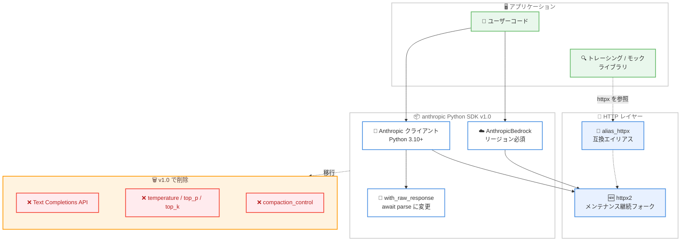

# Python SDK v1.0 リリース: httpx2 への移行と非推奨機能の削除を伴うメジャーアップデート

## メタデータ

| 項目 | 内容 |
|------|------|
| 発表日 | 2026-08-20 |
| ソース | Claude Developer Platform Release Notes |
| カテゴリ | SDK / メジャーリリース / 破壊的変更 |
| 公式リンク | https://platform.claude.com/docs/en/release-notes/overview |

## 概要

2026 年 8 月 20 日、Anthropic は Python SDK (`anthropic`) の v1.0 をリリースした。長らく 0.x 系で提供されてきた SDK の初のメジャーバージョンであり、複数の破壊的変更を含む。最大の変更点は HTTP レイヤーの `httpx` から `httpx2` (Pydantic チームがメンテナンスする API 互換フォーク) への移行である。あわせて、Python の最低バージョンが 3.10 に引き上げられ、レガシーの Text Completions API、Messages メソッドの `temperature` / `top_p` / `top_k` パラメータ、ツールランナーのクライアントサイド `compaction_control` など、長期間非推奨だった機能が削除された。

移行の詳細は公式の [v1 移行ガイド](https://github.com/anthropics/anthropic-sdk-python/blob/main/MIGRATION.md) にすべての変更点が移行前後のコードスニペット付きで記載されている。アップグレード後に pyright や mypy などの型チェッカーを実行すると、破壊的変更の大半を検出できる。

## 詳細

### 背景

Python SDK は 0.x 系のまま長期間運用されてきたが、その間に非推奨化された API サーフェス (Text Completions API、サンプリングパラメータの直接指定など) が蓄積していた。また、SDK が依存する HTTP ライブラリ `httpx` は活発なメンテナンスが行われなくなっており、Pydantic チームが API 互換フォークとして `httpx2` (https://httpx2.pydantic.dev) の保守を引き継いでいる。v1.0 は、これらの負債を一括で整理し、安定した基盤の上でセマンティックバージョニングを開始するためのメジャーリリースである。

### 主な変更点

#### 1. HTTP レイヤーの httpx から httpx2 への移行

SDK の HTTP レイヤーが `httpx` から `httpx2` に移行した。`httpx2` は API 互換フォークのため、`timeout=30.0` のようにプレーンな値を渡しているユーザーは変更不要である。一方、カスタムの `http_client`、`Timeout`、トランスポートオブジェクトを構築している場合は、`httpx2` からインポートする必要がある。

- 旧 `httpx.Client` を `http_client=` に渡すと、構築時に `TypeError` が発生する (サイレントに失敗しない設計)
- `DefaultHttpxClient` / `DefaultAioHttpClient` ヘルパーは変更なしでそのまま利用できる
- OpenTelemetry、Sentry、respx、pytest-httpx、vcrpy など `httpx` をパッチするトレーシング / モックライブラリに依存している場合は、アプリケーション起動時 (かつ `httpx` がインポートされる前) に `httpx2.alias_httpx()` を呼び出す
- `anthropic.Transport` / `anthropic.ProxiesTypes` などの再エクスポートは削除され、`httpx2.BaseTransport` / `httpx2.AsyncBaseTransport` / `httpx2.Proxy` を直接使用する
- `APIStatusError.response` などの戻り値は `httpx2` の型になるため、`isinstance` チェックと型注釈の更新が必要になる場合がある

#### 2. Python 3.10 以降が必須

サポートする Python の最低バージョンが 3.9 から 3.10 に引き上げられた。それ以外のランタイム要件は変わらず、Pydantic は v1 / v2 の両方が引き続きサポートされる。

#### 3. レガシー Text Completions API の削除

`client.completions.create()` (`/v1/complete` エンドポイント)、`Completion` / `CompletionCreateParams` 型、`anthropic.HUMAN_PROMPT` / `anthropic.AI_PROMPT` 定数が削除された。Messages API への移行が必要である。

#### 4. temperature / top_p / top_k パラメータの削除

`messages.create()`、`stream()`、`parse()`、beta 版の各メソッド、`tool_runner()`、バッチパラメータから `temperature` / `top_p` / `top_k` が削除され、渡すと `TypeError` になる。現行モデルはこれらのパラメータを無視するため実質的な影響はないが、これらを解釈する旧モデルを使う場合は `extra_body` 経由で渡せる。

#### 5. 非同期クライアントの .with_raw_response の変更

`.with_raw_response` の戻り値が `LegacyAPIResponse` から `APIResponse` / `AsyncAPIResponse` に変わった。

- 非同期クライアントでは `response.parse()` がコルーチンとなり、`await response.parse()` が必要
- `.text` と `.content` はメソッドになった (`response.text()` / `response.read()`)。`response.json()`、`iter_bytes()`、`iter_text()`、`iter_lines()` も直接利用できる
- `.headers`、`.status_code`、`.url`、`.request_id`、`.retries_taken`、`.elapsed` などのメタデータは従来どおり属性アクセスのまま

#### 6. AnthropicBedrock のリージョン必須化

`AnthropicBedrock` は、AWS リージョンが未設定の場合に警告を出して `us-east-1` にフォールバックする挙動を廃止し、構築時に `ValueError` を送出するようになった。リージョンは `aws_region=` 引数、`AWS_REGION` / `AWS_DEFAULT_REGION` 環境変数、`aws_profile` の boto3 セッション設定の順で解決される (プロファイルからのリージョン解決は v1.0 で新たにサポート)。

また、Bedrock ストリーミングで未知のイベント (既知の該当例は `amazon-bedrock-invocationMetrics` のみ) は yield されずスキップされるようになった。

#### 7. ツールランナーの compaction_control の削除

`tool_runner()` のクライアントサイド `compaction_control` が削除され、サーバーサイドのコンテキスト圧縮 (`betas=["compact-2026-01-12"]` と `context_management`) に置き換えられた。トリガーのしきい値は 50,000 トークン以上である必要がある。

### 技術的な詳細

上記以外にも、以下の変更が含まれる。

- **`messages.parse(stream=True)` の削除**: 元々機能していなかったパラメータであり、構造化出力のストリーミングには `messages.stream(..., output_format=Order)` ヘルパーを使用する
- **beta Messages の `output_format` (スキーマ辞書形式) の削除**: `beta.messages.create()` / `count_tokens()` / バッチパラメータでは `output_config={"format": {...}}` を使用する。`parse()` / `stream()` などのヘルパーの `output_format=` は型 (Pydantic モデルなど) のみを受け付け、スキーマ辞書は `TypeError` になる
- **低レベルメソッドの `body=`**: 常に JSON シリアライズされるようになり、生バイト列の送信には `content=` を使用する (ストリーミングアップロード用のイテレータも受け付ける)
- **ヘッダー処理**: `default_headers` / `extra_headers` / `with_options()` / `ANTHROPIC_CUSTOM_HEADERS` のエントリは大文字小文字を区別せずに同名ヘッダーを置換するようになった。`bytes` 型のヘッダー値はエラーになるため、事前に `.decode()` が必要
- **型エイリアスの削除**: `BetaBase64PDFBlockParam` → `BetaRequestDocumentBlockParam`、`agent_toolset.READ_MAX_BYTES` → `agent_toolset.DEFAULT_MAX_FILE_BYTES` など
- **ストリームの型判定**: `isinstance(x, Stream)` はメッセージストリームにマッチしなくなった。`anthropic.lib.streaming` の `MessageStream` に対して判定する

## 開発者への影響

### 対象

- Python SDK (`anthropic` パッケージ) を利用するすべての開発者
- カスタム `http_client` / `Timeout` / トランスポートを構築している開発者
- `httpx` をパッチするトレーシング / モック / テストライブラリを併用している開発者
- Amazon Bedrock 経由で `AnthropicBedrock` クライアントを利用する開発者
- レガシー Text Completions API や `temperature` などの旧パラメータを使い続けているコードベースの保守者

### 必要なアクション

破壊的変更を影響度別に整理すると以下のとおり。

| 変更点 | 影響を受けるケース | 対応 |
|--------|------------------|------|
| Python 3.10+ 必須 | Python 3.9 環境 | ランタイムを 3.10 以降に更新 |
| httpx → httpx2 | カスタム HTTP クライアント / トランスポート | `import httpx2 as httpx` に置換。パッチ系ライブラリ併用時は起動時に `httpx2.alias_httpx()` を呼ぶ |
| Text Completions API 削除 | `client.completions.create()` 利用コード | Messages API に移行 |
| `temperature` / `top_p` / `top_k` 削除 | Messages メソッドで直接指定しているコード | 削除するか、旧モデル利用時は `extra_body` で指定 |
| `.with_raw_response` の変更 | 非同期クライアントで `response.parse()` を呼ぶコード | `await response.parse()` に変更。`.text` / `.content` はメソッド呼び出しに変更 |
| Bedrock リージョン必須化 | リージョン未設定で `us-east-1` に暗黙依存 | `aws_region=` または環境変数で明示的に設定 |
| `compaction_control` 削除 | ツールランナーでクライアントサイド圧縮を利用 | サーバーサイド圧縮 (`context_management`) に移行 |

### 移行ガイド (該当する場合)

アップグレードは以下のコマンドで行う。

```sh
pip install --upgrade "anthropic>=1,<2"
```

移行のポイントは以下のとおり。

1. [公式移行ガイド (MIGRATION.md)](https://github.com/anthropics/anthropic-sdk-python/blob/main/MIGRATION.md) にすべての変更が移行前後のスニペット付きで記載されている
2. Claude Code ユーザーは `/claude-api upgrade python` で自動移行を実行できる
3. アップグレード後に pyright / mypy などの型チェッカーを実行すると、破壊的変更の大半が検出される
4. `httpx2.alias_httpx()` はアプリケーションだけが呼び出すべきで、ライブラリからは呼ばない。`httpx` がすでにインポート済みの場合は `RuntimeError` になるため、エントリポイントの先頭で呼ぶ (pytest では早期ロードされるプラグインとして登録する)

## コード例

カスタム HTTP クライアントの移行例。

```python
# 移行前 (v0.x)
import httpx
from anthropic import Anthropic, DefaultHttpxClient

client = Anthropic(
    timeout=httpx.Timeout(60.0, connect=5.0),
    http_client=DefaultHttpxClient(
        proxy="http://my.proxy.example",
        transport=httpx.HTTPTransport(local_address="0.0.0.0"),
    ),
)

# 移行後 (v1.0): インポートを差し替えるだけで残りは同一
import httpx2 as httpx
from anthropic import Anthropic, DefaultHttpxClient

client = Anthropic(
    timeout=httpx.Timeout(60.0, connect=5.0),
    http_client=DefaultHttpxClient(
        proxy="http://my.proxy.example",
        transport=httpx.HTTPTransport(local_address="0.0.0.0"),
    ),
)
```

`httpx` をパッチするライブラリ (トレーシング、モック) を利用する場合のエイリアス設定。

```python
# アプリケーションの起動時、httpx がインポートされる前に実行する
import httpx2

httpx2.alias_httpx()

import httpx  # 以降、httpx は httpx2 モジュールを指す
assert httpx.Client is httpx2.Client
```

非同期クライアントの `.with_raw_response` の移行例。

```python
# 移行前 (v0.x)
response = await client.messages.with_raw_response.create(...)
message = response.parse()

# 移行後 (v1.0)
response = await client.messages.with_raw_response.create(...)
print(response.headers["request-id"])  # メタデータは従来どおり属性アクセス
message = await response.parse()
```

`AnthropicBedrock` のリージョン指定と、旧モデル向けの `temperature` 指定の例。

```python
from anthropic import AnthropicBedrock

# v1.0 ではリージョンの明示的な設定が必須
client = AnthropicBedrock(aws_region="us-east-1")

# temperature などを解釈する旧モデルでは extra_body で指定
message = client.messages.create(
    model="claude-sonnet-4-6",
    max_tokens=1024,
    messages=[{"role": "user", "content": "こんにちは"}],
    extra_body={"temperature": 0.2},
)
```

ツールランナーのコンテキスト圧縮のサーバーサイド移行例。

```python
# 移行前 (v0.x): クライアントサイドの compaction_control
runner = client.beta.messages.tool_runner(
    ...,
    compaction_control={"enabled": True, "context_token_threshold": 100_000},
)

# 移行後 (v1.0): サーバーサイドのコンテキスト圧縮
runner = client.beta.messages.tool_runner(
    ...,
    betas=["compact-2026-01-12"],
    context_management={
        "edits": [
            {
                "type": "compact_20260112",
                "trigger": {"type": "input_tokens", "value": 100_000},
            }
        ]
    },
)
```

## アーキテクチャ図 (該当する場合)

v1.0 における SDK の構成変更の全体像。



## 関連リンク

- [Claude Developer Platform Release Notes](https://platform.claude.com/docs/en/release-notes/overview)
- [Python SDK v1 移行ガイド (MIGRATION.md)](https://github.com/anthropics/anthropic-sdk-python/blob/main/MIGRATION.md)
- [Python SDK ドキュメント](https://platform.claude.com/docs/en/cli-sdks-libraries/sdks/python)
- [anthropic-sdk-python リポジトリ](https://github.com/anthropics/anthropic-sdk-python)
- [httpx2 公式サイト](https://httpx2.pydantic.dev)

## まとめ

Python SDK v1.0 は、新機能の追加ではなく基盤の刷新と負債の整理に焦点を当てたメジャーリリースである。メンテナンスが継続される `httpx2` への移行により HTTP レイヤーの持続性が確保され、Text Completions API や旧サンプリングパラメータなどの非推奨サーフェスの削除により API が簡潔になった。多くのユーザーにとって移行コストは小さいが、カスタム HTTP クライアント、非同期の `.with_raw_response`、リージョン未設定の Bedrock クライアントを使っているコードは修正が必須となる。型チェッカーで大半の破壊的変更を検出できるため、公式移行ガイドを参照しながら計画的にアップグレードすることを推奨する。
