# Claude Code v2.1.239 リリース — Bedrock ストリーミング課金 2 倍問題の修正、Python SDK 1.x 移行コマンド `/claude-api upgrade` の追加、Windows クロスセッションメッセージング対応

## メタデータ

| 項目 | 内容 |
|------|------|
| 発表日 | 2026-08-21 (npm 公開: 2026-08-21 17:18 UTC) |
| ソース | Claude Code Changelog |
| カテゴリ | Claude Code アップデート |
| 公式リンク | https://github.com/anthropics/claude-code/blob/main/CHANGELOG.md |

## 概要

Claude Code v2.1.239 (2026 年 8 月 21 日、npm レジストリ基準) がリリースされた。約 60 項目におよぶ大規模なリリースであり、コスト・課金に関する重要な修正、Python SDK の移行支援、クロスプラットフォーム対応の拡充、セッション管理と UI の多数の修正を含む。

主要テーマは 4 つある。第一に、**コストと課金の正確性**。プロキシが応答の Content-Type ヘッダーを除去する環境での Bedrock ストリーミングにおいて、全ターンが非ストリーミングで再実行され、課金対象の API 呼び出しが静かに 2 倍になっていた問題が修正された。あわせて、コスト見積もり (`/cost`、ステータスライン、`--max-budget-usd`) がデータレジデンシーワークスペースの米国内推論プレミアム 1.1 倍を含むようになり、見積もりと実際の請求の乖離が解消された。第二に、**Python SDK 1.x への移行支援**。新コマンド `/claude-api upgrade` により、Python プロジェクトを `anthropic` パッケージの 0.x から 1.x へ移行できるようになった。第三に、**クロスプラットフォーム対応の拡充**。Windows でクロスセッションメッセージング (`SendMessage` / `ListAgents`) が利用可能になり、Alpine/musl ビルドではネイティブの画像貼り付け・クリップボード・音声キャプチャのアドオンが読み込めるようになった。Bedrock、Vertex、Foundry などの環境にもフルスクリーンレンダラーの初回提案が拡大された。第四に、**セッションと操作の信頼性**。Esc キー押下時のレースコンディション、WebFetch のメモリ保持、`/resume` 関連の複数の問題、OpenTelemetry トレース断片化など、広範囲の修正が入った。

## 詳細

### 背景

Claude Code は Anthropic API に加えて Amazon Bedrock、Google Vertex AI、Microsoft Foundry といったクラウドプロバイダー経由でも利用されており、エンタープライズ環境ではプロキシを経由した通信が一般的である。プロキシが応答ヘッダーを書き換える構成では、ストリーミングの判定に失敗して非ストリーミングでの再実行が発生し、ユーザーが気付かないまま課金が倍増するという深刻な問題が存在していた。v2.1.239 ではこの修正に加え、HTTPS プロキシと Bedrock SSO プロファイルの組み合わせでの起動時ハングも解消され、プロキシ環境での Bedrock 利用の信頼性が大きく向上した。

また、Anthropic の Python SDK (`anthropic` パッケージ) はメジャーバージョン 1.x への移行期にあり、既存の 0.x ベースのプロジェクトを移行するための支援が求められていた。`/claude-api upgrade` コマンドはこのニーズに応えるものである。

クロスセッションメッセージングは、これまで macOS / Linux のみで利用可能であり、Windows ユーザーはマルチセッション連携の機能を利用できなかった。本バージョンでプラットフォーム間の機能差が解消された。

### 主な変更点

#### 新機能 (Added)

1. **フルスクリーンレンダラーの対象環境拡大**: Bedrock、Vertex、Foundry などこれまで対象外だった環境で、フルスクリーンレンダラーの初回提案が表示されるようになった。これらの環境での新規インストールはフルスクリーンで開始される

2. **`/claude-api upgrade` コマンドの追加**: Python プロジェクトを `anthropic` パッケージの 0.x から 1.x へ移行するコマンドが追加された。バンドルされている `claude-api` スキルの Python リファレンスも 1.x に更新されている (タイムアウトには `httpx.Timeout` ではなく `anthropic.Timeout` を使用)

3. **Alpine/musl ビルドのネイティブアドオン対応**: ネイティブの画像貼り付け、クリップボード、音声キャプチャのアドオンが読み込み可能になった。ランタイムに拒否されていた glibc ビルドのバイナリに代わり、musl ビルドのバイナリが使用される

#### 変更 (Changed)

4. **コスト見積もりへの米国内推論プレミアムの反映**: `/cost`、ステータスライン、`--max-budget-usd` のコスト見積もりが、データレジデンシーワークスペースの米国内推論プレミアム 1.1 倍を含むようになった

5. **クラウドセッションの同期プラグイン表示**: claude.ai から同期されたプラグインは `name@synced` と表示され、`claude plugin enable/disable <name>@synced` で操作できる。ユーザーがインストールした同名のプラグインを上書きすることはない

6. **使用量上限メッセージの改善**: 月間支出上限に到達した際のメッセージに、セッションおよび週次リミットのリセット時刻も表示されるようになった

7. **`/goal` のチェックインのバックオフ**: 長時間のバックグラウンド作業に対する繰り返しのチェックインが、30 分ごとの固定間隔から、30 分 → 1 時間 → 2 時間ごとへとバックオフするようになった

8. **`/goal` のゴール復元**: `claude --resume` ピッカーからセッションを再開すると、アクティブなゴールが復元されるようになった

9. **`ListAgents` の自己認識**: `ListAgents` がセッション自身の名前 (ピアがメッセージ送信に使う名前) を通知するようになった。自分自身への `SendMessage` は「no agent named …」ではなくその旨を返す

10. **ライブのチームメイト表示**: `ListAgents` と `/list-agents` にライブのチームメイトが一覧表示されるようになった (従来はサブエージェントと他セッションのみが表示され、到達可能なチームメイトが不在に見えていた)

11. **`keybindingFlavor: "readline"` の単語キー対応**: Alt+F と Ctrl/Option+→ が単語の末尾で停止し、Alt+D は単語末尾まで削除する (Ctrl+Y で貼り戻し可能)。句読点が単語の区切りとして扱われ、Bash の挙動により近づいた

12. **持続リトライモードの即時失敗**: `CLAUDE_CODE_RETRY_WATCHDOG` が、組織の支出上限エラーとクレジット切れエラーに対して、リセットを無期限に待機する代わりに即座に失敗するようになった

13. **Windows でのクロスセッションメッセージング対応**: macOS / Linux と同様に、Windows でも複数マシンにまたがる Claude Code セッションが `SendMessage` で相互にメッセージを送信し、`ListAgents` で相互に発見できるようになった

14. **Claude in Chrome のタブグループ管理**: `/clear` がセッションの Chrome タブグループを閉じるようになり、空のグループは `/resume` 時と Claude Code の終了時に閉じられる

15. **モバイルからの画像アップロードのパス通知**: リモートセッションで、モバイルからアップロードした画像に保存先のファイルパスが含まれるようになり、Claude が作成するファイルへ画像をコピーできるようになった

16. **Web 版のネットワークプロキシ適用範囲拡大**: Claude Code on the web で、Bash などのツールから API 以外の anthropic.com ホスト (www、docs など) への要求もセッションのネットワークプロキシを経由するようになり、環境の許可ドメイン設定が適用される

17. **コンパクション後のリマインダー改善**: コンパクション後のリマインダーが改善され、スキルの元の引数が新しいリクエストとして再実行されなくなった

18. **その他の改善**: ツール使用行の長いファイルパスは中央で省略されて 1 行に収まるようになった。リモートセッションは長時間の `SessionStart` / `Setup` フックの実行中もキープアライブを送信し、コンテナがフック実行中にアイドル回収されなくなった。Remote Control が有効でないアカウントでのメッセージと `claude doctor` の文言が明確になった。VSCode の使用量上限バナーの「View usage」が警告テキストとインラインで表示されるようになった

#### 修正 (Fixed) — Bedrock とプロキシ

19. **Bedrock ストリーミングの課金 2 倍問題の修正 (重要)**: プロキシが応答の Content-Type ヘッダーを除去する環境での Bedrock ストリーミングで、全ターンが非ストリーミングで再実行され、課金対象の API 呼び出しが静かに 2 倍になっていた問題を修正

20. **Bedrock SSO + HTTPS プロキシの起動時ハング修正**: HTTPS プロキシ配下で Bedrock を SSO プロファイルと `awsAuthRefresh` とともに使用すると起動時にハングする問題を修正。認証情報の事前チェックが `HTTPS_PROXY` を尊重するようになった

#### 修正 (Fixed) — セッションと再開

21. **Esc キーのレースコンディション修正**: プロンプトがキューにある状態で Esc を押すと、次のターンが早期に完了し、Claude が作業を継続しているのにセッションがアイドル表示になり、後からの再送信で操作が繰り返される可能性があった問題を修正

22. **WebFetch のメモリ保持修正**: WebFetch が期限切れのページコンテンツを本来の 15 分ではなくセッション全体にわたってメモリに保持していた問題を修正

23. **クラウドセッションのプランモード維持**: クラウドセッション (Claude Code on the web、デスクトップ / モバイルアプリ) が、アイドル状態のワーカー再起動後にプランモードから外れて再開される問題を修正

24. **`/resume` 関連の複数修正**: `claude -c` / resume が、`_`、`-`、`.` などの文字だけが異なるパスの別ディレクトリのセッションを取得する問題を修正。ファイルが触られただけ、または単に再オープンされただけのセッションが「最近変更された」として表示・並べ替えされる問題を修正。全プロジェクトモードの `/resume` が削除済みディレクトリ (除去された worktree など) への `cd` を指示する問題を修正し、該当セッションは現在のディレクトリで再開されるようになった

25. **カスタムセッションタイトルの消失修正**: リネーム後に約 64 KB を超える会話が書き込まれると、カスタムセッションタイトルが `/resume` から消える問題を修正

26. **セッションタイトル同期の暴走修正**: 2 つの Claude Code プロセスが 1 つのバックグラウンドジョブの状態を共有した際に、Remote Control へのセッションタイトル同期が暴走する問題 (v2.1.232 のリグレッション) を修正。タイトル更新は重複排除およびレート制限されるようになった

27. **`/` で始まるタイトルのセッション修正**: タイトルが `/` で始まるセッションが `SendMessage` で指定できず、`ListAgents` で「(untitled)」と表示される問題を修正

28. **削除済みディレクトリ関連の修正**: 存在しないディレクトリから Claude Code を起動した際の生のクラッシュダンプを修正し、明確なメッセージを表示するようになった。セッションの作業ディレクトリが削除された後にフックが「posix_spawn ENOENT」で失敗する問題も修正され、プロジェクトルートまたはホームディレクトリから実行されるようになった

#### 修正 (Fixed) — UI とフルスクリーン

29. **MCP elicitation フォームのクリッピング修正**: ターミナルより背の高いフォームがフルスクリーンモードで切り取られる問題を修正。フォームはウィンドウに収まり、隠れたフィールドにはスクロールで到達でき、Accept/Decline は常に表示される

30. **フルスクリーンのフォーカスクリック誤動作修正**: ターミナルウィンドウをフォーカスを戻すためにクリックしただけで、権限プロンプトへの回答やボタンの押下が発生する問題を修正

31. **スラッシュコマンドパネルの表示修正**: フルスクリーンモードで `/config` や `/model` などのパネルが最新のメッセージを覆う問題を修正。会話はパネルの上に固定表示されるようになった

32. **その他の UI 修正**: `dark-ansi` テーマでフルスクリーンの展開済みツール結果が背景と同色で描画される問題、フルスクリーンレンダラーの提案が回答不能な環境で毎回表示される問題 (3 回表示後に停止)、`/workflows` 詳細ダイアログのオーバーフロー、effort/ultracode ステータスバッジのカスタムテーマ上書きが無視される問題、ブラウザベースのターミナルでマウス移動により `"35;150;7M"` のようなテキストが挿入される問題を修正

#### 修正 (Fixed) — 入力とキーバインド

33. **貼り付けプレースホルダーの破損修正**: Ctrl+W、Ctrl+U、Ctrl+K、Option+Backspace、Option+D および vim の `df`/`dt` が、カーソルがプレースホルダー内にあるときに壊れた `[Pasted text #N]` を残す問題を修正

34. **マスク入力の漏えい修正**: ログインコード入力欄などのマスク (パスワード形式) 入力のテキストが、他の場所で Ctrl+Y により貼り戻せたり、ダブル Esc でクリアした際にプロンプト履歴に保存されたりする問題を修正

35. **その他の入力修正**: 検索ボックスで Ctrl+Backspace が単語ではなく 1 文字だけ削除する問題、シェルモード (`!`) の Tab 補完が `./script` パスから `./` を落とす問題、エージェントビューの vim モードで Escape がテキストをクリアしてしまう問題 (NORMAL モードへの切り替えとテキスト保持に修正)、Shift+矢印キーで拡張した選択範囲を `selection:copy` キーバインドが黙って破棄する問題、`voice.enabled` 設定で音声入力を有効化した後も `/voice` の起動時ヒントが表示される問題を修正

#### 修正 (Fixed) — 開発環境と統合

36. **JetBrains IDE での遅延修正**: Claude Code プラグイン接続時に、JetBrains IDE のターミナルで Edit と Write の呼び出しが約 5 秒間停止する問題を修正

37. **Linux サンドボックスの git 修正**: `extensions.worktreeConfig` が設定されたリポジトリで、存在しない `.git/config.worktree` が読み取り不能になり、サンドボックス化されたすべての git コマンドが失敗する問題を修正

38. **OpenTelemetry トレース断片化の修正**: `PreToolUse` フックによって遅延されたツール実行が、新しいトレースを開始する代わりに元のターンのトレース内で再開されるようになった

39. **リモート MCP サーバーの再接続修正**: クラウドセッションまたは SDK の `setMcpServers()` 経由のセッション途中の再接続で、一時的な 5xx の後にリモート MCP サーバーが失敗状態のままになる問題を修正

40. **設定・プラグイン関連の修正**: `.worktreeinclude` の `**/` で始まるパターンが gitignore されたディレクトリ内のターゲットに一致しない問題、UTF-8 BOM で始まる `.md` ファイルのエージェント / スキル / コマンドが黙って無視される問題、マーケットプレイスの `metadata.pluginRoot` が効果を持たない問題 (プレーンなプラグインソース名がドキュメント記載どおりその配下で解決されるようになった)、`claudeMdExcludes` がシンボリックリンクされた `.claude/rules` を除外できない問題を修正

41. **その他の修正**: `/insights` が一部のモデルでリテラルの `<message>` タグを応答に含める問題、組織ポリシーチェックで拒否されたリクエストが拒否の表示前に再送信される問題を修正

### 技術的な詳細

#### Bedrock ストリーミングの課金 2 倍問題

Claude Code は通常、Bedrock との通信にストリーミング応答を使用する。一部のプロキシは応答の Content-Type ヘッダーを除去するため、Claude Code がストリーミング応答を正しく認識できず、フォールバックとして全ターンを非ストリーミングで再実行していた。この結果、**すべてのターンで課金対象の API 呼び出しが 2 回発生**し、ユーザーが気付かないまま API コストが 2 倍になっていた。v2.1.239 ではこの判定が修正され、該当環境での再実行が発生しなくなった。

プロキシ経由で Bedrock を利用している組織は、このバージョンへの更新により API コストが実質的に半減する可能性があるため、優先的なアップデートが推奨される。

#### `/claude-api upgrade` による Python SDK 1.x 移行

`anthropic` Python パッケージの 1.x はメジャーバージョンアップであり、API の変更を含む。`/claude-api upgrade` コマンドは、対象の Python プロジェクトを解析し、0.x から 1.x への移行を実行する。代表的な変更点として、タイムアウト指定に `httpx.Timeout` ではなく `anthropic.Timeout` を使用する点が挙げられ、バンドルされている `claude-api` スキルの Python リファレンスも 1.x 前提に更新されている。

#### コスト見積もりとデータレジデンシー

データレジデンシーワークスペース (推論を米国内に限定する設定) では、API 料金に 1.1 倍のプレミアムが適用される。これまで `/cost`、ステータスライン、`--max-budget-usd` のコスト見積もりはこのプレミアムを含んでいなかったため、実際の請求額より約 9% 低く見積もられていた。v2.1.239 で見積もりにプレミアムが反映され、`--max-budget-usd` による予算制御も実際の請求額に基づいて機能するようになった。

#### Windows のクロスセッションメッセージング

クロスセッションメッセージングは、複数の Claude Code セッションが `SendMessage` で相互にメッセージを交換し、`ListAgents` で相互を発見できる機能である。これまで macOS / Linux 限定だったが、Windows でも利用可能になった。あわせて `ListAgents` がセッション自身の名前を通知するようになり、ライブのチームメイトも一覧に表示されるようになったため、マルチセッション連携の構成が把握しやすくなった。

#### Esc キーのレースコンディション

プロンプトがキューにある状態で Esc を押すと、内部のレースコンディションにより次のターンが早期に「完了」扱いとなることがあった。この場合、Claude は実際には作業を継続しているにもかかわらずセッションはアイドルと表示され、ユーザーが同じ指示を再送信すると操作が二重に実行される危険があった。ファイル編集やコマンド実行が繰り返されると意図しない変更につながるため、実害のある修正である。

## アーキテクチャ図

```mermaid
flowchart TD
    subgraph Cost["💰 コストと課金の正確性"]
        direction LR
        Bedrock["🛠️ Bedrock ストリーミング<br/>課金 2 倍問題を修正"]
        Premium["📊 コスト見積もりに<br/>米国内推論 1.1 倍を反映"]
        Watchdog["⏱️ リトライモードの<br/>支出上限エラー即時失敗"]
        Bedrock ~~~ Premium ~~~ Watchdog
    end

    subgraph SDK["🐍 Python SDK 移行支援"]
        direction LR
        Upgrade["🔧 /claude-api upgrade<br/>0.x から 1.x へ移行"]
        Skill["📚 claude-api スキル<br/>1.x リファレンス更新"]
        Upgrade ~~~ Skill
    end

    subgraph Platform["🖥️ クロスプラットフォーム拡充"]
        direction LR
        Windows["🪟 Windows<br/>クロスセッションメッセージング"]
        Musl["🐧 Alpine musl<br/>ネイティブアドオン対応"]
        Fullscreen["🖼️ Bedrock / Vertex / Foundry<br/>フルスクリーン提案"]
        Windows ~~~ Musl ~~~ Fullscreen
    end

    subgraph Reliability["⚡ セッションの信頼性"]
        direction LR
        Esc["⌨️ Esc レース<br/>コンディション修正"]
        Resume["🔄 /resume 関連の<br/>複数修正"]
        Memory["🧠 WebFetch メモリ<br/>保持の修正"]
        Esc ~~~ Resume ~~~ Memory
    end

    User(["👤 開発者"]) --> SDK
    User --> Reliability
    Admin(["🏢 エンタープライズ利用者"]) --> Cost
    Admin --> Platform

    classDef user fill:#E3F2FD,stroke:#BBDEFB,stroke-width:2px,color:#1565C0
    classDef cost fill:#FFF3E0,stroke:#FF9800,stroke-width:2px,color:#333333
    classDef sdk fill:#E9F7EC,stroke:#66BB6A,stroke-width:2px,color:#333333
    classDef platform fill:#E8F1FF,stroke:#4A90E2,stroke-width:2px,color:#333333
    classDef reliability fill:#F3E5F5,stroke:#7B61FF,stroke-width:2px,color:#333333
    classDef layer fill:none,stroke:#CCCCCC,stroke-width:2px,color:#666666

    class User,Admin user
    class Bedrock,Premium,Watchdog cost
    class Upgrade,Skill sdk
    class Windows,Musl,Fullscreen platform
    class Esc,Resume,Memory reliability
    class Cost,SDK,Platform,Reliability layer
```



## 開発者への影響

### 対象

- **プロキシ経由で Bedrock を利用する組織 (最重要)**: Content-Type ヘッダーを除去するプロキシ配下で、課金対象の API 呼び出しが 2 倍になっていた問題が修正された。該当環境では API コストが実質的に半減する可能性があるため、速やかなアップデートを強く推奨する
- **Bedrock を SSO プロファイルで利用するユーザー**: HTTPS プロキシと `awsAuthRefresh` の組み合わせでの起動時ハングが解消された
- **`anthropic` Python SDK 0.x を利用するプロジェクト**: `/claude-api upgrade` により 1.x への移行を自動化できる
- **データレジデンシーワークスペースの利用者**: コスト見積もりが実際の請求額 (1.1 倍プレミアム込み) を反映するようになった。`--max-budget-usd` を利用している場合、従来より早く上限に到達する点に注意
- **Windows ユーザー**: クロスセッションメッセージングが利用可能になり、macOS / Linux との機能差が解消された
- **Alpine/musl 環境の利用者**: 画像貼り付け、クリップボード、音声キャプチャのネイティブアドオンが動作するようになった
- **Esc キーで作業を中断するユーザー**: セッションがアイドル表示のまま作業が継続し、再送信で操作が繰り返されるレースコンディションが修正された
- **`/resume` や `claude -c` の利用者**: 別ディレクトリのセッション誤取得、削除済みディレクトリへの `cd` 指示、カスタムタイトルの消失など、複数の問題が修正された
- **JetBrains IDE の利用者**: ターミナルでの Edit / Write の約 5 秒の停止が解消された
- **OpenTelemetry でモニタリングする組織**: `PreToolUse` フックによるトレース断片化が修正され、トレースの連続性が保たれるようになった
- **`CLAUDE_CODE_RETRY_WATCHDOG` を利用する自動化パイプライン**: 組織の支出上限・クレジット切れエラーで即座に失敗するようになったため、無期限の待機を前提としたワークフローは挙動が変わる
- **claude.ai とプラグインを同期するユーザー**: 同期プラグインが `name@synced` として区別され、ローカルの同名プラグインが上書きされなくなった

### 必要なアクション

以下のコマンドで最新バージョンに更新できる。

```bash
# npm でのアップデート
npm update -g @anthropic-ai/claude-code

# Homebrew でのアップデート
brew upgrade claude-code

# 現在のバージョン確認
claude --version
```

**推奨される確認事項:**

- **プロキシ経由で Bedrock を利用している場合**: アップデート後、API の呼び出し回数とコストの推移を確認する。修正前の期間について、想定より高いコストが発生していなかったかの確認も推奨される
- **データレジデンシーワークスペースで `--max-budget-usd` を利用している場合**: 見積もりに 1.1 倍プレミアムが含まれるようになったため、必要に応じて予算値を見直す
- **`CLAUDE_CODE_RETRY_WATCHDOG` を利用している場合**: 支出上限・クレジット切れエラーが即時失敗になるため、リトライを前提とした自動化フローのエラーハンドリングを確認する

### 移行ガイド (該当する場合)

**Python SDK 0.x から 1.x への移行:**

`anthropic` パッケージ 0.x を利用している Python プロジェクトでは、Claude Code 上で `/claude-api upgrade` を実行することで 1.x への移行を自動化できる。1.x ではタイムアウト指定が `httpx.Timeout` から `anthropic.Timeout` に変わるなどの API 変更があるため、移行後はテストの実行による動作確認を推奨する。

## コード例

### Python SDK 1.x への移行

```bash
# Claude Code のセッション内で実行
/claude-api upgrade
```

```python
# 1.x でのタイムアウト指定 (httpx.Timeout ではなく anthropic.Timeout を使用)
import anthropic

client = anthropic.Anthropic(
    timeout=anthropic.Timeout(60.0, connect=5.0),
)
```

### 同期プラグインの操作

```bash
# claude.ai から同期されたプラグインは name@synced と表示される
claude plugin enable my-plugin@synced
claude plugin disable my-plugin@synced
```

### クロスセッションメッセージング (Windows でも利用可能に)

```
# セッション内で他のセッションを一覧表示 (自分自身の名前も通知される)
ListAgents

# 別のセッションにメッセージを送信
SendMessage で対象セッション名を指定
```

## 関連リンク

- [Claude Code Changelog](https://github.com/anthropics/claude-code/blob/main/CHANGELOG.md)
- [Claude Code GitHub リポジトリ](https://github.com/anthropics/claude-code)
- [Claude Code ドキュメント](https://docs.anthropic.com/en/docs/claude-code)
- [Amazon Bedrock での Claude Code 利用](https://docs.anthropic.com/en/docs/claude-code/amazon-bedrock)
- [Claude Code v2.1.238](./2026-08-20-claude-code-v2-1-238.md)

## まとめ

Claude Code v2.1.239 は約 60 項目におよぶ大規模なリリースであり、特にエンタープライズ環境でのコストの正確性と信頼性に直結する修正が多く含まれる。

最も影響が大きいのは、**プロキシ環境での Bedrock ストリーミング課金 2 倍問題の修正**である。Content-Type ヘッダーを除去するプロキシ配下では、全ターンが非ストリーミングで再実行され、課金対象の API 呼び出しが静かに 2 倍になっていた。該当する組織はアップデートによりコストが実質的に半減する可能性があり、優先的な適用が推奨される。あわせて、データレジデンシーワークスペースの 1.1 倍プレミアムがコスト見積もりに反映され、予算管理の正確性も向上した。

開発者向けには、**`/claude-api upgrade` による Python SDK 0.x から 1.x への移行自動化**が追加され、SDK のメジャーバージョンアップへの対応が容易になった。また、**Windows でのクロスセッションメッセージング対応**により、プラットフォーム間の機能差が解消され、Alpine/musl 環境のネイティブアドオン対応と合わせて、利用環境の裾野が広がった。

信頼性の面では、Esc キーのレースコンディションによる操作の二重実行、WebFetch のメモリ保持、`/resume` 関連の複数の問題、OpenTelemetry トレース断片化、Linux サンドボックスでの git コマンド失敗など、日常的な利用に影響する修正が広範囲に入った。プロキシ経由で Bedrock を利用する組織を筆頭に、すべてのユーザーに速やかなアップデートを推奨する。
