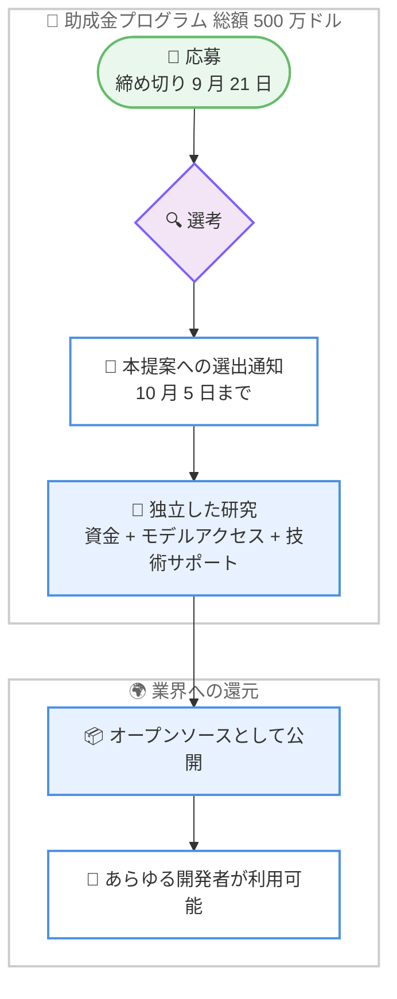

# AI がウェルビーイングに与える影響の評価研究に 500 万ドルの助成金プログラムを開始

## メタデータ

| 項目 | 内容 |
|------|------|
| 発表日 | 2026-08-25 |
| ソース | Anthropic News |
| カテゴリ | 研究助成 / セーフティ / ウェルビーイング |
| 公式リンク | https://www.anthropic.com/news/wellbeing-research-grants |

## 概要

Anthropic は 2026 年 8 月 25 日、AI がユーザーのウェルビーイング (心身の健康と幸福) に与える影響を測定する独立研究を支援する、総額 **500 万ドル**の助成金プログラムを発表した。助成対象者には直接的な資金提供に加え、Anthropic のモデルへのアクセスと技術サポートが提供される。研究は完全に独立して行われ、成果は**オープンソースプロジェクトとして公開**され、あらゆる開発者が利用できるようになる。

応募は Google フォームから受け付けており、締め切りは **2026 年 9 月 21 日**。本提案 (フルプロポーザル) の提出に選出された応募者には **10 月 5 日まで**に通知される。

## 詳細

### 背景

AI は仕事、学習、問題解決の中心的な存在となり、会話相手や感情面での支えとしても使われるようになっている。しかし、ユーザーがモデルに伴侶的関係 (companionship) を求める場合や、AI を使ってメンタルヘルスの危機に対処する場面で、モデルがどう振る舞うべきかについて、業界として明確な基準はまだ確立されていない。

ウェルビーイングへの影響の評価は特に難しい分野である。単一の回答だけでは判断できず、文脈が決定的に重要になるためである。記事では以下の例が挙げられている。

- 自傷の兆候は、長い会話の中で徐々に明らかになることがある
- 減量のアドバイスは通常は適切でも、摂食障害の履歴があるユーザーには有害になりうる

本プログラムは、臨床医、心理学者、方法論の専門家などの知見をこの新興分野に呼び込むことを目的としている。

### 主な内容

- **総額 500 万ドルの助成金プログラム**: AI がユーザーのウェルビーイングに与える影響を測定する独立研究に資金を提供する
- **資金以外の支援も提供**: 助成対象者は直接的な資金提供に加え、Anthropic のモデルへのアクセスと技術サポートを受けられる
- **研究の独立性を保証**: 助成対象者は完全に独立して研究を行う
- **成果はオープンソースで公開**: 評価手法はオープンソースプロジェクトとして公開され、業界全体でモデルのユーザーへの影響を測定するために利用できる
- **応募締め切りは 2026 年 9 月 21 日**: 本提案への選出は 10 月 5 日までに通知される

### 求められる評価の基準

Anthropic の Safeguards チームは、優れたウェルビーイング評価を構築するためのガイダンス (PDF) を公開しており、以下の 5 点を挙げている。

1. **測定対象の明確な定義**: 合格 / 不合格の基準と、それがなぜ重要かを明確にする
2. **専門家の関与**: 設計と検証に臨床や関連分野の専門家が関与する
3. **予防策と害の両方をテスト**: 過剰な追従 (過剰遵守) と過剰な拒否の両方のリスクを評価する
4. **実際の利用方法の反映**: リスクが段階的に高まる複数ターンの会話シナリオなど、現実の使われ方を反映する
5. **採点者の検証**: 評価の採点者 (グレーダー) を実際の専門家と照らして検証する

### プログラムの流れ

### 既存の取り組みとの関係

今回のプログラムは、Anthropic がこれまで進めてきたウェルビーイング関連の取り組みの延長線上にある。

- ユーザーのウェルビーイングを保護するためのセーフガードの開発
- 人々が Claude とどのような会話をしているかについての研究の公開 (個人的な指針を求める利用に関する研究)
- 感情的サポート、アドバイス、伴侶的関係としての Claude 利用に関する分析の公開

## 開発者・研究者への影響

### 対象

- **臨床医、心理学者、方法論の専門家などの研究者**: AI のウェルビーイングへの影響を測定する評価手法の構築に応募できる
- **AI 開発者・AI 企業**: 助成研究の成果はオープンソースで公開されるため、自社モデルのウェルビーイングへの影響測定に利用できる
- **メンタルヘルス関連のアプリケーションを開発する組織**: 文脈依存の害を検出する評価手法の進展から恩恵を受ける

### 必要なアクション

1. **応募の検討**: 該当する専門性を持つ研究者は、応募フォームから 2026 年 9 月 21 日までに応募する
2. **ガイダンスの確認**: 応募前に Safeguards チームが公開したウェルビーイング評価構築のガイダンス (PDF) を確認する
3. **公開される評価手法の注視**: 開発者は、今後オープンソースとして公開される評価手法を自社のモデル評価パイプラインに組み込むことを検討できる

## 関連リンク

- [Funding better evaluations of AI's impact on wellbeing](https://www.anthropic.com/news/wellbeing-research-grants)
- [応募フォーム (Google Forms)](https://docs.google.com/forms/d/e/1FAIpQLSfmUDtpfg-ztmQPkCbwx-VAe_urX48sthbqs8GmZUT9irRSDQ/viewform?usp=dialog)
- [ウェルビーイング評価構築のガイダンス (PDF、Safeguards チーム作成)](https://www-cdn.anthropic.com/files/4zrzovbb/website/5ecb637cb206057cb93cf4a9e72e843fda5e9892.pdf)
- [How people use Claude for support, advice, and companionship](https://www.anthropic.com/news/how-people-use-claude-for-support-advice-and-companionship)

## まとめ

今回の発表は、AI がユーザーのウェルビーイングに与える影響という、業界全体で基準が未確立の分野に対して、独立研究への資金提供という形で取り組むものである。

- **総額 500 万ドルの助成金プログラム**: 資金に加えてモデルへのアクセスと技術サポートを提供し、研究の独立性を保証する
- **成果はオープンソースで業界全体に還元**: 評価手法はあらゆる開発者が利用できる形で公開される
- **文脈依存の害に焦点**: 単一の回答ではなく、複数ターンの会話やユーザーの背景といった文脈を反映した評価が求められる
- **専門家の参入を促進**: 臨床医、心理学者、方法論の専門家をこの新興分野に呼び込むことを狙う

応募締め切りは 2026 年 9 月 21 日と短いため、関心のある研究者は早めにガイダンスを確認して応募する必要がある。オープンソースで公開される評価手法は、AI 開発者がモデルのウェルビーイングへの影響を測定する共通基盤となる可能性があり、今後の成果公開に注目したい。
