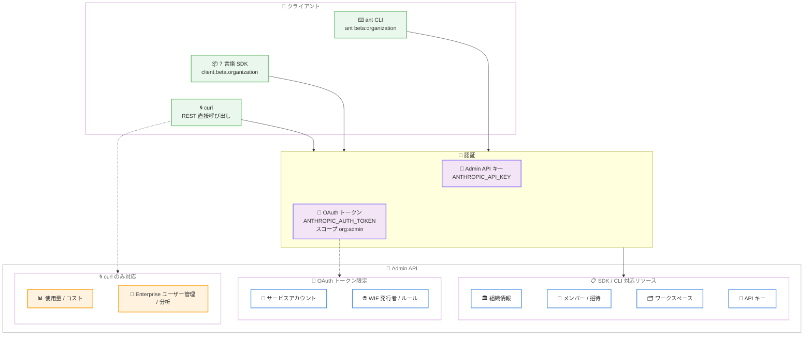

# Admin API が ant CLI と 7 言語の SDK で利用可能に

## メタデータ

| 項目 | 内容 |
|------|------|
| 発表日 | 2026-08-26 |
| ソース | Claude Platform Release Notes |
| カテゴリ | Claude API |
| 公式リンク | https://platform.claude.com/docs/en/release-notes/overview |

## 概要

Anthropic は、組織管理用の Admin API を `ant` CLI と Python、TypeScript、C#、Go、Java、PHP、Ruby の 7 言語 SDK で利用できるようにした。SDK では `client.beta.organization`、CLI では `ant beta:organization` の名前空間で提供される。対象リソースは組織情報、メンバー、招待、ワークスペースとワークスペースメンバー、API キー、レート制限、サービスアカウント、Workload Identity Federation (WIF) の発行者とルール、顧客管理暗号鍵 (CMK) である。

これまで Admin API の操作は curl などで REST エンドポイントを直接呼び出す必要があったが、今回の対応により、型付きのクライアントライブラリやコマンドラインから組織管理を自動化できるようになった。なお、使用量・コストレポートおよび Claude Enterprise のユーザー管理・分析エンドポイントは引き続き curl のみの対応となる。

## 詳細

### 背景

Admin API は、組織のメンバー、ワークスペース、招待、API キーなどをプログラムから管理するための API である。オンボーディング・オフボーディングの自動化、ワークスペースアクセスの管理、API キーの監査などに利用される。

従来、公式 SDK は Messages API などの推論系エンドポイントを中心にサポートしており、Admin API を利用するには curl や独自の HTTP クライアント実装が必要だった。エラーハンドリング、ページネーション、型安全性をチームごとに作り込む負担があり、組織管理の自動化における障壁となっていた。今回のアップデートで、推論系 API と同じクライアントから組織管理も行えるようになった。

### 主な変更点

**SDK / CLI でカバーされるリソース:**

| リソース | 主な操作 |
|---------|---------|
| 組織情報 | `/v1/organizations/me` による組織 ID・名前の取得 |
| メンバー | 一覧取得、ロール変更、削除 |
| 招待 | 作成、一覧取得、削除 |
| ワークスペース | 作成、取得、一覧、更新、アーカイブ |
| ワークスペースメンバー | 追加、一覧、ロール更新、削除 |
| API キー | 一覧取得、名前変更、有効化・無効化 |
| レート制限 | 組織・ワークスペースのレート制限の読み取り |
| サービスアカウント | WIF トークンが行動する非人間 ID の作成・管理 |
| WIF 発行者・ルール | OIDC 発行者の登録、トークンとサービスアカウントのマッピング管理 |
| 顧客管理暗号鍵 | CMK の管理 |

**curl のみ対応のまま残るエンドポイント:**

- 使用量レポートおよびコストレポート (Usage and Cost API)
- Claude Enterprise のユーザー管理エンドポイント (グループ、カスタムロールなど)
- Claude Enterprise の分析エンドポイント

### 技術的な詳細

**アクセス方法:**

| インターフェース | 名前空間 |
|-----------------|---------|
| `ant` CLI | `ant beta:organization` |
| Python / TypeScript / PHP / Ruby SDK | `client.beta.organization` |
| C# SDK | `client.Beta.Organization` |
| Go SDK | `client.Beta.Organization` |
| Java SDK | `client.beta().organization()` |

**認証:**

Admin API は 2 種類のクレデンシャルを受け付ける。ドキュメントによると、SDK と CLI のデフォルトクライアントは環境変数から自動的にクレデンシャルを読み込む。

1. **Admin API キー**: `sk-ant-admin...` で始まるキー。環境変数 `ANTHROPIC_API_KEY` から読み込まれ、`x-api-key` ヘッダーで送信される。admin ロールを持つ組織メンバーのみが発行できる
2. **OAuth ベアラートークン**: `org:admin` スコープを持つトークン。環境変数 `ANTHROPIC_AUTH_TOKEN` から読み込まれ、`authorization: Bearer` ヘッダーで送信される。admin、owner、primary owner ロールのメンバーが取得できる

サービスアカウント、WIF 発行者、WIF ルールのエンドポイントは `org:admin` OAuth トークンのみを受け付ける点に注意が必要である。ベアラートークンを使用する場合は、同じシェルで `ANTHROPIC_API_KEY` を未設定にしておく。

OAuth トークンは `ant` CLI で専用プロファイルにログインして取得する。

```bash
ant auth login --profile admin --scope "org:admin"
export ANTHROPIC_AUTH_TOKEN=$(ant auth print-credentials --profile admin --access-token)
```

対話的に取得したトークンは短命であり、401 が返り始めたら `export` コマンドを再実行して更新する。CI などの非対話ワークロードでは、WIF による自動トークン交換を利用できる。

**ページネーションの挙動:**

- Python、TypeScript、C#、Go、Java の SDK のリストメソッドは、必要に応じて追加ページを自動取得するイテレーターを返す。`limit` は合計件数ではなくページサイズを指定する
- PHP、Ruby の SDK と curl は 1 ページ分を返す
- CLI では `--limit` がメンバー、招待、ワークスペース、ワークスペースメンバー、API キーの一覧結果の上限として機能する

## 開発者への影響

### 対象

- 組織のオンボーディング・オフボーディングを自動化する IT チーム
- API キーの監査やローテーションをスクリプト化する管理者
- WIF を利用した CI / 自動化ワークロードを構築するプラットフォームチーム
- 組織管理ツールを Python、TypeScript、C#、Go、Java、PHP、Ruby で開発するエンジニア

### 必要なアクション

1. **SDK の更新**: `client.beta.organization` 名前空間を含む最新バージョンの SDK にアップデートする
2. **認証情報の設定**: Admin API キーを `ANTHROPIC_API_KEY` に、または `org:admin` OAuth トークンを `ANTHROPIC_AUTH_TOKEN` に設定する
3. **既存スクリプトの移行検討**: curl ベースの組織管理スクリプトを SDK / CLI ベースに置き換えることで、型安全性と自動ページネーションの恩恵を受けられる

### 移行ガイド (該当する場合)

curl ベースの既存スクリプトは引き続き動作するため、移行は必須ではない。移行する場合は以下の点に注意する。

- 使用量・コストレポートと Claude Enterprise のユーザー管理・分析エンドポイントは SDK / CLI 非対応のため、これらの処理は curl のまま残す
- Python、TypeScript、C#、Go、Java では、リストメソッドがページを自動取得するイテレーターを返すため、`has_more` を確認する手動ページネーションのロジックは不要になる
- サービスアカウントと WIF 関連の操作には `org:admin` OAuth トークンが必要 (Admin API キーでは不可)

## コード例

### 組織情報の取得

```bash
# CLI
ant beta:organization retrieve
```

```python
# Python
import anthropic

client = anthropic.Anthropic()  # ANTHROPIC_API_KEY または ANTHROPIC_AUTH_TOKEN を自動で読み込む

organization = client.beta.organization.retrieve()
print(f"id: {organization.id}")
print(f"name: {organization.name}")
```

### メンバー一覧の取得

```bash
# CLI
ant beta:organization:users list --limit 10
```

```typescript
// TypeScript
import Anthropic from "@anthropic-ai/sdk";

const client = new Anthropic();

const users = await client.beta.organization.users.list({ limit: 10 });

// 必要に応じて追加ページを自動取得する
for await (const user of users) {
  console.log(`${user.id}: ${user.email} (${user.role})`);
}
```

### 招待の作成

```bash
# CLI
ant beta:organization:invites create --email user@example.com --role developer
```

```go
// Go
client := anthropic.NewClient()

invite, err := client.Beta.Organization.Invites.New(context.Background(), anthropic.BetaOrganizationInviteNewParams{
	Email: "user@example.com",
	Role:  anthropic.BetaOrganizationInviteNewParamsRoleDeveloper,
})
if err != nil {
	log.Fatal(err)
}

fmt.Printf("id: %s\n", invite.ID)
fmt.Printf("status: %s\n", invite.Status)
```

### ワークスペースの API キーを監査

```bash
# CLI
ant beta:organization:api-keys list \
  --limit 10 \
  --status active \
  --workspace-id wrkspc_01JwQvzr7rXLA5AGx3HKfFUJ
```

```ruby
# Ruby
client = Anthropic::Client.new

api_keys = client.beta.organization.api_keys.list(
  limit: 10,
  status: :active,
  workspace_id: "wrkspc_01JwQvzr7rXLA5AGx3HKfFUJ"
)

api_keys.data.each do |api_key|
  puts "#{api_key.id}: #{api_key.name} (#{api_key.status})"
end
```

### API キーの無効化

```bash
# CLI
ant beta:organization:api-keys update \
  --api-key-id apikey_01Rj2N8SVvo6BePZj99NhmiT \
  --status inactive \
  --name "New Key Name"
```

## アーキテクチャ図



## 関連リンク

- [Admin API ガイド](https://platform.claude.com/docs/en/manage-claude/admin-api)
- [Admin API リファレンス](https://platform.claude.com/docs/en/api/admin)
- [Admin API キーの作成](https://platform.claude.com/docs/en/manage-claude/admin-api-keys)
- [ant CLI クイックスタート](https://platform.claude.com/docs/en/cli-sdks-libraries/cli/quickstart)
- [Workload Identity Federation と Admin API](https://platform.claude.com/docs/en/manage-claude/wif-admin-api)
- [Usage and Cost API](https://platform.claude.com/docs/en/manage-claude/usage-cost-api)
- [Claude Platform Release Notes](https://platform.claude.com/docs/en/release-notes/overview)

## まとめ

今回のアップデートにより、Admin API が `ant` CLI と Python、TypeScript、C#、Go、Java、PHP、Ruby の 7 言語 SDK から利用できるようになった。組織管理の自動化に curl ベースの独自実装が不要となり、推論系 API と同じクライアントで組織情報、メンバー、招待、ワークスペース、API キー、レート制限、サービスアカウント、WIF、CMK を扱える。

特に注目すべきポイントは以下の通りである。

- SDK は `client.beta.organization`、CLI は `ant beta:organization` の名前空間で提供される
- 認証は `ANTHROPIC_API_KEY` の Admin API キー、または `ANTHROPIC_AUTH_TOKEN` の `org:admin` OAuth トークンを自動で読み込む
- Python、TypeScript、C#、Go、Java の SDK はリスト取得時にページを自動でたどるイテレーターを返す
- サービスアカウントと WIF 関連の操作は `org:admin` OAuth トークンのみ対応
- 使用量・コストレポートと Claude Enterprise のユーザー管理・分析エンドポイントは引き続き curl のみの対応

2026 年 7 月の Claude Enterprise 向けユーザー管理 API、8 月 19 日の Admin API GA に続く今回の SDK / CLI 対応により、組織管理の開発者体験が大きく向上した。IT チームはオンボーディング自動化や API キー監査のツールを、使い慣れた言語の型付きクライアントで構築できる。
