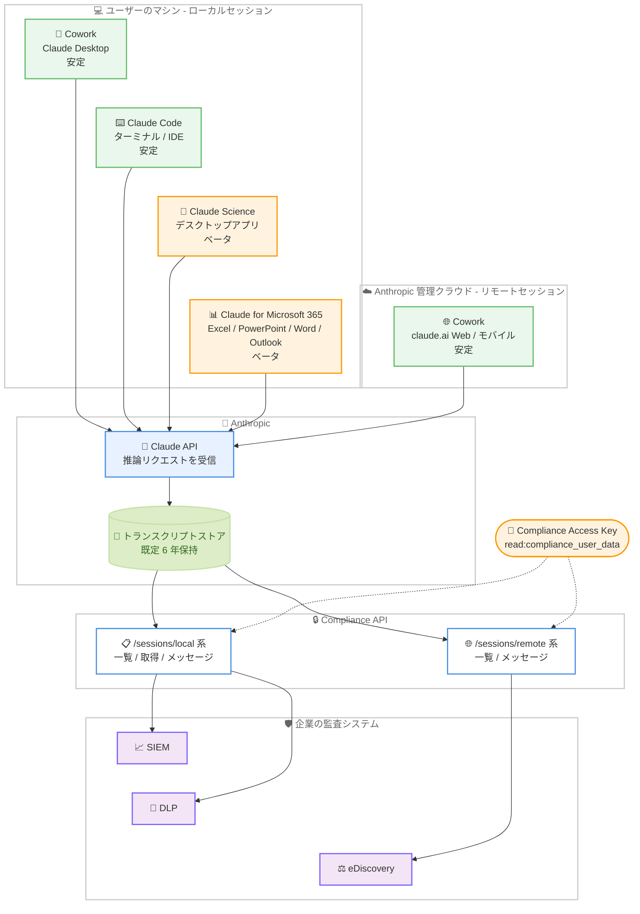

# Compliance API セッションエンドポイントが GA、Claude Science / Microsoft 365 のローカルセッション対応をベータ提供

## メタデータ

| 項目 | 内容 |
|------|------|
| 発表日 | 2026-08-26 |
| ソース | Claude Developer Platform Release Notes |
| カテゴリ | Claude API / エンタープライズ / コンプライアンス |
| 公式リンク | https://platform.claude.com/docs/en/release-notes/overview |

## 概要

Anthropic は 2026 年 8 月 26 日、Claude Developer Platform のリリースノートで Compliance API のセッションエンドポイントに関する 2 件の変更を公開した。

1 件目は、Compliance API のセッションエンドポイントが Cowork および Claude Code セッションについてベータを卒業し、一般提供 (GA) となったことである。公式ドキュメントは、ローカルセッションとリモートセッションの両エンドポイントファミリーが Cowork と Claude Code のセッションについて「stable」であると明記している。

2 件目は、ローカルセッションエンドポイントの対象プロダクトの拡大である。Claude Science デスクトップアプリのセッション (`product_surface` 値は `claude_science`) と、Excel、PowerPoint、Word、Outlook で動作する Claude for Microsoft 365 のセッション (`product_surface` 値は `office_agents` で始まる) のトランスクリプトを返すようになった。この拡大部分は Claude Enterprise 組織向けのベータであり、既存の Compliance Access Key と `read:compliance_user_data` スコープでそのまま利用できる。新しいキー、スコープ、設定、クライアントの更新はいずれも不要である。

これにより、Compliance API のセッション監査は「コーディングとデスクトップ作業 (Cowork / Claude Code)」の安定提供に加えて、「科学研究 (Claude Science)」と「Office ドキュメント作業 (Microsoft 365 アドイン)」という新しい業務領域へカバレッジを広げたことになる。

## 詳細

### 背景

Compliance API は 2026 年 5 月 21 日の一般提供開始以降、Claude Enterprise 組織のチャット、ファイル、プロジェクト、アクティビティフィードを SIEM、DLP、eDiscovery などの既存セキュリティスタックに取り込む窓口として機能してきた。

セッションについては段階的にカバレッジが拡大されてきた。まず claude.ai の Web / モバイルで開始され Anthropic 管理のクラウド環境で動作する Cowork セッションを対象とする**リモートセッション**エンドポイントがベータ提供され、2026 年 8 月 11 日にはユーザー自身のマシン上で動作する Cowork (Claude Desktop) と Claude Code を対象とする**ローカルセッション**エンドポイントがベータ追加された。詳細は [Compliance API ローカルセッション対応](2026-08-11-compliance-api-local-sessions.md) のレポートを参照。

今回の発表は、この 2 つのエンドポイントファミリーを Cowork / Claude Code について安定版に昇格させると同時に、ローカルセッションの対象プロダクトを Claude Science と Claude for Microsoft 365 に広げるものである。安定化と拡大を同時に行い、「エンドポイントの仕様は安定、新プロダクトのカバレッジはベータ」という構成に整理された。

なお、ドキュメントの構成も変更されている。ローカルセッションベータ時点では「Retrieve and delete chats, files, projects, and sessions」(`compliance-content-data`) ページ内で説明されていたが、現在はセッション専用の「Retrieve session transcripts」(`compliance-sessions`) ページに独立している。

### 主な変更点

#### 1. セッションエンドポイントの GA

公式ドキュメントは「The local and remote session endpoints are stable for Cowork and Claude Code sessions」と明記しており、以下のエンドポイントが Cowork / Claude Code セッションについてベータを卒業した。

| エンドポイント | 役割 | ファミリー |
|---------------|------|-----------|
| `GET /v1/compliance/apps/sessions/local` | ローカルセッションのメタデータ一覧 | ローカル |
| `GET /v1/compliance/apps/sessions/local/{session_id}` | 単一ローカルセッションのメタデータ取得 | ローカル |
| `GET /v1/compliance/apps/sessions/local/{session_id}/messages` | ローカルセッションのトランスクリプト取得 | ローカル |
| `GET /v1/compliance/apps/sessions/remote` | リモートセッションのメタデータ一覧 | リモート |
| `GET /v1/compliance/apps/sessions/remote/{session_id}/messages` | リモートセッションのトランスクリプト取得 | リモート |

いずれも読み取り専用であり、Admin API キー (`sk-ant-admin01-...`) では利用できず 403 Forbidden が返る。API 経由でのセッション削除はできない。

#### 2. Claude Science と Microsoft 365 のローカルセッション対応 (ベータ)

ローカルセッションエンドポイントが返すプロダクトが拡大された。公式ドキュメントのプロダクト対応表は以下の通り。

| プロダクトと実行場所 | エンドポイントファミリー | `product_surface` | 提供状態 |
|--------------------|----------------------|-------------------|---------|
| Cowork (Claude Desktop、ユーザーのマシン上) | ローカル | `cowork` | 安定 |
| Claude Code (ターミナル / Claude Desktop / IDE 拡張、ユーザーのマシン上) | ローカル | `claude_code` | 安定 |
| Claude Science デスクトップアプリ (ユーザーのマシン上) | ローカル | `claude_science` | ベータ |
| Claude for Microsoft 365 (Excel、PowerPoint、Word、Outlook のアドイン。Microsoft 365 のデスクトップ / Web アプリ内) | ローカル | `office_agents/excel`、`office_agents/powerpoint`、`office_agents/word`、`office_agents/outlook` (アプリを特定できない場合は `office_agents`) | ベータ |
| Cowork (claude.ai Web / モバイル開始、Anthropic 管理のクラウド環境) | リモート | `cowork_remote` | 安定 |

新プロダクトの取得に必要な追加設定はなく、既存の Compliance Access Key と `read:compliance_user_data` スコープで、同じ 3 つのローカルセッションエンドポイントから返る。

### 技術的な詳細

#### Claude Science セッションの特性

Claude Science のセッションには、他のプロダクトにない挙動が公式ドキュメントに明記されている。

- 一覧には、会話そのものに加えて、アプリ自身のバックグラウンド作業 (会話の命名など。新しいアプリバージョンではレビュアートラックと委任トラックも) が**別セッション**として現れることがある
- 古いアプリバージョンでは、バックグラウンド作業の一部が会話自体のトランスクリプト内の**追加メッセージ**として現れる
- アプリのアップデートをまたいで継続した Claude Science の会話は、**2 つのセッション**として現れることがある

これらはいずれも想定された挙動であり、セッション数と会話数が 1 対 1 に対応しない前提でエクスポートや分析を設計する必要がある。

#### Claude for Microsoft 365 セッションの特性

- `product_surface` はアプリ単位で分かれる: `office_agents/excel`、`office_agents/powerpoint`、`office_agents/word`、`office_agents/outlook`。アプリを特定できない場合は `office_agents` のみ
- アドイン内での会話削除は**クライアント側のみ**で行われ、API には反映されない。ローカルセッションに `deleted_at` フィールドはなく、保持期間が経過するまでセッションは一覧に残り続ける

#### ローカルセッションの `updated_at` と `updated_at.gte` フィルター

現在の公式ドキュメントでは、ローカルセッションが `created_at` に加えて `updated_at` を持つと記載されている。ベータ時点 (2026 年 8 月 11 日) のドキュメントには `updated_at` は存在しないと明記されていたため、GA までの間に仕様が拡張された点である (リリースノートに個別の記載はなく、追加時期の特定にはリリースノートの他日付の確認が必要)。

- `created_at` はセッション内で保持されている**最古**の推論呼び出しのタイムスタンプ、`updated_at` は**最後**の呼び出しのタイムスタンプ (いずれも UTC)
- ローカルセッションには引き続き `status` はなく、サーバーサイドのライフサイクルを持たない。可視性は保持期間で決まる
- 一覧エンドポイントに `updated_at.gte` フィルターが追加された。指定時刻以降に最後の推論呼び出しがあったセッションを返し、`created_at.gte` / `created_at.lt` と併用できる (並び順とページングは変わらない)
- `updated_at` は一覧上では**下限値**である。ページ境界や `created_at.lt` ウィンドウ境界の時点でまだアクティブなセッションでは、真の最終活動より一時的に遅れることがあり、新しい呼び出しは短い処理遅延の後にクエリ可能になる
- このラグのため、ポーリング時は各実行の `updated_at.gte` を**前回実行の開始時刻より数分前**に設定する。前回時刻ちょうどに設定すると、その時点でインデックス中だった最終呼び出しを持つセッションが以後の実行で永久に返らなくなる
- 返ったセッションは `id` で重複排除し、トランスクリプトを再取得してメッセージも `id` で重複排除する。古いウィンドウに対する定期的な照合パスは、オーバーラップを広げるよりも確実な代替手段となる

これにより、ベータ時点で必要だった「末尾ウィンドウの再取得のみによる差分検出」から、`updated_at.gte` によるポーリングベースの増分エクスポートへ移行できる。

#### CMEK 組織での挙動の変更

顧客管理暗号鍵 (CMEK) を利用する組織での挙動も、ベータ時点のドキュメント記載から変わっている。

| 項目 | ベータ時点 (2026-08-11) | 現在 (2026-08-26) |
|------|------------------------|-------------------|
| トランスクリプト本文 | 返らない。全メッセージが `content_unavailable` / `not_captured` | お客様の鍵で暗号化された上で**通常どおり返る** |
| 鍵が利用できない間 | - | メッセージエンドポイントが該当ページに対して 503 Service Unavailable を返す。`not_captured` としては報告されない |
| 一覧 / メタデータ取得 | 影響なし | 影響なし |

`provenance.reason` の `cmek_key_revoked` は引き続き予約値であり、現時点では返らない (鍵が利用できない場合は 503 になるため) が、前方互換のために処理を用意しておくことが推奨されている。

#### `provenance.reason` に `client_aborted` が追加

`content_unavailable` の理由として `client_aborted` が追加された。クライアントがレスポンス完了前に接続を閉じた、またはリクエストをキャンセルしたためにそのターンのレスポンスが記録されなかったことを示す。クライアントへ既にストリーミングされた部分出力も含まれない。この理由は assistant ロールのターンにのみ適用される。

あわせて、assistant メッセージの `model` フィールドの挙動も明記されている。Claude API から記録された assistant ターンではそのターンを処理したモデル ID が入り、user メッセージおよび `provenance` が設定された assistant メッセージ (クライアント主張の履歴、合成マーカー、内容が利用できないターン) では `null` になる。

#### キャプチャされないケース (変更なし)

以下はベータ時点から変わらず対象外である。

- Claude Console の API キーで認証した Claude Code、および Amazon Bedrock、Google Cloud、Microsoft Foundry などサードパーティクラウド経由の Claude Code
- Claude Code on the web (Anthropic 管理のクラウド環境で動作するが、リモートセッションにも該当しない。リモートセッションエンドポイントは Cowork セッションのみを返す)
- HIPAA readiness を有効化した組織のローカルセッション (データが一切収集されない)
- ゼロデータ保持 (ZDR) が適用されるセッション (一覧から除外され、取得 / メッセージエンドポイントは 404 を返す)

#### OpenTelemetry ロギングとの比較

GA 版ドキュメントには、Cowork の OpenTelemetry ロギングおよび Claude Code モニタリングとの比較表が追加された。要点は以下の通り。

| 観点 | Compliance API セッション | OpenTelemetry ロギング |
|------|--------------------------|----------------------|
| 配信 | プル型 (HTTPS でクエリしてエクスポート) | プッシュ型 (OTLP コレクターへストリーミング) |
| セットアップ | 既存の Compliance Access Key で動作 | 管理者が OTLP エンドポイントとコンテンツキャプチャ設定を構成 |
| インフラ | Anthropic ホスト | コレクターとストレージを自社運用 |
| 保持 | 既定 6 年 (ローカルは組織のカスタム会話保持期間があればそれを適用)。Anthropic が保持 | 自社インフラ、自社ポリシー |
| ツール入力 / 結果 | 既定 10,000 バイトで切り詰め。リクエストで約 1 MiB まで | 切り詰められたサマリー (Claude Code はオプションでコンテンツ取得可) |
| ホスト / デバイスメタデータ | なし | あり (ターミナル種別、ワークスペースパスなど) |
| トークン使用量とコスト | なし (Claude Enterprise Analytics API で取得) | あり |

Anthropic は Cowork および Claude Code セッションの**内容**の取得には Compliance API を推奨している。

#### そのほかの仕様 (ベータから継続)

- **認証**: `x-api-key` ヘッダーに Compliance Access Key を指定。必要スコープは `read:compliance_user_data`
- **一覧のフィルター**: ローカルは `created_at.gte` / `created_at.lt` (RFC 3339、UTC オフセット必須) と新しい `updated_at.gte` のみで、組織 / ユーザーフィルターはない。リモートは `organization_ids[]` (最大 500 件)、`user_ids[]` (1-10 件)、`created_at` 範囲 (`gte`、`gt`、`lt`、`lte`) を利用できるが `updated_at` フィルターはない
- **ページング**: 一覧は `limit` 既定 100 / 最大 500、メッセージは既定 100 / 最大 1,000。`next_page` を `page` に渡す前方ページングで、`next_page` が `null` になるまで継続する。一覧の走査は 24 時間以内に完了させる
- **サイズ上限**: `tool_use_input_max_bytes` と `tool_result_max_bytes` は既定 10,000 バイト。`-1` でサーバー最大値 (約 1 MiB)。切り詰められた `tool_use` の `input` は有効な JSON ではなくなる
- **トランスクリプトの除外項目**: 思考ブロック、システムプロンプト (マーカーで代替)、ツール定義と MCP サーバー設定、画像 / PDF などのバイナリブロック、引用メタデータ
- **レート制限**: ローカルセッションは共有の Compliance API レート制限のみ。リモートセッションはこれに加えてエンドポイント固有のリクエストバジェットの対象
- **保持期間**: ローカルは既定 6 年、組織が有限のカスタム会話保持期間を設定している場合はその期間 (複数ある場合は最短)。リモートは 6 年

## 開発者への影響

### 対象

- **コンプライアンス / eDiscovery 担当者**: Cowork や Claude Code に加え、Claude Science と Microsoft 365 アドインでの作業内容を証跡として取得する必要がある担当者
- **セキュリティチーム**: SIEM や DLP にセッショントランスクリプトを取り込み、Office ドキュメントや研究データを扱うセッションの機微情報を監視する担当者
- **Compliance API のインテグレーション実装者**: ベータ時代のローカルセッション実装を GA 仕様 (特に `updated_at` の追加) に合わせて更新する開発者
- **Claude Enterprise 管理者**: Claude Science や Claude for Microsoft 365 の展開に際して、監査カバレッジを整理する管理者

### 必要なアクション

1. **GA に伴う本番昇格の判断**: Cowork / Claude Code セッションのエンドポイントは安定版となったため、ベータを理由に見送っていた本番運用への組み込みを再評価する
2. **新しい `product_surface` 値への対応**: `claude_science` と `office_agents/` 接頭辞の値 (および `office_agents` 単体) をハンドラーに追加する。前方互換の原則どおり、未知の値もそのまま通過させる
3. **増分エクスポートの移行**: ベータ時点の「末尾ウィンドウ再取得 + `id` 重複排除」から、`updated_at.gte` によるポーリングへ移行できる。その際、各実行の下限は前回実行の開始時刻より数分前に設定し、オーバーラップさせる
4. **Claude Science のセッション構造への対応**: バックグラウンド作業の別セッションや、アプリ更新をまたいだセッション分割を想定し、セッション数ベースの集計や 1 会話 1 セッションを前提としたロジックを避ける
5. **Microsoft 365 の削除非反映の周知**: アドインでの会話削除が API に反映されないことを、eDiscovery やデータ主体からの削除要求に関わる担当者に共有する
6. **CMEK 組織の実装更新**: トランスクリプトが返るようになったため、CMEK を理由に本文取得をスキップしていた実装を見直す。鍵が利用できない間の 503 に対するリトライ処理を用意する
7. **`client_aborted` の処理追加**: `provenance.reason` の新しい値として処理し、未知の型 / 理由も許容する実装を維持する

### 移行ガイド (該当する場合)

ベータ時点 (2026 年 8 月 11 日) のドキュメントに基づいて実装した場合の差分は以下の通り。

- **`updated_at` の追加**: ベータ時点では「ローカルセッションは `status` と `updated_at` を持たない」とされていたが、現在は `updated_at` を持つ (`status` は引き続きない)。レスポンスパーサーとエクスポートの差分検出ロジックを更新する
- **`updated_at.gte` フィルターの利用**: 増分取得の主手段として利用できる。ただしラグがあるため、ウィンドウのオーバーラップと `id` による重複排除は引き続き必須
- **CMEK の挙動変更**: 「全メッセージが `not_captured`」を前提とした分岐は不要になり、鍵が利用できない間は 503 が返る
- **ドキュメント参照先の変更**: セッション関連の説明は `compliance-content-data` から `compliance-sessions` ページに移動した。実装コメントや社内手順書のリンクを更新する
- **エンドポイント URL、認証、ページング方式に変更はない**: `clls_` / `cse_` の ID 接頭辞、`page` / `next_page` のページング、サイズ上限パラメータはそのまま利用できる

## コード例

### 新プロダクトを含むローカルセッションの一覧取得

```bash
# updated_at.gte で「指定時刻以降に活動があったセッション」を取得する
# created_at フィルターと併用できる。RFC 3339 形式で UTC オフセット必須
curl --fail-with-body -sS -G \
  "https://api.anthropic.com/v1/compliance/apps/sessions/local" \
  --header "x-api-key: $ANTHROPIC_COMPLIANCE_ACCESS_KEY" \
  --data-urlencode "updated_at.gte=2026-08-26T00:00:00Z" \
  --data-urlencode "limit=500"
```

### `product_surface` 別の振り分け

```python
# claude_science と office_agents/ 接頭辞の値を含めて振り分ける
# 未知の値はそのまま通過させる (前方互換)
def classify_session(session: dict) -> str:
    surface = session.get("product_surface")
    if surface is None:
        return "unknown"
    if surface == "cowork":
        return "cowork_desktop"
    if surface == "claude_code":
        return "claude_code"
    if surface == "claude_science":
        return "claude_science"  # ベータ。バックグラウンド作業の別セッションに注意
    if surface == "office_agents" or surface.startswith("office_agents/"):
        # office_agents/excel, office_agents/powerpoint,
        # office_agents/word, office_agents/outlook
        return "microsoft_365"  # ベータ。アドイン側の削除は API に反映されない
    return f"unrecognized:{surface}"  # 落とさずに通過させる
```

### `updated_at.gte` によるポーリング

```python
# 各実行の下限は前回実行の「開始時刻」より数分前に設定してオーバーラップさせる
# 前回時刻ちょうどに設定すると、インデックス中だったセッションを永久に取りこぼす
import os
from datetime import datetime, timedelta, timezone

import httpx

BASE_URL = "https://api.anthropic.com/v1/compliance/apps/sessions/local"
HEADERS = {"x-api-key": os.environ["ANTHROPIC_COMPLIANCE_ACCESS_KEY"]}
OVERLAP = timedelta(minutes=10)

def poll_sessions(previous_run_started_at: datetime) -> dict[str, dict]:
    run_started_at = datetime.now(timezone.utc)
    lower_bound = previous_run_started_at - OVERLAP

    sessions: dict[str, dict] = {}  # id で重複排除する
    params: dict[str, str] = {
        "updated_at.gte": lower_bound.strftime("%Y-%m-%dT%H:%M:%SZ"),
        "limit": "500",
    }

    with httpx.Client(headers=HEADERS, timeout=60.0) as client:
        while True:
            response = client.get(BASE_URL, params=params)
            response.raise_for_status()
            payload = response.json()

            for session in payload["data"]:
                sessions.setdefault(session["id"], session)

            next_page = payload.get("next_page")
            if not next_page:
                break
            params["page"] = next_page

    print(f"run={run_started_at.isoformat()} sessions={len(sessions)}")
    # 返ったセッションごとにトランスクリプトを再取得し、メッセージも id で重複排除する
    return sessions
```

### トランスクリプト取得と `provenance` の処理

```bash
# メッセージエンドポイント。limit は既定 100、最大 1,000
# CMEK の鍵が利用できない間は該当ページに 503 が返るためリトライを用意する
session_id="clls_01HxKpLmNoPqRsTuVwXyZaBc"

curl --fail-with-body -sS -G \
  "https://api.anthropic.com/v1/compliance/apps/sessions/local/$session_id/messages" \
  --header "x-api-key: $ANTHROPIC_COMPLIANCE_ACCESS_KEY" \
  --data-urlencode "limit=1000" \
  --data-urlencode "tool_use_input_max_bytes=-1" \
  --data-urlencode "tool_result_max_bytes=-1"
```

## アーキテクチャ図



## 関連リンク

- [Claude Developer Platform Release Notes](https://platform.claude.com/docs/en/release-notes/overview)
- [Retrieve session transcripts](https://platform.claude.com/docs/en/manage-claude/compliance-sessions)
- [Retrieve local sessions](https://platform.claude.com/docs/en/manage-claude/compliance-sessions#retrieve-local-sessions)
- [Retrieve a local session transcript](https://platform.claude.com/docs/en/manage-claude/compliance-sessions#retrieve-a-local-session-transcript)
- [Retrieve remote sessions](https://platform.claude.com/docs/en/manage-claude/compliance-sessions#retrieve-remote-sessions)
- [Set up the Compliance API](https://platform.claude.com/docs/en/manage-claude/compliance-api-access)
- [Compliance API errors](https://platform.claude.com/docs/en/manage-claude/compliance-errors)
- [Compliance API FAQ](https://platform.claude.com/docs/en/manage-claude/compliance-faq#data-coverage-and-retention)
- [Compliance API reference](https://platform.claude.com/docs/en/api/compliance/apps)
- [API and data retention](https://platform.claude.com/docs/en/manage-claude/api-and-data-retention)
- [Customer-managed encryption keys](https://platform.claude.com/docs/en/manage-claude/cmek)
- [Claude Enterprise Analytics API](https://platform.claude.com/docs/en/manage-claude/analytics-api)
- [関連レポート: Compliance API ローカルセッション対応 (2026-08-11)](2026-08-11-compliance-api-local-sessions.md)

## まとめ

2026 年 8 月 26 日の発表は、Compliance API のセッション監査を「安定化」と「拡大」の両面で前進させるものである。

- **Cowork / Claude Code セッションの GA は本番導入の判断材料になる**: ローカルとリモートの両エンドポイントファミリーが安定版となり、ベータであることを理由に見送っていた組織も、eDiscovery エクスポートや DLP 連携の本番運用に組み込みやすくなった
- **監査カバレッジがコーディング以外の業務領域に広がった**: Claude Science (`claude_science`) と Claude for Microsoft 365 (`office_agents/` 系) がベータ対応し、研究作業や Office ドキュメント作業のトランスクリプトも同じ 3 エンドポイントで取得できる。追加のキー、スコープ、設定は不要である
- **GA 版はベータ時点の運用上の課題にも対応している**: ローカルセッションに `updated_at` フィールドと `updated_at.gte` フィルターが加わり、増分エクスポートをポーリングベースで設計できるようになった。CMEK 組織でもトランスクリプト本文が返るようになり、鍵が利用できない間は 503 で区別される
- **新プロダクト固有の挙動に注意が必要である**: Claude Science ではバックグラウンド作業が別セッションとして現れ、アプリ更新で会話が複数セッションに分かれる。Microsoft 365 ではアドイン側の会話削除が API に反映されない。いずれも想定された挙動として設計に織り込む必要がある
- **カバレッジの空白は変わっていない**: Console API キー認証やサードパーティクラウド経由の Claude Code、Claude Code on the web、HIPAA readiness 組織、ZDR 適用セッションは引き続き対象外である。監査要件の関係者にはこの前提の共有が引き続き必要となる

新プロダクト対応はベータであり、ドキュメントは「カバレッジ拡大に伴い新しい `product_surface` 値が追加される」と明記している。未知の値を通過させる前方互換な実装を維持することが、今後のカバレッジ拡大へ追従するための要点である。
