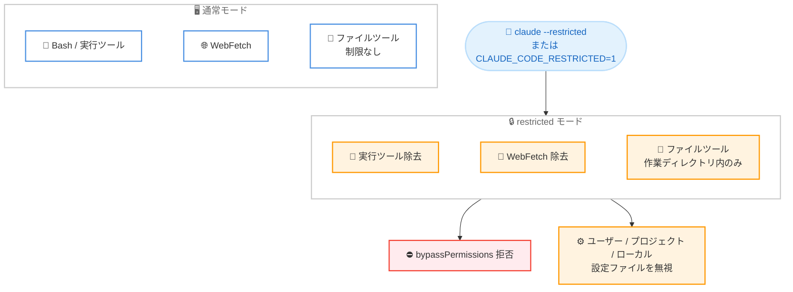

# Claude Code v2.1.248 / v2.1.250 リリース — `--restricted` モードの追加、エージェントごとのキャッシュ TTL、プロンプトキャッシュミスの修正

## メタデータ

| 項目 | 内容 |
|------|------|
| 発表日 | 2026-08-27 (npm 公開: v2.1.248 は 20:35 UTC、v2.1.250 は 22:27 UTC) |
| ソース | Claude Code Changelog |
| カテゴリ | Claude Code アップデート |
| 公式リンク | https://github.com/anthropics/claude-code/blob/main/CHANGELOG.md |

## 概要

Claude Code v2.1.248 および v2.1.250 が 2026 年 8 月 27 日 (npm レジストリ基準) にリリースされた。

v2.1.248 では、コマンド実行系ツールと `WebFetch` を除去しファイル操作を作業ディレクトリ内に制限する `--restricted` フラグ、agent frontmatter でエージェントごとにプロンプトキャッシュ TTL を指定できる `experimental.cacheTtl`、Enterprise 組織のメンバーが管理者に使用量上限の引き上げを依頼できる `/usage-credits`、server-managed settings の診断機能などの新機能が追加された。また、Bedrock / Vertex / Foundry およびテレメトリ無効時にも同一マシン上のセッション間メッセージング (`SendMessage` / `ListAgents`) が利用できるようになった。

修正面では、OAuth トークンリフレッシュ後のツール定義再レンダリングによって長時間セッションで約 1 時間に 1 回発生していたプロンプトキャッシュミス (および extended thinking コンテキストの喪失) の解消をはじめ、`claude agents`、クラウドセッション、MCP、フックまわりの約 30 項目のバグ修正が含まれる。続く v2.1.250 は「Bug fixes and reliability improvements」のみのメンテナンスリリースである。

## 詳細

### 背景

前日の v2.1.247 は `SendFeedback` ツールや `/claude-api cost-optimize` の追加を中心としたリリースであった。v2.1.248 はそれに続き、セキュリティを重視した実行モード (`--restricted`)、プロンプトキャッシュの制御と信頼性向上、エンタープライズ環境 (Bedrock / Vertex / Foundry、server-managed settings、Enterprise 課金) への対応強化を柱とするリリースとなる。同日中に公開された v2.1.250 は、バグ修正と信頼性改善のみを含むフォローアップである (v2.1.249 は changelog に記載がない)。

### 主な変更点 (v2.1.248)

#### 新機能 (Added)

- **`--restricted` フラグの追加** (`CLAUDE_CODE_RESTRICTED=1` でも指定可能): コマンドやコードを実行する組み込みツールと `WebFetch` を除去し (`--tools` で明示指定した場合を除く)、ファイルツールを作業ディレクトリ内に制限し、`bypassPermissions` を拒否し、ユーザー / プロジェクト / ローカルの設定ファイルを無視する
- **agent frontmatter に `experimental.cacheTtl` を追加**: `"5m"` または `"1h"` を指定でき、サブエージェント用の TTL 設定が構成されていない場合に、エージェントごとのプロンプトキャッシュ TTL として使用される
- **`claude self-hosted-runner --client-label <label>` の追加** (`SELF_HOSTED_RUNNER_CLIENT_LABEL` でも指定可能): ランナーが登録に使用するラベルを上書きできる (デフォルトはホスト名)
- **server-managed settings の診断機能を追加**: 設定の読み込みに失敗した場合の起動時警告と、読み込み失敗の理由や取得されなかった理由 (Bedrock / Vertex / サードパーティプロバイダー、カスタム `ANTHROPIC_BASE_URL`) を説明する `/doctor` および `/status` の行が追加された
- **`/web-setup` に警告を追加**: GitHub CLI トークンに `workflow` スコープがない場合に警告を表示する。このスコープがないと非常に大きなリポジトリへのプッシュが拒否されることがあるため
- **`/usage-credits` の追加**: AWS Marketplace 経由で課金される Enterprise 組織、セルフサーブ Enterprise、Enterprise トライアルを対象に、メンバーが管理者へ使用量上限の引き上げをリクエストできる
- **クロスセッションメッセージングの対応拡大**: Bedrock、Vertex、Foundry 上のセッション、およびテレメトリが無効なセッションでも、同一マシン上のセッション間で `SendMessage` / `ListAgents` が利用できるようになった

#### 修正 (Fixed)

**プロンプトキャッシュ・認証:**

- 長時間セッションで約 1 時間に 1 回発生していたプロンプトキャッシュミス (および extended thinking コンテキストの喪失) を修正。OAuth トークンリフレッシュ後にツール定義が再レンダリングされることが原因だった
- アカウントが使用量超過 (overage) に入っていた場合に、セッションとその `--resume` の間で `ScheduleWakeup` ツールの定義が変化し、再開後の最初のターンでプロンプトキャッシュが完全にミスする問題を修正
- 別の Claude Code プロセスがトークンリフレッシュロックを保持している間にセッショントークンの有効期限が切れると、ログイン画面に送られてしまう問題を修正。リクエストはリトライ可能なエラーとして失敗するようになった
- マシンによっては使用できない環境 (例: `ANTHROPIC_API_KEY` や API キーヘルパーが設定されている場合) で、`/login` の推奨 Console サインインがサインイン URL を表示する前に OAuth エラーで失敗する問題を修正。API キーサインインにフォールバックするようになった
- `apiKeyHelper` が唯一の資格情報の場合に、ゲートウェイモデル検出 (`CLAUDE_CODE_ENABLE_GATEWAY_MODEL_DISCOVERY`) がまったく実行されない問題を修正
- Claude アプリゲートウェイへの `/login` が、managed settings のセキュリティ承認ダイアログが必要な場合にハングする問題を修正

**`claude agents`・バックグラウンドセッション:**

- Windows で、セッションからデタッチした後や win32-input-mode のまま残っているターミナルタブで起動した場合に、`claude agents` の一覧がキーボードに反応しない問題を修正
- `CI` 環境変数が設定されていると `claude agents` がワークスペースの信頼プロンプトをスキップする問題を修正
- PR ステータスキャッシュに不正なエントリが含まれていると `claude agents` が起動時にクラッシュする問題を修正
- マシンの電源が切れていた間の数週間前のバックグラウンドセッションを、エージェントビューが復活させてしまう問題を修正。実際の終了時点で停止として表示され、開く際に保存済み会話を再開するか確認するようになった
- 新しいセッションを開始する際に、エージェントビューが古い会話を開いたり入力済みプロンプトを破棄したりすることがある問題を修正
- 別のターミナルですでに再開済みの停止セッションを開いても、その会話に対して 2 つ目のプロセスが起動しなくなった。行にはターミナルで開かれている旨が表示される
- ワークツリーブランチがチェックアウト中のデフォルトブランチ (例: ローカルの `main`) にマージ済みだが未プッシュの場合に、`claude agents` と `claude rm` がセッションの削除を「has commits that are not pushed anywhere」として拒否する問題を修正
- `PermissionRequest` や `PreToolUse` フックが不正な回答を出力した場合に、バックグラウンドセッションが静かに待機し続ける問題を修正。`claude agents` の行にフック名とスキーマエラーが表示されるようになった
- バックグラウンド化されたワークツリーセッションがチェックアウトを失う問題を修正。バックグラウンドセッションが実行中はワークツリーのロックを保持するため、クリーンアップや `git worktree remove` の影響を受けなくなった

**フック・MCP・クロスセッション:**

- 有効な JSON ではない stdout の `{…}` オブジェクトをフックが黙ってプレーンテキスト扱いする問題を修正。パースメッセージ付きのフックエラーとして報告されるようになった
- claude.ai コネクタタイプを宣言するプロジェクトの `.mcp.json` エントリが、`/mcp` で信頼済みの「claude.ai」見出しの下に表示される問題を修正。実際のスコープの下に表示されるようになった
- `headersHelper` が `Authorization` ヘッダーを供給する MCP サーバーが、401 発生時にドキュメントどおりヘルパーを再実行して呼び出しをリトライするのではなく、OAuth ディスカバリーに移行してしまう問題を修正
- 非ラテン文字 (例: IME で入力した韓国語) で入力した名前が、他セッションへの @ メンションでマッチしない問題を修正
- 不正な `crossSessionInbound` 値が黙って無視される問題を修正。修正されるまで、警告を表示してクロスセッションメッセージを保留 (ユーザー設定) または拒否 (managed settings) するようになった

**クラウド・Remote Control・セキュリティ:**

- `/ultrareview` およびローカルからシードしたクラウドセッションが、`prod.env` 形式のファイルや `*.tfvars` ファイル、資格情報ファイルのエディタスワップ / 一時 / バックアップコピー (例: `key.pem.tmp`、`id_rsa.swo`) の未コミット編集をアップロードしてしまう問題を修正。これらはローカルマシンに留まるようになった
- CLI が静かに再接続した後、Remote Control セッションが接続デバイスに権限プロンプトや最新メッセージをまったく表示しないことがある問題を修正
- コンテナのセッション資格情報がまだ読み取れない場合に、クラウドセッションが起動時に失敗することがある問題を修正
- グローバルフラグやラッパーが注入したオプションがサブコマンドの前にあると、`claude remote-control` が自身のフラグ (例: `--spawn`、`--name`) を拒否する問題を修正

**UI・その他:**

- `/model` とファストモード切り替え通知のモデル名がコードとして描画されるようになり、`[1m]` のようなサフィックスがリンクではなくそのまま表示されるようになった
- `claude logs` が実行元のターミナルにマウストラッキング、bracketed paste、代替スクリーンを有効にしたまま残す問題を修正
- 信頼ダイアログのリポジトリ権限ルール一覧で、長いルールが絵文字の途中で切り詰められると文字化けが表示される問題を修正
- Ctrl+C の直後に Shift+Tab を押すと、権限モードインジケーターが「Press Ctrl-C again to exit」ヒントの後ろに隠れたままになる問題を修正
- 起動時警告 (例: 「N MCP servers need authentication」) がトランスクリプトの他の部分より 1 列右にずれて描画される問題を修正
- 組織で `/usage-credits` が利用できない場合 (例: `DISABLE_EXTRA_USAGE_COMMAND` で非表示) でも、レート制限・使用量・ファストモードのメッセージが同コマンドの実行を案内してしまう問題を修正
- Claude Desktop / Cowork のセッションが 30 日後に消える問題を修正。トランスクリプトのクリーンアップは、デスクトップアプリ内にある間はデスクトップ書き込みのセッションを保持するようになった (組織ポリシーが保持期間を管理している場合を除く)。新しい `desktopSessionCleanupPeriodDays` 設定でこの除外に上限を設定できる
- [VSCode] セッションが一度も保存されなかった場合に、チャットタブが「No conversation found」のまま動かなくなる問題を修正。新しい会話を開始するようになった

#### 改善 (Improved)

- **Workflow ツールのプロンプトフットプリントを削減**: 説明文が約 5.7K トークンから約 1K トークンになり、スクリプト作成リファレンスは同梱の `workflow-authoring` スキルに移動された
- プロンプトフッターの PR バッジが、プルリクエストに変更がない間は GitHub への確認頻度を下げるようになった。プッシュや `gh pr` コマンドの実行時は引き続き即座に更新される
- managed settings の改善: クライアント側タイムアウト、MCP 起動モード、ストリームウォッチドッグの環境変数が設定承認プロンプトをトリガーしなくなった
- `/ultrareview <PR#>` が、クラウドセッション開始後に失敗するのではなく、起動前に Claude アカウントに接続された GitHub アカウントがリポジトリにアクセスできるかを確認し、修正方法を説明するようになった
- クロスセッションメッセージングの改善: デフォルトのディレクトリが使用できない場合はユーザーごとのプライベートな `/tmp` ディレクトリにフォールバックし、通知と `/status` に修正すべきディレクトリ名が表示されるようになった

#### 変更 (Changed)

- エージェントビューのディスパッチ入力で Shift+Enter が改行を挿入するようになった (プロンプトと同じ挙動)。ディスパッチしてアタッチするには Ctrl+Enter を使用する
- `/loop` のセルフペース動的モードとプロンプトなし自律デフォルトが、Bedrock / Vertex / Foundry を含め常に利用可能になった
- Anthropic テレメトリのエクスポート失敗が、`[3P telemetry] OTEL diag error` ではなく `[Anthropic telemetry]` としてデバッグレベルでログに記録されるようになり、ユーザー自身の OTel コレクターの障害と誤認されなくなった
- Linux ユーザー名前空間でのクロスセッションメッセージングについて、マッピングされていない所有者に対する root 相当の信頼が正規のシステムディレクトリに限定された
- サブエージェントから他セッションへの `SendMessage` の結果に、返信はサブエージェントではなく親セッションの会話に配信される旨の注記が含まれるようになった

### 主な変更点 (v2.1.250)

- バグ修正と信頼性の向上 (Bug fixes and reliability improvements)

### 技術的な詳細

`--restricted` フラグは、Claude Code をより安全な制約付きモードで実行するための仕組みである。`Bash` などのコマンド / コード実行系の組み込みツールと `WebFetch` を除去し (`--tools` で明示的に指定した場合を除く)、ファイル操作ツールを作業ディレクトリ内に限定する。さらに `bypassPermissions` を拒否し、ユーザー / プロジェクト / ローカルの設定ファイルを無視するため、信頼できないリポジトリの調査や、権限を最小化したい自動化パイプラインなどでの利用に適している。環境変数 `CLAUDE_CODE_RESTRICTED=1` でも有効化できる。

`experimental.cacheTtl` は、agent frontmatter に `"5m"` または `"1h"` を指定することで、そのエージェントのプロンプトキャッシュ TTL を制御できる実験的機能である。サブエージェント用の TTL 設定が構成されていない場合に適用され、呼び出し間隔の長いエージェントには 1 時間キャッシュを使うなど、エージェントごとにキャッシュ戦略を最適化できる。

プロンプトキャッシュの信頼性も大きく改善された。長時間セッションでは OAuth トークンのリフレッシュ後にツール定義が再レンダリングされ、約 1 時間に 1 回プロンプトキャッシュミスと extended thinking コンテキストの喪失が発生していたが、本リリースで解消された。使用量超過時の `ScheduleWakeup` ツール定義の変化による `--resume` 直後のフルキャッシュミスも修正されており、長時間・再開セッションのコスト効率とレイテンシが改善する。

セキュリティ面では、`/ultrareview` やローカルシードのクラウドセッションが `prod.env` 形式や `*.tfvars` ファイル、資格情報ファイルの一時 / バックアップコピーをアップロードしていた問題の修正、Linux ユーザー名前空間におけるクロスセッションメッセージングの信頼範囲の限定など、機密情報の漏えいと攻撃面を抑える変更が含まれている。



## 開発者への影響

### 対象

- 信頼できないコードベースや自動化環境で Claude Code を最小権限で実行したい開発者・管理者 (`--restricted`)
- カスタムエージェントを定義し、プロンプトキャッシュのコストとレイテンシを最適化したい開発者 (`experimental.cacheTtl`)
- 長時間セッションや `--resume` を多用し、プロンプトキャッシュ効率の影響を受けていたユーザー
- Bedrock、Vertex AI、Foundry 経由で Claude Code を利用している組織 (クロスセッションメッセージング、`/loop`、server-managed settings 診断)
- AWS Marketplace 課金 / セルフサーブ / トライアルの Enterprise 組織のメンバーと管理者 (`/usage-credits`)
- セルフホストランナーを複数マシンで運用する管理者 (`--client-label`)
- Claude Desktop / Cowork、Remote Control、クラウドセッション、`claude agents` を利用しているユーザー

### 必要なアクション

以下のいずれかの方法で最新バージョンに更新できる。

```bash
# Claude Code 組み込みコマンド
claude update

# npm でのアップデート
npm update -g @anthropic-ai/claude-code

# 現在のバージョン確認
claude --version
```

制約付きモードを利用する場合は、`claude --restricted` または環境変数 `CLAUDE_CODE_RESTRICTED=1` を設定して起動する。エージェントごとのキャッシュ TTL を調整したい場合は、agent frontmatter に以下のように記述する。

```yaml
---
name: my-agent
description: 例のエージェント
experimental:
  cacheTtl: "1h"
---
```

Claude Desktop / Cowork のセッション保持期間を制御したい場合は、新しい `desktopSessionCleanupPeriodDays` 設定を確認するとよい。

### 移行ガイド (該当する場合)

破壊的変更はアナウンスされていないため、移行作業は不要である。ただし、エージェントビューのディスパッチ入力ではキー割り当てが変更され、Shift+Enter が改行、Ctrl+Enter がディスパッチしてアタッチとなる点に留意する。

## 関連リンク

- [Claude Code Changelog](https://github.com/anthropics/claude-code/blob/main/CHANGELOG.md)
- [Claude Code npm パッケージ](https://www.npmjs.com/package/@anthropic-ai/claude-code)
- [Claude Code GitHub リポジトリ](https://github.com/anthropics/claude-code)
- [Claude Code ドキュメント](https://docs.anthropic.com/en/docs/claude-code)
- [Claude Code v2.1.247](./2026-08-26-claude-code-v2-1-247.md)

## まとめ

Claude Code v2.1.248 は、2026 年 8 月 27 日に公開されたリリースである。`--restricted` フラグによる最小権限の実行モード、`experimental.cacheTtl` によるエージェントごとのプロンプトキャッシュ制御、`/usage-credits` や server-managed settings 診断といったエンタープライズ向け機能が追加され、Bedrock / Vertex / Foundry 環境でのクロスセッションメッセージング対応も拡大した。

修正面では、OAuth トークンリフレッシュに起因するプロンプトキャッシュミスの解消が長時間セッションのコスト効率に直結するほか、機密ファイルのクラウドアップロード防止や `claude agents` まわりの多数の安定性修正が含まれる。同日公開の v2.1.250 はバグ修正と信頼性改善のみのメンテナンスリリースであり、両バージョンを合わせて幅広いユーザーにアップデートを推奨できる内容となっている。
