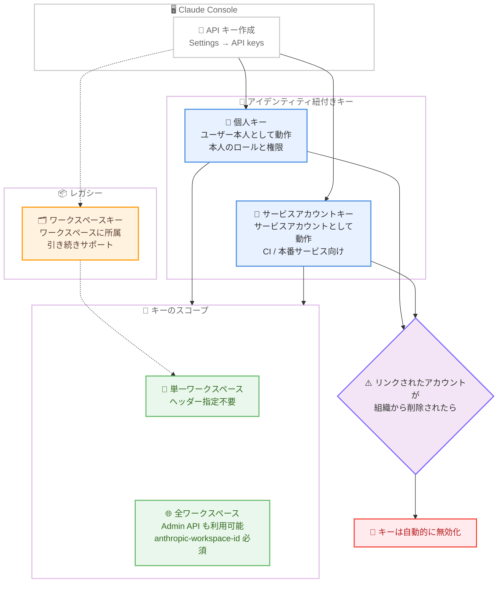

# Claude Console の個人キー / サービスアカウントキー対応と SDK beta 名前空間の GA 形式移行

## メタデータ

| 項目 | 内容 |
|------|------|
| 発表日 | 2026-08-27 |
| ソース | Claude Platform Release Notes |
| カテゴリ | API / SDK / 認証・セキュリティ |
| 公式リンク | https://platform.claude.com/docs/en/release-notes/overview |

## 概要

2026 年 8 月 27 日の Claude Platform リリースノートでは、2 つの重要な更新が発表された。1 つ目は SDK の beta 名前空間の GA 形式への移行で、Python SDK 1.2.0、TypeScript SDK 0.122.0、Go SDK 1.68.0、Java SDK 2.59.0、Ruby SDK 1.67.0、C# SDK 12.44.0 において、`client.beta.files` と `client.beta.skills` が `files-api-2025-04-14` および `skills-2025-10-02` beta ヘッダーを送信しなくなり、GA 版の `client.files` / `client.skills` と同じレスポンス形式を返すようになった。

2 つ目は Claude Console での個人キー (personal keys) とサービスアカウントキー (service account keys) の作成対応である。これらのキーはユーザーまたはサービスアカウントという「アイデンティティ」に紐付き、リンクされたアカウントが組織から削除されると自動的に無効になる。組織管理者にとってはアカウントごとの使用状況の追跡が容易になり、従来のワークスペース API キーはレガシーオプションとして引き続きサポートされる。

## 詳細

### 背景

Files API と Skills API はこれまで beta として提供されており、SDK では `client.beta.files` / `client.beta.skills` という beta 名前空間経由でアクセスし、`files-api-2025-04-14` や `skills-2025-10-02` といった beta ヘッダーが自動的に送信されていた。両 API の GA (一般提供) 化に伴い、SDK の beta 名前空間も GA 形式へ揃えられることになった。

認証面では、従来のワークスペース API キーは「誰のものでもない」キーであり、作成者が組織を離れても動作し続けるため、キーの所有者と実際の利用者の対応関係が不明瞭になるという課題があった。今回の個人キー / サービスアカウントキーの導入により、すべての API キーを組織が管理するアイデンティティに紐付けられるようになった。

### 主な変更点

#### 1. SDK の beta files / skills 統合

対象 SDK バージョンは以下のとおり。

| SDK | バージョン |
|-----|-----------|
| Python | 1.2.0 |
| TypeScript | 0.122.0 |
| Go | 1.68.0 |
| Java | 2.59.0 |
| Ruby | 1.67.0 |
| C# | 12.44.0 |

上記バージョン以降では、次の変更が適用される。

- `client.beta.files` と `client.beta.skills` は `files-api-2025-04-14` / `skills-2025-10-02` beta ヘッダーを送信しなくなった
- レスポンスは `client.files` / `client.skills` と同じ GA 形式となる (型名には `Beta` プレフィックスが付く)
- `client.beta.skills.delete()` は Skill を全バージョンごと削除するようになった (GA 版の仕様「Skill の削除はそのすべてのバージョンも削除する」に統一)
- beta Messages 型 `BetaSkill` は `BetaContainerSkill` にリネームされた
- beta 名前空間は、Managed Agents beta の `scope_id` フィルタリングなど、まだ beta 段階にある機能向けの `betas` 引数を引き続き受け付ける

なお、beta ヘッダーを明示的に送信し続けるリクエストは従来の beta 形式のレスポンスを維持するため、既存の統合は変更を加えるまで動作し続ける。

#### 2. Console での個人キー / サービスアカウントキー

Claude Console の [Settings → API keys](https://platform.claude.com/settings/keys) で、個人キーとサービスアカウントキーを作成できるようになった。ドキュメントによると、キーの種類は以下の 3 つに整理される。

| キーの種類 | 動作主体 | 有効範囲 | 無効になる条件 |
|-----------|---------|---------|--------------|
| 個人キー | 作成したユーザー本人 (そのロールと権限) | 単一ワークスペース、またはロールが API 利用を許可する全ワークスペース | ユーザーが組織またはワークスペースへのアクセスを失ったとき。組織から削除されるとキーはアーカイブされる |
| サービスアカウントキー | サービスアカウント | 単一ワークスペース、またはサービスアカウントがアクセスできる範囲 | サービスアカウントがアーカイブされる、または対象ワークスペースから削除されたとき |
| ワークスペースキー (レガシー) | なし (ワークスペース所属) | 作成されたワークスペースのみ | 期限切れ、無効化・削除、ワークスペースのアーカイブ |

個人キーとサービスアカウントキーは「アイデンティティ紐付き (identity-backed)」であり、次の特徴を持つ。

- すべてのリクエストがそのアイデンティティとして動作し、同じ権限を持つ
- リンクされたアカウントが組織から削除されると、キーは自動的に動作を停止する (キーが所有者より長生きしない)
- 組織管理者はアカウントごとの API 使用状況を追跡しやすくなる
- 特定のワークスペースにスコープするか、管理エンドポイント (Admin API) およびアクセス可能な全ワークスペースで動作させるかを作成時に選択できる

### 技術的な詳細

#### Files API の beta 形式と GA 形式の違い

ドキュメントの移行ガイドによると、beta ヘッダーの有無によるレスポンス形式の違いは以下のとおり。

| 項目 | `files-api-2025-04-14` あり | ヘッダーなし (GA 形式) |
|------|---------------------------|----------------------|
| List レスポンス | `{ data, has_more, first_id, last_id }` | `{ data, next_page }` (`next_page` を `page` クエリパラメータに渡す) |
| List カーソル | `before_id`、`after_id` | `page`、または最大 100 件の `ids[]` (`before_id` / `after_id` は 400 エラー) |
| ファイルオブジェクトの `expires_at` | 返されない | 常に存在 (有効期限なしの場合は `null`) |
| アップロード時の `Content-Type` | 必須 | 省略可能 (省略時は自動検出) |

#### ワークスペースの選択

ワークスペースにスコープされていない個人キー / サービスアカウントキーでリクエストする場合、`anthropic-workspace-id` ヘッダーで対象ワークスペースの ID を指定する必要がある。ヘッダーを省略すると 400 `invalid_request_error` が返される。特定のワークスペースにスコープしたキーではこのヘッダーは不要となる。

また、Admin API は、ワークスペースにスコープされていない個人キーまたはサービスアカウントキーのみを受け付ける。

#### キーの有効期限

キー作成時に有効期限を選択できる。プリセット (3 時間、1 日、7 日、30 日)、カスタム期間、または「Never」から選択可能で、組織に最大有効期限ポリシーがある場合は「Never」は選択できない。有効期限が近づくと、キーの作成者にメール通知が送信される。

## 開発者への影響

### 対象

- `client.beta.files` / `client.beta.skills` を使用している SDK ユーザー (Python、TypeScript、Go、Java、Ruby、C#)
- beta レスポンス型 (`BetaSkill` など) に依存しているコードベース
- ワークスペース API キーで運用している組織の管理者・開発者
- CI / 本番サービスなどの共有・自動化ワークロードを運用するチーム

### 必要なアクション

1. **SDK 更新時の影響確認**: 対象バージョン以降に更新すると、`client.beta.files` / `client.beta.skills` のレスポンス形式が GA 形式に変わる。beta 形式の型 (ページネーションの `has_more` / `first_id` / `last_id` や `BetaSkill` 型) に依存している場合は、移行が完了するまで以前のリリースに留まるか、コードを修正する
2. **`client.beta.skills.delete()` の動作変更に注意**: Skill を全バージョンごと削除するようになったため、特定バージョンのみ削除する意図のコードは見直しが必要
3. **キー戦略の見直し**: 自身の開発・スクリプトには個人キー、CI や本番サービスなどの共有ワークロードにはサービスアカウントキーを使用する。新規統合ではワークスペースキーよりアイデンティティ紐付きキーを優先する
4. **マルチワークスペースキーのヘッダー対応**: ワークスペースにスコープしないキーを使う場合は、`anthropic-workspace-id` ヘッダーを各リクエストに付与する

### 移行ガイド (該当する場合)

**Files API の移行手順** (移行は任意。beta ヘッダーを送信し続ける限り従来形式を維持)。

1. beta ヘッダー `anthropic-beta: files-api-2025-04-14` をリクエストから削除する。SDK では `client.beta.files` の代わりに `client.files` を呼び出す
2. ページネーションを `after_id` / `before_id` ループから `page` / `next_page` カーソル、または SDK の自動ページネーションヘルパーに置き換える
3. `expires_at` フィールドを読み取る (`null` は有効期限なしを意味する)

**ワークスペースキーの置き換え手順**。

1. キーの種類を決める (自身のツールは個人キー、共有・無人ワークロードはサービスアカウントキー)
2. 必要に応じて組織管理者がサービスアカウントを作成し、対象ワークスペースに追加する
3. 新しいキーを作成する (複数ワークスペースが不要なら統合先ワークスペースにスコープする)
4. `ANTHROPIC_API_KEY` 環境変数やシークレットマネージャーのエントリを新しいキーに置き換える
5. リクエストの成功を確認してから、古いワークスペースキーを削除する

## コード例

```python
# Python SDK 1.2.0 以降: GA 形式の Files / Skills API
from anthropic import Anthropic

client = Anthropic()  # ANTHROPIC_API_KEY を読み込む

# GA 名前空間を使用 (beta ヘッダーは不要)
files = client.files.list()

# ワークスペースにスコープされていない個人キー / サービスアカウントキーの場合、
# anthropic-workspace-id ヘッダーが必須
workspace_client = Anthropic(
    default_headers={"anthropic-workspace-id": "wrkspc_01JwQvzr7rXLA5AGx3HKfFUJ"},
)

# Skill の削除は全バージョンを削除する
# (SDK 1.2.0 以降は client.beta.skills.delete() も同じ動作)
client.skills.delete(skill_id="skill_01AbCdEfGhIjKlMnOpQrStUv")
```

## アーキテクチャ図

API キーの種類と権限の関係を以下に示す。



## 関連リンク

- [Claude Platform Release Notes](https://platform.claude.com/docs/en/release-notes/overview)
- [Authentication - API keys](https://platform.claude.com/docs/en/manage-claude/authentication#api-keys)
- [Files API - Migrate from files-api-2025-04-14](https://platform.claude.com/docs/en/build-with-claude/files#migrate-from-files-api-2025-04-14)
- [Skills Guide - Migrate from skills-2025-10-02](https://platform.claude.com/docs/en/build-with-claude/skills-guide#migrate-from-skills-2025-10-02)
- [Workload Identity Federation](https://platform.claude.com/docs/en/manage-claude/workload-identity-federation)
- [Claude Console - API keys 設定](https://platform.claude.com/settings/keys)

## まとめ

今回のリリースは、Files / Skills API の GA 化の総仕上げと、API キー管理のモダナイゼーションという 2 つの流れを示している。SDK の beta 名前空間が GA 形式に統一されたことで、beta と GA の二重管理が解消され、開発者は一貫した型とページネーションで実装できるようになった。beta ヘッダーを明示的に送信すれば従来形式が維持されるため、既存統合への影響は限定的である。

認証面では、個人キーとサービスアカウントキーの導入により、「キーが所有者より長生きしない」というセキュリティ原則が実現された。組織管理者はアカウント単位で使用状況を追跡でき、退職者のキーが残り続けるリスクも解消される。新規統合ではアイデンティティ紐付きキー、あるいはさらに進んで Workload Identity Federation の採用を検討することが推奨される。
