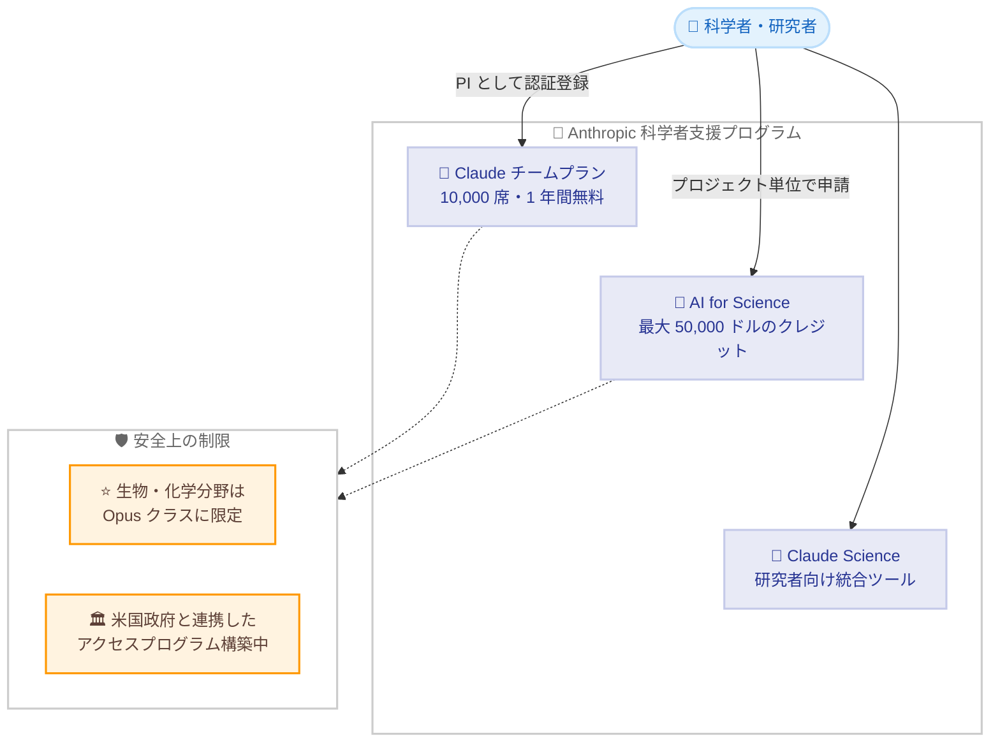

# 科学者向け支援の拡充: Claude チームプラン無料提供と AI for Science プログラムの拡大

## メタデータ

| 項目 | 内容 |
|------|------|
| 発表日 | 2026-08-27 |
| ソース | Anthropic News |
| カテゴリ | 公式発表 / 研究支援プログラム |
| 公式リンク | https://www.anthropic.com/news/expanding-support-for-scientists |

## 概要

Anthropic は 2026 年 8 月 27 日、科学者向けの支援を大幅に拡充すると発表した。世界中の科学者を対象に Claude チームプランの 10,000 席を開放し、標準シートを 1 年間無料で提供する。あわせて、これまで主に生物科学分野を対象としていた AI for Science プログラムを他の科学分野にも拡大し、プロジェクトあたり最大 50,000 ドルの API クレジットを申請できるようにする。

この取り組みは「科学的発見の抜本的な加速 (radically accelerate scientific discovery)」を目的としており、2026 年 6 月に開始した研究者向け製品 Claude Science と連携して、科学研究における AI 活用の裾野を広げるものである。

## 詳細

### 背景

Anthropic はこれまでも AI for Science プログラムを通じて生物科学分野の研究者に API クレジットを提供してきた。過去の成果としては、リーマンゼータ関数に関する研究の進展や、Claude によるタンパク質設計への貢献が挙げられている。また、2026 年 6 月には研究者がよく使うツールを統合し、監査可能な成果物の生成と柔軟なコンピューティングリソースへのアクセスを提供する製品 Claude Science を開始している。

今回の発表は、これらの取り組みをさらに拡大し、より多くの分野・より多くの研究者が Claude を研究に活用できるようにするものである。

### 主な変更点

**1. 科学者向け Claude チームプラン (新プログラム)**

以下の内容で提供される。

- 世界中の科学者向けに 10,000 席を開放
- 標準シートは 1 年間無料
- プレミアムシートは月額 15 ドルで、使用制限が標準の 5 倍
- 今後数か月で、初期の 10,000 席を大幅に超えて拡大する予定

申請条件と方法は以下のとおり。

- 学術機関または非営利研究機関の主任研究者 (PI) またはそれに相当する立場であることが必要
- 認証フォームで登録し、認証後は自分のラボの研究者をプランに追加可能

**2. AI for Science プログラムの拡大**

以下の点が変更される。

- 対象分野を生物科学中心から他の科学分野へ拡大 (計算資源を多く使う野心的な研究を含む)
- プロジェクトあたり最大 50,000 ドルの API クレジットを申請可能
- 申請資格はすべての研究者に開放

### 技術的な詳細 (安全上の制限)

デュアルユース (軍民両用) リスクへの対応として、以下の制限が設けられている。

- 生物学・化学分野の研究者は、当面 Opus クラスのモデルに限定される
- Claude Fable モデルは、専門的な生物学や医薬品開発に関するクエリを引き続きブロックする
- 米国政府と連携し、ライフサイエンス専門家が Mythos クラスモデルを研究開発に使用できるアクセスプログラムを構築中。最初の参加者の登録が完了しており、近く詳細発表とアクセス拡大が予定されている

### プログラムの全体像

## 研究者・ユーザーへの影響

### 対象

- 学術機関または非営利研究機関に所属する主任研究者 (PI) およびそのラボの研究者
- 生物科学に限らず、計算資源を多く使う研究を行うあらゆる分野の研究者
- ライフサイエンス分野の専門家 (米国政府と連携したアクセスプログラムの対象)

### 必要なアクション

以下の手順で各プログラムを利用できる。

1. **Claude チームプラン**: PI が認証フォームで登録し、認証完了後にラボの研究者をプランに追加する
2. **AI for Science クレジット**: プロジェクト単位で最大 50,000 ドルのクレジットを申請する (全研究者が応募可能)
3. **プレミアムシート**: 使用量が多い場合は月額 15 ドルで標準の 5 倍の使用制限を利用できる

### 留意点

- 生物学・化学分野の研究者は、当面利用できるモデルが Opus クラスに限定される
- 専門的な生物学や医薬品開発に関するクエリは、デュアルユースリスクの観点から引き続きブロックされる場合がある

## 関連リンク

- [公式発表: Expanding our support for scientists](https://www.anthropic.com/news/expanding-support-for-scientists)
- [Anthropic News](https://www.anthropic.com/news)

## まとめ

Anthropic は、科学者向けに Claude チームプラン 10,000 席の 1 年間無料提供と、AI for Science プログラムの全分野への拡大 (プロジェクトあたり最大 50,000 ドルのクレジット) を発表した。2026 年 6 月開始の Claude Science と組み合わせることで、研究者が AI を活用するための包括的な支援体制が整備される。一方で、生物学・化学分野についてはデュアルユースリスクに配慮した安全上の制限が維持されており、米国政府と連携した専門家向けアクセスプログラムの構築など、安全性と研究促進の両立を図る姿勢が示されている。研究に AI を取り入れたい研究者にとって、コスト面の障壁が大きく下がる発表である。
