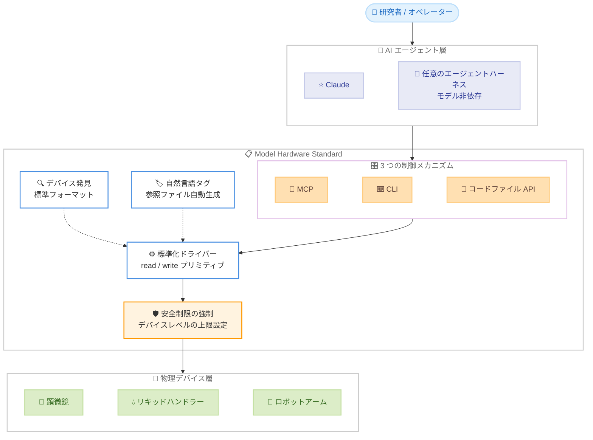
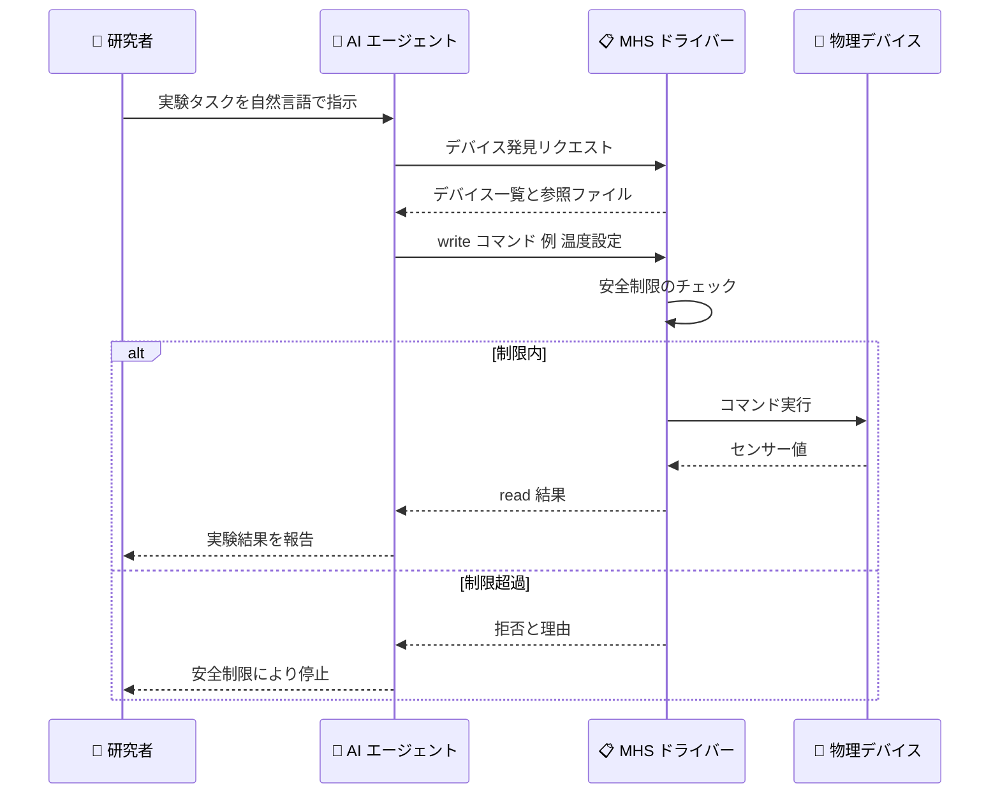

# Model Hardware Standard のリサーチプレビュー開始 - AI エージェントが物理デバイスを安全に操作するための共有仕様

## メタデータ

| 項目 | 内容 |
|------|------|
| 発表日 | 2026-08-27 |
| ソース | Anthropic News |
| カテゴリ | 発表 / Beneficial Deployments |
| 公式リンク | https://www.anthropic.com/news/model-hardware-standard-research-preview |

## 概要

Anthropic は 2026 年 8 月 27 日、AI エージェントが物理デバイスを安全に操作するための共有仕様「Model Hardware Standard (MHS)」のリサーチプレビューを発表した。MHS は Anthropic と HHMI Janelia Research Campus の共同プロジェクトとして開発が始まった標準仕様で、顕微鏡、リキッドハンドラー、ロボットアームなどの複数の機器を、AI エージェントが並行して操作できるようにする。

従来、数週間から数か月を要していたハードウェア統合作業を、MHS は数時間から数分に短縮する。第一陣として科学研究ラボや先端製造業者向けにプレビューが提供され、将来的にはオープンソース化される予定である。

## 詳細

### 背景

ラボオートメーションや先端製造の現場では、機器ごとにベンダー独自のソフトウェアやプロトコルが存在し、複数デバイスを連携させるには専用の統合コードを個別に開発する必要があった。この統合作業は数週間から数か月かかることが一般的であり、AI エージェントを物理世界の実験・製造に活用する際の大きな障壁となっていた。

MHS はこの課題に対し、デバイスの発見・制御・状態取得を標準化した共通仕様を提供することで、モデル非依存かつベンダー非依存の統合レイヤーを実現する。記事では「MHS reduces this integration work to hours or minutes.」と述べられている。

### 主な変更点

MHS の中核となる仕組みは以下のとおり。

- **標準化ドライバー**: OS とハードウェアの間を翻訳するソフトウェア。「read」(例: 温度の取得) や「write」(例: 温度の設定) といった単純なプリミティブで機器を操作する
- **デバイス発見**: 各デバイスを標準フォーマットで発見可能にし、専用の翻訳プログラムなしでネットワーク越しに通信できる
- **自然言語タグ**: ロボットアームの可搬重量など、コードからは読み取れない機器特性をユーザーが自然言語で記述できる (エージェントとの対話でも登録可能)。この情報を基に参照ファイルが自動生成される
- **3 つの制御メカニズム**: MCP (Model Context Protocol)、コマンドラインインターフェース、コードファイル (API) の 3 通りの方法でエージェントがデバイスを制御できる
- **モデル非依存**: 標準プロトコルを使用するため、任意のエージェントハーネスからアクセス可能。プログラマブルなインターフェースを持つあらゆるデバイスに対応する

### 技術的な詳細

- **共有メモリの状態辞書**: HHMI Janelia の事例では、全デバイスの変数・制御・センサー値を共有メモリ上の単一の辞書に格納し、エージェントが全体の状態を一元的に把握できるようにしている
- **長時間タスクへの対応**: エージェントはドライバーコマンドをコードファイルに連結し、逐次推論を挟まない決定論的スクリプトとして実行できる。これにより長時間の実験でも安定した動作が可能になる
- **安全性の設計**: レーザー出力の上限などデバイスレベルの安全制限を強制し、参照ファイルに安全限界の情報を含める。リサーチプレビュー期間中はパートナーと共同で安全性評価を構築し、物理世界での AI 悪用リスクに対する「physical safety roadmap」も策定中である
- **制限事項**: Claude の空間的・物理的推論には限界があり、専門家の監督が必要とされている。例として、気泡によるエラーを物理的な問題と認識できなかった事例が挙げられている

#### 初期パートナーによる事例

| パートナー | 内容 | 成果 |
|-----------|------|------|
| Genentech | BCA タンパク質アッセイの自動化 | Claude が流速を自律最適化 (水: 約 140 µL/s、粘性 BSA: 10 µL/s)。チップ取得失敗などのエラーから自律回復 |
| ワシントン大学 Baker/Pinglay ラボ | qPCR 監視、ロボットアームとリキッドハンドラーの連携 | 6 機器の接続を 1 週間未満で完了。衝突なしのプレート受け渡しを実現 |
| カーネギーメロン大学 | 段階希釈の用量反応実験 | 実験を約 3 倍高速化。統合は 8 時間で完了 (通常は数週間)。6 種の異常条件をすべて事前ブロック |
| HHMI Janelia | ゼブラフィッシュの WHOLISTIC 顕微鏡イメージング | 7 つのベンダープログラムを統一。新規カメラの追加が数日から数分に短縮 |
| QuEra Computing | 量子コンピュータのレーザーロック回復 | 従来スクリプト (150 秒・成功率 58%) をエージェントが一晩で改善し、700 回中 695 回成功 (99.3%)、最速 0.9 秒。PID チューニングも 15.7 mV から 1.55 mV に改善し、19 時間ロックを維持 |
| Tetsuwan Scientific | ResearchOS と統合した qPCR による汚染源特定 | San Pedro Creek で人間由来の糞便汚染を確認。9,143 回の分注テストでメーカー仕様より約 12% 高精度な予測モデルを構築 |

#### 対応ハードウェアベンダー

AWS (Strands Robots)、Automata (LINQ)、Danaher、Doosan Robotics、MBF Bioscience (ScanImage)、QIAGEN (QIAsymphony Connect)、Tecan (Fluent)、Universal Robots、Hugging Face (LeRobot)、Raspberry Pi が対応を表明している。

## 開発者への影響

### 対象

以下の組織・開発者が対象となる。

- 科学研究ラボ (ライフサイエンス、物理学、化学など) の研究者・エンジニア
- ロボティクス、エレクトロニクス、先端製造業の企業
- ラボオートメーション機器のハードウェアベンダー
- AI エージェントを物理デバイス制御に応用したい開発者

### 必要なアクション

- リサーチプレビューへの参加を希望する場合は、modelhardwarestandard.com からウェイトリストに申し込む
- MCP に対応したエージェントハーネスを利用している場合、MHS ドライバー経由でデバイス制御を試すことができる (プレビュー参加者向け)
- ハードウェアベンダーは、自社機器のプログラマブルインターフェースを MHS ドライバーとして公開することを検討する

### 移行ガイド (該当する場合)

現時点では新規仕様のリサーチプレビューであり、既存システムからの移行は不要。オープンソース化の際に、プレビューで得られた知見が安全な導入ガイダンスとして公開される予定である。

## アーキテクチャ図

MHS の全体構成を以下に示す。

エージェントがデバイスを操作する際の流れを以下に示す。

## 関連リンク

- [公式発表: Previewing the Model Hardware Standard](https://www.anthropic.com/news/model-hardware-standard-research-preview)
- [Model Hardware Standard ウェイトリスト](https://modelhardwarestandard.com)
- [HHMI Janelia Research Campus](https://www.janelia.org/)
- [Model Context Protocol](https://modelcontextprotocol.io/)

## まとめ

MHS は、AI エージェントによる物理デバイス操作の統合コストを数週間から数分レベルまで削減する共有仕様である。標準化ドライバー、デバイス発見、自然言語タグ、デバイスレベルの安全制限という設計により、モデル非依存かつベンダー非依存でのハードウェア制御を可能にする。

Genentech や QuEra Computing などの初期パートナーの事例では、実験の約 3 倍高速化やレーザーロック回復の成功率 99.3% への改善など、具体的な成果が示されている。一方で、Claude の空間的・物理的推論には限界があり、専門家の監督が引き続き必要である点も明記されている。将来的なオープンソース化と physical safety roadmap の公開により、AI と物理世界の安全な接続に向けた基盤となることが期待される。

---

*出典: [Anthropic News - Previewing the Model Hardware Standard](https://www.anthropic.com/news/model-hardware-standard-research-preview) (2026 年 8 月 27 日)*
