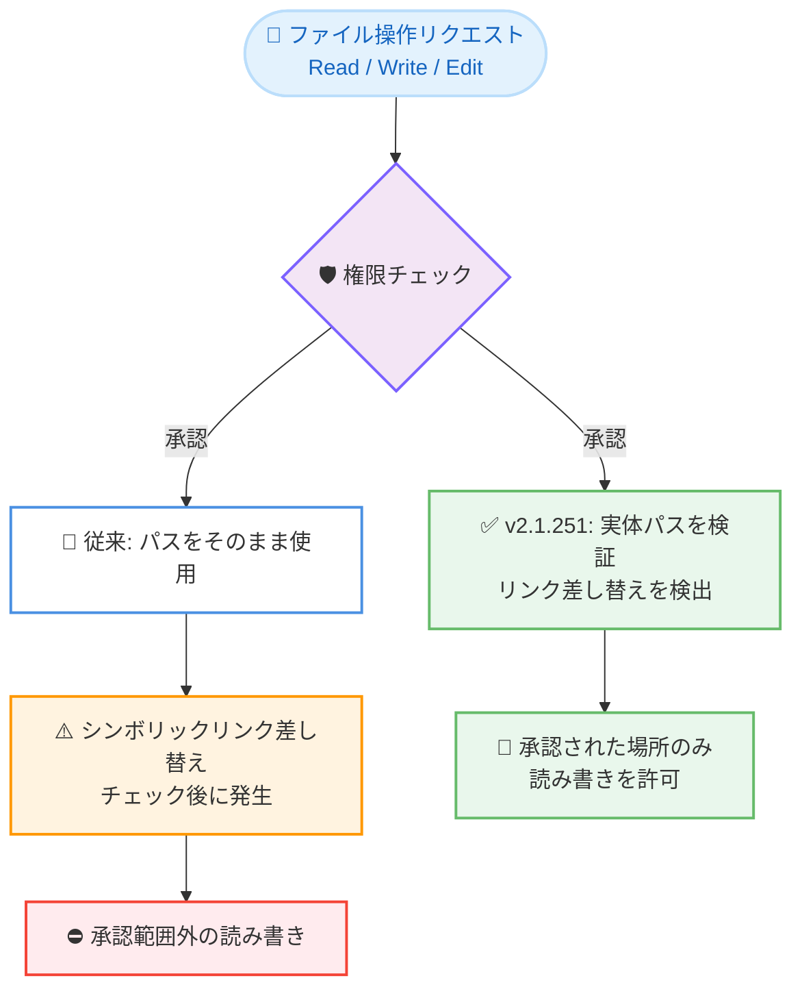

# Claude Code v2.1.251 リリース — モデル切り替えフックの追加、サブエージェントのライブストリーミング、シンボリックリンク経由の権限バイパス修正

## メタデータ

| 項目 | 内容 |
|------|------|
| 発表日 | 2026-08-28 (npm 公開: 15:34 UTC) |
| ソース | Claude Code Changelog |
| カテゴリ | Claude Code アップデート |
| 公式リンク | https://github.com/anthropics/claude-code/blob/main/CHANGELOG.md |

## 概要

Claude Code v2.1.251 が 2026 年 8 月 28 日 (npm レジストリ基準) にリリースされた。

新機能としては、モデル切り替えをブロック・確認・注釈できる `PreModelSwitch` / `PostModelSwitch` フックイベント、フォアグラウンドサブエージェントのツール呼び出しと結果を Remote Control クライアントへライブストリーミングする機能、`/usage` の Spend limit バーと `/cost` のセッション単位プロンプトキャッシュ情報 (ステータスライン用フィールドも同時追加) などが加わった。

修正面では、権限チェック後に作業ディレクトリ内で差し替えられたシンボリックリンクをファイルツールが辿り、承認された場所の外を読み書きできてしまう問題や、マーケットプレイス経由のプラグインコマンドによるパストラバーサル、Grep / Glob がシンボリックリンク経由の検索パスに `Read(...)` の deny ルールを適用しない問題など、セキュリティ関連の修正が多数含まれる。全体では 40 件のバグ修正、10 件の改善、13 件の変更を含む大規模なリリースである。

## 詳細

### 背景

前日の v2.1.248 / v2.1.250 では `--restricted` モードやエージェントごとのプロンプトキャッシュ TTL などが追加された。v2.1.251 はそれに続き、フックによるモデル切り替えの制御、Remote Control の可視性向上、コスト可視化 (`/usage` / `/cost`) の強化を新機能の柱としつつ、シンボリックリンクや設定インジェクションを悪用した権限・ポリシーのバイパス経路を塞ぐセキュリティ修正を数多く含むリリースとなっている。

### 主な変更点

#### 新機能 (Added)

- **`PreModelSwitch` / `PostModelSwitch` フックイベントの追加**: モデル切り替えをブロック、確認、または注釈できるようになった。あわせて、`SessionStart` の resume フックはセッションの陳腐化度 (staleness) と再キャッシュの推定コストを受け取るようになった
- **フォアグラウンドサブエージェントのライブストリーミング**: フォアグラウンドで動作するサブエージェントのツール呼び出しと結果が Remote Control クライアントにライブでストリーミングされるようになった (デフォルトのバックグラウンドサブエージェントは従来どおりステータスのみ表示)
- **`/usage` に Spend limit バーを追加**: 支出上限が設定された Claude apps gateway 配下の開発者向けに、ステータスライン用の `rate_limits.spend_limit` フィールドも追加された
- **`/cost` にセッション単位のプロンプトキャッシュ行を追加**: ヒット率、ミス数、再キャッシュされたトークン数、ウォーム / コールドの状態を表示する。ステータスラインスクリプト向けに対応する `prompt_cache` オブジェクトも追加された
- **`claude --help` にバックグラウンドセッション関連コマンドを追加**: `attach`、`logs`、`stop`、`respawn`、`rm` が掲載されるようになった。また、実行中のバックグラウンドセッションに対する `--resume` のメッセージが、正確な `claude attach <id>` コマンドを提示するようになった

#### 修正 (Fixed)

**セキュリティ:**

- ファイルツール (Read、Write、Edit) が、権限チェック後に作業ディレクトリ内で差し替えられたシンボリックリンクを辿り、承認された場所の外を読み書きできてしまう問題を修正
- マーケットプレイスエントリで宣言されたプラグインコマンドがプラグインディレクトリ外を指定できる問題を修正。該当パスはパストラバーサルエラーとして拒否されるようになった
- プロジェクト設定が詳細なベータトレーシングや生の API ボディログを有効化できてしまう問題、および低スコープのベータトレーシングエンドポイントが managed settings やホストアプリで固定された OTLP コレクターをバイパスする問題を修正
- Workflow ツールが権限チェックの実行前に、セッションが読み取り可能な範囲外の `scriptPath` を読み取り (エラーに引用され) てしまう問題を修正
- Grep と Glob が、シンボリックリンクされた検索パス経由で到達したファイルに `Read(...)` の deny ルールを適用しない問題を修正
- Bash の権限チェックが、整数型シェル変数への算術式代入 (例: `OPTIND=1/0`、`RANDOM=2+2`) を含むコマンドを自動承認してしまう問題を修正。これらは承認を求めるようになった

**モデル・API:**

- モデルが thinking のみを生成したターンの後に、会話が「text content blocks must be non-empty」エラーで先に進めなくなる問題を修正
- effort が xhigh / max で thinking が無効の場合に、Opus 5 のリクエストが「effort … is not supported when thinking is disabled」で失敗する問題を修正。この場合 effort は `high` として送信されるようになった
- `--input-format stream-json` で、message id なしで送信されたクライアント注入のアシスタントツール呼び出しが最初の呼び出しにマージされ、結果が失われる問題 (古いセッションの再開時を含む) を修正
- 現在の Opus モデルがすでに 1M コンテキストウィンドウを持つ場合でも「switch to Opus 1M for 5x more context」のヒントが表示される問題を修正

**サブエージェント・エージェントチーム:**

- 多数の並列サブエージェント実行時の TUI の遅延を修正。毎秒の進捗表示がトランスクリプトに積み重なるのではなく、前の表示を置き換えるようになった
- エージェントチームで、チームメイトの最終回答がチームリードに届かない問題を修正。内容のない「available」通知ではなく、アイドル通知で届くようになった
- バックグラウンドサブエージェントが、名前のない兄弟エージェントや親エージェントからのメッセージに返信できない問題を修正 (`from` がアドレスではなくエージェントタイプだったため)
- Claude Desktop が別セッションから配信したメッセージへの返信を修正。そのセッション id への `SendMessage` が「not reachable」で失敗するのではなく、Claude Desktop 経由で配信されるようになった

**バックグラウンドセッション:**

- バックグラウンドセッションとそのサブエージェントが、`git worktree add` で自ら作成した git worktree 内のファイルを編集できない問題を修正
- 別の Claude Code プロセスがプラグインマーケットプレイスを更新している瞬間に起動したバックグラウンドセッションが、プラグインスキルなしで開始される (そのままになる) ことがある問題を修正
- バックグラウンド化されたセッション (`←`、`/background`、`--bg`) が、シェルでエクスポートされた Vertex / Bedrock ゲートウェイ設定 (`ANTHROPIC_*_BASE_URL` + `CLAUDE_CODE_SKIP_*_AUTH`) を失い、すべてのリクエストが失敗する問題を修正
- Max プランで `claude --bg --model fable` を実行すると、同一アカウントのインタラクティブセッションにはまだ Fable の割り当てが残っているのに、使用量クレジットの確認で停止する問題を修正
- SSH 越しの tmux 内で開いたバックグラウンドセッションのテキスト選択が、OSC 52 にフォールバックせず、フォアグラウンドセッションと同様に tmux バッファへコピーされるようになった
- `/dev/tty` を開くエディタ (`emacs -nw` や `micro` など) で、バックグラウンドセッション内の Ctrl+G が「Emacs quit unexpectedly」で失敗する問題を修正

**クラウド・Remote Control・ゲートウェイ:**

- 組織ポリシーで Remote Control が無効な場合に失敗として報告される問題を修正。控えめな通知を 1 回表示するだけになった
- 別のセッションでサーバーが無効化されていた場合に、Remote Control 上の `/mcp reconnect` が実際の対処法ではなく詳細が伏せられた汎用エラーを表示する問題を修正
- SDK およびクラウドセッションが、SDK MCP サーバーのハンドシェイク確認応答の喪失時に無期限にハングする問題を修正。待機は 70 秒でタイムアウトし、そのサーバーのみ失敗としてマークされるようになった
- セルフホストランナーで、強制停止されたセッションの Bash ツールプロセスが実行されたままになる問題を修正
- Claude apps gateway のセッションが、保存済みの Anthropic プロファイル (例: Console サインイン) をアクティブとして扱い、`/status` に表示したりゲートウェイの 401 をそれでリトライしたりする問題を修正 (リクエストには一切使用されない)
- クラウドセッションで、ホストがセッションの初期モデルを設定しているだけの場合に、モデルが変更されたと Claude に伝えてしまう問題を修正
- `claude ultrareview` と `/ultrareview` が、クラウドセッションの起動に失敗した場合でも 30 分間待機し続ける問題を修正。早期に停止して理由を報告するようになった
- gitlab.com オリジンでのマージリクエスト番号付き `--worktree --tmux` が、GitLab の ref を直接フェッチせず、失敗が確定している GitHub 形式のフェッチを先に試みる問題を修正
- クラウドセッション作成時の一時的な GitHub 接続障害の後に GitHub のセットアップを案内してしまう問題を修正。リトライを促すメッセージになった

**設定・セッション管理:**

- managed settings の `disableAutoMode` がセッション中に適用された場合に、すでに実行中の auto モードセッションがデフォルトモードに戻らない問題を修正
- 新規インストール後の初回起動が、起動デフォルトが auto モードのアカウントでも default モードで開始される問題を修正
- ディレクトリ変更によってセッションが同一 ID の既存トランスクリプトに再配置された際に、セッショントランスクリプトが黙って上書きされる問題を修正
- null バイトを含む `additionalDirectories` エントリが起動をクラッシュさせたり、SDK ホスト・IDE・フック由来の場合に `/add-dir` やその後の設定更新を壊したりする問題を修正。該当エントリはスキップされるようになった
- 無人セッション (例: エージェントチームのチームメイトペイン) に「auto モードをデフォルトにする」という 1 回限りの案内が表示され、意図しないキー入力で読まれないまま承諾されうる問題を修正
- 同じ Claude apps gateway に再サインインした際、設定が変更されていないのに managed settings の承認プロンプトが再表示される問題を修正

**UI・その他:**

- 管理者が組織の使用量クレジット上限を $0 に設定した Team / Enterprise メンバー向けの `/usage-credits` が、上限到達と表示するのではなく管理者への依頼を提案するようになった
- 無効化された `/bug` と `/share` が `/feedback` が無効と報告する問題を修正。組織ポリシーや環境変数で無効化されている場合、ヒント、`/help`、拒否メッセージが `/feedback` を提案しなくなった
- MCP サーバーメニューのコピーショートカットが、常に成功と表示するのではなく、サインイン URL がどのようにコピーされたかを表示するようになった
- GNU screen および `screen` ターミナルタイプの tmux セッションで、イタリック体テキスト (セッション要約行など) がハイライトブロックとして描画される問題を修正
- `claude mcp add --header` と `claude mcp add-json` のヘルプテキストが誤ったトランスポート名を記載していた問題を修正

#### 改善 (Improved)

- **インタラクティブセッションの CPU 使用率を改善**: 冗長な UI 再描画を削減した
- **インストールサイズの削減**: ネイティブバイナリが約 5 MB 小さくなった
- クラウドセッションで、Bash コマンド実行中にネットワークプロキシが接続を切断した場合、ツール結果に「connection reset」だけでなくホスト名と理由が表示されるようになった
- `/schedule` が、素っ気ない「No MCP connectors」ではなく、Claude Code で設定された MCP サーバーはクラウドルーチンにアタッチできないことを説明するようになった
- 自身のサブエージェントからのメッセージについて、送信者が無関係の Claude セッションではなく本セッション内のワーカーであることが Claude に伝わるようになった
- サブエージェントパネルや `/tasks` から開いたバックグラウンドサブエージェントやフォークのトランスクリプト表示中は、プロンプトのプレースホルダーが「Message @name…」と表示されるようになった
- エラーメッセージ、メニュー、コマンド結果における MCP サーバー名のサニタイズを改善
- `CLAUDE_CODE_PROVIDER_MANAGED_BY_HOST` 環境下 (例: Claude Desktop) の Amazon Bedrock セッション開始を改善。Bedrock のモデル ID や ARN を与えられたセッションが推論プロファイル検出を待たなくなった
- managed settings の承認ダイアログが、前回の承認以降に変更された設定のみを一覧表示するようになった
- モデルのツール呼び出しが不正な場合のリトライで、壊れた出力がリトライのコンテキストから除外されるようになった (Bedrock、Vertex、Foundry を含む)

#### 変更 (Changed)

- `/radio` が Bedrock、Vertex AI、Foundry、Claude Platform on AWS、およびテレメトリ無効時にも利用可能になった
- Claude in Chrome のブラウザ操作が、テレメトリ無効のセッションを含め、常に Claude Code の権限チェックを通過するようになった (従来は Chrome 拡張機能自身のプロンプトを使用していた)
- `CLAUDE_CODE_SUBAGENT_MODEL` がすべてを上書きするのではなく、デフォルトのサブエージェントモデルを設定するようになった。エージェント定義の `model:` とスポーンごとの明示的なモデル指定が優先される
- アクティブなモデルが既知の Claude モデルでない場合 (例: カスタム `ANTHROPIC_BASE_URL` 経由のサードパーティモデル)、デフォルトのコミットトレーラーが `Co-Authored-By: Claude Code` になった
- シートベースの Enterprise サブスクリプションのデフォルトモデルが、他のプレミアムプランと同様に Opus 5 になった
- `/effort` がモデルごとにデフォルトの effort レベルを保存し、モデルを切り替えても各モデルが自身の設定を保持するようになった
- managed settings がゲートウェイログインを強制する (または読み取れない) というだけの理由で、サインイン前にアナリティクスが無効化されなくなった。ゲートウェイへのサインイン後や `DISABLE_TELEMETRY` では引き続きオフになる
- Bedrock / Vertex / Foundry およびテレメトリ無効時のフッター PR バッジが、`gh pr view` ではなく GitHub API を直接呼び出すようになった (`gh auth token`、`GH_TOKEN`、`GITHUB_TOKEN` 経由)
- サンドボックス内でのコマンド実行時の Bash コマンド出力ファイルの作成・読み戻し方法が変更され、サンドボックス化されたコマンドがそれらをリダイレクトや差し替えできなくなった
- プラグイン / LSP のインストール提案と auto モードのデフォルト化の案内が、入力中の内容を送信またはクリアするまで待機するようになり、プロンプト送信の Enter がそれらに回答してしまうことがなくなった
- サンドボックスの TLS を終端する、サンドボックストラフィックを独自プロキシ経由にする、資格情報を注入する、サンドボックス分離を弱める server-managed settings は、適用前に承認が必要になった
- managed またはプロジェクト設定からの `ANTHROPIC_CUSTOM_HEADERS` が、資格情報・組織 / テナント・ルーティング・API 動作に関わるヘッダー (例: `Authorization`、`Host`) を設定する場合に承認が必要になった
- プロジェクトレベルの `.claude/settings.json` の `env` で `CLAUDE_CONFIG_DIR`、`CLAUDE_CODE_TMPDIR`、`TMPDIR` / `TMP` / `TEMP` を設定できなくなった。シェル、ユーザー設定、または managed settings で設定する

#### 削除 (Removed)

- ほとんど使用されていない 6 言語 (1c、gml、isbl、mathematica、maxima、sqf) のシンタックスハイライトを削除。バイナリが 2.5 MB 小さくなった

#### VSCode 拡張機能

- サインイン画面の「Bedrock, Foundry, or Vertex」ボタンが、ドキュメントのページ先頭ではなくサードパーティプロバイダーのセットアップセクションを開くようになった
- Remote Control のバナーがフッターピル (Remote Control が有効または失敗している間に表示) に変更され、claude.ai/code でセッションを開けるようになった。`/remote-control` でオン / オフを切り替えられる

### 技術的な詳細

`PreModelSwitch` / `PostModelSwitch` フックイベントは、Claude Code のフックシステムにモデル切り替えという新しいライフサイクルポイントを追加するものである。`PreModelSwitch` では切り替えのブロックや確認 (confirm)、注釈 (annotate) が可能で、組織のポリシーとして特定モデルへの切り替えを制限したり、コストの高いモデルへの変更時に確認を挟んだりといった制御が実現できる。あわせて `SessionStart` の resume フックがセッションの陳腐化度と再キャッシュの推定コストを受け取るため、再開時のコストを考慮した自動化も組みやすくなった。

コストの可視化も強化された。`/cost` にはセッション単位のプロンプトキャッシュ行が追加され、ヒット率、ミス数、再キャッシュされたトークン数、キャッシュのウォーム / コールド状態を確認できる。同じ情報はステータスラインスクリプトに渡される `prompt_cache` オブジェクトとしても利用でき、`/usage` の Spend limit バーと `rate_limits.spend_limit` フィールドと合わせて、支出とキャッシュ効率を常時モニタリングする仕組みを構築できる。

セキュリティ面では、TOCTOU (check-to-use 間の状態変化) 型の攻撃経路が重点的に修正された。権限チェックの後に作業ディレクトリ内のシンボリックリンクを差し替えることで、Read / Write / Edit が承認された範囲の外を読み書きできてしまう問題はその代表例である。Grep / Glob がシンボリックリンク経由の検索パスに `Read(...)` の deny ルールを適用しない問題、Workflow ツールが権限チェック前に範囲外の `scriptPath` を読む問題、プラグインコマンドのパストラバーサルも同系統の修正といえる。さらに、プロジェクト設定によるトレーシング / ログ設定の昇格防止、サンドボックス分離を弱める server-managed settings や機微なヘッダーを設定する `ANTHROPIC_CUSTOM_HEADERS` への承認要求など、設定経由でポリシーを迂回する経路も塞がれている。



## 開発者への影響

### 対象

- フックでモデル切り替えを制御・監査したい開発者や管理者 (`PreModelSwitch` / `PostModelSwitch`)
- Remote Control でサブエージェントの動作を詳細に追跡したいユーザー (フォアグラウンドサブエージェントのライブストリーミング)
- 支出上限やプロンプトキャッシュ効率をモニタリングしたいユーザー・ステータスライン開発者 (`/usage`、`/cost`、`rate_limits.spend_limit`、`prompt_cache`)
- マルチユーザー環境や信頼できないリポジトリで Claude Code を運用する管理者 (シンボリックリンク・パストラバーサル関連のセキュリティ修正)
- managed settings や server-managed settings でポリシーを配布している組織 (承認要求の強化、`disableAutoMode` の即時適用)
- バックグラウンドセッション、エージェントチーム、並列サブエージェントを多用するユーザー (worktree 編集、メッセージング、TUI 遅延の修正)
- Bedrock、Vertex AI、Foundry 経由で利用している組織 (`/radio` 対応、PR バッジ、リトライコンテキスト改善)
- `CLAUDE_CODE_SUBAGENT_MODEL` を使用している開発者 (優先順位の変更)

### 必要なアクション

以下のいずれかの方法で最新バージョンに更新できる。

```bash
# Claude Code 組み込みコマンド
claude update

# npm でのアップデート
npm update -g @anthropic-ai/claude-code

# 現在のバージョン確認
claude --version
```

シンボリックリンク経由の権限バイパスなどセキュリティ関連の修正が多数含まれるため、特に共有環境や自動化環境で運用している場合は早期の更新を推奨する。

モデル切り替えフックを利用する場合は、settings.json のフック設定に `PreModelSwitch` / `PostModelSwitch` イベントを追加する。

```json
{
  "hooks": {
    "PreModelSwitch": [
      {
        "hooks": [
          {
            "type": "command",
            "command": "/path/to/validate-model-switch.sh"
          }
        ]
      }
    ]
  }
}
```

### 移行ガイド (該当する場合)

破壊的変更はアナウンスされていないが、以下の動作変更に留意する。

- **`CLAUDE_CODE_SUBAGENT_MODEL`**: すべてを上書きする挙動から、デフォルト値を設定する挙動に変わった。エージェント定義の `model:` やスポーン時の明示的なモデル指定に依存していなかった場合、サブエージェントの使用モデルが変わる可能性がある
- **プロジェクト設定の `env`**: `CLAUDE_CONFIG_DIR`、`CLAUDE_CODE_TMPDIR`、`TMPDIR` / `TMP` / `TEMP` をプロジェクトレベルの `.claude/settings.json` で設定していた場合は、シェル、ユーザー設定、または managed settings に移動する必要がある
- **`ANTHROPIC_CUSTOM_HEADERS`**: managed またはプロジェクト設定から資格情報・ルーティング系のヘッダーを設定している場合、適用前に承認が求められるようになる
- **シートベース Enterprise のデフォルトモデル**: Opus 5 に変更されたため、従来のデフォルトモデルを継続利用したい場合は明示的に指定する

## 関連リンク

- [Claude Code Changelog](https://github.com/anthropics/claude-code/blob/main/CHANGELOG.md)
- [Claude Code npm パッケージ](https://www.npmjs.com/package/@anthropic-ai/claude-code)
- [Claude Code GitHub リポジトリ](https://github.com/anthropics/claude-code)
- [Claude Code ドキュメント](https://docs.anthropic.com/en/docs/claude-code)
- [Claude Code v2.1.248 / v2.1.250](./2026-08-27-claude-code-v2-1-248-v2-1-250.md)

## まとめ

Claude Code v2.1.251 は、2026 年 8 月 28 日に公開された大規模なリリースである。`PreModelSwitch` / `PostModelSwitch` フックによるモデル切り替えの制御、フォアグラウンドサブエージェントの Remote Control へのライブストリーミング、`/usage` の Spend limit バーと `/cost` のプロンプトキャッシュ情報といった新機能により、ガバナンス・可視性・コスト管理の面が強化された。

特筆すべきはセキュリティ修正の多さである。権限チェック後のシンボリックリンク差し替えによる承認範囲外アクセス、プラグインコマンドのパストラバーサル、Grep / Glob の deny ルール未適用、設定経由でのトレーシング / ログ / サンドボックス設定の昇格など、権限モデルとポリシーの迂回経路が広範に塞がれた。CPU 使用率とインストールサイズの改善も含め、すべてのユーザーに早期のアップデートを推奨できる内容となっている。
