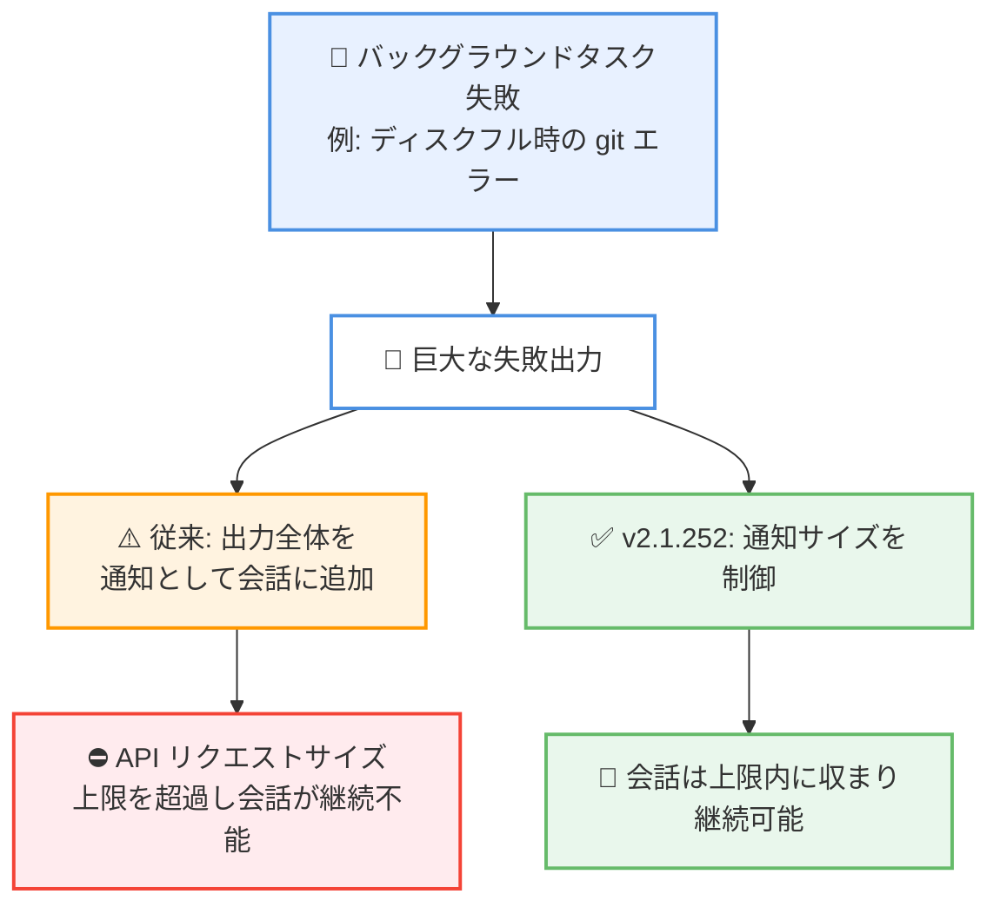

# Claude Code v2.1.252 リリース — Mac での Bash 失敗、権限保存、Remote Control の停滞、大容量通知によるサイズ超過の修正

## メタデータ

| 項目 | 内容 |
|------|------|
| 発表日 | 2026-08-31 (npm 公開: 17:07 UTC) |
| ソース | Claude Code Changelog |
| カテゴリ | Claude Code アップデート |
| 公式リンク | https://github.com/anthropics/claude-code/blob/main/CHANGELOG.md |

## 概要

Claude Code v2.1.252 が 2026 年 8 月 31 日 (npm レジストリ基準) にリリースされた。本バージョンは新機能を含まない、4 件の修正 (Fixed) のみで構成されるバグ修正リリースである。

修正内容は、一部の Mac で Bash コマンドが「task output swap refused」エラーで失敗する問題、`.claude/settings.local.json` が存在しないプロジェクトで「always allow」(常に許可) が保存されない問題、claude.ai への接続品質が低下した際に Claude Desktop や VS Code がホストする Remote Control セッションが数分間停滞する問題、そして非常に大きな失敗出力を持つバックグラウンドタスク通知が API リクエストサイズ上限を超過させる問題の 4 件である。いずれも日常的なワークフローの安定性に直結する修正であり、該当する症状に遭遇していたユーザーには早期のアップデートを推奨できる。

## 詳細

### 背景

前リリースの v2.1.251 (2026 年 8 月 28 日) は、モデル切り替えフックの追加やシンボリックリンク関連のセキュリティ修正を含む大規模なリリースだった。v2.1.252 はその直後のフォローアップにあたる小規模なリリースで、Mac 環境の Bash 実行、権限設定の永続化、Remote Control の応答性、バックグラウンドタスク通知という 4 つの領域で発生していた不具合を修正している。

### 主な変更点

本リリースの変更はすべて修正 (Fixed) である。

#### 1. Mac での Bash コマンド失敗の修正

一部の Mac で、Bash コマンドが「task output swap refused (tasks dir moved or linked)」というエラーで失敗する問題を修正した。

このエラーは、Claude Code がタスク出力の書き込みに使用するディレクトリが移動またはリンクされていると判定された場合に発生する安全機構によるものである。v2.1.251 では、サンドボックス化されたコマンドが Bash コマンドの出力ファイルをリダイレクトや差し替えできないように、出力ファイルの作成・読み戻し方法が変更されていた。今回の修正により、macOS の一部環境でこのチェックが誤検知し、正当な Bash コマンドまで実行できなくなっていた問題が解消された。

#### 2. 「always allow」が保存されない問題の修正

`.claude/settings.local.json` がまだ存在しないプロジェクトで、権限プロンプトの「always allow」(常に許可) 選択が保存されない問題を修正した。

「always allow」を選択すると、通常は該当ツールやコマンドの許可ルールがプロジェクトの `.claude/settings.local.json` に書き込まれ、以降のセッションでは同じ操作に対する確認が不要になる。しかし、このファイルが未作成のプロジェクトでは保存が行われず、セッションをまたぐたびに同じ許可プロンプトが再表示されていた。修正後は、ファイルが存在しない場合でも許可ルールが正しく永続化される。

#### 3. Remote Control セッションの停滞の修正

Claude Desktop または VS Code がホストする Remote Control セッションで、claude.ai への接続品質が低下している場合に、ツールの実行完了後もセッションが数分間停滞する問題を修正した。

Remote Control は、ローカルで動作する Claude Code セッションを claude.ai 経由で遠隔操作できる機能である。接続が劣化した状態では、ツールが完了してもその結果の反映や次のステップへの進行が数分間ブロックされることがあった。修正により、接続品質が低下している状況でもツール完了後の応答が停滞しなくなった。

#### 4. 大容量の失敗出力による API リクエストサイズ超過の修正

非常に大きな失敗出力を持つバックグラウンドタスク通知 (例: ディスクフル時の git エラー) が、会話全体を API リクエストサイズの上限を超過させてしまう問題を修正した。

バックグラウンドタスクが失敗すると、その出力は通知として会話コンテキストに取り込まれる。ディスク容量が枯渇した状態での git 操作のように、失敗時に膨大なエラー出力が生成されるケースでは、通知が会話に追加された時点で API リクエストが上限サイズを超え、以降のやり取りが継続できなくなっていた。修正後は、大容量の失敗出力が原因で会話そのものが機能不全に陥ることがなくなった。

### 技術的な詳細

4 件の修正はいずれも、エッジケースにおける堅牢性の改善という共通点を持つ。

- **誤検知の解消**: Mac での「task output swap refused」は、出力ファイル差し替え対策として導入された安全機構が特定の macOS 環境で正当な操作を誤って拒否していたケースであり、セキュリティチェックの精度が改善された
- **初期状態の考慮**: 「always allow」の保存失敗は、設定ファイルが存在しない初期状態のプロジェクトという境界条件の処理漏れであり、新規プロジェクトでの利用開始時の体験が改善された
- **劣化した接続への耐性**: Remote Control の停滞修正により、ネットワーク品質が不安定な環境でもホストアプリ経由のセッションが実用的な応答性を維持できるようになった
- **入力サイズの制御**: バックグラウンドタスク通知の修正は、外部要因 (ディスクフルなど) で生成される予測不能なサイズの出力が、API の制約を通じて会話全体を巻き込んで失敗させないための防御である



## 開発者への影響

### 対象

- macOS で Claude Code を使用しており、「task output swap refused」エラーで Bash コマンドが失敗していたユーザー
- 新規プロジェクトや `.claude/settings.local.json` 未作成のプロジェクトで「always allow」を利用するユーザー
- Claude Desktop や VS Code から Remote Control セッションをホストしているユーザー (特にネットワーク品質が不安定な環境)
- バックグラウンドタスクを多用し、大量のエラー出力が発生しうる環境 (CI、ディスク容量が逼迫したマシンなど) で運用しているユーザー

### 必要なアクション

以下のいずれかの方法で最新バージョンに更新できる。

```bash
# Claude Code 組み込みコマンド
claude update

# npm でのアップデート
npm update -g @anthropic-ai/claude-code

# 現在のバージョン確認
claude --version
```

設定変更や移行作業は不要である。上記のいずれかの症状に遭遇していた場合は、アップデート後に解消されているか確認するとよい。

### 移行ガイド (該当する場合)

本リリースに破壊的変更はない。API、設定ファイル、フックなどの仕様変更も含まれないため、移行作業は不要である。

## 関連リンク

- [Claude Code Changelog](https://github.com/anthropics/claude-code/blob/main/CHANGELOG.md)
- [Claude Code npm パッケージ](https://www.npmjs.com/package/@anthropic-ai/claude-code)
- [Claude Code GitHub リポジトリ](https://github.com/anthropics/claude-code)
- [Claude Code ドキュメント](https://docs.anthropic.com/en/docs/claude-code)
- [Claude Code v2.1.251](./2026-08-28-claude-code-v2-1-251.md)

## まとめ

Claude Code v2.1.252 は、2026 年 8 月 31 日に公開された修正のみの小規模リリースである。一部の Mac における Bash コマンドの実行失敗、設定ファイル未作成プロジェクトでの「always allow」の保存漏れ、接続劣化時の Remote Control セッションの停滞、大容量の失敗出力による API リクエストサイズ超過という 4 件の不具合が修正された。

新機能はないものの、Bash 実行、権限管理、Remote Control、バックグラウンドタスクという日常的に使用される機能の安定性を高める内容であり、該当する環境で運用しているユーザーには早めのアップデートを推奨する。
