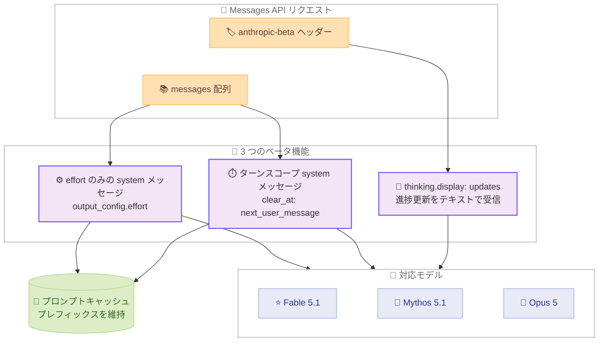

# Claude API に 3 つの新ベータ機能が登場: メッセージ単位の effort 変更、ターンスコープのシステムメッセージ、thinking.display の "updates" 値

## メタデータ

| 項目 | 内容 |
|------|------|
| 発表日 | 2026-09-01 |
| ソース | Claude API リリースノート |
| カテゴリ | API 更新 / ベータ機能 |
| 公式リンク | https://platform.claude.com/docs/en/release-notes/overview |

## 概要

2026 年 9 月 1 日、Claude API リリースノートで 3 つの新しいベータ機能が発表されました。いずれも長時間動作するエージェントワークフローを念頭に置いた機能で、プロンプトキャッシュを維持したまま会話の途中で挙動を調整できる点が共通しています。

1. **メッセージ単位の effort 変更 (ベータ)**: `mid-conversation-output-config-2026-07-01` ベータヘッダー。プロンプトキャッシュを保持したまま、会話の途中で以降のターンの effort レベルを変更できます
2. **ターンスコープのシステムメッセージ (ベータ)**: `mid-conversation-system-clear-at-2026-08-21` ベータヘッダー。`clear_at: "next_user_message"` を指定すると、現在のターンのみ有効なリマインダーを設定できます
3. **thinking.display の第 3 の値 "updates" (ベータ)**: `thinking-display-updates-2026-08-18` ベータヘッダー。推論内容は非表示のまま、ツール呼び出し間の短い進捗更新をテキストで受信できます

なお、同日に Claude Fable 5.1 / Claude Mythos 5.1 モデルもリリースされていますが、モデル自体の詳細は別レポートで扱います。

## 詳細

### 背景

長時間のエージェントタスクでは、会話の途中で「effort を下げたい」「一時的なリマインダーを挿入したい」「ユーザーにステータスを見せたい」といったニーズが発生します。従来はこれらの操作の多くがプロンプトの先頭部分の変更を伴い、プロンプトキャッシュを無効化してコストとレイテンシが増加する課題がありました。今回の 3 つのベータ機能は、いずれもキャッシュされたプレフィックスを壊さずに会話途中の制御を可能にするものです。

### 主な変更点

#### 1. メッセージ単位の effort 変更 (ベータ)

- **ベータヘッダー**: `mid-conversation-output-config-2026-07-01`
- **対象モデル**: Claude API 上の Claude Fable 5.1、Claude Mythos 5.1、Claude Opus 5

`messages` 配列内に、空の `content` と `output_config.effort` を持つ `role: "system"` メッセージを追加すると、次の `user` ターン以降の effort レベルを変更できます。指定できる値は `low`、`medium`、`high`、`xhigh`、`max` です。

主なポイントは以下のとおりです。

- **プロンプトキャッシュを保持**: 変更点より前のメッセージは一切変わらないため、キャッシュされたプレフィックスがそのまま一致します。トップレベルの `output_config.effort` をリクエスト間で変更する従来の方法では、キャッシュが最初からやり直しになります
- **配置の自由度**: effort のみのシステムメッセージにはテキストが含まれないため、通常の会話途中システムメッセージの配置ルールは適用されません。`messages` の先頭や `assistant` ターンと次の `user` ターンの間を含め、どこにでも配置できます
- **非対応モデルの挙動**: メッセージ単位の effort をサポートしないモデル (Claude Fable 5 を含む) では 400 エラーが返ります
- **推奨**: 公式ドキュメントによると、Claude Fable 5.1 ではリクエスト間でトップレベル値を変更するよりこの形式が推奨されています。トップレベルの変更はキャッシュを無効化するうえ、モデルが以前のレベルで書かれた過去の応答との一貫性を保とうとするため、ステアリングの効きも弱くなります

#### 2. ターンスコープのシステムメッセージ (ベータ)

- **ベータヘッダー**: `mid-conversation-system-clear-at-2026-08-21`
- **対象**: 会話途中システムメッセージと同じモデル・プラットフォーム

会話途中の `role: "system"` メッセージに `clear_at` フィールドを設定できます。値は 2 つです。

- **`"never"` (デフォルト)**: メッセージを含むすべてのリクエストで、その位置にレンダリングされます。フィールドを省略した場合と同じです
- **`"next_user_message"`**: メッセージがターンスコープになります。テキストは、そのメッセージより後に `role: "user"` メッセージが存在しない間だけレンダリングされます。後続のユーザーメッセージが存在すると「クリア」され、配列には残るものの何もレンダリングせず、入力トークンコストもゼロになります

主な用途はツールループでのターンごとのリマインダーです。`tool_result` メッセージの後にリマインダーを毎回追加しても、モデルには最後のユーザーメッセージ以降のコピーしか見えないため、リマインダーが蓄積しません。`messages` の先頭側は何も変わらないので、プロンプトキャッシュは一致し続け、Claude Fable 5.1 では後続の thinking ブロックの有効性も保たれます。

ドキュメントに記載されている主なルールは以下のとおりです。

- **クリア済みメッセージは一言一句同じ内容で再送する**: 内容の再構築や削除、`clear_at` 値の変更は過去メッセージの編集と見なされ、その時点からキャッシュミスが発生します
- **テキストのみ**: `content` はテキストブロック (または文字列) のみ。`tool_addition` / `tool_removal` ブロックや `output_config` は 400 エラーになります
- **`cache_control` は付与不可**: クリア済みメッセージはキャッシュキーに含まれないため、ブレークポイントは直前のユーザーターンの最後のブロックに置きます
- **トークンカウントはレンダリング結果に従う**: クリア済みメッセージは `usage.input_tokens` にもトークンカウントにも加算されません

#### 3. thinking.display の第 3 の値 "updates" (ベータ)

- **ベータヘッダー**: `thinking-display-updates-2026-08-18`
- **対象モデル**: 進捗更新を書き込むのは Claude Fable 5.1、Claude Mythos 5.1、Claude Fable 5

`thinking.display` が既存の `"summarized"` と `"omitted"` に加えて、第 3 の値 `"updates"` を受け付けるようになりました。推論ブロックは `"omitted"` と同様に空の `thinking` フィールドで返りますが、モデルがツール呼び出しの間に書く短い進捗更新はテキストとして返ります。

進捗更新の特徴は以下のとおりです。

- **内容**: モデルが直前に見つけたことと次に行うことを 1〜2 文で説明する、エージェントを見ている人向けのテキストです
- **形式**: 各進捗更新は独自の `signature` を持つ独立した `thinking` ブロックとして返り、紹介する `tool_use` または `server_tool_use` ブロックの直前に配置されます。各ツール呼び出しの前に最大 1 つで、モデルはスキップすることもあります
- **display 値ごとの挙動**: `"omitted"` では推論も進捗更新も空、`"updates"` では推論は空で進捗更新のみテキスト、`"summarized"` では両方テキスト (区別不可) です
- **ハンドリング**: `"updates"` の下では、テキストが空でない `thinking` ブロックはすべて進捗更新なので、それだけを表示すればステータスラインとして使えます。進捗更新ブロックは他の `thinking` ブロックと同様、変更せずにそのまま返送します
- **ストリーミング**: `"updates"` では進捗更新ブロックのみが `thinking_delta` イベントをストリーミングします。進捗更新ブロックが開くまでに数秒の間が空くのは正常な動作です
- **ヘッダーなしの挙動**: ベータヘッダーなしで `"updates"` を指定すると、未知の `display` 値と同じ 400 `invalid_request_error` が返ります

### 技術的な詳細

3 つの機能はいずれも「会話の先頭側を変更しない」設計になっており、プロンプトキャッシュとの整合性が保たれます。effort のみのシステムメッセージとターンスコープのシステムメッセージは、どちらも `messages` 配列に追記する形で機能するため、キャッシュされたプレフィックスはそのまま有効です。

Amazon Bedrock、Google Cloud、Microsoft Foundry では、ベータヘッダーの代わりに各プラットフォームの方法でベータ値を渡します。詳細は公式ドキュメントの Beta headers を参照してください。

## 開発者への影響

### 対象

- 長時間のエージェントループを実装している開発者
- プロンプトキャッシュのヒット率を維持しながら会話途中の制御を行いたい開発者
- 推論内容を非表示にしつつ、ユーザーにエージェントの進捗を見せたい UI 開発者

### 必要なアクション

いずれもオプトインのベータ機能であり、既存のリクエスト・レスポンス処理への変更は不要です。利用する場合は以下を行います。

1. 対応する `anthropic-beta` ヘッダーをリクエストに追加する
2. メッセージ単位の effort は対象モデル (Claude Fable 5.1、Claude Mythos 5.1、Claude Opus 5) でのみ利用可能なため、モデルの対応状況を確認する
3. `display: "updates"` を使う場合、テキストが空でない `thinking` ブロックのみを表示するようクライアントを実装する

### 移行ガイド (該当する場合)

- **effort 変更**: これまでリクエスト間でトップレベルの `output_config.effort` を変更していた場合、対応モデルではメッセージ単位の effort への移行によりキャッシュ無効化を回避できます
- **ターンごとのリマインダー**: 従来ユーザーメッセージに埋め込んでいたリマインダーは、ターンスコープのシステムメッセージに置き換えることで、蓄積によるトークンコスト増加を防げます

## コード例

### 1. メッセージ単位の effort 変更

`high` で開始し、定型的なフォローアップで `low` に下げる例です (公式ドキュメントより)。

```python
import anthropic

client = anthropic.Anthropic()

response = client.beta.messages.create(
    model="claude-fable-5-1",
    max_tokens=4096,
    output_config={"effort": "high"},
    messages=[
        {
            "role": "user",
            "content": "Plan a migration from SQLite to PostgreSQL in three short steps.",
        },
        {
            "role": "assistant",
            "content": "1. Export the SQLite data. 2. Create the PostgreSQL schema. 3. Import the data and verify row counts.",
        },
        # effort のみのシステムメッセージ: 次の user ターンから新しいレベルが有効
        {"role": "system", "content": [], "output_config": {"effort": "low"}},
        {"role": "user", "content": "Summarize the plan in one sentence."},
    ],
    betas=["mid-conversation-output-config-2026-07-01"],
)
```

### 2. ターンスコープのシステムメッセージ

`tool_result` の後に、現在のターンのみ有効なリマインダーを追加する例です。

```json
{
  "role": "system",
  "clear_at": "next_user_message",
  "content": "Request independent reads in one turn."
}
```

リクエストには `anthropic-beta: mid-conversation-system-clear-at-2026-08-21` ヘッダーを含めます。後続のユーザーメッセージが追加された後も、このメッセージは配列に残したまま一言一句同じ内容で再送します。

### 3. thinking.display の "updates"

```json
{
  "model": "claude-fable-5-1",
  "max_tokens": 16000,
  "thinking": { "type": "adaptive", "display": "updates" },
  "messages": [
    {
      "role": "user",
      "content": "The login test fails after an hour of uptime. Find out why and fix it."
    }
  ]
}
```

リクエストには `anthropic-beta: thinking-display-updates-2026-08-18` ヘッダーを含めます。レスポンスでは、推論ブロックは空の `thinking` フィールドで返り、進捗更新のみテキストを持ちます。

```json
{
  "content": [
    {
      "type": "thinking",
      "thinking": "",
      "signature": "EqMBCkYICxIM..."
    },
    {
      "type": "thinking",
      "thinking": "Confirmed the retry path never refreshes the expired token. Editing auth.py to add the refresh call.",
      "signature": "Es8CCkYICxIM..."
    },
    {
      "type": "tool_use",
      "id": "toolu_01D7FLrfh4GYq7yT1ULFeyMV",
      "name": "edit_file",
      "input": { "path": "auth.py", "content": "..." }
    }
  ]
}
```

## アーキテクチャ図

3 つのベータ機能とプロンプトキャッシュの関係を示します。



## 関連リンク

- [Claude API リリースノート](https://platform.claude.com/docs/en/release-notes/overview)
- [Per-message effort (beta)](https://platform.claude.com/docs/en/build-with-claude/effort#change-effort-mid-conversation-beta)
- [Turn-scoped system messages](https://platform.claude.com/docs/en/build-with-claude/mid-conversation-system-messages#turn-scoped-system-messages)
- [Progress updates between tool calls](https://platform.claude.com/docs/en/build-with-claude/thinking#progress-updates)
- [Beta headers](https://platform.claude.com/docs/en/api/beta-headers)
- [Prompt caching](https://platform.claude.com/docs/en/build-with-claude/prompt-caching)

## まとめ

2026 年 9 月 1 日に発表された 3 つのベータ機能は、いずれも「会話の先頭側を変えずに途中の挙動を制御する」という共通の設計思想を持っています。メッセージ単位の effort 変更はコストと品質のトレードオフをターン単位で調整可能にし、ターンスコープのシステムメッセージは蓄積しないリマインダーを実現し、`thinking.display: "updates"` は推論を隠しつつエージェントの進捗を可視化します。長時間のエージェントワークフローでプロンプトキャッシュに依存する開発者にとって、実用性の高いアップデートです。ベータ機能のため仕様は変更される可能性があり、最新情報は公式ドキュメントを参照してください。
