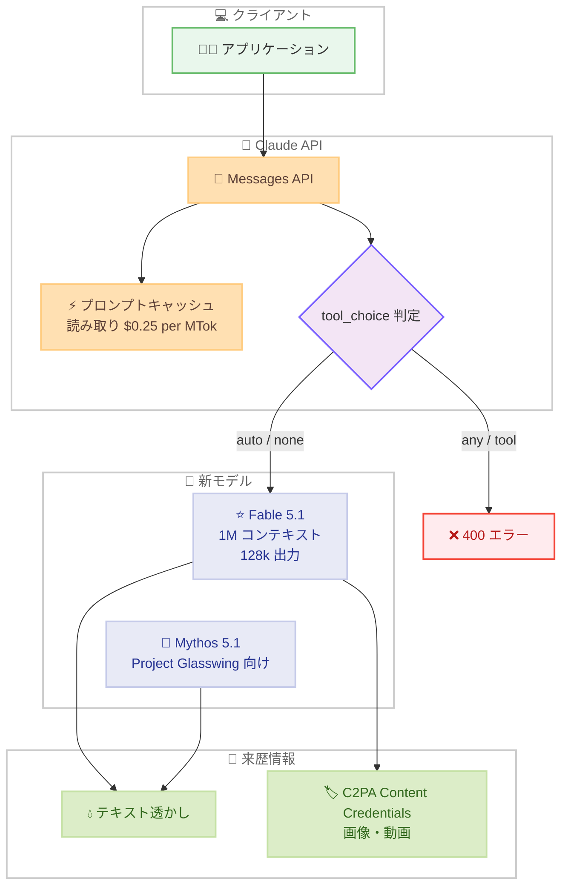

# Claude Fable 5.1 と Claude Mythos 5.1 の発表

## メタデータ

| 項目 | 内容 |
|------|------|
| 発表日 | 2026-09-01 |
| ソース | Anthropic News / Claude API リリースノート |
| カテゴリ | 新モデルリリース |
| 公式リンク | https://www.anthropic.com/claude-fable-and-mythos-5-1 |

## 概要

Anthropic は 2026 年 9 月 1 日、コーディングとナレッジワーク向けの最先端モデルとして **Claude Fable 5.1** (`claude-fable-5-1`) と **Claude Mythos 5.1** (`claude-mythos-5-1`) をリリースした。両モデルは Claude Fable 5 の後継として、長時間実行のエージェント型コーディング、ナレッジワーク、研究用途に最適化されている。1M トークンのコンテキストウィンドウ (デフォルト)、128k の最大出力トークン、常時オンのアダプティブ思考 (adaptive thinking) をサポートする。

価格は $10/$50 per MTok と Fable 5 から据え置きである一方、プロンプトキャッシュ読み取りは $0.25 per MTok (基本入力価格の 0.025 倍) に引き下げられた。あわせて `tool_choice` の挙動変更や思考ブロックの互換性ポリシーなど、開発者が対応すべき API 挙動の変更も含まれている。

## 詳細

### 背景

Claude Fable 5 は長時間実行のエージェントタスクに強みを持つモデルとして提供されてきた。Fable 5.1 と Mythos 5.1 はその後継として、エージェント型コーディングと研究ワークフローの性能をさらに強化したモデルである。Mythos 5.1 は Project Glasswing 参加者向けに提供される。

両モデルは以下のプラットフォームで利用可能である。

- Claude API
- Amazon Bedrock / Claude Platform on AWS
- Google Cloud
- Microsoft Foundry

### 主な変更点

**モデル仕様**

| 項目 | 内容 |
|------|------|
| モデル ID | `claude-fable-5-1`、`claude-mythos-5-1` |
| コンテキストウィンドウ | 1M トークン (デフォルト) |
| 最大出力トークン | 128k |
| 思考 | 常時オンのアダプティブ思考 |
| 価格 | $10 (入力) / $50 (出力) per MTok |

**価格**

- **基本価格**: $10/$50 per MTok で Fable 5 と同額
- **プロンプトキャッシュ読み取り**: $0.25 per MTok に引き下げ。基本入力価格の 0.025 倍で、他モデルの 0.1 倍と比較して大幅に低い比率
- **キャッシュ書き込み**: 変更なし

**tool_choice の制限**

- `tool_choice` の `any` と `tool` タイプが非サポートとなり、指定すると 400 エラーを返す
- `auto` と `none` は変更なし
- スキーマ準拠のツール入力を保証したい場合は、strict tool use または structured outputs の使用が推奨される

**思考ブロックの互換性**

- Fable 5.1 / Mythos 5.1 が生成した思考ブロックは、生成したモデル自身またはそれより新しいモデルのみが読み取り可能。古いモデルに再送すると API がブロックを破棄する
- Fable 5.1 は Claude Opus 5、Fable 5、Mythos 5 および以前のモデルの思考ブロックを受け入れ可能
- Fable 5.1 では思考ブロック以前の履歴が変更されていないかを API が検証する。2026 年 8 月 31 日以降に作成されたアカウントでは、`system` プロンプト、`tools`、以前のメッセージが変更された後にブロックを再送すると 400 エラーとなる
- `thinking-binding-controls-2026-08-01` ベータヘッダーにより、破棄されたブロックを `input_transformations` フィールドで報告させたり、`prefix_mismatch_behavior` で拒否 / 破棄を選択したりできる

**コンテンツの来歴表示**

- 生成テキストに Anthropic のテキスト透かしを付与
- コード実行ツール経由で生成された画像・動画ファイルに C2PA Content Credentials を付与 (リクエスト側の変更は不要)

**データ保持**

- 両モデルとも 30 日間のデータ保持が必須
- ゼロデータ保持は Anthropic の明示的な許可がない限り原則利用不可

### 技術的な詳細

リリースノートでは、両モデルとあわせて以下のベータ機能も案内されている。

- **ターン途中の effort 変更** (`mid-conversation-output-config-2026-07-01` ヘッダー): `messages` 内の `role: "system"` メッセージに `output_config.effort` を追加し、プロンプトキャッシュを維持したまま effort を変更可能。対象は Fable 5.1、Mythos 5.1、Opus 5
- **ターンスコープのシステムメッセージ** (`mid-conversation-system-clear-at-2026-08-21` ヘッダー): `clear_at: "next_user_message"` を設定すると現在のターンのみ有効となる
- **思考の進捗表示** (`thinking-display-updates-2026-08-18` ヘッダー): `thinking.display: "updates"` を指定すると、思考内容は空のまま、ツール呼び出し間の短い進捗更新をテキストで返す

また、Claude Code v2.1.257 では `claude-fable-5-1` がデフォルトの Fable モデルとなった。

## 開発者への影響

### 対象

- Claude API で `tool_choice` の `any` または `tool` を使用している開発者
- 複数モデル間で会話履歴 (思考ブロックを含む) を共有しているアプリケーションの開発者
- プロンプトキャッシュを多用する長時間実行エージェントの開発者
- ゼロデータ保持契約を利用している組織

### 必要なアクション

1. **tool_choice の見直し**: `any` / `tool` を使用しているコードは 400 エラーとなるため、strict tool use または structured outputs へ移行する
2. **思考ブロックの取り扱い確認**: 会話履歴を古いモデルに再送するフローがある場合、ブロックが破棄されることを前提に設計を見直す。挙動を制御したい場合は `thinking-binding-controls-2026-08-01` ベータヘッダーを検討する
3. **履歴の不変性確認**: 2026 年 8 月 31 日以降に作成されたアカウントでは、思考ブロック再送時に履歴改変が 400 エラーとなるため、履歴を書き換えるロジックがないか確認する
4. **データ保持ポリシーの確認**: ゼロデータ保持を利用している場合は、両モデルの利用可否を Anthropic に確認する

### 移行ガイド (該当する場合)

Fable 5 から Fable 5.1 への移行では、モデル ID を `claude-fable-5-1` に変更するだけで基本的な動作は維持される。ただし、上記の `tool_choice` 制限と思考ブロックの互換性ポリシーに該当する実装は事前に修正が必要である。

## コード例

```python
import anthropic

client = anthropic.Anthropic()

message = client.messages.create(
    model="claude-fable-5-1",
    max_tokens=128000,
    tools=[
        {
            "name": "get_weather",
            "description": "指定した都市の天気を取得する",
            "input_schema": {
                "type": "object",
                "properties": {
                    "city": {"type": "string"},
                },
                "required": ["city"],
            },
            # tool_choice の any / tool は非サポートのため、
            # スキーマ準拠を保証したい場合は strict tool use を使用する
            "strict": True,
        }
    ],
    messages=[
        {"role": "user", "content": "東京の天気を教えてください。"}
    ],
)

print(message.content)
```

## アーキテクチャ図 (該当する場合)



## 関連リンク

- [Claude Fable and Mythos 5.1 発表 (Anthropic News)](https://www.anthropic.com/claude-fable-and-mythos-5-1)
- [Claude Developer Platform リリースノート](https://platform.claude.com/docs/en/release-notes/overview)
- [Claude Code Changelog](https://github.com/anthropics/claude-code/blob/main/CHANGELOG.md)

## まとめ

Claude Fable 5.1 と Claude Mythos 5.1 は、1M トークンコンテキスト、128k 出力トークン、常時オンのアダプティブ思考を備えた、エージェント型コーディングとナレッジワーク向けの最先端モデルである。基本価格は据え置きのまま、プロンプトキャッシュ読み取りが基本入力価格の 0.025 倍まで引き下げられたことで、長いコンテキストを繰り返し利用するエージェントワークロードのコスト効率が大きく向上する。

一方で、`tool_choice` の `any` / `tool` の廃止、思考ブロックの互換性ポリシー、30 日間のデータ保持必須化など、既存アプリケーションに影響する変更も含まれる。移行前に該当箇所の確認と修正を推奨する。
