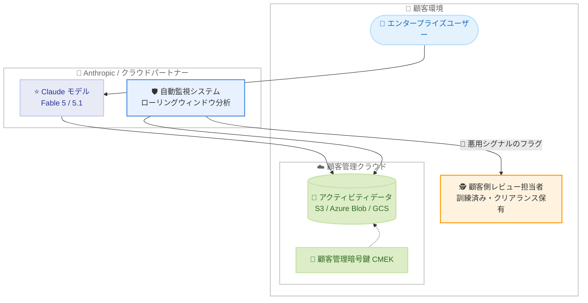

# Enterprise Frontier Safeguards: 顧客と共に開発するエンタープライズ向けフロンティアセーフガード

## メタデータ

| 項目 | 内容 |
|------|------|
| 発表日 | 2026-09-01 |
| ソース | Anthropic News |
| カテゴリ | セキュリティ / エンタープライズ |
| 公式リンク | https://www.anthropic.com/news/enterprise-frontier-safeguards |

## 概要

Anthropic は、エンタープライズ顧客と共同で開発した新しいセキュリティフレームワーク「Enterprise Frontier Safeguards (EFS)」を発表しました。EFS は、ゼロデータ保持 (ZDR) 相当のプライバシーと、時間・アカウントを横断した悪用監視による安全性を両立させる仕組みです。監視用のアクティビティデータを Anthropic ではなく顧客自身が管理するクラウドインフラに保存し、深刻な悪用シグナルの検知フラグは顧客に直接送信されるため、Anthropic 従業員による人的レビューを不要にします。

EFS は 100 社以上の顧客 (金融、医療、製造、通信、法律、小売、公共部門) との協議を経て設計されており、段階的なロールアウトを経て今秋後半に広く提供開始される予定です。EFS 自体は無料で提供されます。

## 詳細

### 背景

Mythos クラスのモデル (Claude Fable 5.1 など) は知能とエージェント能力が大幅に向上した一方で、悪用や自律的な不正行動のリスクも増大しています。Anthropic は詐欺から高度なサイバー攻撃まで多数の悪用の試みを確認しており、その中には企業顧客の認証情報の窃取・不正利用も含まれます。

高度な悪用は複数セッション・複数アカウントにまたがって行われるため、各やり取りを個別に分析して即座にデータを破棄する方式では検知できません。時間とアカウントを横断した相関分析のために一定期間のデータ保存が必要であり、Anthropic は Fable 5 から 30 日間のデータ保持を導入しました。この保持は企業データでの学習を目的としたものではなく、Anthropic は「明示的な許可なしにエンタープライズデータで学習したことはなく、今後も行わない」と明言しています。

しかし、規制産業を中心に多くの企業にとってデータ保持のあるモデルの利用は困難でした。EFS はこのジレンマを解決するために設計されました。

### 主な変更点

EFS の主な特徴は以下のとおりです。

- **顧客管理のデータ保存**: 監視用アクティビティデータを顧客自身のクラウドアカウント (Amazon S3、Azure Blob Storage、Google Cloud Storage) に保存可能
- **顧客による完全な管理**: 顧客自身の暗号鍵 (CMEK)、アクセスポリシー、監査ログの下でデータを管理
- **自動検知システム**: トラフィックのローリングウィンドウを分析し、攻撃的サイバー能力や生物兵器能力の開発の試み、盗難・漏洩した認証情報の兆候など、深刻な悪用シグナルを検知
- **顧客側でのレビュー**: 検知フラグは顧客に直接送信され、顧客側の訓練済み・クリアランス保有の担当者がレビュー。Anthropic 従業員による人的レビューは不要
- **オプトイン方式**: 顧客所有ストレージ、顧客管理暗号鍵、完全自動レビューはそれぞれオプトインで選択可能
- **既存動作への影響なし**: モデルの挙動、API 価格、レート制限には影響しない
- **無料提供**: EFS 自体は無料 (顧客クラウドでのストレージ・読み書き・データエグレス費用はクラウド事業者から請求)

### 顧客の懸念への対応

EFS は顧客からの 3 つの主要な懸念に対応して設計されています。

1. **監視について**: 顧客がデータのレビュー方法を管理し、検知シグナルは顧客に直接送信される
2. **データ保存について**: 新たな「信頼できるデータベンダー」を追加する負担を避けるため、既存の顧客クラウドインフラでのデータ保存を可能にした
3. **自動・人的レビューについて**: 規制産業では特権法務資料、非公開情報、医薬品安全性報告などの閲覧者が厳格に規制されているため、レビュー担当者を顧客側の人員とし、Anthropic の人的レビューを不要にした

### 対応プラットフォーム

以下のプラットフォームで、直接利用でもクラウドパートナー経由でも同等のコントロールが提供されます。

- Claude Code
- Claude Enterprise
- Claude Platform
- Amazon Bedrock / Claude Platform on AWS
- Google の Agent Platform
- Microsoft Foundry

### 協力企業・パートナー

- **開発協力**: 100 社以上の顧客 (金融、医療、製造、通信、法律、小売、公共部門)。協議範囲は Fortune 100 の 4 分の 1、米国のすべてのグローバルなシステム上重要な銀行 (G-SIB)、事実上すべての規制産業に及ぶ
- **クラウドパートナー**: AWS、Google Cloud、Microsoft Azure
- **ARC (Analysis and Resilience Center for Systemic Risk)**: Goldman Sachs、Morgan Stanley、Citi、Bank of America、Wells Fargo など米国大手銀行の CISO が参加し、8 メンバーが Anthropic と協働
- **その他の協力企業**: Comcast、KPMG、Mastercard、Salesforce、Visa

記事には Wells Fargo、Comcast、KPMG、Snowflake、Stripe、Cognition、Factory などの企業・人物による 16 件の推薦コメントが掲載されています。

## 開発者への影響

### 対象

- 規制産業 (金融、医療、法律など) でデータ保持要件により Claude の利用が困難だったエンタープライズ顧客
- ゼロデータ保持 (ZDR) 相当のプライバシー管理を必要とする組織
- Claude Code、Claude Platform、クラウドパートナー経由で Claude を利用するエンタープライズ

### 必要なアクション

- EFS の利用を希望する場合は、公式フォームからアクセスを申請する
- 移行期間中、対象顧客には EFS の準備が完了するまで Fable 5 および 5.1 で ZDR が提供される
- 顧客所有ストレージ、CMEK、完全自動レビューの各オプションについて、自社のコンプライアンス要件に応じてオプトインを検討する
- 顧客クラウド側のストレージ・エグレス費用が発生する点に留意する

## アーキテクチャ図

## 関連リンク

- [公式発表: Developing Enterprise Frontier Safeguards with our customers](https://www.anthropic.com/news/enterprise-frontier-safeguards)
- [Anthropic News](https://www.anthropic.com/news)
- [Claude Developer Platform](https://platform.claude.com/docs/en/release-notes/overview)

## まとめ

Enterprise Frontier Safeguards (EFS) は、フロンティア AI の安全性監視とエンタープライズのプライバシー要件という、これまで両立が困難だった 2 つの要求に応える新しいアプローチです。監視データを顧客管理のクラウドに保存し、悪用検知のレビューを顧客側の担当者に委ねることで、規制産業を含む幅広い企業が Claude の最新モデルを安心して利用できるようになります。

100 社以上の顧客との共同設計、主要クラウドパートナーとの連携、大手金融機関の CISO コミュニティ (ARC) との協働という開発プロセス自体も、エンタープライズ AI セキュリティにおける業界標準の形成を目指す取り組みとして注目されます。今秋後半の一般提供に向けて、対象顧客は移行期間中の ZDR 提供とあわせて導入を検討できます。
