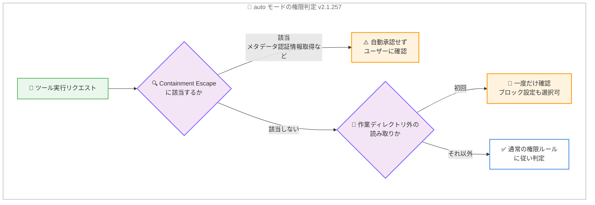

# Claude Code v2.1.257 / v2.1.258 リリース — Fable 5.1 がデフォルトモデルに、時刻表示設定、Containment Escape ルール、大規模な安定性改善

## メタデータ

| 項目 | 内容 |
|------|------|
| 発表日 | 2026-09-02 |
| ソース | Claude Code Changelog |
| カテゴリ | Claude Code アップデート |
| 公式リンク | https://github.com/anthropics/claude-code/blob/main/CHANGELOG.md |

## 概要

Claude Code v2.1.257 および v2.1.258 がリリースされた。v2.1.257 は約 100 項目に及ぶ大型リリースで、最大のハイライトは Claude Fable 5.1 (`claude-fable-5-1`) がデフォルトの Fable モデルになったことである。1M コンテキストに対応し、価格は $10/$50 per MTok (入力/出力)、キャッシュ読み取りは $0.25/MTok となる。

このほか v2.1.257 では、時刻表示をカスタマイズする `timeFormat` / `timeZone` 設定、auto モードにおけるクラウド認証情報取得などを自動承認しない Containment Escape ルール、すべてのサブエージェントにモデルを強制適用する `CLAUDE_CODE_SUBAGENT_MODEL_FORCE` 環境変数、作業ディレクトリ外の読み取りをブロックする `permissions.blockReadsOutsideWorkingDirectories` 設定などの新機能が追加された。あわせて、レンダリングパフォーマンスの大幅な改善と、バックグラウンドセッション、Remote Control、サンドボックス、権限まわりを中心とした多数のバグ修正、VSCode 拡張の機能強化が含まれる。

v2.1.258 は 2 件の修正のみの小規模フォローアップで、macOS 12 (Monterey) での起動失敗と、リモート/スケジュールセッションのエラーを修正している。

## 詳細

### 背景

Anthropic は 2026 年 9 月 1 日に Claude Fable 5.1 を発表しており、v2.1.257 はこの新モデルを Claude Code のデフォルト Fable モデルとして組み込むリリースとなった。同時に、直近のリリースで継続的に強化されてきたバックグラウンドセッション (`claude agents`、`claude --bg`)、Remote Control、エージェントチーム、サンドボックスといった機能群に対する大量の不具合修正と改善がまとめて投入されている。

v2.1.258 は、v2.1.255 で混入した macOS 12 での起動リグレッションへの緊急対応を含むフォローアップである。

### 主な変更点

#### 1. Claude Fable 5.1 がデフォルトの Fable モデルに (v2.1.257)

Claude Fable 5.1 (`claude-fable-5-1`) が追加され、デフォルトの Fable モデルとなった。主な仕様は以下のとおり。

- **コンテキストウィンドウ**: 1M トークン
- **価格**: 入力 $10 / 出力 $50 per MTok
- **キャッシュ読み取り**: $0.25/MTok

なお、Claude apps ゲートウェイ経由のセッションでは、Fable 5.1 に未対応のゲートウェイがリクエストを拒否するため、`fable` および `best` のエイリアスは当面 Fable 5 に解決される。ゲートウェイ環境で Fable 5.1 を使用するには `/model` で明示的に選択する必要がある。

#### 2. 時刻表示のカスタマイズ: timeFormat / timeZone 設定 (v2.1.257)

ターン終了時の時計表示とトランスクリプトビューのタイムスタンプに適用される「Time format」(`timeFormat`) と `timeZone` 設定が追加された。12 時間表示、24 時間表示、24 時間 UTC 表示、または strftime パターンによる任意フォーマットを指定できる。

#### 3. auto モードの Containment Escape ルール (v2.1.257)

auto モードに Containment Escape ルールが追加された。以下のような操作は、環境側で「想定内」とマークされていない限り自動承認されなくなる。

- クラウドメタデータエンドポイントからの認証情報取得
- ネットワークエグレス制限の回避
- クロステナントへの到達

クラウド環境やマルチテナント環境で auto モードを利用する際のセキュリティが強化される変更である。あわせて、auto モードで作業ディレクトリ外のファイルを初めて読み取る前に一度だけ確認するプロンプトが追加され、`permissions.blockReadsOutsideWorkingDirectories` 設定でそのような読み取り自体をブロックすることも可能になった。

#### 4. サブエージェントのモデル強制: CLAUDE_CODE_SUBAGENT_MODEL_FORCE (v2.1.257)

`CLAUDE_CODE_SUBAGENT_MODEL_FORCE` 環境変数が追加された。これを設定すると、`CLAUDE_CODE_SUBAGENT_MODEL` (未設定の場合はメインモデル) がすべてのサブエージェントに適用され、スポーン時の指定やエージェント定義ファイルのモデル指定より優先される。組織やプロジェクトでサブエージェントのモデルを一律に統制したい場合に有効である。

#### 5. その他の新機能 (v2.1.257)

- **`/effort` のセッション限定変更**: `/model` と同様に、`s` を押すと現在のセッションのみに effort 変更を適用できる
- **`/doctor` の警告追加**: 強制終了されたセッションが残した古いサンドボックスマスクファイルを検出して警告する
- **ゲートウェイモデルの説明表示**: `CLAUDE_CODE_ENABLE_GATEWAY_MODEL_DISCOVERY` で検出された `/model` ピッカーのエントリに、ゲートウェイ提供の `description` を表示できる

#### 6. パフォーマンス改善 (v2.1.257)

レンダリングパフォーマンスが大きく改善された。

- 長い会話でのターンごとの再レンダリング処理を削減
- 応答が長くなってもストリーミングが遅くならないように改善
- バックグラウンドエージェントの更新が画面全体を再レンダリングしないように変更
- キーストロークごとのレンダリング処理を削減し、プロンプト入力の応答性を向上

#### 7. 主なバグ修正 (v2.1.257)

約 60 件の修正のうち、影響範囲の広いものをカテゴリ別に整理する。

**バックグラウンドセッション関連**。

- macOS の npm インストール環境でセルフアップデート中にバックグラウンドセッションが起動しない問題、および Windows で古いデーモンロックファイルが再利用されたプロセス ID を指していた場合の起動失敗を修正
- 自動アップデートをまたいで古いバイナリで動き続けるバックグラウンドセッションが蓄積する問題を修正 (retire されるように変更)
- コンピュータのスリープ、接続断、サーバーエラーで応答が途中で切れた際にサブエージェントが停止する問題を修正 (自動的に継続するように変更)
- `--resume` がバックグラウンド化した会話を二重に表示し、`--continue` が停止前のコピーを再度開く問題を修正

**Remote Control 関連**。

- セッション途中の接続時に Bash ツール定義が再送信され、プロンプトキャッシュミスを引き起こす問題を修正
- 同意プロンプトを Esc などで閉じた操作が同意扱いになり、次のリクエストが確認なしで接続される問題を修正
- Claude アプリから開始したセッションが選択したモデルを無視し、マシンのデフォルトモデルで実行される問題を修正

**サンドボックス・権限関連**。

- 末尾ドット付きホスト名 (`example.com.`) が `deniedDomains` でブロックされない問題を修正
- auto モードで `permissions.ask` ルールが複合コマンドやサブシェル内で適用されず、確認なしで実行される問題を修正
- Bash の `Read()`/`Edit()` deny ルールが `< file` リダイレクトや `tac`、`egrep` などの読み取りコマンドに適用されない問題を修正
- プラグインがシンボリックリンク経由で自身のディレクトリ外のファイルを読み取れる問題を修正
- zsh と bash で解釈が異なる `[[ ]]` 条件式が自動承認される問題を修正 (承認プロンプトを表示するように変更)

**プロンプトキャッシュ関連**。

- アドバイザーモデル設定時にバックグラウンドリクエスト (コンパクション、`/recap` など) がキャッシュミスし、会話全体を毎回未キャッシュで再送する問題を修正
- スクリーンショットの多い長時間セッションで、画像がリクエストごとのサイズ上限を超えると毎ターンキャッシュミスする問題を修正

**サードパーティプロバイダ関連**。

- 二重に設定されたカスタム `Authorization` ヘッダーが Bedrock、Mantle、Vertex、WIF で認証情報を上書きする問題を修正
- Foundry のサブスクリプションキーと一緒に残存する Anthropic API キーが送信される問題を修正
- Opus 4.7 以降の長い hidden-thinking フェーズ中に Bedrock のストリームが無応答となり、アイドルタイムアウトで切断される問題を修正 (進捗イベントを送出するように変更)

#### 8. 動作変更 (v2.1.257)

- **`--effort`**: 新モデルのデフォルト effort ホールドの解除がセッション限定になった (従来は恒久的)
- **`defaultMode: "bypassPermissions"`**: `.claude/settings.json` および `.claude/settings.local.json` での指定は `"auto"` と同様に無視されるようになった。ユーザー設定・管理設定、または `--permission-mode` で指定する
- **`/btw` の履歴移動**: `←`/`→` から `Shift+←`/`Shift+→` (または `[`/`]`) に変更
- **ネットワークパスの拒否**: `--add-dir`、`/add-dir`、`additionalDirectories` は UNC 共有や `/net/<host>` 自動マウントなどのネットワークパスを拒否するようになった
- **クラウドセッションの保護強化**: Cowork および claude.ai クラウドセッションでは、自分のものではないアーティファクトの読み取りは auto モードでも必ず確認するようになった

#### 9. VSCode 拡張の改善 (v2.1.257)

- **モデルピル**: 入力フッターに現在のモデルを表示するピルが追加され、クリックでモデルピッカー (Effort 行と「More models」ページを含む) を開ける
- **セッションアーカイブ**: 「Delete session」が「Archive session」に変更され、アーカイブされたセッションはリスト下部の折りたたみ可能なグループに移動し、復元 (Unarchive) も可能になった
- **セッションリストパネル**: 折りたたみ可能な ACCOUNT & USAGE / SESSION MANAGER セクションが追加され、アカウントのメールアドレス、使用量メーター、詳細表示リンクを確認できる
- **出力スタイル選択**: カスタムスタイルを含む出力スタイルの選択がコマンドメニューから可能になった
- **サードパーティプロバイダの表示修正**: Bedrock や Vertex などのデプロイメントで claude.ai 専用機能 (リモートセッション、ディクテーション、使用量) が表示され、残存ログインで claude.ai を呼び出す問題を修正

#### 10. v2.1.258 の修正内容

v2.1.258 は以下 2 件の修正のみの小規模リリースである。

- **macOS 12 での起動失敗の修正**: v2.1.255 で混入したリグレッションにより、macOS 12 (Monterey) で Claude Code が起動しない問題を修正
- **リモート/スケジュールセッションのエラー修正**: 再送された権限承認を適用できなかった後に、リモートおよびスケジュールセッションが「user messages must have non-empty content」エラーで失敗する問題を修正

### 技術的な詳細

v2.1.257 のセキュリティ強化は、auto モードの信頼境界を明確化する方向で一貫している。Containment Escape ルールは、クラウド環境で実行されるエージェントが自律的に認証情報を取得したり隔離環境を逸脱したりする行為を自動承認の対象から外すもので、`permissions.blockReadsOutsideWorkingDirectories` やアーティファクト読み取りの必須確認とあわせて、エージェントの行動範囲を段階的に制御する仕組みが整備された。



また、プロンプトキャッシュの効率化も本リリースの隠れたテーマである。Remote Control 接続時のツール定義再送、アドバイザーモデルのバックグラウンドリクエスト、画像サイズ上限超過時の毎ターンミス、`/fork` 時のシステムプロンプト変更など、キャッシュミスを引き起こしていた複数の経路が塞がれており、長時間セッションのコストとレイテンシの改善が期待できる。

## 開発者への影響

### 対象

- **すべての Claude Code ユーザー**: デフォルトの Fable モデルが Fable 5.1 に変わるため、Fable エイリアスを使用している場合はモデルと価格が変わる
- **macOS 12 (Monterey) ユーザー**: v2.1.255〜v2.1.257 で起動できない場合は v2.1.258 で解消される
- **クラウド環境・マルチテナント環境で auto モードを使う組織**: Containment Escape ルールと `blockReadsOutsideWorkingDirectories` によりセキュリティ統制が強化される
- **サブエージェントを多用するチーム**: `CLAUDE_CODE_SUBAGENT_MODEL_FORCE` でモデルを一律統制できる
- **ゲートウェイ経由 (Claude apps gateway、Bedrock、Vertex、Foundry) のユーザー**: 認証ヘッダーまわりの多数の修正と、Fable エイリアスの解決仕様変更に注意
- **VSCode 拡張ユーザー**: モデルピル、セッションアーカイブなどの UI 改善が利用可能になる

### 必要なアクション

以下のいずれかの方法で最新バージョンに更新できる。

```bash
# Claude Code 組み込みコマンド
claude update

# npm でのアップデート
npm update -g @anthropic-ai/claude-code

# 現在のバージョン確認
claude --version
```

アップデート後に確認すべき点は以下のとおり。

- Fable エイリアスを使用している場合、Fable 5.1 の価格 ($10/$50 per MTok) が想定内か確認する。従来モデルを継続利用する場合は `/model` で明示的に選択する
- プロジェクトの `.claude/settings.json` / `.claude/settings.local.json` に `defaultMode: "bypassPermissions"` を設定している場合は無視されるようになったため、ユーザー設定・管理設定または `--permission-mode` に移行する
- `/btw` の履歴移動キーが `Shift+←`/`Shift+→` (または `[`/`]`) に変わったことに注意する

### 移行ガイド (該当する場合)

破壊的変更に近い動作変更として、プロジェクトレベル設定での `defaultMode: "bypassPermissions"` の無効化、`/btw` のキーバインド変更、ネットワークパスの拒否 (Windows ではマップ済みドライブレターを使用)、Bash / PowerShell 権限プロンプトの Ctrl+E コマンド説明の削除がある。該当する設定やワークフローを使用している場合は上記「必要なアクション」に沿って調整する。

## 関連リンク

- [Claude Code Changelog](https://github.com/anthropics/claude-code/blob/main/CHANGELOG.md)
- [Claude Code npm パッケージ](https://www.npmjs.com/package/@anthropic-ai/claude-code)
- [Claude Code GitHub リポジトリ](https://github.com/anthropics/claude-code)
- [Claude Code ドキュメント](https://docs.anthropic.com/en/docs/claude-code)
- [Claude Fable 5.1 / Mythos 5.1 発表レポート](./2026-09-01-claude-fable-5-1-mythos-5-1.md)
- [Claude Code v2.1.252](./2026-08-31-claude-code-v2-1-252.md)

## まとめ

Claude Code v2.1.257 は、Claude Fable 5.1 のデフォルトモデル化を筆頭に、時刻表示設定、auto モードの Containment Escape ルール、サブエージェントのモデル強制、作業ディレクトリ外読み取りの制御といった新機能と、レンダリングパフォーマンスの改善、バックグラウンドセッション・Remote Control・サンドボックス・権限・プロンプトキャッシュにまたがる約 60 件の修正を含む大型リリースである。続く v2.1.258 は macOS 12 での起動失敗とリモート/スケジュールセッションのエラーを修正する小規模フォローアップとなっている。

セキュリティとコスト効率の両面で実質的な改善が多く、特にクラウド環境やゲートウェイ経由で運用する組織、macOS 12 ユーザーには早期のアップデートを推奨する。
