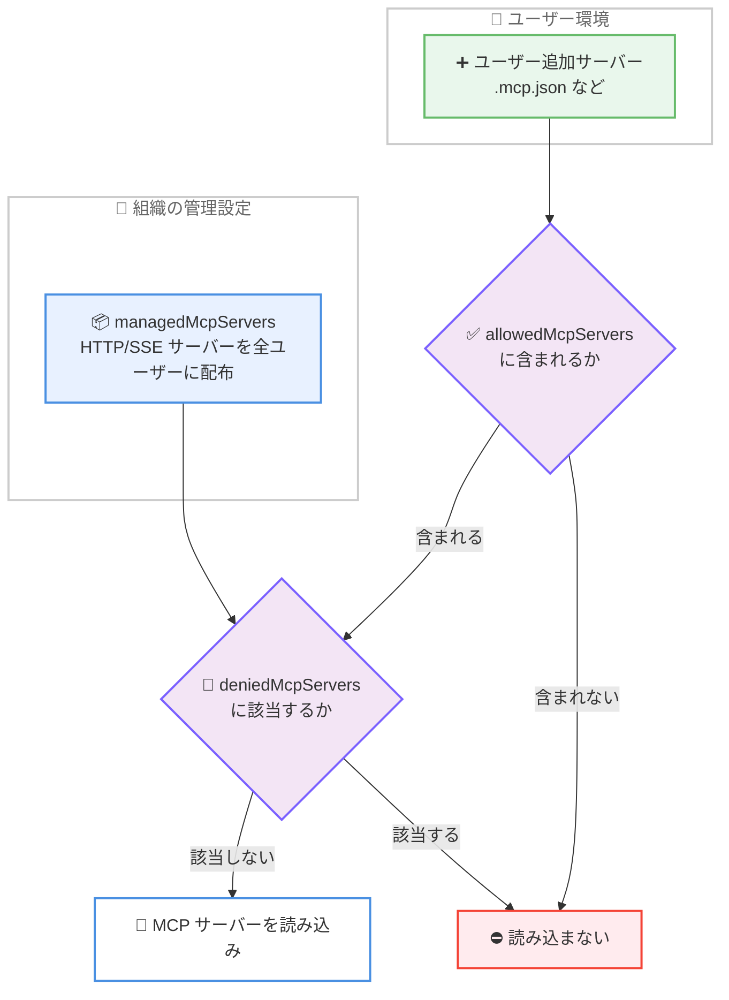

# Claude Code v2.1.259 リリース — managedMcpServers 管理設定、`--permission-prompts none`、GitLab MR 認識、権限・管理設定まわりの大規模なセキュリティ修正

## メタデータ

| 項目 | 内容 |
|------|------|
| 発表日 | 2026-09-02 (CHANGELOG コミット: 22:33 UTC) |
| ソース | Claude Code Changelog |
| カテゴリ | Claude Code アップデート |
| 公式リンク | https://github.com/anthropics/claude-code/blob/main/CHANGELOG.md |

## 概要

Claude Code v2.1.259 が 2026 年 9 月 2 日にリリースされた。同日リリースの v2.1.257 / v2.1.258 に続くバージョンで、新機能 4 件、修正 (Fixed) 約 28 件、改善 (Improved) 5 件、動作変更 (Changed) 1 件、VSCode 拡張の機能追加 1 件で構成される。

最大のハイライトは、組織管理者が全ユーザーに HTTP/SSE MCP サーバーを配布できる `managedMcpServers` 管理設定の追加である。あわせて、無人ヘッドレスホスト向けにプロンプトをすべて自動拒否する `--permission-prompts none` フラグ、GitLab のマージリクエストを `MR !N` として認識・表示する `glab` コマンド対応、`claude plugin validate` の `--json` 出力が追加された。

修正面では、Bash の `Read()` deny ルールがオプション値や `git diff` のファイルオペランドをカバーしていなかった問題、管理設定ファイルがパースできない場合に黙って未適用のまま起動していた問題 (今後は起動を拒否)、並行セッションが `~/.claude.json` の変更を相互に巻き戻す問題など、セキュリティと設定の信頼性に直結する修正が多数含まれる。既存の `allowedMcpServers` の適用範囲がユーザー追加サーバーのみに変わる動作変更もあり、管理設定を運用する組織は確認が必要である。

## 詳細

### 背景

前日までのリリース (v2.1.257 / v2.1.258) では Claude Fable 5.1 のデフォルトモデル化と大量の安定性改善が行われた。v2.1.259 はその直後のリリースで、エンタープライズ管理機能 (managed settings、MCP サーバー統制) と、CI/CD やヘッドレス運用 (無人ホスト、GitLab 連携) の強化に焦点が当たっている。特に MCP サーバーの組織配布は、これまでユーザーごとの `.mcp.json` 設定に依存していた運用を、管理設定による一元配布へ移行できるようにする変更である。

### 主な変更点

#### 1. 新機能 (Added)

**managedMcpServers 管理設定**: 組織が HTTP/SSE MCP サーバーを全ユーザーに提供できる管理設定が追加された。エントリの形式は `.mcp.json` と同一である。ローカルでコマンドを実行する形式のエントリ (stdio サーバー) はスキップされ、HTTP/SSE サーバーのみが配布対象となる。社内共通のツール群 (ドキュメント検索、チケット管理など) を管理者側で一括提供するユースケースに対応する。

**`--permission-prompts none` フラグ**: 無人ヘッドレスホスト向けのフラグが追加された。プロンプトを表示するはずの操作はすべて自動的に拒否され、その間もアクティブな権限モード (auto モードを含む) は通常どおり判定を続ける。CI/CD パイプラインやスケジュール実行など、人間が応答できない環境で「確認待ちで停止する」ことも「確認なしで危険な操作が通る」こともなくなる。

**GitLab マージリクエストの認識**: `glab mr create/merge/close/reopen/note/update` コマンドが認識されるようになり、折りたたまれたツールサマリーに `MR !N` として表示され、フッターの MR バッジも更新される。GitHub の PR と同等の体験が GitLab でも得られる。

**`claude plugin validate --json`**: プラグイン検証の結果を機械可読な JSON レポートとして出力できるようになった。プラグインの CI での自動検証に利用できる。

#### 2. 修正 (Fixed)

約 28 件の修正のうち、影響範囲の広いものをカテゴリ別に整理する。

**セキュリティ・権限関連**。

- Bash の `Read()` deny ルールが、オプション値として渡されたファイル (`--ignore-revs-file=.env`、`-f.env`、`@file`)、`git diff` / `git grep` のファイルオペランド、`cd DIR && cat FILE` の複合コマンドをカバーしていなかった問題を修正。また、拒否対象ファイルを含むディレクトリへの `grep -r` / `cp -r` は確認を求めるようになった
- 管理設定 (managed-settings ファイル、drop-in、MDM plist、HKLM 値) がパースできない場合に、黙って未適用のまま起動していた問題を修正。今後は Claude Code が起動を拒否し、問題のあるソース名を表示する
- 管理設定の `forceRemoteSettingsRefresh` が、MDM や管理設定ファイルで構成されたポリシーヘルパーが先に実行済みの場合に起動時に無視される問題を修正
- リポジトリ検出が、一時的な git プローブ失敗の後に既知のリポジトリ識別情報を失う問題を修正

**セッション・設定の信頼性関連**。

- 並行セッションが互いの `~/.claude.json` の変更を黙って巻き戻す問題を修正。多数のセッションを同時実行しても、ワークスペースの信頼設定がリセットされたり、MCP / プロジェクト状態が失われたりしなくなった
- `--resume` が失敗し、`--continue` が空の会話を開く問題 (保存済みセッションにペイロードのないアタッチメントエントリが含まれる場合) を修正
- thinking が一度拒否された会話が、以降のすべてのターンで拒否され続ける問題を修正
- テレメトリ無効のセッションで OAuth トークンのリフレッシュ時にプロンプトキャッシュが無効化される問題を修正
- ブロックする Stop フックの後のターンで、モデルの reasoning が失われ、一部のモデルでプロンプトキャッシュをミスする問題を修正

**モデル選択関連**。

- コマンドやスキルの frontmatter `model:` が指定されている場合に、auto モードが未対応モデルでターンを実行する問題を修正。ターンはセッションモデルを維持するようになった
- カスタムコマンドとスキルの frontmatter `model:` が対話セッションで無視される問題を修正
- `CLAUDE_CODE_MAX_CONTEXT_TOKENS` が、Claude Code が認識しないモデルバージョンの Vertex 形式モデル ID (`@YYYYMMDD` サフィックス) で無視される問題を修正

**リモート・バックグラウンド実行関連**。

- Remote Control セッションで Stop がバックグラウンドエージェントとワークフローを実際には停止しない問題を修正。停止されたタスクはプロセスが終了するまで表示され続け、再停止も可能になった
- 前回の停止した実行がまだ終了処理中のワークフローを再開すると、エージェントの複製が重複実行される可能性があった問題を修正
- リモート (claude.ai) セッションで、ブラウザホストの MCP サーバーのページが閉じられた後、ターン開始に 60 秒かかる問題を修正
- リモートおよびスケジュールセッションが、一時停止中に承認されたコネクタツールの権限プロンプトの後、何も実行しない問題を修正
- worktree 分離が、一般的な Bash ループ、xargs パイプライン、ランチャーでラップされたコマンドを拒否する問題、およびフックが作成した worktree を `git rev-parse` が想定外のメッセージで失敗するマシンで拒否する問題を修正

**UI・その他**。

- フルスクリーンモードで、数百のツール呼び出しを伴う長いターンの後に会話が空白表示になる問題を修正
- 実行中のシェルコマンドのライブ出力プレビューが、前の行が折り返された場合に最新の行を隠す問題を修正
- ファイル編集の権限ダイアログで、変更行が途中で切れているのにその表示がないことがある問題を修正
- claude.ai ユーザーで起動のたびに実行されていたバックグラウンドの GitHub 接続チェックを修正し、結果を起動をまたいで記憶するようになった
- 起動時のツールリスト取得中に切断された MCP サーバーが、エラーを報告せず「接続済み・ツールなし」と表示される問題を修正
- OpenTelemetry のメトリクスとイベントに、クラウドセッションで `user.email`、`organization.id`、`user.account_uuid` 属性が欠落する問題を修正
- 旧バージョンから継続した会話で Artifact の公開が「unexpected parameter `note`」エラーで一度失敗する問題を修正
- github.com のマーケットプレイスリポジトリ URL に末尾スラッシュや余分な `?` / `#` が付いていると、使用不能な `.git` クローン URL が生成される問題を修正

#### 3. 改善 (Improved)

- **レンダリングパフォーマンス**: テキスト計測結果を再利用することで、ターミナルリサイズ時と長い応答の初回描画のパフォーマンスが向上した
- **`/workflows` のエージェント詳細**: JSON の outcome がシンタックスカラーと実際の改行付きで整形表示され、長い outcome は展開トグルの背後に折りたたまれるようになった
- **ヘッドレス / SDK セッションの起動**: MCP サーバーの接続完了時に最初のターンが最大 50 ミリ秒早く開始されるようになった
- **`/install-github-app`**: GitLab リポジトリ内で実行された場合、GitHub 専用であることを説明し、GitLab CI/CD ドキュメントを案内するようになった
- **ネストしたバックグラウンドサブエージェント**: 結果が親サブエージェントのトランスクリプトに保存されるようになり、再開したサブエージェントが結果を保持し、共有トランスクリプトにも受け渡しが表示される

#### 4. 動作変更 (Changed)

**`allowedMcpServers` の適用範囲の変更**: `allowedMcpServers` はユーザーが追加したサーバーのみを対象とするようになった。これまで allowlist でフィルタリングされていた `managed-mcp.json` のサーバーは、アップグレード後に読み込まれるようになる。管理配布サーバーを引き続き無効化したい場合は `deniedMcpServers` を使用する。

#### 5. VSCode 拡張

セッションリストのサイドバーに「Active」クイックフィルターと、ステータスフィルターメニュー (Needs input、Working、Completed) が追加された。多数のセッションを並行運用する場合に、応答が必要なセッションを素早く見つけられる。

### 技術的な詳細

本リリースの中核テーマは、MCP サーバー統制の 3 層モデルの整備である。`managedMcpServers` で組織が配布し、`allowedMcpServers` でユーザー追加分を制限し、`deniedMcpServers` で例外的に無効化するという役割分担が明確になった。



もう 1 つのテーマは、権限機構の「すり抜け経路」の封鎖である。Bash `Read()` deny ルールの修正は、`--option=file` 形式のオプション値、短縮オプション直結 (`-f.env`)、`@file` 参照、`git diff` / `git grep` のファイルオペランド、`cd` を伴う複合コマンドといった、従来ルールが検査していなかった読み取り経路をカバーする。また、管理設定がパースできない場合の起動拒否は、「設定ミスが黙って統制の無効化につながる」というフェイルオープンの問題をフェイルクローズに転換する変更であり、エンタープライズ統制の信頼性を高める。

ヘッドレス運用の観点では、`--permission-prompts none` により権限判定の挙動が決定的になる。auto モードなどのアクティブな権限モードが許可した操作はそのまま実行され、プロンプトが必要になった操作は自動拒否されるため、無人環境でセッションが確認待ちのままハングすることがなくなる。

## 開発者への影響

### 対象

- **管理設定 (managed settings) を運用する組織**: `managedMcpServers` による MCP サーバーの一元配布が可能になる。一方、`allowedMcpServers` の適用範囲変更とパース失敗時の起動拒否という 2 つの動作変更に注意が必要
- **CI/CD・無人環境で Claude Code を実行するユーザー**: `--permission-prompts none` で確認待ちによるハングを排除できる。ヘッドレス / SDK セッションの起動高速化も恩恵となる
- **GitLab ユーザー**: `glab mr` コマンドの認識により、MR 操作の表示が GitHub PR と同等になる。`/install-github-app` の GitLab 向け案内も追加された
- **並行セッションを多用するユーザー**: `~/.claude.json` の相互巻き戻し修正により、多数のセッション同時実行時の設定消失がなくなる
- **プラグイン開発者**: `claude plugin validate --json` で検証を CI に組み込める
- **セキュリティ統制を重視するチーム**: Bash `Read()` deny ルールの強化により、`.env` などの機密ファイルの読み取り防止がより堅牢になる

### 必要なアクション

以下のいずれかの方法で最新バージョンに更新できる。

```bash
# Claude Code 組み込みコマンド
claude update

# npm でのアップデート
npm update -g @anthropic-ai/claude-code

# 現在のバージョン確認
claude --version
```

アップデート後に確認すべき点は以下のとおり。

- `allowedMcpServers` で管理配布サーバー (`managed-mcp.json` のエントリ) をフィルタリングしていた場合、アップグレード後にそれらが読み込まれるようになる。引き続き無効化するには `deniedMcpServers` に移行する
- 管理設定ファイル、drop-in、MDM plist、HKLM 値にパースエラーがあると Claude Code が起動しなくなるため、配布前に設定ファイルの構文を検証する
- 無人環境で運用しているスクリプトがある場合、`--permission-prompts none` の採用を検討する

### 移行ガイド (該当する場合)

動作変更は `allowedMcpServers` の適用範囲変更の 1 件である。組織の allowlist が管理配布サーバーの抑制を兼ねていた場合は、対象サーバーを `deniedMcpServers` に明示的に列挙する必要がある。また、パースできない管理設定での起動拒否は挙動としては破壊的変更に近いが、これは統制が黙って無効化される状態を防ぐための意図的な変更であり、エラーメッセージに問題のあるソース名が表示されるため対処は容易である。

## コード例

`managedMcpServers` の設定例 (管理設定ファイル)。エントリの形式は `.mcp.json` と同じで、HTTP/SSE サーバーのみが対象となる。

```json
{
  "managedMcpServers": {
    "internal-docs": {
      "type": "http",
      "url": "https://mcp.example.com/docs"
    },
    "issue-tracker": {
      "type": "sse",
      "url": "https://mcp.example.com/issues/sse"
    }
  }
}
```

無人ヘッドレスホストでの実行例。

```bash
# プロンプトが必要な操作はすべて自動拒否し、権限モードの判定は維持する
claude -p "テストを実行して結果を要約してください" --permission-prompts none

# プラグイン検証を機械可読な形式で出力
claude plugin validate ./my-plugin --json
```

## 関連リンク

- [Claude Code Changelog](https://github.com/anthropics/claude-code/blob/main/CHANGELOG.md)
- [Claude Code npm パッケージ](https://www.npmjs.com/package/@anthropic-ai/claude-code)
- [Claude Code GitHub リポジトリ](https://github.com/anthropics/claude-code)
- [Claude Code ドキュメント](https://docs.anthropic.com/en/docs/claude-code)
- [Claude Code v2.1.257 / v2.1.258](./2026-09-02-claude-code-v2-1-257-v2-1-258.md)

## まとめ

Claude Code v2.1.259 は、`managedMcpServers` による MCP サーバーの組織一元配布、無人環境向けの `--permission-prompts none`、GitLab MR 認識、`claude plugin validate --json` という 4 つの新機能に加え、Bash `Read()` deny ルールのすり抜け経路封鎖や管理設定パース失敗時の起動拒否といったセキュリティ・統制面の重要な修正、並行セッションの設定巻き戻しやリモートセッションの停滞など約 28 件の不具合修正を含むリリースである。

エンタープライズ統制と無人運用の双方で実質的な強化が多く、特に管理設定で MCP サーバーを統制している組織は、`allowedMcpServers` の適用範囲変更を確認したうえで早期にアップデートすることを推奨する。
