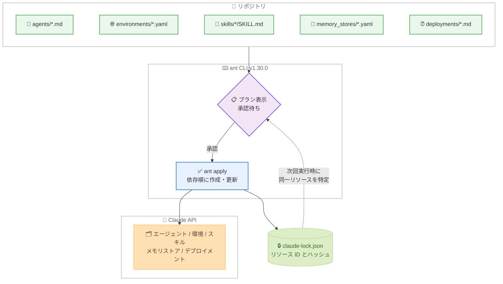

# ant CLI v1.30.0 リリース: リソースをコードとして管理する `ant apply` コマンドを追加

## メタデータ

| 項目 | 内容 |
|------|------|
| 発表日 | 2026-09-03 |
| ソース | Claude Developer Platform Release Notes |
| カテゴリ | CLI / 開発者ツール |
| 公式リンク | https://platform.claude.com/docs/en/release-notes/overview |

## 概要

ant CLI v1.30.0 で、新コマンド `ant apply` が追加された。リポジトリ内のファイルからエージェント、環境、スキル、メモリストア、デプロイメントの 5 種類の Claude API リソースを作成・更新できる。各リソースをファイルに記述して `ant apply` を実行し、表示されるプラン (実行計画) を承認するだけでリソースが API 側に反映される。

実行時に書き出される `claude-lock.json` ロックファイルをコミットしておくことで、ローカルマシンでも CI でも、後続の実行が新規リソースを作成せず同一リソースを更新する。Terraform などに代表される Infrastructure-as-Code 的なワークフローを、Claude API のリソース管理に持ち込む機能である。

## 詳細

### 背景

ant CLI は 2026 年 4 月 8 日に初回リリースされた Claude API 向けのコマンドラインクライアントで、当初から YAML ファイルによる API リソースのバージョン管理を志向していた。今回の `ant apply` はその発展形であり、リソース定義をコードと同じレビュープロセスで変更し、宣言的に API と同期させる仕組みを提供する。

### 主な変更点

公式ドキュメント「[Manage resources as code with ant apply](https://platform.claude.com/docs/en/cli-sdks-libraries/cli/apply)」によると、主な内容は以下のとおり。

- **宣言的なリソース管理**: エージェント、環境、スキル、メモリストア、デプロイメントをファイルとして定義し、`ant apply` で作成・更新できる
- **プランの承認フロー**: 対話的なターミナルでは、作成・更新内容のプランを表示して承認を待つ。`d` を入力すると各リソースのフィールド単位の差分を確認できる
- **ロックファイル**: 初回実行時に `claude-lock.json` を書き出し、ファイルとリソース ID の対応、組織 ID、ワークスペース ID、送信内容と API 応答のハッシュを記録する
- **依存関係の解決**: リソース間の参照は ID の代わりに相対パスで記述でき、`ant apply` が依存順に作成して実際の ID を埋め込む
- **CI 対応**: `--yes` フラグで確認なしの適用、`--dry-run` でプランのみの表示が可能

### 技術的な詳細

#### リソースファイルの形式

各ファイルには、そのリソース種別の作成エンドポイントに送るリクエストボディを記述する。スキルを除くリソースは YAML、JSON、Markdown のいずれでも記述できる。Markdown の場合はフロントマターがリクエストボディとなり、本文がその種別のテキストフィールド (エージェントの `system`、環境やメモリストアの `description`、デプロイメントの最初のメッセージ) に入る。

| リソース | 形式 | 配置場所 |
|---------|------|---------|
| エージェント | Markdown など | `agents/` |
| 環境 | YAML など | `environments/` |
| メモリストア | YAML など | `memory_stores/` |
| デプロイメント | Markdown など | `deployments/` |
| スキル | `SKILL.md` を含むディレクトリ | `skills/` (慣例) |

#### ファイル種別の推論

`ant apply` がディレクトリを走査する際、各ファイルの種別は以下の優先順で判定される。

1. ファイル内のトップレベル `type` フィールド
2. ファイルが直接置かれているディレクトリ名 (`agents/`、`environments/`、`memory_stores/`、`deployments/`)
3. 種別名で始まるファイル名 (例: `environment_staging.md`)

いずれにも一致しないファイル (README や CI 設定など) はスキップされる。コマンドラインで直接指定した場合、一致しない Markdown ファイルはエージェントとして扱われる。

#### claude-lock.json の仕組み

ロックファイルには、各ファイルが作成したリソースの ID とバージョン、リソースが属する組織とワークスペース、2 種類のハッシュ (最後に送信した内容と API が返した内容のフィンガープリント) が記録される。このハッシュにより、ファイルの編集やファイル外でのリソース変更を後続の実行が検知できる。

Console などファイル外でリソースが編集・アーカイブ・削除されていた場合、プランは適用を拒否して終了する。`--force` で上書きできる。ファイルを削除してもリソースは警告付きで残り、`--prune` を指定した場合にアーカイブ (スキルは削除) される。

#### 主なフラグ

| フラグ | 効果 |
|--------|------|
| `--dry-run` | プランを表示して終了。適用もロックファイルの書き込みも行わない |
| `--yes` | 確認なしで適用。ターミナルがない環境では必須 |
| `--force` | ファイル外で変更・アーカイブ・削除されたリソースにも適用 |
| `--prune` | ロックファイルにあるがファイルで宣言されなくなったリソースを削除 |
| `--upgrade` | GitHub URL で参照するスキルを再解決 (通常は記録されたコミットに固定) |
| `--lock-file <path>` | 使用するロックファイルを明示指定 |
| `--verbose`, `-v` | 変更のないリソースやフィールドの全値をプランに表示 |

## 開発者への影響

### 対象

- Claude API のマネージドエージェント (agents、environments、skills、memory stores、deployments) を利用している開発者
- エージェント構成を Git でバージョン管理し、コードレビューや CI/CD と統合したいチーム

### 必要なアクション

- ant CLI を v1.30.0 以降に更新する (インストールと認証は [CLI クイックスタート](https://platform.claude.com/docs/en/cli-sdks-libraries/cli/quickstart)を参照)
- リポジトリのルートで `ant apply` を実行し、生成された `claude-lock.json` をコミットする
- CI に組み込む場合は以下の点に注意する。
  - デフォルトブランチへのマージ後に `ant apply --yes .` を実行する
  - プルリクエストでは `ant apply --dry-run .` でプランをレビュアーに提示する
  - 適用が途中で失敗した場合でも、更新された `claude-lock.json` をコミットする
  - ロックファイルの排他制御はないため、apply は同時に 1 つだけ実行する
  - 認証には保存済み API キーではなく [Workload Identity Federation](https://platform.claude.com/docs/en/manage-claude/workload-identity-federation) の利用が推奨される

### 移行時の注意点

`ant apply` は、Console や `ant beta:agents create` で作成した既存リソースを取り込む (adopt する) ことはできない。管理対象はロックファイルに記録されたものだけであり、既存エージェントと同じ内容のファイルを適用すると 2 つ目のリソースが作成される。Console の **Export as code** でダウンロードしたエージェントには専用の `claude-lock.json` が含まれるため、それを適用すれば Console で構築したリソースを更新できる。

## コード例

エージェントを Markdown ファイルとして定義し、適用する例。

```markdown
---
name: Summarizer
model: claude-opus-5
tools:
  - type: agent_toolset_20260401
---

You are a helpful assistant that writes concise summaries.
```

```bash
# 単一ファイルを適用
ant apply agents/summarizer.md

# プロジェクト全体を適用
ant apply .

# プランのみ表示 (変更なし)
ant apply --dry-run .

# CI での適用 (確認なし)
ant apply --yes .
```

リソース間の参照は相対パスで記述できる。デプロイメントの例。

```markdown
---
name: Nightly review
agent: ../agents/reviewer.md
environment_id: ../environments/cloud.yaml
resources:
  - path: ../memory_stores/review-notes.yaml
    access: read_write
schedule:
  type: cron
  expression: "0 3 * * *"
  timezone: America/Los_Angeles
---

Review any open pull requests. Start with the oldest.
```

## アーキテクチャ図



## 関連リンク

- [Claude Developer Platform Release Notes](https://platform.claude.com/docs/en/release-notes/overview)
- [Manage resources as code with ant apply](https://platform.claude.com/docs/en/cli-sdks-libraries/cli/apply)
- [CLI quickstart](https://platform.claude.com/docs/en/cli-sdks-libraries/cli/quickstart)
- [CLI scripting and automation](https://platform.claude.com/docs/en/cli-sdks-libraries/cli/scripting)
- [Scheduled deployments](https://platform.claude.com/docs/en/managed-agents/scheduled-deployments)
- [ant CLI README の CI 例](https://github.com/anthropics/anthropic-cli#in-ci)

## まとめ

`ant apply` の追加により、Claude API のマネージドエージェント関連リソースを Git リポジトリ内のファイルとして宣言的に管理できるようになった。プラン承認フロー、`claude-lock.json` によるべき等な再実行、相対パスによる依存関係の解決、CI 統合のサポートなど、Infrastructure-as-Code の実践を Claude API に適用するための機能が一通り揃っている。エージェント構成をコードレビューと CI/CD のプロセスに乗せたいチームにとって、運用の標準化を大きく前進させるアップデートである。
