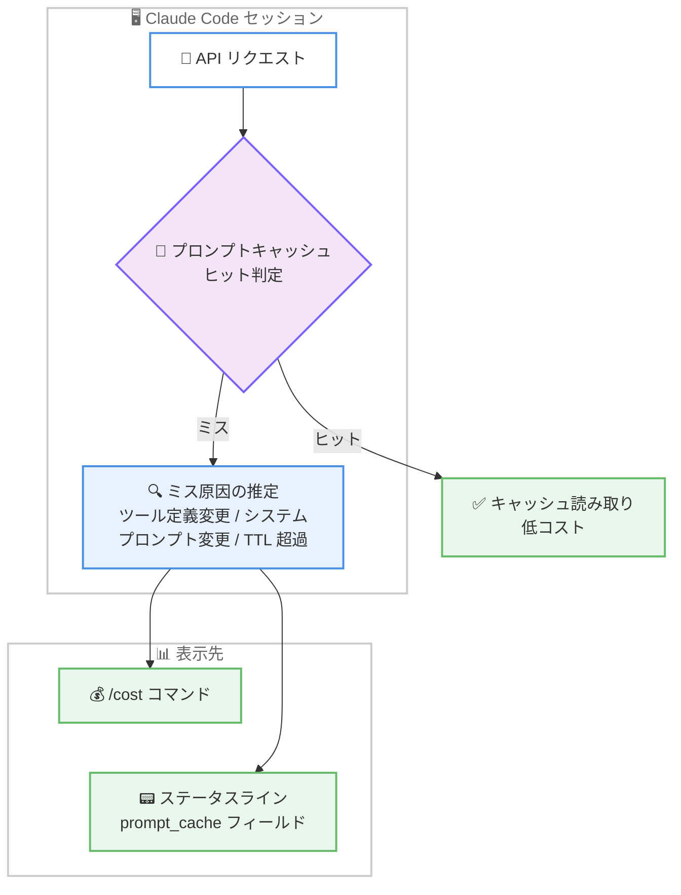

# Claude Code v2.1.260 リリース — `/diff` 差分パネル、プロンプトキャッシュミス原因の表示、権限ルールの重要修正、`Read()` deny ルール変更のリバート

## メタデータ

| 項目 | 内容 |
|------|------|
| 発表日 | 2026-09-03 (npm 公開: 22:32 UTC) |
| ソース | Claude Code Changelog |
| カテゴリ | Claude Code アップデート |
| 公式リンク | https://github.com/anthropics/claude-code/blob/main/CHANGELOG.md |

## 概要

Claude Code v2.1.260 が 2026 年 9 月 3 日にリリースされた。前日の v2.1.259 に続くバージョンで、合計 66 件の変更 (新機能 6 件、修正約 33 件、改善・動作変更 19 件、削除 1 件、VSCode 拡張 7 件) で構成される。

新機能のハイライトは、フルスクリーンモードで会話の横に未コミット変更をリアルタイム表示する `/diff` 差分パネルと、プロンプトキャッシュミスの推定原因 (ツール定義やシステムプロンプトの変更、TTL 超過のアイドルなど) を `/cost` とステータスラインに表示する診断機能である。修正面では、括弧を含むパスの `Edit`/`Write`/`Read` 権限ルールが無効化されていた問題や、zsh のコマンド置換が自動承認をすり抜けていた問題など、権限機構の重要な修正が含まれる。また、v2.1.259 で導入された「`Read()` deny ルールを Bash 引数に適用する」変更は、`npm run build` の誤拒否などの副作用によりリバートされた。Claude Fable 5.1 関連ではプロンプトキャッシュのカバレッジ改善と `/model` ピッカーの表示修正が行われ、1M コンテキストモデルの auto-compact も改善されている。

## 詳細

### 背景

前日リリースの v2.1.259 では、`managedMcpServers` 管理設定や `--permission-prompts none` などのエンタープライズ・ヘッドレス向け機能とともに、Bash の `Read()` deny ルールを引数レベルまで拡張するセキュリティ強化が行われた。v2.1.260 はその直後のリリースであり、この deny ルール拡張が引き起こした誤検知のリバートを含む、権限機構の精度改善が大きなテーマとなっている。あわせて、開発体験 (差分パネル、キャッシュ診断)、Claude Fable 5.1 まわりの安定化、ヘッドレス / デスクトップ / Remote Control といったマルチサーフェス対応の強化が進められている。

### 主な変更点

#### 1. 新機能 (Added)

**`/diff` 差分パネル**: フルスクリーンモードで、会話の横に未コミット変更を表示する差分パネルが追加された。Claude が編集を進めるのに合わせて内容が更新され、`/diff` でトグルできる。編集内容を都度確認しながら対話を続けるレビュー主体のワークフローに適している。

**プロンプトキャッシュミスの原因表示**: `/cost` とステータスラインの `prompt_cache` フィールドに、キャッシュミスの推定原因が表示されるようになった。ツール定義やシステムプロンプトの変更、TTL を超えたアイドルなど、これまで手掛かりのなかったキャッシュミスの切り分けが容易になり、コスト最適化の診断に直結する。

**ヘッドレスセッション向けコマンドの拡充**: `/reload-plugins` がヘッドレスセッションで利用可能になり、Claude Code Desktop と SDK のコマンドリストに表示されるようになった。また、`/advisor` のテキスト形式 (`/advisor`、`/advisor <model>`、`/advisor off`) が追加され、デスクトップアプリ、Remote Control、その他のヘッドレス (`-p` / Agent SDK) セッションから操作できる。

**Claude apps gateway の管理機能**: リフレッシュ時に `openid` スコープを再要求しないと id_token を返さない IdP 向けの `oidc.scope_on_refresh` 設定と、`desktop` ポリシーブロックでの新しい Claude Desktop キー (`userPluginMarketplacesEnabled`、`userPluginUploadsEnabled`) のサポートが追加された。

#### 2. 修正 (Fixed)

約 33 件の修正のうち、影響範囲の広いものをカテゴリ別に整理する。

**権限・セキュリティ関連**。

- パスに括弧を含む `Edit`/`Write`/`Read` 権限ルールが、無効として破棄されたり Bash サンドボックスに無視されたりして、「読み取り専用」のはずのフォルダが書き込み可能なままになっていた問題を修正
- コンパイルできないパターン (閉じられていない `[` など) を含むファイル権限ルールが 1 つあるだけで、すべてのファイル編集が `Invalid regular expression` で失敗する問題を修正。そのような deny ルールは、記述されたリテラルパスを保護するようになった
- zsh の `REPORTTIME`、`REPORTMEMORY`、`DIRSTACKSIZE` への代入にコマンド置換を隠したコマンドが、Bash 権限チェックで自動承認されていた問題を修正。承認プロンプトが表示されるようになった
- Glob/Grep で、権限チェックの前に検索パスがディスク上で確認されていた問題を修正。Read と同様に、権限の判定後にパスの不存在が報告されるようになった
- `permissions.blockReadsOutsideWorkingDirectories` が macOS で、サンドボックス化された git からユーザーの git config を隠したり、worktree 分離されたサブエージェント自身のチェックアウトを隠したりする問題を修正

**認証・エンタープライズ関連**。

- 企業のルート CA が OS の証明書ストアにのみ存在する場合に、Bedrock のモデル検出、トークンカウント、AWS SSO/STS 認証情報の呼び出しが「unable to get local issuer certificate」で失敗する問題を修正
- 過去の `/login` の API キーが残っている claude.ai Enterprise/Team ユーザーで、管理設定が読み込まれない問題を修正
- `/status` がサインイン済みの claude.ai アカウントと設定済み API キーの両方を有効であるかのように表示していた問題を修正。使用されていない認証情報にはマークが付くようになった
- バンドルスキルのエイリアス (`/doctor` に対する `checkup` など) をキーにした管理 `skillOverrides` が適用されない問題と、`Skill(name)` deny ルールが `<dir>:name` 形式のネストされたスキルをカバーしない問題を修正

**Claude Fable 5.1・モデル選択関連**。

- Claude Fable 5.1 のプロンプトキャッシュが、ツール結果の後に添付されるコンテキストをカバーせず、ツール呼び出しのたびに未キャッシュ入力として再送信されていた問題を修正
- `/model` ピッカーに、利用可能な組織でも Fable 5.1 が表示されない問題を修正 (従来は `/model claude-fable-5-1` と直接入力した場合のみ受け付けられていた)
- `model: fable` のエージェントが `ANTHROPIC_DEFAULT_FABLE_MODEL` ピンの `[1m]` タグを無視し、200K コンテキストウィンドウで暗黙的に動作していた問題を修正
- プラグインフックの読み込み失敗や組織管理プラグインのマーケットプレイス読み込み失敗の後、セッションの残り時間ずっとモデル切り替えがブロックされる問題を修正。切り替えのたびに再チェックされ、拒否時には原因が表示される

**`/rewind`・セッション関連**。

- `/rewind` と `--rewind-files` が、チェックポイントのバックアップファイルが欠落して実際には何も復元されていないのに成功と報告していた問題を修正
- `/rewind` が巻き戻したターンのファイル読み取り追跡を残し、外部編集後に「File unchanged since last read」スタブやファイル全体の再注入を引き起こす問題を修正
- セッションの worktree ディレクトリが git メタデータを失った後、`-p --resume` / `--continue` (デスクトップアプリが使用) がリトライのたびに失敗する問題を修正。一度失敗した後は worktree なしで再開する

**エージェント・マルチセッション関連**。

- SendMessage 経由で別のエージェントを再開したサブエージェントが、そのエージェントの完了通知で起こされない問題を修正 (通知がメイン会話に届いていた)
- エージェントチームで、長い API リトライ待機中 (`CLAUDE_CODE_RETRY_WATCHDOG` 使用時など) にリトライ通知が実メッセージを追い出し、インプロセスのチームメイトのトランスクリプトが欠落・空白になる問題を修正
- バックグラウンドに移動したセッションが ListAgents に二重に表示され (同名の幻の「interactive」セッションとして)、ビューアー側で SendMessage を受信してしまう問題を修正
- 多数のセッションがプロジェクトディレクトリを共有する場合に発生する断続的な「task output swap refused」エラーを修正
- 長いコンテキスト圧縮の実行中に、Workflow ツールのサブエージェントが停止扱いで再起動される問題を修正

**UI・その他**。

- 国旗・結合絵文字・アクセント付き文字が折り返し行で分断される問題と、ターミナル最終 2 列に掛かった場合に古いテキストが画面に残る問題を修正 (`…` として表示)
- フルスクリーンモードで Ctrl+Z を押すと、シェルが代替スクリーンに残り、一時停止したインターフェースの上に描画される問題を修正
- claude.ai、デスクトップアプリ、モバイル (Remote Control) から操作しているセッションでアーティファクトを公開すると、余分なブラウザタブが開く問題を修正
- IDE の行選択が、スキルやスラッシュコマンドの実行時に失われる問題を修正 (「N lines selected」のコンテキストが Claude に届くようになった)
- ネストしたサブグループの GitLab プロジェクト (`gitlab.com/group/subgroup/project` など) のリポジトリ検出を修正。また、GitLab リポジトリで作業中の `owner/repo#123` 形式の issue 参照が github.com にリンクされる問題を修正し、gitlab.com の issue にリンクされるようになった
- クラウドホストの claude.ai セッションで、コネクタの追加・削除時に Claude in Chrome ツールがタスク途中で「Not connected」で失敗する問題を修正
- SDK 提供の MCP サーバー (Desktop コネクタなど) が最初のターンに現れず、次のターンでのみ利用可能になることがある問題を修正

#### 3. 改善・動作変更 (Changed)

**`Read()` deny ルール変更のリバート**: v2.1.259 で導入された「`Read()` deny ルールを Bash 引数に適用する」変更がリバートされた。`Read(./**/build/**)` ルールの下であらゆるモードで `npm run build` が拒否される、auto モードでも `cd … && grep` がプロンプトを表示するといった誤検知が理由である。

**1M コンテキストモデルの auto-compact 改善**: Opus および Fable のセッションが 1M トークン制限の直前で圧縮されるようになり、非常に大きなコンテキストでのリカバリー圧縮が 10 分でタイムアウトしなくなった。

**プロンプトキャッシュの保持**: Claude Fable 5.1 で `/effort` によりセッション途中で effort を変更しても、プロンプトキャッシュが無効化されなくなった。

その他の主な変更は以下のとおり。

- Workflow の `agent({schema})` が、決して満たされない JSON Schema を事前に拒否し、リトライ上限エラーに最後のバリデーション失敗内容を含めるようになった
- 未プッシュのコミットを持つ worktree を伴うバックグラウンドセッションの削除時に、ブランチ名とコミット数が表示され、再度削除すると worktree が破棄されるようになった
- 非対話 (`-p` / SDK) セッションのアイドル時 CPU 使用率が改善された
- Amazon Bedrock 上の Claude apps gateway で、中断されたリクエストの入力トークンが AWS の無料 CountTokens API で計上されるようになった (`bedrock:CountTokens` の許可が必要)
- `Edit(C:\dir\(name)\**)` のように `\(` がパス区切りではなくエスケープされた括弧として解釈されるルールに対し、曖昧さのない記述を提案するエラーメッセージが表示されるようになった
- `/ultrareview` と `claude ultrareview` が、長時間のクラウドレビューを最大 45 分 (従来 30 分) 待機するようになった
- フルスクリーンモードの `ctrl+l` / `cmd+k` が、ターミナルの `clear` と同様にトランスクリプト表示をクリアするようになった (スクロールアップで過去のメッセージを表示可能)
- 閉じ括弧の後にテキストが続く権限ルール (`Bash(ls) x` など、何にもマッチしない) が、黙って無視されるのではなく無効な設定として報告されるようになった
- サーバー管理設定で、管理 CLAUDE.md (`claudeMd`) がセキュリティ承認ダイアログを表示しなくなった (フック、シェルコマンド、サンドボックス、unsafe な `env` 設定は引き続き承認が必要)
- Claude in Chrome が組織の管理設定に従うようになり、管理者が無効化した場合は `--chrome`、`/chrome`、ブラウザツールが利用不可になる
- `!` bash モードプロンプトで入力されたコマンドが、strict サンドボックスモード (`sandbox.allowUnsandboxedCommands: false`) でもサンドボックス外で実行されるようになった (自分のターミナルへの入力と同等の扱い)
- セルフホストランナーの `--kill-session-after-min` が、ユーザー待ちのみのセッション (一時停止中、次のメッセージで再開可能) を kill して失敗報告する代わりに解放するようになった
- バンドルされた `claude-api` スキルの Go、Java、C# サンプルが現行世代のモデル ID を使用するように更新された

#### 4. 削除 (Removed)

サブエージェントが開始したバックグラウンドコマンドの 1 時間の時間制限が撤廃された。メインセッションと同様に、終了するか停止されるまで実行される。

#### 5. VSCode 拡張

- フッターのモデルピルに選択中の effort レベルが表示されるようになり、モデル切り替え後に古い effort レベルが残る問題が修正され、フッターピルが以前のコンパクトなサイズに戻った
- セッションリストのステータスフィルターメニューに Open と Closed が追加された
- Remote Control が自動的にオンになる際に、新規セッションのウェルカム画面が消える問題を修正
- 別のタブで既に開いているセッションをセッション履歴ピッカーから開くと二重に読み込まれる問題を修正し、そのタブへの切り替えに変更
- タブのビューがリロード中の場合に、セッションタブの Rename コマンドが黙って何もしない問題を修正
- ドロップされた応答のリトライ後に、書きかけのメッセージ、空のツールカード、余分な「Thought for」行が画面に残る問題を修正
- 「Enable Remote Control for all sessions」が、トグル切り替え時に起動中だったセッションタブに適用されない問題を修正

### 技術的な詳細

本リリースの中核テーマの 1 つは、権限ルール評価の「精度」の調整である。v2.1.259 の `Read()` deny ルール拡張は検査範囲を広げるフェイルセーフ側の変更だったが、ビルドディレクトリを対象とするルールが `npm run build` そのものを拒否するなど、引数文字列とファイルアクセスの混同による誤検知が発生した。v2.1.260 はこれをリバートする一方、括弧を含むパスのルール破棄、コンパイル不能パターンによる全編集の失敗、zsh 特殊変数への代入に隠されたコマンド置換の自動承認といった、実際にすり抜け・誤動作を起こしていた欠陥を修正しており、「広く浅く検査する」方向から「定義されたルールを確実に適用する」方向へ調整されたリリースといえる。

もう 1 つのテーマはプロンプトキャッシュの可観測性と効率である。キャッシュミスは API コストに直結するが、原因 (ツール定義の変更、システムプロンプトの変更、TTL 超過) はこれまでユーザーから見えなかった。v2.1.260 では推定原因が `/cost` とステータスラインに表示され、さらに Fable 5.1 のツール結果後コンテキストのキャッシュ漏れ修正、`/effort` 変更時のキャッシュ保持とあわせて、長時間セッションのコスト特性が改善されている。



また、`/diff` 差分パネルはフルスクリーンモードの活用を前提とした機能であり、`ctrl+l` / `cmd+k` によるトランスクリプトクリア、Ctrl+Z の代替スクリーン修正とあわせて、フルスクリーンモードをメインの作業画面として使うワークフローが整備されつつある。

## 開発者への影響

### 対象

- **v2.1.259 で Bash コマンドの誤拒否・過剰プロンプトに遭遇したユーザー**: `Read()` deny ルールの Bash 引数適用がリバートされ、`npm run build` などが従来どおり動作する
- **権限ルールを運用するチーム**: 括弧を含むパスのルールが正しく適用されるようになったため、これまで意図せず無効化されていたルールが有効になる。設定済みルールの動作を再確認することを推奨する
- **Claude Fable 5.1 ユーザー**: ツール呼び出し多用時のキャッシュ効率が改善され、`/model` ピッカーからの選択、`[1m]` タグ付きモデルピンも正しく動作する
- **API コストを監視するユーザー**: `/cost` とステータスラインでキャッシュミスの原因を確認できるようになり、コスト増の切り分けが容易になる
- **Bedrock を企業プロキシ環境で利用するユーザー**: OS 証明書ストアのみにルート CA がある構成での証明書エラーが解消される
- **エージェントチーム・並行セッションを多用するユーザー**: SendMessage の通知配送、トランスクリプト欠落、セッション二重表示などマルチエージェント運用の安定性が向上する
- **GitLab ユーザー**: ネストしたサブグループのリポジトリ検出と issue 参照リンクが正しく動作する

### 必要なアクション

以下のいずれかの方法で最新バージョンに更新できる。

```bash
# Claude Code 組み込みコマンド
claude update

# npm でのアップデート
npm update -g @anthropic-ai/claude-code

# 現在のバージョン確認
claude --version
```

アップデート後に確認すべき点は以下のとおり。

- v2.1.259 の `Read()` deny ルール拡張を前提に Bash 引数の検査を期待していた場合、その動作はリバートされているため、機密ファイルの保護は `Read()` ルール本来の適用範囲と `permissions.blockReadsOutsideWorkingDirectories` などで確認する
- 括弧を含むパスの `Edit`/`Write`/`Read` ルールが有効化されるため、これまで暗黙的に許可されていた操作が拒否される可能性がある。ルールの意図と実際の挙動を確認する
- Bedrock 利用時に中断リクエストのトークン計上を正確にするには、IAM で `bedrock:CountTokens` を許可する
- 閉じ括弧の後にテキストが続く権限ルールは無効な設定として報告されるようになるため、警告が出た場合は記述を修正する

### 移行ガイド (該当する場合)

破壊的変更に近いのは strict サンドボックスモードでの `!` bash モードの扱いである。`sandbox.allowUnsandboxedCommands: false` を設定していても、`!` プロンプトで入力したコマンドはサンドボックス外で実行されるようになった。これはユーザー自身のターミナル入力と同等とみなす意図的な変更だが、strict モードで完全なサンドボックス実行を前提としていた組織はこの挙動を把握しておく必要がある。また、Claude in Chrome は組織の管理設定に従うようになったため、管理者が無効化している場合は `--chrome` / `/chrome` が利用できなくなる。

## コード例

フルスクリーンモードでの `/diff` 差分パネルの利用例。

```bash
# セッション中に差分パネルをトグル
/diff

# プロンプトキャッシュの状態とミス原因を確認
/cost
```

ステータスラインでキャッシュミス原因を利用する例 (statusline スクリプトが受け取る JSON の `prompt_cache` フィールドに原因情報が含まれる)。

```bash
# ヘッドレスセッションでの /advisor テキストコマンド
claude -p "/advisor claude-opus-4-6"
claude -p "/advisor off"
```

## 関連リンク

- [Claude Code Changelog](https://github.com/anthropics/claude-code/blob/main/CHANGELOG.md)
- [Claude Code npm パッケージ](https://www.npmjs.com/package/@anthropic-ai/claude-code)
- [Claude Code GitHub リポジトリ](https://github.com/anthropics/claude-code)
- [Claude Code ドキュメント](https://docs.anthropic.com/en/docs/claude-code)
- [Claude Code v2.1.259](./2026-09-02-claude-code-v2-1-259.md)

## まとめ

Claude Code v2.1.260 は、`/diff` 差分パネルとプロンプトキャッシュミス原因の表示という開発体験の新機能に加え、括弧を含むパスの権限ルール無効化や zsh コマンド置換の自動承認すり抜けといった権限機構の重要な修正、v2.1.259 の `Read()` deny ルール拡張のリバート、Claude Fable 5.1 のキャッシュ効率とモデル選択の改善、1M コンテキストモデルの auto-compact 改善など、合計 66 件の変更を含むリリースである。

権限ルールの適用精度に直結する修正が多いため、deny ルールで機密パスを保護している組織や、v2.1.259 で Bash コマンドの誤拒否に遭遇していたユーザーは、早期のアップデートと設定の動作確認を推奨する。
