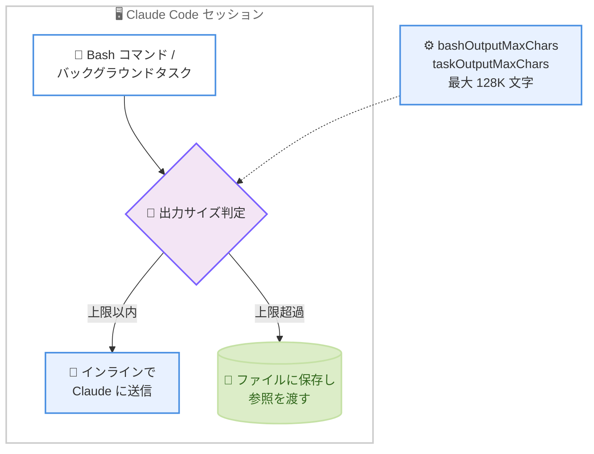

# Claude Code v2.1.261 リリース — `/skill-doctor`、Bash / タスク出力上限設定、組織ポリシー診断表示、Remote Control の安定性修正

## メタデータ

| 項目 | 内容 |
|------|------|
| 発表日 | 2026-09-04 (npm 公開: 17:49 UTC) |
| ソース | Claude Code Changelog |
| カテゴリ | Claude Code アップデート |
| 公式リンク | https://github.com/anthropics/claude-code/blob/main/CHANGELOG.md |

## 概要

Claude Code v2.1.261 が 2026 年 9 月 4 日にリリースされた。前日の v2.1.260 に続くバージョンで、合計 67 件の変更 (新機能 4 件、修正 27 件、改善 5 件、動作変更 5 件、VSCode 拡張 26 件) で構成される。

新機能のハイライトは、読み込み済みスキルのうち未使用のものとそのコンテキストコストを表示する `/skill-doctor` コマンドと、コマンド出力やバックグラウンドタスク出力をファイル退避せずにインラインで Claude に渡す上限を最大 128K 文字まで引き上げられる `bashOutputMaxChars` / `taskOutputMaxChars` 設定である。また、`/status` と `claude doctor` に組織ポリシーが読み込めない理由 (プロキシがエンドポイントを通していないなど) を示す「Organization policy」行が追加され、エンタープライズ環境での診断が容易になった。修正面では Remote Control 関連の不具合 (古い権限モード表示、停止後のスピナー残留、`/teleport` セッションの誤アップロードなど) が多数解消され、高速入力時の文字順序の乱れや、セッション再開時のフック出力欠落といった基本動作の修正も含まれる。VSCode 拡張も MCP サーバー管理 UI の追加やモデルピッカーのフラットリスト化など 26 件の変更が行われた。

## 詳細

### 背景

v2.1.260 では `/diff` 差分パネルやプロンプトキャッシュミス原因の表示、権限ルールの重要修正が行われた。翌日リリースの v2.1.261 は、コンテキスト管理の可視化と制御 (`/skill-doctor`、出力上限設定)、エンタープライズ環境の診断性 (組織ポリシー行、Bedrock ウィザードのタイムアウト、TLS 検査プロキシ対応)、そして Remote Control / クラウドセッションといったマルチサーフェス運用の安定化を進めるリリースとなっている。

### 主な変更点

#### 1. 新機能 (Added)

**`/skill-doctor` コマンド**: 読み込み済みのスキルのうち、どれが未使用でコンテキストをどれだけ消費しているかを表示する。不要なスキルを特定して削減 (プルーニング) するための診断ツールで、スキルを多数導入している環境でのコンテキスト最適化に直結する。

**`bashOutputMaxChars` / `taskOutputMaxChars` 設定**: コマンド出力とバックグラウンドタスク出力について、ファイルに保存される前に Claude がインラインで受け取る量を最大 128K 文字まで引き上げられるようになった。長いビルドログやテスト出力を Claude に直接読ませたいワークフローで、ファイル経由の間接参照を減らせる。

**組織ポリシーの診断表示**: `/status` と `claude doctor` に「Organization policy」行が追加され、組織のポリシーが読み込めなかった理由 (プロキシがエンドポイントを通過させていないなど) が表示されるようになった。

**`--append-subagent-system-prompt-file` フラグ**: サブエージェントのシステムプロンプトをファイルから読み込めるようになった。コマンドラインで渡すには大きすぎるプロンプトに対応する。

#### 2. 修正 (Fixed)

27 件の修正のうち、影響範囲の広いものをカテゴリ別に整理する。

**入力・セッションの基本動作**。

- 高速入力やキーリピート中に、入力・ペーストした文字の順序が入れ替わったり欠落したりすることがある問題を修正
- セッション再開時に、並列ツール呼び出し周辺のフック出力やその他のコンテキストが失われ、再開後のリクエスト内容が変わってしまう問題を修正
- `claude -p --resume <file>` がトランスクリプトに記録された不正なセッション ID を引き継ぐ問題を修正 (新しいセッション ID で再開されるようになった)
- プロンプト入力欄で、インラインの `[Image #N]` チップ直前の文字を削除できない問題を修正
- `/add-dir <subdirectory>` が `/net` オートマウント上の作業ディレクトリで誤った「couldn't be resolved」エラーを表示する問題を修正

**Remote Control 関連**。

- スマートフォン・ブラウザ・claude.ai アプリがターミナルセッションに接続した際や、ターミナル側でモードが変更された後に、古い権限モードが表示される問題を修正
- 接続中のスマートフォンやブラウザからターンを停止した後、またはローカルの `/clear` 実行後に、セッションが動作中のまま表示される (スピナーと Stop ボタンが残る) 問題を修正
- `/teleport` で取得したセッションが接続中のセッションにアップロードされ、スマートフォンや Web で元のセッションに追記されたように見える問題を修正
- ネイティブ Windows で、TLS 検査を行う企業プロキシの背後で受信イベントストリームが失敗する問題を修正
- effort レベルが設定由来の場合に claude.ai 側でデフォルトの effort レベルが表示される問題を修正
- 別マシンのオフラインな Remote Control セッションへの `SendMessage` が配信済みと読める結果を返す問題を修正 (マシンが再接続するまでキュー済みであることが示される)

**SDK・クラウドセッション・エージェント関連**。

- SDK およびクラウドセッションで、最初のプロンプト直後 (ターン開始前) に送信された Stop や割り込みが無視され、ターンが最後まで実行される問題を修正
- 管理設定が `enabledPlugins` でプラグインを強制有効化している場合に、クラウドセッションが claude.ai から同期されたプラグインを破棄し、失敗しうるマーケットプレイスのクローンにフォールバックする問題を修正
- 再開できないバックグラウンドエージェントのウェイクアップがタイトループでリトライされ、CPU 使用率が高止まりする問題を修正
- インプロセスのエージェントチームで、チームメイトが初回ターンのツール・スキル宣言を 2 ターン目に再送し、リクエストのプレフィックスが変わってプロンプトキャッシュを外していた問題を修正
- バックグラウンドの Bash コマンドから実行された CLI のプラグインインストールヒントが検出されるようになり、`<claude-code-hint>` タグが会話に漏れなくなった

**エンタープライズ・認証関連**。

- Bedrock セットアップウィザードが、AWS や認証情報ヘルパーが応答しない場合にハングする問題を修正 (明確なエラーでタイムアウトする)。また TLS 検査プロキシの背後でモデルチェックが失敗する問題も修正
- `gcpAuthRefresh` が、Google の認証情報チェックが遅い場合に有効な認証情報があっても起動時にブラウザを開く問題を修正
- 起動時のコネクタ取得がタイムアウトすると claude.ai コネクタがセッション全体で利用不可のままになる問題を修正 (バックグラウンドでリトライされる)
- 新しいバージョン向けにゲートされた機能フラグが、同一マシン上の古い Claude Code に適用されることがある問題を修正
- Claude apps gateway で、信頼済みプロキシが `X-Forwarded-For` にポートを付加した場合のクライアント IP 判定を修正。また Claude Desktop の OpenTelemetry エクスポート形式が protobuf 専用コレクタと不整合になる問題を修正

**UI・その他**。

- `/usage` と VSCode の使用量パネルで、使用量エンドポイントのレート制限時や起動直後にモデル別の週次制限行が欠落する問題を修正
- ターミナルの進捗インジケーター (iTerm2、Ghostty、ConEmu) が、バックグラウンドのワークフローやエージェント実行中にセッション完了と表示する問題を修正
- コンテナの行・列方向切り替え後にボックスが誤った高さで描画されるまれなレイアウト不具合を修正
- Desktop と Web で、アーティファクトの更新を監視しているだけのセッションがビジー表示される問題を修正
- Claude in Chrome の `file_upload` が、Claude Desktop アプリから実行されるローカル Cowork セッションで「paths: expected array, received undefined」で失敗する問題を修正

#### 3. 改善 (Improved)

- **モデル名表示**: `/model` ピッカーと VSCode のモデルピルが、Claude Code が認識できるモデルについて、Bedrock / Vertex AI / LLM ゲートウェイの生 ID ではなくモデル名を表示するようになった
- **危険な `rm` の安全プロンプト強化**: 位置パラメータへの `rm -rf` や、二重引用符で囲まれた `sh -c` スクリプト内の `rm -rf` も検出されるようになった
- **Vertex AI 起動の高速化**: `GOOGLE_APPLICATION_CREDENTIALS` 設定時に、API クライアント作成が Google Cloud プロジェクト検出を再実行したり余分な `gcloud` プロセスを起動したりしなくなった
- **ストリーミング性能**: 描画済みブロックが更新のたびにレイアウト再チェックされなくなった
- **API 無応答時のリトライ**: API がレスポンスヘッダーを返さない場合、リトライが 3 分ではなく `API_TIMEOUT_MS` (デフォルト 10 分) まで待機し、メッセージに変更すべき設定が示されるようになった

#### 4. 動作変更 (Changed)

- **単語編集キーの Bash 準拠**: プロンプトの単語編集キーが Bash と同じ挙動になった。Ctrl+W は空白まで削除、Alt+F / Alt+D は単語末尾で停止、句読点が単語区切りになる。`keybindingFlavor` 設定は効果を持たなくなった
- **auto モードのリンク承認強化**: 公開ダイアグラムレンダラーの URL にコンテンツを埋め込むリンクを、そのサイトへのアップロードとして扱うようになった。ユーザーが要求しない限り自動承認されない (データ持ち出し対策)
- **`forceLoginMethod: "gateway"` の厳格化**: 管理設定でゲートウェイログインが固定されたマシンでは、残存する API キーや claude.ai ログインが無視され、`/login` が要求される。Bedrock、Vertex AI、Foundry セッションは影響を受けない
- **gateway 403 のメッセージ改善**: 起動時や `/login` 後の管理設定読み込みで 403 が返った場合、再サインインを促す代わりに、組織で Claude Code が有効化されていない可能性を示すようになった
- **`/context` のローカル推定**: トークンカウント API が利用できない場合、追加の小型モデルリクエストではなくローカル推定を使用するようになった

#### 5. VSCode 拡張

26 件の変更が含まれる。主なものは以下のとおり。

**追加**。

- MCP サーバーダイアログに Add server フォームと Remove アクションが追加され、IDE 内で MCP サーバーの追加・削除が完結するようになった
- 権限・質問プロンプトに折りたたみボタンが追加され、プロンプトを閉じずに背後の会話を読めるようになった
- ターミナル・別ウィンドウ・Claude Desktop で開いているセッションが、セッションリストで中空リングで示されるようになった (閉じたように見えなくなった)
- Output styles メニューに、カスタム出力スタイルファイルを作成する「Build a custom style」ウォークスルーが追加された
- セッションリストの右クリックメニューに「Archive session」が追加され、Unarchive に専用アイコンが付いた

**修正・変更**。

- モデルピッカーが全モデルのフラットな 1 つのリストに変更され、旧表記のモデル行は最後に表示されるようになった
- 組織が無効化したモデルが、ウィンドウを 2 回リロードするまでピッカーに表示され続ける問題を修正
- Claude Code on the Web からテレポートしたセッションで、クラウドセッション終了時に途切れた質問が拒否扱いになる問題を修正
- キューされた次の権限プロンプトが前のプロンプトの入力テキストを引き継ぎ、直後の 2 回目のクリックを受け付けてしまう問題を修正
- Disable Login Prompt 設定にもかかわらずサインイン画面が表示される問題、サイドバーの使用量メーターが空のままになる問題、タブ・セッショングループ・未読バッジ・`/btw` 履歴などの表示不整合を多数修正

### 技術的な詳細

本リリースの中核テーマの 1 つはコンテキスト予算の可視化と制御である。スキルは便利な一方、読み込むだけでコンテキストを消費するため、未使用スキルの蓄積はコスト増と実効コンテキストの縮小につながる。`/skill-doctor` はどのスキルが使われておらず、何トークン相当を占めているかを示し、プルーニングの判断材料を提供する。同時に `bashOutputMaxChars` / `taskOutputMaxChars` は逆方向の制御、すなわち「必要な出力はファイル退避せずインラインで渡す」ための上限引き上げを可能にする。コンテキストを何に使うかをユーザーが明示的に配分できるようになった形である。



もう 1 つのテーマはプロンプトキャッシュの一貫性である。セッション再開時にフック出力や並列ツール呼び出し周辺のコンテキストが失われるとリクエスト内容が変わり、エージェントチームのチームメイトが初回宣言を再送するとリクエストのプレフィックスが変わる。いずれもキャッシュミスや挙動の差異につながる問題であり、本リリースで修正された。リクエストの再現性を保つことがコストと安定性の両面で重視されていることがわかる。

セキュリティ面では、auto モードが「公開ダイアグラムレンダラーの URL にコンテンツを詰め込むリンク」を当該サイトへのアップロードとして扱うようになった点が重要である。URL 経由のデータ持ち出し (exfiltration) の経路を塞ぐ変更であり、`rm -rf` 安全プロンプトの検出強化とあわせて、自動承認の抜け道を減らす方向の調整が続いている。

## 開発者への影響

### 対象

- **スキルを多数導入しているユーザー**: `/skill-doctor` で未使用スキルとそのコンテキストコストを確認し、プルーニングによってコンテキスト効率を改善できる
- **長い出力を扱うワークフローのユーザー**: `bashOutputMaxChars` / `taskOutputMaxChars` により、ビルドログやテスト出力を最大 128K 文字までインラインで Claude に渡せる
- **エンタープライズ・プロキシ環境の管理者**: 組織ポリシーが読み込めない理由が `/status` / `claude doctor` に表示され、Bedrock ウィザードのハングや TLS 検査プロキシ起因の失敗も解消されるため、トラブルシューティングが容易になる
- **Remote Control ユーザー**: 権限モードの表示、停止後の状態表示、`/teleport`、Windows の企業プロキシ対応など、スマートフォン・ブラウザからの操作の信頼性が大きく向上する
- **エージェントチーム・SDK 利用者**: チームメイトのキャッシュミス修正、ターン開始前の Stop 無視の修正、バックグラウンドエージェントの CPU 高止まり修正により、自動化運用が安定する
- **`keybindingFlavor` を設定していたユーザー**: 単語編集キーが Bash 準拠に統一され、この設定は効果を持たなくなった

### 必要なアクション

以下のいずれかの方法で最新バージョンに更新できる。

```bash
# Claude Code 組み込みコマンド
claude update

# npm でのアップデート
npm update -g @anthropic-ai/claude-code

# 現在のバージョン確認
claude --version
```

アップデート後に確認すべき点は以下のとおり。

- `/skill-doctor` を実行し、未使用スキルによるコンテキスト消費を確認する
- 長い出力をインラインで受け取りたい場合は、settings.json に `bashOutputMaxChars` / `taskOutputMaxChars` を設定する (上限 128K 文字。大きくするほどコンテキスト消費も増える点に注意)
- 組織ポリシーの読み込みに問題がある環境では、`/status` または `claude doctor` の「Organization policy」行で原因を確認する
- ダイアグラムレンダラーの URL を auto モードで自動的に開くワークフローがある場合、承認プロンプトが表示されるようになるため挙動を確認する

### 移行ガイド (該当する場合)

破壊的変更に近いのはキーバインドの統一である。プロンプトの単語編集キー (Ctrl+W、Alt+F、Alt+D) が Bash の挙動に統一され、`keybindingFlavor` 設定は無効になった。従来の挙動に依存していたユーザーは新しい単語区切り (句読点で区切られる、Ctrl+W は空白まで削除) に慣れる必要がある。また、管理設定で `forceLoginMethod: "gateway"` を固定している組織のマシンでは、残存する API キーや claude.ai ログインが無視されて `/login` が要求されるため、ゲートウェイ移行中の組織は初回起動時の再ログインを案内するとよい。

## コード例

`/skill-doctor` と出力上限設定の利用例。

```bash
# 読み込み済みスキルの利用状況とコンテキストコストを確認
/skill-doctor

# 組織ポリシーの読み込み状態を確認
/status
claude doctor
```

settings.json での出力上限設定の例。

```json
{
  "bashOutputMaxChars": 131072,
  "taskOutputMaxChars": 131072
}
```

サブエージェントのシステムプロンプトをファイルから追加する例。

```bash
claude -p "リポジトリを分析して" \
  --append-subagent-system-prompt-file ./prompts/subagent-extra.md
```

## 関連リンク

- [Claude Code Changelog](https://github.com/anthropics/claude-code/blob/main/CHANGELOG.md)
- [Claude Code npm パッケージ](https://www.npmjs.com/package/@anthropic-ai/claude-code)
- [Claude Code GitHub リポジトリ](https://github.com/anthropics/claude-code)
- [Claude Code ドキュメント](https://docs.anthropic.com/en/docs/claude-code)
- [Claude Code v2.1.260](./2026-09-03-claude-code-v2-1-260.md)

## まとめ

Claude Code v2.1.261 は、未使用スキルの診断を行う `/skill-doctor`、インライン出力上限を制御する `bashOutputMaxChars` / `taskOutputMaxChars`、組織ポリシー読み込み失敗の原因表示という運用可視化の新機能に加え、Remote Control・クラウドセッション・エージェントチームの安定性修正、`rm -rf` 検出とダイアグラムレンダラー URL の扱いといった安全性の調整、単語編集キーの Bash 統一など、合計 67 件の変更を含むリリースである。

スキルを多用するユーザーや Remote Control でリモート操作を行うユーザー、企業プロキシ環境で診断に苦労していた管理者にとって実益の大きいアップデートであり、早期の更新を推奨する。
