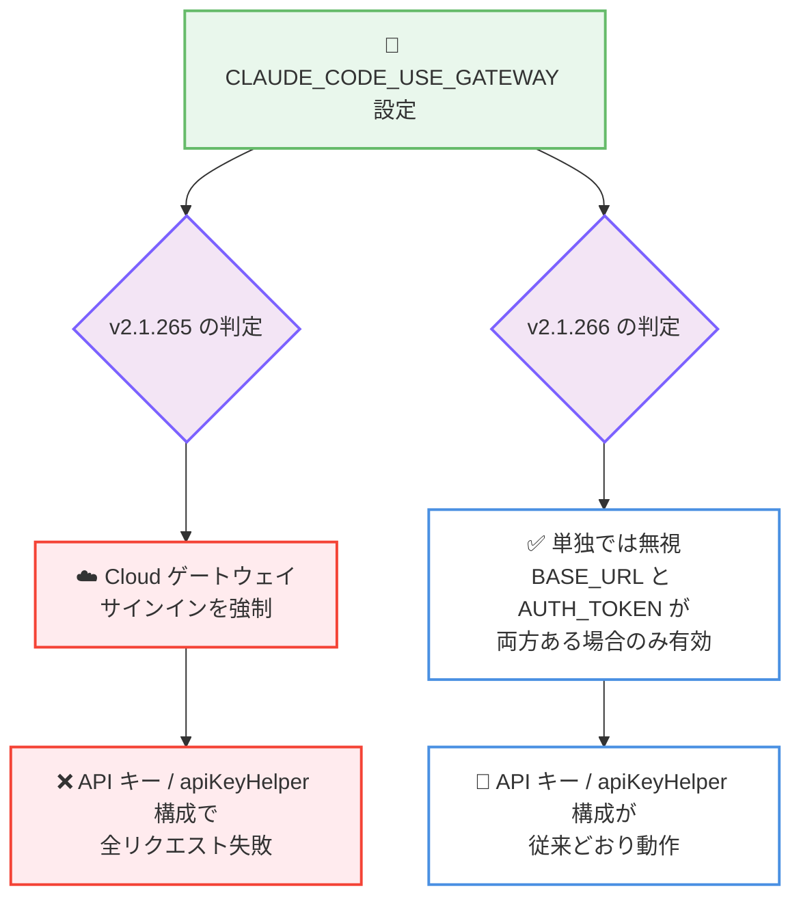

# Claude Code v2.1.265 / v2.1.266 リリース — プラグインフォルダの一括読み込みと多数の安定性修正、ゲートウェイ認証リグレッションの即日修正

## メタデータ

| 項目 | 内容 |
|------|------|
| 発表日 | 2026-09-08 (npm 公開: v2.1.265 は 19:05 UTC、v2.1.266 は 23:32 UTC) |
| ソース | Claude Code Changelog |
| カテゴリ | Claude Code アップデート |
| 公式リンク | https://github.com/anthropics/claude-code/blob/main/CHANGELOG.md |

## 概要

Claude Code v2.1.265 と v2.1.266 が 2026 年 9 月 8 日に相次いでリリースされた。v2.1.265 が主要リリースで、`--plugin-dir` によるプラグインフォルダの一括読み込み、ディスク保存されるツール結果への 1 GB 上限、テレメトリへの `user.email` / `user.groups` 追加、`--worktree` の並列チェックアウトによる起動高速化、VS Code 拡張の非アクティブセッション自動アーカイブなどの新機能・改善に加え、プロンプトキャッシュの再利用を壊していた複数の不具合、Remote Control / MCP / プラグイン関連の修正を含む 50 件超の変更で構成されている。

v2.1.266 は同日夜に公開された緊急のフォローアップリリースで、v2.1.265 で発生したリグレッションを 1 件修正する。環境変数 `CLAUDE_CODE_USE_GATEWAY` が単独で Cloud ゲートウェイへのサインインを強制するようになってしまい、API キーや `apiKeyHelper` を併用する LLM ゲートウェイ / プロキシ構成で全リクエストが失敗する問題が解消された。

## 詳細

### 背景

前バージョンは 2026 年 9 月 6 日リリースの v2.1.263 で、changelog に「Bug fixes and reliability improvements」とのみ記載されたメンテナンスリリースだった (v2.1.264 は npm に公開されておらず欠番)。v2.1.265 はその 2 日後に公開された大規模リリースであり、v2.1.261 (9 月 4 日) 以来となる詳細な変更一覧が changelog に記載されている。

一方、v2.1.265 の公開から約 4 時間半後に v2.1.266 が公開された。これは v2.1.265 で混入した認証まわりのリグレッションを修正するためのもので、LLM ゲートウェイやプロキシ経由で Claude Code を利用する企業ユーザーへの影響が大きかったことから、即日で修正が提供された形である。

### 主な変更点

#### v2.1.265: 新機能

- **`--plugin-dir` のフォルダ一括読み込み対応**: `--plugin-dir` にプラグインを複数格納したフォルダを指定できるようになった。マニフェストを持つ各子フォルダがプラグインとして読み込まれ、実行中に子フォルダを追加・削除した場合も自動的に反映される
- **ツール結果のディスク保存に 1 GB の上限を追加**: ディスクに保存されるツール結果に 1 GB の上限が設けられ、保存ファイルが切り詰められた場合は会話内のプレビューにその旨が表示される
- **テレメトリへの `user.email` / `user.groups` 追加**: Claude Desktop と Cowork が Claude apps ゲートウェイ経由で送信するテレメトリに `user.email` と `user.groups` が追加され、ターミナルセッションと同等になった
- **[VS Code] 非アクティブセッションの自動アーカイブ**: 一定期間非アクティブなセッションを自動でアーカイブする「Archive inactive sessions」設定が追加された (デフォルト 14 日)

#### v2.1.265: 改善

- **`--worktree` 起動の高速化**: 大規模リポジトリでの `--worktree` 起動時に、新しい worktree を並列でチェックアウトするようになった (git 2.32 以上が必要)
- **`/workflows` のエージェント詳細表示の強化**: ツール呼び出しに実行中 / 失敗 / 完了のステータスが表示され、サブエージェントのタスクリストも表示される。Enter キーで各呼び出しの入力と結果を展開できる
- **プロンプト途中のスラッシュコマンド入力の改善**: 候補が単一のサジェストではなくリストで表示されるようになり (フルスクリーン外では Tab で開く)、プラグインのスキルを短い名前だけで検索できるようになった
- **リモート MCP サーバーへの OAuth クライアント登録の遅延**: サインインが必要なリモート MCP サーバーに対し、実際に認証を行うまで OAuth クライアントを登録しないようになった
- **長いセッションの再開時間の短縮**: 多数のファイルを読み込んだ長いセッションの再開が高速化された
- **画像デコードエラーの改善**: サイズ上限を超えた画像をデコードできない場合、上限値だけでなく原因と対処方法を示すエラーメッセージが表示されるようになった
- **Artifact ツールの読み取り安全性向上**: 他者が作成したアーティファクトを読み取る際、ページを信頼できないコンテンツとして扱い、埋め込まれた指示を中継せずにフラグを立てるようになった
- **`.claude` フォルダ権限オプションの説明修正**: 実際に許可される内容 (セッション中のプロジェクトの `.claude` フォルダまたは `~/.claude` 内のファイル編集) を正しく表示するようになった

#### v2.1.265: 動作変更

- **`forceLoginGatewayUrl` の扱いの変更**: 管理対象設定に `forceLoginGatewayUrl` が含まれるマシンは、`forceLoginMethod: "gateway"` と同様に起動時から Claude apps ゲートウェイセッションとなり、残存する claude.ai ログインや API キーは使用されない
- **画像処理のランタイム組み込み対応**: 画像処理にランタイムの組み込み画像サポートを使用するようになり、CLI がネイティブ画像モジュールを一時ディレクトリに展開しなくなった
- **プラグイン表示メタデータの優先順位変更**: Installed タブと `claude plugin details` で、マーケットプレイスのエントリを `plugin.json` より優先し、不足分を `plugin.json` で補完するようになった
- **ゲートウェイセッションの OpenTelemetry 直接エクスポート**: Claude apps ゲートウェイセッションは、ゲートウェイの管理対象設定が `OTEL_EXPORTER_OTLP_ENDPOINT` で指定するコレクターへ直接エクスポートするようになった。コレクターの指定がないセッションは従来どおりリレーを使用する

#### v2.1.265: 修正 — プロンプトキャッシュとセッション再開

- フォアグラウンドで起動したサブエージェントを再開すると、ツールリストとシステムプロンプトのプレフィックスが変わり、そのエージェントのプロンプトキャッシュ再利用が壊れる問題を修正
- エージェントチームメイトと再開されたサブエージェントで、後続ターンにおいて SubagentStart フックのコンテキストとプリロードされたスキルがプロンプトプレフィックスの外へ移動し、プロンプトキャッシュ再利用が壊れる問題を修正
- ツール実行中に前のプロセスが終了した後の再開で、最後のプロンプトが書き換えられなくなり、中断されたツール呼び出しは保持されて中断済みとしてマークされるようになった
- コンテナ再起動後のワークフロー実行の再開を修正。実行ジャーナルが失われた再開は、全エージェントを再実行する代わりに明確なエラーで失敗するようになった
- 再開したセッションで「バックグラウンドタスクが完了しなかった」通知に、モデル向けの長い復旧指示ではなく短いステータス行が表示されるようになった

#### v2.1.265: 修正 — Remote Control / クラウドセッション / MCP

- Remote Control セッションが返信の最後のメッセージより先にターン終了シグナルを送信し、Claude アプリ上で最後の部分が届く前に返信が完了済みと表示されることがある問題を修正
- Remote Control からの `/clear` が、SessionStart フックと開いているターミナルダイアログの完了を待ってしまう問題を修正
- バックグラウンド (`--bg`) セッションが、アイドルタイムアウト直前にメッセージが届いた場合にターン途中で終了されることがある問題を修正
- `http` として設定された MCP サーバーがレガシーな HTTP+SSE トランスポートのみに対応している場合に接続できなかった問題を修正。MCP 仕様の記述どおり SSE へフォールバックするようになった
- claude.ai で接続済みの一部コネクタが、クラウドセッションで認証が必要と表示される問題を修正 (未対応のリクエストに HTTP 401 で応答するサーバーが対象)
- コネクタの承認やサインインリンクの待機中に、リモートセッションがサンドボックスコンテナを維持し続ける問題を修正
- 非対話セッション (`-p` と stream-json 入力、Agent SDK、クラウドセッション) で、新しいユーザーメッセージごとにシェルの作業ディレクトリがリセットされる問題を修正。`cd` がターンをまたいで維持されるようになった
- Claude apps ゲートウェイの OTLP テレメトリリレーが、不正または大きすぎるペイロードを数回拒否した後、コレクターへの全転送を 30 秒間停止してしまう問題を修正

#### v2.1.265: 修正 — プラグイン / スキル

- バックスラッシュを含むプラグインパスが macOS と Linux でシンボリックリンクの封じ込めチェックを回避できる問題を修正
- 名前が 2 つのドットで始まるプラグインディレクトリが、プラグインルートの外にあると誤って拒否される問題を修正
- OS が確認できないプラグインのデフォルトコンポーネントフォルダ (シンボリックリンクのループなど) が黙ってスキップされる問題を修正。`/plugin` にエラーコード付きで報告されるようになった
- `/plugin` の Discover / Browse と `claude plugin list --json --available` で、メタデータが `plugin.json` にのみ存在するマーケットプレイスプラグインの説明と表示名が表示されない問題を修正
- フォークされたスキル (`context: fork`) のキックオフプロンプトと、`--forward-subagent-text` 指定時のテキストターンが、stream-json の進捗イベントとしてストリーミングされない問題を修正
- `/add-dir <subdirectory>` が、管理対象設定でスキルのみがプラグインにロックされている場合にサブディレクトリのエージェント読み込みを拒否し、エージェントのみがロックされている場合に読み込みを約束してしまう問題を修正
- `claude-api` スキルのエラーコードリファレンスを修正: モデルアクセスの失敗は 404、利用できないベータヘッダーは 400 を返す (403 ではない)

#### v2.1.265: 修正 — 認証 / モデル / UI ほか

- VS Code と SDK のセッションで、トークン更新中にセッションを閉じると再ログインが必要になることがある問題を修正
- 管理対象設定で指定された Claude apps ゲートウェイにサインインしたセッションで `/login` を再実行すると「no gateway URL is configured」と表示される問題を修正
- `/model opusplan[1m]` が「Model not found」で拒否される問題を修正
- `/model` が設定ファイルへ書き込めなかった場合でも「デフォルトとして保存済み」と表示していた問題を修正。保存に失敗したことと理由を表示するようになった
- 権限プロンプトとメッセージ内のシンタックスハイライトされたコードで、Ruby の `?`、Erlang の `$`、Perl の `$` シジルの後の 1 文字が欠落することがある問題を修正
- スラッシュコマンドや @ ファイルのサジェストリストの開閉時に、フルスクリーンのトランスクリプトが 1 行ずれる問題を修正
- 2 キーのキーボードショートカットで、2 つ目のキーが 1 秒以上遅れて届くと黙ってキャンセルされる問題を修正 (tmux 内で発生)。3 秒まで待機し、タイムアウト時には通知を表示するようになった
- `/config` ダイアログがタブ切り替え時に高さが変わる問題を修正
- Claude Code 自身の git ステータス / diff の確認処理が、作業ツリー内のネストされたリポジトリで設定された clean フィルターを実行してしまう問題を修正
- アドバイザーツールとその指示が、リクエストごとにリクエストのモデルから再決定されていた問題を修正。決定は 1 回だけ行われ、変更時には会話内で告知されるようになった
- アーティファクトの公開が、コネクタが公開していないツール名を受け入れていた問題を修正。宣言されたツールが 1 つも存在しない場合は公開を拒否し、一部のみ存在しない場合は警告するようになった
- Windows: AppContainer または制限トークンのサンドボックス内で実行すると、Read / Write / Edit がすべてのファイルを拒否する問題を修正
- [VS Code] Reload Window や再起動後に、10 分以上開いていた会話のサイドバーチャットが空白で戻ってくる問題を修正
- [VS Code] 「Remote Control is active」メッセージでタイムラインのドットがテキストの下にずれる問題を修正

#### v2.1.266: リグレッション修正

- **`CLAUDE_CODE_USE_GATEWAY` 環境変数の扱いを v2.1.264 以前に戻した**: 非公開の環境変数 `CLAUDE_CODE_USE_GATEWAY` は、従来 `ANTHROPIC_BASE_URL` と `ANTHROPIC_AUTH_TOKEN` の両方が設定されている場合を除き無視されていた。v2.1.265 でこの変数が単独で Cloud ゲートウェイへのサインインを強制するようになったため、API キー、`apiKeyHelper`、カスタム認証ヘッダーと併用する構成では、すべてのリクエストが「Not signed in to the Cloud gateway」エラーで失敗していた。v2.1.266 でこの変数は単独では再び無視されるようになり、ユーザー側の設定変更は不要である

### 技術的な詳細

**プロンプトキャッシュ再利用の修正**: v2.1.265 ではプロンプトキャッシュに関連する修正が複数含まれている。プロンプトキャッシュはシステムプロンプトや会話履歴のプレフィックスが完全に一致した場合にのみ再利用されるため、サブエージェントの再開時にツールリストが変わったり、SubagentStart フックのコンテキストがプレフィックス外へ移動したりすると、キャッシュミスが発生してコストとレイテンシが増加していた。今回の修正により、サブエージェントやエージェントチームメイトを多用する長時間セッションでのキャッシュ効率が改善される。

**v2.1.266 のリグレッションの構図**: v2.1.265 での認証フローの変更 (`forceLoginGatewayUrl` を起動時からゲートウェイセッションとして扱う変更など) に伴い、`CLAUDE_CODE_USE_GATEWAY` の判定条件が意図せず緩和されたとみられる。この変数を LLM ゲートウェイやプロキシ構成のフラグとして設定していた環境では、API キーベースの認証が無効化され全リクエストが失敗するため、影響を受けた場合は v2.1.266 への更新で解消できる。



## 開発者への影響

### 対象

- Claude Code を日常的に利用しているすべてのユーザー
- **LLM ゲートウェイ / プロキシ経由で利用しているユーザー**: `CLAUDE_CODE_USE_GATEWAY` を設定している環境では v2.1.265 でリクエストが失敗するため、v2.1.266 への更新が必須
- **プラグイン開発者・利用者**: `--plugin-dir` のフォルダ一括読み込みにより、複数プラグインの開発・検証が容易になる
- **サブエージェントやエージェントチームを多用するユーザー**: プロンプトキャッシュ再利用の修正によりコストとレイテンシが改善される
- **大規模リポジトリで `--worktree` を使うユーザー**: 起動時間が短縮される (git 2.32 以上)
- **企業の管理者**: `forceLoginGatewayUrl` の動作変更、テレメトリへの `user.email` / `user.groups` 追加、OTLP 直接エクスポートへの変更を確認しておくことを推奨
- **VS Code 拡張ユーザー**: セッション自動アーカイブ (デフォルト 14 日) が有効になるため、必要に応じて設定を調整する

### 必要なアクション

以下のいずれかの方法で最新バージョン (v2.1.266) に更新できる。

```bash
# Claude Code 組み込みコマンド
claude update

# npm でのアップデート
npm update -g @anthropic-ai/claude-code

# バージョンを指定してインストールする場合
npm install -g @anthropic-ai/claude-code@2.1.266

# 現在のバージョン確認
claude --version
```

v2.1.265 を利用中で「Not signed in to the Cloud gateway」エラーが発生している場合は、v2.1.266 へ更新することで解消される。設定変更は不要である。

### 移行ガイド (該当する場合)

破壊的変更はアナウンスされていないが、以下の動作変更に注意が必要である。

- **`forceLoginGatewayUrl` を管理対象設定で使用している組織**: 対象マシンは起動時から Claude apps ゲートウェイセッションとなり、残存する claude.ai ログインや API キーは使用されなくなる
- **ゲートウェイ経由のテレメトリを利用している組織**: 管理対象設定で `OTEL_EXPORTER_OTLP_ENDPOINT` にコレクターを指定している場合、セッションはリレーを介さずコレクターへ直接エクスポートするようになる
- **VS Code 拡張**: 14 日間非アクティブなセッションが自動アーカイブされるようになるため、長期保存したいセッションがある場合は「Archive inactive sessions」設定を調整する

## コード例

`--plugin-dir` にプラグインを複数格納したフォルダを指定する例。

```bash
# フォルダ構成の例
# my-plugins/
# ├── plugin-a/
# │   └── .claude-plugin/plugin.json
# ├── plugin-b/
# │   └── .claude-plugin/plugin.json
# └── plugin-c/
#     └── .claude-plugin/plugin.json

# マニフェストを持つ各子フォルダがプラグインとして読み込まれる
claude --plugin-dir ./my-plugins

# 実行中に子フォルダを追加・削除しても自動的に反映される
```

## 関連リンク

- [Claude Code Changelog](https://github.com/anthropics/claude-code/blob/main/CHANGELOG.md)
- [Claude Code npm パッケージ](https://www.npmjs.com/package/@anthropic-ai/claude-code)
- [Claude Code GitHub リポジトリ](https://github.com/anthropics/claude-code)
- [Claude Code ドキュメント](https://docs.anthropic.com/en/docs/claude-code)
- [Claude Code v2.1.263](./2026-09-06-claude-code-v2-1-263.md)
- [Claude Code v2.1.261](./2026-09-04-claude-code-v2-1-261.md)

## まとめ

Claude Code v2.1.265 は、`--plugin-dir` のフォルダ一括読み込み、ツール結果保存の 1 GB 上限、`--worktree` 起動の高速化、VS Code のセッション自動アーカイブなどの新機能・改善に加え、プロンプトキャッシュ再利用や Remote Control / MCP / プラグイン関連の多数の修正を含む大規模リリースである。特にサブエージェントを多用する環境では、キャッシュ効率の改善によるコスト・レイテンシ面のメリットが期待できる。

一方、v2.1.265 には `CLAUDE_CODE_USE_GATEWAY` 環境変数が単独でゲートウェイサインインを強制してしまうリグレッションが含まれており、API キーや `apiKeyHelper` を併用するゲートウェイ / プロキシ構成では全リクエストが失敗する。約 4 時間半後に公開された v2.1.266 でこの問題は修正済みのため、更新する場合は v2.1.266 を利用することを推奨する。
