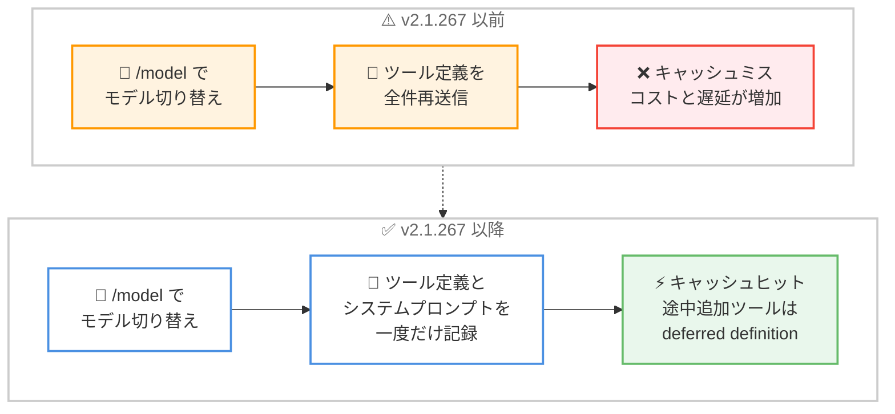

# Claude Code v2.1.267 リリース — プロンプトキャッシュ安定性の大幅改善と新設定 maxEffortLevel の追加

## メタデータ

| 項目 | 内容 |
|------|------|
| 発表日 | 2026-09-09 (npm 公開: 18:25 UTC) |
| ソース | Claude Code Changelog |
| カテゴリ | Claude Code アップデート |
| 公式リンク | https://github.com/anthropics/claude-code/blob/main/CHANGELOG.md |

## 概要

Claude Code v2.1.267 が 2026 年 9 月 9 日にリリースされた。今回のリリースの中心テーマは 2 つある。1 つ目は**プロンプトキャッシュの安定性改善**で、`/model` によるモデル切り替え時のツール定義の再送信、MCP コネクタの再接続タイミングのずれによるツールリストの書き換え、print モード (`-p`) セッションの対話的な再開時のキャッシュ破壊など、プロンプトキャッシュの再利用を壊していた多数の不具合が修正された。2 つ目は新設定 **`maxEffortLevel`** の追加で、Bedrock、Vertex、Foundry を含むすべてのプロバイダで effort レベルの上限を設定できるようになった。

このほか、システムプロンプトの反復開発を支援する `--system-prompt-snapshot off` オプションの追加、5 MB を超える大規模セッションの再開時に並列ツール呼び出しが失われる問題の修正、管理対象設定が読み取れない場合にすべてを許可してしまうフェイルオープンの修正など、40 件超の変更が含まれている。

## 詳細

### 背景

前バージョンは 2026 年 9 月 8 日リリースの v2.1.265 / v2.1.266 で、プラグインフォルダの一括読み込みなどの新機能と、ゲートウェイ認証リグレッションの即日修正を含むリリースだった。v2.1.267 はその翌日に公開されたリリースであり、v2.1.265 でも取り組まれていたプロンプトキャッシュ再利用の改善をさらに推し進めた内容となっている。

プロンプトキャッシュはシステムプロンプト、ツール定義、会話履歴のプレフィックスが完全に一致した場合にのみ再利用される。ツールリストがセッション途中で書き換わったり、システムプロンプトが再記録されたりするとキャッシュミスが発生し、コストとレイテンシが増加する。v2.1.267 ではこのキャッシュミスを引き起こす経路が体系的に修正されている。

### 主な変更点

#### 新機能

- **`maxEffortLevel` 設定の追加**: トップレベル、または `modelSettings` 配下でモデルごとに設定でき、Bedrock、Vertex、Foundry を含むすべてのプロバイダで effort レベルの上限を強制する。ユーザーは上限より低いレベルを選択することは引き続き可能
- **`--system-prompt-snapshot off` の追加**: 会話に記録されたシステムプロンプトを再利用する代わりに、リクエストごとにシステムプロンプトを再レンダリングする。プロンプトテキストを反復的に調整する際に有用
- **[Claude Tag] カスタムコネクタリンクの追加**: Claude Tag 管理設定のプリセット接続フォームに「Use a custom connector」リンクが追加された

#### 修正 — プロンプトキャッシュとツールリストの安定性

- `/model` でモデルを切り替えると、すべてのツール定義が再送信されてプロンプトキャッシュミスになる問題を修正
- MCP サーバーがモデルが既に読み込んだツールを再送信した場合や、組み込みツールが再レンダリングされた場合に、それまでの reasoning が失われる問題を修正
- 会話の途中でツールが消えた場合に、ツールリストが書き換えられてそれまでの thinking が破棄される問題を修正
- 会話からフォークされたバックグラウンドワーカーが、セッション途中で EnterWorktree を会話のツールブロックに追加し、プロンプトキャッシュ再利用を壊す問題を修正
- ToolSearch を持たないセッションで、セッション途中の MCP ツールやプラグインツールがツールリストに追加されてプロンプトキャッシュ再利用を壊す問題を修正。対応モデルでは deferred definition として受け取るようになった
- 再開されたセッションで、MCP コネクタが前回と異なるタイミングで再接続した場合にインラインツールセットが書き換えられる問題を修正
- claude.ai コネクタのツールがセッションとその再開の間で変化した場合の、プロンプトキャッシュミスと extended thinking の消失を修正
- print モード (`-p`) の会話を対話的に再開した際のプロンプトキャッシュ破壊を修正

#### 修正 — セッション再開

- `/compact` 後に `-p --resume` でセッションを再開すると、余計な「Continue from where you left off.」ターンが挿入される問題を修正
- 大規模セッション (トランスクリプトが 5 MB 超) の再開時に、並列ツール呼び出しとそのフック出力が失われる問題を修正
- `claude remote-control` のサーバー資格情報が期限切れ (開始から約 30 日) になると、プロセスが終了して接続中の全セッションが切断される問題を修正

#### 修正 — セキュリティと管理対象設定

- 管理対象設定の `allowedHttpHookUrls`、`httpHookAllowedEnvVars`、`allowedChannelPlugins` が読み取り不能な場合に、すべてを許可するのではなく、何も許可しないようになった (フェイルクローズへの変更)
- macOS と Linux で、バックスラッシュを含むマーケットプレイスのエントリパスが、フェッチされたマーケットプレイスの封じ込めチェックを回避できる問題を修正
- Workflow の `agent()` 呼び出しが、大きな出力スキーマを持つ場合に安全性分類器によるチェックを受けずに auto モードで拒否される問題を修正

#### 修正 — 認証・クラウド・その他

- ホストアプリ配下で AWS または Google Cloud の資格情報が期限切れになった場合に、再認証エラーが表示される前に一般的な「request failed」で 10 回リトライしてしまう問題を修正
- 組織の管理対象設定がサンドボックス化を必須とする場合に、クラウド上の Cowork スケジュールタスクが起動時に失敗する問題を修正
- カスタムコマンド、スキル、サブエージェントの `effort:` フロントマターが、デフォルト effort が固定されているモデル (Opus 4.7、Opus 4.8、Fable 5) で無視される問題を修正
- 接続断でアップロード途中に中断されたアーティファクトの公開が、1 回リトライされるようになった
- 使用量上限の警告がセッション中に点滅する問題を修正
- `/context` などのローカルコマンドの出力が、モバイルクライアントで空白になる問題を修正
- tmux または ssh セッションへの再接続後、エージェントビュー内で shift+enter と option+backspace が効かない問題を修正

#### 修正 — VS Code / Claude Code on the web

- [VS Code] 保存されたトランスクリプトに循環親リンクが含まれる会話で、フォーク、以前のメッセージの編集、巻き戻しを行うと拡張ホストが CPU 100% でハングする問題を修正
- [VS Code] WSL2/WSLg でスクリーンショットを貼り付けると、生の画像バイト列がチャット入力に挿入される問題を修正
- [VS Code] Windows の CRLF 改行コードを持つファイルで、diff ビューの編集の承認が失敗する問題を修正
- [VS Code] パスにスペースを含むファイルが @ メンションから漏れる問題を修正
- [Claude Code on the web] GitHub Enterprise Server セッションで、トークンの期限切れ後に GitHub アカウントが未接続と表示される問題を修正
- [Claude Code on the web] Claude GitHub App のない組織で `gh` と GitHub API の呼び出しが失敗する問題を修正

#### 改善・動作変更

- **プロンプトキャッシュ安定性の改善**: サブエージェントと、`--system-prompt` または `--append-system-prompt` で起動したセッションが、システムプロンプトとツール定義を一度だけ記録するようになった
- **`/diff` パネルの改善**: 表示が確定する前に「0 files changed」とスピナーが一瞬表示される問題が解消された
- **`--resume` の初回描画の高速化**: 多数の Bash ツール呼び出しを含むセッションの再開が高速化された
- **プロンプト入力の応答性改善**: キー入力がスピナーやストリーミングの再描画より 1 フレーム遅れることがなくなった
- **Artifact ツールの公開エラーの改善**: 公開が拒否された場合、理由と対処方法を示すメッセージが表示されるようになった
- **Gateway の動作変更**: `forward_user_identity` の上流が 429 を返した場合、次の上流へフェイルオーバーせず 429 をそのまま返すようになった

### 技術的な詳細

**プロンプトキャッシュミスの構図と修正**: プロンプトキャッシュは、リクエストのプレフィックス (システムプロンプト + ツール定義 + 会話履歴) が前回のリクエストと完全一致した場合にのみヒットする。v2.1.267 以前は、以下のような経路でプレフィックスが意図せず変化し、キャッシュミスが発生していた。

1. `/model` によるモデル切り替えで全ツール定義が再送信される
2. MCP コネクタの再接続タイミングのずれや、コネクタツールの変化によりツールリストが書き換わる
3. セッション途中の MCP / プラグインツールの追加がツールリストに直接挿入される
4. バックグラウンドワーカーのフォークが親会話のツールブロックを書き換える
5. `--system-prompt` 指定のセッションやサブエージェントで、システムプロンプトがリクエストごとに再レンダリングされる

今回の修正により、ツール定義とシステムプロンプトは一度だけ記録され、セッション途中に追加されるツールは対応モデルでは deferred definition として渡されるため、プレフィックスの安定性が保たれる。長時間セッションやサブエージェントを多用するワークフローで、コストとレイテンシの改善が期待できる。



**`maxEffortLevel` の位置づけ**: effort レベルはモデルの推論の深さ (思考量) を制御するパラメータである。従来はユーザーやフロントマターの `effort:` 指定に上限をかける手段がなかったが、`maxEffortLevel` により組織やプロジェクト単位で上限を強制できるようになった。設定はトップレベルで全モデルに適用することも、`modelSettings` 配下でモデルごとに適用することもできる。Bedrock、Vertex、Foundry を含むすべてのプロバイダで機能する点が特徴で、コスト管理やレイテンシ要件のある環境での利用が想定される。なお、上限を超えない範囲でユーザーが低いレベルを選択することは引き続き可能である。

あわせて、デフォルト effort が固定されているモデル (Opus 4.7、Opus 4.8、Fable 5) でカスタムコマンド、スキル、サブエージェントの `effort:` フロントマターが無視される問題も修正されており、effort 制御の一貫性が向上している。

**管理対象設定のフェイルクローズ化**: `allowedHttpHookUrls`、`httpHookAllowedEnvVars`、`allowedChannelPlugins` が読み取り不能な場合、従来はすべてを許可する (フェイルオープン) 動作だったが、何も許可しない (フェイルクローズ) 動作に変更された。管理対象設定で HTTP フックやチャネルプラグインを制限している組織にとって、設定ファイルの破損や読み取りエラーが制限の無効化につながらなくなる重要なセキュリティ修正である。

## 開発者への影響

### 対象

- Claude Code を日常的に利用しているすべてのユーザー
- **長時間セッションやサブエージェントを多用するユーザー**: プロンプトキャッシュ安定性の改善により、コストとレイテンシが改善される
- **Bedrock / Vertex / Foundry 経由で利用する組織の管理者**: `maxEffortLevel` により effort レベルの上限をポリシーとして強制できる
- **カスタムシステムプロンプトを開発するユーザー**: `--system-prompt-snapshot off` でプロンプトテキストの反復調整が容易になる
- **管理対象設定で HTTP フックやプラグインを制限している組織**: フェイルクローズへの変更により、設定が読み取れない場合の挙動が安全側に倒れる
- **`claude remote-control` の長期利用者**: 資格情報の期限切れ (約 30 日) でセッションが切断される問題が解消される
- **VS Code 拡張ユーザー、Claude Code on the web ユーザー**: それぞれ複数の不具合修正が含まれる

### 必要なアクション

以下のいずれかの方法で最新バージョンに更新できる。

```bash
# Claude Code 組み込みコマンド
claude update

# npm でのアップデート
npm update -g @anthropic-ai/claude-code

# バージョンを指定してインストールする場合
npm install -g @anthropic-ai/claude-code@2.1.267

# 現在のバージョン確認
claude --version
```

### 移行ガイド (該当する場合)

破壊的変更はアナウンスされていないが、以下の動作変更に注意が必要である。

- **管理対象設定を利用している組織**: `allowedHttpHookUrls`、`httpHookAllowedEnvVars`、`allowedChannelPlugins` が読み取り不能な場合の挙動がフェイルオープンからフェイルクローズに変わる。設定ファイルが正しく読み取れることを確認しておくことを推奨する
- **Gateway で `forward_user_identity` を利用している場合**: 上流が 429 を返した際に次の上流へフェイルオーバーせず、429 がそのまま返るようになる。リトライ処理をクライアント側で実装している場合は挙動を確認する

## コード例

`maxEffortLevel` を settings.json で設定する例。

```json
{
  "maxEffortLevel": "medium",
  "modelSettings": {
    "opus": {
      "maxEffortLevel": "high"
    }
  }
}
```

システムプロンプトを反復調整する際に、リクエストごとに再レンダリングする例。

```bash
# 会話に記録されたシステムプロンプトを再利用せず、
# 毎リクエストで最新のプロンプトテキストをレンダリングする
claude --system-prompt ./prompts/system.md --system-prompt-snapshot off
```

## 関連リンク

- [Claude Code Changelog](https://github.com/anthropics/claude-code/blob/main/CHANGELOG.md)
- [Claude Code npm パッケージ](https://www.npmjs.com/package/@anthropic-ai/claude-code)
- [Claude Code GitHub リポジトリ](https://github.com/anthropics/claude-code)
- [Claude Code ドキュメント](https://docs.anthropic.com/en/docs/claude-code)
- [Claude Code v2.1.265 / v2.1.266](./2026-09-08-claude-code-v2-1-265-v2-1-266.md)
- [Claude Code v2.1.263](./2026-09-06-claude-code-v2-1-263.md)

## まとめ

Claude Code v2.1.267 は、プロンプトキャッシュの安定性改善を中心に据えたリリースである。`/model` によるモデル切り替え、MCP コネクタの再接続、セッション途中のツール追加、print モードからの対話的な再開など、キャッシュミスを引き起こしていた多数の経路が修正され、長時間セッションやサブエージェントを多用する環境でのコスト・レイテンシの改善が期待できる。

また、新設定 `maxEffortLevel` により、Bedrock、Vertex、Foundry を含むすべてのプロバイダで effort レベルの上限を組織ポリシーとして強制できるようになった。管理対象設定のフェイルクローズ化やマーケットプレイスの封じ込めチェックの修正といったセキュリティ面の改善も含まれており、企業環境での運用にとっても意義のあるアップデートである。
