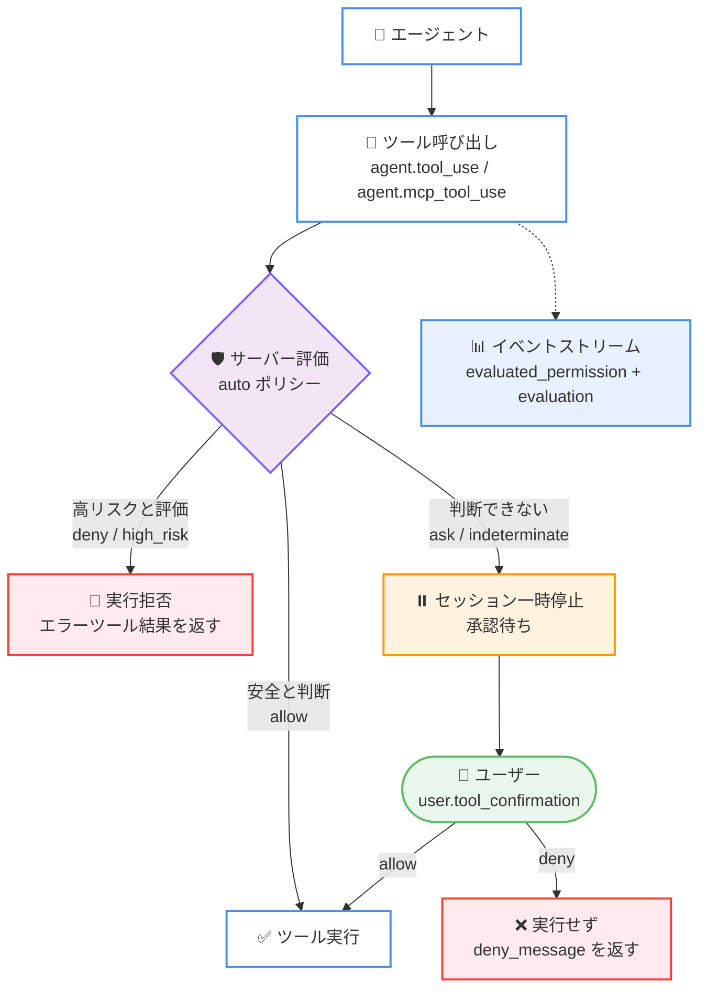
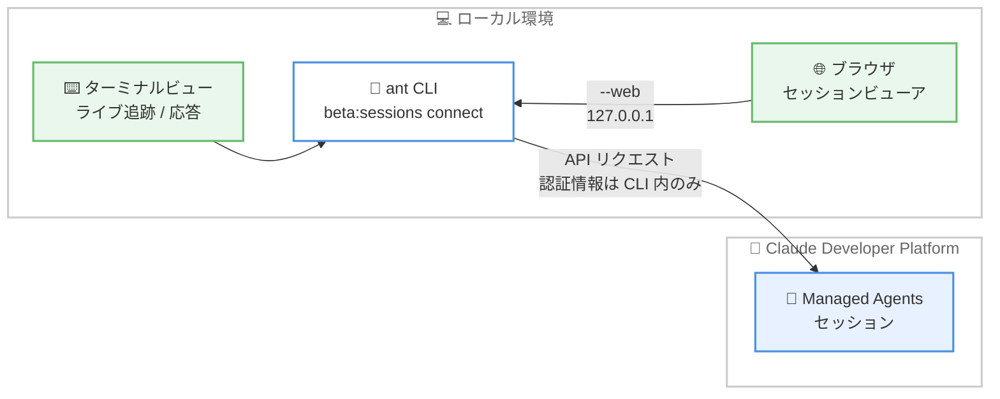

# Claude Managed Agents に auto 権限ポリシーが追加、ant CLI にセッション接続コマンドが登場

## メタデータ

| 項目 | 内容 |
|------|------|
| 発表日 | 2026-09-10 |
| ソース | Claude Developer Platform Release Notes |
| カテゴリ | API アップデート / CLI アップデート |
| 公式リンク | https://platform.claude.com/docs/en/release-notes/overview |

## 概要

2026 年 9 月 10 日付の Claude Developer Platform リリースノートで、Claude Managed Agents に関する 2 つのアップデートが発表されました。

1 つ目は、Managed Agents の権限ポリシーに `auto` が追加されたことです。`auto` を設定すると、サーバーがエージェントツールおよび MCP ツールの各呼び出しを評価し、実行・拒否・承認待機のいずれかを判断します。評価結果は `agent.tool_use` および `agent.mcp_tool_use` イベントの `evaluation` フィールドで、`evaluated_permission` とあわせて報告されます。

2 つ目は、`ant` CLI への `ant beta:sessions connect` コマンドの追加です。ターミナルを Managed Agents セッションに接続し、トランスクリプトのライブ追跡、メッセージ送信、承認待ちツール呼び出しの許可 / 拒否が行えます。`--web` オプションを付けると、Claude Console のセッションビューアをローカルで起動し、ブラウザからセッションを操作できます。

## 詳細

### 背景

Managed Agents では、サーバー実行型のツール (事前構築されたエージェントツールセットと MCP ツールセット) の実行を権限ポリシーで制御します。これまでのポリシーは、確認なしで自動実行する `always_allow` と、実行前に必ず承認を待つ `always_ask` の 2 種類でした。デフォルトはエージェントツールセットが `always_allow`、MCP ツールセットが `always_ask` です。

`always_allow` は承認の手間がない一方でリスクの高い呼び出しも素通りし、`always_ask` は安全な呼び出しにも毎回承認が必要でした。今回追加された `auto` は、この中間に位置する選択肢です。

また、承認待ちのツール呼び出しに応答するには、これまで API で `user.tool_confirmation` イベントを送信するか、Console を使用する必要がありました。`ant beta:sessions connect` により、ターミナルから対話的に応答できるようになりました。

### 主な変更点

**1. auto 権限ポリシー**

権限ポリシーの種類は以下の 3 つになりました。

| ポリシー | 動作 |
|---------|------|
| `always_allow` | 確認なしでツールを自動実行する |
| `always_ask` | セッションを一時停止し、承認を待ってから実行する |
| `auto` | サーバーが各呼び出しを評価し、実行・拒否・承認待機を判断する |

`auto` では、サーバーがツールの種類、呼び出しの入力、そこまでのセッション内容を考慮して評価するため、同じツールへの 2 つの呼び出しでも異なる判断になり得ます。各呼び出しの結果は次の 3 通りです。

- **実行**: サーバーが安全と判断した場合、`always_allow` と同様にツールが実行される
- **拒否**: サーバーが高リスクと評価した場合、ツールは実行されない。エージェントは `is_error: true` のエラーツール結果を受け取り、セッションは継続する。クライアントはこの拒否を覆せない
- **承認待機**: サーバーが判断を下せない場合、`always_ask` と同様にセッションが一時停止し、ユーザーの承認を待つ

`auto` を有効にするには、`permission_policy` に `{"type": "auto"}` を設定します。他のポリシーと同じく、ツールセット全体に適用する `default_config` と、個別ツールに適用する `configs` エントリの両方で指定できます。エージェントツールセットと MCP ツールセットのどちらでも使用可能で、デフォルトで `auto` になるツールセットはありません。

**2. evaluation フィールド**

すべての権限ポリシーにおいて、`agent.tool_use` および `agent.mcp_tool_use` イベントには権限チェックの結果を示す `evaluated_permission` (`"allow"`、`"ask"`、`"deny"` のいずれか) が含まれます。加えて、多くのイベントには、その結果を生んだポリシーを示す `evaluation` オブジェクトが含まれるようになりました。`auto` の場合は、サーバーの判断内容と、結果が `ask` または `deny` のときの `reason_code` も記録されます。

| `evaluation` | トップレベルの `evaluated_permission` | 意味 |
|--------------|----------------------------------|------|
| `{"type": "always_allow"}` | `"allow"` | ポリシーが `always_allow` のため実行された |
| `{"type": "always_ask"}` | `"ask"` | ポリシーが `always_ask` のため承認待ちになった |
| `{"type": "auto", "evaluated_permission": {"type": "allow"}}` | `"allow"` | `auto` でサーバーが安全と判断し実行された |
| `{"type": "auto", "evaluated_permission": {"type": "ask", "reason_code": "indeterminate"}}` | `"ask"` | `auto` でサーバーが判断を下せず承認待ちになった |
| `{"type": "auto", "evaluated_permission": {"type": "deny", "reason_code": "high_risk"}}` | `"deny"` | `auto` でサーバーが高リスクと評価し拒否した |

`reason_code` はクライアントが分岐処理や監査記録に使うための値であり、エンドユーザーに表示するテキストではありません。セッションで有効化されていないツールが呼ばれた場合や、`evaluation` 導入前に記録されたイベントでは、`evaluation` フィールドは含まれません。

**3. ant beta:sessions connect コマンド**

`ant` CLI に追加された `ant beta:sessions connect` は、ターミナルを既存の Managed Agents セッションに接続します。

```bash
ant beta:sessions connect sesn_011CZkZAtmR3yMPDzynEDxu7
```

- セッションのトランスクリプトを読み込み、エージェントの動作をライブで追跡する
- メッセージ送信 (`user.message`)、エージェントの中断 (`user.interrupt`) が可能
- 承認待ちのツール呼び出しに対し、Yes / No / 理由付きの No で応答できる。CLI は選択を `user.tool_confirmation` イベントとして送信する
- Ctrl+C でデタッチしてもセッションは動作し続け、再接続すると全履歴が読み込まれる
- マルチエージェントセッションでは、プライマリスレッドを追跡する

主なキー操作は以下のとおりです。

| キー | 動作 |
|------|------|
| Enter | 入力を `user.message` イベントとして送信 (Alt+Enter または Ctrl+J で改行) |
| Esc | 実行中のエージェントを中断 |
| Ctrl+O | 詳細表示の切り替え (ツールの入出力、トークン使用量、ステータスイベント) |
| Page Up / Page Down | トランスクリプトのスクロール |
| Ctrl+C | デタッチ |

`--web` オプションを付けると、Console のセッションビューアを `127.0.0.1` のローカルサーバーとして起動し、URL を表示してブラウザで開きます。ブラウザからもメッセージ送信、中断、ツール呼び出しの許可 / 拒否が行えます。ターミナルビューと異なり、ブラウザビューアはマルチエージェントセッションのすべてのスレッドを追跡します。URL は表示から 2 分以内に 1 回だけ開くことができ、認証情報は CLI の外に出ません。ページはローカルの `ant` プロセスにのみリクエストを送り、そのプロセスが API リクエストを行います。

### 技術的な詳細

`auto` ポリシーにおける意図の扱いには注意が必要です。`user.message` イベントで投稿した内容はユーザーの意図と見なされ、本来拒否される呼び出しが許可される可能性があります。一方、ツール結果、取得した Web ページ、MCP サーバーの応答、セッションスレッド間のメッセージからは意図を読み取りません。サーバーはこれらのコンテンツを評価しますが、指示としては受け取りません。また、信頼できないエンドユーザーの入力を `user.message` として中継すると、その入力もユーザーの意図として解釈されます。エンドユーザーにレビューなしで実行させたくないツールには `always_ask` を設定してください。

公式ドキュメントには次の警告があります。`auto` は人間によるチェックポイントではありません。サーバーが安全と判断した呼び出しは誰の目にも触れる前に実行され、その影響は取り消せない場合があります。実行前に人間のレビューが必須のツールには `always_ask` を設定する必要があります。

なお、Managed Agents API リクエストにはベータヘッダー `managed-agents-2026-04-01` が必要です (メモリストアエンドポイントは `agent-memory-2026-07-22`)。SDK は適切なベータヘッダーを自動的に設定します。カスタムツールはアプリケーション側で実行されるため、権限ポリシーの対象外です。

## 開発者への影響

### 対象

- Managed Agents でエージェントを構築している開発者
- MCP サーバーをエージェントに接続している開発者
- セッションイベントを処理するクライアントを実装している開発者
- `ant` CLI でエージェントの運用・デバッグを行う開発者

### 必要なアクション

- **auto の採用検討**: `always_allow` ではリスクが高く、`always_ask` では承認負荷が大きいツールについて、`auto` の採用を検討する。人間のレビューが必須のツールには引き続き `always_ask` を設定する
- **イベント処理の更新**: クライアントが未知の `evaluation.type` や `reason_code` を許容するように実装する。`evaluation` フィールドが存在しないイベント (無効なツールの呼び出しや過去のイベント) にも対応する
- **監査ログの活用**: `evaluation` フィールドと `reason_code` を監査記録に保存し、拒否時の分岐処理に利用する
- **拒否の扱い**: `auto` でサーバーが拒否した呼び出しに `user.tool_confirmation` を送ると 400 エラーになる。クライアントは拒否を覆せない点を考慮する
- **CLI の更新**: `ant beta:sessions connect` を使用するには CLI を最新版に更新する。スクリプトでは対話型のこのコマンドではなく、`ant beta:sessions:events stream` と `ant beta:sessions:events send` を使用する

## コード例

エージェントツールセットと GitHub MCP ツールセットのデフォルトを `auto` にし、`bash` のみ `always_ask` に上書きする例です。

```python
agent = client.beta.agents.create(
    name="Ops Agent",
    model="claude-opus-5",
    mcp_servers=[
        {"type": "url", "name": "github", "url": "https://mcp.example.com/github"},
    ],
    tools=[
        {
            "type": "agent_toolset_20260401",
            "default_config": {
                "permission_policy": {"type": "auto"},
            },
            "configs": [
                {"name": "bash", "permission_policy": {"type": "always_ask"}},
            ],
        },
        {
            "type": "mcp_toolset",
            "mcp_server_name": "github",
            "default_config": {
                "permission_policy": {"type": "auto"},
            },
        },
    ],
)
```

`auto` の下で高リスクと評価され拒否された呼び出しは、イベントストリームに次のように現れます。

```json
{
  "type": "agent.tool_use",
  "id": "sevt_01pqr...",
  "name": "bash",
  "input": {
    "command": "rm -rf /workspace/reports"
  },
  "evaluated_permission": "deny",
  "evaluation": {
    "type": "auto",
    "evaluated_permission": {
      "type": "deny",
      "reason_code": "high_risk"
    }
  },
  "processed_at": "2026-03-25T14:05:12Z"
}
```

ターミナルからセッションに接続する例です。

```bash
# ターミナルで接続してライブ追跡
ant beta:sessions connect sesn_011CZkZAtmR3yMPDzynEDxu7

# Console のセッションビューアをローカルで起動してブラウザで開く
ant beta:sessions connect sesn_011CZkZAtmR3yMPDzynEDxu7 --web
```

## アーキテクチャ図

`auto` ポリシーにおけるツール呼び出しの評価フローです。



`ant beta:sessions connect` の接続構成です。



## 関連リンク

- [Claude Developer Platform Release Notes](https://platform.claude.com/docs/en/release-notes/overview)
- [Permission policies - Let the server evaluate each call with auto](https://platform.claude.com/docs/en/managed-agents/permission-policies#let-the-server-evaluate-each-call-with-auto)
- [Connect to a Managed Agents session from your terminal](https://platform.claude.com/docs/en/cli-sdks-libraries/cli/sessions-connect)
- [Managed Agents - Sessions](https://platform.claude.com/docs/en/managed-agents/sessions)
- [Session event stream](https://platform.claude.com/docs/en/managed-agents/events-and-streaming)
- [CLI quickstart](https://platform.claude.com/docs/en/cli-sdks-libraries/cli/quickstart)

## まとめ

今回のアップデートは、Managed Agents の権限制御と運用性を強化するものです。`auto` 権限ポリシーにより、`always_allow` の利便性と `always_ask` の安全性の中間となる選択肢が提供され、サーバーが呼び出しごとにコンテキストを考慮して実行可否を判断できるようになりました。評価結果は `evaluation` フィールドで透明に報告され、監査や分岐処理に活用できます。ただし `auto` は人間によるチェックポイントの代替ではなく、レビューが必須のツールには `always_ask` を設定する必要があります。あわせて追加された `ant beta:sessions connect` により、ターミナルやローカルブラウザからセッションをライブで追跡し、承認待ちの呼び出しに即座に応答できるようになり、エージェント運用のワークフローが大きく改善されます。
