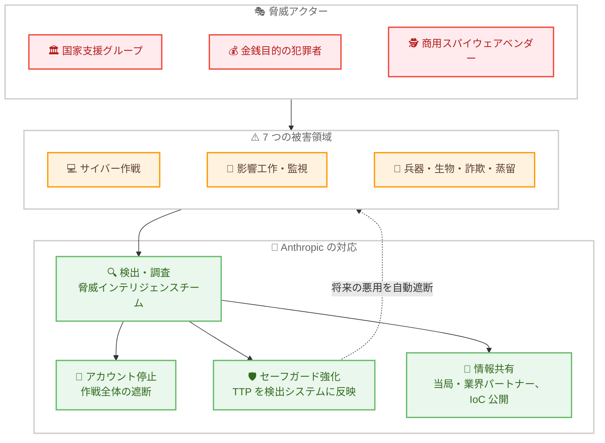

# AI の悪用の検出と対策: 2026 年 9 月版脅威インテリジェンスレポート

## メタデータ

| 項目 | 内容 |
|------|------|
| 発表日 | 2026-09-10 |
| ソース | Anthropic News |
| カテゴリ | 公式発表 / 安全性 / 脅威インテリジェンス |
| 公式リンク | https://www.anthropic.com/threat-intelligence-report-september-2026 |

## 概要

Anthropic は 2026 年 9 月 10 日、脅威インテリジェンスチームが過去 8 か月間 (2025 年 12 月から 2026 年 8 月) に特定・阻止した Claude の悪用事例をまとめた脅威インテリジェンスレポートを公開した。本レポートは 2025 年 3 月、8 月、11 月に続く第 4 弾であり、全 154 ページのフルレポート (PDF) として提供されている。サイバー作戦、影響工作、監視、詐欺・不正、生物学的悪用、通常兵器開発、不正な蒸留という 7 つの被害領域を対象とする。

関与した脅威アクターには、国家支援が疑われるグループ、金銭目的の犯罪者、商用スパイウェアベンダー、国家プロパガンダ機関、政治的動機を持つ個人が含まれる。悪用に使われたのは Claude Haiku、Sonnet、Opus の各モデルであり、不正な蒸留の 1 件を除き、Claude Fable および Mythos 系モデルでの悪用は確認されなかった。Anthropic は各事例で関連アカウントを停止し、得られた知見をセーフガードに反映し、必要に応じて当局や業界パートナーと情報を共有したと報告している。

## 詳細

### 背景

レポートで報告されるのは典型的な悪用ではなく、これまでに特定された中で最も注目すべき新しい脅威活動である。Anthropic は、モデルの能力向上に伴いリスクも増大するとの認識のもと、自社サービスの悪用を開示する責任があるとして本レポートを公開した。他の開発者が同様のパターンを自らのプラットフォームで認識し、政府や市民社会が新たな脅威の形成過程を把握し、集団的防御を強化することを目的としている。

レポート内では、AI を悪用するアクターを Anthropic 内部の識別子「GTG (Generative Threat Group)」で参照する。また、AI による能力向上を「アップリフト」と呼び、速度・規模・深さの観点から測定を試みている。

### 主な内容

#### 1. サイバー作戦: アシスタントからオーケストレーターへ

サイバー作戦の章では、AI の役割が単なる質問応答から、攻撃の直接実行やオーケストレーション (自律的な指揮) へと進化したことが示されている。主な事例は以下のとおり。

- **GTG-20006 (ロシアのスパイ活動)**: Midnight Blizzard との関連が疑われるアクター。ウクライナや欧州の政府・軍・ドローン供給網を標的とし、AI でマルウェアの検知回避と再構築を自動化。ホテル WiFi の DNS ハイジャックや WhatsApp アカウントの乗っ取りも実施した
- **GTG-50014 (ShinyHunters 系)**: 180 万本の Android アプリから認証情報を大量収集し、SaaS 経由のサプライチェーン攻撃、データ窃取、恐喝を実行した
- **GTG-10007 (中国語話者の作戦)**: 湖南省の学生を含むグループが、AI 駆動の脆弱性研究、ゼロデイ探索、自律偵察を 24 時間体制で運用した
- **GTG-50020 / GTG-50021 (AI 供給網への攻撃)**: 偽の AI 再販業者を装って認証情報を窃取するなど、AI の供給網自体を標的とした
- **GTG-50029 (ハクティビスト)**: 単独の攻撃者が盗んだ API キーで欧州の政党やメディアを攻撃し、ダークウェブ上に個人情報検索 (ドクシング) 基盤を構築した

全体的な傾向として、以下が挙げられている。

- **高度な攻撃に高度な攻撃者は不要になった**: AI が労力とツーリングの格差を縮小し、国家支援型の作戦と個人の攻撃者の能力差が消失しつつある。調査担当者にとって、攻撃の高度さは背後のアクターを推定する信頼できるシグナルではなくなった
- **AI の役割の自律化**: 2025 年 11 月に報告した自律攻撃の運用モデルが、あらゆる階層のアクターに拡散した。PentAGI のような公開されている攻撃エージェントフレームワークが、サイバーキルチェーンの各段階を自動化する足場を誰にでも提供している
- **攻撃の経済性の変化**: 少人数・低コストで多数の標的に対する並行攻撃が可能になった
- **AI 認証情報の標的化**: AI の API キーや認証情報自体が「戦利品・計算資源・隠れ蓑」として犯罪の標的になっている

#### 2. 監視作戦

2026 年 1 月から 7 月にかけて、国家系アクター、国家関連の請負業者、商用スパイウェアベンダーが Claude を監視作戦の構築・運用に悪用した一連の事例が阻止された。中国、イラン、西アフリカのアクターや、商用の「監視サービス」市場が含まれる。

- **エンジニアリング人材の代替**: マリの国家安全保障当局に協力する単独のコンサルタントが、国内すべての携帯電話事業者の通信を傍受し標的の身上調書を生成できる大量傍受プラットフォームを Claude で設計した。イランのアクターはソーシャルネットワークからユーザーの身元を収集する悪意ある Firefox 拡張機能を構築・展開した
- **大量データの取り込みによる標的特定**: イランの部隊は数十万件のソーシャルメディア投稿を分析して監視対象の反体制派アカウント 39 件を選定した。中国のアクターはコンテンツを政治的敏感度でスコアリングし「管理」対象の候補をフラグ付けした。アラビア語能力を持たない中国系アクターが、Claude による方言での文面作成とリアルタイム翻訳を用いて、シリアのウイグル人標的への数日間にわたる潜入・勧誘作戦を実行した事例もある
- **国家の安全保障機構への統合**: 中国のある国家安全部門は監視作戦での AI 活用マニュアルを Claude で作成しており、AI が国家アクターの日常業務に深く統合されつつあることを示している
- **GTG-54009 (商用監視プラットフォーム)**: イスラエル・シンガポール系の商用インテリジェンスベンダー「S2T Unlocking Cyberspace」によるものとみられる活動。イランおよびペルシャ湾岸のソーシャルメディアユーザーを分析・分類・プロファイリングするプラットフォームを構築していた。255 件を超える偽ソーシャルアカウントの作成も確認され、パイロット段階で停止された

これらの作戦の標的の多くは、香港の民主派、チベット・法輪功コミュニティ、イラン国外の反体制派など、各体制が歴史的に標的としてきたディアスポラ・反体制コミュニティである。

#### 3. 影響工作

- **中央アフリカ共和国でのロシア系工作**: ラジオ局経由の親ロシア宣伝。外部調査団体からの情報提供が調査の端緒となった
- **影響力のサービス化**: 6 大陸を対象に約 70 の偽ニュースサイトを運営し、8,900 本を超える記事を生成
- **マレーシアの選挙操作プラットフォーム**: 約 1,000 の偽ソーシャルメディアアカウントを運用
- **ロシア国営メディアの編集パイプライン**: モルドバ選挙前の偽情報生成などに Claude を利用

影響工作の到達度の評価には、6 段階の Breakout Scale が適用されている。

#### 4. 通常兵器

2025 年 11 月の前回レポート以降に確認された新カテゴリの悪用として、火器、ミサイル、武装ドローン、爆弾などの通常兵器と、その標的設定・制御システムのソフトウェア開発への Claude の利用が報告された。中国 3 件、ロシア 2 件、イエメン 1 件の計 6 事例が共有されている。

- **兵器の開発・設計 (4 件)**: 実地試験まで実施された誘導ロケットプログラム (イエメンの GTG-87001)、魚雷迎撃システムの設計・提案、シミュレーションで試験され実基板にコードが搭載されたドローンスワーム用ソフトウェア、電子戦・防空制圧用の標的設定ソフトウェア
- **調達・情報収集 (2 件)**: ロシアの防衛顧客向けの両用品 (デュアルユース品) の調達、指向性エネルギー兵器とその供給業者に関する公開情報の収集

アクターは作業を多数のセッションに分割してプログラムの全容を隠蔽し、セーフガードやアクセス制御の回避を試みていた。Anthropic はこれらの調査結果を反映し、高性能爆薬や兵器開発に関連するトラフィックを検出・遮断する新しい分類器群を展開した。あわせて、Frontier Red Team が戦術情報標的設定と通常兵器開発における AI 能力を測定する新しい評価を開発しており、モデルが着実に進歩していることが示されている。

#### 5. 生物学的悪用

生物兵器開発を支援しうる形でモデルが使用された 5 つのケーススタディが提示された。AI 企業が自社プラットフォームの生物兵器関連の悪用の可能性に関する証拠を公開するのは、Anthropic の知る限り初めてであるとしている。

- 地域ブロックを回避した再販業者プラットフォームが、国家助成金によるチクングニアウイルスの機能獲得研究に従事するウイルス学者にサービスを提供し、拒否されたプロンプトをより許容的なセーフガードのモデルへ転送していた事例
- サポート対象外地域の研究者が鳥インフルエンザの哺乳類適応実験を数週間かけて計画したが、分類器により最も能力の低いモデルに制限された事例
- 再販中継業者経由で Opus 5 がオルソポックスウイルスの免疫回避に関する研究助成申請書一式を約 1 時間で作成した事例
- 国家支援の研究者が麻痺・鎮痛標的に向けた毒液ペプチドのアトラスと生成的最適化パイプラインを構築した事例
- 国家プログラムのために毒素を計算的に再設計し、進捗報告書では対象物質の特定を意図的に曖昧にするよう Claude に指示していた事例

Anthropic は、生物学的能力の両用性 (デュアルユース) により有益な研究と有害な研究の区別が本質的に困難であること、高度なアクターがこの性質を利用して「もっともらしい否認可能性」を維持していることを指摘した。旧世代モデル (Claude Opus 4 や Claude Sonnet 4.5) は危険な生物学研究を支援できる能力の閾値を大きく下回っていたが、現在のモデルではその保証ができないため、Claude Fable 5 などの最新モデルには両用の生物学研究クエリへのアクセスを広く制限するより強力なセーフガードを導入したと説明している。なお、関係者は現役の科学者であり加害の意図は断定できないとして、研究機関名、国名、具体的な病原体や研究手法は非公開とされた。

#### 6. 詐欺・不正: 偽出会い系アプリネットワーク (GTG-15001)

中国拠点のアプリ開発スタジオが、Claude を用いて 20 本超の出会い系アプリのネットワークを構築し、「完全に人間によるサービス」と宣伝しながら AI ペルソナで会話を運用していた事例。

- 2026 年 4 月の 2 週間で、4,700 超の AI ペルソナが少なくとも 25,000 人のユーザーと会話し、Claude によるメッセージは約 236 万件に達した
- AI ペルソナと実在のギグワーカーの比率は約 3 対 1 で、ビデオ通話やソーシャルメディアのフォローバックなど AI にできない「本物らしさの確認」を人間が担当した
- 複数の AI プロバイダーのモデルが役割分担して悪用され、Anthropic は関係するプロバイダーに詳細を直接共有した
- App Store / Play Store の審査を回避するため、審査中のみ動作する UI コントローラーや、アプリ間の類似性検査を回避するクラス名の差別化などが実装されていた

Anthropic は関連アカウントと組織を停止し、ドメイン、ネットワーク、バックエンド、アプリパッケージ名などの IoC (侵害指標) を公開した。

#### 7. 不正な蒸留

2026 年 2 月の初回開示以降、中国拠点の 7 つのラボによる Claude への蒸留攻撃を新たに特定・阻止した。攻撃対象はすべて一般提供中のモデルであり、一般公開されていない Mythos 5 や Mythos Preview への攻撃は観測されていない。

- **不正な蒸留の定義**: 承認なくモデルの能力を産業規模で密かに抽出し、別のモデルに複製するキャンペーン。盗まれたクレジットカード、ログイン認証情報、API キーで作成された偽アカウントの高度なネットワークという不正行為によって支えられている
- **アクセス手法**: 「中継ステーション」と呼ばれるプロキシサービス経由でリクエストを転送し、地理的制限を回避。正規の企業や個人から盗んだ API 認証情報が使われ、正規顧客に被害が及んでいる。プロキシ運営者がユーザーの同意なく保存した会話ログを第三者から購入する手口や、自社ユーザーのリクエストを無断で Claude に転送して会話を収集する手口も確認された
- **推論トレースの抽出**: 単純な指示からより高度な手法まで、Anthropic の蒸留対策を回避して推論トレース (reasoning trace) を抽出するさまざまなプロンプト操作が観測された。ある未承認ラボは 12,000 件超のリクエストで抽出手法を試験し、成功した手法で大規模攻撃を開始した
- **GTG-16005 (Alibaba / Qwen / Tongyi Lab)**: Anthropic がこれまでに測定した中で最大の蒸留攻撃。Opus 4.6 および 4.7 の思考連鎖 (CoT) 推論トランスクリプトを標的とし、ピーク時には 3,500 超の不正アカウントから 1 日あたり約 300 万件の交換が発生した。収集された CoT トランスクリプトは教師あり微調整 (SFT) データに変換され、Qwen 3.5、3.6、3.7 への Claude の能力の蒸留に使用された
- **ユーザーデータの問題**: DeepSeek、Xiaomi、Moonshot が自社モデルとユーザーの会話を Claude に入力し、その応答を蒸留用の訓練データとして使用していた。これらの交換には個人、多国籍企業、国家関連アクターの機微情報 (氏名、メールアドレス、企業データなど) が含まれ、少なくとも 12 の言語にわたる数百人のエンドユーザーのデータが確認された。こうした行為はプライバシー法や各ラボ自身の利用規約に違反する可能性が高いと指摘されている

Anthropic の研究では、蒸留された能力の向上は攻撃で標的とされた領域を超えて波及し、収集された交換に生物学やサイバーに関する内容がほとんど含まれていなくても、蒸留モデルが危険な能力の獲得を助けうることが示された。Claude の悪用を防ぐ堅牢なセーフガードは、未承認ラボによる蒸留では引き継がれない。

### 技術的な詳細

すべての事例に共通する Anthropic の対応プロセスは以下のとおりである。

1. **検出と調査**: 検出システムと脅威インテリジェンスチームの調査により悪用を特定する。外部パートナーからの情報提供が端緒となる場合もある
2. **停止 (BAN)**: アクターに紐づくすべてのアカウント・組織を停止し、作戦全体を遮断する
3. **セーフガードの強化**: 観測された TTP (戦術・技術・手順) や行動シグネチャを検出システムにフィードバックし、将来の悪用を自動的に検出・遮断できるようにする。高性能爆薬・兵器開発向けの新しい分類器群の展開はその一例である
4. **情報共有**: 政府当局、業界パートナー、他の AI ラボ、被害者と適切に情報を共有する。攻撃元 IP、ドメイン、アプリパッケージ名などの IoC も公開する

## アーキテクチャ図

## 開発者への影響

### 対象

- **セキュリティチーム・脅威インテリジェンス担当者**: レポートには GTG ごとの TTP、IoC (ドメイン、IP、アプリパッケージ名など) が含まれており、自組織の防御・検知ルールへの反映に活用できる
- **API キーを管理する開発者・企業**: 盗まれた API キーや認証情報が攻撃の資源・隠れ蓑として標的化されている。キー管理と漏えい監視の重要性が高まっている
- **AI プラットフォーム事業者**: 偽再販業者、プロキシ経由のアクセス、不正な蒸留といった手口は他のプラットフォームでも再現されうるパターンであり、同様の検出体制の参考になる
- **一般の Claude ユーザー**: 直接的な対応は不要。ただし、非公式の再販業者や「格安 Claude アクセス」をうたうサービスは、認証情報の窃取や会話ログの無断収集に関与している場合があるため利用を避けるべきである

### 必要なアクション

一般ユーザーに必須のアクションはない。セキュリティ担当者には以下が推奨される。

- フルレポートに掲載された IoC を自組織の検知基盤に取り込む
- Anthropic の API キーを含む認証情報の保管・ローテーション体制を点検する
- 第三者のモデルルーティングサービスやプロキシ経由で機微情報を送信するリスクを再評価する

### 移行ガイド (該当する場合)

該当なし。

## 関連リンク

- [公式発表: Detecting and countering misuse of AI: September 2026](https://www.anthropic.com/threat-intelligence-report-september-2026)
- [フルレポート PDF (全 154 ページ)](https://www-cdn.anthropic.com/e50be2e51e7695dc4b1366a37a245a597377d3b5/Anthropic-Detecting-and-countering-091026.pdf)
- [Anthropic News](https://www.anthropic.com/news)
- [Anthropic 利用規約 (Usage Policy)](https://www.anthropic.com/legal/aup)

## まとめ

本レポートは、AI の悪用が「アシスタントとしての利用」から「攻撃の自律的なオーケストレーション」へと質的に変化したことを、具体的な事例と数値で示した点で重要である。高度な攻撃に高度な攻撃者が不要になったこと、国家の監視機構やプロパガンダ機関に AI が日常業務として組み込まれつつあること、そして API キーや推論トレースといった AI 資産そのものが攻撃対象になっていることは、AI 業界全体に共通する課題である。

一方で、Fable / Mythos 系の最新モデルでは (蒸留 1 件を除き) 悪用が確認されなかったという報告は、フロンティアモデルへのより強力なセーフガードの導入が一定の効果を上げていることを示唆する。生物兵器関連の悪用の可能性を AI 企業として初めて公開した点や、Alibaba による過去最大の蒸留攻撃と PRC ラボによるユーザーデータの扱いを名指しで指摘した点など、透明性の高い開示は業界の脅威情報共有の先例となるものであり、防御側の組織はフルレポートの IoC と TTP を自組織の対策に活用することが推奨される。
