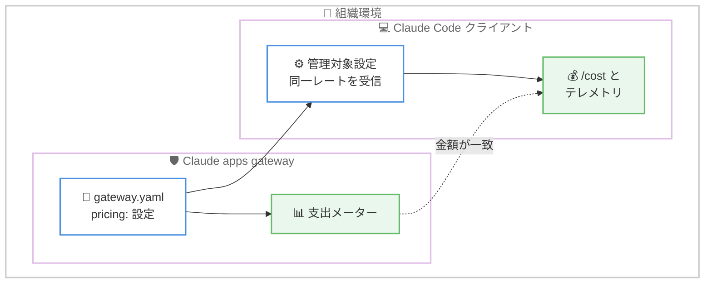

# Claude Code v2.1.268 リリース — Claude apps gateway の pricing 対応と権限・セキュリティ修正の集中投入

## メタデータ

| 項目 | 内容 |
|------|------|
| 発表日 | 2026-09-11 (確認日) |
| ソース | Claude Code Changelog |
| カテゴリ | Claude Code アップデート |
| 公式リンク | https://github.com/anthropics/claude-code/blob/main/CHANGELOG.md |

## 概要

Claude Code v2.1.268 がリリースされた。今回のリリースの中心テーマは 2 つある。1 つ目は **Claude apps gateway 関連の機能強化**で、`gateway.yaml` に `pricing:` を設定するとサインイン済みの Claude Code クライアントが管理対象設定経由で同じレートを受け取り、`/cost` とテレメトリの表示がゲートウェイの支出メーターと一致するようになった。あわせて、`access_control.allow_cidrs` が空の場合の起動時警告や、組織の公開 IPv4 ブロックから `/login` を許可する `gatewayInternalNetworks` 管理対象設定も追加された。

2 つ目は**権限チェックとセキュリティの修正**である。シンボリックリンクされたディレクトリ (macOS の `/etc`、`/tmp`、`/var`、Linux の `/bin`) に対する deny / ask ルールが実パス指定時に適用されない問題、`env -C` や `eval` を同一行に含む Bash コマンドで Read / Edit の deny ルールがバイパスされる問題、プラグインや MCP のエラー表示にトークンやパスワードが露出する問題などが修正された。このほか、WebFetch が応答を返さないサーバーで無限に待ち続ける問題への 300 秒デッドラインの導入、アイドルセッションで CPU コアを占有し続けるビジーループの修正、サードパーティの Anthropic 互換エンドポイントで全ターンが HTTP 400 になるリグレッションの修正など、90 件超の変更が含まれる大型リリースとなっている。

## 詳細

### 背景

前バージョンは 2026 年 9 月 9 日リリースの v2.1.267 で、プロンプトキャッシュ安定性の大幅改善と `maxEffortLevel` 設定の追加を中心としたリリースだった。v2.1.268 はその流れを引き継ぎつつ、エンタープライズ向けのゲートウェイ管理機能と、権限システムの抜け穴をふさぐセキュリティ修正に重点を置いている。

また、v2.1.265 以降、Artifact ツールの入力スキーマに含まれる正規表現をサードパーティの Anthropic 互換エンドポイント (`ANTHROPIC_BASE_URL`) が拒否し、すべてのターンが HTTP 400 で失敗するリグレッションが発生していた。v2.1.268 ではこの問題が修正されており、互換エンドポイント経由の利用者にとっては必須のアップデートとなる。

### 主な変更点

#### 新機能 (Added)

- **Claude apps gateway の pricing 対応**: `gateway.yaml` に `pricing:` を設定すると、サインイン済みの Claude Code クライアントが管理対象設定を通じて同じレートを受け取る。これにより `/cost` とテレメトリの金額がゲートウェイの支出メーターと一致する
- **ゲートウェイの起動時警告**: `access_control.allow_cidrs` が空の場合に起動時に警告を表示し、公開アドレスからの最初のリクエスト到達時にも 1 回だけ警告を表示する
- **`gatewayInternalNetworks` 管理対象設定**: 組織が保有する公開 IPv4 ブロックからの Claude apps gateway への `/login` を管理者が許可できる
- **`claude self-hosted-runner --remove-session-state`**: セッション終了時に `<base-dir>/_sessions/` 配下のセッションごとのディレクトリを削除する (デフォルトは無効)
- **CLI の JSON 出力の拡充**: `claude auth status --json` の出力に `configDirectory` が追加され、`claude plugin install` / `uninstall` / `update` / `enable` / `disable` に `--json` が追加された。`claude plugin list --json` の各行には `errorDetails` / `noteDetails` が追加された
- **公開アーティファクトのブラウザタブアイコン**: 各ページの内容に合わせて Claude が選択したアイコンが表示される

#### 修正 (Fixed) — セキュリティと権限

- **シンボリックリンクディレクトリの deny / ask ルール**: macOS の `/etc`、`/tmp`、`/var`、Linux の `/bin` などシンボリックリンクされたディレクトリに対するルールが、実パスで指定された場合に適用されない問題と、シンボリックリンク側のパス表記で書かれた deny ルールを Bash コマンドが無視する問題を修正
- **解析不能コマンドによる deny ルールのバイパス**: `env -C` や `eval` など権限チェッカーが解析できないコマンドが同一行にある場合に、Read / Edit の deny ルールが適用されないケースを修正
- **シークレットの露出防止**: プラグインとマーケットプレイスのエラーが git ソース URL 内のトークンやパスワードを表示する問題、および `/mcp` と `/plugin` のサーバー詳細、`claude mcp list` / `get`、MCP ログインエラーが MCP 設定の `${VAR}` プレースホルダから解決されたシークレットを表示する問題を修正
- **未信頼フォルダのエージェントファイル**: 再起動されたインプロセスのチームメイトが、信頼していないフォルダ内の同名エージェントファイルからツールやシステムプロンプトを取り込む問題を修正
- **Bash サンドボックスの説明の適正化**: ファイルシステム分離が無効な場合に強制されないパスリストを提示しない、strict モードでコマンドが決してサンドボックス外で実行されないとは主張しない、など封じ込めの過大な説明を修正

#### 修正 (Fixed) — 安定性とパフォーマンス

- **サードパーティ互換エンドポイントの HTTP 400**: v2.1.265 以降、`ANTHROPIC_BASE_URL` で指定したサードパーティの Anthropic 互換エンドポイントで全ターンが失敗していた問題を修正。原因は Artifact ツールの入力スキーマ内の正規表現をこれらのエンドポイントが拒否していたこと
- **WebFetch のタイムアウト導入**: 応答を開いたまま完了しないサーバーで WebFetch が無限にハングする問題を修正。フェッチは 300 秒で失敗するようになり、`CLAUDE_CODE_WEBFETCH_DEADLINE_MS` でデッドラインを上書きできる (0 で無効化)
- **CPU 使用率の修正**: 長時間のアイドルセッションでビジーループが CPU コアを占有し続ける問題と、セッションリキャップ中の高頻度なターミナルフォーカス通知が CPU 使用率を高止まりさせる問題を修正
- **MCP ツール呼び出し後の空メッセージ**: MCP ツール呼び出しの後に Claude が「your message came through empty」と返答することがある問題を修正
- **SDK セッションのキャッシュ破壊**: `excludeDynamicSections` を使用する SDK セッションで、最初のメッセージがリクエストごとに再レンダリングされ、プロンプトキャッシュと extended thinking がセッション途中で壊れる問題を修正
- **モデルアクセスのキャッシュ問題**: 権限のあるユーザーが再起動後や Desktop の Code タブでモデル制限を通知される問題と、別の Claude Code プロセスが古いモデルアクセスエントリを更新した際に実行中のセッションが組織のデフォルトモデルへ静かに切り替わる問題を修正

#### 修正 (Fixed) — CLI / セッション操作

- `/compact` と自動コンパクトが生成する会話サマリーが `$` シーケンスを含むテキストを破損する問題を修正
- `/compact` で終了した会話の再開時に、復元ファイルのノートが毎回同じ順序で読み込まれるようになった
- SDK のプロンプト提案、サイドクエスチョン、`/rename` がコンパクション前の会話を送信する問題を修正
- 上矢印で過去のプロンプトを呼び出して編集した後に `@` ファイル補完と `/` コマンド補完が表示されない問題を修正
- `/resume` が `/fork` のバックグラウンドセッションを親の名前で表示する問題を修正 (フォーク名で表示されるようになった)
- `CLAUDE_CODE_SESSIONEND_HOOKS_TIMEOUT_MS` が per-hook の `timeout` を持たない SessionEnd フックに適用されない問題を修正
- PermissionRequest フックが `--print` モードで発火しない問題と、ヘッドレス (`-p`) 実行でポリシーヘルパーの警告が出力されない問題を修正
- MCP サーバーの OAuth サインインがローカルコールバックのポート範囲をバインドできない場合に失敗する問題を修正

#### 改善 (Improved)

- **フルスクリーンモードの描画高速化**: プロンプト行の追加・削除 (Shift+Enter) が、表示中のトランスクリプトを再レンダリングせず、文字入力と同じ速さで再描画されるようになった
- **`--continue` / `--resume` の高速化**: SessionStart フックを待たずに会話が即座に表示され、最初のメッセージがトランスクリプト全体を再読み込みしなくなった
- **ツール多用ターンの応答性改善**: 非表示のツールバッチごとのリマインダーのためにトランスクリプトを再描画しなくなった
- **起動時間の改善**: `.claude/workflows/` スクリプトを持つプロジェクトで、一覧表示時に各スクリプトをパースしなくなった
- **auto モードの拒否メッセージの改善**: ブロックしたルール名を Claude に伝え、より安全な方法を試し、無関係な作業を終えてからユーザーに確認するよう促すようになった
- **`/plugin` の即時反映**: プラグインのインストール、有効化、無効化がメニューを閉じた時点で反映され、`/reload-plugins` が不要になった

#### 変更 (Changed)

- **Bedrock / Vertex / Foundry の first-party セッションとの整合**: システムプロンプトが環境・モデル・設定の詳細を添付として渡すようになり、ツールリストが会話を通じてバイト単位で安定するようになった (遅れて接続されたツールは deferred として読み込まれる)
- **タスク管理ツールの提供モデルの限定**: TaskCreate / TaskGet / TaskUpdate / TaskList と TodoWrite は Claude 3.x、Opus 4.0–4.7、Sonnet 4.0–4.6、Haiku 4.5 でのみ提供される。それ以外のモデルで使う場合は `CLAUDE_CODE_ENABLE_TODO_TOOLS=1` を設定する
- **Artifact ツールのローカルファイル保護**: すべての承認をスキップする設定のローカル Cowork セッションでも、セッションのフォルダ外またはシンボリックリンク越しのローカルファイルは、確認なしに読み取らず拒否するようになった
- **WebFetch ルールと Artifact の分離**: プレーンな `WebFetch` の deny / ask ルールは Artifact ツールの読み取り・更新に適用されなくなった。ブロックやゲートには `Artifact` ルールまたは `WebFetch(domain:claude.ai)` を使用する

#### プラットフォーム別の変更

- **[VS Code]**: `CLAUDE_CONFIG_DIR` が設定ファイルや `environmentVariables` 設定にある場合のセッションリスト・設定トグル・チャットタブの修正、ログイン / ログアウト後にモデルピルなどが数秒空白になる問題の修正、Windows で WSL 未インストール環境に WSL インストールプロンプトが表示される問題の修正など、多数の修正が含まれる。キーボード / スクリーンリーダーユーザー向けに、always-allow ルールの保存先を左右矢印キーで変更する機能と「Claude Code: Focus last message」コマンドが追加された
- **[Claude Code on the web]**: 約 6 時間を超えるクラウドセッションで永続化フォルダへの保存が静かに失われる問題を修正し、保存は最大 1 日間持続するようになった。管理者がモデルの effort に上限を設定している組織での「Invalid effort level」エラーも修正された
- **[Claude Tag]**: Slack でのパブリックチャンネルのメモリがチャンネルごとに分離され、他のパブリックチャンネルで保存したノートを呼び出さなくなった (ワークスペースノートは共有のまま)。読み取り専用の検索を並列実行することで応答速度も改善された
- **[Code Review]**: 検証エージェントが途中で失敗した場合にレビューが不完全なまま終わる問題を修正し、エージェントを置き換えて判定に到達するようになった

### 技術的な詳細

**Claude apps gateway の pricing 連携**: Claude apps gateway は組織が自前で運用する LLM ゲートウェイで、モデルアクセスの制御や支出の計測を担う。v2.1.268 では `gateway.yaml` の `pricing:` 設定がクライアント側に伝搬するようになり、ゲートウェイ側の支出メーターとクライアント側の `/cost` コマンドおよびテレメトリが同一のレートで計算される。これまで両者の数値が乖離し得たコスト管理上の課題が解消される。



**権限ルールバイパスの修正**: 今回修正された権限まわりの問題は、いずれも「ルールの記述と実際のパス・コマンドの解釈のずれ」に起因する。

1. **シンボリックリンクの二重経路**: macOS では `/etc`、`/tmp`、`/var` が、Linux では `/bin` がシンボリックリンクである。deny / ask ルールをリンク側のパスで書いても実パス (例: `/private/etc`) でアクセスされると適用されず、逆に Bash コマンドがリンク側の表記で書かれた deny ルールを無視するケースがあった。v2.1.268 では双方向で一致が取られる
2. **解析不能コマンドの同居**: `env -C` や `eval` のように権限チェッカーが静的に解析できないコマンドが同一行にあると、Read / Edit の deny ルールが適用されないケースがあった

deny ルールで機密ファイルへのアクセスを制限している環境では、これらの修正によって想定どおりの防御が機能するようになるため、早期の更新が推奨される。

**WebFetch のデッドライン**: 応答を開いたまま完了しないサーバーに対して WebFetch が無限に待ち続ける問題への対策として、300 秒 (5 分) のデッドラインが導入された。環境変数 `CLAUDE_CODE_WEBFETCH_DEADLINE_MS` でミリ秒単位の上書きが可能で、`0` を設定するとデッドラインを無効化できる。あわせて、localhost などドットを含まないホスト名に対するエラーメッセージも、拒否の理由と curl の利用を提案する内容に改善された。

**タスク管理ツールのモデル限定**: TaskCreate / TaskGet / TaskUpdate / TaskList および TodoWrite は、Claude 3.x、Opus 4.0–4.7、Sonnet 4.0–4.6、Haiku 4.5 に限定して提供されるようになった。これらより新しいモデルではタスク管理が別の仕組みで扱われるためと考えられる。従来の動作に依存するワークフローがある場合は、環境変数 `CLAUDE_CODE_ENABLE_TODO_TOOLS=1` で対象外のモデルでも有効化できる。

## 開発者への影響

### 対象

- **サードパーティの Anthropic 互換エンドポイント (`ANTHROPIC_BASE_URL`) の利用者**: v2.1.265 以降の全ターン HTTP 400 リグレッションが修正されるため、必須のアップデートとなる
- **Claude apps gateway を運用する組織の管理者**: `pricing:` 設定によるコスト表示の一致、`allow_cidrs` 未設定時の警告、`gatewayInternalNetworks` による `/login` 許可など、運用機能が拡充される
- **deny / ask 権限ルールで防御している組織・ユーザー**: シンボリックリンク経由や `env -C` / `eval` 同居によるバイパスが修正され、ルールが意図どおり機能するようになる
- **プラグイン / MCP でシークレットを扱うユーザー**: エラー表示へのトークン・パスワード露出が防止される
- **長時間セッションの利用者**: アイドル時の CPU 占有、WebFetch のハング、モデルの静かな切り替わりなどの問題が解消される
- **CI / 自動化で CLI を使う開発者**: `claude plugin` 各コマンドの `--json` 対応と `claude auth status --json` の `configDirectory` 追加により、スクリプトからの制御が容易になる
- **TodoWrite / タスク管理ツールに依存するワークフローの利用者**: 対象モデルが限定されるため、必要に応じて環境変数での有効化を検討する

### 必要なアクション

以下のいずれかの方法で最新バージョンに更新できる。

```bash
# Claude Code 組み込みコマンド
claude update

# npm でのアップデート
npm update -g @anthropic-ai/claude-code

# バージョンを指定してインストールする場合
npm install -g @anthropic-ai/claude-code@2.1.268

# 現在のバージョン確認
claude --version
```

### 移行ガイド (該当する場合)

破壊的変更はアナウンスされていないが、以下の動作変更に注意が必要である。

- **WebFetch ルールで Artifact を制御していた場合**: プレーンな `WebFetch` の deny / ask ルールは Artifact ツールの読み取り・更新に適用されなくなった。引き続きブロックやゲートが必要な場合は、`Artifact` ルールまたは `WebFetch(domain:claude.ai)` に書き換える
- **タスク管理ツールを新しいモデルで使う場合**: TaskCreate / TaskGet / TaskUpdate / TaskList と TodoWrite が提供されるモデルが限定された。対象外のモデルで必要な場合は `CLAUDE_CODE_ENABLE_TODO_TOOLS=1` を設定する
- **WebFetch で 5 分を超える取得を行う場合**: 300 秒のデッドラインが導入されたため、必要に応じて `CLAUDE_CODE_WEBFETCH_DEADLINE_MS` で延長するか、`0` で無効化する
- **承認スキップ設定のローカル Cowork セッション**: Artifact ツールがセッションフォルダ外やシンボリックリンク越しのローカルファイルを確認なしに読み取らなくなった。該当ファイルを扱うワークフローは動作を確認する

## コード例

Claude apps gateway で pricing を設定し、クライアントの `/cost` と一致させる例。

```yaml
# gateway.yaml
pricing:
  # モデルごとのレートを定義すると、サインイン済みの
  # Claude Code クライアントに管理対象設定経由で伝搬する
  claude-opus-4-6:
    input_per_mtok: 5.00
    output_per_mtok: 25.00

access_control:
  # 空のままにすると起動時に警告が表示される
  allow_cidrs:
    - 10.0.0.0/8
```

WebFetch のデッドラインを調整する例。

```bash
# デッドラインを 10 分に延長
export CLAUDE_CODE_WEBFETCH_DEADLINE_MS=600000

# デッドラインを無効化 (従来の動作に戻す)
export CLAUDE_CODE_WEBFETCH_DEADLINE_MS=0
```

タスク管理ツールを対象外のモデルでも有効化する例。

```bash
export CLAUDE_CODE_ENABLE_TODO_TOOLS=1
```

## 関連リンク

- [Claude Code Changelog](https://github.com/anthropics/claude-code/blob/main/CHANGELOG.md)
- [Claude Code npm パッケージ](https://www.npmjs.com/package/@anthropic-ai/claude-code)
- [Claude Code GitHub リポジトリ](https://github.com/anthropics/claude-code)
- [Claude Code ドキュメント](https://docs.anthropic.com/en/docs/claude-code)
- [Claude Code v2.1.267](./2026-09-09-claude-code-v2-1-267.md)
- [Claude Code v2.1.265 / v2.1.266](./2026-09-08-claude-code-v2-1-265-v2-1-266.md)

## まとめ

Claude Code v2.1.268 は、エンタープライズ向けのゲートウェイ管理機能とセキュリティ修正を中心とした大型リリースである。Claude apps gateway の `pricing:` 対応により、組織の支出メーターとクライアントの `/cost` 表示が一致するようになり、コスト管理の一貫性が向上した。

セキュリティ面では、シンボリックリンクディレクトリや解析不能コマンドを介した deny ルールのバイパス、エラー表示へのシークレット露出、未信頼フォルダからのエージェント定義の取り込みといった複数の抜け穴が修正された。さらに、サードパーティ互換エンドポイントの HTTP 400 リグレッション修正、WebFetch の 300 秒デッドライン導入、アイドルセッションの CPU 占有解消など、安定性の改善も幅広く含まれており、すべての利用者に更新が推奨されるアップデートである。
