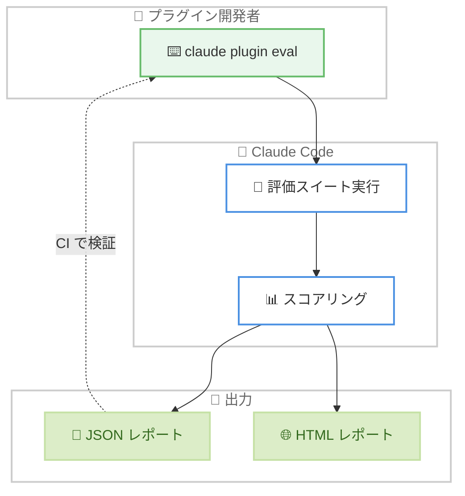

# Claude Code v2.1.269 リリース — `claude plugin eval` の導入とプロンプトキャッシュ・権限ルールの修正強化

## メタデータ

| 項目 | 内容 |
|------|------|
| 発表日 | 2026-09-11 |
| ソース | Claude Code Changelog |
| カテゴリ | Claude Code アップデート |
| 公式リンク | https://github.com/anthropics/claude-code/blob/main/CHANGELOG.md |

## 概要

Claude Code v2.1.269 がリリースされた。今回のリリースの目玉は **`claude plugin eval` コマンドの追加**である。プラグインの評価スイートを Claude Code に対して実行し、スコア付きで再現可能な結果を JSON と HTML レポートとして取得できるようになった。プラグイン開発者が品質を定量的に検証する手段が公式に提供された形となる。また、出力スタイルの一覧表示と切り替えを行う `/output-style [name]` コマンドが追加され、Remote Control 経由やクラウド・ヘッドレスセッションでも利用できるようになった。

修正面では、**プロンプトキャッシュ関連の複数の修正**が目立つ。出力トークン上限で応答が切断され自動再開された次のターンでキャッシュが部分的に無効化される問題や、思考の途中で中断して再開した際に以前のコンテキストの再送方法が変わりキャッシュ再利用が損なわれる問題などが解消された。権限システムでは、`!` で始まる deny / ask ルールが自身の設定ソースを超えて適用される問題と、Bash の `tee` コマンドによる書き込みに `Edit()` deny ルールが適用されない問題が修正された。さらに、日本語・中国語・タイ語などスペースなし言語のプロンプトサジェスト修正、VSCode 拡張へのエージェントマップ・Hooks ダイアログ・Permission rules ダイアログの追加など、全体で 98 件の変更を含む大型リリースとなっている。

## 詳細

### 背景

前バージョンは同日 (2026 年 9 月 11 日) 確認の v2.1.268 で、Claude apps gateway の `pricing:` 対応とシンボリックリンクや解析不能コマンドを介した権限ルールバイパスの修正を中心としたリリースだった。v2.1.269 はその直後に公開され、プラグインエコシステムの品質検証基盤、プロンプトキャッシュの安定性、ターミナル互換性の改善に重点を置いている。

特にプロンプトキャッシュは API コストと応答速度に直結する要素であり、v2.1.267 以降のリリースで継続的に改善が積み重ねられてきた領域である。今回はキャッシュが静かに壊れる複数のエッジケースが修正され、長時間セッションやクラウドセッションでのコスト効率がさらに安定する。

### 主な変更点

#### 新機能 (Added)

- **`claude plugin eval`**: プラグインの評価スイートを Claude Code に対して実行し、スコア付きで再現可能な結果を得られる。結果は JSON と HTML レポートで出力される。詳細は `claude plugin eval --help` で確認できる
- **`/output-style [name]`**: 出力スタイルの一覧表示と切り替えを行うコマンド。Remote Control 経由、クラウドセッション、その他のヘッドレスセッションでも利用できる
- **Bash 編集の diff 表示**: Bash コマンドがファイル編集を行った場合に、変更されたファイルの diff を Bash ツール結果に追加する (設定 `bashEditDiffEnabled`)
- **`OTEL_METRICS_INCLUDE_REPOSITORY`**: OpenTelemetry のメトリクスとイベントに `vcs.*` リポジトリ属性を付与する。`OTEL_LOG_TOOL_DETAILS` と併用すると、コミットイベントに `vcs.ref.head.*` が付与される
- **`CLAUDE_CODE_GATEWAY_MODEL_DISCOVERY_TIMEOUT_MS`**: LLM ゲートウェイの `/v1/models` ディスカバリのタイムアウト (デフォルト 3 秒) を延長できる
- **`/focus` を提案するスピナーチップ**: プロンプト・1 行の作業サマリー・応答だけのビューを提供する `/focus` の利用を促すヒントが追加された
- **`CLAUDE_CODE_WORKFLOW_MAX_CONCURRENT_AGENTS`**: Workflow ツールの実行ごとの同時エージェント数上限を 1–256 の範囲で引き上げられる。推論律速のファンアウトに有効

#### 修正 (Fixed) — プロンプトキャッシュとセッション

- **出力トークン上限での切断後のキャッシュ無効化**: 応答が出力トークン上限で切断され自動再開された次のターンで、プロンプトキャッシュが部分的に無効化される問題を修正
- **中断後再開時のコンテキスト再送**: Claude の思考中に中断してセッションを再開すると、以前のコンテキストの再送方法が変わり、プロンプトキャッシュの再利用が損なわれるケースを修正
- **クラウドセッションのキャッシュミス**: 最初のリクエスト前にサーバー設定を短時間待つことで、クラウドセッションでのプロンプトキャッシュミスを修正
- **コンパクション後の git ステータス**: コンパクション後に Claude へ伝えられる git ステータスが、セッション開始時のものではなく現在のものになった
- **「Prompt is too long」での恒久的なスタック**: 自動コンパクションが要約対象となる完全な過去のやり取りを持たない場合 (主に非常に大きなプロンプトを持つ Agent SDK セッション) に、セッションが恒久的に停止する問題を修正
- **`/goal` の無言の停止**: API エラー、ネットワーク切断、トークン上限の後に `/goal` の実行が静かに停止する問題を修正。バックオフ付きでリトライするか、使用量上限のリセット待ちを含めて理由を明示して一時停止するようになった
- **ヘッドレスセッション再開時の応答消失**: モデルの切り替えやターン途中のリクエストリトライが発生した際に、再開されたヘッドレスセッションがターンの応答を失う問題を修正
- **`CLAUDE_CODE_RESUME_INTERRUPTED_TURN` の再実行範囲**: 6 時間以上前 (または `CLAUDE_CODE_RESUME_INTERRUPTED_TURN_MAX_AGE_MS` 設定時はその期間以上前) に API エラーで失敗したターンを再実行してしまう問題を修正
- **バックグラウンドエージェント実行中の誤報告**: バックグラウンドエージェントの実行中に、リモート・ヘッドレスセッションが「waiting for your input」と報告する問題を修正 (`CLAUDE_CODE_BG_TASKS_REPORT_RUNNING=0` で従来動作に戻せる)
- **`/btw` の捏造ツール呼び出し**: `/btw` の回答に実際には実行されていないツール呼び出しと出力が含まれる問題を修正。サイドクエスチョンにはそれらを書かないよう指示され、出現した場合は未実行としてフラグ付けされる

#### 修正 (Fixed) — 権限とセキュリティ

- **`!` で始まる deny / ask ルールの適用範囲**: `!` で始まる deny / ask 権限ルールが、それを記述した設定ソースを超えて適用される問題を修正。ルールは自身のソース内でのみ適用され、単独の `!` による否定は無視されるようになった
- **`tee` 書き込みへの deny ルール適用**: Bash の `tee` コマンドが書き込むファイルに `Edit()` deny ルールと書き込みパスチェックが適用されない問題を修正。あわせて、`Bash(tee:*)` の allow ルールが作業ディレクトリ外の書き込み先をカバーしなくなった
- **`permission_denials` の欠落**: `--output-format stream-json` の結果の `permission_denials` に、パススコープの deny ルールでブロックされた Read / Edit / Write 呼び出しが含まれない問題を修正
- **プラグインアーカイブの権限**: セッション用に展開されたプラグインアーカイブが他のローカルユーザーから読み取り可能になる問題、展開ファイルがアーカイブ由来の world-writable ビットを保持する問題、再展開後に古いファイルが残る問題を修正
- **`headersHelper` の同意プロンプト**: プラグインの `headersHelper` 同意プロンプトが、別ホストと誤読され得る URL パスを表示する問題を修正
- **アトリビューションリマインダーの優先度**: コミットやプルリクエストへの帰属表示を禁止する CLAUDE.md やメモリのルールを、アトリビューションリマインダーが上書きする問題を修正 (管理対象設定による行は引き続き適用される)

#### 修正 (Fixed) — ターミナル互換性と表示

- **キー入力の修正**: kitty プロトコル端末での F1 / F2 / F4、st での Delete、rxvt-unicode で Alt + 矢印が Escape として動作する問題、WezTerm で Shift + 記号がシフトなしのキーを入力する問題 (v2.1.247 のリグレッション) を修正
- **起動時の迷子テキスト**: 端末の能力照会への応答 (`^[[?1;2c`) が一部の端末で起動時に迷子テキストとして表示される問題と、低速な接続 (ssh、ブラウザ端末) で `22c` のような文字や端末のカラー・バージョン応答がプロンプトに入力される問題を修正
- **フルスクリーンの描画**: 端末リサイズ後にトランスクリプトの上端・下端の行が空白になる問題、rxvt-unicode でフルスクリーンの出入り後にブロックカーソルがインターフェースの下に表示される問題、外部エディタから戻った後にインターフェースが二重描画される問題 (フルスクリーン外と Konsole) を修正
- **テキストフィールドのカーソル**: 端末のネイティブカーソル有効時に、権限ルール・auto モードルール・ディレクトリ追加・セッション名変更・フィードバックレビューの各テキストフィールドでカーソルが表示されない問題を修正
- **synchronized output の誤判定**: 非対応バージョンの GNOME Terminal と Konsole で、端末名から synchronized output 対応と誤って仮定される問題を修正
- **プロンプトボックスの枠線**: 名前や説明に改行を含む、または端末幅を超えるバックグラウンドエージェントを表示した際に、プロンプトボックスの上枠線が余分な行に分裂する問題を修正

#### 修正 (Fixed) — その他

- **CJK 言語のプロンプトサジェスト**: 日本語・中国語・タイ語など単語間にスペースを入れない言語のテキストで、プロンプトサジェストが破棄される問題を修正
- **同期プラグインの MCP サーバー**: リモートセッション再開時に、同期されたプラグインの MCP サーバーが接続されない問題を修正
- **CMYK JPEG の添付**: CMYK JPEG 画像が「cannot decode」で添付に失敗する問題を修正。他の JPEG と同様に変換・リサイズされるようになった
- **バックグラウンドタスク記録の混入**: 作業再開時に、バックグラウンドタスクのディスク上の記録に含まれる端末エスケープコード・改行・過大なテキストがタスクリストやタスク通知に到達する問題を修正
- **`/insights` の失敗**: デフォルトの Opus モデルに到達できないアカウントの Bedrock / Vertex / Foundry / ゲートウェイ環境で `/insights` が失敗する問題を、セッションモデルを代わりに使用することで修正
- **組織ポリシー上限の読み込み**: 別の Claude Code プロセスが同時にログインを更新した際に、組織のポリシー上限がセッションに読み込まれない問題を修正
- **MCP サーバーの不要な再接続**: 更新された設定がサーバー URL のクエリパラメータの順序のみを変更した場合に、MCP サーバーが再接続される問題を修正
- **プラグイン LSP サーバーの残留**: `shutdown` パラメータを拒否する LSP サーバー (rust-analyzer など) がセッション終了時に実行されたまま残る問題を修正。`shutdown` が失敗しても `exit` が送信されるようになった
- **`/fork` レシートの連続クリック**: 1 秒未満の間隔での `/fork` レシートの連続クリックが、現在のツールの完了を待つ間、セッションを即座にバックグラウンド化しない問題を修正
- **管理対象設定の承認ダイアログ**: スキームなしで設定された gRPC テレメトリエンドポイントについて、承認ダイアログがコレクタ名を表示しない問題を修正
- **プラグインエラーのパス表示**: `@` で始まるフォルダ名を含む相対 Windows パスが `[redacted URL]` と表示される問題を修正
- **SDK / デスクトップセッションのステータス**: SDK やデスクトップアプリ経由のセッションが、他のセッションのエージェントリストで不明なステータスと表示される問題を修正
- **ターン終了通知**: Bedrock / Vertex / ゲートウェイを使用する Claude Desktop セッションが、文脈に応じた「what Claude needs」のターン終了通知テキストを受け取れない問題を修正
- **[Windows]**: バックグラウンドに送られた PowerShell ツールコマンドが、Claude Code の終了時に停止する問題を修正

#### 改善 (Improved)

- **`/diff` パネル**: ローディング状態を経由せず、1 ステップで完全にレンダリングされた状態で開くようになった
- **CJK テキストのサジェストフィルタリング**: 日本語・中国語・韓国語のテキストで、混在スクリプトや単語 1 つのサジェストが保持され、メタ的・評価的なテキストは英語と同様に破棄されるようになった
- **Skill ツールのエラーメッセージ**: 「Unknown skill」エラーで、素の名前がちょうど 1 つのプラグインスキルに一致する場合、そのプラグインスキルのフルネームを提示するようになった
- **SSH / 未認識端末のキーボード対応**: kitty キーボード照会に応答する端末 (foot、Alacritty 0.16 以降など) で、Shift+Enter と Ctrl+Shift ショートカットが利用可能になった
- **長時間セッションの応答性**: トランスクリプト更新時に、折りたたまれたツール使用サマリーの構築のために会話全体を再処理しなくなった
- **テレメトリ無効時の MCP 接続**: 会話の途中で接続が完了した `alwaysLoad` MCP サーバーが、ツール検索のラウンドトリップなしに次のターンから利用可能になった

#### 変更 (Changed)

- **`/ultrareview --post`**: 指摘の到着時に PR コメントを直接投稿してコメントリンクを表示するようになった。投稿のために 2 つ目のクラウドセッションを開始しなくなった
- **アーティファクトデータベースの読み取り**: セッションのスクラッチパッドに保存する読み取りが、作業フォルダの承認で停止しなくなった
- **claude.ai 同期スキルの命名**: クラウドセッションで claude.ai から同期されたスキルが、Claude Desktop と同様に `anthropic-skills:<name>` という名前になった。他と競合しない場合は素の名前も引き続き使える

#### プラットフォーム別の変更

- **[VSCode]**: 大型の機能追加が 3 つ含まれる。(1) **エージェントマップ**: 「N agents」フッターピルからセッションのサブエージェントのマップを開き、エージェントごとのカード、Stop agent ボタン、読み取り専用トランスクリプトを利用できる。(2) **Hooks ダイアログ**: コマンドメニューからフックを閲覧し、user / project / local 設定でのフックの追加・編集・削除ができる (管理対象・プラグイン・セッションフックは読み取り専用)。(3) **Permission rules ダイアログ**: 権限ルールを一覧表示し、user / project / local 設定での追加・削除ができる (起動オプション・セッション限定・管理対象ルールは読み取り専用)。このほか、Focus ビューでの実行中サブエージェントのライブ進捗行、Switch account 画面の Cancel ボタンが追加され、セッションリスト・プランプレビュー・使用量メーター・セッション名変更まわりの多数の修正と、スラッシュコマンドメニューなどのスクリーンリーダー・キーボードアクセシビリティ改善が含まれる
- **[Claude Code on the web]**: クラウドセッションで Claude が読む前にキュー済みメッセージを取り戻せるようになった (キューから削除するか Esc または上矢印でテキストがメッセージボックスに戻る)。モデル制限のある組織で `/model default` が以降の全メッセージを失敗させる問題、1 回限りのスケジュールルーチンが一時的なサーバーエラー後に 2 回実行される問題、サブフォルダ作業時のファイルリンクが GitHub 404 を開く問題などが修正された。Free プランのユーザーが claude.ai/code を開くと、行き止まりの「Disabled by org admin」ページではなくアップグレードへの導線があるプランページが表示されるようになった
- **[Claude Tag]**: admin 設定の GitHub インストールでの Connect all / Disconnect 前に確認ダイアログが追加された。Slack のレート制限で失敗通知が失われスレッドが無言になる問題、組織が有効化していないモデルへの切り替えを受け入れて静かにフォールバックモデルで回答する問題、ファイル添付時にテーブルが生のパイプテキストで投稿される問題などが修正された。スケジュールルーチンが既存スレッドに返信できるようになり、admin 設定ページの読み込み時間も改善された

### 技術的な詳細

**`claude plugin eval` によるプラグイン品質の検証**: プラグインに評価スイートを定義しておくと、`claude plugin eval` で Claude Code に対して実行し、スコア付きで再現可能な結果を JSON と HTML レポートとして取得できる。プラグインの変更が動作品質に与える影響を CI などで継続的に検証する基盤として機能する。



**プロンプトキャッシュ修正の意味**: プロンプトキャッシュは、会話履歴のプレフィックスをサーバー側にキャッシュし、後続リクエストの入力トークンコストとレイテンシを削減する仕組みである。キャッシュヒットにはリクエスト内容がバイト単位で安定していることが求められるため、「切断された応答の自動再開」や「中断後の再開」のようにコンテキストの再送方法が変化するパスは、気付かれないままキャッシュミスを引き起こしやすい。v2.1.269 では以下の 3 つのパスが修正された。

1. **出力トークン上限での切断と自動再開**: 再開後のターンでキャッシュが部分的に無効化されていた
2. **思考中の中断とセッション再開**: 以前のコンテキストの再送方法が変化し、キャッシュ再利用が損なわれていた
3. **クラウドセッションの初回リクエスト**: サーバー設定を待たずに送信することでキャッシュミスが発生していた

**`!` で始まる権限ルールのスコープ修正**: 権限ルールの `!` プレフィックスによる否定が、それを記述した設定ソース (user / project / local など) を超えて他のソースのルールにまで影響していた。v2.1.269 では、`!` で始まる deny / ask ルールは自身のソース内でのみ適用され、パターンを伴わない単独の `!` は無視されるようになった。複数の設定ソースを組み合わせて権限を管理している組織では、ルールの実効範囲が変わる可能性があるため確認が推奨される。

**`tee` 経由の書き込み制御**: `some-command | tee /path/to/file` のような Bash コマンドは実質的にファイル書き込みだが、これまで `Edit()` deny ルールと書き込みパスチェックの対象外だった。v2.1.269 では `tee` の書き込み先にもこれらのチェックが適用され、`Bash(tee:*)` の allow ルールも作業ディレクトリ外の書き込み先をカバーしなくなった。deny ルールで書き込み先を制限している環境では、防御の抜け穴が 1 つふさがれたことになる。

## 開発者への影響

### 対象

- **プラグイン開発者**: `claude plugin eval` により、評価スイートの実行とスコア付きレポート (JSON + HTML) の生成が可能になる。プラグイン品質の継続的な検証に活用できる
- **プロンプトキャッシュのコスト効率を重視する利用者**: 出力トークン上限での切断、思考中の中断、クラウドセッションの初回リクエストに起因するキャッシュミスが解消され、長時間セッションのコストが安定する
- **deny / ask 権限ルールで防御している組織・ユーザー**: `!` ルールのスコープ修正と `tee` 書き込みへのチェック適用により、ルールの実効範囲が変わる。設定を確認のうえ更新が推奨される
- **日本語・中国語・タイ語などでプロンプトを書く利用者**: スペースなし言語でプロンプトサジェストが破棄される問題が修正され、サジェストの品質が向上する
- **VSCode 拡張の利用者**: エージェントマップ、Hooks ダイアログ、Permission rules ダイアログにより、サブエージェントの監視と設定管理が GUI から行えるようになる
- **多様なターミナルの利用者**: kitty プロトコル端末、WezTerm、rxvt-unicode、st、GNOME Terminal、Konsole、SSH 経由の接続などで多数のキー入力・描画問題が修正される
- **OpenTelemetry でメトリクスを収集する組織**: `OTEL_METRICS_INCLUDE_REPOSITORY` により、リポジトリ属性 (`vcs.*`) でのメトリクス分析が可能になる
- **Workflow ツールで大規模なファンアウトを行う利用者**: `CLAUDE_CODE_WORKFLOW_MAX_CONCURRENT_AGENTS` で同時エージェント数の上限を最大 256 まで引き上げられる

### 必要なアクション

以下のいずれかの方法で最新バージョンに更新できる。

```bash
# Claude Code 組み込みコマンド
claude update

# npm でのアップデート
npm update -g @anthropic-ai/claude-code

# バージョンを指定してインストールする場合
npm install -g @anthropic-ai/claude-code@2.1.269

# 現在のバージョン確認
claude --version
```

### 移行ガイド (該当する場合)

破壊的変更はアナウンスされていないが、以下の動作変更に注意が必要である。

- **`!` で始まる deny / ask ルールを使用している場合**: ルールが自身の設定ソース内でのみ適用されるようになった。複数ソースにまたがる否定を意図していた場合は、各ソースにルールを記述し直す
- **`Bash(tee:*)` allow ルールを使用している場合**: 作業ディレクトリ外の書き込み先はカバーされなくなった。また、`tee` の書き込み先に `Edit()` deny ルールと書き込みパスチェックが適用されるようになったため、`tee` に依存するワークフローは動作を確認する
- **バックグラウンドエージェントの状態報告に依存する自動化**: リモート・ヘッドレスセッションはバックグラウンドエージェントの実行中に「waiting for your input」と報告しなくなった。従来の動作が必要な場合は `CLAUDE_CODE_BG_TASKS_REPORT_RUNNING=0` を設定する
- **claude.ai から同期したスキルを素の名前で参照している場合**: クラウドセッションでは `anthropic-skills:<name>` が正式名となった。名前が競合しない限り素の名前も動作するが、明示的な参照への移行が望ましい

## コード例

プラグインの評価スイートを実行し、スコア付きレポートを生成する例。

```bash
# 評価スイートの実行 (JSON + HTML レポートを生成)
claude plugin eval

# オプションの確認
claude plugin eval --help
```

出力スタイルを一覧表示・切り替えする例。

```bash
# 出力スタイルの一覧を表示
/output-style

# 指定したスタイルに切り替え (ヘッドレスセッションでも利用可能)
/output-style explanatory
```

新しい環境変数の設定例。

```bash
# LLM ゲートウェイの /v1/models ディスカバリのタイムアウトを 10 秒に延長
export CLAUDE_CODE_GATEWAY_MODEL_DISCOVERY_TIMEOUT_MS=10000

# Workflow ツールの同時エージェント数上限を 64 に引き上げ
export CLAUDE_CODE_WORKFLOW_MAX_CONCURRENT_AGENTS=64

# OpenTelemetry メトリクスにリポジトリ属性を付与
export OTEL_METRICS_INCLUDE_REPOSITORY=1
```

## 関連リンク

- [Claude Code Changelog](https://github.com/anthropics/claude-code/blob/main/CHANGELOG.md)
- [Claude Code npm パッケージ](https://www.npmjs.com/package/@anthropic-ai/claude-code)
- [Claude Code GitHub リポジトリ](https://github.com/anthropics/claude-code)
- [Claude Code ドキュメント](https://docs.anthropic.com/en/docs/claude-code)
- [Claude Code v2.1.268](./2026-09-11-claude-code-v2-1-268.md)
- [Claude Code v2.1.267](./2026-09-09-claude-code-v2-1-267.md)

## まとめ

Claude Code v2.1.269 は、プラグインエコシステムの品質検証基盤とプロンプトキャッシュの安定性を軸とした 98 件の変更を含む大型リリースである。`claude plugin eval` の導入により、プラグイン開発者はスコア付きの再現可能な評価結果を JSON と HTML で取得できるようになり、品質の継続的な検証が公式にサポートされた。

修正面では、出力トークン上限での切断や思考中の中断に起因するプロンプトキャッシュの無効化が解消され、長時間セッションのコスト効率が安定した。権限システムでは `!` ルールのスコープと `tee` 書き込みへの deny ルール適用という 2 つの抜け穴がふさがれ、日本語を含むスペースなし言語のプロンプトサジェスト修正、多数のターミナル互換性修正、VSCode 拡張のエージェントマップ・Hooks / Permission rules ダイアログ追加など、幅広い利用者に恩恵のあるアップデートとなっている。
