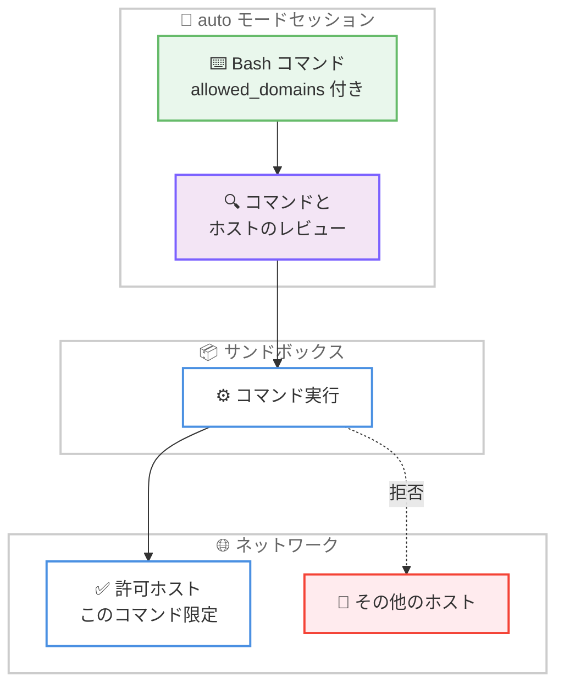

# Claude Code v2.1.271 / v2.1.272 リリース — Remote セッションの fast mode 対応と auto モードのドメイン単位ネットワーク制御

## メタデータ

| 項目 | 内容 |
|------|------|
| 発表日 | 2026-09-14 |
| ソース | Claude Code Changelog |
| カテゴリ | Claude Code アップデート |
| 公式リンク | https://github.com/anthropics/claude-code/blob/main/CHANGELOG.md |

## 概要

Claude Code v2.1.271 と v2.1.272 が 2026 年 9 月 14 日に相次いでリリースされた。主要リリースは v2.1.271 で、96 件の変更を含む大型アップデートとなっている。新機能では、**Claude Code Remote セッション (クラウドおよびセルフホストランナー) での fast mode 対応**が目玉である。ホスト側の fast mode 設定、またはセッション内で入力した `/fast` が、組織が許可する範囲で適用されるようになった。また、**サンドボックス有効の auto モードにおけるコマンド単位の `allowed_domains`** が追加され、コマンドが必要とするホストをそのコマンドと一緒にレビューし、そのコマンドに限定して開放できるようになった。このほか、CLAUDE.md を読み込まずにサブエージェントを実行する `omitClaudeMd`、プラグインインストール時にコマンドの SHA-256 を検証する `--accept-command`、内部チャージバック向けの `modelPricing` の `multiplier` (最大 10 倍) などが追加された。

修正面では、アカウントや組織の切り替え後に古い組織ポリシーが再利用される問題、Bash 権限チェックの複数の抜け穴 (ワイルドカード展開、シェル変数宣言フラグによる偽装など)、MCP OAuth のクライアント登録の誤処理などが解消された。auto モードでは、スキルやスラッシュコマンドのインライン `!` シェルコマンドがデフォルトモードの権限ルールに従うようになり、サブエージェントの報告が専用のハンドバック呼び出しとして安全性クラシファイアのレビューを受けるようになるなど、権限まわりの挙動変更も含まれる。同日リリースの v2.1.272 は「Bug fixes and reliability improvements」のみの小規模なフォローアップである。

## 詳細

### 背景

前バージョンの v2.1.270 (2026 年 9 月 13 日) に続くリリースであり、v2.1.271 は新機能 8 件、修正約 40 件、改善約 15 件、動作変更 7 件に加え、VSCode 拡張 11 件、Claude Code on the web 4 件、Claude Tag 6 件、Code Review 4 件のプラットフォーム別変更を含む、合計 96 件の大型リリースである。エンタープライズ環境で問題となりやすい組織ポリシーの反映、Bash 権限チェックの厳密化、auto モードの権限モデルの一貫性向上に重点が置かれている。v2.1.272 は同日に公開された小規模な安定性向上リリースである。

### 主な変更点

#### 新機能 (Added)

- **Remote セッションの fast mode**: クラウドおよびセルフホストランナーの Claude Code Remote セッションで fast mode が利用可能になった。ホストの fast mode 設定、またはセッション内で入力した `/fast` が、組織が許可する範囲で適用される
- **コマンド単位の `allowed_domains`**: サンドボックス有効の auto モードで、Bash・PowerShell・Monitor の各コマンドにコマンド単位の `allowed_domains` が追加された。コマンドが必要とするホストはコマンドと一緒にレビューされ、そのコマンドに限定して開放される。他のホストへのアクセスは拒否される
- **`omitClaudeMd`**: エージェントのフロントマターと `--agents` JSON に追加され、カスタムサブエージェントとプラグインサブエージェントを user / project / local の CLAUDE.md なしで実行できる。管理対象ポリシーファイルは引き続き読み込まれる
- **`--accept-command <sha256>`**: `claude plugin install` と `claude plugin update` に追加。`-y` の代わりに、以前の `--json` 実行が表示したコマンドと正確に一致する場合のみ受け入れる
- **`modelPricing` の `multiplier`**: 管理対象設定の `modelPricing` と Claude apps gateway の `pricing` ブロックで、1 を超える最大 10 までの `multiplier` がサポートされた。マークアップした内部チャージバックレートに利用できる
- **`/config` パネルのマウス対応**: フルスクリーンモードで、ホイールによる設定リストのスクロール、クリックによる設定値の変更、ポインタ下の行のハイライトが可能になった
- **`--drain-marker-file <path>`**: `claude self-hosted-runner` に追加。SIGTERM によるドレイン時にこのファイルが存在すると、ランナーは終了をホストドレインとしてサーバーに報告する (テレメトリのみ)
- **デスクトップアプリへの誘導**: Bedrock・Vertex AI・Foundry・LLM ゲートウェイの利用者に Claude デスクトップアプリを案内するスピナーチップが追加された。claude.ai 向けのチップはアプリのダウンロードを提案する `/desktop` を案内する

#### 修正 (Fixed) — 組織ポリシーと認証

- **ポリシーキャッシュの再利用**: アカウント・組織・API キーの切り替え後にキャッシュされた組織ポリシーが再利用され、セッション途中で資格情報が変わっても毎時チェックまでポリシーが更新されない問題を修正
- **ポリシー読み込み後のツールリスト**: 起動後に組織ポリシーの読み込みが完了した場合や、セッション途中でポリシーが変わった場合に、ツールとコマンドのリストが更新されない問題を修正
- **`managed-mcp.json` の読み取り失敗**: 読み取りや解析ができないエンタープライズの `managed-mcp.json` が無視されていた問題を修正。MCP の排他制御を維持し (user / project / plugin のサーバーは読み込まれない)、起動時に警告する
- **ローカルプロキシ経由のポリシー取得**: `ANTHROPIC_UNIX_SOCKET` で設定されたサードパーティのローカルプロキシを経由して組織ポリシーが取得され拒否される問題を修正。Remote Control を含め、他のカスタムゲートウェイと同様に扱われる

#### 修正 (Fixed) — Bash 権限チェック

- **オプション後のファイル引数**: `fmt` や `column` のようなコマンドが読み取るファイルが、チェッカーの認識しないオプションの後に続くと権限チェックから漏れる問題を修正
- **ワイルドカード展開の漏れ**: コマンドのパターンやオプション値の中にあるワイルドカード (例: `grep -v dir/* file`) が展開するファイルを権限チェックがスキップする問題を修正
- **シェル変数宣言フラグによる偽装**: シェル変数宣言のフラグによって実行されるコマンドが偽装され得る問題を修正
- **`blockReadsOutsideWorkingDirectories` の回避**: 2 回のディレクトリ変更、サブシェル、`cd` + `git` のチェーンを含む Bash コマンドが、bypass および auto モードで `permissions.blockReadsOutsideWorkingDirectories` のプロンプトをスキップする問題を修正

#### 修正 (Fixed) — fast mode

- **`/fast off` の誤応答**: 組織が fast mode を無効化している場合に、`/fast off` が fast mode をオフにする代わりに「Fast mode unavailable」と答える問題を修正
- **API 拒否後の再送**: `CLAUDE_CODE_SKIP_FAST_MODE_ORG_CHECK` で開始したセッションが、API に fast mode を拒否された後も毎ターン fast リクエストを再送する問題を修正。拒否が維持され、理由が表示される
- **リトライ時のフォールバック**: `CLAUDE_CODE_RETRY_WATCHDOG` 下の fast mode が、使用量クレジット上限でターンを失敗させたり、オーバーロードを fast 速度でリトライしたりする問題を修正。標準速度へフォールバックするようになった

#### 修正 (Fixed) — MCP

- **OAuth クライアント登録**: 同意の拒否が新しい登録を強制する、別のリダイレクト URI 用の登録が再利用される、並行書き込みが有効な登録を削除したり不一致の登録を残したりする、といった MCP OAuth の誤処理を修正
- **`list_changed` の暴走**: MCP サーバーが `list_changed` 通知を高頻度で送信した際の、持続的な高 CPU 使用率とツールリストリクエストの繰り返しを修正
- **ツール検索の名前解決**: Claude が MCP ツールを完全な `mcp__server__tool` 名ではなく素の名前で選択した場合に、ツール検索が一致なしを返す問題を修正
- **再開セッションの `defer_loading`**: ツールがすべて MCP サーバー由来の `claude -p` セッションを再開すると「At least one tool must have defer_loading=false」で失敗する問題を修正
- **Ctrl+O と `/mcp`**: Ctrl+O が保留中の MCP サーバー再接続をキャンセルする問題と、トランスクリプトビューを開いている間に Remote Control から送信した `/mcp` が失敗する問題を修正

#### 修正 (Fixed) — セッションと再開

- **クラウドセッションのスキーマ検証エラー**: セッションのワーカー再起動後にワークフローやエージェントの承認が適用されると、すべてのサブエージェントツール呼び出しが「updatedInput … failed schema validation」で拒否される問題を修正
- **ファイル読み取り追跡の持ち越し**: `/resume` と `/teleport` が前の会話のファイル読み取り追跡を保持し、再開した会話が読んでいないファイルを Claude が編集できてしまう問題を修正
- **1M コンテキストの喪失**: 再開するセッションのモデルファミリーが設定済みのデフォルトモデルと異なる場合に、`--resume` が 1M コンテキストウィンドウ (`[1m]`) を落とす問題を修正
- **アーティファクトの消失**: `/artifacts` で添付したアーティファクトが `--resume` 後にセッションから消える問題を修正
- **バックグラウンドコマンドの二重起動**: コンパクション後も実行中だったバックグラウンドコマンド (watch タスクや開発サーバーなど) の 2 つ目のコピーを Claude が起動する問題を修正
- **クロスセッションメッセージの追跡**: 受信側セッションの権限モードポリシーに保留されたクロスセッションメッセージが痕跡を残さない問題を修正。ヘッドレスの送信側は配達通知を受け取り、`SendMessage` の結果が既読を示唆しなくなった

このほか、サンドボックスコマンドの起動失敗後に残った `.git/config.lock` が git 操作を妨げる問題 (Linux)、macOS でファイルイベントサービスが飽和した際に設定ファイルの変更が検知されない問題 (ポーリングにフォールバック)、LLM ゲートウェイが `text/plain` で応答を返した際のターン失敗、`/resume` / `/continue` が短い端末で 1-2 件しかセッションを表示しない問題、inode 0 を報告する仮想ドライブからのカスタムエージェント読み込み、セルフホストランナーでホスト設定ディレクトリが 64 MiB を超えると設定が失われる問題 (`--host-config-snapshot disk|memory` を追加)、各種テキストフィールドや端末互換性の修正など、多数の修正が含まれる。Windows では、一時出力パスが 260 文字に達すると PowerShell コマンドが出力なしの「Exit code 1」で失敗する問題が修正された。

#### 改善 (Improved)

- **端末レンダリング性能**: 大きな diff や長いトランスクリプトの描画が高速化され、遅いフレームが減少した。起動時間も、組み込みモデルデータの冗長な検証をスキップすることでわずかに短縮された
- **フックのフィードバック**: SessionStart・UserPromptSubmit・PreToolUse・SessionEnd フックの実行中に、スピナーが経過時間つきでその旨を表示する。SessionStart フックを待つプロンプトは Esc でキャンセルできる
- **思考中のスピナー表示**: 長い思考の間、45 秒経過後に「deep in thought」と表示され、出力トークン上限からの回復中は「picking the thought back up」と表示される
- **動的ワークフローの使用量上限対応**: 使用量上限に達すると一時停止し、リセット時に自動で再開するようになった。影響を受けるエージェントを落とさなくなった
- **`claude mcp serve` の進捗通知**: 実行中のツール呼び出しが 30 秒ごとに進捗更新を送信し、何も出力しない長時間コマンドがアイドルタイムアウトで中断されなくなった
- **Markdown アーティファクトの表示**: アーティファクトとして公開された Markdown ファイルが、タイトルヘッダー・ドキュメントタイポグラフィ・シンタックスハイライトつきのスタイル済みドキュメントページとして表示される
- **アーティファクト監視数の拡大**: 1 セッションが他所での再公開を監視できる公開済みアーティファクトが 5 件から 10 件に増加した

このほか、Remote Control のセットアップ失敗時に claude.ai に残る空セッションの削減、Foundry / Claude Platform on AWS セッションでの `alwaysLoad` MCP サーバーの接続完了後の即時利用、Artifact ツールのエラーメッセージ改善、PDF @-メンションのページ数不明時の表示、`/mobile` の単一 QR コード化などの改善が含まれる。

#### 変更 (Changed)

- **auto モードのインライン `!` シェルコマンド**: スキルやスラッシュコマンドのインライン `!` シェルコマンドが、クラシファイアではなくデフォルトモードの権限ルールに従うようになった。どのルールも判定しないコマンドは、レビュー対象のツール呼び出しとして実行される
- **auto モードのサブエージェント報告**: サブエージェントが呼び出し元へ報告する際、最後のメッセージが事後にレビューされるのではなく、安全性クラシファイアがレビューする専用のハンドバック呼び出しを経由するようになった
- **Monitor の deadline 必須化**: Monitor の watch は常に deadline を持つようになった (最大 30 分、シングルプロンプトの `-p` 実行では 10 分)。期限が来ると Claude に再アームを通知する。タイムアウトなしの `persistent` オプションは廃止された
- **IDE 選択インジケータ**: プロンプト内の IDE 選択インジケータが、複数行のプロンプトを圧迫しない、テキストと一緒に折り返す `[⧉ …]` ピルに変更された。Backspace で削除すると選択を含めずに送信できる
- **動的ワークフローのサイズ**: Pro プランのデフォルトの動的ワークフローサイズが small になり、medium サイズのガイドラインが 15 エージェントから 10 エージェントに引き下げられた
- **leftover ログインの扱い**: Claude apps gateway・Bedrock・Vertex AI・Foundry のセッションが、セッションで使用しない残存 claude.ai ログインをリフレッシュしなくなった
- **バンドルされた `claude-api` スキルの更新**: ストリーミングカスタムツールでの `eager_input_streaming` の有効化と、成果物型の Managed Agents 作業を `user.define_outcome` で開始するよう更新された

#### プラットフォーム別の変更

- **[VSCode]**: **Attach Open File 設定**が追加され、オフにすると開いているファイルがメッセージに追加されなくなる (選択テキストは引き続き添付される)。修正としては、Hooks / Permission rules ダイアログの保存の信頼性向上 (成功した保存の失敗報告、置換時の重複フック、settings.local.json の gitignore タイミングなど)、Windows のマップされたネットワークドライブや SUBST ドライブでセッション履歴が現在のセッションしか表示されない問題、セッションリストの Active フィルタの挙動、`CLAUDE_CONFIG_DIR` 変更後の古い設定フォルダの残留、Windows でのコンソールウィンドウのちらつきなどが解消された。Hooks ダイアログには設定ファイル自体が原因の保存拒否時に「Open settings file」ボタンつきのポップアップが追加され、トグルスイッチのオン状態はエディタテーマのボタン色に変更された
- **[Claude Code on the web]**: プロセス終了後もセッションがライブに見え、応答まで約 10 分かかることがある問題が修正され、メッセージ送信で即座に再起動するようになった。claude.ai/code の Routines ページは Yours / Templates タブと実行状態を表示する 2 カラムのルーチンカードを持つ新レイアウトに変更され、カレンダービューは削除された。admin 設定の Cloud environments エディタには Custom network access オプションが追加され、admin ページには Claude Tag と Claude Code のデフォルト環境の表示と変更リンク、作成推奨の環境種別のマークが追加された
- **[Claude Tag]**: 会話の大半がスレッドで行われるチャンネルで、Claude が約 1 時間ごとに作業コンテキストを失う問題を修正 (スレッドの活動がリセットを防ぐ)。プルリクエストの監視を依頼されたスレッドが Claude の再起動後に CI 失敗・コメント・レビューを検知しなくなる問題、Claude が返信済みのスレッドの最初のメッセージを削除しても作業が止まらない問題、別のボット宛ての指示によって Claude が投稿を控えてしまう問題などが修正された。admin 設定の Environment ピッカーは Anthropic ホストとセルフホストのラベルつきになった
- **[Code Review]**: PR ごとに 1 回レビューするリポジトリで、レビュー開始待ちの間にコミットが到着すると PR がレビューされないことがある問題、GitHub が作成済みレビューにエラーを報告した際に同じ指摘が 2-3 回投稿される問題、後続のプッシュで行が移動した際に解決済みのセキュリティ指摘が再投稿される問題、完了した /ultrareview クラウドセッションを Claude アプリで開き直すとレビュー全体が勝手にやり直される問題が修正された

#### v2.1.272

- バグ修正と信頼性の向上

### 技術的な詳細

**コマンド単位の `allowed_domains` によるネットワーク制御**: サンドボックス有効の auto モードでは、これまでネットワークアクセスの許可がコマンドの実行内容と切り離されて判断されがちだった。v2.1.271 では、Bash・PowerShell・Monitor の各コマンドが必要とするホストがコマンドと一緒にレビューされ、承認されたホストはそのコマンドに限定して開放される。他のホストへの接続は拒否されるため、コマンドごとに最小権限のネットワークアクセスを実現できる。



**auto モードの権限モデルの一貫性向上**: 今回のリリースには auto モードの権限判定を一貫させる 2 つの動作変更が含まれる。1 つ目は、スキルやスラッシュコマンドのインライン `!` シェルコマンドがクラシファイアではなくデフォルトモードの権限ルールに従うようになったことである。ルールが判定しないコマンドはレビュー対象のツール呼び出しとして実行されるため、ユーザーが定義した allow / deny ルールがインラインコマンドにも一貫して効くようになる。2 つ目は、サブエージェントから呼び出し元への報告が、事後レビューではなく安全性クラシファイアのレビューを受ける専用のハンドバック呼び出しになったことで、報告内容の検査タイミングが前倒しされた。

**Bash 権限チェックの抜け穴の修正**: 権限チェッカーがコマンドの実際の挙動を見誤る 4 つのパターンが修正された。(1) 認識しないオプションの後に続くファイル引数の見落とし、(2) パターンやオプション値の中のワイルドカードが展開するファイルのスキップ、(3) シェル変数宣言フラグによる実行コマンドの偽装、(4) 複数回のディレクトリ変更やサブシェルを使った `blockReadsOutsideWorkingDirectories` の回避である。deny ルールやディレクトリ制限で防御している環境では、防御の実効性が向上する。

**`--accept-command` によるプラグインインストールの検証**: `claude plugin install -y` はプロンプトなしでインストールを受け入れるが、表示内容と実際に実行されるコマンドの一致は保証しない。新しい `--accept-command <sha256>` は、以前の `--json` 実行が表示したコマンドの SHA-256 と正確に一致する場合のみ受け入れるため、CI や自動化スクリプトでレビュー済みのコマンドだけを実行できる。

## 開発者への影響

### 対象

- **Claude Code Remote (クラウド / セルフホストランナー) の利用者**: fast mode が Remote セッションでも利用可能になり、ホスト設定または `/fast` で組織の許可範囲内で有効化できる
- **サンドボックス有効の auto モード利用者**: コマンド単位の `allowed_domains` により、ネットワークアクセスをコマンドごとに最小権限で許可できる
- **サブエージェントを定義する開発者**: `omitClaudeMd` により、CLAUDE.md の指示に影響されないクリーンなコンテキストでサブエージェントを実行できる
- **プラグインを自動化パイプラインで管理する組織**: `--accept-command <sha256>` により、レビュー済みのインストールコマンドのみを受け入れる安全な自動化が可能になる
- **エンタープライズ管理者**: 組織ポリシーの資格情報切り替え時の即時反映、`managed-mcp.json` の読み取り失敗時の排他制御維持、`modelPricing` の `multiplier` による内部チャージバック対応が含まれる
- **Monitor ツールの `persistent` オプション利用者**: タイムアウトなしの watch は廃止され、常に deadline (最大 30 分) を持つようになった。長期監視は再アーム通知への応答で継続する
- **Pro プランで動的ワークフローを使う利用者**: デフォルトサイズが small になり、medium のガイドラインが 10 エージェントに引き下げられた
- **VSCode 拡張・Claude Tag・Code Review の利用者**: それぞれ設定追加やダイアログの信頼性向上、スレッド中心チャンネルでのコンテキスト維持、レビューの取りこぼしや重複投稿の解消といった改善を受けられる

### 必要なアクション

以下のいずれかの方法で最新バージョンに更新できる。

```bash
# Claude Code 組み込みコマンド
claude update

# npm でのアップデート
npm update -g @anthropic-ai/claude-code

# バージョンを指定してインストールする場合
npm install -g @anthropic-ai/claude-code@2.1.272

# 現在のバージョン確認
claude --version
```

### 移行ガイド (該当する場合)

破壊的変更はアナウンスされていないが、以下の動作変更に注意が必要である。

- **Monitor の `persistent` オプションを使用している場合**: タイムアウトなしの watch は廃止された。watch は最大 30 分 (シングルプロンプトの `-p` 実行では 10 分) の deadline を持ち、期限到達時に Claude へ再アームが通知される。長期監視のワークフローは再アーム前提の設計に見直す
- **スキルやスラッシュコマンドのインライン `!` コマンドを auto モードで使用している場合**: クラシファイアではなくデフォルトモードの権限ルールで判定されるようになった。どのルールも判定しないコマンドはレビュー対象になるため、頻用するコマンドは allow ルールの整備を検討する
- **`CLAUDE_CODE_SKIP_FAST_MODE_ORG_CHECK` を使用している場合**: API が fast mode を拒否した後の再送は行われなくなり、拒否が維持される
- **Pro プランで動的ワークフローを使用している場合**: デフォルトサイズが small に変更された。従来の規模が必要な場合はサイズを明示的に指定する

## コード例

プラグインインストールをレビュー済みコマンドの SHA-256 で検証する例。

```bash
# 1. JSON 出力でインストール内容とコマンドの SHA-256 を確認
claude plugin install my-plugin --json

# 2. 表示されたコマンドと正確に一致する場合のみ受け入れてインストール
claude plugin install my-plugin --accept-command <sha256>
```

CLAUDE.md を読み込まないサブエージェントを定義する例。

```markdown
---
name: clean-context-agent
description: CLAUDE.md の影響を受けないサブエージェント
omitClaudeMd: true
---

このエージェントは user / project / local の CLAUDE.md なしで実行される。
管理対象ポリシーファイルは引き続き読み込まれる。
```

セルフホストランナーのドレイン報告を設定する例。

```bash
# ドレインマーカーファイルを指定してランナーを起動
claude self-hosted-runner --drain-marker-file /var/run/host-draining

# ホスト設定スナップショットの保存先を指定 (64 MiB 超のホスト設定向け)
claude self-hosted-runner --host-config-snapshot disk
```

## 関連リンク

- [Claude Code Changelog](https://github.com/anthropics/claude-code/blob/main/CHANGELOG.md)
- [Claude Code npm パッケージ](https://www.npmjs.com/package/@anthropic-ai/claude-code)
- [Claude Code GitHub リポジトリ](https://github.com/anthropics/claude-code)
- [Claude Code ドキュメント](https://docs.anthropic.com/en/docs/claude-code)
- [Claude Code v2.1.270](./2026-09-13-claude-code-v2-1-270.md)
- [Claude Code v2.1.269](./2026-09-11-claude-code-v2-1-269.md)

## まとめ

Claude Code v2.1.271 は、Remote セッションの fast mode 対応とサンドボックス auto モードのコマンド単位ネットワーク制御を軸に、96 件の変更を含む大型リリースである。`omitClaudeMd` によるサブエージェントのコンテキスト分離、`--accept-command` による安全なプラグイン自動化、`modelPricing` の `multiplier` による内部チャージバック対応など、エンタープライズと自動化の両面で運用性が向上した。

修正面では、組織ポリシーの資格情報切り替え時の即時反映、Bash 権限チェックの 4 つの抜け穴の解消、MCP OAuth のクライアント登録の誤処理修正など、権限と認証の信頼性を高める変更が目立つ。auto モードではインライン `!` コマンドの権限判定とサブエージェント報告のレビュー方式が見直され、権限モデルの一貫性が強化された。同日の v2.1.272 はバグ修正と信頼性向上のみのフォローアップリリースである。
