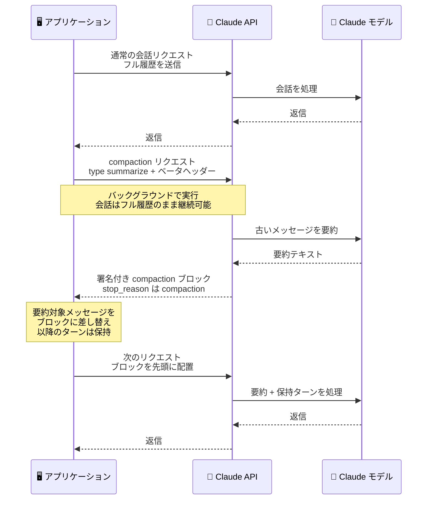

# Messages API 会話コンパクション (ベータ): オンデマンドで会話を要約する `compaction` パラメータ

## メタデータ

| 項目 | 内容 |
|------|------|
| 発表日 | 2026-09-14 |
| ソース | Claude API Release Notes |
| カテゴリ | API |
| 公式リンク | https://platform.claude.com/docs/en/release-notes/overview |

## 概要

Claude API の Messages API で、オンデマンドの会話コンパクション (compaction) がベータ提供開始された。`compact-2026-09-04` ベータヘッダーを付けてトップレベルの `compaction` パラメータを送ると、API は送信したメッセージ群を要約した署名付き `compaction` ブロックを返す。以降のリクエストでは、要約対象だった元のメッセージの代わりにこのブロックを先頭に置いて送信する。

従来のしきい値ベースのコンパクション (`compact-2026-01-12` ベータ、`compact_20260112` 戦略) とは異なり、コンパクションのタイミングをアプリケーション側で自由に決められる。要約リクエストは会話ターンとは独立しているためバックグラウンドで実行でき、直近のターンを一言一句そのまま保持する「keep-tail」パターンにも対応する。preserved thinking を持つモデルでは、保持したターン内の thinking ブロックが要約への差し替え後も有効なまま維持され得る。

## 詳細

### 背景

長時間動作するエージェントや長い会話では、履歴がモデルのコンテキストウィンドウを圧迫する。Anthropic は 2026 年 2 月にしきい値ベースのコンパクション (`compact_20260112`) をベータ提供しており、これは指定した入力トークン数に達するとリクエスト処理の途中で自動的に要約を生成する仕組みだった。今回のオンデマンドコンパクションはこれを拡張する 2 つ目の方式で、要約の生成タイミング・範囲をアプリケーション側が制御できる。

公式ドキュメントによると、しきい値コンパクションは「API にコンテキスト管理を任せたい場合」、`compaction` パラメータは「コンパクションのタイミングを制御したい場合、要約生成中に処理を止められない場合、直近ターンとその thinking を要約後も保持したい場合」に使い分けることが推奨されている。

### 主な変更点

- **オンデマンド要約**: 任意のタイミングで `"compaction": {"type": "summarize"}` を送ると、API はリクエスト内の全メッセージを 1 回要約し、返信は生成せず、`stop_reason: "compaction"` とともに署名付き `compaction` ブロックのみを返す
- **署名付きブロックによる置き換え**: 以降のリクエストでは、要約対象だったメッセージを削除し、返却されたブロック (`signature` を含めそのまま) を `messages` の先頭に置く。しきい値コンパクションのブロックが要約対象メッセージの後ろに続くのに対し、署名付きブロックはメッセージを置き換える。要約済みメッセージをブロックの前に残すと 400 エラー (`compaction_block_misplaced`) になる
- **バックグラウンド実行**: 要約リクエストは会話ターンと分離されているため、会話をフル履歴のまま続けながら裏で要約を生成し、ブロック到着後に差し替えられる (async / background compaction)
- **keep-tail 対応**: 直近のターンをコンパクションリクエストに含めないことで、要約後もそれらを一言一句そのまま保持できる
- **preserved thinking との整合**: preserved thinking を持つモデルでは、保持したターンが要約対象メッセージの直後に続き、かつ `system` と `defer_loading: true` でないツール定義がコンパクションリクエストと同じであれば、保持ターン内の thinking ブロックは差し替え後も有効なまま維持される
- **カスタム要約プロンプト**: `instructions` (最大 16,384 文字) でデフォルトの要約プロンプトを完全に置換できる。オンデマンド方式では、`instructions` の有無にかかわらず要約器は過去の thinking を含む会話全体を読む

### 技術的な詳細

**対象と前提**: オンデマンドコンパクションは Claude API のみで利用可能。対応モデルは Claude Fable 5.1、Claude Mythos 5.1、Claude Fable 5、Claude Mythos 5、Claude Mythos Preview、Claude Opus 5、Claude Opus 4.8、Claude Opus 4.7、Claude Opus 4.6、Claude Sonnet 5、Claude Sonnet 4.6。ベータヘッダー付きで Models API を呼び、各モデルの `capabilities.compaction` で確認することもできる。`compaction` と `context_management` を同一リクエストで併用することはできない。

**要約リクエストの挙動**。

- 要約呼び出しはリクエストの `model`、`system`、`tools`、thinking 設定、`max_tokens` を使用する。要約器はツール定義を読むがツールは実行しない
- `max_tokens` は要約前の thinking を含む呼び出し全体の上限となるため、数千トークンの余裕を持たせる
- 通常のリクエストと同様に課金・レート制限の対象で、`usage.iterations` に `compaction` エントリとして記録される。返信を生成しないため、トップレベルの `input_tokens` / `output_tokens` は 0 になる
- 最後の `assistant` ターンが結果未返却のツール呼び出しで終わっている場合、リクエストは拒否される。`stop_sequences`、structured output の `output_config.format`、`any` / `tool` 型の `tool_choice` も併用不可
- ストリーミングでは、ブロックは `content_block_start` で完全な形で一括到着し、`content_block_delta` は発生しない

**要約が返らないケース**: 要約呼び出しが正常にテキストで終了しなかった場合も 200 が返り、`content` は空になる。`stop_reason` には `"max_tokens"` (要約が途切れた)、`"model_context_window_exceeded"`、`"refusal"`、`"tool_use"`、`"end_turn"` などが入り、それぞれ `max_tokens` の増加や `instructions` の調整などで再送できる。一時的なサーバー障害時はリトライ可能な 529 `overloaded_error` (`error.details.error_code: compaction_unavailable`) が返る。

**その他の制約**。

- `compaction` ブロックは 1 リクエストにつき 1 つだけ送る。ブロックのないリクエストは要約なしでモデルに届く
- すでにブロックで始まる会話を再度コンパクションすると、新しいブロックが旧要約とそれ以降を要約する。以降は最新のブロックのみを送る
- 要約対象に含まれる画像、ドキュメント、`container_upload` ブロック、取得済み URL は、ブロックへの置き換え後は失われるため、必要なら再送・再アップロードする
- `role: "system"` メッセージも要約対象になり、置き換え後は宣言内容が適用されなくなる。必要な指示は次の新しい `user` ターンの直後に `role: "system"` メッセージとして再宣言する
- token counting エンドポイントは `compaction` パラメータを無視する。task budget の `remaining` 値は `compaction` やブロックを含むリクエストと併用できない (400 エラー)
- `cache_control` をブロックに付けると要約直後にキャッシュブレークポイントが置かれる

## 開発者への影響

### 対象

- 長時間動作するエージェントを構築している開発者
- 長い会話でコンテキストウィンドウの管理が必要なアプリケーションの開発者
- しきい値コンパクション利用中で、要約のタイミングや保持範囲をより細かく制御したい開発者

### 必要なアクション

- 要約を要求するリクエストと、署名付きブロックを送る以降のすべてのリクエストに `anthropic-beta: compact-2026-09-04` ヘッダーを付与する
- 会話の残りで使うものと同じ `system` プロンプトと `tools` を要約リクエストにも送る
- ブロック受領後は、コンパクションリクエストで送ったメッセージを履歴の先頭から取り除き、返却された assistant メッセージに置き換える。バックグラウンド実行中に進んだターンはそのまま後ろに残す
- 要約リクエスト送信から差し替えまでの間は履歴を編集せず、ブロック到着後の最初のリクエストで差し替えを行う (保持ターンの thinking を有効に保つため)
- 会話がコンテキストウィンドウに収まるうちにコンパクションを実行する

### 移行ガイド (該当する場合)

しきい値コンパクション (`compact-2026-01-12` / `compact_20260112`) は引き続き利用可能で、両方式は用途で使い分ける。ただし同一リクエストでの併用はできず、しきい値コンパクションは署名付きブロックを含むリクエストでは動作しない。`system` や `tools` を変更したい場合は、保持ターンなしで会話全体を先にコンパクションしてから次のリクエストで変更すると、thinking の無効化を避けられる。

## コード例

要約のリクエスト。

```bash
curl https://api.anthropic.com/v1/messages \
  -H "x-api-key: $ANTHROPIC_API_KEY" \
  -H "anthropic-version: 2023-06-01" \
  -H "anthropic-beta: compact-2026-09-04" \
  -H "content-type: application/json" \
  -d '{
    "model": "claude-opus-5",
    "max_tokens": 4096,
    "messages": [
      {"role": "user", "content": "I am building a recipe app. Help me name the main entities in the data model."},
      {"role": "assistant", "content": "Start with Recipe, Ingredient, and Step. Add a RecipeIngredient entry that holds the quantity and unit for each ingredient in a recipe."},
      {"role": "user", "content": "Good. Now suggest field names for Recipe."}
    ],
    "compaction": {"type": "summarize"}
  }'
```

レスポンス (署名付き `compaction` ブロックのみが返り、`stop_reason` は `"compaction"`)。

```json
{
  "id": "msg_013Zva2CMHLNnXjNJJKqJ2EF",
  "type": "message",
  "role": "assistant",
  "model": "claude-opus-5",
  "content": [
    {
      "type": "compaction",
      "content": "Summary of the conversation: the user is designing the data model for a recipe app. ...",
      "signature": "EuYBCkQY..."
    }
  ],
  "stop_reason": "compaction",
  "usage": {
    "input_tokens": 0,
    "output_tokens": 0,
    "iterations": [{ "type": "compaction", "input_tokens": 144, "output_tokens": 276 }]
  }
}
```

以降のリクエストでは、要約対象だったメッセージの代わりにブロックを先頭に置く。

```json
{
  "model": "claude-opus-5",
  "max_tokens": 2048,
  "messages": [
    {
      "role": "assistant",
      "content": [
        {
          "type": "compaction",
          "content": "Summary of the conversation: ...",
          "signature": "EuYBCkQY..."
        }
      ]
    },
    {
      "role": "assistant",
      "content": "For Recipe, use title, description, servings, prep_minutes, and cook_minutes. Add created_at and updated_at timestamps."
    },
    { "role": "user", "content": "Now do the same for Ingredient." }
  ]
}
```

バックグラウンド実行時の差し替え (公式ドキュメントのパターン)。

```python
# sent_count = len(messages sent in the compaction request)
# response   = that request's result, arriving while the agent kept working
if response.stop_reason == "compaction":
    compaction_message = {"role": "assistant", "content": response.content}
    history = [compaction_message] + history[sent_count:]
# Otherwise keep the full history and try again later.
```

## アーキテクチャ図

バックグラウンドコンパクションの流れ。



## 関連リンク

- [Claude API Release Notes](https://platform.claude.com/docs/en/release-notes/overview)
- [Compaction ドキュメント](https://platform.claude.com/docs/en/build-with-claude/compaction)
- [Compact on demand with the compaction parameter](https://platform.claude.com/docs/en/build-with-claude/compaction#compact-on-demand-with-the-compaction-parameter)
- [Preserved thinking](https://platform.claude.com/docs/en/build-with-claude/preserved-thinking)
- [Context editing](https://platform.claude.com/docs/en/build-with-claude/context-editing)
- [Session memory compaction cookbook](https://platform.claude.com/cookbook/misc-session-memory-compaction)

## まとめ

オンデマンドコンパクションは、しきい値コンパクションに続く 2 つ目のコンテキスト圧縮方式で、「いつ・どの範囲を」要約するかをアプリケーション側が完全に制御できる。バックグラウンド実行により会話を止めずに要約を生成でき、直近ターンとその thinking を保持したまま履歴を圧縮できるため、長時間動作するエージェントが思考の流れを保ちながらコンテキストウィンドウを管理する手段として有力な選択肢となる。ベータ機能のため、`compact-2026-09-04` ヘッダーの付与と、署名付きブロックの取り扱いルール (先頭配置、要約済みメッセージの削除、1 リクエスト 1 ブロック) の遵守が必要となる。
