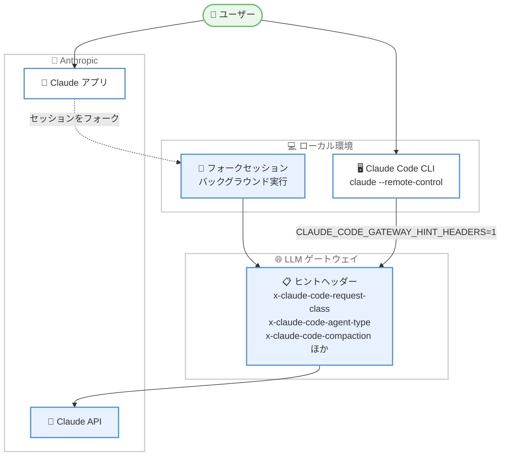

# Claude Code v2.1.273 リリース: LLM ゲートウェイ向けヒントヘッダーと Remote Control セッションのフォークに対応

## メタデータ

| 項目 | 内容 |
|------|------|
| 発表日 | 2026-09-15 (GitHub リリース公開日: 2026-09-15T20:23:03Z) |
| ソース | Claude Code Changelog |
| カテゴリ | Claude Code |
| 公式リンク | https://github.com/anthropics/claude-code/blob/main/CHANGELOG.md |

## 概要

Claude Code v2.1.273 がリリースされた。本バージョンでは、LLM ゲートウェイ向けのリクエストヘッダー追加 (`CLAUDE_CODE_GATEWAY_HINT_HEADERS=1` によるオプトイン)、MCP サーバー切断時の通知、Claude アプリからの `claude --remote-control` セッションのフォークという 3 つの新機能が追加された。

また、権限チェックの抜け漏れ修正 (`permissions.blockReadsOutsideWorkingDirectories` 関連や bypass モードでのサブシェル内 `rm` の検出など)、Bedrock / Vertex / Foundry での認証エラーメッセージの改善、Artifact ツールやエラーメッセージの多数の改善、VSCode / Claude Code on the web / Claude Tag / Code Review 各プラットフォームの修正が含まれる、規模の大きいリリースとなっている。

## 詳細

### 背景

Claude Code は CLI に加えて、VSCode 拡張、Claude Code on the web、Slack 向けの Claude Tag、Code Review など複数のプラットフォームで展開されている。v2.1.273 はこれら全体にわたる新機能追加と修正をまとめたリリースであり、特にエンタープライズ環境 (LLM ゲートウェイ、MDM 管理設定、SAML SSO、企業プロキシ) に関わる改善が多く含まれる。

### 主な変更点

#### Added (新機能)

- **LLM ゲートウェイ向けリクエストヘッダー**: `x-claude-code-request-class`、`x-claude-code-agent-type`、`x-claude-code-prev-tool-durations`、`x-claude-code-compaction`、`x-claude-code-context-compacted` の各ヘッダーを追加。`CLAUDE_CODE_GATEWAY_HINT_HEADERS=1` でオプトインする
- **MCP サーバー切断時の通知**: セッション中に MCP サーバーが切断され、自動再接続が失敗した場合に通知を表示し、`/mcp` コマンドを案内する
- **Remote Control セッションのフォーク**: `claude --remote-control` または `/remote-control` で開始したセッションを Claude アプリからフォークできるようになった。フォークはローカルコンピューター上のバックグラウンドセッションとして実行される
- **[Claude Code on the web] ルーティン編集の破棄確認**: New routine ページや Edit routine ダイアログで、入力したルーティン名・プロンプト・編集内容が破棄される前に「Discard unsaved changes?」の確認を表示する

#### Fixed (修正)

**権限・セキュリティ関連**。

- 権限チェッカーが完全に解析できない Bash コマンドが、`permissions.blockReadsOutsideWorkingDirectories` 設定下でプロンプトをスキップしていた問題と、bypass モードでサブシェルに隠された危険な `rm` を修正
- claude.ai から同期されたスキルが、組織が Skills を無効化した後も利用可能なままだった問題を修正。無効化後は復元可能なゴミ箱に移動される
- MDM や `managed-settings.json` で設定した `allowManagedMcpServersOnly`、`deniedMcpServers`、`disableClaudeAiConnectors` が、サーバー管理設定と併存する場合に無視されていた問題を修正
- `permissions.blockReadsOutsideWorkingDirectories` 設定時、リポジトリの設定で選択されたメモリディレクトリがプロンプトへの読み込み・想起・インデックス・メモリ抽出に使用されないよう修正

**認証・エラーメッセージ関連**。

- Bedrock、Vertex、Foundry での 401 / 403 エラーと Claude アプリゲートウェイの 403 エラーで `/login` の実行を案内していた問題を修正。更新すべき認証情報の名前を示すか、ゲートウェイ管理者への確認を案内するようになった
- `/login`、`/upgrade`、`/extra-usage` が会話の以前の thinking を破棄し、次のリクエストでプロンプトキャッシュの完全な書き直しを強制していた問題を修正
- `/install-github-app` が SAML シングルサインオンのブロックを「admin permissions required」と誤報告していた問題を修正

**セッション・エージェント関連**。

- 最終ストリーミング応答がトークン使用量を省略した場合やモデル ID を持たない場合に、サブエージェントとバックグラウンドエージェントが失敗として報告され、結果が届かなかった問題を修正
- コンテキストメーターと自動コンパクトが advisor ツールのターンを実際の約 2 倍のコンテキストサイズとして計算し、自動コンパクトが実際のウィンドウの約半分で発火していた問題を修正
- サブエージェントが実行中にバックグラウンドへ移動された場合 (例: `CLAUDE_AUTO_BACKGROUND_TASKS`)、SDK と `--output-format stream-json` の出力が残りのメッセージと最終レポートを取りこぼしていた問題を修正
- `.claude/scheduled_tasks.json` を別フォルダー (新しい worktree など) にコピーした後、保存済みのスケジュールタスクが誤ったセッションで実行されていた問題を修正
- 作業を完了してエージェントパネルに表示されなくなったエージェントチームのメンバーが原因で `/tui` が再起動を拒否していた問題を修正

**その他の修正**。

- auto モードで、クラウドまたは Remote Control セッションにおいてチャットに添付したファイルを Artifact ツールがアップロードする際に承認のため停止していた問題を修正
- リポジトリの `.git` ディレクトリが削除または移動された後、長時間実行中のセッションがスタブの `.git/info/exclude` を再作成していた問題を修正
- シェルモード中にメインプロンプトが先頭の `!` を取りこぼし、`! grep …` のような否定コマンドが入力できなかった問題を修正
- macOS でドラッグしたスクリーンショットや、システムが別パスで報告するファイルの Read が「symlink resolution changed after permission was checked」で拒否されていた問題を修正
- Claude Desktop、VS Code、JetBrains セッションに接続した Remote Control クライアントが、セッションのコンテキストウィンドウ使用量を要求すると拒否されていた問題を修正
- コンパクトステータス行でスピナーが二重の省略記号を表示していた問題と、Artifact の読み取り・公開後に frontend-design プラグインを誤って提案するスピナーのヒントを修正

#### Improved (改善)

- **長時間セッションの応答性**: フックの進捗とサブエージェントのアクティビティが、更新のたびに会話全体を再処理しなくなった
- **Artifact ツール**: 提供されないファイル種別を公開しようとした際のエラーで、提供可能な種別と代替手段を提示。ページ読み取り時に、そのページに対して artifact サービスが持つ機能とデータベースルールを表示。データベース書き込みでドキュメント全体を書き直さずに単一フィールドの削除が可能に。claude.ai に到達後に接続が切れた公開を、失敗や重複バージョン作成なしに安全に再送
- **エラーメッセージの具体化**: クラウドセッションの GitHub エラー (IP 許可リスト、停止されたアプリインストール、SAML SSO) で原因を表示。`/autofix-pr` で `gh pr view` 失敗時に gh 自身のエラーを表示し、GitHub Webhook 配信を設定できない理由も表示。`/web-setup` で拒否された GitHub トークンの理由と対処、プロキシや TLS 証明書の問題を提示。セッション内の SSL 証明書・プロキシ接続エラーでエラーコードと対処 (企業 CA には `NODE_EXTRA_CA_CERTS` など) を提示。Claude ログインの期限切れ・失効によるクラウドセッション作成失敗時に `/login` を案内。MCP サーバーのサインイン期限切れ時に再認証方法 (`/mcp`) を案内
- **Windows**: `--add-dir` でマップされたネットワークドライブを追加した場合の UNC パスのネットワークパス権限チェックを改善

#### Changed (変更)

- Bedrock、Vertex、Foundry の auto モードは当面ローカル分類器をデフォルトで使用する。プラットフォームのサーバーサイド分類器を使用するには `CLAUDE_CODE_AUTO_MODE_SERVER=1` を設定する
- `OTEL_LOG_TOOL_DETAILS=1` がコスト・トークンメトリクスに実際のエージェント、スキル、プラグイン、MCP サーバー名を含めるようになった
- Claude アカウントでのサインインが claude.ai プラグインへのアクセスも要求するようになった
- `/bug` と `/feedback` のレポートに、最後の API リクエストからモデル動作パラメーター (モデル、システムプロンプト、ツール) のみを含め、リクエストメタデータと `CLAUDE_CODE_EXTRA_BODY` フィールドを除外するようになった
- 2.1.268 の変更 (権限チェッカーが解析できない Bash 行、`eval` や `env -C` に対する Read / Edit の deny ルールチェック) をリバート。`time -p make build` のようなコマンドは拒否されず、再びプロンプトを表示する

#### プラットフォーム別の変更

**VSCode**。

- 組織がプロダクトフィードバックを無効化していても「Report a problem」が表示され、`/bug` / `/feedback` がレポートフォームを開いていた問題を修正
- Windows でターン完了後に赤い「Claude Code process exited with code 4294967295」バナーが表示される問題を修正

**Claude Code on the web**。

- 管理者がコネクタを削除して再追加した後、ルーティンが組織コネクタへのアクセスを失い古いコネクタを呼び続けていた問題を修正
- 組織設定からのセルフホスト環境の作成が、まれにサーバーエラーで失敗し中途半端な環境を残していた問題を修正
- 管理者向け「Share cloud sessions」設定を Claude Code ページから Data and privacy 配下に移動し、Data and privacy 管理者も管理可能に
- クラウド環境を持たない新規ユーザーが Mac と Windows で見ていた全画面のデスクトップアプリダウンロード画面を削除し、直接セットアップに進むように変更
- ルーティン詳細ページを改善: パンくずリストにメニューと名前変更、上部にオン / オフスイッチと Run now、設定の横に実行履歴を配置

**Claude Tag**。

- Enterprise Grid が切断され一部のワークスペースが接続されたままの状態でアプリを再インストールした数分後に Claude が無反応になる問題を修正
- 組織共有のプライベート Slack チャンネルで設定したスケジュールタスクが投稿されなかった問題を修正。作成されたスレッドで実行を継続する
- Claude がタスク実行中に古い Slack スレッドで返信すると、タスクが最初からやり直しになり未プッシュの作業が失われることがある問題を修正
- アカウントトークンの更新直後に「couldn't find a Claude Code environment」という誤った通知とともにメッセージが失われることがある問題を修正
- AWS 接続がリージョンなしのエンドポイント (Budgets、Savings Plans、WAF Classic、Import/Export) を拒否していた問題を修正。Global Accelerator のリクエストも正しく署名されるようになった
- リクエストに署名できない場合 (リージョンのないホスト名など) の AWS 接続失敗時に、理由と対処方法を Claude に伝えるよう改善
- 小文字のトークンタイプを返すプロバイダーで OAuth client-credentials と JWT-bearer 接続が失敗していた問題を修正。標準の Bearer スキームで送信する
- Enterprise Grid 共有チャンネル、Claude 未使用のチャンネル、レガシープライベートチャンネルでチャンネルマネージャーの追加が拒否されていた問題を修正
- 会話が依存する関連パブリックチャンネル (インシデントチャンネルなど) を、依頼された場合のみでなく Claude が自ら監視するように変更
- 管理者向け Memory ページに、Claude が自ら設定した Slack チャンネルのメモリが表示されなかった問題を修正。管理者がそのメモリを開いて編集・削除できるようになった

**Code Review**。

- 以前のレビューで「Additional findings」が挙がった PR にベースブランチをマージすると完全な再レビューが発生していた問題を修正。軽量なフォローアップレビューになる
- @メンション、行をまたぐコードスパン、バッククォート付き HTML タグが原因で REVIEW.md 全体が無視されていた問題を修正。変更ファイルにリンクする行のみを除外する
- 修正提案で、他のコードが依存する動作を変更する場合に維持すべき挙動を明記するよう改善
- 2 番目の影響箇所を指摘するレビューコメントが、途切れたスタブではなく完全な文でその箇所の問題を述べるよう改善
- `/ultrareview --post` で GitHub エラー後のリトライが所見コメントを正確に 1 回だけ投稿するよう修正。コメントにレビュー対象コミットが記載される
- 所有者名またはリポジトリ名に大文字を含む GitHub リポジトリで、空または内容が同一のプッシュが再レビューされていた問題を修正。これらのプッシュはスキップされる

### 技術的な詳細

新機能である LLM ゲートウェイ向けヒントヘッダーと Remote Control セッションのフォークの流れを以下に示す。



## 開発者への影響

### 対象

- **LLM ゲートウェイ運用者**: ヒントヘッダーのオプトインにより、リクエストの分類・エージェント種別・コンパクション状態をゲートウェイ側で参照できる
- **エンタープライズ管理者**: MDM / `managed-settings.json` の MCP 関連設定が正しく適用されるようになった。組織による Skills 無効化も同期済みスキルに反映される
- **Bedrock / Vertex / Foundry ユーザー**: 認証エラーメッセージの改善と、auto モードのローカル分類器へのデフォルト変更が影響する
- **Remote Control / クラウドセッションのユーザー**: Claude アプリからのセッションフォークが利用可能になった
- **Slack で Claude Tag を使用するチーム**: スケジュールタスクや Enterprise Grid 関連の複数の修正が適用される

### 必要なアクション

- **ゲートウェイヒントヘッダーを使用する場合**: 環境変数 `CLAUDE_CODE_GATEWAY_HINT_HEADERS=1` を設定してオプトインする
- **Bedrock / Vertex / Foundry でサーバーサイド分類器を使用したい場合**: `CLAUDE_CODE_AUTO_MODE_SERVER=1` を設定する
- **通常のユーザー**: Claude Code を最新バージョンに更新するのみで、その他の修正・改善は自動的に適用される

### 移行ガイド (該当する場合)

- **2.1.268 の権限チェック変更のリバート**: `eval` や `env -C` を含み権限チェッカーが解析できない Bash 行に対する Read / Edit の deny ルールチェックが取り消された。`time -p make build` のようなコマンドは拒否ではなく再び承認プロンプトが表示される。この動作に依存した運用をしている場合は注意が必要
- **`/bug` / `/feedback` の送信内容変更**: レポートにはモデル動作パラメーターのみが含まれ、リクエストメタデータと `CLAUDE_CODE_EXTRA_BODY` フィールドは送信されなくなった

## コード例

```bash
# LLM ゲートウェイ向けヒントヘッダーを有効化
export CLAUDE_CODE_GATEWAY_HINT_HEADERS=1
claude

# Bedrock / Vertex / Foundry でサーバーサイド分類器を使用
export CLAUDE_CODE_AUTO_MODE_SERVER=1
claude

# Remote Control セッションを開始 (Claude アプリからフォーク可能)
claude --remote-control

# OpenTelemetry メトリクスに実際のエージェント・スキル・プラグイン名を含める
export OTEL_LOG_TOOL_DETAILS=1
claude
```

## 関連リンク

- [Claude Code Changelog](https://github.com/anthropics/claude-code/blob/main/CHANGELOG.md)
- [Claude Code リポジトリ](https://github.com/anthropics/claude-code)
- [Claude Code ドキュメント](https://code.claude.com/docs)

## まとめ

Claude Code v2.1.273 は、LLM ゲートウェイ向けヒントヘッダー、MCP サーバー切断通知、Remote Control セッションのフォークという 3 つの新機能に加え、権限チェックの抜け漏れやコンテキストメーターの計算誤りなど多数の修正を含む大規模なリリースである。特にエンタープライズ環境 (MDM 管理設定、SAML SSO、企業プロキシ、LLM ゲートウェイ) での動作とエラーメッセージの具体性が広範に改善されており、組織で Claude Code を運用する管理者と開発者の双方にとって価値のあるアップデートとなっている。
