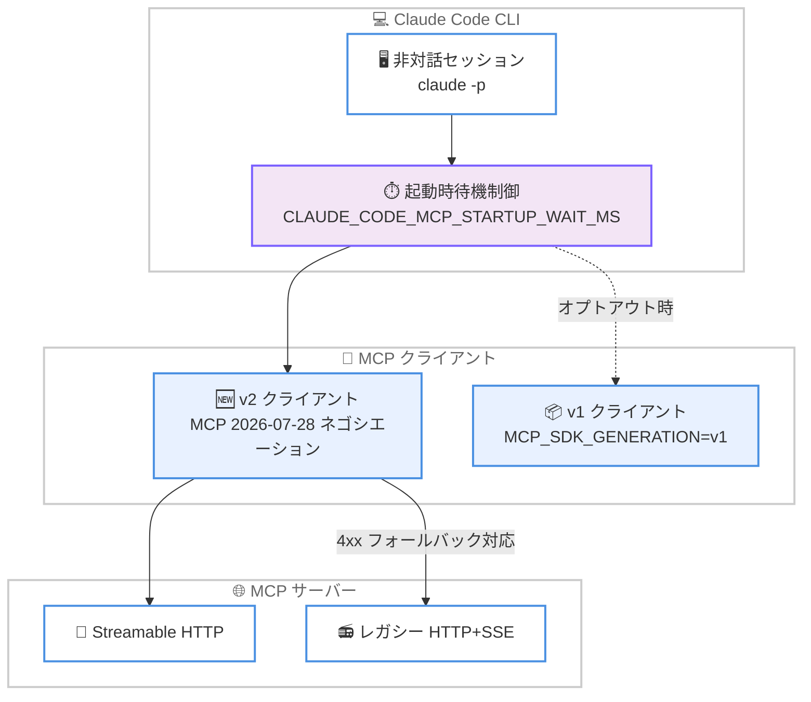

# Claude Code v2.1.274 リリース: メモリ使用量の警告表示と MCP 接続の安定性向上、v2 MCP クライアントの全面展開

## メタデータ

| 項目 | 内容 |
|------|------|
| 発表日 | 2026-09-17 |
| ソース | Claude Code Changelog |
| カテゴリ | Claude Code |
| 公式リンク | https://github.com/anthropics/claude-code/blob/main/CHANGELOG.md |

## 概要

Claude Code v2.1.274 がリリースされた。本バージョンでは、メモリ使用量が危険水準に達した際の警告表示、非対話セッションでの MCP サーバー接続待機時間を制御する `CLAUDE_CODE_MCP_STARTUP_WAIT_MS`、OpenTelemetry の `effort` 属性と管理設定の解決状況を記録する `claude_code.managed_settings_resolved` イベントなどの新機能が追加された。

修正面では MCP 関連の安定性向上が目立つ。レガシー HTTP+SSE のみ対応のサーバーへの接続失敗、Streamable HTTP ツール呼び出しの約 5 分でのタイムアウト、`list-changed` 通知の取りこぼし、403 エラーの誤報告などが解消された。また、Bedrock / Vertex / Foundry およびテレメトリ無効化環境でも v2 MCP クライアントと MCP 2026-07-28 ネゴシエーションがデフォルトになるなど、エンタープライズ環境に関わる変更も多い。VSCode 拡張、Claude Code on the web、Claude Tag、Code Review の各プラットフォームにも多数の修正が含まれる大規模なリリースである。

## 詳細

### 背景

Claude Code は CLI、VSCode 拡張、Claude Code on the web (クラウドセッション)、Slack 向けの Claude Tag、Code Review など複数のプラットフォームで展開されている。v2.1.274 は前バージョン v2.1.273 に続き、MCP エコシステムの安定化、OpenTelemetry による可観測性の強化、Claude アプリゲートウェイ (Claude apps gateway) の堅牢化といったエンタープライズ運用に直結する改善を中心に、全プラットフォームにわたる修正をまとめたリリースである。

### 主な変更点

#### Added (新機能)

- **メモリ使用量の警告表示**: メモリ使用量が危険水準に達した際に警告を表示し、メモリの解放または安全な再起動の手順を案内する
- **`CLAUDE_CODE_MCP_STARTUP_WAIT_MS`**: 非対話セッションの最初のターンが、接続中の MCP サーバーを待機する時間の上限を設定できる (`0` で待機しない)
- **OpenTelemetry の拡充**: `claude_code.llm_request` トレーススパンに `effort` 属性を追加 (`api_request` イベントと同等)。また `claude_code.managed_settings_resolved` イベントで管理設定のソースとポリシーヘルパーの状態を記録できる (`OTEL_LOG_MANAGED_SETTINGS=1` で設定内容とダイジェストを出力)
- **Claude アプリゲートウェイの設定追加**: `store.connect_timeout_seconds` で Postgres 接続タイムアウトを延長可能に (デフォルト 5 秒)。テレメトリに IdP サブジェクトの `enduser.sub` を追加。レプリカの同時リクエスト上限 (256) を超えた際の警告と起動時ログも追加
- **UI 改善**: フルスクリーンモードで、折りたたまれたチームメイトおよびエージェントのメッセージをクリックで展開できるようになった

#### Fixed (修正)

**MCP 関連**。

- レガシー HTTP+SSE のみ対応の MCP サーバーが最初のリクエストに 422 などの 4xx エラーで応答すると接続に失敗していた問題を修正
- Streamable HTTP の MCP ツール呼び出しが、サーバーごとの `timeout` をより長く設定していても約 5 分でタイムアウトしていた問題を修正
- サーバーが `listChanged` を宣言せずに list-changed 通知を送信した場合に、MCP のプロンプトとリソースが更新されなかった問題を修正
- 403 insufficient_scope で拒否された MCP ツール呼び出しがサインイン期限切れとして報告されていた問題を修正。不足している権限を明示し、`/mcp` での再認証を案内する
- `--strict-mcp-config` と空の `--mcp-config` の組み合わせで、最初の非対話ターンが不要な MCP サーバーを最大 `MCP_TIMEOUT` まで待機していた問題を修正

**セッション・エージェント関連**。

- 「unexpected tool_use_id」の 400 エラーを際限なくリトライしてセッションがスタックする問題を修正。破損したトランスクリプトは可能な限り自己修復され、修復できない場合は `/rewind` を案内する明確なエラーでループを終了する
- コンテキストオーバーフロー時に、アクティブな `/goal` などのフック駆動セッションが「Prompt is too long」で終了していた問題と、コンパクト済みセッションの再開 (`--continue` / `--resume`) で `/goal` が失われる問題を修正
- 自動更新の再起動後に `claude agents` が `--model`、`--effort`、`--permission-mode` などのフラグを失っていた問題を修正
- Bedrock / Vertex / Foundry で `model: "opus"` を指定したサブエージェントが、モデル ID からモデルファミリーを認識できない場合にセッションのモデルのまま実行されていた問題を修正
- セルフホストランナーがトークン更新に数回失敗した後、次の定期更新まで毎ターン 401 で失敗していた問題を修正。リトライを継続し、401 後は新しいトークンを取得する

**権限・セキュリティ関連**。

- 特定の特殊シェル変数をループまたは代入する Bash コマンドの権限チェックを修正。これらのコマンドは権限を求めるようになった
- worktree 分離セッションが、特定のネストされたシェル展開を含む Bash コマンドを受け入れていた問題を修正。これらは拒否されるようになった
- マルチバイト文字を含むファイルで、Edit の権限プロンプトのプレビューが承認された編集と異なる位置を表示することがある問題を修正
- `${VAR}` プレースホルダーから解決されたシークレットが、MCP 接続エラーとログインツールの説明に表示されていた問題を修正

**その他の修正**。

- 言語サーバーが数千ファイルのプロジェクト全体の診断を発行した際の、ターンごとの速度低下を修正
- VS Code などの `file://` URI を必要とするターミナルで、ローカルファイルパスへのクリック可能リンクが機能しなかった問題を修正
- 軽度のメモリ圧迫下でバックグラウンドコマンドが 30 分のアイドル後に停止されていた問題を修正。メモリが危険水準の場合のみ停止し、理由をデバッグログに記録する
- リモート管理設定使用時に `installed_plugins.json` がほぼ毎回の起動で書き換えられ、Claude Desktop が全セッションのプラグインをリロードしていた問題を修正
- ヘッドレス / SDK セッションが完了したバックグラウンドタスクごとに個別のモデル呼び出しを行っていた問題を修正。キュー済みの完了は 1 回の呼び出しでまとめて処理される
- プラグインリロード後の Bash ツールによるシェルプロファイルの再読み込み (数秒の停止) を、プラグインの `bin/` ディレクトリが変更された場合のみに限定

このほか、AskUserQuestion のプレビュー動作、トランスクリプトの番号付きリスト表示、Wayland 環境での空エディターウィンドウ、Claude アプリゲートウェイの SIGTERM 時のストリーム切断 (`CLAUDE_GATEWAY_DRAIN_TIMEOUT_MS` で最大 25 秒の猶予) など、多数の修正が含まれる。

#### Improved (改善)

- **起動と通知の効率化**: `--input-format stream-json` セッションの最初のターンが、接続中の MCP サーバーを最大 2 秒待機しなくなった。Monitor ツールはスクリプトの最終出力と終了を 1 つの通知にまとめ、モデルターンを節約する
- **Artifact ツール**: claude.ai に未サインインの場合は初回試行時にその旨を表示し、拒否された呼び出しのリトライを早期に停止。古いバージョンに基づく公開は送信前に停止し、マージすべき新しいページを提示する
- **可観測性**: `OTEL_LOG_RAW_API_BODIES=file:<dir>` の出力に `index.jsonl` と `request_body_id` / `message.id` イベント属性が追加され、各レスポンスをリクエストファイルとトランスクリプトメッセージに紐付けられる
- **Claude アプリゲートウェイ**: 起動時に Postgres への初回接続を最大 3 回試行。支出上限チェックのデータベースラウンドトリップを 4 回から 1 回に削減。サインインのレート制限エラーで、拒否理由と変更すべき設定を明示する
- **worktree の安全性**: サブモジュールのチェックアウトを含むエージェント worktree を削除する前の安全チェックを強化

#### Changed (変更)

- **v2 MCP クライアントの全面展開**: Bedrock、Vertex、Foundry およびテレメトリ無効化環境のインストールでも、直接 HTTP サーバーに対して v2 MCP クライアントと MCP 2026-07-28 ネゴシエーションがデフォルトになった (オプトアウト: `MCP_SDK_GENERATION=v1` または `MCP_PROTOCOL_NEGOTIATION=legacy`)
- **`/code-review` の軽量化**: 専用チューニング設定を持たないモデルでは、多数のレビューサブエージェントを起動する代わりに、軽量なインラインレビュープロンプトを使用する
- **`"type": "sdk"` MCP エントリのスキップ**: `.mcp.json`、設定、プラグイン、エージェントファイル内の SDK タイプのエントリは警告付きでスキップされる。インプロセスサーバーを登録できるのは SDK ホストアプリケーションのみ
- **Git LFS の扱い**: プラグインとマーケットプレイスのクローンは LFS ファイルをポインターのまま残す。必要な場合はチェックアウト内で `git lfs pull` を実行する
- **その他**: ローカルセッションの artifact 監視は、別の場所で公開された新バージョンでターンを開始しなくなった。セルフホストランナーは読み取り専用リポジトリをセッション開始失敗ではなくスキップで処理する。`/status` などの表記が「Claude Code on the web」から「cloud session (クラウドセッション)」に変更された

#### プラットフォーム別の変更

**VSCode**。

- ウィンドウリロードで中断されたステップの継続機能を追加 (チャットにラベル表示、Claude Code: Continue After Reload 設定で無効化可能)
- Customize メニューに Memory と Instructions のエントリを追加。Memory では自動メモリのトグル・保存済みメモリ・メモリフォルダーを表示し、Instructions では CLAUDE.md ファイルを編集できる
- `claudeCode.lockEditorGroups` 設定を追加し、Claude が開くエディターグループのロックを無効化可能に
- 設定の同時書き込みで `~/.claude/settings.json` が破損または設定が失われる問題、チャット内 Edit 差分の途切れ、High Contrast テーマでのコード表示、エディターグループの分割・フォーカスに関する複数の問題を修正
- スクリーンリーダーでの会話ナビゲーションを改善。各メッセージが「You」または「Claude」として読み上げられ、ツールステップにはツール名が付く

**Claude Code on the web**。

- クラウドセッションの差分ビューに「Compare against」ブランチピッカーを追加。ベースブランチ以外の任意のブランチとの差分を表示できる
- GitHub トークン更新の一時的なエラーによる git 操作の失敗、ルーティンの二重実行や一時停止解除、認証情報更新直後のコミット署名エラーなどを修正
- ルーティンは、オーナーの GitHub 接続が失われた場合に最初の失敗で無効化する代わりに、最大 72 時間実行をスキップしてリトライするようになった

**Claude Tag**。

- Claude Tag 管理設定の Add channel / Add workspace フォームに Guests 設定を追加 (Inherit、Allow、Channel only、Restrict から選択)
- 他の Slack アプリやボットが @メンションした際に Claude が応答しない問題、単一チャンネル内の Slack 検索の失敗、`mailto:` プレフィックスの表示など複数の問題を修正
- Slack でのライブ進捗チェックリストを改善。2,000 文字に制限し、混雑したスレッドでは再投稿を最大 15 分に 1 回に抑える

**Code Review**。

- 再レビューで、修正済みの指摘のスレッドが低重要度のメモにより開いたままになることがある問題と、GitHub や内部サービスの一時的な障害によるレビュー失敗 (待機してリトライするように) を修正
- 投稿される各指摘の文面を改善。影響を受ける対象、コードの問題箇所、修正方法を短い平易な文で冒頭に示す
- 組織の上限によりレビューがスキップされた場合のチェック実行カードと PR コメントで、各原因から対処用の管理ページへリンクする

### 技術的な詳細

本バージョンの中心的な変更である v2 MCP クライアントの全面展開と、非対話セッションでの MCP 接続待機制御の関係を以下に示す。



## 開発者への影響

### 対象

- **MCP サーバーの利用者・開発者**: レガシー HTTP+SSE サーバーへの接続、長時間実行ツールのタイムアウト、リソース更新通知など、MCP 接続の信頼性が広範に改善された
- **Bedrock / Vertex / Foundry ユーザー**: v2 MCP クライアントがデフォルトになった。サブエージェントの `model: "opus"` 指定も正しく解決されるようになった
- **エンタープライズ管理者・ゲートウェイ運用者**: OpenTelemetry の `managed_settings_resolved` イベントや `effort` 属性、Claude アプリゲートウェイの接続タイムアウト設定・ドレイン処理・支出チェック最適化が利用できる
- **CI / SDK ユーザー**: `CLAUDE_CODE_MCP_STARTUP_WAIT_MS` による起動待機の制御、バックグラウンドタスク完了のバッチ処理、セルフホストランナーのトークン更新リトライが影響する
- **VSCode 拡張ユーザー**: リロード中断からの継続、Memory / Instructions メニュー、設定ファイル破損の修正が適用される

### 必要なアクション

- **通常のユーザー**: Claude Code を最新バージョンに更新するのみで、修正・改善は自動的に適用される
- **非対話セッションの起動を高速化したい場合**: `CLAUDE_CODE_MCP_STARTUP_WAIT_MS` を設定する (`0` で MCP サーバーを待機しない)
- **管理設定の適用状況を監査したい場合**: OpenTelemetry を有効にし、必要に応じて `OTEL_LOG_MANAGED_SETTINGS=1` を設定する

### 移行ガイド (該当する場合)

- **v2 MCP クライアントへの移行**: Bedrock / Vertex / Foundry またはテレメトリ無効化環境で MCP 接続に問題が発生した場合は、`MCP_SDK_GENERATION=v1` または `MCP_PROTOCOL_NEGOTIATION=legacy` で従来の動作に戻せる
- **`"type": "sdk"` MCP エントリ**: 設定ファイルやプラグインに SDK タイプの MCP エントリがある場合、警告付きでスキップされるようになった。インプロセスサーバーは SDK ホストアプリケーションから登録する必要がある
- **Git LFS を使用するプラグイン**: クローン時に LFS ファイルはポインターのまま残るため、実体が必要な場合はチェックアウト内で `git lfs pull` を実行する

## コード例

```bash
# 非対話セッションで MCP サーバーの接続を待機しない
export CLAUDE_CODE_MCP_STARTUP_WAIT_MS=0
claude -p "テストを実行して結果を報告して"

# 管理設定の解決状況を OpenTelemetry イベントとして記録
export OTEL_LOG_MANAGED_SETTINGS=1
claude

# v2 MCP クライアントからオプトアウト (問題発生時)
export MCP_SDK_GENERATION=v1
claude

# API リクエスト / レスポンスの対応付けが可能な生ボディログ
export OTEL_LOG_RAW_API_BODIES=file:/tmp/claude-api-logs
claude
```

## 関連リンク

- [Claude Code Changelog](https://github.com/anthropics/claude-code/blob/main/CHANGELOG.md)
- [Claude Code リポジトリ](https://github.com/anthropics/claude-code)
- [Claude Code ドキュメント](https://code.claude.com/docs)

## まとめ

Claude Code v2.1.274 は、メモリ使用量の警告表示や `CLAUDE_CODE_MCP_STARTUP_WAIT_MS` などの新機能に加え、MCP 接続の信頼性 (レガシー HTTP+SSE、タイムアウト、通知、権限エラー) を大幅に高めた大規模なリリースである。Bedrock / Vertex / Foundry を含む全環境への v2 MCP クライアント展開、OpenTelemetry による管理設定の可観測性強化、Claude アプリゲートウェイの堅牢化など、エンタープライズ運用に直結する変更が多く、組織で Claude Code を運用する管理者と、MCP サーバーや CI で Claude Code を活用する開発者の双方にとって重要なアップデートとなっている。
