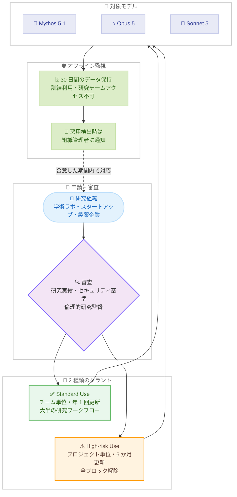

# ライフサイエンス検証プログラム (LSVP) の発表: 検証済み研究者向けにセーフガードを緩和したモデルアクセスを提供

## メタデータ

| 項目 | 内容 |
|------|------|
| 発表日 | 2026-09-17 |
| ソース | Anthropic News |
| カテゴリ | 公式発表 / ライフサイエンス / 安全性 |
| 公式リンク | https://www.anthropic.com/news/life-sciences-verification-program |

## 概要

Anthropic は 2026 年 9 月 17 日、ライフサイエンス分野の専門家を対象とした「Life Sciences Verification Program (LSVP)」を発表した。本プログラムは、審査を通過したチーム・機関に対し、生物学関連タスク向けにセーフガードを緩和した Mythos、Opus、Sonnet の各モデルへのアクセスを提供するものである。一般提供の Fable モデルではデフォルトでブロックされる創薬、研究生物学、臨床開発、製造などのタスクを、検証済みの組織が実行できるようになる。

プログラムはベータ版としてチーム・機関向けに開始され、すでに数十の組織が早期アクセスプログラムに参加している。Anthropic は初週で数百の組織の登録を見込んでおり、数週間以内にライフサイエンスコミュニティの大多数をサポートできるよう拡大する予定である。Xaira Therapeutics、Edison Scientific、Manifold Bio などのパートナーが賛同のコメントを寄せている。

## 詳細

### 背景

最新のフロンティアモデルは生物学研究を支援できる能力が向上した一方で、生物兵器開発などの悪用リスクも増大している。このため Anthropic は、一般提供モデルでは両用性 (デュアルユース) のある生物学クエリへのアクセスを広く制限する強力なセーフガードを導入してきた。しかし、この制限は学術ラボ、スタートアップ、製薬企業などの正当な研究活動も妨げてしまう。LSVP は「検証されたユーザーには広いアクセスを、未検証のユーザーには強い制限を」という形で、安全性と科学の進歩を両立させるための仕組みである。

### 主な内容

#### 2 種類のグラント

LSVP では、利用範囲に応じて 2 種類のグラント (権限付与) が提供される。

| 項目 | Standard Use (標準利用) | High-risk Use (高リスク利用) |
|------|------------------------|------------------------------|
| 対象範囲 | 大半の生物学研究・開発ワークフロー | 標準利用でもブロックされる領域を含むライフサイエンス関連の全ブロック解除 |
| 付与単位 | チーム全体 | 単一の研究プロジェクト単位 |
| 更新頻度 | 年 1 回 | 6 か月ごと |
| 対象モデル | Mythos 5.1、Opus 5、Sonnet 5 (将来のモデルにも適用) | Opus 5 と Sonnet 5 は即日利用可能。Mythos は米国政府と協議中で、当面は追加審査を経た少数の組織に限定 |

- **Standard Use の対象分野**: 基礎科学、R&D、サプライチェーン・製造、臨床開発、品質保証、薬事、投資・デューデリジェンスなど
- **High-risk Use の例**: 特定のウイルスベクターファミリーが人の免疫経路にどのように認識されるかの解析といった研究プロジェクト
- グラントを付与された場合でも、サイバー分類器などライフサイエンス以外のセーフガードは維持される

#### 審査プロセスと想定される脅威モデル

申請組織は、研究実績、セキュリティ基準、倫理的研究監督の観点から審査を受ける。プログラムが対策の対象とする脅威モデルは以下の 3 つである。

1. **アクセス侵害**: マルウェアやアカウント乗っ取りによる不正アクセス
2. **内部脅威**: 悪意のある、または強要された従業員による不正利用
3. **エージェント誤用**: エージェントスワームや長期タスクにおける意図しない危険行動

#### 監視の仕組み

LSVP では、リアルタイムのブロックからオフライン監視へと移行し、個々のプロンプトではなく行動パターン全体から悪用を検出するアプローチをとる。

- LSVP トラフィックには 30 日間のデータ保持が義務付けられる
- 保持データは厳格に区分管理され、モデルの訓練への使用や、Anthropic のライフサイエンス研究チームによるアクセスは不可
- 不正利用を検出した場合は組織の管理者に通知し、事前に合意した期間内での対応を求める
- Enterprise Frontier Safeguards (EFS) との統合も検討中

#### 提供状況と制限事項

- **利用可能**: 第一者コンソール (API)、Claude for Enterprise、Team プラン
- **未対応**: 個人プラン (Pro / Max) は未対応だが今後拡大予定。サードパーティプラットフォームも未対応
- **BAA の制限**: BAA (Business Associate Agreement) が有効な組織では利用不可。PHI データを扱う顧客は別の非 BAA 組織を使用する必要がある
- **グラントの切り替え**: API と Claude Science ではグラントの切り替えが可能。Claude.ai と Claude Code では初期はデフォルトグラントのみ適用される (API 認証の Claude Code を除く)

#### パートナーの声

- **Xaira Therapeutics**: 生物学を計算可能にするというミッションのもと、創薬エンジンでフロンティアモデルを活用すると表明
- **Edison Scientific**: 科学と新薬の発見・開発を加速するというミッションを掲げ、疾患撲滅に向けた協力に期待を表明
- **Manifold Bio**: アクセスと説明責任を組み合わせる Anthropic の姿勢を歓迎

### 技術的な詳細

LSVP の中核となる設計思想は、「事前のリアルタイムブロック」から「検証済みユーザーへの事後的なオフライン監視」への移行である。従来の分類器ベースのリアルタイムブロックは、正当な研究クエリと悪意あるクエリの区別が本質的に困難な両用領域で誤検知を生みやすい。LSVP では、組織の検証と 30 日間のデータ保持を前提に、行動パターン全体を分析することで、正当な研究を妨げずに悪用を検出する。

## アーキテクチャ図

## 開発者への影響

### 対象

- **ライフサイエンス分野の研究組織**: 学術ラボ、バイオテックスタートアップ、製薬企業など。これまで一般提供モデルでブロックされていた創薬、研究生物学、臨床開発、製造などのワークフローで Claude を活用できるようになる
- **エンタープライズ・Team プランの管理者**: LSVP は第一者コンソール (API)、Claude for Enterprise、Team プランで利用可能。組織単位での申請と、悪用検出時の対応体制の整備が求められる
- **医療データを扱う組織**: BAA が有効な組織では LSVP を利用できないため、PHI データを扱う顧客は別の非 BAA 組織を用意する必要がある
- **個人プラン (Pro / Max) のユーザー**: 現時点では対象外。今後の拡大が予定されている

### 必要なアクション

一般ユーザーに必須のアクションはない。ライフサイエンス分野の組織には以下が推奨される。

- 自組織のワークフローが Standard Use と High-risk Use のどちらに該当するかを確認し、プログラムへの申請を検討する
- 30 日間のデータ保持要件と、悪用検出時の対応プロセスについて社内の合意を形成する
- BAA が有効な組織は、LSVP 利用のための非 BAA 組織の分離を検討する
- Claude.ai や Claude Code での利用を想定する場合は、初期はデフォルトグラントのみ適用される点 (API 認証の Claude Code を除く) に留意する

### 移行ガイド (該当する場合)

該当なし。

## 関連リンク

- [公式発表: Introducing the Life Sciences Verification Program](https://www.anthropic.com/news/life-sciences-verification-program)
- [Anthropic News](https://www.anthropic.com/news)
- [Anthropic 利用規約 (Usage Policy)](https://www.anthropic.com/legal/aup)

## まとめ

LSVP は、フロンティアモデルの生物学的能力の向上に伴う「安全性と科学の進歩のトレードオフ」に対する Anthropic の具体的な回答である。検証済みの組織には広いアクセスを提供し、未検証のユーザーには強い制限を維持するという階層的なアプローチにより、生物兵器関連の悪用リスクを抑えつつ、創薬や基礎研究といった正当な活動を支援する。

特に注目すべきは、リアルタイムブロックからオフライン監視への移行という設計思想の転換である。両用性のある生物学領域では個々のプロンプト単位での判定が本質的に困難であるため、組織の検証と行動パターン全体の監視を組み合わせる方式は、他の高リスク領域にも応用しうるモデルケースとなる。High-risk Use における Mythos の提供について米国政府と協議中である点は、フロンティア AI の能力管理が政府との連携を前提とした段階に入ったことを示している。今後数か月で新製品、研究協力、プログラムの改善が発表される予定であり、ライフサイエンス分野での AI 活用の動向として継続的な注視が推奨される。
