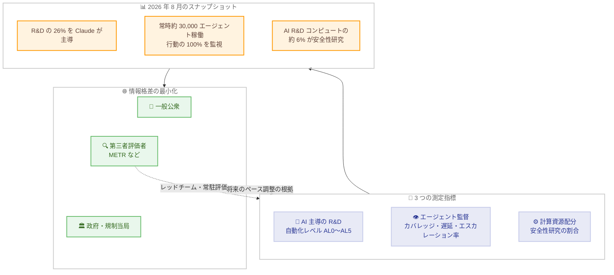

# フロンティアラボ内部の AI 開発ペースを理解するための測定指標

## メタデータ

| 項目 | 内容 |
|------|------|
| 発表日 | 2026-09-17 |
| ソース | Anthropic Institute |
| カテゴリ | 公式発表 / 透明性 / 政策・ガバナンス |
| 公式リンク | https://www.anthropic.com/institute/measuring-pace-of-ai-development |

## 概要

Anthropic は 2026 年 9 月 17 日、フロンティア AI 開発の透明性を高めるため、ラボ内部の AI 開発ペースを一般公衆・第三者・政府が追跡できるようにする 3 つの測定指標を提案し、あわせて自社内部の実測スナップショットを公開した。AI システムが指数関数的に強力になり、自らの次世代版の構築を自動化し始めている状況を踏まえ、「ラボが知っていることと公衆が知っていることのギャップ」を最小化することが目的である。

提案された指標は、(1) AI 主導の AI 研究開発の度合い、(2) AI エージェントに対する監督体制、(3) 計算資源の配分、の 3 つである。公開されたスナップショットでは、2026 年 8 月時点で Claude が Anthropic の AI R&D 業務の 26% を「主導」していること (2026 年 2 月は 1% 未満)、社内で常時約 30,000 のエージェントが稼働していること、AI R&D 向け計算資源の約 6% が安全性研究に配分されていることなどが示された。執筆は Marina Favaro と Phillie Wright、研究の方向付けは Jack Clark が担当し、外部専門家によるレッドチームワークショップも実施されている。

## 詳細

### 背景

これらの指標は「モデルが何をできるか」を測る能力評価 (責任あるスケーリング方針 = RSP のリスク報告書で別途公開) を補完し、「モデルがどう作られるか」を測るものとして位置づけられている。世界がフロンティア AI 開発のペース調整 (pacing) を検討する中、企業横断で比較可能な共通の測定基盤を整備することが狙いであり、Anthropic の政策提案「Advanced AI Framework」とも連動する。

対象読者は一般公衆、第三者評価機関、政府・規制当局、他のフロンティア AI 開発企業である。

### 主な内容

#### 1. AI 主導の AI 研究開発の測定

モデルが自らの開発を加速させると、人間による理解や制御が困難になりうる。「再帰的自己改善」(モデルが完全自律的に後継モデルを構築する状態) にどれだけ近いかを把握するため、Anthropic は試作指標「Anthropic R&D Automation Index」を構築した。社内の全 AI R&D タスクをカタログ化し、Epoch AI が開発した自動化レベル尺度 (AL0 = AI 関与なし〜AL5 = 完全自律。AL3 は「AI が協働」、AL4 は「AI が主導」) で各タスクの自動化度を評価して集計する。

2026 年 8 月時点の結果は以下のとおりである。

- どの領域でも Claude は完全自律 (AL5) には達していない
- Claude が Anthropic の AI R&D 業務の **26% を「主導」** (2026 年 2 月時点では 1% 未満)
- 「AI が協働」以上の業務の割合は **90% 超**

測定方法としては、2026 年 7 月の各週でモデル R&D 関連部門のスタッフの 20% を無作為抽出し、Claude の研究エージェントが Slack や社内文書からタスクを列挙。約 15,000 の詳細タスクを 542 ノード (うち 378 が末端) の階層ツリーに整理して凍結し、各ノードについて別の Claude がエビデンスを調査、独立した Claude 判定者が自動化レベルを付与した。重み付けには各タスクに費やされた人・時間を代理指標として用いている。

検証として、判定モデルと人間の完全一致率は 59% (人間同士は 35%)、1 レベル以内の一致は 97% であった。また、タスクバスケットを凍結する限界に対処するため 2026 年 1 月基準の代替ツリーとも比較し、新規タスクの顕著な増加は見られなかったと報告している。課題としては、共通の方法論の欠如と、自社モデルで自社を評価する「判定者バイアス」が挙げられており、第三者や他社モデルによる検証、新モデルを R&D に使う前の固定的なテスト期間の設定などが提案されている。

#### 2. AI エージェントの監督の測定

半自律的に長時間働き、互いに仕事を委任し合うエージェントが増える中、重大な意思決定への安全策と、多数のエージェント間でのみ現れる問題の検出体制が必要となる。個々のエージェントの不正行為は稀でも、数十億規模で稼働すれば稀な事象も日常的に起こるためである。指標は以下の 3 つが提案された。

1. **カバレッジ**: エージェントの行動のうち監視を通過する割合
2. **レビュー遅延**: 行動からレビューまでの時間
3. **エスカレーション率**: ブロックまたはフラグされる行動の割合

2026 年 8 月時点で、最も使われる社内プラットフォームでは常時**約 30,000 のエージェント**が研究・エンジニアリング業務に従事している。監視体制の実測値は以下のとおりである。

| 項目 | オンラインモニター | オフラインモニター |
|------|------------------|------------------|
| 役割 | リアルタイムで危険な行動をブロック (例: モデル重みの持ち出し) | 事後に活動を読み、緩やかに進行する危険 (ミスアラインメントの兆候など) を検出 |
| カバレッジ | 行動の 100% が実行前に通過 | 行動の 100% を事後取り込み |
| レビュー | 自動レビューは実行前、ブロック分は 1 週間以内に人間が確認 | 週約 10 万件のトランスクリプトをフラグし、最優先の約 50 件/週を人間がレビュー |
| ブロック / フラグ率 | 10 億超の決定のうち 0.002% (約 47,000 分の 1) をブロック | 1,000 件中 1〜2 件をフラグ |

設計上の工夫として、モデル更新後も継続して行動の監査を可能にするエージェントごとの**個別アイデンティティ**と、全メッセージが投稿者に紐づきエージェント同士が誤りを訂正できる**オープンな通信**が導入されている。外部検証として METR がオフライン監視プラットフォームを独立にレッドチーム済みであり、今後は複数組織の第三者評価者を社内に常駐させ、内部リスク評価チームと同等のアクセスを与える計画である。

#### 3. 計算資源配分の測定

計算資源 (コンピュート) の配分は開発者の重点領域とその変化を示す。また、コンピュートは AI R&D への入力の中で最も検証可能なものの一つであり、将来のペース調整の重要なレバーになりうる。Anthropic は 2026 年 7 月 13 日から 20 日の 1 週間、全コンピュート使用をカテゴリ分けし、AI R&D 向けコンピュートのうち安全性研究の割合を算出した。

- AI R&D 向けコンピュートのうち**約 6%** が安全性研究
- AI 駆動の AI R&D 向けでは**約 12%** が安全性研究

これらは意図的に保守的な推計であり、能力と安全性に等しく寄与するトークンはカウントせず、セーフガード用分類器も含めていない。安全性研究は本質的にコンピュート集約的ではないため、絶対値よりも「同一基準で企業間・時系列比較を可能にする仕組み」としての価値が強調されている。

測定方法は、既存の容量計画用監視ツールを統合し、Claude によるプロンプト分類器で各ワークロードを「安全性」か「その他 R&D」に分類するというもの。約 10,000 件の実行のうちコンピュート使用量で重み付けした約 14% をサンプリングし、分類器は人間レビュアーと 1〜2 パーセントポイント以内で一致した。ただし、スケーラブルオーバーサイトのように判定困難な境界事例も存在する。限界として、ラベルはベストエフォートで未検証であること、測定期間が 1 週間のみであること、効率改善で安全性割合が下がっても安全性の取り組み減少を意味しないことが明記されている。

### 技術的な詳細

3 つの指標はいずれも「測定 → 公開 → 第三者検証」という共通の枠組みで運用される。将来的には、安全性研究への計算資源配分のコミットメント、AI 研究エージェントへの資源上限、新モデル使用前のテスト期間といった、より強い要件のトリガーとして機能しうると位置づけられている。なお、Dario Amodei CEO が呼びかけるフロンティアのペース調整に関する協調が実現すれば、これらの数値は変化すると想定されることも明記されている。

## アーキテクチャ図

## 開発者への影響

### 対象

- **政策立案者・規制当局**: 企業横断で比較可能な透明性指標のたたき台として活用できる。コンピュート配分は検証可能性が高く、将来のペース調整のレバーになりうると提案されている
- **第三者評価機関・研究者**: Anthropic は複数組織の第三者評価者を社内に常駐させる計画を示しており、METR による監視プラットフォームのレッドチームのような独立検証の機会が広がる
- **他の AI 開発企業**: 共通の方法論・定義の策定が呼びかけられており、R&D 自動化指数やエージェント監視指標を自社でも測定・公開する際の参考になる
- **AI エージェントを運用する開発者・企業**: エージェントごとの個別アイデンティティ、オープンな通信、オンライン / オフラインの二層監視といった設計パターンは、大規模なエージェント運用の監督体制を構築する際の実践例として参照できる

### 必要なアクション

一般の開発者に必須のアクションはない。大規模にエージェントを運用する組織には、カバレッジ・レビュー遅延・エスカレーション率という 3 指標に基づく監視体制の点検が参考になる。

### 移行ガイド (該当する場合)

該当なし。

## 関連リンク

- [公式発表: Measurements for understanding the pace of AI development inside frontier labs](https://www.anthropic.com/institute/measuring-pace-of-ai-development)
- [Anthropic News](https://www.anthropic.com/news)
- [Anthropic の責任あるスケーリング方針 RSP](https://www.anthropic.com/rsp)
- [METR](https://metr.org/)
- [Epoch AI](https://epoch.ai/)

## まとめ

本発表は、フロンティア AI 開発の透明性を「モデルの能力」だけでなく「開発プロセスそのもの」に広げた点で重要である。Claude が Anthropic の AI R&D 業務の 26% を主導し、その割合が半年で 1% 未満から急伸したという実測値は、AI が自らの開発を加速させる段階が現実に始まりつつあることを示す具体的な証拠となる。常時約 30,000 のエージェントに対する二層の監視体制や、安全性研究への計算資源配分の定量化も、これまでラボ内部でしか見えなかった情報を初めて外部から追跡可能にする試みである。

一方で、自社モデルで自社を評価する判定者バイアスや測定期間の短さなど、Anthropic 自身が認める限界も多い。共通の方法論の策定と第三者評価者の常駐が実現すれば、これらの指標は企業間比較や将来のペース調整の実効的な基盤となりうる。他のフロンティアラボが同様の測定・公開に応じるかどうかが、今後の焦点となる。
