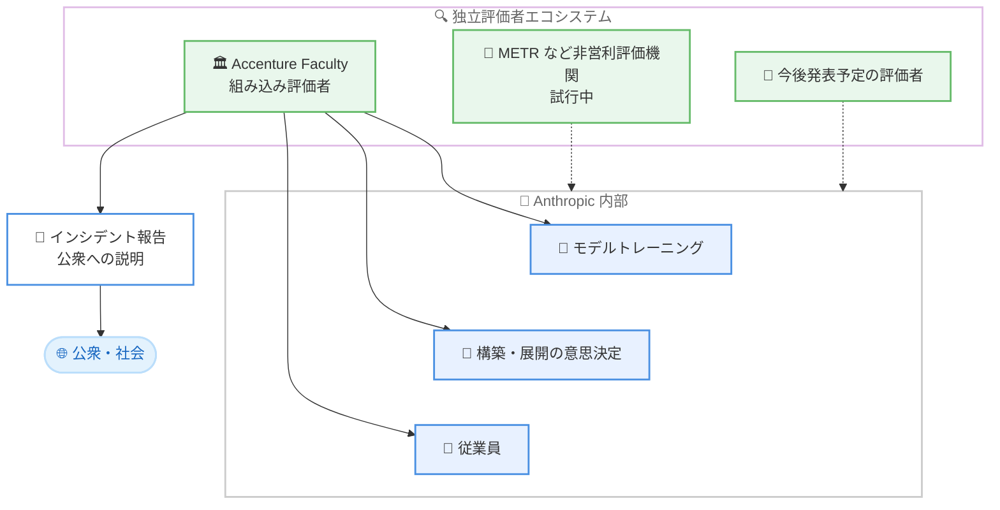

# Accenture との組み込み評価 (Embedded Evaluation) に関する提携を発表

## メタデータ

| 項目 | 内容 |
|------|------|
| 発表日 | 2026-09-18 |
| ソース | Anthropic News |
| カテゴリ | 発表 / 安全性・ガバナンス |
| 公式リンク | https://www.anthropic.com/news/accenture-embedded-evaluation |

## 概要

Anthropic は、フロンティア AI の独立評価に関して Accenture と提携することを発表した。本提携は、CEO のエッセイ「We Must Pace the Frontier」で表明された、独立評価者を Anthropic 内部に組み込むというコミットメントを実行に移す第一歩となる。提携は Accenture の専門 AI 事業である Faculty が主導し、モデルの評価とレッドチーミング、アライメント評価の実施、モデルセーフガードのテストを担当する。

両社は、今後 5 年間でこの分野の能力構築にそれぞれ少なくとも 10 億ドルの投資を見込んでいる。本提携は非独占的であり、Anthropic は今後数週間で発表予定の他の評価者とも協働し、Accenture も他の AI 開発企業と同様の役割で協働する。

## 詳細

### 背景

これまでの外部評価は、企業の外側から限定的なアクセスのもとで実施されてきた。Anthropic は、フロンティアモデルの能力が高まる中で、より深いレベルでの独立検証が必要になるとの立場を示しており、CEO エッセイおよび 2026 年 6 月の「Advanced AI Framework」において、評価者を企業内部に組み込む構想を提唱していた。今回の発表は、その構想を具体化する最初の提携となる。

### 組み込み評価 (Embedded Evaluation) とは

組み込み評価は新しい仕組みであり、運用の詳細は現在策定中である。従来の外部評価者と異なり、組み込み評価者 (embedded evaluator) は AI 企業の内部で働き、従業員に匹敵するアクセス権を持つ。これにより、以下が可能になる。

- **トレーニングの観察**: トレーニング中にモデルが形成される過程を観察する
- **意思決定の追跡**: モデルの構築・展開を決定する意思決定プロセスを追跡する
- **従業員との直接対話**: 開発に関わる従業員と直接対話する
- **運営の評価**: 企業運営を評価し、安全性コミットメントの遵守を検証し、盲点を特定する
- **公衆への説明**: インシデントを報告し、利益とリスクについてより情報に基づいた説明を公衆に提供する

記事は、独立した組み込み評価者は Anthropic の説明責任を減らすものではなく、検証可能にするものであり、モデルの安全性に対する責任は引き続き Anthropic にあると明記している。

### 提携の体制と資金

- **担当**: 提携は Accenture の専門 AI 事業である Faculty が主導する
- **業務内容**: モデルの評価とレッドチーミング、アライメント評価の実施、モデルセーフガードのテスト
- **投資規模**: Anthropic と Accenture は、それぞれ今後 5 年間でこの分野の能力構築に少なくとも 10 億ドルの投資を見込む
- **資金形態**: 現時点では Anthropic が Accenture に直接資金を提供する。長期的には、プール型または政府資金源からの資金提供が望ましいとの立場 (Advanced AI Framework で提唱)
- **Accenture の強み**: Accenture は多くの業界で企業や政府の AI 展開を支援しており、企業の実際の AI 利用に関する理解と視点を Anthropic のモデル評価に持ち込む

### エコシステムの構築

Anthropic は、単一の評価者ではなく、共有された標準のもとで運営される評価者のエコシステムが必要との考えを示している。

- 本提携は非独占的であり、Anthropic は今後数週間で発表予定の他の評価者とも協働する
- Accenture も他の AI 開発企業と同様の役割で協働する
- フロンティアラボは複数の評価組織と同時に協働することが想定されている
- METR などの非営利評価機関とは、各機関自身の資金で組み込み評価の要素を試行する対話を実施中である
- 組み込み評価者のアクセス範囲や報告方法に関する標準は未確立であり、分野の成熟に伴いアプローチを進化させる方針

## アーキテクチャ図

## 影響

### 企業への影響

- **透明性の向上**: 組み込み評価者によるインシデント報告と公衆への説明により、Anthropic のモデルを利用する企業は、安全性コミットメントの遵守状況について独立した検証情報を得られるようになる
- **業界標準の形成**: 評価者のアクセス範囲や報告方法の標準はこれから策定されるため、フロンティア AI のガバナンスに関する業界標準の形成に影響を与える可能性がある
- **エンタープライズ視点の反映**: Accenture が持つ企業・政府での AI 展開の知見がモデル評価に反映されるため、実運用に即した安全性評価が期待できる

### 開発者への影響

- **直接的な API 変更はなし**: 本発表はガバナンスと安全性検証に関するものであり、Claude API や SDK への直接的な変更は含まれない
- **モデルリリースへの影響**: Anthropic はフロンティアモデルの訓練・リリースを継続しながら、独立評価者と並行して作業を進める方針であり、リリースサイクルへの大きな影響は想定されていない
- **今後の情報公開**: 作業の開始時や評価者の追加時に詳細が共有される予定のため、続報に注目する必要がある

## 関連リンク

- [公式発表: Partnering with Accenture on embedded evaluation](https://www.anthropic.com/news/accenture-embedded-evaluation)
- [CEO エッセイ: We Must Pace the Frontier](https://darioamodei.com/post/we-must-pace-the-frontier)
- [METR](https://metr.org)
- [Anthropic News](https://www.anthropic.com/news)

## まとめ

Anthropic は Accenture と提携し、独立評価者が AI 企業の内部で従業員に匹敵するアクセス権を持って安全性を検証する「組み込み評価」の取り組みを開始した。両社は今後 5 年間でそれぞれ少なくとも 10 億ドルの投資を見込む。提携は非独占的であり、METR などの非営利評価機関を含む複数の評価者による、共有された標準のもとで運営されるエコシステムの構築を目指す。運用の詳細は策定中であり、今後の続報で具体的なアクセス範囲や報告標準が明らかになる見込みである。
