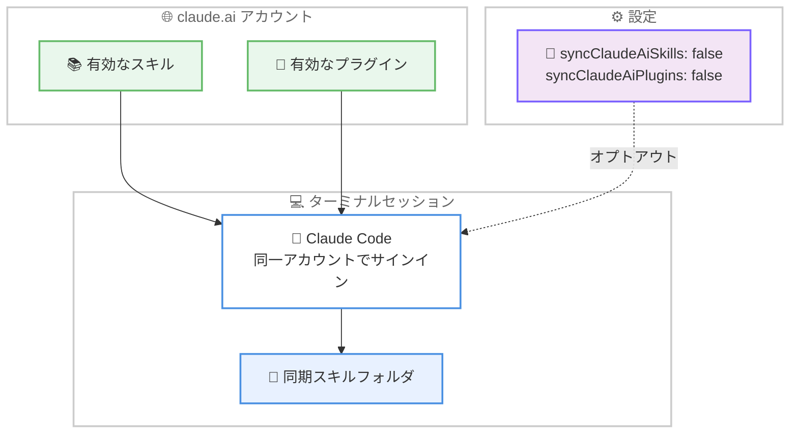

# Claude Code v2.1.275 / v2.1.276 リリース — 送信キーの追加と claude.ai アカウントのスキル / プラグイン同期、プロキシ環境のリグレッション修正

## メタデータ

| 項目 | 内容 |
|------|------|
| 発表日 | 2026-09-17 (v2.1.275)、2026-09-18 (v2.1.276) |
| ソース | Claude Code Changelog |
| カテゴリ | Claude Code アップデート |
| 公式リンク | https://github.com/anthropics/claude-code/blob/main/CHANGELOG.md |

## 概要

Claude Code v2.1.275 が 2026 年 9 月 17 日に、フォローアップの v2.1.276 が翌 9 月 18 日にリリースされた。主要リリースは v2.1.275 で、96 件の変更を含む大型アップデートである。新機能では、**送信キー (ctrl+enter、または ctrl+x ctrl+s)** が追加され、現在のターンを中断してキュー内のすべてのメッセージを一括送信できるようになった。また、**claude.ai アカウントで有効化したスキルとプラグインが、そのアカウントでサインインしたターミナルセッションに同期**されるようになり、`syncClaudeAiSkills: false` / `syncClaudeAiPlugins: false` でオプトアウトできる。このほか、`/plugin install <plugin> --marketplace <source>` オプション、Claude apps gateway サインイン時のアカウント確認、`otelHeadersHelper` 失敗時の起動時警告が追加された。

修正面では、resume 系のクラッシュ (不正なトランスクリプトエントリによる再開失敗など) の一連の解消、コンパクションや再開後のメモリファイルの経過時間表記がプロンプトキャッシュミスを引き起こす問題、Linux + zsh のサンドボックスコマンドが失敗時に終了コード 0 を報告する問題などが目立つ。セキュリティ面では、npm ソースからのプラグインが `npm pack --ignore-scripts` で取得・整合性検証されるようになり、パッケージのインストールスクリプトが実行されなくなった。ただし v2.1.275 には、`ANTHROPIC_BASE_URL` がプロキシやゲートウェイを指す環境で**全リクエストが 400 エラーになるリグレッション**が含まれており、v2.1.276 で修正された。該当環境の利用者は v2.1.276 以降への更新が必須である。

## 詳細

### 背景

前バージョンの v2.1.274 (2026 年 9 月 16 日) に続くリリースであり、v2.1.275 は新機能 5 件、修正 31 件、改善 10 件、動作変更 7 件に加え、VSCode 拡張 27 件、Claude Code on the web 5 件、Claude Tag 9 件、Code Review 2 件のプラットフォーム別変更を含む、合計 96 件の大型リリースである。入力操作の柔軟性向上、claude.ai アカウントとの連携強化、resume 系の堅牢性改善に重点が置かれている。一方で、プロキシ / ゲートウェイ環境で `400 … Input tag 'advisor_20260301'` エラーにより全リクエストが失敗するリグレッションが混入したため、約 5 時間後に修正版の v2.1.276 が緊急リリースされた。

### 主な変更点

#### v2.1.276: プロキシ環境のリグレッション修正

- **プロキシ / ゲートウェイ経由の 400 エラーを修正**: `ANTHROPIC_BASE_URL` がプロキシやゲートウェイを指す場合に、すべてのリクエストが `400 … Input tag 'advisor_20260301'` で失敗する v2.1.275 のリグレッションを修正した

#### v2.1.275: 新機能 (Added)

- **送信キー (send-now key)**: ctrl+enter (または ctrl+x ctrl+s) で現在のターンを中断し、キュー内のすべてのメッセージを一括送信できるようになった。送信済みおよびキュー内のメッセージは、モデルが受信するまでグレーで表示される
- **claude.ai アカウントのスキル / プラグイン同期**: claude.ai アカウントで有効化したスキルとプラグインが、そのアカウントでサインインしたターミナルセッションに同期される。`syncClaudeAiSkills: false` または `syncClaudeAiPlugins: false` でオプトアウトできる
- **`/plugin install <plugin> --marketplace <source>`**: マーケットプレイスが未登録の場合、プラグインのインストール前に追加を提案する
- **Claude apps gateway サインイン時のアカウント確認**: ゲートウェイがアカウント名を通知する場合、資格情報の保存前にサインイン中のアカウントを確認でき、`/status` にも表示される
- **`otelHeadersHelper` 失敗時の起動時警告**: 設定済みの `otelHeadersHelper` が失敗した際に警告が表示され、テレメトリが黙って出力されないセッションに気づけるようになった

#### v2.1.275: 修正 (Fixed) — resume とトランスクリプトの堅牢性

- **不正なエントリによる再開失敗**: `--resume`、resume ピッカーのプレビュー、再開したバックグラウンドエージェント、トランスクリプトビューが、保存された履歴に不正な task-reminder や @-file 添付エントリを含むセッションで失敗する問題を修正
- **不正なメッセージエントリによるクラッシュ**: トランスクリプトに不正なメッセージエントリを含む会話の再開時のクラッシュと、そのような会話がスクロールアップ中に新しいメッセージを受信した際のフルスクリーンクラッシュを修正
- **不正なコンテンツブロックによる起動失敗**: 保存されたトランスクリプトに不正なメッセージコンテンツブロックを含むセッションが再開も開始もできない問題を修正
- **thinking の喪失**: 会話の開始時に使っていた組み込みツールがサーバー側フラグで無効化された後、`--resume` / `--continue` が以前の thinking を落とす問題を修正
- **`/rewind` のファイル破損**: フォークまたはバックグラウンドセッションでの `/rewind` が、ファイル履歴バックアップを完全にコピーできなかった場合にゼロ埋めまたは切り詰められたファイルを復元する問題を修正
- **起動時クラッシュ**: `~/.claude.json` の `mcpNeedsAuthNoticed` 値が不正な場合の起動時クラッシュを修正

#### v2.1.275: 修正 (Fixed) — プロンプトキャッシュとパフォーマンス

- **メモリファイルの経過時間表記によるキャッシュミス**: 復元されたメモリファイルの経過時間の注記がコンパクションや再開後のリクエスト間で変化し、プロンプトキャッシュミスを引き起こす問題を修正
- **Grep / Glob のハングとメモリ不足**: 20 MB の出力上限を超える検索で Grep・Glob・@-file 候補がハングまたはメモリ不足になる問題と、大量の警告後にシステムの ripgrep がエラーではなく「no matches」を報告する問題を修正
- **大きな diff でのフリーズ**: フルスクリーンモードで大きなファイル diff を越えてスクロールアップした際に数秒間フリーズまたはブランクになる問題を修正
- **Read ツールのハング**: メモリ圧迫下で大きなファイルの一部がデコードできない場合に、Read ツールがエラーを報告せずハングする問題を修正

#### v2.1.275: 修正 (Fixed) — サンドボックスとネットワーク

- **Linux + zsh の終了コード**: シェルが zsh の場合に、Linux のサンドボックス化された Bash コマンドが失敗したコマンドに対して終了コード 0 を報告する問題を修正
- **`hooks/` / `config/` ディレクトリへの書き込み**: サンドボックス化された Bash コマンドが、`hooks/` や `config/` という名前のプロジェクトディレクトリに書き込めない問題を修正
- **ゲートウェイ経由の 400 エラー**: ベータリクエストヘッダーが拒否された際に API エラーレスポンスを書き換えるネットワークゲートウェイの背後で、毎ターン `API Error: 400` が発生する問題を修正
- **ファイルディスクリプタ枯渇時のクラッシュ**: stdin 経由のコマンドがファイルディスクリプタを使い果たしたマシンで実行された際に、バックグラウンドセッションがクラッシュしワーカーを再起動する問題を修正

#### v2.1.275: 修正 (Fixed) — プラグインと資格情報の保護

- **URL 内のパスワード / トークンの露出**: プラグインとマーケットプレイスのメッセージ・ログ・`claude plugin marketplace list` が、git・ssh・マーケットプレイス URL に保存されたパスワードやトークンを表示する問題を修正
- **マーケットプレイスのローカルコピー削除**: `claude plugin marketplace update` が、フェッチ失敗時にリポジトリ名と同名の GitHub マーケットプレイスのローカルコピーを削除する問題を修正
- **プラグインリロードプレビューの上書き**: `--plugin-dir` や `--plugin-url` のアーカイブから読み込んだプラグインについて、リロードプレビューが実行中セッションの展開済みプラグインファイルを置き換える問題を修正

このほか、@-mention のファイル候補がカスタム `fileSuggestion` コマンド使用時や `@.` / `@./` 入力時に MCP リソースの下に埋もれる問題、vim モードのカーソル位置ずれ、応答に `</ccmemory>` 風の閉じタグが混入する問題、`--forward-subagent-text` が `context: fork` スキルの生成したサブエージェントのメッセージを落とす問題、`SubagentStop` フックの `matcher` がエージェントタイプが空のサブエージェントすべてに発火する問題、`/update-config` がファイル権限チェックに一致しない `Write(path)` ルールを書き込む問題 (正しくは `Edit(path)`)、セルフホストランナーの SIGTERM ドレイン中に完了したターンの最終結果が失われる問題などが修正された。

#### v2.1.275: 改善 (Improved)

- **`--system-prompt` のプロンプトキャッシュ**: `__SYSTEM_PROMPT_DYNAMIC_BOUNDARY__` 行を含む `--system-prompt` について、境界より上のテキストが SDK の配列形式と同様にグローバルにキャッシュされるようになった
- **画像添付の扱い**: 貼り付け・添付された画像が、Desktop や VS Code を含め、権限プロンプトなしで Claude がファイルとして開ける場所に保存されるようになった
- **プラン使用量の読み取り共有**: 同一マシン上のエディタウィンドウと非対話セッションが、直近 1 分以内の読み取り結果を共有し、それぞれが使用量エンドポイントを呼ばなくなった
- **遅い端末での応答性**: 端末が遅い、または一時停止している場合に、端末の追いつきを待つ間も出力がさらに遅れなくなった
- **Artifact ツールの結果と誘導**: 公開・読み取り結果がページを開ける相手と所有者の Share メニューの内容を示すようになり、編集権限をもらった共有アーティファクトは別コピーを公開せずその場で更新するようガイダンスが改善された
- **同期スキルフォルダの Write / Edit 結果**: 同期されたアカウントスキルフォルダ内のファイルへの変更が、アカウントには保存されないことと保存方法を結果に明示するようになった

このほか、`/desktop` が Claude Desktop を開けない場合の理由と次の手順の表示、`ListPlugins` ツールの説明の明確化 (claude.ai アカウントで有効なプラグインを列挙し、`/plugin` でローカルにインストールしたものではない)、Claude apps gateway サインインの `/logout` がトークン失効を通知するゲートウェイ上のセッションも終了するようになるなどの改善が含まれる。

#### v2.1.275: 変更 (Changed)

- **npm プラグインのインストールスクリプト無効化**: npm ソースからインストールされるプラグインが `npm pack --ignore-scripts` で取得され整合性検証されるようになり、パッケージのインストールスクリプトが実行されなくなった
- **Claude in Chrome の auto モード**: クラシファイアが承認した呼び出しについて、bypass モードと同様に拡張機能のサイト単位チェックをスキップするようになり、リダイレクト後の `browser_batch` の「Permission denied」が解消された
- **ホストセッションの権限プロンプト維持**: コンテナ再起動後に未回答の権限プロンプトを再度尋ねる代わりに、表示し続けるようになった
- **ルーチンによるアーティファクトの再公開**: スケジュール実行と Run now のルーチンが、編集可能なアーティファクトへのデータ保存とページの再公開を確認なしで行うようになった。公開アーティファクト、初回公開、削除は引き続き確認される
- **アーティファクトのタブアイコン**: 初回公開時に絵文字ファビコンではなく 1 語のタブアイコンを尋ねるようになった
- **起動時通知の削除**: 前回セッション以降に単発のスケジュールルーチンが実行されたことを伝える起動時通知が削除された

#### プラットフォーム別の変更

- **[VSCode]**: **Memory ダイアログ内での保存済みメモリの表示・編集・削除**、テキストなしでの添付画像送信、**提案された変更の diff タブでの変更単位の承認 / 却下ボタン**、MCP サーバーリストの読み込み失敗時の Retry リンクが追加された。修正としては、返信のストリーミング中にスクロールアップしても最下部に引き戻される問題の解消 (送信時のジャンプを無効化する `claudeCode.scrollToBottomOnSend` 設定も追加)、実行中セッションの名前変更が生成名に戻る問題 (v2.1.269 のリグレッション)、claude.ai/code のセッションが空の会話として開く問題、応答中に入力したスラッシュコマンドがテキストとしてモデルに送られる問題、High Contrast Light テーマでのコードの視認性、git-ignore されたファイルの選択テキストが拡張の無応答後に送信され得る問題などが解消された。エージェントマップは、実行中エージェント数を表示し失敗後に赤くなるピル、スクロール中もメインエージェントを表示、状態と終了時刻によるソートに改善された
- **[Claude Code on the web]**: ルーチンリンクが解決できない場合のページに「New routine」ボタンが追加された。非常に長い許可ドメインリストを持つクラウド環境が保存後に毎回セッション開始に失敗する問題は、保存時に事前に失敗しどれだけ削るべきかを示すようになった。個人アカウントのクラウドセッションが GitHub アクセスを拒否された際の案内が、管理者設定ページではなく claude.ai/connect-github へのリンクになった
- **[Claude Tag]**: アクセスバンドルのアタッチ条件 (ゲストのいるチャンネルや Slack Connect チャンネルへの適用を Owner が許可可能) と、Amazon CloudWatch・CloudWatch Logs・Amazon SNS・Google Cloud Monitoring・Cloud Logging のプリセット、Datadog の US3・AP1・AP2・US1-FED サイトのプリセットが追加された。修正では、AWS 接続経由の S3 アップロードの 502 エラー、スレッドで切り替えたモデルがセッション再起動後にチャンネルのデフォルトへ戻る問題、他のアプリやボットの @メンションに Claude が二重に返信する問題などが解消された
- **[Code Review]**: レビューエージェントが予期しない形式で結果を返した際に分析の一部が欠落する問題と、100 件を超える Claude レビューを持つ PR がベースブランチからのクリーンマージのたびに軽量なマージ特化レビューではなくフルレビューを受ける問題が修正された

### 技術的な詳細

**claude.ai アカウントのスキル / プラグイン同期**: claude.ai アカウントで有効化したスキルとプラグインが、同じアカウントでサインインしたターミナルセッションに自動同期される。設定でオプトアウトでき、同期されたスキルフォルダ内のファイルを Write / Edit で変更した場合は、その変更がアカウントに保存されないことと保存方法が結果に明示される。あわせて `ListPlugins` ツールの説明も、claude.ai アカウントで有効なプラグインを列挙するものであることが明確化された。



**v2.1.276 のリグレッション修正**: v2.1.275 では、`ANTHROPIC_BASE_URL` がプロキシやゲートウェイを指す環境で、すべてのリクエストが `400 … Input tag 'advisor_20260301'` エラーで失敗するリグレッションが発生した。LLM ゲートウェイや社内プロキシを経由する構成 (エンタープライズ環境で一般的) が広く影響を受けるため、npm 公開から約 5 時間後の 9 月 18 日に v2.1.276 が緊急リリースされた。なお v2.1.275 自体にも、ベータリクエストヘッダー拒否時に API エラーレスポンスを書き換えるゲートウェイ背後での `API Error: 400` の修正が含まれており、ゲートウェイ環境の互換性改善が続いている。

**npm プラグインのインストールスクリプト無効化**: これまで npm ソースからのプラグインインストールでは、パッケージの `preinstall` / `postinstall` などのインストールスクリプトが実行され得た。v2.1.275 からは `npm pack --ignore-scripts` でパッケージを取得し、整合性検証を行うため、インストールスクリプトは実行されない。悪意のあるパッケージがインストール時に任意コードを実行するサプライチェーン攻撃のリスクが低減される一方、インストールスクリプトに依存するプラグインは動作を見直す必要がある。

**プロンプトキャッシュの改善**: 2 つの変更がキャッシュ効率を高める。1 つ目は、復元されたメモリファイルの経過時間の注記がリクエスト間で変化し、コンパクションや再開後にプロンプトキャッシュミスを引き起こしていた問題の修正である。2 つ目は、`__SYSTEM_PROMPT_DYNAMIC_BOUNDARY__` 行を含む `--system-prompt` について、境界より上の静的なテキストが SDK の配列形式と同様にグローバルにキャッシュされるようになった改善である。動的な内容をシステムプロンプトに含める CLI ベースの自動化で、キャッシュヒット率の向上が期待できる。

## 開発者への影響

### 対象

- **プロキシ / LLM ゲートウェイ経由で利用する組織**: v2.1.275 では全リクエストが 400 エラーで失敗するため、**v2.1.276 以降への更新が必須**である
- **claude.ai アカウントでサインインしている利用者**: アカウントで有効化したスキルとプラグインがターミナルセッションに同期される。不要な場合は `syncClaudeAiSkills: false` / `syncClaudeAiPlugins: false` でオプトアウトする
- **複数メッセージをキューに入れて作業する利用者**: ctrl+enter (または ctrl+x ctrl+s) で現在のターンを中断し、キュー内のメッセージを一括送信できる
- **npm ソースのプラグインを配布・利用する開発者**: インストールスクリプトが実行されなくなったため、`postinstall` などに依存するプラグインは動作を見直す必要がある
- **セッションの再開を多用する利用者**: 不正なトランスクリプトエントリによる再開失敗やクラッシュ、メモリファイル起因のプロンプトキャッシュミスが解消され、resume の信頼性が向上した
- **Linux + zsh でサンドボックスを使う利用者**: 失敗したコマンドが終了コード 0 を報告する問題が修正され、エラー検知が正しく機能する
- **OpenTelemetry でテレメトリを収集する組織**: `otelHeadersHelper` の失敗が起動時に警告されるようになり、テレメトリの欠落に気づきやすくなった
- **VSCode 拡張の利用者**: Memory ダイアログでのメモリ管理、diff タブでの変更単位の承認 / 却下、ストリーミング中のスクロール挙動の改善などを受けられる

### 必要なアクション

以下のいずれかの方法で最新バージョンに更新できる。プロキシ / ゲートウェイ環境では v2.1.275 をスキップし、必ず v2.1.276 以降に更新する。

```bash
# Claude Code 組み込みコマンド
claude update

# npm でのアップデート
npm update -g @anthropic-ai/claude-code

# バージョンを指定してインストールする場合
npm install -g @anthropic-ai/claude-code@2.1.276

# 現在のバージョン確認
claude --version
```

### 移行ガイド (該当する場合)

破壊的変更はアナウンスされていないが、以下の動作変更に注意が必要である。

- **v2.1.275 を利用中でプロキシ / ゲートウェイ構成の場合**: 全リクエストが 400 エラーになるリグレッションがあるため、直ちに v2.1.276 へ更新する
- **claude.ai アカウントのスキル / プラグイン同期を望まない場合**: 設定に `syncClaudeAiSkills: false` または `syncClaudeAiPlugins: false` を追加する
- **npm プラグインのインストールスクリプトに依存している場合**: `npm pack --ignore-scripts` での取得により実行されなくなったため、セットアップ処理をスクリプト以外の方法に移行する
- **ルーチンでアーティファクトを扱っている場合**: 編集可能なアーティファクトへの保存と再公開が確認なしで行われるようになった。公開アーティファクト、初回公開、削除は引き続き確認される
- **`/update-config` で書き込んだファイル権限ルールがある場合**: 従来書き込まれていた `Write(path)` ルールはファイル権限チェックに一致しないため、`Edit(path)` ルールへの見直しを検討する

## コード例

claude.ai アカウントのスキル / プラグイン同期をオプトアウトする設定例 (settings.json)。

```json
{
  "syncClaudeAiSkills": false,
  "syncClaudeAiPlugins": false
}
```

マーケットプレイス未登録のプラグインを、マーケットプレイスの追加とあわせてインストールする例。

```bash
# マーケットプレイスの追加を提案しつつプラグインをインストール
claude plugin install my-plugin --marketplace my-org/my-marketplace
```

`__SYSTEM_PROMPT_DYNAMIC_BOUNDARY__` を使って静的部分をグローバルキャッシュさせる例。

```bash
claude -p "タスクを実行" --system-prompt "$(cat <<'EOF'
ここに静的なシステムプロンプトを記述する。
この部分はグローバルにキャッシュされる。
__SYSTEM_PROMPT_DYNAMIC_BOUNDARY__
現在時刻: 2026-09-18 10:00 JST
この部分は動的に変化してもキャッシュに影響しない。
EOF
)"
```

## 関連リンク

- [Claude Code Changelog](https://github.com/anthropics/claude-code/blob/main/CHANGELOG.md)
- [Claude Code npm パッケージ](https://www.npmjs.com/package/@anthropic-ai/claude-code)
- [Claude Code GitHub リポジトリ](https://github.com/anthropics/claude-code)
- [Claude Code ドキュメント](https://docs.anthropic.com/en/docs/claude-code)
- [Claude Code v2.1.271 / v2.1.272](./2026-09-14-claude-code-v2-1-271-v2-1-272.md)
- [Claude Code v2.1.270](./2026-09-13-claude-code-v2-1-270.md)

## まとめ

Claude Code v2.1.275 は、送信キー (ctrl+enter) の追加と claude.ai アカウントのスキル / プラグイン同期を軸に、96 件の変更を含む大型リリースである。resume 系のクラッシュや再開失敗の一連の修正、メモリファイル起因のプロンプトキャッシュミスの解消、`--system-prompt` の動的境界によるグローバルキャッシュ対応など、セッションの信頼性とコスト効率を高める変更が目立つ。セキュリティ面では、npm プラグインのインストールスクリプト無効化と整合性検証、URL 内のパスワード / トークンの露出防止が導入された。

一方で、v2.1.275 にはプロキシ / ゲートウェイ環境で全リクエストが 400 エラーになるリグレッションが混入し、約 5 時間後の v2.1.276 で修正された。`ANTHROPIC_BASE_URL` をゲートウェイに向けているエンタープライズ環境では、v2.1.275 をスキップして v2.1.276 以降へ更新する必要がある。
