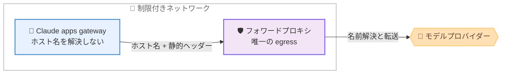

# Claude Code v2.1.277 リリース — AGENTS.md サポートの追加、ゲートウェイのプロキシ経由 egress 対応、TaskOutput ツールの削除

## メタデータ

| 項目 | 内容 |
|------|------|
| 発表日 | 2026-09-18 (npm 公開: 16:22 UTC) |
| ソース | Claude Code Changelog |
| カテゴリ | Claude Code アップデート |
| 公式リンク | https://github.com/anthropics/claude-code/blob/main/CHANGELOG.md |

## 概要

Claude Code v2.1.277 が 2026 年 9 月 18 日にリリースされた。新機能 4 件、修正 48 件、改善 10 件、動作変更 5 件、削除 2 件に加え、VSCode 拡張 9 件、Claude Code on the web 4 件、Claude Tag 5 件のプラットフォーム別変更を含む、合計 87 件のリリースである。最大のトピックは **AGENTS.md サポート**で、CLAUDE.md のないプロジェクトでは Claude Code が代わりに AGENTS.md を読み込むようになった (Bedrock、Vertex、Foundry では未提供)。また、Claude apps gateway 向けに、**フォワードプロキシを唯一の egress とする構成のための `CLAUDE_GATEWAY_PROXY_IS_EGRESS_BOUNDARY=1`** と、アップストリームに静的ヘッダーを送る **`headers:` マップ**が追加された。

修正面では、内部エラー後に `claude -p` や Agent SDK セッションが結果なしでハングする問題、空のテキストブロックによる「text content blocks must be non-empty」エラー、`--worktree` セッションでプロジェクトスキルが読み込まれない問題など、ヘッドレス実行と安定性に関わる修正が多数含まれる。動作変更では、**サブエージェントの結果がサブエージェント出力であることを示すヘッダー付きでメインエージェントに渡される**ようになり、削除では**非推奨だった TaskOutput ツールが削除**され、バックグラウンドタスクの出力は Read ツールで読む方式に一本化された。

## 詳細

### 背景

前日リリースの v2.1.275 / v2.1.276 に続くリリースである。AGENTS.md は複数の AI コーディングツールで使われるエージェント向け指示ファイルの慣行であり、本バージョンで CLAUDE.md がない場合のフォールバックとして正式にサポートされた。また、エンタープライズ環境で利用が進む Claude apps gateway に対して、ネットワーク境界 (egress) をフォワードプロキシに委ねる構成のサポートが追加され、ゲートウェイ関連の機能強化が続いている。

### 主な変更点

#### 新機能 (Added)

- **AGENTS.md サポート**: CLAUDE.md のないプロジェクトでは、Claude Code が代わりに AGENTS.md を読み込む。この動作は `/config` の「Project instructions」で変更できる。Bedrock、Vertex、Foundry ではまだ提供されていない
- **`CLAUDE_GATEWAY_PROXY_IS_EGRESS_BOUNDARY=1`**: 唯一の egress がフォワードプロキシである Claude apps gateway 向けの設定。すべての送信リクエストで、ホスト名をローカルで解決せずプロキシに渡すようになる
- **ゲートウェイアップストリームの `headers:` マップ**: Claude apps gateway のアップストリームにオプションの `headers:` マップを指定でき、プロバイダーの手前で運用しているプロキシに静的ヘッダーを送信できる
- **バックグラウンドタスクの完了通知行**: `/tasks` などのパネルを開いている間にバックグラウンドタスクが完了した場合、更新が待機中であることを示す行が表示される

#### 修正 (Fixed) — ヘッドレス実行と SDK

- **`claude -p` / Agent SDK のハング**: 内部エラー後に結果を返さずハングすることがあった問題を修正。エラーを報告し、終了コード 1 で終了するようになった
- **空テキストブロックによる会話の失敗**: 過去のアシスタントターンが他のコンテンツと並んで空のテキストブロックを含む場合に、`--resume` 後を含め、すべてのリクエストが「text content blocks must be non-empty」で失敗する問題を修正
- **ヘッドレス resume のコスト / 使用量リセット**: `claude -p --resume`、SDK、VS Code 拡張のウィンドウ再読み込みによる再開で、セッションのコストと使用量の合計がゼロから始まる問題を修正。ヘッドレスセッションは終了時に合計を保存するようになった
- **SessionStart フックによるプロンプトキャッシュミス**: `/clear` 後に継続したセッション (再起動、`--continue`、`--resume`) で、SessionStart フックが出力を出すと最初のメッセージの一部が欠落し、プロンプトキャッシュが完全にミスする問題を修正

#### 修正 (Fixed) — ツールの堅牢性

- **Grep / Glob のリソース枯渇時の誤報告**: プロセス、メモリ、ファイルハンドルの不足で検索を開始できなかった場合に「no matches」と報告する問題を修正。その旨のエラーを返すようになった
- **Write ツールのディレクトリ指定**: 対象パスが既存のディレクトリの場合に、権限拒否として黙ってターンを終了していた問題を修正。明確なエラーを報告するようになった
- **Edit ツールのエスケープ処理**: エスケープされたバックスラッシュに続く `uXXXX` テキストを `\uXXXX` エスケープとして扱い、非 ASCII 文字の編集がエスケープ済みのバックスラッシュ列を書き換えることがあった問題を修正
- **Edit ツールのエラーメッセージ**: 非 ASCII テキストを含む非常に大きな編集がファイルに一致しなかった際に、「String not found in file」ではなく「Invalid regular expression: regular expression too large」と報告する問題を修正
- **エスケープされた制御文字によるターン終了**: ツール呼び出しのファイルパスがエスケープシーケンスとして書かれた `\u0000` を含む場合に「Path contains null bytes」でターンが早期終了する問題を修正。エスケープされた制御文字はリテラルテキストのまま扱われる

#### 修正 (Fixed) — クラッシュと安定性

- `~/.claude.json` の不正な値によるクラッシュを複数修正: 不正な `theme` 値による起動時クラッシュ、不正な `claudeAiMcpEverConnected` 値による `/mcp` / `/plugin manage` のクラッシュ、不正な `customApiKeyResponses` 値による `ANTHROPIC_API_KEY` 利用時の起動ハング、不正なプレースホルダーレコードによる Remote Control のセッション管理の失敗
- **端末カラーコードによるクラッシュ**: 履歴から呼び出したプロンプトや外部エディタから読み込んだテキストに端末カラーコードが含まれる場合のクラッシュを修正
- **resume 系のクラッシュ**: 文字列として保存されたアシスタントメッセージを含むセッションの再開時クラッシュと、整形されていないフックリストを持つ stop フックサマリーを含むトランスクリプトの再開時クラッシュを修正
- **遅いマシンでの起動時終了**: 遅い、または高負荷のマシンで最初のスピナー表示時に「unrecoverable interface error」で終了することがあった問題を修正
- **画面更新の停止**: 内部レンダリングエラー後にセッションの残りの間、画面が更新されなくなる稀なケースを修正
- **Windows のメモリ不足エラー**: 応答直後に「Out of memory」などのエラーでターンが停止し、その応答のツール呼び出しが実行されない稀なケースを修正

#### 修正 (Fixed) — プラグインとエンタープライズ

- **`claude plugin install` の再インストール失敗**: セッションや他のプログラムが使用中のプラグインバージョンを再インストールすると、失敗してインストール済みのコピーを壊すことがあった問題を修正。変更のないコピーはそのまま残される
- **エンタープライズマーケットプレイスポリシーの無効化**: `strictKnownMarketplaces` または `blockedMarketplaces` の 1 件の不正なエントリが、ポリシー全体を黙って無効化する問題を修正
- **`installed_plugins.json` のコミット記録**: 公式マーケットプレイスのプラグインがコミットなしで記録される問題と、コミット固定プラグインの更新後も古いコミットが残る問題を修正
- `/plugin` の各種問題を修正: 組み込み Object プロパティ (`constructor` など) と同名のスキルによるクラッシュ、複数選択のインストールがすべて失敗した際にメッセージなしで閉じる問題、アンインストール済みプラグインが「failed to load」行として再表示される問題、Installed タブのメッセージに端末制御文字が残る問題
- **`--worktree` セッションのプロジェクトスキル**: `.claude/skills` が git 管理外の場合に、メインリポジトリのプロジェクトスキルが読み込まれない問題を修正
- **サンドボックス除外グロブの厳格化**: `sandbox.excludedCommands` のグロブが複合 Bash コマンドの一部にのみ一致した場合に、コマンド全体をサンドボックスから除外していた問題を修正。すべての部分が一致する必要がある

このほか、自動更新失敗時に `~/.cache/claude/staging` に大きなダウンロードが残る問題、winget / apk 管理インストールで `claude update` がバージョン取得失敗時に「up to date」と報告する問題、プロキシが不正なバージョンを返した際の更新チェックのエラーと `claude update` のハング、同一マシン上の古いビルドによる予期しないログアウト、resume したサブエージェントの MCP ツール定義再レンダリングによるプロンプトキャッシュ破壊、応答中に入力したメッセージがモデルに無視されることがある問題、サンドボックス有効時にサンドボックス外で実行される Bash コマンドで `$TMPDIR` が空に展開される問題などが修正された。

#### 改善 (Improved)

- **SDK / ヘッドレス起動の高速化**: 最初のターンがディレクトリごとの CLAUDE.md 検索を待たなくなった
- **不可視 Unicode 文字の除去**: プロンプト内の不可視の Unicode 書式文字やタグ文字が除去され、クリーンアップ後のプロンプトが送信前に確認用に表示される
- **危険な rm の権限プロンプト**: 対象の rm コマンドを明示し、`${VAR:?}` ガードを提案するようになり、ヘッドレス実行でも復帰しやすくなった
- **`claude plugin install` の案内**: インストール済みプラグインに対して実行した場合、マーケットプレイスに新しいバージョンがあることと `claude plugin update` コマンドを案内する
- **`/plugin` Installed の表示**: プラグインと別に表示される MCP サーバーが、どのプラグインに属するかを表示する
- **Artifact ツール**: 権限プロンプトの文面が簡潔になり、claude.ai アーティファクトリンクは WebFetch ではなく Artifact ツールで読むようになった

このほか、ゲートウェイのループバックエラーメッセージが `CLAUDE_GATEWAY_ALLOW_LOOPBACK` を明示するようになり、起動時通知のオーバーフロー行が「N more notices hidden」と読みやすくなり、`/ultrareview` はレビュー対象がない場合の案内が改善された。

#### 動作変更 (Changed)

- **サブエージェント結果のヘッダー付き受け渡し**: サブエージェントの結果は、サブエージェント出力であることを示すヘッダーの下にインデント付きでメインエージェントに渡されるようになった。サブエージェントの結果内のテキストが、セッション自身の指示として扱われることを防ぐ
- **`/model` での Fable の表示**: Anthropic API では Fable が常に `/model` に表示され、組織の設定で無効化されている場合のみグレーアウトされる
- **Bedrock / Vertex / Foundry の Bash サンドボックス指示**: ファーストパーティと同じ文言に変更され、サンドボックスをタスクに与えられた境界として位置づける
- **ワークフロースクリプトの `agent()` プロンプト**: Bedrock、Vertex、Foundry では、スクリプトが生成したテキストとしてサブエージェントに渡されるようになり、安全性クラシファイアがユーザー発言として読まなくなった
- **非対話セッションの `/ultrareview`**: リポジトリにベースブランチも共有履歴もない場合は拒否するようになった

#### 削除 (Removed)

- **TaskOutput ツールの削除**: 非推奨だった TaskOutput ツールが削除された。Claude はバックグラウンドタスクの出力ファイルを Read ツールで読む。`taskOutputMaxChars` 設定と `TASK_MAX_OUTPUT_LENGTH` は効果がなくなった
- **`claude -p` の自動タイトル生成の削除**: SDK や IDE 以外から起動した `claude -p` 実行で、バックグラウンドの Haiku 自動タイトルリクエストが行われなくなった

#### プラットフォーム別の変更

- **[VSCode]**: パネルメニューの Sign out 行と `/logout`、エージェントマップへのバックグラウンドシェルなど実行中タスクの表示 (それぞれ Stop 付き、`/tasks` で開ける)、応答の Copy response ボタンと `/copy`、非アクティブセッション自動アーカイブの一度限りの通知と「Unarchive all」アクション、プラン制限のない環境 (Vertex、Bedrock、Foundry、API キー) でのコストとトークン使用量の表示が追加された。修正では、「General config」メニュー行が設定を開かず `/config` の使用方法を表示する問題、effort スライダーのレベルが後続セッションに引き継がれない問題、`/fast` がファストモードをデフォルトとして保存しない問題などが解消された
- **[Claude Code on the web]**: Team / Enterprise プランの環境ピッカーに Personal と Organization のセクションが追加され、管理者は個人環境を組織に共有できるようになった。組織環境は Code タブからは読み取り専用サマリーとして開き、編集は Admin settings → Cloud environments で行う。Custom network access でドメイン未指定のまま保存すると Trusted に黙って戻る問題は、最低 1 つのドメインを求めるダイアログに変更された。管理者設定の「Web」ラベルは「Cloud sessions」に変更され、冗長な読み取り専用の Mobile 行は削除された
- **[Claude Tag]**: Enterprise Grid の組織全体インストールで、Slack チャンネルで作成されたルーチンが同じワークスペースの他のパブリックチャンネルを読めない問題が修正された。アクセスバンドルでは、認証プリセットの「Learn more」リンクが各ベンダーの設定ページを開くようになり、Pylon プリセットで EU ホストを指定できるようになり、Google Cloud 認証フォームの挙動 (拒否理由の表示、キーローテーション拒否時の入力保持) が改善された。AWS 署名、クライアント証明書、カスタム CA を使う接続でネットワークイベントログにレスポンスステータスが表示されない問題も修正された

### 技術的な詳細

**AGENTS.md サポート**: CLAUDE.md のないプロジェクトでは、Claude Code が AGENTS.md をプロジェクト指示として読み込む。どちらを使うかは `/config` の「Project instructions」で変更できる。既に CLAUDE.md があるプロジェクトの動作は変わらない。なお、Bedrock、Vertex、Foundry ではまだ提供されていない。

**ゲートウェイのプロキシ egress 対応**: 送信トラフィックの出口がフォワードプロキシに限定されているネットワークでは、ゲートウェイがホスト名をローカルの DNS で解決しようとすると失敗する。`CLAUDE_GATEWAY_PROXY_IS_EGRESS_BOUNDARY=1` を設定すると、すべての送信リクエストがホスト名の解決をプロキシに委ねるようになる。あわせて、アップストリームの `headers:` マップにより、プロバイダーの手前のプロキシに静的ヘッダーを送信できる。



**TaskOutput ツールの削除**: バックグラウンドタスクの出力の取得は、専用の TaskOutput ツールから Read ツールによる出力ファイルの読み取りに一本化された。これに伴い、`taskOutputMaxChars` 設定と `TASK_MAX_OUTPUT_LENGTH` 環境変数は効果がなくなった。

**サブエージェント境界の強化**: サブエージェントの結果は、サブエージェント出力であることを示すヘッダーの下にインデントされてメインエージェントに渡される。サブエージェントの結果に含まれるテキストがセッション自身の指示として解釈されることを防ぐ、プロンプトインジェクション対策の位置づけの変更である。あわせて、プロンプト内の不可視 Unicode 書式文字の除去と送信前のクリーンアップ表示も導入された。

## 開発者への影響

### 対象

- **AGENTS.md を採用しているプロジェクトの開発者**: CLAUDE.md を用意しなくても、AGENTS.md がプロジェクト指示として読み込まれる。Bedrock、Vertex、Foundry の利用者はまだ対象外である
- **フォワードプロキシ経由でしか外部に出られないネットワークの管理者**: `CLAUDE_GATEWAY_PROXY_IS_EGRESS_BOUNDARY=1` と `headers:` マップにより、Claude apps gateway を制限付きネットワークで運用しやすくなった
- **`taskOutputMaxChars` / `TASK_MAX_OUTPUT_LENGTH` を設定している利用者**: TaskOutput ツールの削除に伴い、これらの設定は効果がなくなった
- **`claude -p` / Agent SDK で自動化している開発者**: 内部エラー時のハングが解消され、エラー報告と終了コード 1 で失敗を検知できるようになった。起動も CLAUDE.md 検索を待たず高速化された
- **`sandbox.excludedCommands` を利用する管理者**: 複合コマンドの除外判定が厳格化され、すべての部分が一致した場合のみサンドボックスから除外される。既存のグロブの適用範囲が変わる可能性がある
- **`--worktree` でプロジェクトスキルを使う開発者**: `.claude/skills` が git 管理外でも、メインリポジトリのスキルが読み込まれるようになった
- **サブエージェント / マルチエージェント構成の利用者**: サブエージェント結果のヘッダー付き受け渡しにより、結果テキストが指示として解釈されにくくなった

### 必要なアクション

以下のいずれかの方法で最新バージョンに更新できる。

```bash
# Claude Code 組み込みコマンド
claude update

# npm でのアップデート
npm update -g @anthropic-ai/claude-code

# 現在のバージョン確認
claude --version
```

### 移行ガイド (該当する場合)

- **TaskOutput ツールに依存している場合**: バックグラウンドタスクの出力は Read ツールでの出力ファイル読み取りに移行する。`taskOutputMaxChars` と `TASK_MAX_OUTPUT_LENGTH` は削除してよい
- **`sandbox.excludedCommands` のグロブを使っている場合**: 複合コマンドは全部分が一致しないと除外されなくなったため、意図した除外が引き続き機能するか確認する
- **CLAUDE.md なしで AGENTS.md を使いたい場合**: v2.1.277 以降ではそのまま読み込まれる。挙動を変えたい場合は `/config` の「Project instructions」で設定する

## コード例

フォワードプロキシを唯一の egress とするネットワークで Claude apps gateway を動かす設定例。

```bash
# ホスト名の解決をフォワードプロキシに委ねる
export CLAUDE_GATEWAY_PROXY_IS_EGRESS_BOUNDARY=1
```

## 関連リンク

- [Claude Code Changelog](https://github.com/anthropics/claude-code/blob/main/CHANGELOG.md)
- [Claude Code npm パッケージ](https://www.npmjs.com/package/@anthropic-ai/claude-code)
- [Claude Code GitHub リポジトリ](https://github.com/anthropics/claude-code)
- [Claude Code ドキュメント](https://docs.anthropic.com/en/docs/claude-code)
- [Claude Code v2.1.275 / v2.1.276](./2026-09-18-claude-code-v2-1-275-v2-1-276.md)
- [Claude Code v2.1.274](./2026-09-17-claude-code-v2-1-274.md)

## まとめ

Claude Code v2.1.277 は、AGENTS.md サポートの追加により、CLAUDE.md 以外のエージェント指示ファイルの慣行を採用するプロジェクトでも設定なしで利用しやすくなるリリースである。エンタープライズ向けには、フォワードプロキシを egress 境界とするネットワークでの Claude apps gateway 運用を可能にする `CLAUDE_GATEWAY_PROXY_IS_EGRESS_BOUNDARY=1` と `headers:` マップが追加された。

48 件の修正はヘッドレス実行 (`claude -p` / SDK のハング解消、終了時の使用量保存)、ツールの堅牢性 (Grep / Glob / Write / Edit のエラー報告改善)、`~/.claude.json` の不正値によるクラッシュ耐性に広く及ぶ。また、非推奨だった TaskOutput ツールの削除と、サブエージェント結果のヘッダー付き受け渡しによるインジェクション対策の強化が、自動化 / マルチエージェント構成の利用者に影響する変更として挙げられる。
